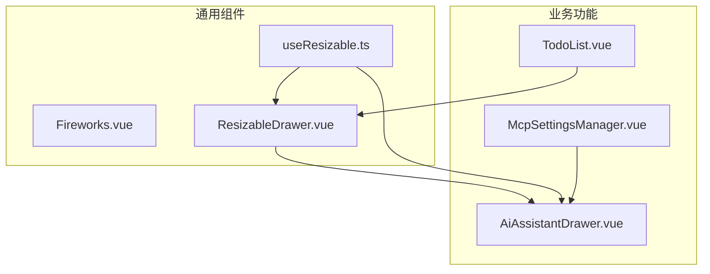
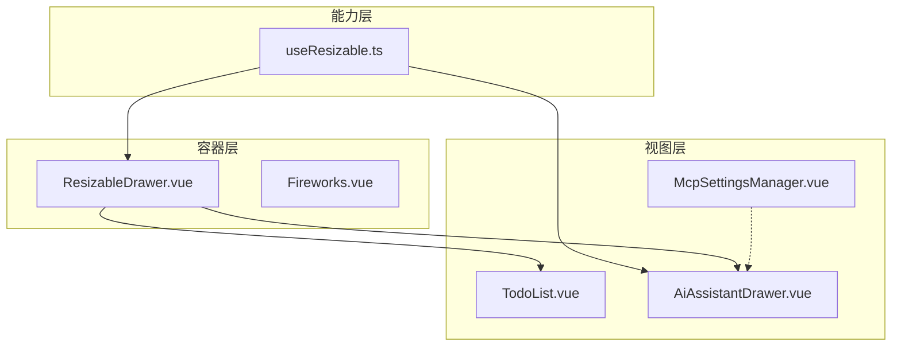
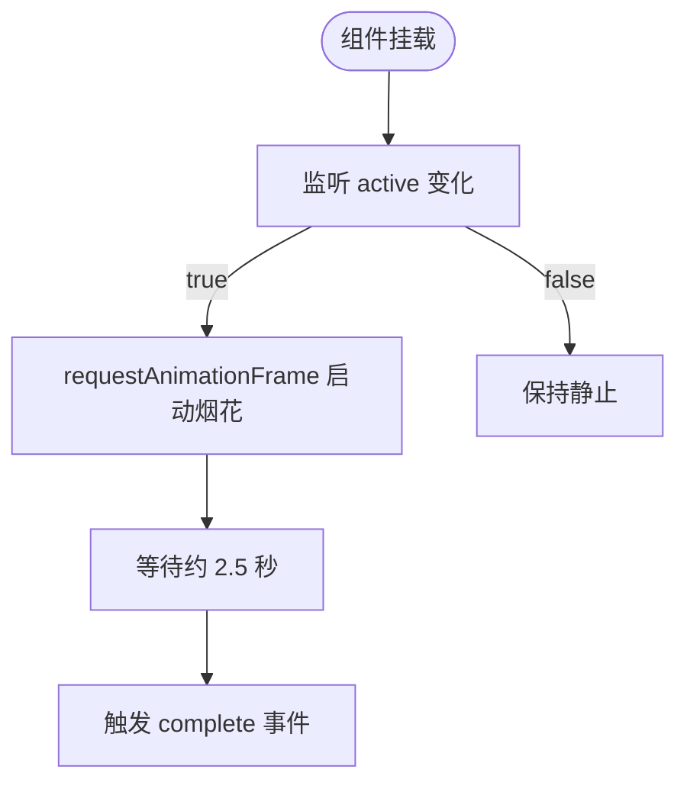
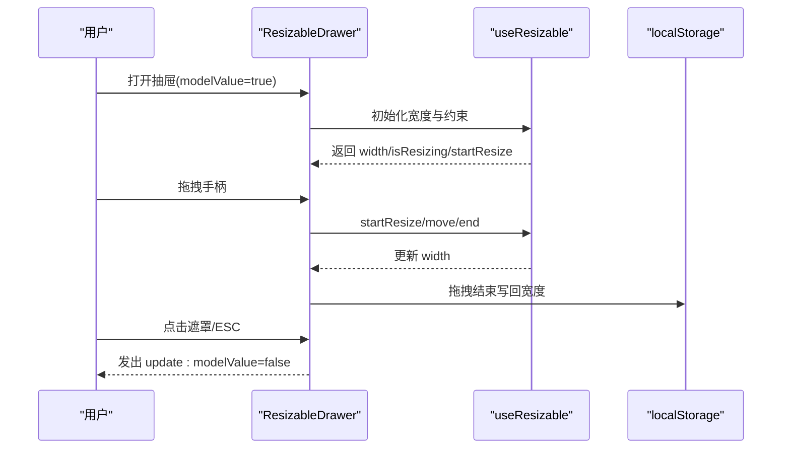
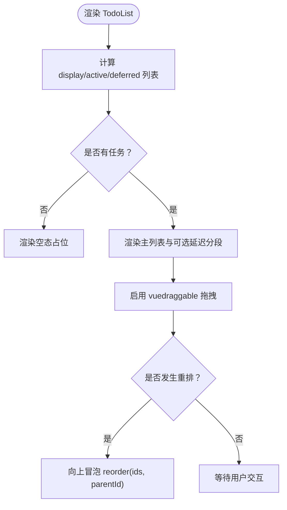
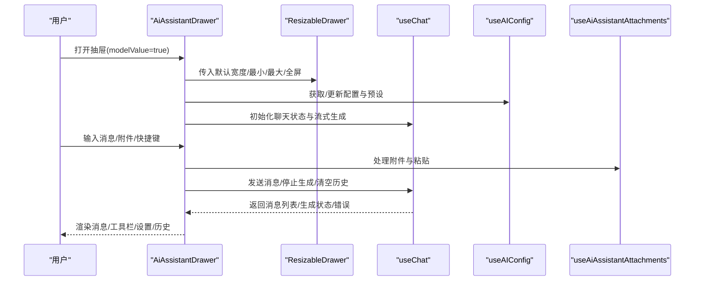
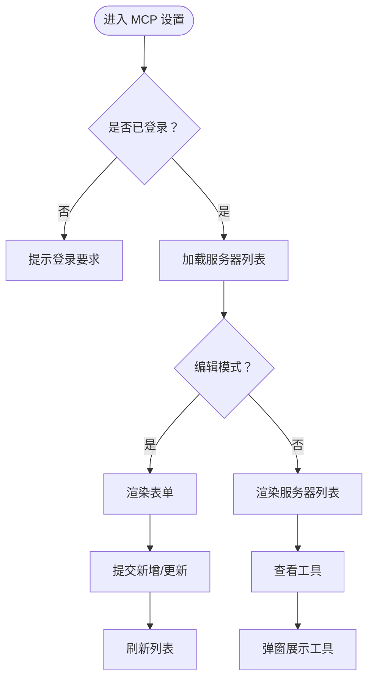
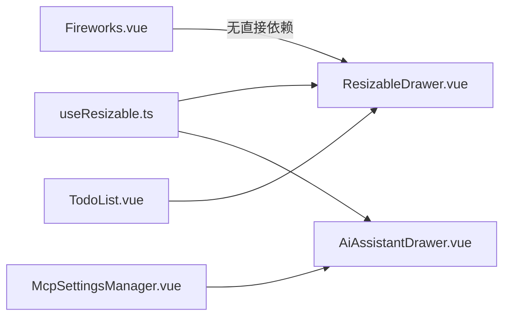

# 专用功能组件

<cite>
**本文引用的文件**
- [apps/frontend/src/components/Fireworks.vue](file://apps/frontend/src/components/Fireworks.vue)
- [apps/frontend/src/components/ResizableDrawer.vue](file://apps/frontend/src/components/ResizableDrawer.vue)
- [apps/frontend/src/composables/useResizable.ts](file://apps/frontend/src/composables/useResizable.ts)
- [apps/frontend/src/features/todo/components/TodoList.vue](file://apps/frontend/src/features/todo/components/TodoList.vue)
- [apps/frontend/src/features/ai/components/AiAssistantDrawer.vue](file://apps/frontend/src/features/ai/components/AiAssistantDrawer.vue)
- [apps/frontend/src/features/mcp/components/McpSettingsManager.vue](file://apps/frontend/src/features/mcp/components/McpSettingsManager.vue)
</cite>

## 目录

1. [简介](#简介)
2. [项目结构](#项目结构)
3. [核心组件](#核心组件)
4. [架构总览](#架构总览)
5. [组件详解](#组件详解)
6. [依赖关系分析](#依赖关系分析)
7. [性能考量](#性能考量)
8. [故障排查指南](#故障排查指南)
9. [结论](#结论)
10. [附录](#附录)

## 简介

本文件聚焦 Lumina Todo 前端中的“专用功能组件”，系统性梳理并解释以下内容：

- 烟花效果组件：基于 Canvas Confetti 的一次性视觉反馈组件，具备自动完成回调与无障碍偏好适配。
- 可调整抽屉：支持宽度记忆、响应式布局、ESC 关闭、拖拽调整、动画过渡与暗色主题适配的通用抽屉容器。
- Todo 任务管理：以 TodoList 为核心的列表渲染、空态、拖拽排序、延迟任务分段展示与交互事件冒泡。
- AI 助手对话：以 AiAssistantDrawer 为核心的对话抽屉容器，整合设置面板、历史覆盖层、附件与快捷键等。
- MCP 工具设置：以 McpSettingsManager 为核心的 MCP 服务器管理、工具查看与全局开关联动。

文档同时阐述组件的状态管理、数据绑定与事件处理机制，并给出可配置性、扩展性与性能优化建议，以及开发模式、集成方法与维护策略。

## 项目结构

前端专用组件主要分布在以下位置：

- 通用 UI 组件：apps/frontend/src/components
- 业务功能组件：apps/frontend/src/features/{todo, ai, mcp}/components
- 可复用组合式函数：apps/frontend/src/composables

图表来源

- [apps/frontend/src/components/Fireworks.vue:1-45](file://apps/frontend/src/components/Fireworks.vue#L1-L45)
- [apps/frontend/src/components/ResizableDrawer.vue:1-408](file://apps/frontend/src/components/ResizableDrawer.vue#L1-L408)
- [apps/frontend/src/composables/useResizable.ts:1-70](file://apps/frontend/src/composables/useResizable.ts#L1-L70)
- [apps/frontend/src/features/todo/components/TodoList.vue:1-316](file://apps/frontend/src/features/todo/components/TodoList.vue#L1-L316)
- [apps/frontend/src/features/ai/components/AiAssistantDrawer.vue:1-393](file://apps/frontend/src/features/ai/components/AiAssistantDrawer.vue#L1-L393)
- [apps/frontend/src/features/mcp/components/McpSettingsManager.vue:1-286](file://apps/frontend/src/features/mcp/components/McpSettingsManager.vue#L1-L286)

章节来源

- [apps/frontend/src/components/Fireworks.vue:1-45](file://apps/frontend/src/components/Fireworks.vue#L1-L45)
- [apps/frontend/src/components/ResizableDrawer.vue:1-408](file://apps/frontend/src/components/ResizableDrawer.vue#L1-L408)
- [apps/frontend/src/composables/useResizable.ts:1-70](file://apps/frontend/src/composables/useResizable.ts#L1-L70)
- [apps/frontend/src/features/todo/components/TodoList.vue:1-316](file://apps/frontend/src/features/todo/components/TodoList.vue#L1-L316)
- [apps/frontend/src/features/ai/components/AiAssistantDrawer.vue:1-393](file://apps/frontend/src/features/ai/components/AiAssistantDrawer.vue#L1-L393)
- [apps/frontend/src/features/mcp/components/McpSettingsManager.vue:1-286](file://apps/frontend/src/features/mcp/components/McpSettingsManager.vue#L1-L286)

## 核心组件

- 烟花效果组件：通过属性驱动触发，内部使用 Canvas Confetti 执行一次性的粒子动画，并在完成后发出完成事件，适合成就达成、操作成功等场景。
- 可调整抽屉：提供宽度记忆、窗口尺寸自适应、移动端与全屏模式切换、ESC 关闭、拖拽调整与动画过渡，作为对话、侧边栏、设置面板等容器。
- Todo 列表：负责任务渲染、空态、拖拽排序、延迟任务分段展示、过滤与搜索逻辑，向上冒泡编辑、删除、重排等事件。
- AI 助手抽屉：以 ResizableDrawer 为基础，整合聊天消息列表、工具栏、输入框、设置与历史覆盖层，支持快捷键、附件与多种模式开关。
- MCP 设置管理：统一管理 MCP 服务器列表、表单编辑、工具查看与全局开关，结合认证状态进行条件渲染与交互。

章节来源

- [apps/frontend/src/components/Fireworks.vue:1-45](file://apps/frontend/src/components/Fireworks.vue#L1-L45)
- [apps/frontend/src/components/ResizableDrawer.vue:1-408](file://apps/frontend/src/components/ResizableDrawer.vue#L1-L408)
- [apps/frontend/src/features/todo/components/TodoList.vue:1-316](file://apps/frontend/src/features/todo/components/TodoList.vue#L1-L316)
- [apps/frontend/src/features/ai/components/AiAssistantDrawer.vue:1-393](file://apps/frontend/src/features/ai/components/AiAssistantDrawer.vue#L1-L393)
- [apps/frontend/src/features/mcp/components/McpSettingsManager.vue:1-286](file://apps/frontend/src/features/mcp/components/McpSettingsManager.vue#L1-L286)

## 架构总览

专用组件围绕“容器 + 组合式能力 + 业务视图”的分层组织：

- 容器层：ResizableDrawer 提供统一的抽屉容器能力；Fireworks 提供一次性视觉反馈。
- 能力层：useResizable 封装拖拽与尺寸约束，被抽屉与 AI 历史面板复用。
- 视图层：TodoList、AiAssistantDrawer、McpSettingsManager 分别承载任务管理、AI 对话与 MCP 设置的业务视图。

图表来源

- [apps/frontend/src/components/ResizableDrawer.vue:1-408](file://apps/frontend/src/components/ResizableDrawer.vue#L1-L408)
- [apps/frontend/src/components/Fireworks.vue:1-45](file://apps/frontend/src/components/Fireworks.vue#L1-L45)
- [apps/frontend/src/composables/useResizable.ts:1-70](file://apps/frontend/src/composables/useResizable.ts#L1-L70)
- [apps/frontend/src/features/todo/components/TodoList.vue:1-316](file://apps/frontend/src/features/todo/components/TodoList.vue#L1-L316)
- [apps/frontend/src/features/ai/components/AiAssistantDrawer.vue:1-393](file://apps/frontend/src/features/ai/components/AiAssistantDrawer.vue#L1-L393)
- [apps/frontend/src/features/mcp/components/McpSettingsManager.vue:1-286](file://apps/frontend/src/features/mcp/components/McpSettingsManager.vue#L1-L286)

## 组件详解

### 烟花效果组件（Fireworks）

- 设计目标：提供轻量、可配置的一次性视觉反馈，避免阻塞主流程。
- 关键特性
  - 属性驱动：通过 active 属性控制是否启动动画。
  - 自动完成：动画约 2.5 秒后触发完成事件，便于上层清理或继续流程。
  - 无障碍偏好：尊重“减少动画”偏好设置，降低对敏感用户的干扰。
  - 无额外 DOM：内部使用 Canvas Confetti 管理画布，组件仅暴露插槽。
- 使用场景：任务完成、成就解锁、导入成功、操作确认等。
- 状态与事件
  - 输入：active（布尔）
  - 输出：complete（无参）
- 性能与可配置性
  - 粒子数量与散布范围可按需调整；动画时长与结束回调用于解耦后续动作。
  - 与减少动画偏好联动，确保低功耗设备体验。

图表来源

- [apps/frontend/src/components/Fireworks.vue:1-45](file://apps/frontend/src/components/Fireworks.vue#L1-L45)

章节来源

- [apps/frontend/src/components/Fireworks.vue:1-45](file://apps/frontend/src/components/Fireworks.vue#L1-L45)

### 可调整抽屉（ResizableDrawer）

- 设计目标：提供可记忆宽度、响应式布局、ESC 关闭、拖拽调整与动画过渡的通用抽屉容器。
- 关键特性
  - 宽度记忆：首次加载从本地存储恢复，拖拽结束写回。
  - 响应式：移动端与全屏模式下自动调整宽度策略。
  - 无障碍：ESC 关闭、键盘可达的拖拽手柄、减少动画偏好适配。
  - 动画：遮罩与抽屉分别使用淡入淡出与滑入滑出过渡。
  - 容器语义：使用 Teleport 将遮罩与抽屉挂载到 body，避免层级与溢出问题。
- 状态与事件
  - 输入：modelValue（布尔）、defaultWidth、minWidth、maxWidth、rightGap、storageKey、isFullscreen。
  - 输出：update:modelValue（布尔）。
- 依赖与复用
  - 复用 useResizable 实现拖拽与尺寸约束。
  - 与 i18n、窗口尺寸、ESC 关闭组合式函数协作。

图表来源

- [apps/frontend/src/components/ResizableDrawer.vue:1-408](file://apps/frontend/src/components/ResizableDrawer.vue#L1-L408)
- [apps/frontend/src/composables/useResizable.ts:1-70](file://apps/frontend/src/composables/useResizable.ts#L1-L70)

章节来源

- [apps/frontend/src/components/ResizableDrawer.vue:1-408](file://apps/frontend/src/components/ResizableDrawer.vue#L1-L408)
- [apps/frontend/src/composables/useResizable.ts:1-70](file://apps/frontend/src/composables/useResizable.ts#L1-L70)

### Todo 任务管理（TodoList）

- 设计目标：高效渲染任务列表、支持空态、拖拽排序、延迟任务分段展示与交互事件冒泡。
- 关键特性
  - 空态：根据过滤器与搜索结果动态呈现不同图标与文案。
  - 拖拽：使用 vuedraggable 支持跨列表与同列表重排，处理 deferredAt 状态一致性。
  - 延迟任务：将“稍后处理”独立为可折叠分段，支持展开/折叠偏好。
  - 事件冒泡：向上抛出 toggle、startEdit、saveEdit、cancelEdit、delete、reorder、editKeydown 等事件。
- 数据与状态
  - 输入：todos、filter、searchQuery、editingId、editingTitle。
  - 计算：displayTodos、activeTodos、deferredTodos、shouldShowDeferredSection、isDeferredSectionExpanded。
- 性能与可配置性
  - 使用 computed 与 v-model 双向绑定减少重渲染。
  - 拖拽动画时长与 ghost/chosen/drag 类控制视觉反馈。
  - 搜索模式禁用拖拽，避免交互冲突。

图表来源

- [apps/frontend/src/features/todo/components/TodoList.vue:1-316](file://apps/frontend/src/features/todo/components/TodoList.vue#L1-L316)

章节来源

- [apps/frontend/src/features/todo/components/TodoList.vue:1-316](file://apps/frontend/src/features/todo/components/TodoList.vue#L1-L316)

### AI 助手对话（AiAssistantDrawer）

- 设计目标：以 ResizableDrawer 为容器，整合聊天消息、工具栏、输入、设置与历史覆盖层，提供一体化对话体验。
- 关键特性
  - 容器：默认宽度随最大化状态变化，移动端与全屏模式自适应。
  - 面板：设置、历史覆盖层、预设下拉、讨论菜单等，支持懒挂载与宽度记忆。
  - 附件：图片与文件上传、粘贴、移除与清空。
  - 快捷键：Command/Ctrl+J 新建对话并打开抽屉。
  - 错误提示：错误信息可复制，支持关闭与自动提示。
- 状态与事件
  - 输入：modelValue（双向）、isMaximized（来自 Todo Store）。
  - 事件：通过子组件向父级冒泡，如 regenerate、delete、edit、select-suggestion、ask-selection 等。
- 依赖与复用
  - 复用 useResizable 控制历史面板宽度。
  - 复用 useChat、useAIConfig、useAiAssistantAttachments、useAiAssistantComposer 等组合式能力。

图表来源

- [apps/frontend/src/features/ai/components/AiAssistantDrawer.vue:1-393](file://apps/frontend/src/features/ai/components/AiAssistantDrawer.vue#L1-L393)
- [apps/frontend/src/components/ResizableDrawer.vue:1-408](file://apps/frontend/src/components/ResizableDrawer.vue#L1-L408)

章节来源

- [apps/frontend/src/features/ai/components/AiAssistantDrawer.vue:1-393](file://apps/frontend/src/features/ai/components/AiAssistantDrawer.vue#L1-L393)

### MCP 工具设置（McpSettingsManager）

- 设计目标：统一管理 MCP 服务器、表单编辑、工具查看与全局开关，结合认证状态进行条件渲染。
- 关键特性
  - 全局开关：受认证状态与 AI 配置影响，点击切换 MCP 开关。
  - 列表与表单：支持新增/编辑服务器，提交失败时记录日志但不阻断界面。
  - 工具查看：弹窗展示服务器工具清单，支持加载状态与空状态提示。
  - 登录态：未登录时提示登录要求，避免无意义的网络请求。
- 状态与事件
  - 输入：服务器列表（来自 store）、认证状态（来自 auth store）。
  - 行为：fetchServers、createServer、updateServer、getTools。
- 可配置性与扩展性
  - 通过 AI 配置联动 MCP 开关，便于集中管理。
  - 弹窗采用毛玻璃与过渡动画，提升交互质感。

图表来源

- [apps/frontend/src/features/mcp/components/McpSettingsManager.vue:1-286](file://apps/frontend/src/features/mcp/components/McpSettingsManager.vue#L1-L286)

章节来源

- [apps/frontend/src/features/mcp/components/McpSettingsManager.vue:1-286](file://apps/frontend/src/features/mcp/components/McpSettingsManager.vue#L1-L286)

## 依赖关系分析

- 组件内聚与耦合
  - ResizableDrawer 与 useResizable 高内聚，职责清晰：容器负责 UI 与交互，组合式函数负责拖拽逻辑。
  - AiAssistantDrawer 作为容器，聚合多个组合式能力，耦合度较高但边界明确。
  - TodoList 与 TodoStore 解耦良好，通过事件冒泡与计算属性维持低耦合。
- 外部依赖
  - Canvas Confetti 用于烟花效果。
  - vuedraggable 用于 Todo 列表拖拽。
  - VueUse 提供窗口尺寸、键盘快捷键、ESC 关闭等能力。
- 循环依赖
  - 未发现循环依赖迹象；组件间通过 props/emits 与组合式函数通信。

图表来源

- [apps/frontend/src/composables/useResizable.ts:1-70](file://apps/frontend/src/composables/useResizable.ts#L1-L70)
- [apps/frontend/src/components/ResizableDrawer.vue:1-408](file://apps/frontend/src/components/ResizableDrawer.vue#L1-L408)
- [apps/frontend/src/features/ai/components/AiAssistantDrawer.vue:1-393](file://apps/frontend/src/features/ai/components/AiAssistantDrawer.vue#L1-L393)
- [apps/frontend/src/features/todo/components/TodoList.vue:1-316](file://apps/frontend/src/features/todo/components/TodoList.vue#L1-L316)
- [apps/frontend/src/features/mcp/components/McpSettingsManager.vue:1-286](file://apps/frontend/src/features/mcp/components/McpSettingsManager.vue#L1-L286)

章节来源

- [apps/frontend/src/composables/useResizable.ts:1-70](file://apps/frontend/src/composables/useResizable.ts#L1-L70)
- [apps/frontend/src/components/ResizableDrawer.vue:1-408](file://apps/frontend/src/components/ResizableDrawer.vue#L1-L408)
- [apps/frontend/src/features/ai/components/AiAssistantDrawer.vue:1-393](file://apps/frontend/src/features/ai/components/AiAssistantDrawer.vue#L1-L393)
- [apps/frontend/src/features/todo/components/TodoList.vue:1-316](file://apps/frontend/src/features/todo/components/TodoList.vue#L1-L316)
- [apps/frontend/src/features/mcp/components/McpSettingsManager.vue:1-286](file://apps/frontend/src/features/mcp/components/McpSettingsManager.vue#L1-L286)

## 性能考量

- 渲染与动画
  - ResizableDrawer 与 AiAssistantDrawer 使用 Transition 与 will-change 提升动画性能；移动端与减少动画偏好下禁用过渡。
  - TodoList 使用 computed 与 v-model 双向绑定，避免不必要的重渲染；拖拽动画时长可控。
- 交互与事件
  - useResizable 在拖拽期间移除 userSelect 并设置 cursor，避免文本选择干扰；拖拽结束统一回收事件监听。
  - AiAssistantDrawer 在快捷键触发新建对话时，先判断是否正在生成，避免并发状态异常。
- 存储与缓存
  - 抽屉宽度与历史面板宽度写入 localStorage，减少重复计算与初始布局抖动。
- 资源与体积
  - Canvas Confetti 仅在需要时触发，避免常驻资源占用。
  - MCP 设置在未登录时避免网络请求，减少无效开销。

## 故障排查指南

- 烟花效果不触发
  - 检查 active 属性是否正确传递；确认动画完成回调是否被消费。
  - 参考：[apps/frontend/src/components/Fireworks.vue:1-45](file://apps/frontend/src/components/Fireworks.vue#L1-L45)
- 抽屉宽度记忆失效
  - 检查 storageKey 是否一致；确认 localStorage 权限与容量。
  - 参考：[apps/frontend/src/components/ResizableDrawer.vue:1-408](file://apps/frontend/src/components/ResizableDrawer.vue#L1-L408)
- 拖拽异常或无法释放
  - 检查 useResizable 的 startResize 与 stopResize 是否成对调用；确认鼠标事件监听是否正确移除。
  - 参考：[apps/frontend/src/composables/useResizable.ts:1-70](file://apps/frontend/src/composables/useResizable.ts#L1-L70)
- Todo 拖拽错位或 deferredAt 不一致
  - 检查拖拽 setter 中对 deferredAt 的即时修正逻辑；确认 computed getter 与 setter 的一致性。
  - 参考：[apps/frontend/src/features/todo/components/TodoList.vue:1-316](file://apps/frontend/src/features/todo/components/TodoList.vue#L1-L316)
- AI 助手快捷键无效
  - 检查 onKeyStroke 的修饰键组合与 isGenerating 状态；确认抽屉可见性与焦点。
  - 参考：[apps/frontend/src/features/ai/components/AiAssistantDrawer.vue:1-393](file://apps/frontend/src/features/ai/components/AiAssistantDrawer.vue#L1-L393)
- MCP 设置无法加载服务器
  - 检查认证状态与 401 错误分支；确认网络请求与错误日志输出。
  - 参考：[apps/frontend/src/features/mcp/components/McpSettingsManager.vue:1-286](file://apps/frontend/src/features/mcp/components/McpSettingsManager.vue#L1-L286)

## 结论

本文档系统梳理了 Lumina Todo 的专用功能组件：烟花效果、可调整抽屉、Todo 列表、AI 助手抽屉与 MCP 设置管理。这些组件通过清晰的职责划分、组合式能力复用与事件冒泡机制，实现了高内聚、低耦合与良好的可扩展性。在性能方面，组件充分利用 computed、动画优化与本地存储，兼顾用户体验与资源效率。建议在后续迭代中持续关注无障碍与性能指标，完善测试覆盖与文档示例，以提升可维护性与可集成性。

## 附录

- 开发模式
  - 采用组合式函数封装可复用逻辑（如 useResizable），组件仅负责 UI 与事件编排。
  - 使用 Teleport 与 Transition 提升容器组件的可用性与动画表现。
- 集成方法
  - 容器组件（ResizableDrawer）可作为任意业务面板的外层容器；业务组件通过 emits 与父级通信。
  - 通过 props 与 v-model 控制状态，结合 i18n 与主题变量实现多语言与主题适配。
- 维护策略
  - 保持组合式函数与组件的单一职责；对外暴露稳定 API 与事件名。
  - 在变更动画或交互时，同步更新减少动画偏好与无障碍相关逻辑。
  - 对外部依赖（如 Canvas Confetti、vuedraggable）进行版本管理与回归测试。
