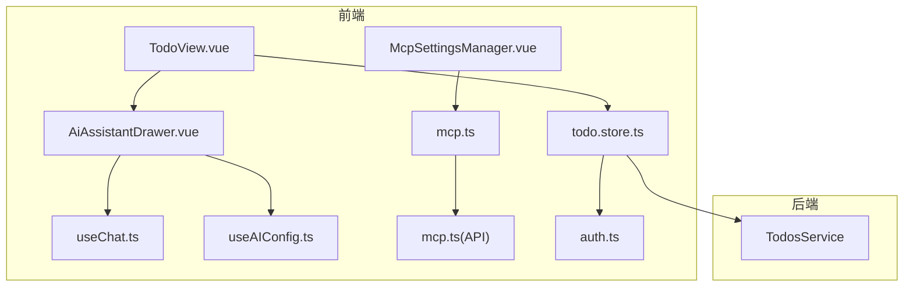
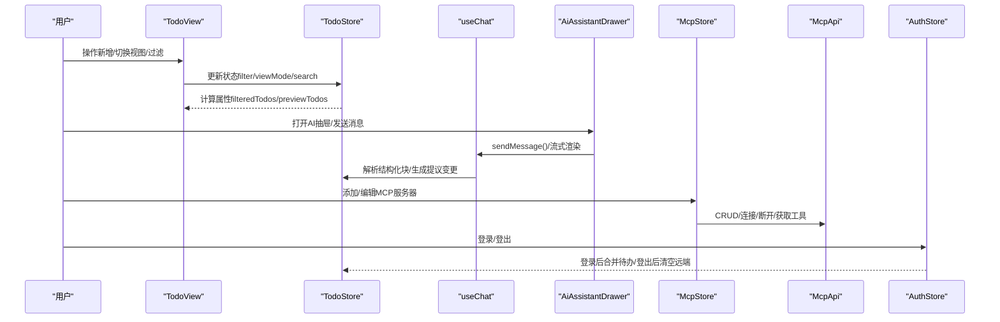
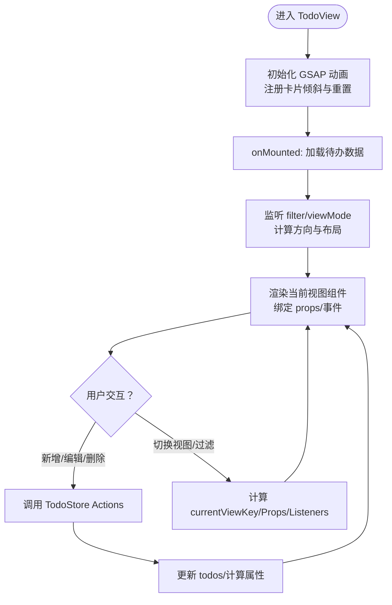
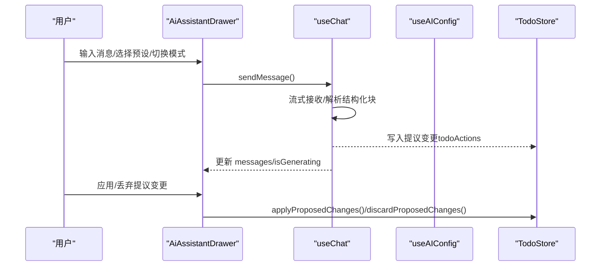
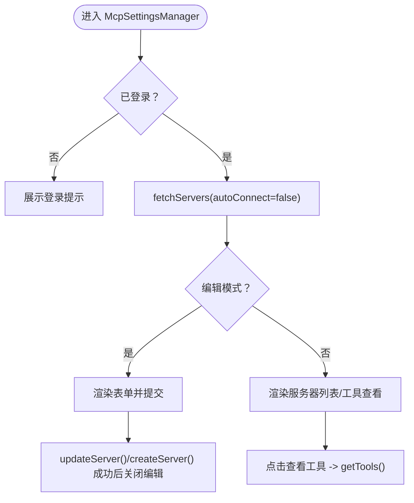
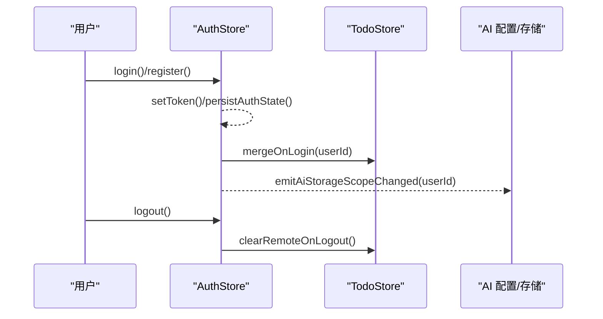
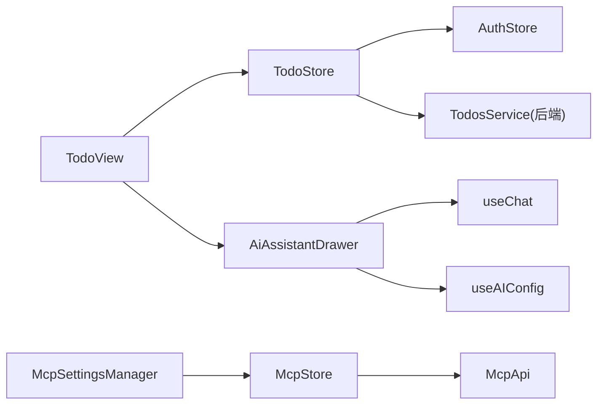

# 功能组件

<cite>
**本文档引用的文件**
- [apps/frontend/src/features/todo/TodoView.vue](file://apps/frontend/src/features/todo/TodoView.vue)
- [apps/frontend/src/features/todo/stores/todo.store.ts](file://apps/frontend/src/features/todo/stores/todo.store.ts)
- [apps/frontend/src/features/todo/stores/todo.ts](file://apps/frontend/src/features/todo/stores/todo.ts)
- [apps/frontend/src/features/ai/components/AiAssistantDrawer.vue](file://apps/frontend/src/features/ai/components/AiAssistantDrawer.vue)
- [apps/frontend/src/features/ai/composables/useChat.ts](file://apps/frontend/src/features/ai/composables/useChat.ts)
- [apps/frontend/src/features/ai/composables/useAIConfig.ts](file://apps/frontend/src/features/ai/composables/useAIConfig.ts)
- [apps/frontend/src/features/mcp/components/McpSettingsManager.vue](file://apps/frontend/src/features/mcp/components/McpSettingsManager.vue)
- [apps/frontend/src/features/mcp/stores/mcp.ts](file://apps/frontend/src/features/mcp/stores/mcp.ts)
- [apps/frontend/src/features/mcp/api/mcp.ts](file://apps/frontend/src/features/mcp/api/mcp.ts)
- [apps/frontend/src/features/auth/stores/auth.ts](file://apps/frontend/src/features/auth/stores/auth.ts)
- [apps/backend/src/todos/todos.service.ts](file://apps/backend/src/todos/todos.service.ts)
</cite>

## 目录
1. [简介](#简介)
2. [项目结构](#项目结构)
3. [核心组件](#核心组件)
4. [架构总览](#架构总览)
5. [组件详解](#组件详解)
6. [依赖关系分析](#依赖关系分析)
7. [性能考量](#性能考量)
8. [故障排查指南](#故障排查指南)
9. [结论](#结论)
10. [附录](#附录)

## 简介
本文件聚焦 Lumina Todo 的功能组件，系统性梳理 Todo 列表、AI 助手、MCP 设置与用户认证四大核心功能模块的设计架构、实现策略与协作机制。文档从组件结构、状态管理、数据绑定与事件处理入手，解释组件间如何通过 Pinia Store、HTTP 客户端与 WebSocket 事件进行通信；同时给出可配置性、扩展性与复用性的设计要点，并提供开发模式、测试方法与维护策略建议。

## 项目结构
前端采用按特性分层的组织方式：
- features/todo：待办事项主界面与状态管理
- features/ai：AI 助手抽屉、对话与配置
- features/mcp：MCP 服务器配置与工具管理
- features/auth：认证状态与令牌刷新
- backend/todos：后端待办服务，提供 CRUD 与回收站操作

图表来源
- [apps/frontend/src/features/todo/TodoView.vue:1-522](file://apps/frontend/src/features/todo/TodoView.vue#L1-L522)
- [apps/frontend/src/features/todo/stores/todo.store.ts:1-389](file://apps/frontend/src/features/todo/stores/todo.store.ts#L1-L389)
- [apps/frontend/src/features/ai/components/AiAssistantDrawer.vue:1-393](file://apps/frontend/src/features/ai/components/AiAssistantDrawer.vue#L1-L393)
- [apps/frontend/src/features/ai/composables/useChat.ts:1-136](file://apps/frontend/src/features/ai/composables/useChat.ts#L1-L136)
- [apps/frontend/src/features/ai/composables/useAIConfig.ts:1-200](file://apps/frontend/src/features/ai/composables/useAIConfig.ts#L1-L200)
- [apps/frontend/src/features/mcp/components/McpSettingsManager.vue:1-286](file://apps/frontend/src/features/mcp/components/McpSettingsManager.vue#L1-L286)
- [apps/frontend/src/features/mcp/stores/mcp.ts:1-246](file://apps/frontend/src/features/mcp/stores/mcp.ts#L1-L246)
- [apps/frontend/src/features/mcp/api/mcp.ts:1-108](file://apps/frontend/src/features/mcp/api/mcp.ts#L1-L108)
- [apps/frontend/src/features/auth/stores/auth.ts:1-413](file://apps/frontend/src/features/auth/stores/auth.ts#L1-L413)
- [apps/backend/src/todos/todos.service.ts:1-147](file://apps/backend/src/todos/todos.service.ts#L1-L147)

章节来源
- [apps/frontend/src/features/todo/TodoView.vue:1-522](file://apps/frontend/src/features/todo/TodoView.vue#L1-L522)
- [apps/frontend/src/features/todo/stores/todo.store.ts:1-389](file://apps/frontend/src/features/todo/stores/todo.store.ts#L1-L389)
- [apps/frontend/src/features/ai/components/AiAssistantDrawer.vue:1-393](file://apps/frontend/src/features/ai/components/AiAssistantDrawer.vue#L1-L393)
- [apps/frontend/src/features/mcp/components/McpSettingsManager.vue:1-286](file://apps/frontend/src/features/mcp/components/McpSettingsManager.vue#L1-L286)
- [apps/frontend/src/features/auth/stores/auth.ts:1-413](file://apps/frontend/src/features/auth/stores/auth.ts#L1-L413)
- [apps/backend/src/todos/todos.service.ts:1-147](file://apps/backend/src/todos/todos.service.ts#L1-L147)

## 核心组件
- Todo 列表与视图
  - TodoView 负责布局、动画与视图切换，委托具体子组件渲染不同视图（列表/可视化/统计/便签）。
  - TodoStore 统一管理待办数据、过滤器、视图模式、搜索、拖拽、提议变更与云端同步状态。
- AI 助手
  - AiAssistantDrawer 抽屉容器，集成聊天面板、工具栏、输入区、历史与设置。
  - useChat 聚合状态与动作，负责消息流式渲染、结构化块解析与提议变更联动。
  - useAIConfig 管理全局 AI 配置、预设与上下文压缩等参数。
- MCP 设置
  - McpSettingsManager 管理 MCP 服务器列表、表单与工具查看；受认证状态与 AI 配置影响。
  - mcp.store/mcp.api 提供服务器 CRUD、连接/断开、工具查询与调用。
- 用户认证
  - auth.store 管理令牌、刷新、用户信息与跨页面持久化；登录/注册后触发待办合并与匿名迁移。

章节来源
- [apps/frontend/src/features/todo/TodoView.vue:1-522](file://apps/frontend/src/features/todo/TodoView.vue#L1-L522)
- [apps/frontend/src/features/todo/stores/todo.store.ts:1-389](file://apps/frontend/src/features/todo/stores/todo.store.ts#L1-L389)
- [apps/frontend/src/features/ai/components/AiAssistantDrawer.vue:1-393](file://apps/frontend/src/features/ai/components/AiAssistantDrawer.vue#L1-L393)
- [apps/frontend/src/features/ai/composables/useChat.ts:1-136](file://apps/frontend/src/features/ai/composables/useChat.ts#L1-L136)
- [apps/frontend/src/features/ai/composables/useAIConfig.ts:1-200](file://apps/frontend/src/features/ai/composables/useAIConfig.ts#L1-L200)
- [apps/frontend/src/features/mcp/components/McpSettingsManager.vue:1-286](file://apps/frontend/src/features/mcp/components/McpSettingsManager.vue#L1-L286)
- [apps/frontend/src/features/mcp/stores/mcp.ts:1-246](file://apps/frontend/src/features/mcp/stores/mcp.ts#L1-L246)
- [apps/frontend/src/features/mcp/api/mcp.ts:1-108](file://apps/frontend/src/features/mcp/api/mcp.ts#L1-L108)
- [apps/frontend/src/features/auth/stores/auth.ts:1-413](file://apps/frontend/src/features/auth/stores/auth.ts#L1-L413)

## 架构总览
整体采用“视图-组合式函数-状态存储-外部服务”的分层架构：
- 视图层：TodoView、AiAssistantDrawer、McpSettingsManager
- 组合式函数：useChat、useAIConfig、useTodo 等
- 状态存储：Pinia Store（todo、mcp、auth）
- 外部服务：HTTP API（mcp.ts、auth.ts）、WebSocket（由 todo.cloud 集成）

图表来源
- [apps/frontend/src/features/todo/TodoView.vue:1-522](file://apps/frontend/src/features/todo/TodoView.vue#L1-L522)
- [apps/frontend/src/features/todo/stores/todo.store.ts:1-389](file://apps/frontend/src/features/todo/stores/todo.store.ts#L1-L389)
- [apps/frontend/src/features/ai/components/AiAssistantDrawer.vue:1-393](file://apps/frontend/src/features/ai/components/AiAssistantDrawer.vue#L1-L393)
- [apps/frontend/src/features/ai/composables/useChat.ts:1-136](file://apps/frontend/src/features/ai/composables/useChat.ts#L1-L136)
- [apps/frontend/src/features/mcp/stores/mcp.ts:1-246](file://apps/frontend/src/features/mcp/stores/mcp.ts#L1-L246)
- [apps/frontend/src/features/mcp/api/mcp.ts:1-108](file://apps/frontend/src/features/mcp/api/mcp.ts#L1-L108)
- [apps/frontend/src/features/auth/stores/auth.ts:1-413](file://apps/frontend/src/features/auth/stores/auth.ts#L1-L413)

## 组件详解

### Todo 列表与视图
- 结构与职责
  - TodoView：布局容器、鼠标交互与卡片倾斜动画、视图切换与过渡、输入区可见性控制、冲突面板与图片任务抽取对话框。
  - 子组件：TodoHeader、TodoInput、TodoFilter、TodoSearch、TodoList、TodoVisualizer、TodoStatistics、TodoScratchpad、PomodoroTimer、TodoSyncConflictPanel、TodoImageTaskConfirmDialog。
- 状态管理
  - TodoStore：todos、filter、viewMode、searchQuery、todoExpansionState、proposedChangeSets、syncConflicts、todoSource（local/remote）、loading/error/isDragging 等。
  - 计算属性：filteredTodos、previewTodos、visualTodos、pendingCount/completedCount、isAllExpanded。
- 数据绑定与事件
  - v-model 双向绑定 filter、viewMode、searchQuery、isDrawerOpen、editingId/editingTitle。
  - 事件监听：toggle/delete/reorder/startEdit/saveEdit/cancelEdit 等，统一委托给 useTodo 与 TodoStore 的 actions。
- 云端同步与冲突
  - 通过 createTodoCloud 集成，支持合并登录用户数据、接受/重试/清除冲突、清理回收站、永久删除等。
- 动画与交互
  - 使用 GSAP 在 mounted/watch 中注册动画函数，根据鼠标位置计算倾斜角度；视图切换使用自定义 Transition + GSAP 实现流畅过渡。

图表来源
- [apps/frontend/src/features/todo/TodoView.vue:1-522](file://apps/frontend/src/features/todo/TodoView.vue#L1-L522)
- [apps/frontend/src/features/todo/stores/todo.store.ts:1-389](file://apps/frontend/src/features/todo/stores/todo.store.ts#L1-L389)

章节来源
- [apps/frontend/src/features/todo/TodoView.vue:1-522](file://apps/frontend/src/features/todo/TodoView.vue#L1-L522)
- [apps/frontend/src/features/todo/stores/todo.store.ts:1-389](file://apps/frontend/src/features/todo/stores/todo.store.ts#L1-L389)

### AI 助手
- 结构与职责
  - AiAssistantDrawer：可调整宽度的抽屉，承载 ChatMessageList、AiAssistantToolbar、AiAssistantInput、错误提示、历史覆盖层与设置弹窗。
  - useChat：聚合状态（聊天历史、流式响应、思考/推理/讨论步骤、提议变更）、动作（发送、停止生成、重新生成、删除、编辑再发）。
  - useAIConfig：全局 AI 配置与预设管理，含模型、温度、系统提示、思考模式、讨论模式、图像生成、MCP 开关、上下文压缩等。
- 数据流
  - 输入 compose 后经 sendMessage 触发流式响应，useChat 通过 parseAssistantBlocks 解析结构化块（如 todoActions），写入 chatHistory 并联动 TodoStore 的提议变更。
  - 错误通过 toast 提示，支持复制错误信息。
- 与 Todo 的协作
  - 当 AI 返回 todoActions 时，TodoStore 生成提议变更集，允许用户批量应用或丢弃。
  - TodoView 通过 isDrawerOpen 控制抽屉挂载时机，避免不必要的渲染。

图表来源
- [apps/frontend/src/features/ai/components/AiAssistantDrawer.vue:1-393](file://apps/frontend/src/features/ai/components/AiAssistantDrawer.vue#L1-L393)
- [apps/frontend/src/features/ai/composables/useChat.ts:1-136](file://apps/frontend/src/features/ai/composables/useChat.ts#L1-L136)
- [apps/frontend/src/features/ai/composables/useAIConfig.ts:1-200](file://apps/frontend/src/features/ai/composables/useAIConfig.ts#L1-L200)
- [apps/frontend/src/features/todo/stores/todo.store.ts:300-367](file://apps/frontend/src/features/todo/stores/todo.store.ts#L300-L367)

章节来源
- [apps/frontend/src/features/ai/components/AiAssistantDrawer.vue:1-393](file://apps/frontend/src/features/ai/components/AiAssistantDrawer.vue#L1-L393)
- [apps/frontend/src/features/ai/composables/useChat.ts:1-136](file://apps/frontend/src/features/ai/composables/useChat.ts#L1-L136)
- [apps/frontend/src/features/ai/composables/useAIConfig.ts:1-200](file://apps/frontend/src/features/ai/composables/useAIConfig.ts#L1-L200)
- [apps/frontend/src/features/todo/stores/todo.store.ts:300-367](file://apps/frontend/src/features/todo/stores/todo.store.ts#L300-L367)

### MCP 设置
- 结构与职责
  - McpSettingsManager：MCP 全局开关、服务器列表、表单编辑、工具查看弹窗。
  - mcp.store：管理服务器列表、连接/断开状态、错误信息、加载状态与工具查询。
  - mcp.api：封装 /mcp/* 接口，包括连接/断开、工具调用、超时控制。
- 与认证/AI 的耦合
  - 仅在用户已登录时允许加载/编辑服务器；MCP 开关受 AI 配置控制。
- 生命周期
  - onMounted 仅在已登录时拉取服务器列表；提交成功后关闭编辑态。

图表来源
- [apps/frontend/src/features/mcp/components/McpSettingsManager.vue:1-286](file://apps/frontend/src/features/mcp/components/McpSettingsManager.vue#L1-L286)
- [apps/frontend/src/features/mcp/stores/mcp.ts:1-246](file://apps/frontend/src/features/mcp/stores/mcp.ts#L1-L246)
- [apps/frontend/src/features/mcp/api/mcp.ts:1-108](file://apps/frontend/src/features/mcp/api/mcp.ts#L1-L108)
- [apps/frontend/src/features/auth/stores/auth.ts:1-413](file://apps/frontend/src/features/auth/stores/auth.ts#L1-L413)
- [apps/frontend/src/features/ai/composables/useAIConfig.ts:1-200](file://apps/frontend/src/features/ai/composables/useAIConfig.ts#L1-L200)

章节来源
- [apps/frontend/src/features/mcp/components/McpSettingsManager.vue:1-286](file://apps/frontend/src/features/mcp/components/McpSettingsManager.vue#L1-L286)
- [apps/frontend/src/features/mcp/stores/mcp.ts:1-246](file://apps/frontend/src/features/mcp/stores/mcp.ts#L1-L246)
- [apps/frontend/src/features/mcp/api/mcp.ts:1-108](file://apps/frontend/src/features/mcp/api/mcp.ts#L1-L108)
- [apps/frontend/src/features/auth/stores/auth.ts:1-413](file://apps/frontend/src/features/auth/stores/auth.ts#L1-L413)
- [apps/frontend/src/features/ai/composables/useAIConfig.ts:1-200](file://apps/frontend/src/features/ai/composables/useAIConfig.ts#L1-L200)

### 用户认证
- 关键能力
  - 登录/注册：成功后立即 setToken 并持久化；触发待办合并与匿名迁移。
  - 刷新令牌：带重试与瞬时错误处理；401 时自动登出。
  - 获取当前用户：失败时区分瞬时与未授权错误。
  - 登出：清理本地状态与持久化，通知后端注销并回退到本地视图。
- 与 Todo 的联动
  - 登录后合并远端待办；登出后清空远端数据并重置同步状态。
- 与 AI 的联动
  - 认证状态变化时触发 AI 存储作用域变更事件。

图表来源
- [apps/frontend/src/features/auth/stores/auth.ts:1-413](file://apps/frontend/src/features/auth/stores/auth.ts#L1-L413)
- [apps/frontend/src/features/todo/stores/todo.store.ts:255-299](file://apps/frontend/src/features/todo/stores/todo.store.ts#L255-L299)
- [apps/frontend/src/features/ai/composables/useAIConfig.ts:1-200](file://apps/frontend/src/features/ai/composables/useAIConfig.ts#L1-L200)

章节来源
- [apps/frontend/src/features/auth/stores/auth.ts:1-413](file://apps/frontend/src/features/auth/stores/auth.ts#L1-L413)
- [apps/frontend/src/features/todo/stores/todo.store.ts:255-299](file://apps/frontend/src/features/todo/stores/todo.store.ts#L255-L299)
- [apps/frontend/src/features/ai/composables/useAIConfig.ts:1-200](file://apps/frontend/src/features/ai/composables/useAIConfig.ts#L1-L200)

## 依赖关系分析
- 组件内聚与耦合
  - TodoView 对子组件高度解耦，通过 props/事件传递数据与回调；与 TodoStore 的耦合集中在计算属性与动作调用。
  - AiAssistantDrawer 依赖多个组合式函数与 store，形成“容器-聚合”模式，便于测试与复用。
  - McpSettingsManager 与 mcp.store/mcp.api 强耦合，但 UI 层保持简洁，利于替换。
- 外部依赖
  - HTTP 客户端：mcp.ts、auth.ts、todo.cloud（由 todo.store 引入）。
  - WebSocket：由 todo.cloud 初始化 socket 监听，实现增量同步。
- 循环依赖规避
  - store 间通过动态导入（如登录后导入 TodoStore）避免循环引用。

图表来源
- [apps/frontend/src/features/todo/TodoView.vue:1-522](file://apps/frontend/src/features/todo/TodoView.vue#L1-L522)
- [apps/frontend/src/features/todo/stores/todo.store.ts:1-389](file://apps/frontend/src/features/todo/stores/todo.store.ts#L1-L389)
- [apps/frontend/src/features/ai/components/AiAssistantDrawer.vue:1-393](file://apps/frontend/src/features/ai/components/AiAssistantDrawer.vue#L1-L393)
- [apps/frontend/src/features/ai/composables/useChat.ts:1-136](file://apps/frontend/src/features/ai/composables/useChat.ts#L1-L136)
- [apps/frontend/src/features/ai/composables/useAIConfig.ts:1-200](file://apps/frontend/src/features/ai/composables/useAIConfig.ts#L1-L200)
- [apps/frontend/src/features/mcp/components/McpSettingsManager.vue:1-286](file://apps/frontend/src/features/mcp/components/McpSettingsManager.vue#L1-L286)
- [apps/frontend/src/features/mcp/stores/mcp.ts:1-246](file://apps/frontend/src/features/mcp/stores/mcp.ts#L1-L246)
- [apps/frontend/src/features/mcp/api/mcp.ts:1-108](file://apps/frontend/src/features/mcp/api/mcp.ts#L1-L108)
- [apps/frontend/src/features/auth/stores/auth.ts:1-413](file://apps/frontend/src/features/auth/stores/auth.ts#L1-L413)
- [apps/backend/src/todos/todos.service.ts:1-147](file://apps/backend/src/todos/todos.service.ts#L1-L147)

章节来源
- [apps/frontend/src/features/todo/TodoView.vue:1-522](file://apps/frontend/src/features/todo/TodoView.vue#L1-L522)
- [apps/frontend/src/features/todo/stores/todo.store.ts:1-389](file://apps/frontend/src/features/todo/stores/todo.store.ts#L1-L389)
- [apps/frontend/src/features/ai/components/AiAssistantDrawer.vue:1-393](file://apps/frontend/src/features/ai/components/AiAssistantDrawer.vue#L1-L393)
- [apps/frontend/src/features/mcp/components/McpSettingsManager.vue:1-286](file://apps/frontend/src/features/mcp/components/McpSettingsManager.vue#L1-L286)
- [apps/frontend/src/features/auth/stores/auth.ts:1-413](file://apps/frontend/src/features/auth/stores/auth.ts#L1-L413)
- [apps/backend/src/todos/todos.service.ts:1-147](file://apps/backend/src/todos/todos.service.ts#L1-L147)

## 性能考量
- 渲染性能
  - TodoView 使用 Transition + GSAP 自定义 enter/leave 钩子，避免全量重绘；KeepAlive 缓存关键视图组件。
  - TodoList/Visualizer/Statistics 通过 key 与 props 精准更新，减少不必要的重渲染。
- 状态与计算
  - TodoStore 将过滤、排序、提议变更预计算为计算属性，降低模板复杂度。
  - useChat 的 messages 合并流式响应与历史，避免重复渲染。
- 网络与 IO
  - mcp.api 对工具查询/调用设置合理超时；MCP 连接最长可达 5 分钟，避免误判失败。
  - TodoStore 的 debounceSync 与批量应用提议变更，减少频繁网络请求。
- 动画与交互
  - GSAP 使用 will-change 与 clearProps 优化性能；卡片倾斜基于鼠标位置，移动端可降级。

[本节为通用指导，不直接分析具体文件]

## 故障排查指南
- 认证相关
  - 401 未授权：刷新令牌失败或后端注销，检查 refreshToken 与 setToken 同步；必要时触发 logout 清理。
  - 瞬时错误：网络中断/超时，等待自动重试或手动刷新。
- Todo 同步
  - 冲突面板：优先接受/重试；若持续失败，清理冲突或切换源（local/remote）。
  - 回收站：确认后端清理接口返回与广播事件是否触发。
- AI 助手
  - 流式响应异常：检查 parseAssistantBlocks 与 useChatState 的状态同步；查看错误提示与复制错误。
  - 提议变更未生效：确认 TodoStore 的提议变更集与 applyProposedChanges 调用链。
- MCP
  - 连接失败：查看 serverErrors 与 connectingStates；确认传输类型与配置变更导致的重连。
  - 工具列表为空：检查 getTools 超时与后端工具清单。

章节来源
- [apps/frontend/src/features/auth/stores/auth.ts:296-341](file://apps/frontend/src/features/auth/stores/auth.ts#L296-L341)
- [apps/frontend/src/features/todo/stores/todo.store.ts:210-232](file://apps/frontend/src/features/todo/stores/todo.store.ts#L210-L232)
- [apps/frontend/src/features/ai/composables/useChat.ts:104-124](file://apps/frontend/src/features/ai/composables/useChat.ts#L104-L124)
- [apps/frontend/src/features/mcp/stores/mcp.ts:175-202](file://apps/frontend/src/features/mcp/stores/mcp.ts#L175-L202)
- [apps/frontend/src/features/mcp/api/mcp.ts:59-65](file://apps/frontend/src/features/mcp/api/mcp.ts#L59-L65)

## 结论
Lumina Todo 的功能组件围绕“视图-组合式函数-状态存储-外部服务”的清晰边界构建，具备良好的可配置性、扩展性与复用性。TodoView 与 AiAssistantDrawer 通过 Pinia Store 与 HTTP/WebSocket 实现松耦合协作；MCP 设置与认证模块分别在权限与配置层面提供可控扩展点。遵循本文档的开发模式与测试策略，可在保证性能与稳定性的同时快速迭代新功能。

[本节为总结性内容，不直接分析具体文件]

## 附录
- 开发模式
  - 组件拆分：容器组件负责布局与事件，展示组件专注渲染；组合式函数封装可复用逻辑。
  - 状态集中：Pinia Store 聚合业务状态，计算属性驱动视图；必要时使用动态导入避免循环。
  - 事件驱动：通过 props/事件与 store 动作解耦，便于单元测试与集成测试。
- 测试方法
  - 单元测试：对组合式函数（useChat、useAIConfig、mcp.store）进行纯函数与状态变更测试。
  - 组件测试：对 TodoView、AiAssistantDrawer、McpSettingsManager 进行快照与交互测试。
  - 集成测试：模拟登录/登出、MCP 连接、流式消息与提议变更应用。
- 维护策略
  - 版本演进：严格区分配置项与运行时状态；对破坏性变更提供迁移脚本。
  - 性能监控：关注渲染次数、GSAP 动画帧率与网络请求耗时；定期清理无用缓存。
  - 安全加固：令牌刷新与错误上报需脱敏；MCP 工具调用需校验与超时控制。

[本节为通用指导，不直接分析具体文件]