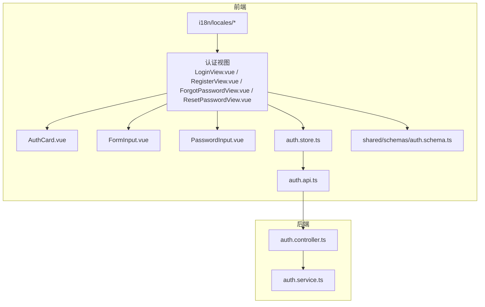
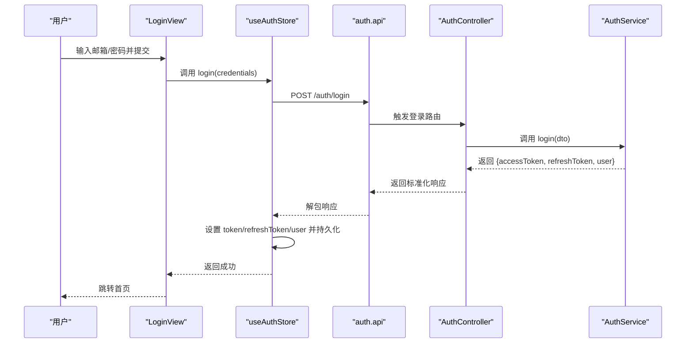
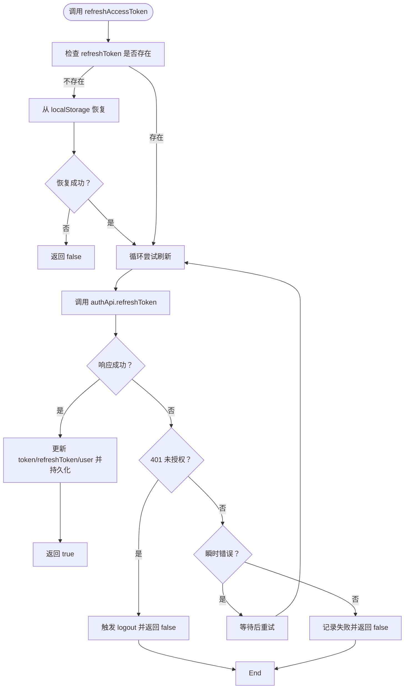
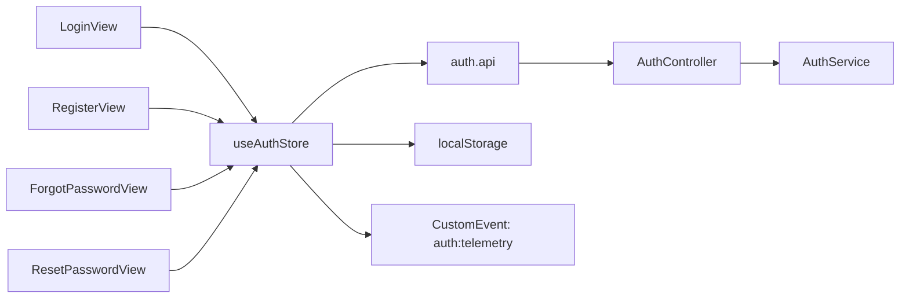

# 认证组件

<cite>
**本文引用的文件**
- [apps/frontend/src/components/auth/AuthCard.vue](file://apps/frontend/src/components/auth/AuthCard.vue)
- [apps/frontend/src/components/auth/FormInput.vue](file://apps/frontend/src/components/auth/FormInput.vue)
- [apps/frontend/src/components/auth/PasswordInput.vue](file://apps/frontend/src/components/auth/PasswordInput.vue)
- [apps/frontend/src/features/auth/stores/auth.ts](file://apps/frontend/src/features/auth/stores/auth.ts)
- [apps/frontend/src/features/auth/views/LoginView.vue](file://apps/frontend/src/features/auth/views/LoginView.vue)
- [apps/frontend/src/features/auth/views/RegisterView.vue](file://apps/frontend/src/features/auth/views/RegisterView.vue)
- [apps/frontend/src/features/auth/views/ForgotPasswordView.vue](file://apps/frontend/src/features/auth/views/ForgotPasswordView.vue)
- [apps/frontend/src/features/auth/views/ResetPasswordView.vue](file://apps/frontend/src/features/auth/views/ResetPasswordView.vue)
- [apps/frontend/src/features/auth/api/index.ts](file://apps/frontend/src/features/auth/api/index.ts)
- [packages/shared/src/schemas/auth.schema.ts](file://packages/shared/src/schemas/auth.schema.ts)
- [apps/backend/src/auth/auth.controller.ts](file://apps/backend/src/auth/auth.controller.ts)
- [apps/backend/src/auth/auth.service.ts](file://apps/backend/src/auth/auth.service.ts)
- [apps/frontend/src/i18n/locales/en-US/auth.ts](file://apps/frontend/src/i18n/locales/en-US/auth.ts)
- [apps/frontend/src/i18n/locales/zh-CN/auth.ts](file://apps/frontend/src/i18n/locales/zh-CN/auth.ts)
- [apps/frontend/tests/components/auth/FormInput.spec.ts](file://apps/frontend/tests/components/auth/FormInput.spec.ts)
- [apps/frontend/tests/components/auth/PasswordInput.spec.ts](file://apps/frontend/tests/components/auth/PasswordInput.spec.ts)
</cite>

## 目录
1. [简介](#简介)
2. [项目结构](#项目结构)
3. [核心组件](#核心组件)
4. [架构总览](#架构总览)
5. [详细组件分析](#详细组件分析)
6. [依赖关系分析](#依赖关系分析)
7. [性能考量](#性能考量)
8. [故障排查指南](#故障排查指南)
9. [结论](#结论)
10. [附录](#附录)

## 简介
本文件系统性梳理 Lumina Todo 的认证组件，覆盖前端认证 UI 组件、Pinia 状态管理、视图层交互、前后端接口契约以及共享验证模型。重点解释认证卡片、表单输入、密码输入等核心组件的设计与行为；阐述登录、注册、忘记密码、重置密码等认证视图的组件结构与交互逻辑；说明状态管理、表单验证与错误处理机制；给出组件协作模式、安全考虑与用户体验优化建议，并提供开发模式、测试方法与安全最佳实践。

## 项目结构
认证相关代码主要分布在前端应用的 features/auth 子目录与 components/auth 子目录，同时共享验证模型位于 packages/shared 中，后端认证控制器与服务位于 apps/backend。

图表来源
- [apps/frontend/src/features/auth/views/LoginView.vue:1-142](file://apps/frontend/src/features/auth/views/LoginView.vue#L1-L142)
- [apps/frontend/src/features/auth/stores/auth.ts:1-413](file://apps/frontend/src/features/auth/stores/auth.ts#L1-L413)
- [apps/frontend/src/features/auth/api/index.ts:1-93](file://apps/frontend/src/features/auth/api/index.ts#L1-L93)
- [apps/backend/src/auth/auth.controller.ts:1-81](file://apps/backend/src/auth/auth.controller.ts#L1-L81)
- [apps/backend/src/auth/auth.service.ts:1-127](file://apps/backend/src/auth/auth.service.ts#L1-L127)
- [packages/shared/src/schemas/auth.schema.ts:1-121](file://packages/shared/src/schemas/auth.schema.ts#L1-L121)

章节来源
- [apps/frontend/src/features/auth/views/LoginView.vue:1-142](file://apps/frontend/src/features/auth/views/LoginView.vue#L1-L142)
- [apps/frontend/src/features/auth/stores/auth.ts:1-413](file://apps/frontend/src/features/auth/stores/auth.ts#L1-L413)
- [apps/frontend/src/features/auth/api/index.ts:1-93](file://apps/frontend/src/features/auth/api/index.ts#L1-L93)
- [apps/backend/src/auth/auth.controller.ts:1-81](file://apps/backend/src/auth/auth.controller.ts#L1-L81)
- [apps/backend/src/auth/auth.service.ts:1-127](file://apps/backend/src/auth/auth.service.ts#L1-L127)
- [packages/shared/src/schemas/auth.schema.ts:1-121](file://packages/shared/src/schemas/auth.schema.ts#L1-L121)

## 核心组件
- 认证卡片 AuthCard：提供统一的卡片布局、返回首页按钮、背景装饰与动画入场效果，作为各认证视图的基础容器。
- 表单输入 FormInput：通用输入控件，支持标签、占位符、图标插槽、禁用态、错误提示与 i18n 翻译。
- 密码输入 PasswordInput：在 FormInput 基础上增加“显示/隐藏”切换与锁形图标，适配密码字段。
- 认证状态管理 useAuthStore：集中管理 token、刷新令牌、用户信息、加载与错误状态；封装登录、注册、忘记密码、重置密码、刷新令牌、登出等动作；持久化与跨页面恢复；与后端 API 对接。
- 认证视图：LoginView、RegisterView、ForgotPasswordView、ResetPasswordView，分别承载登录、注册、忘记密码、重置密码的表单与交互。
- 共享验证模型：基于 zod 的 LoginSchema、RegisterSchema、ForgotPasswordSchema、ResetPasswordSchema 等，保证前后端一致的校验规则。
- 后端控制器与服务：提供 /auth/* 接口与业务逻辑，包括登录、注册、刷新、登出、重置密码等。

章节来源
- [apps/frontend/src/components/auth/AuthCard.vue:1-116](file://apps/frontend/src/components/auth/AuthCard.vue#L1-L116)
- [apps/frontend/src/components/auth/FormInput.vue:1-128](file://apps/frontend/src/components/auth/FormInput.vue#L1-L128)
- [apps/frontend/src/components/auth/PasswordInput.vue:1-137](file://apps/frontend/src/components/auth/PasswordInput.vue#L1-L137)
- [apps/frontend/src/features/auth/stores/auth.ts:1-413](file://apps/frontend/src/features/auth/stores/auth.ts#L1-L413)
- [apps/frontend/src/features/auth/views/LoginView.vue:1-142](file://apps/frontend/src/features/auth/views/LoginView.vue#L1-L142)
- [apps/frontend/src/features/auth/views/RegisterView.vue:1-166](file://apps/frontend/src/features/auth/views/RegisterView.vue#L1-L166)
- [apps/frontend/src/features/auth/views/ForgotPasswordView.vue:1-149](file://apps/frontend/src/features/auth/views/ForgotPasswordView.vue#L1-L149)
- [apps/frontend/src/features/auth/views/ResetPasswordView.vue:1-197](file://apps/frontend/src/features/auth/views/ResetPasswordView.vue#L1-L197)
- [packages/shared/src/schemas/auth.schema.ts:1-121](file://packages/shared/src/schemas/auth.schema.ts#L1-L121)
- [apps/backend/src/auth/auth.controller.ts:1-81](file://apps/backend/src/auth/auth.controller.ts#L1-L81)
- [apps/backend/src/auth/auth.service.ts:1-127](file://apps/backend/src/auth/auth.service.ts#L1-L127)

## 架构总览
认证系统采用“视图层 + 状态管理层 + API 层 + 后端服务”的分层设计。前端通过 Pinia Store 统一调度认证动作，Store 调用 auth.api 封装的 HTTP 客户端，后端由 NestJS 控制器接收请求并委派给 AuthService 执行业务逻辑，最终返回标准化响应。

图表来源
- [apps/frontend/src/features/auth/views/LoginView.vue:46-53](file://apps/frontend/src/features/auth/views/LoginView.vue#L46-L53)
- [apps/frontend/src/features/auth/stores/auth.ts:148-179](file://apps/frontend/src/features/auth/stores/auth.ts#L148-L179)
- [apps/frontend/src/features/auth/api/index.ts:19-22](file://apps/frontend/src/features/auth/api/index.ts#L19-L22)
- [apps/backend/src/auth/auth.controller.ts:23-28](file://apps/backend/src/auth/auth.controller.ts#L23-L28)
- [apps/backend/src/auth/auth.service.ts:41-49](file://apps/backend/src/auth/auth.service.ts#L41-L49)

## 详细组件分析

### 认证卡片 AuthCard
- 设计要点
  - 统一标题、描述、图标区域与内容插槽，便于复用。
  - 返回首页按钮与 Tooltip 提示，提升可发现性。
  - 背景渐变与脉冲动画增强视觉层次。
  - 支持 alignTop 控制垂直对齐，适配不同视图高度需求。
- 交互与动画
  - 使用 GSAP 在挂载时执行从下到上的入场动画，提升加载体验。
- 可扩展性
  - 插槽支持自定义图标与内容，便于在不同认证场景复用。

章节来源
- [apps/frontend/src/components/auth/AuthCard.vue:1-116](file://apps/frontend/src/components/auth/AuthCard.vue#L1-L116)

### 表单输入 FormInput
- 设计要点
  - 双向绑定 modelValue，支持 name/id/placeholder/type 等通用属性。
  - 支持左侧图标插槽，增强语义化提示。
  - 错误展示区支持过渡动画，错误文案可由 i18n 翻译。
  - 字段约束映射 common.fields.*，并支持最小/最大长度参数注入。
- 验证与错误
  - 当传入 error 且为后端返回的键名时，自动进行 i18n 翻译并注入字段名与约束参数。
- 可访问性
  - 自动为 label 绑定 input id，提升屏幕阅读器体验。

章节来源
- [apps/frontend/src/components/auth/FormInput.vue:1-128](file://apps/frontend/src/components/auth/FormInput.vue#L1-L128)

### 密码输入 PasswordInput
- 设计要点
  - 在 FormInput 基础上内置锁形图标与“显示/隐藏”切换按钮。
  - 默认类型为 password，点击按钮动态切换。
  - 错误文案同样支持 i18n 翻译与字段参数注入。
- 用户体验
  - 显示/隐藏切换按钮具备清晰的图标与 title 文案，符合无障碍要求。

章节来源
- [apps/frontend/src/components/auth/PasswordInput.vue:1-137](file://apps/frontend/src/components/auth/PasswordInput.vue#L1-L137)

### 认证状态管理 useAuthStore
- 状态与计算属性
  - token、refreshToken、user、loading、error、fieldErrors。
  - isAuthenticated 基于 token 是否存在判断。
- 主要动作
  - login/register：调用 auth.api，设置 token 并持久化；成功后触发数据合并与匿名迁移。
  - forgotPassword/resetPassword：请求发送与结果处理，错误统一归集到 error/fieldErrors。
  - refreshAccessToken：带重试与瞬时错误判定，支持从 localStorage 恢复刷新令牌。
  - logout：清空本地状态并通知后端黑名单刷新令牌，清理远程待办数据。
  - fetchCurrentUser：在 token 存在时拉取用户信息，处理未授权与瞬时错误。
  - uploadAvatar：头像上传并更新用户信息。
- 错误处理
  - handleApiError：从响应体提取 message 与 errors，分别赋值到 error 与 fieldErrors。
  - isUnauthorizedError/isTransientError：区分未授权与网络瞬时错误，决定是否重试或登出。
- 持久化
  - 使用 pinia-plugin-persistedstate 与 localStorage 持久化 token/refreshToken/user。
  - hydrateFromStorage：启动时从本地恢复认证状态。
- 事件遥测
  - reportAuthEvent：上报刷新与获取用户失败事件，便于监控。

图表来源
- [apps/frontend/src/features/auth/stores/auth.ts:296-341](file://apps/frontend/src/features/auth/stores/auth.ts#L296-L341)

章节来源
- [apps/frontend/src/features/auth/stores/auth.ts:1-413](file://apps/frontend/src/features/auth/stores/auth.ts#L1-L413)

### 登录视图 LoginView
- 表单与验证
  - 使用 vee-validate + zod LoginSchema 进行双向绑定与实时校验。
  - 通过 setErrors 将后端 fieldErrors 回填到对应字段。
- 错误展示
  - 支持复制错误到剪贴板与一键关闭，提升可诊断性。
- 交互逻辑
  - 成功后跳转首页；失败时根据 fieldErrors 或 error 展示。
- 无障碍与国际化
  - 标签、占位符、按钮文案均来自 i18n。

章节来源
- [apps/frontend/src/features/auth/views/LoginView.vue:1-142](file://apps/frontend/src/features/auth/views/LoginView.vue#L1-L142)
- [packages/shared/src/schemas/auth.schema.ts:25-28](file://packages/shared/src/schemas/auth.schema.ts#L25-L28)

### 注册视图 RegisterView
- 表单与验证
  - 使用 RegisterSchema，并额外添加 confirmPassword 字段与一致性校验。
  - 通过 setErrors 将后端 fieldErrors 回填。
- 交互逻辑
  - 成功后跳转首页；失败时展示全局错误与字段错误。
- 无障碍与国际化
  - 名称、邮箱、密码、确认密码等标签与提示均来自 i18n。

章节来源
- [apps/frontend/src/features/auth/views/RegisterView.vue:1-166](file://apps/frontend/src/features/auth/views/RegisterView.vue#L1-L166)
- [packages/shared/src/schemas/auth.schema.ts:33-41](file://packages/shared/src/schemas/auth.schema.ts#L33-L41)

### 忘记密码视图 ForgotPasswordView
- 表单与验证
  - 使用 ForgotPasswordSchema，提交后进入成功态。
- 交互逻辑
  - 成功后展示成功卡片与返回登录按钮；失败时展示错误与可复制功能。
- 无障碍与国际化
  - 标题、描述、按钮文案来自 i18n。

章节来源
- [apps/frontend/src/features/auth/views/ForgotPasswordView.vue:1-149](file://apps/frontend/src/features/auth/views/ForgotPasswordView.vue#L1-L149)
- [packages/shared/src/schemas/auth.schema.ts:100-102](file://packages/shared/src/schemas/auth.schema.ts#L100-L102)

### 重置密码视图 ResetPasswordView
- 表单与验证
  - 从路由查询参数读取 token；若无 token 则展示无效令牌提示。
  - 使用 zod 组合密码与确认密码的一致性校验。
- 交互逻辑
  - 成功后展示成功卡片并在数秒后自动跳转登录页。
- 无障碍与国际化
  - 标题、提示、按钮文案来自 i18n。

章节来源
- [apps/frontend/src/features/auth/views/ResetPasswordView.vue:1-197](file://apps/frontend/src/features/auth/views/ResetPasswordView.vue#L1-L197)
- [packages/shared/src/schemas/auth.schema.ts:107-110](file://packages/shared/src/schemas/auth.schema.ts#L107-L110)

### 共享验证模型与后端契约
- 前端与后端共享的 zod Schema
  - LoginSchema、RegisterSchema、ForgotPasswordSchema、ResetPasswordSchema 等，确保前后端一致的字段与约束。
- 后端控制器与服务
  - AuthController 提供 /auth/login、/auth/register、/auth/refresh、/auth/me、/auth/logout 等接口。
  - AuthService 实现登录、注册、刷新、登出、重置密码等业务逻辑，并进行令牌有效性与会话有效性校验。

章节来源
- [packages/shared/src/schemas/auth.schema.ts:1-121](file://packages/shared/src/schemas/auth.schema.ts#L1-L121)
- [apps/backend/src/auth/auth.controller.ts:1-81](file://apps/backend/src/auth/auth.controller.ts#L1-L81)
- [apps/backend/src/auth/auth.service.ts:1-127](file://apps/backend/src/auth/auth.service.ts#L1-L127)

## 依赖关系分析
- 组件耦合
  - 视图层仅依赖 Pinia Store 与 UI 组件，低耦合高内聚。
  - FormInput/PasswordInput 与 i18n 紧密耦合，便于多语言扩展。
- 状态与副作用
  - useAuthStore 负责副作用（HTTP 请求、localStorage、事件分发），避免视图层直接处理。
- 数据流
  - 单向数据流：视图 -> Store -> API -> Backend -> Store -> 视图反馈。
- 外部依赖
  - vee-validate + zod 提供声明式表单验证。
  - GSAP 提供入场动画。
  - NestJS + Swagger 提供接口文档与限流保护。

图表来源
- [apps/frontend/src/features/auth/views/LoginView.vue:1-142](file://apps/frontend/src/features/auth/views/LoginView.vue#L1-L142)
- [apps/frontend/src/features/auth/views/RegisterView.vue:1-166](file://apps/frontend/src/features/auth/views/RegisterView.vue#L1-L166)
- [apps/frontend/src/features/auth/views/ForgotPasswordView.vue:1-149](file://apps/frontend/src/features/auth/views/ForgotPasswordView.vue#L1-L149)
- [apps/frontend/src/features/auth/views/ResetPasswordView.vue:1-197](file://apps/frontend/src/features/auth/views/ResetPasswordView.vue#L1-L197)
- [apps/frontend/src/features/auth/stores/auth.ts:1-413](file://apps/frontend/src/features/auth/stores/auth.ts#L1-L413)
- [apps/frontend/src/features/auth/api/index.ts:1-93](file://apps/frontend/src/features/auth/api/index.ts#L1-L93)
- [apps/backend/src/auth/auth.controller.ts:1-81](file://apps/backend/src/auth/auth.controller.ts#L1-L81)
- [apps/backend/src/auth/auth.service.ts:1-127](file://apps/backend/src/auth/auth.service.ts#L1-L127)

## 性能考量
- 状态持久化
  - 使用 pinia-plugin-persistedstate 仅持久化必要字段，减少序列化开销。
- 动画与渲染
  - AuthCard 使用轻量动画，避免复杂计算；FormInput/PasswordInput 仅在错误出现时进行过渡动画。
- 网络与重试
  - 刷新令牌采用指数级或固定延迟重试，结合瞬时错误判定，降低失败率与重复请求。
- 资源加载
  - Store 中按需动态导入 todo store 与 AI 迁移逻辑，避免首屏阻塞。

## 故障排查指南
- 常见问题定位
  - 登录失败：检查 error 与 fieldErrors，确认是否为后端返回的键名；查看 i18n 是否正确翻译。
  - 刷新令牌失败：确认 refreshToken 是否存在；检查 isUnauthorizedError 与 isTransientError 分支；查看重试日志与遥测事件。
  - 忘记密码/重置密码：确认邮件是否送达；检查 token 是否过期；查看视图成功态与无效令牌态。
- 开发调试
  - 使用浏览器控制台观察 CustomEvent auth:telemetry；检查 localStorage 中 auth 数据是否正确写入与恢复。
- 测试建议
  - 单元测试覆盖：FormInput/PasswordInput 的渲染、事件与样式类断言；验证 i18n 键名翻译与参数注入。
  - 集成测试：Login/ Register/ ForgotPassword/ ResetPassword 的端到端流程与错误分支。

章节来源
- [apps/frontend/src/features/auth/stores/auth.ts:40-51](file://apps/frontend/src/features/auth/stores/auth.ts#L40-L51)
- [apps/frontend/tests/components/auth/FormInput.spec.ts:1-191](file://apps/frontend/tests/components/auth/FormInput.spec.ts#L1-L191)
- [apps/frontend/tests/components/auth/PasswordInput.spec.ts:1-157](file://apps/frontend/tests/components/auth/PasswordInput.spec.ts#L1-L157)

## 结论
Lumina Todo 的认证体系以组件化 UI、Pinia 状态管理与共享验证模型为核心，配合后端严格的令牌校验与限流策略，实现了高可用、易维护、可扩展的认证能力。通过统一的错误处理与 i18n 翻译机制，提升了跨语言环境下的用户体验。建议在后续迭代中持续完善遥测指标、增强安全审计与自动化测试覆盖率。

## 附录
- 国际化键值参考
  - 英文：apps/frontend/src/i18n/locales/en-US/auth.ts
  - 中文：apps/frontend/src/i18n/locales/zh-CN/auth.ts
- 测试文件参考
  - FormInput 单元测试：apps/frontend/tests/components/auth/FormInput.spec.ts
  - PasswordInput 单元测试：apps/frontend/tests/components/auth/PasswordInput.spec.ts