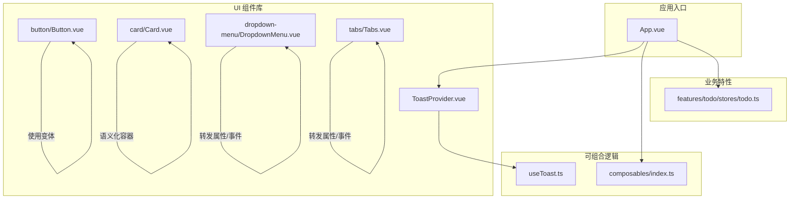
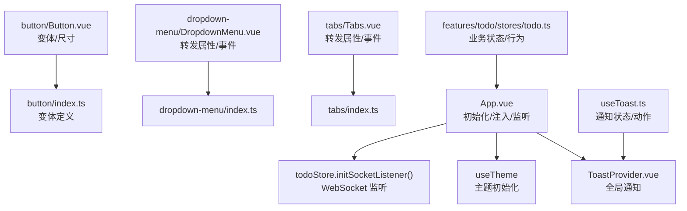
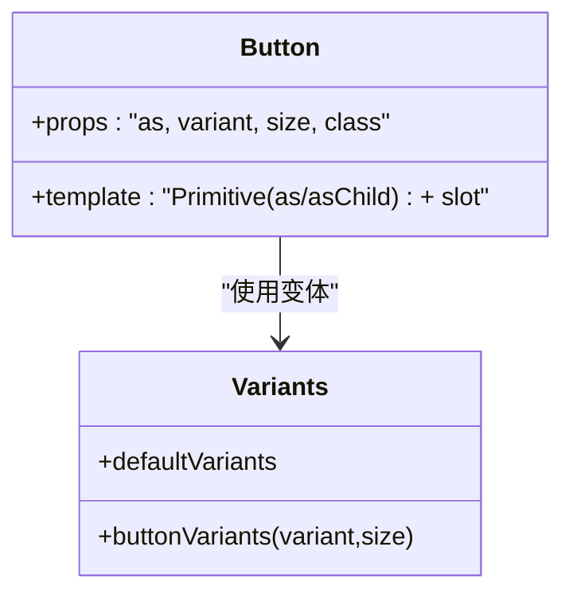
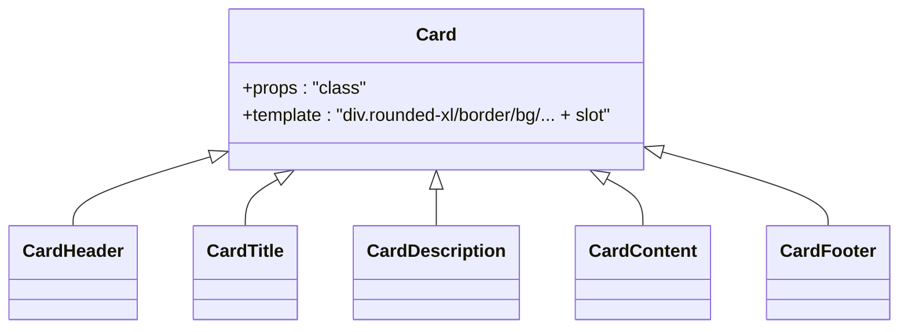
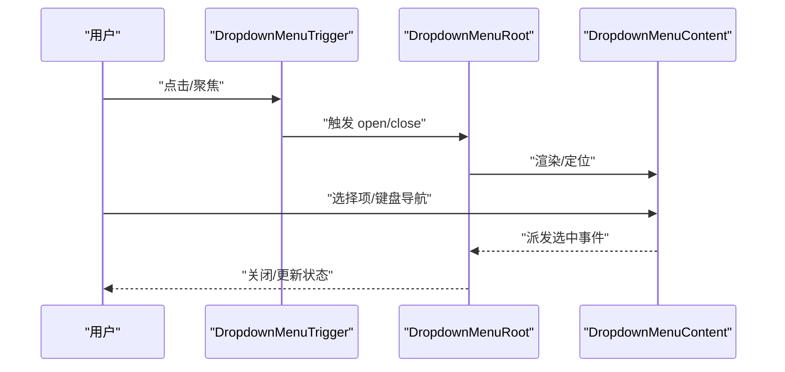
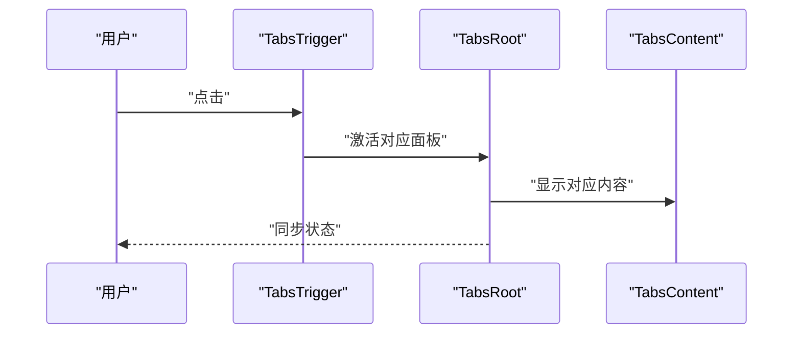
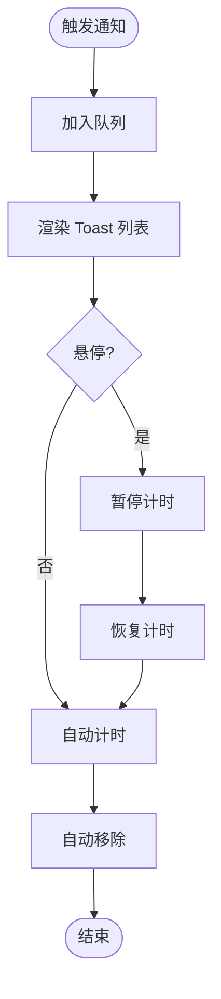
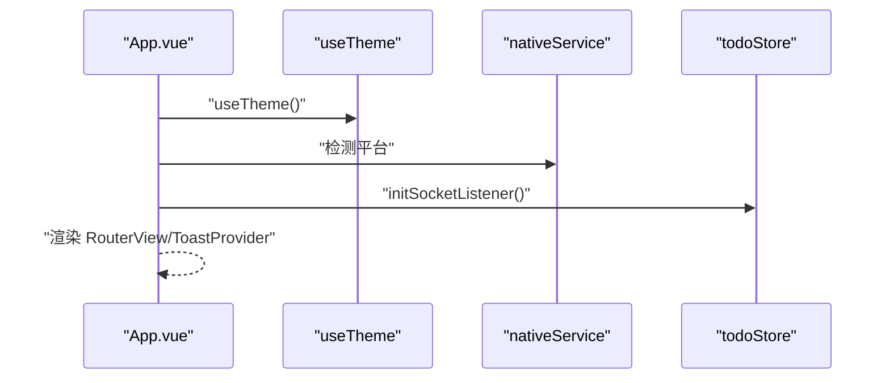
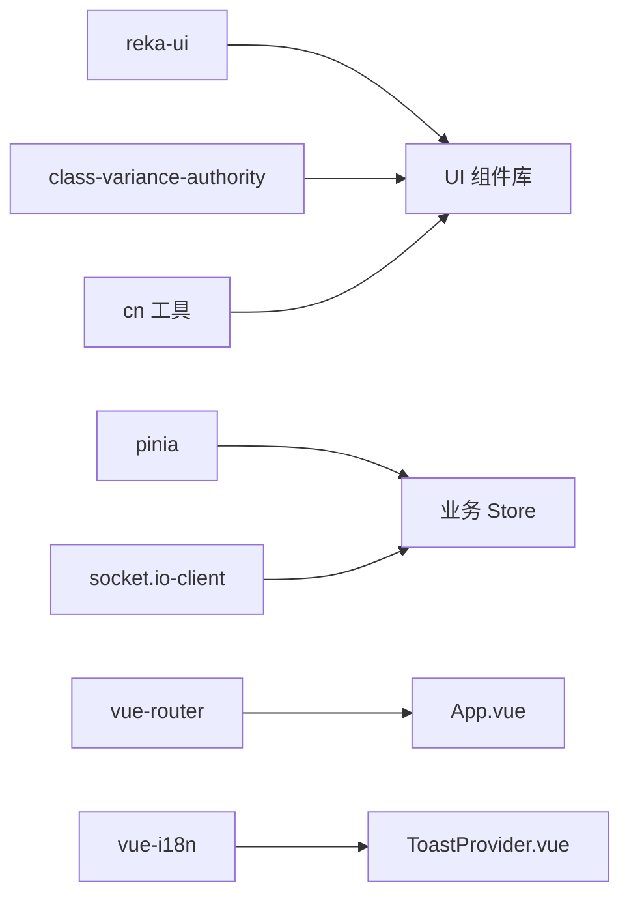

# 组件设计

<cite>
**本文引用的文件**
- [apps/frontend/src/App.vue](file://apps/frontend/src/App.vue)
- [apps/frontend/src/components/ui/button/Button.vue](file://apps/frontend/src/components/ui/button/Button.vue)
- [apps/frontend/src/components/ui/button/index.ts](file://apps/frontend/src/components/ui/button/index.ts)
- [apps/frontend/src/components/ui/card/Card.vue](file://apps/frontend/src/components/ui/card/Card.vue)
- [apps/frontend/src/components/ui/card/index.ts](file://apps/frontend/src/components/ui/card/index.ts)
- [apps/frontend/src/components/ui/dropdown-menu/DropdownMenu.vue](file://apps/frontend/src/components/ui/dropdown-menu/DropdownMenu.vue)
- [apps/frontend/src/components/ui/dropdown-menu/index.ts](file://apps/frontend/src/components/ui/dropdown-menu/index.ts)
- [apps/frontend/src/components/ui/tabs/Tabs.vue](file://apps/frontend/src/components/ui/tabs/Tabs.vue)
- [apps/frontend/src/components/ui/tabs/index.ts](file://apps/frontend/src/components/ui/tabs/index.ts)
- [apps/frontend/src/components/ui/ToastProvider.vue](file://apps/frontend/src/components/ui/ToastProvider.vue)
- [apps/frontend/src/composables/index.ts](file://apps/frontend/src/composables/index.ts)
- [apps/frontend/src/composables/useToast.ts](file://apps/frontend/src/composables/useToast.ts)
- [apps/frontend/src/features/todo/stores/todo.ts](file://apps/frontend/src/features/todo/stores/todo.ts)
- [apps/frontend/package.json](file://apps/frontend/package.json)
</cite>

## 目录
1. [引言](#引言)
2. [项目结构](#项目结构)
3. [核心组件](#核心组件)
4. [架构总览](#架构总览)
5. [详细组件分析](#详细组件分析)
6. [依赖分析](#依赖分析)
7. [性能考虑](#性能考虑)
8. [故障排查指南](#故障排查指南)
9. [结论](#结论)
10. [附录](#附录)

## 引言
本文件面向 Lumina Todo 前端组件设计，系统阐述组件化架构的设计原则与实现策略，重点覆盖：
- UI 组件库的结构、命名规范与使用模式
- 功能组件的设计模式、可复用性原则与组合式 API 的应用
- 组件间通信机制、事件传递与状态共享
- 生命周期管理、性能优化与内存泄漏防护
- 开发最佳实践、测试策略与维护指南

## 项目结构
前端采用基于功能域的模块化组织方式：components（基础 UI 组件）、features（业务特性）、composables（可复用逻辑）、stores（状态管理）等分层清晰。根组件负责全局初始化与顶层 Provider 注入，业务视图通过路由挂载。

图表来源
- [apps/frontend/src/App.vue:1-77](file://apps/frontend/src/App.vue#L1-L77)
- [apps/frontend/src/components/ui/button/Button.vue:1-32](file://apps/frontend/src/components/ui/button/Button.vue#L1-L32)
- [apps/frontend/src/components/ui/card/Card.vue:1-15](file://apps/frontend/src/components/ui/card/Card.vue#L1-L15)
- [apps/frontend/src/components/ui/dropdown-menu/DropdownMenu.vue:1-16](file://apps/frontend/src/components/ui/dropdown-menu/DropdownMenu.vue#L1-L16)
- [apps/frontend/src/components/ui/tabs/Tabs.vue:1-16](file://apps/frontend/src/components/ui/tabs/Tabs.vue#L1-L16)
- [apps/frontend/src/components/ui/ToastProvider.vue:1-109](file://apps/frontend/src/components/ui/ToastProvider.vue#L1-L109)
- [apps/frontend/src/composables/index.ts:1-11](file://apps/frontend/src/composables/index.ts#L1-L11)
- [apps/frontend/src/composables/useToast.ts](file://apps/frontend/src/composables/useToast.ts)
- [apps/frontend/src/features/todo/stores/todo.ts](file://apps/frontend/src/features/todo/stores/todo.ts)

章节来源
- [apps/frontend/src/App.vue:1-77](file://apps/frontend/src/App.vue#L1-L77)
- [apps/frontend/src/components/ui/button/index.ts:1-38](file://apps/frontend/src/components/ui/button/index.ts#L1-L38)
- [apps/frontend/src/components/ui/card/index.ts:1-7](file://apps/frontend/src/components/ui/card/index.ts#L1-L7)
- [apps/frontend/src/components/ui/dropdown-menu/index.ts:1-17](file://apps/frontend/src/components/ui/dropdown-menu/index.ts#L1-L17)
- [apps/frontend/src/components/ui/tabs/index.ts:1-5](file://apps/frontend/src/components/ui/tabs/index.ts#L1-L5)

## 核心组件
- 组件库统一以“目录即组件族”的形式组织，每个族导出一个根组件与若干子组件，并在 index.ts 中集中导出，便于按需引入与别名使用。
- 变体系统通过 class-variance-authority 在按钮族中实现，支持通过 props 控制外观与尺寸，保证样式一致性与扩展性。
- 复合组件（如 DropdownMenu、Tabs）采用 reka-ui 的 Root 组件并使用 useForwardPropsEmits 转发属性与事件，确保与原生语义一致且无多余包装。
- 卡片组件以最小语义封装容器，结合 Tailwind 工具类实现主题化外观。
- ToastProvider 作为全局通知容器，配合 useToast 提供跨组件的通知展示、复制与交互。

章节来源
- [apps/frontend/src/components/ui/button/index.ts:1-38](file://apps/frontend/src/components/ui/button/index.ts#L1-L38)
- [apps/frontend/src/components/ui/button/Button.vue:1-32](file://apps/frontend/src/components/ui/button/Button.vue#L1-L32)
- [apps/frontend/src/components/ui/card/index.ts:1-7](file://apps/frontend/src/components/ui/card/index.ts#L1-L7)
- [apps/frontend/src/components/ui/card/Card.vue:1-15](file://apps/frontend/src/components/ui/card/Card.vue#L1-L15)
- [apps/frontend/src/components/ui/dropdown-menu/index.ts:1-17](file://apps/frontend/src/components/ui/dropdown-menu/index.ts#L1-L17)
- [apps/frontend/src/components/ui/dropdown-menu/DropdownMenu.vue:1-16](file://apps/frontend/src/components/ui/dropdown-menu/DropdownMenu.vue#L1-L16)
- [apps/frontend/src/components/ui/tabs/index.ts:1-5](file://apps/frontend/src/components/ui/tabs/index.ts#L1-L5)
- [apps/frontend/src/components/ui/tabs/Tabs.vue:1-16](file://apps/frontend/src/components/ui/tabs/Tabs.vue#L1-L16)
- [apps/frontend/src/components/ui/ToastProvider.vue:1-109](file://apps/frontend/src/components/ui/ToastProvider.vue#L1-L109)

## 架构总览
整体架构围绕“根组件注入 + 组合式 API + 业务 Store + UI 组件库”展开。根组件负责主题初始化、平台适配、全局 WebSocket 监听；UI 组件库提供可变体、可组合的基础能力；组合式 API 抽离通用逻辑；Pinia Store 管理业务状态。

图表来源
- [apps/frontend/src/App.vue:1-77](file://apps/frontend/src/App.vue#L1-L77)
- [apps/frontend/src/components/ui/button/Button.vue:1-32](file://apps/frontend/src/components/ui/button/Button.vue#L1-L32)
- [apps/frontend/src/components/ui/button/index.ts:1-38](file://apps/frontend/src/components/ui/button/index.ts#L1-L38)
- [apps/frontend/src/components/ui/dropdown-menu/DropdownMenu.vue:1-16](file://apps/frontend/src/components/ui/dropdown-menu/DropdownMenu.vue#L1-L16)
- [apps/frontend/src/components/ui/dropdown-menu/index.ts:1-17](file://apps/frontend/src/components/ui/dropdown-menu/index.ts#L1-L17)
- [apps/frontend/src/components/ui/tabs/Tabs.vue:1-16](file://apps/frontend/src/components/ui/tabs/Tabs.vue#L1-L16)
- [apps/frontend/src/components/ui/tabs/index.ts:1-5](file://apps/frontend/src/components/ui/tabs/index.ts#L1-L5)
- [apps/frontend/src/components/ui/ToastProvider.vue:1-109](file://apps/frontend/src/components/ui/ToastProvider.vue#L1-L109)
- [apps/frontend/src/composables/useToast.ts](file://apps/frontend/src/composables/useToast.ts)
- [apps/frontend/src/features/todo/stores/todo.ts](file://apps/frontend/src/features/todo/stores/todo.ts)

## 详细组件分析

### 组件库设计与命名规范
- 目录即组件族：每个族以文件夹命名，内部包含根组件与子组件，index.ts 聚合导出，便于统一导入与别名使用。
- 命名规范：根组件首字母大写，子组件按职责命名，避免重复；通过 index.ts 导出统一入口。
- 使用模式：通过 props 控制外观与行为，保持最小语义与高可组合性；复合组件使用转发属性/事件，避免多余包裹。

章节来源
- [apps/frontend/src/components/ui/button/index.ts:1-38](file://apps/frontend/src/components/ui/button/index.ts#L1-L38)
- [apps/frontend/src/components/ui/card/index.ts:1-7](file://apps/frontend/src/components/ui/card/index.ts#L1-L7)
- [apps/frontend/src/components/ui/dropdown-menu/index.ts:1-17](file://apps/frontend/src/components/ui/dropdown-menu/index.ts#L1-L17)
- [apps/frontend/src/components/ui/tabs/index.ts:1-5](file://apps/frontend/src/components/ui/tabs/index.ts#L1-L5)

### 按钮组件族（Button）
- 设计要点：通过变体系统控制外观与尺寸，支持自定义标签与插槽；使用工具函数合并类名，保证样式优先级可控。
- 可复用性：将变体定义与组件解耦，便于在多处场景复用同一套风格体系。
- 组合式 API 应用：变体定义独立于组件，降低耦合度，提升可测试性与可维护性。

图表来源
- [apps/frontend/src/components/ui/button/Button.vue:1-32](file://apps/frontend/src/components/ui/button/Button.vue#L1-L32)
- [apps/frontend/src/components/ui/button/index.ts:1-38](file://apps/frontend/src/components/ui/button/index.ts#L1-L38)

章节来源
- [apps/frontend/src/components/ui/button/Button.vue:1-32](file://apps/frontend/src/components/ui/button/Button.vue#L1-L32)
- [apps/frontend/src/components/ui/button/index.ts:1-38](file://apps/frontend/src/components/ui/button/index.ts#L1-L38)

### 卡片组件族（Card）
- 设计要点：以最小语义封装卡片容器，结合 Tailwind 工具类实现主题化外观；子组件按头部、内容、描述、标题、底部等职责拆分，便于组合。
- 可复用性：卡片作为通用布局容器，可在多种业务场景复用，减少重复代码。

图表来源
- [apps/frontend/src/components/ui/card/Card.vue:1-15](file://apps/frontend/src/components/ui/card/Card.vue#L1-L15)
- [apps/frontend/src/components/ui/card/index.ts:1-7](file://apps/frontend/src/components/ui/card/index.ts#L1-L7)

章节来源
- [apps/frontend/src/components/ui/card/Card.vue:1-15](file://apps/frontend/src/components/ui/card/Card.vue#L1-L15)
- [apps/frontend/src/components/ui/card/index.ts:1-7](file://apps/frontend/src/components/ui/card/index.ts#L1-L7)

### 下拉菜单组件族（DropdownMenu）
- 设计要点：基于 reka-ui 的 Root 组件，使用 useForwardPropsEmits 转发属性与事件，保持与原生语义一致；通过 Portal 支持跨层渲染。
- 可复用性：提供触发器、内容区、分组、子菜单等子组件，满足复杂交互场景。

图表来源
- [apps/frontend/src/components/ui/dropdown-menu/DropdownMenu.vue:1-16](file://apps/frontend/src/components/ui/dropdown-menu/DropdownMenu.vue#L1-L16)
- [apps/frontend/src/components/ui/dropdown-menu/index.ts:1-17](file://apps/frontend/src/components/ui/dropdown-menu/index.ts#L1-L17)

章节来源
- [apps/frontend/src/components/ui/dropdown-menu/DropdownMenu.vue:1-16](file://apps/frontend/src/components/ui/dropdown-menu/DropdownMenu.vue#L1-L16)
- [apps/frontend/src/components/ui/dropdown-menu/index.ts:1-17](file://apps/frontend/src/components/ui/dropdown-menu/index.ts#L1-L17)

### 标签页组件族（Tabs）
- 设计要点：同样基于 reka-ui 的 Root 组件，使用 useForwardPropsEmits 转发属性与事件；通过列表与触发器实现切换逻辑。
- 可复用性：适用于多面板内容切换，如设置页、历史记录等场景。

图表来源
- [apps/frontend/src/components/ui/tabs/Tabs.vue:1-16](file://apps/frontend/src/components/ui/tabs/Tabs.vue#L1-L16)
- [apps/frontend/src/components/ui/tabs/index.ts:1-5](file://apps/frontend/src/components/ui/tabs/index.ts#L1-L5)

章节来源
- [apps/frontend/src/components/ui/tabs/Tabs.vue:1-16](file://apps/frontend/src/components/ui/tabs/Tabs.vue#L1-L16)
- [apps/frontend/src/components/ui/tabs/index.ts:1-5](file://apps/frontend/src/components/ui/tabs/index.ts#L1-L5)

### 通知组件（ToastProvider）
- 设计要点：集中管理通知队列，支持类型化样式、复制消息、悬停暂停、自动移除等行为；通过组合式 API 提供状态与动作。
- 可复用性：全局单一入口，业务组件只需调用通知方法即可完成提示。

图表来源
- [apps/frontend/src/components/ui/ToastProvider.vue:1-109](file://apps/frontend/src/components/ui/ToastProvider.vue#L1-L109)
- [apps/frontend/src/composables/useToast.ts](file://apps/frontend/src/composables/useToast.ts)

章节来源
- [apps/frontend/src/components/ui/ToastProvider.vue:1-109](file://apps/frontend/src/components/ui/ToastProvider.vue#L1-L109)
- [apps/frontend/src/composables/useToast.ts](file://apps/frontend/src/composables/useToast.ts)

### 根组件与全局初始化
- 主题初始化：在根组件中调用主题组合式逻辑，确保页面加载即具备正确的主题状态。
- 平台适配：根据运行平台动态添加样式类，处理窗口拖拽区域等平台差异。
- 全局监听：在挂载阶段初始化 WebSocket 监听，确保业务实时数据更新。

图表来源
- [apps/frontend/src/App.vue:1-77](file://apps/frontend/src/App.vue#L1-L77)

章节来源
- [apps/frontend/src/App.vue:1-77](file://apps/frontend/src/App.vue#L1-L77)

## 依赖分析
- 组件库依赖：UI 组件广泛使用 reka-ui 提供的原生语义组件与转发机制，确保可访问性与可组合性。
- 样式与工具：通过 class-variance-authority 定义变体，cn 工具函数合并类名，保持样式一致性。
- 状态与网络：Pinia 管理业务状态，Socket.IO 客户端用于实时通信；根组件在挂载时初始化监听。

图表来源
- [apps/frontend/src/components/ui/button/Button.vue:1-32](file://apps/frontend/src/components/ui/button/Button.vue#L1-L32)
- [apps/frontend/src/components/ui/dropdown-menu/DropdownMenu.vue:1-16](file://apps/frontend/src/components/ui/dropdown-menu/DropdownMenu.vue#L1-L16)
- [apps/frontend/src/components/ui/tabs/Tabs.vue:1-16](file://apps/frontend/src/components/ui/tabs/Tabs.vue#L1-L16)
- [apps/frontend/src/components/ui/ToastProvider.vue:1-109](file://apps/frontend/src/components/ui/ToastProvider.vue#L1-L109)
- [apps/frontend/src/features/todo/stores/todo.ts](file://apps/frontend/src/features/todo/stores/todo.ts)
- [apps/frontend/package.json:31-103](file://apps/frontend/package.json#L31-L103)

章节来源
- [apps/frontend/package.json:31-103](file://apps/frontend/package.json#L31-L103)

## 性能考虑
- 组件最小化：UI 组件尽量保持轻量，仅承担样式与语义职责，避免额外渲染开销。
- 变体与类名：通过变体系统与类名合并工具，减少条件分支带来的重排与重绘。
- 列表动画：Toast 使用过渡组与缓动函数，保证动画流畅同时避免过度消耗。
- 全局监听：WebSocket 监听仅在根组件挂载时初始化一次，避免重复绑定导致的内存泄漏。
- 图标与第三方库：图标库与渲染库按需引入，减少打包体积。

## 故障排查指南
- 通知不显示或无法复制
  - 检查通知状态与动作是否正确传入；确认复制权限与剪贴板 API 可用。
  - 关注复制状态的并发控制，避免重复操作。
- 下拉菜单/标签页行为异常
  - 确认转发的属性与事件是否完整；检查子组件是否正确注册。
- 主题或平台适配问题
  - 检查主题初始化顺序与平台检测逻辑；确认样式类是否正确添加。
- WebSocket 监听未生效
  - 确认挂载阶段已调用初始化方法；检查服务端连接状态与错误日志。

章节来源
- [apps/frontend/src/components/ui/ToastProvider.vue:1-109](file://apps/frontend/src/components/ui/ToastProvider.vue#L1-L109)
- [apps/frontend/src/components/ui/dropdown-menu/DropdownMenu.vue:1-16](file://apps/frontend/src/components/ui/dropdown-menu/DropdownMenu.vue#L1-L16)
- [apps/frontend/src/components/ui/tabs/Tabs.vue:1-16](file://apps/frontend/src/components/ui/tabs/Tabs.vue#L1-L16)
- [apps/frontend/src/App.vue:1-77](file://apps/frontend/src/App.vue#L1-L77)
- [apps/frontend/src/features/todo/stores/todo.ts](file://apps/frontend/src/features/todo/stores/todo.ts)

## 结论
本组件设计以“最小语义 + 可变体 + 可组合”为核心理念，通过统一的 UI 组件库与组合式 API，实现了高内聚、低耦合的前端架构。根组件负责全局初始化与 Provider 注入，业务 Store 承担状态与实时通信，UI 组件提供一致的视觉与交互体验。该设计既保证了开发效率，也为后续扩展与维护提供了清晰路径。

## 附录
- 开发最佳实践
  - 遵循“目录即组件族”的组织方式，统一导出入口。
  - 将样式变体与组件解耦，提升可测试性与可维护性。
  - 使用转发属性/事件保持原生语义，避免多余包装。
- 测试策略
  - 单元测试覆盖组合式 API 的状态与副作用。
  - 组件测试验证变体、事件与插槽行为。
  - 端到端测试覆盖关键业务流程与通知交互。
- 维护指南
  - 新增组件时同步完善 index.ts 导出与类型声明。
  - 变体扩展遵循现有命名与默认值约定。
  - 定期审查第三方依赖版本，关注安全与性能更新。