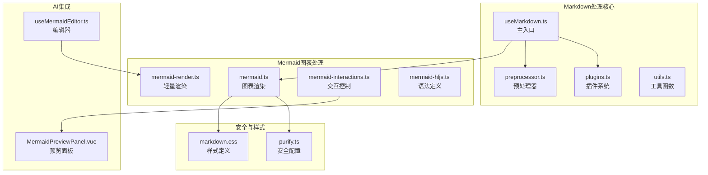
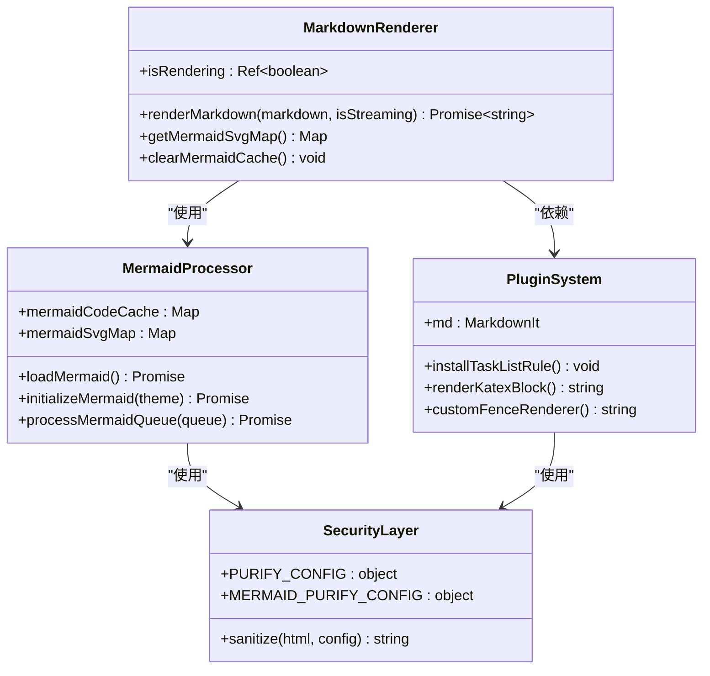
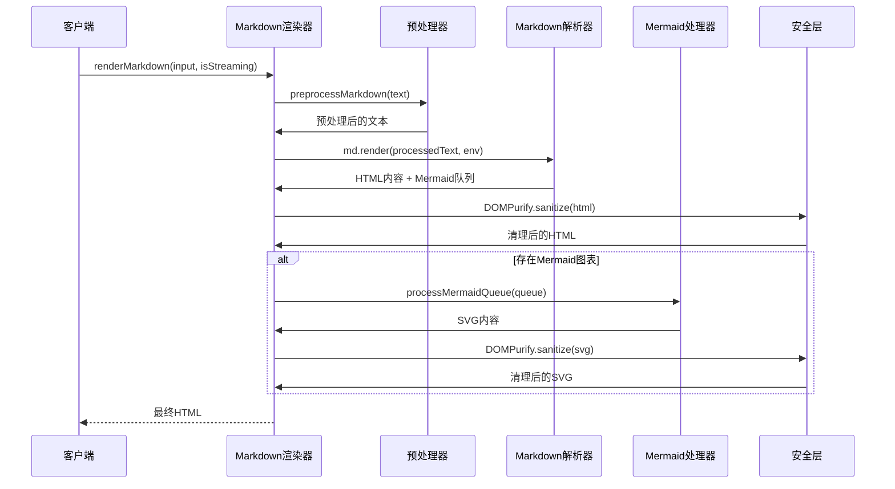
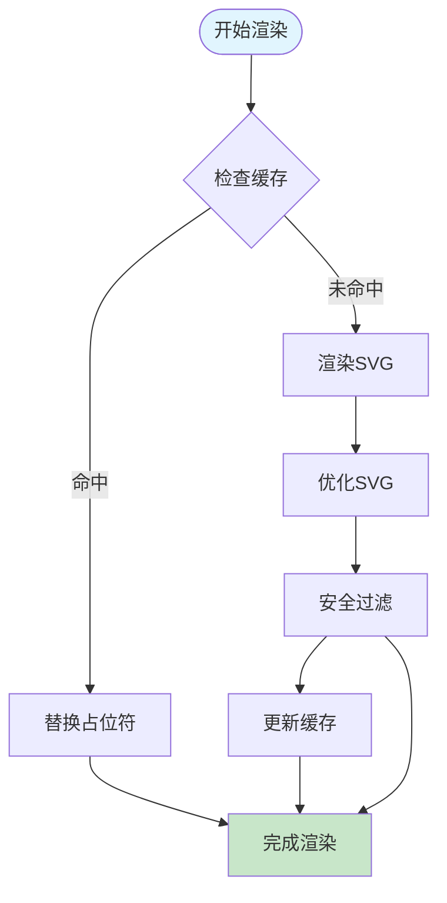
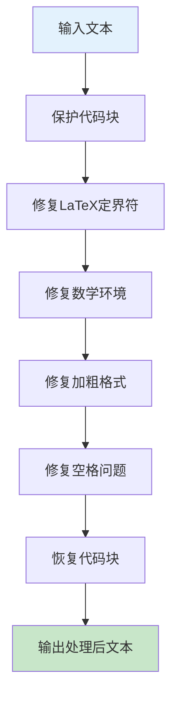
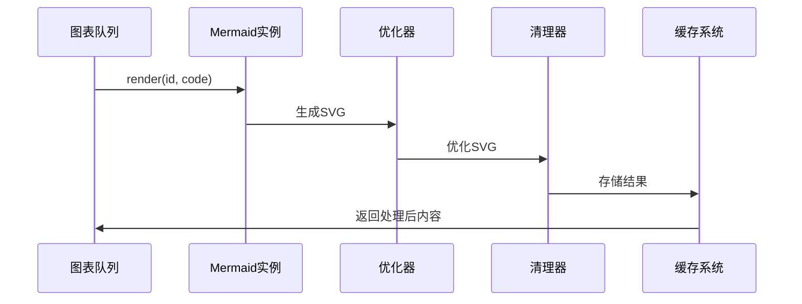
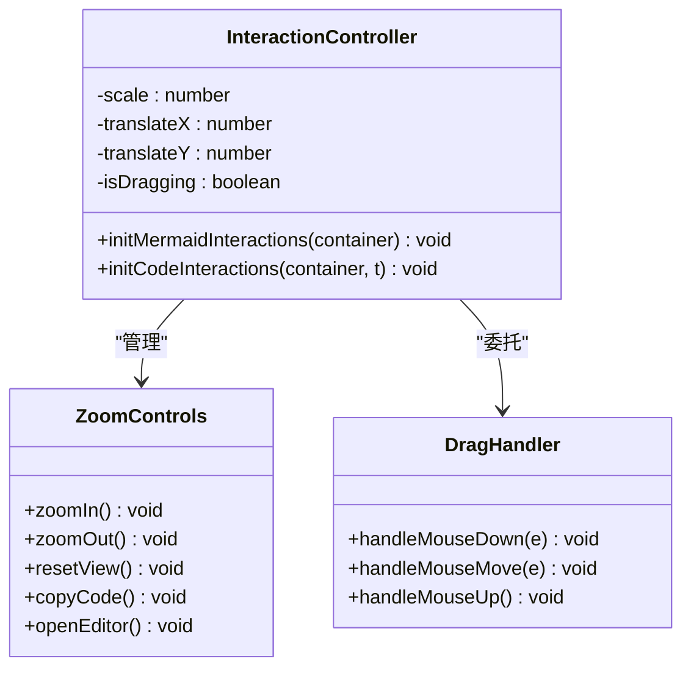
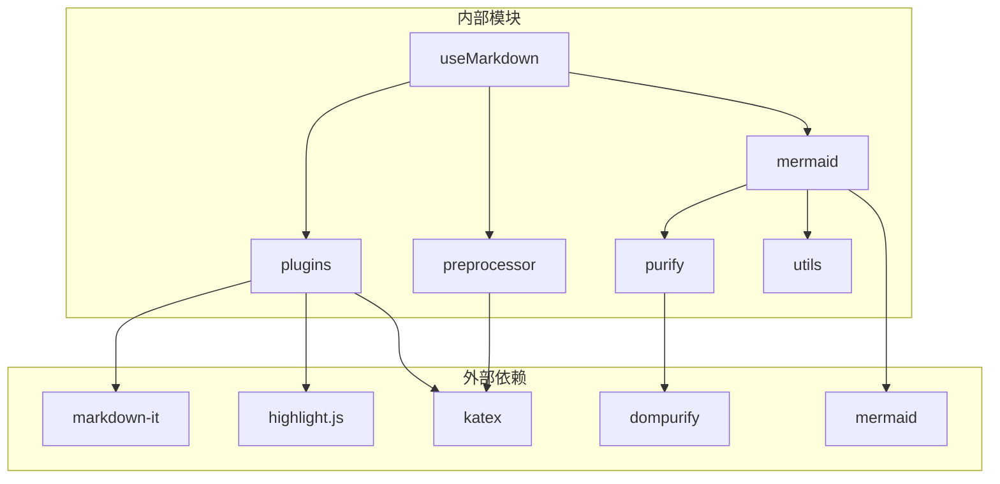
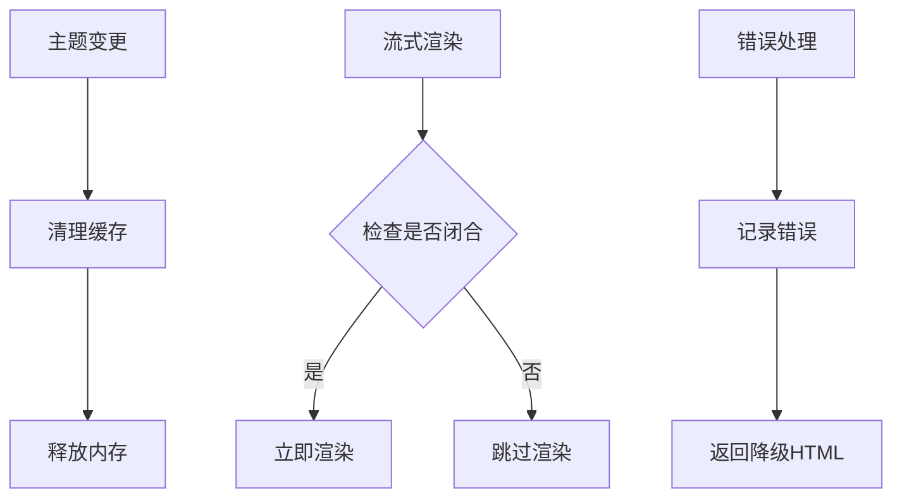

# Markdown处理Hooks

<cite>
**本文档引用的文件**
- [useMarkdown.ts](file://apps/frontend/src/composables/useMarkdown.ts)
- [plugins.ts](file://apps/frontend/src/composables/markdown/plugins.ts)
- [preprocessor.ts](file://apps/frontend/src/composables/markdown/preprocessor.ts)
- [mermaid.ts](file://apps/frontend/src/composables/markdown/mermaid.ts)
- [mermaid-render.ts](file://apps/frontend/src/composables/markdown/mermaid-render.ts)
- [mermaid-interactions.ts](file://apps/frontend/src/composables/markdown/mermaid-interactions.ts)
- [mermaid-hljs.ts](file://apps/frontend/src/composables/markdown/mermaid-hljs.ts)
- [purify.ts](file://apps/frontend/src/composables/markdown/purify.ts)
- [utils.ts](file://apps/frontend/src/composables/markdown/utils.ts)
- [markdown.css](file://apps/frontend/src/styles/markdown.css)
- [MermaidPreviewPanel.vue](file://apps/frontend/src/features/ai/components/MermaidPreviewPanel.vue)
- [useMermaidEditor.ts](file://apps/frontend/src/features/ai/composables/useMermaidEditor.ts)
- [markdown-it-katex.d.ts](file://apps/frontend/src/types/markdown-it-katex.d.ts)
</cite>

## 目录

1. [简介](#简介)
2. [项目结构](#项目结构)
3. [核心组件](#核心组件)
4. [架构概览](#架构概览)
5. [详细组件分析](#详细组件分析)
6. [依赖关系分析](#依赖关系分析)
7. [性能考虑](#性能考虑)
8. [故障排除指南](#故障排除指南)
9. [结论](#结论)

## 简介

这是一个基于Vue 3 Composition API的Markdown处理系统，专门用于AI对话场景中的Markdown渲染。该系统提供了完整的Markdown解析、渲染、安全处理和交互功能，包括：

- **Markdown解析流程**：预处理、解析、渲染和后处理
- **Mermaid图表渲染**：实时预览、缓存优化和交互控制
- **语法高亮**：支持多种编程语言和特殊标记
- **数学公式渲染**：LaTeX和KaTeX集成
- **安全处理**：DOMPurify防护和严格的安全配置
- **插件系统**：可扩展的Markdown处理管道

## 项目结构

Markdown处理系统采用模块化设计，主要文件组织如下：

**图表来源**

- [useMarkdown.ts:1-108](file://apps/frontend/src/composables/useMarkdown.ts#L1-L108)
- [plugins.ts:1-233](file://apps/frontend/src/composables/markdown/plugins.ts#L1-L233)
- [mermaid.ts:1-192](file://apps/frontend/src/composables/markdown/mermaid.ts#L1-L192)

**章节来源**

- [useMarkdown.ts:1-108](file://apps/frontend/src/composables/useMarkdown.ts#L1-L108)
- [plugins.ts:1-233](file://apps/frontend/src/composables/markdown/plugins.ts#L1-L233)

## 核心组件

### 主要API接口

系统提供以下核心接口：

**图表来源**

- [useMarkdown.ts:14-107](file://apps/frontend/src/composables/useMarkdown.ts#L14-L107)
- [mermaid.ts:15-191](file://apps/frontend/src/composables/markdown/mermaid.ts#L15-L191)
- [plugins.ts:107-233](file://apps/frontend/src/composables/markdown/plugins.ts#L107-L233)

### 关键数据结构

系统使用以下核心数据结构：

- **Mermaid队列项**：包含图表ID和代码内容
- **Markdown环境**：传递渲染上下文信息
- **缓存映射**：主题+哈希值到SVG的映射关系
- **安全配置**：针对不同场景的DOMPurify配置

**章节来源**

- [mermaid.ts:19-22](file://apps/frontend/src/composables/markdown/mermaid.ts#L19-L22)
- [plugins.ts:28-32](file://apps/frontend/src/composables/markdown/plugins.ts#L28-L32)
- [purify.ts:4-200](file://apps/frontend/src/composables/markdown/purify.ts#L4-L200)

## 架构概览

### 渲染流程架构

**图表来源**

- [useMarkdown.ts:27-96](file://apps/frontend/src/composables/useMarkdown.ts#L27-L96)
- [plugins.ts:176-228](file://apps/frontend/src/composables/markdown/plugins.ts#L176-L228)
- [mermaid.ts:137-191](file://apps/frontend/src/composables/markdown/mermaid.ts#L137-L191)

### Mermaid渲染优化流程

**图表来源**

- [useMarkdown.ts:63-87](file://apps/frontend/src/composables/useMarkdown.ts#L63-L87)
- [mermaid.ts:144-190](file://apps/frontend/src/composables/markdown/mermaid.ts#L144-L190)

**章节来源**

- [useMarkdown.ts:27-96](file://apps/frontend/src/composables/useMarkdown.ts#L27-L96)
- [mermaid.ts:137-191](file://apps/frontend/src/composables/markdown/mermaid.ts#L137-L191)

## 详细组件分析

### 预处理器组件

预处理器负责修复AI输出的常见格式问题：

#### 数学公式处理

**图表来源**

- [preprocessor.ts:99-234](file://apps/frontend/src/composables/markdown/preprocessor.ts#L99-L234)

#### 关键特性

- **LaTeX兼容性**：支持`\(inline\)`、`$$block$$`和`\\begin{align}...\\end{align}`等多种格式
- **智能检测**：通过正则表达式识别数学表达式
- **上下文感知**：避免在列表项和引用块中错误处理
- **转义保护**：正确处理`\\$`等转义字符

**章节来源**

- [preprocessor.ts:1-235](file://apps/frontend/src/composables/markdown/preprocessor.ts#L1-L235)

### 插件系统组件

插件系统基于markdown-it构建，提供丰富的扩展功能：

#### MarkdownIt配置

系统使用以下核心配置：

| 配置项              | 值           | 作用             |
| ------------------- | ------------ | ---------------- |
| `html: true`        | 启用HTML标签 | 支持原生HTML内容 |
| `linkify: true`     | 启用链接识别 | 自动识别URL链接  |
| `typographer: true` | 启用排版优化 | 智能引号和破折号 |
| `breaks: true`      | 启用软换行   | 支持单个换行符   |

#### 自定义渲染器

系统实现了多个自定义渲染器：

1. **任务列表渲染器**：将`[ ]`和`[x]`转换为交互式复选框
2. **代码块渲染器**：增强代码块的显示效果
3. **数学公式渲染器**：集成KaTeX进行数学公式渲染
4. **链接渲染器**：自动添加`target="_blank"`属性

**章节来源**

- [plugins.ts:107-233](file://apps/frontend/src/composables/markdown/plugins.ts#L107-L233)

### Mermaid图表处理组件

#### 图表渲染流程

**图表来源**

- [mermaid.ts:137-191](file://apps/frontend/src/composables/markdown/mermaid.ts#L137-L191)
- [mermaid-render.ts:11-43](file://apps/frontend/src/composables/markdown/mermaid-render.ts#L11-L43)

#### 缓存策略

系统采用多层缓存机制：

1. **主题缓存**：`mermaidCodeCache`按主题存储
2. **ID映射**：`mermaidSvgMap`按图表ID映射
3. **哈希索引**：使用稳定哈希函数生成缓存键

**章节来源**

- [mermaid.ts:14-17](file://apps/frontend/src/composables/markdown/mermaid.ts#L14-L17)
- [mermaid.ts:144-190](file://apps/frontend/src/composables/markdown/mermaid.ts#L144-L190)

### 交互控制系统

#### 用户交互功能

**图表来源**

- [mermaid-interactions.ts:6-111](file://apps/frontend/src/composables/markdown/mermaid-interactions.ts#L6-L111)

#### 交互特性

- **缩放控制**：支持鼠标滚轮和按钮缩放
- **拖拽平移**：支持鼠标拖拽图表
- **复制功能**：一键复制图表源码
- **编辑功能**：直接在编辑器中修改图表

**章节来源**

- [mermaid-interactions.ts:1-145](file://apps/frontend/src/composables/markdown/mermaid-interactions.ts#L1-L145)

### 安全处理组件

#### DOMPurify配置

系统提供两套安全配置：

1. **通用配置** (`PURIFY_CONFIG`)：用于基础HTML内容
2. **Mermaid配置** (`MERMAID_PURIFY_CONFIG`)：用于SVG图表内容

#### 安全策略

- **严格白名单**：只允许安全的HTML标签和属性
- **SVG支持**：完整支持SVG和MathML标签
- **属性限制**：限制可能造成安全问题的属性
- **内容清理**：移除潜在危险的内容

**章节来源**

- [purify.ts:1-293](file://apps/frontend/src/composables/markdown/purify.ts#L1-L293)

## 依赖关系分析

### 核心依赖图

**图表来源**

- [plugins.ts:1-12](file://apps/frontend/src/composables/markdown/plugins.ts#L1-L12)
- [mermaid.ts:1-4](file://apps/frontend/src/composables/markdown/mermaid.ts#L1-L4)

### 模块耦合度

系统采用低耦合设计：

- **单一职责**：每个模块专注于特定功能
- **清晰边界**：模块间通过明确定义的接口通信
- **可测试性**：每个模块都具备良好的可测试性
- **可扩展性**：插件系统支持功能扩展

**章节来源**

- [plugins.ts:14-24](file://apps/frontend/src/composables/markdown/plugins.ts#L14-L24)
- [mermaid.ts:27-50](file://apps/frontend/src/composables/markdown/mermaid.ts#L27-L50)

## 性能考虑

### 渲染优化策略

#### 缓存优化

1. **主题感知缓存**：根据当前主题动态选择缓存
2. **增量更新**：只更新发生变化的图表
3. **内存管理**：监听主题变化时清理缓存

#### 渲染性能

1. **异步渲染**：图表渲染不阻塞主线程
2. **批量处理**：支持一次性处理多个图表
3. **懒加载**：只在需要时加载Mermaid库

### 内存管理

**图表来源**

- [useMarkdown.ts:18-22](file://apps/frontend/src/composables/useMarkdown.ts#L18-L22)
- [useMarkdown.ts:38-46](file://apps/frontend/src/composables/useMarkdown.ts#L38-L46)

**章节来源**

- [useMarkdown.ts:18-22](file://apps/frontend/src/composables/useMarkdown.ts#L18-L22)
- [mermaid.ts:14-17](file://apps/frontend/src/composables/markdown/mermaid.ts#L14-L17)

## 故障排除指南

### 常见问题及解决方案

#### 图表渲染失败

**症状**：图表显示"渲染失败"错误

**原因分析**：

1. Mermaid语法错误
2. 浏览器兼容性问题
3. DOMPurify过滤异常

**解决方法**：

1. 检查Mermaid语法是否正确
2. 确认浏览器支持情况
3. 查看控制台错误日志

#### 性能问题

**症状**：页面响应缓慢

**排查步骤**：

1. 检查图表数量和复杂度
2. 监控内存使用情况
3. 分析渲染时间

**优化建议**：

1. 减少同时渲染的图表数量
2. 使用更简单的图表样式
3. 实施适当的缓存策略

#### 安全问题

**症状**：内容被意外过滤

**检查清单**：

1. 确认使用正确的安全配置
2. 验证输入内容的安全性
3. 检查DOMPurify版本兼容性

**预防措施**：

1. 始终使用DOMPurify进行内容清理
2. 定期更新安全配置
3. 实施内容审核机制

**章节来源**

- [mermaid.ts:184-187](file://apps/frontend/src/composables/markdown/mermaid.ts#L184-L187)
- [purify.ts:202-292](file://apps/frontend/src/composables/markdown/purify.ts#L202-L292)

## 结论

这个Markdown处理Hooks系统提供了完整的Markdown渲染解决方案，具有以下优势：

### 技术特点

1. **模块化设计**：清晰的模块划分和职责分离
2. **高性能渲染**：多层缓存和异步处理机制
3. **安全保障**：严格的DOMPurify防护和配置
4. **用户体验**：丰富的交互功能和视觉效果
5. **可扩展性**：灵活的插件系统和自定义能力

### 应用价值

- **AI对话场景**：专为大模型输出优化的渲染系统
- **技术文档**：支持复杂的图表和数学公式
- **教育平台**：提供丰富的可视化教学内容
- **开发工具**：支持代码展示和文档生成

### 发展方向

1. **性能优化**：进一步提升渲染速度和内存效率
2. **功能扩展**：支持更多图表类型和交互效果
3. **兼容性改进**：增强对不同浏览器的支持
4. **用户体验**：持续优化界面和交互设计

该系统为现代Web应用提供了强大而灵活的Markdown处理能力，特别适合需要高质量内容展示的应用场景。
