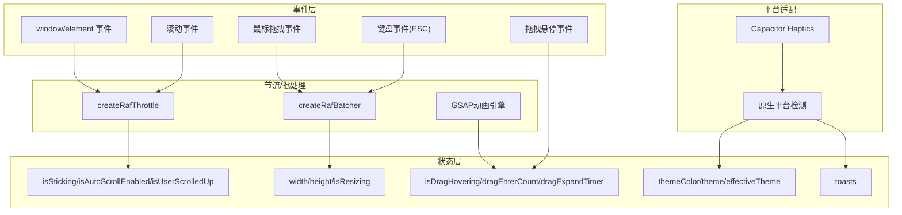
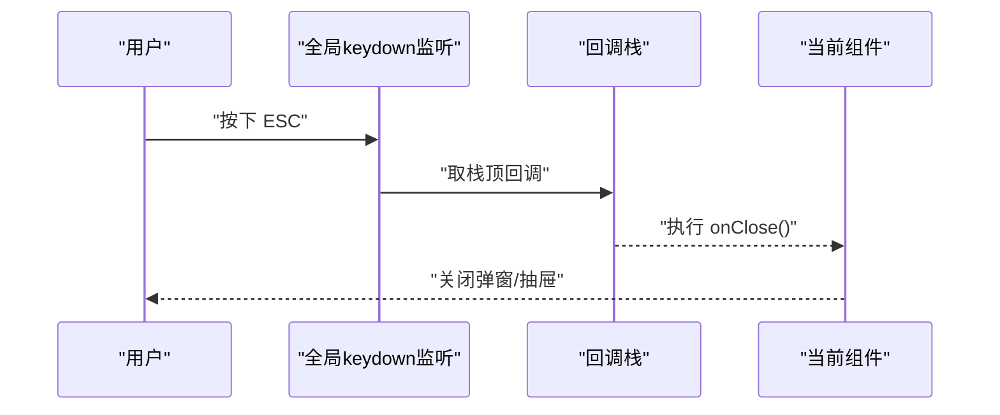
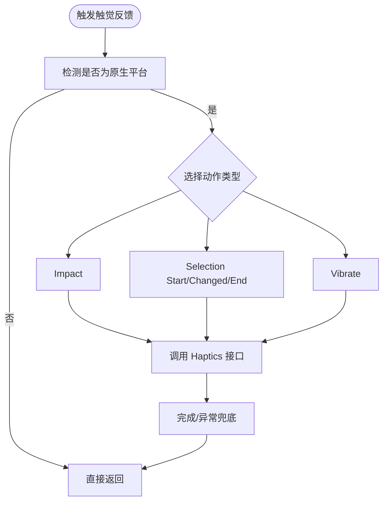
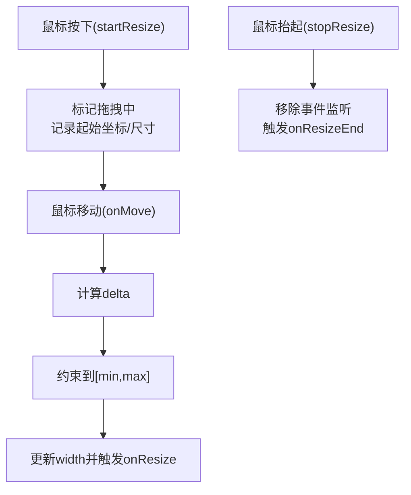
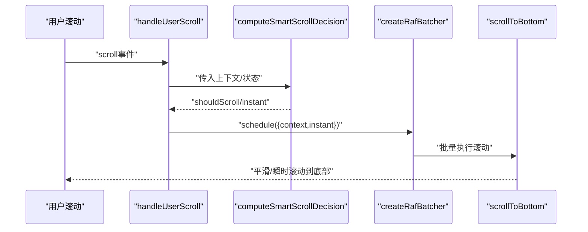
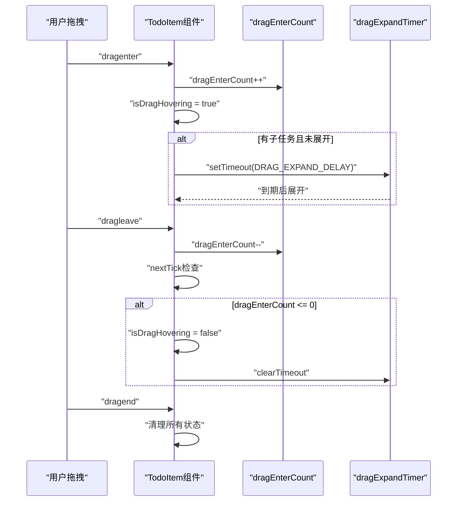
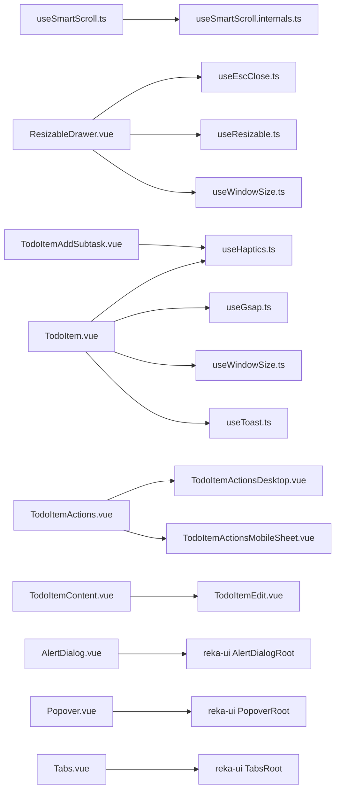

# UI交互Hooks

<cite>
**本文档引用的文件**
- [useEscClose.ts](file://apps/frontend/src/composables/useEscClose.ts)
- [useHaptics.ts](file://apps/frontend/src/composables/useHaptics.ts)
- [useResizable.ts](file://apps/frontend/src/composables/useResizable.ts)
- [useSmartScroll.ts](file://apps/frontend/src/composables/useSmartScroll.ts)
- [useSmartScroll.internals.ts](file://apps/frontend/src/composables/useSmartScroll.internals.ts)
- [useWindowSize.ts](file://apps/frontend/src/composables/useWindowSize.ts)
- [useTheme.ts](file://apps/frontend/src/composables/useTheme.ts)
- [useToast.ts](file://apps/frontend/src/composables/useToast.ts)
- [useGsap.ts](file://apps/frontend/src/composables/useGsap.ts)
- [ResizableDrawer.vue](file://apps/frontend/src/components/ResizableDrawer.vue)
- [AlertDialog.vue](file://apps/frontend/src/components/ui/alert-dialog/AlertDialog.vue)
- [Popover.vue](file://apps/frontend/src/components/ui/popover/Popover.vue)
- [Tabs.vue](file://apps/frontend/src/components/ui/tabs/Tabs.vue)
- [TodoItem.vue](file://apps/frontend/src/features/todo/components/TodoItem.vue)
- [TodoItemActions.vue](file://apps/frontend/src/features/todo/components/TodoItemActions.vue)
- [TodoItemContent.vue](file://apps/frontend/src/features/todo/components/TodoItemContent.vue)
- [TodoItemEdit.vue](file://apps/frontend/src/features/todo/components/TodoItemEdit.vue)
- [TodoItemAddSubtask.vue](file://apps/frontend/src/features/todo/components/TodoItemAddSubtask.vue)
- [TodoItemActionsDesktop.vue](file://apps/frontend/src/features/todo/components/TodoItemActionsDesktop.vue)
- [TodoItemActionsMobileSheet.vue](file://apps/frontend/src/features/todo/components/TodoItemActionsMobileSheet.vue)
- [index.ts](file://apps/frontend/src/composables/index.ts)
</cite>

## 更新摘要
**所做更改**
- 新增TodoItem组件拖拽悬停功能的详细分析
- 扩展UI交互Hooks最佳实践章节，包含事件处理、状态管理和视觉反馈
- 添加拖拽悬停计数器、延迟展开和状态管理的实现细节
- 更新相关架构图和流程图以反映新的交互模式

## 目录
1. [简介](#简介)
2. [项目结构](#项目结构)
3. [核心组件](#核心组件)
4. [架构总览](#架构总览)
5. [详细组件分析](#详细组件分析)
6. [依赖关系分析](#依赖关系分析)
7. [性能考量](#性能考量)
8. [故障排查指南](#故障排查指南)
9. [结论](#结论)
10. [附录](#附录)

## 简介
本文件聚焦于UI交互相关的组合式API，系统性梳理并解释以下能力的实现原理与使用方法：
- ESC键关闭：基于全局栈的多层弹窗/抽屉ESC关闭机制
- 触觉反馈：跨平台触觉反馈封装，适配原生设备
- 可调整大小：拖拽调整宽度/高度，支持最小/最大限制与持久化
- 智能滚动：自动粘附底部、流式更新优化、用户滚动检测与回流控制
- **拖拽悬停：基于计数器的状态管理、延迟展开机制与视觉反馈**
- 组件状态管理、事件处理与用户体验优化策略
- 滚动位置记忆、视口检测与响应式交互
- 触摸手势支持、键盘导航与无障碍访问
- 最佳实践与性能优化技巧

## 项目结构
UI交互Hooks主要位于前端应用的组合式API目录中，并通过组件进行集成使用。关键文件分布如下：
- 组合式API：useEscClose、useHaptics、useResizable、useSmartScroll、useWindowSize、useTheme、useToast、useGsap
- 内部工具：useSmartScroll.internals（滚动决策、RAF批处理与节流）
- 示例组件：ResizableDrawer（抽屉+可调整大小+ESC关闭）、AlertDialog、Popover、Tabs（基于reka-ui）
- **交互组件：TodoItem（拖拽悬停+智能展开）及其子组件**

```mermaid
graph TB
subgraph "组合式API"
A["useEscClose.ts"]
B["useHaptics.ts"]
C["useResizable.ts"]
D["useSmartScroll.ts"]
E["useSmartScroll.internals.ts"]
F["useWindowSize.ts"]
G["useTheme.ts"]
H["useToast.ts"]
I["useGsap.ts"]
end
subgraph "UI组件"
J["ResizableDrawer.vue"]
K["AlertDialog.vue"]
L["Popover.vue"]
M["Tabs.vue"]
end
subgraph "交互组件"
N["TodoItem.vue"]
O["TodoItemActions.vue"]
P["TodoItemContent.vue"]
Q["TodoItemEdit.vue"]
R["TodoItemAddSubtask.vue"]
S["TodoItemActionsDesktop.vue"]
T["TodoItemActionsMobileSheet.vue"]
end
N --> A
N --> C
N --> F
N --> I
N --> B
N --> H
J --> A
J --> C
J --> F
K --> |"reka-ui"| U["AlertDialogRoot"]
L --> |"reka-ui"| V["PopoverRoot"]
M --> |"reka-ui"| W["TabsRoot"]
D --> E
```

**图表来源**
- [useEscClose.ts:1-66](file://apps/frontend/src/composables/useEscClose.ts#L1-L66)
- [useHaptics.ts:1-62](file://apps/frontend/src/composables/useHaptics.ts#L1-L62)
- [useResizable.ts:1-70](file://apps/frontend/src/composables/useResizable.ts#L1-L70)
- [useSmartScroll.ts:1-442](file://apps/frontend/src/composables/useSmartScroll.ts#L1-L442)
- [useSmartScroll.internals.ts:1-109](file://apps/frontend/src/composables/useSmartScroll.internals.ts#L1-L109)
- [useWindowSize.ts:1-45](file://apps/frontend/src/composables/useWindowSize.ts#L1-L45)
- [useTheme.ts:1-378](file://apps/frontend/src/composables/useTheme.ts#L1-L378)
- [useToast.ts:1-87](file://apps/frontend/src/composables/useToast.ts#L1-L87)
- [useGsap.ts:1-200](file://apps/frontend/src/composables/useGsap.ts#L1-L200)
- [ResizableDrawer.vue:1-408](file://apps/frontend/src/components/ResizableDrawer.vue#L1-L408)
- [AlertDialog.vue:1-16](file://apps/frontend/src/components/ui/alert-dialog/AlertDialog.vue#L1-L16)
- [Popover.vue:1-20](file://apps/frontend/src/components/ui/popover/Popover.vue#L1-L20)
- [Tabs.vue:1-16](file://apps/frontend/src/components/ui/tabs/Tabs.vue#L1-L16)
- [TodoItem.vue:1-473](file://apps/frontend/src/features/todo/components/TodoItem.vue#L1-L473)

**章节来源**
- [index.ts:1-11](file://apps/frontend/src/composables/index.ts#L1-L11)

## 核心组件
本节概述各交互Hooks的能力边界与典型用法。

- ESC键关闭（useEscClose）
  - 通过全局keydown监听与回调栈，确保只有最上层组件响应ESC
  - 基于isOpen的响应式状态动态入栈/出栈
  - 卸载时自动清理，避免内存泄漏

- 触觉反馈（useHaptics）
  - 封装Capacitor Haptics能力，按需在原生平台启用
  - 提供Impact/Selection/Vibrate等常用触觉动作
  - 包装错误兜底，避免在非原生平台报错

- 可调整大小（useResizable）
  - 支持水平/垂直方向拖拽，限制最小/最大宽度
  - 提供onResize/onResizeEnd回调，便于持久化与联动
  - 在拖拽期间设置cursor与userSelect，提升交互反馈

- 智能滚动（useSmartScroll）
  - 自动粘附底部、流式更新优化、用户滚动检测
  - 通过RAF批处理与节流降低重排压力
  - 支持ResizeObserver/MutationObserver感知容器与内容变化
  - 提供滚动快照、阈值判断、程序化滚动标记

- **拖拽悬停（TodoItem组件）**
  - **基于计数器的状态管理：dragEnterCount确保嵌套拖拽的正确状态**
  - **延迟展开机制：DRAG_EXPAND_DELAY避免拖拽经过时的误触发**
  - **视觉反馈：isDragHovering控制悬停样式和边框效果**
  - **状态清理：handleDragLeave和handleDragEnd确保资源释放**

- 窗口尺寸（useWindowSize）
  - 响应式窗口宽高，支持移动端判断
  - 组件与非组件环境下分别处理生命周期

- 主题（useTheme）
  - 支持明暗主题、预设色板、随机主题与对比度保障
  - 将主题变量注入CSS变量，支持深浅两套前景色与hover亮度校准

- 提示（useToast）
  - 轻量提示队列，支持定时消失、暂停/恢复与动作按钮
  - 提供成功/错误/信息/警告类型别名方法

- **动画驱动（useGsap）**
  - **高性能动画：GSAP驱动的高度展开/折叠动画替代简单v-show**
  - **状态感知：根据isExpanded和isDragHovering动态播放动画**
  - **性能优化：使用ctx.add确保动画执行时机**

**章节来源**
- [useEscClose.ts:1-66](file://apps/frontend/src/composables/useEscClose.ts#L1-L66)
- [useHaptics.ts:1-62](file://apps/frontend/src/composables/useHaptics.ts#L1-L62)
- [useResizable.ts:1-70](file://apps/frontend/src/composables/useResizable.ts#L1-L70)
- [useSmartScroll.ts:1-442](file://apps/frontend/src/composables/useSmartScroll.ts#L1-L442)
- [useSmartScroll.internals.ts:1-109](file://apps/frontend/src/composables/useSmartScroll.internals.ts#L1-L109)
- [useWindowSize.ts:1-45](file://apps/frontend/src/composables/useWindowSize.ts#L1-L45)
- [useTheme.ts:1-378](file://apps/frontend/src/composables/useTheme.ts#L1-L378)
- [useToast.ts:1-87](file://apps/frontend/src/composables/useToast.ts#L1-L87)
- [useGsap.ts:1-200](file://apps/frontend/src/composables/useGsap.ts#L1-L200)
- [TodoItem.vue:194-238](file://apps/frontend/src/features/todo/components/TodoItem.vue#L194-L238)

## 架构总览
UI交互Hooks围绕"状态驱动 + 事件节流 + 平台适配"的设计原则构建，内部通过RAF批处理与节流优化渲染性能，外部通过组件以声明式方式接入。新增的拖拽悬停功能进一步丰富了交互模式。

**图表来源**
- [useSmartScroll.ts:1-442](file://apps/frontend/src/composables/useSmartScroll.ts#L1-L442)
- [useSmartScroll.internals.ts:1-109](file://apps/frontend/src/composables/useSmartScroll.internals.ts#L1-L109)
- [useResizable.ts:1-70](file://apps/frontend/src/composables/useResizable.ts#L1-L70)
- [useHaptics.ts:1-62](file://apps/frontend/src/composables/useHaptics.ts#L1-L62)
- [useWindowSize.ts:1-45](file://apps/frontend/src/composables/useWindowSize.ts#L1-L45)
- [useTheme.ts:1-378](file://apps/frontend/src/composables/useTheme.ts#L1-L378)
- [useToast.ts:1-87](file://apps/frontend/src/composables/useToast.ts#L1-L87)
- [useGsap.ts:1-200](file://apps/frontend/src/composables/useGsap.ts#L1-L200)
- [TodoItem.vue:194-238](file://apps/frontend/src/features/todo/components/TodoItem.vue#L194-L238)

## 详细组件分析

### ESC键关闭（useEscClose）
- 实现要点
  - 全局keydown监听，仅在栈顶回调生效
  - isOpen变化时入栈/出栈，卸载时清理
  - 阻止默认行为与冒泡，避免重复触发
- 适用场景
  - 多层弹窗/抽屉、模态对话框
- 使用建议
  - 保证每个弹窗独立的onClose回调
  - 避免在非激活状态下注册回调

**图表来源**
- [useEscClose.ts:1-66](file://apps/frontend/src/composables/useEscClose.ts#L1-L66)

**章节来源**
- [useEscClose.ts:1-66](file://apps/frontend/src/composables/useEscClose.ts#L1-L66)
- [ResizableDrawer.vue:89-91](file://apps/frontend/src/components/ResizableDrawer.vue#L89-L91)

### 触觉反馈（useHaptics）
- 实现要点
  - 原生平台检测，非原生环境直接返回
  - 封装Impact/Selection/Vibrate等动作，异常安全兜底
- 适用场景
  - 按钮点击、选择变更、确认/取消操作
- 使用建议
  - 在移动端或支持Haptics的设备上启用
  - 避免频繁触发，以免影响用户体验

**图表来源**
- [useHaptics.ts:1-62](file://apps/frontend/src/composables/useHaptics.ts#L1-L62)

**章节来源**
- [useHaptics.ts:1-62](file://apps/frontend/src/composables/useHaptics.ts#L1-L62)

### 可调整大小（useResizable）
- 实现要点
  - 记录起始位置与尺寸，计算delta并约束范围
  - 拖拽期间设置cursor与userSelect，提升反馈
  - 提供onResize/onResizeEnd回调，便于持久化
- 适用场景
  - 侧边栏抽屉、面板分栏、编辑器布局
- 使用建议
  - 结合localStorage或store持久化宽度
  - 合理设置min/max，避免遮挡或溢出

**图表来源**
- [useResizable.ts:1-70](file://apps/frontend/src/composables/useResizable.ts#L1-L70)

**章节来源**
- [useResizable.ts:1-70](file://apps/frontend/src/composables/useResizable.ts#L1-L70)
- [ResizableDrawer.vue:46-74](file://apps/frontend/src/components/ResizableDrawer.vue#L46-L74)

### 智能滚动（useSmartScroll）
- 实现要点
  - isAtBottom阈值判断、滚动快照、程序化滚动标记
  - RAF批处理合并多次滚动决策，节流处理用户滚动
  - ResizeObserver/MutationObserver感知尺寸/内容变化
  - 流式更新时可选择瞬时滚动，避免抖动
- 适用场景
  - 聊天/日志列表、消息流、长列表自动滚动
- 使用建议
  - 合理设置atBottomThreshold与userScrollSensitivity
  - 在高频插入场景开启streamingInstant优化

**图表来源**
- [useSmartScroll.ts:1-442](file://apps/frontend/src/composables/useSmartScroll.ts#L1-L442)
- [useSmartScroll.internals.ts:1-109](file://apps/frontend/src/composables/useSmartScroll.internals.ts#L1-L109)

**章节来源**
- [useSmartScroll.ts:1-442](file://apps/frontend/src/composables/useSmartScroll.ts#L1-L442)
- [useSmartScroll.internals.ts:1-109](file://apps/frontend/src/composables/useSmartScroll.internals.ts#L1-L109)

### 拖拽悬停（TodoItem组件）
- **更新** 新增拖拽悬停功能，体现UI交互Hooks的最佳实践

- 实现要点
  - **计数器状态管理：dragEnterCount确保嵌套拖拽的正确状态**
  - **延迟展开机制：DRAG_EXPAND_DELAY避免拖拽经过时的误触发**
  - **视觉反馈：isDragHovering控制悬停样式和边框效果**
  - **状态清理：handleDragLeave和handleDragEnd确保资源释放**
  - **事件处理：@dragenter/@dragleave/@dragover/@drop事件链**
  - **动画集成：与GSAP动画系统协同工作**

- 适用场景
  - 任务列表拖拽排序、子任务管理、拖拽悬停反馈
- 使用建议
  - 合理设置DRAG_EXPAND_DELAY避免过短或过长的延迟
  - 确保dragEnterCount的正确递增和递减
  - 结合视觉反馈增强用户体验

**图表来源**
- [TodoItem.vue:194-238](file://apps/frontend/src/features/todo/components/TodoItem.vue#L194-L238)

**章节来源**
- [TodoItem.vue:194-238](file://apps/frontend/src/features/todo/components/TodoItem.vue#L194-L238)
- [TodoItem.vue:426-449](file://apps/frontend/src/features/todo/components/TodoItem.vue#L426-L449)

### 窗口尺寸与响应式（useWindowSize）
- 实现要点
  - 响应式width/height，组件与非组件环境分别绑定/解绑
  - 提供移动端断点判断（isMobile）
- 适用场景
  - 布局自适应、抽屉全屏切换、移动端优化
- 使用建议
  - 与useResizable结合，动态计算maxWidth

**章节来源**
- [useWindowSize.ts:1-45](file://apps/frontend/src/composables/useWindowSize.ts#L1-L45)
- [ResizableDrawer.vue:36-44](file://apps/frontend/src/components/ResizableDrawer.vue#L36-L44)

### 主题与无障碍（useTheme + 组件）
- 实现要点
  - 预设主题色、随机主题、对比度保障、深浅两套前景色
  - 注入CSS变量，支持hover亮度校准与无障碍对比度
- 无障碍建议
  - 优先使用语义化标签与role/aria属性
  - 为可交互元素提供焦点可见性与键盘可达性

**章节来源**
- [useTheme.ts:1-378](file://apps/frontend/src/composables/useTheme.ts#L1-L378)
- [ResizableDrawer.vue:113-133](file://apps/frontend/src/components/ResizableDrawer.vue#L113-L133)
- [AlertDialog.vue:1-16](file://apps/frontend/src/components/ui/alert-dialog/AlertDialog.vue#L1-L16)
- [Popover.vue:1-20](file://apps/frontend/src/components/ui/popover/Popover.vue#L1-L20)
- [Tabs.vue:1-16](file://apps/frontend/src/components/ui/tabs/Tabs.vue#L1-L16)

### 提示与通知（useToast）
- 实现要点
  - 轻量提示队列，支持定时消失、暂停/恢复
  - 提供成功/错误/信息/警告类型别名方法
- 适用场景
  - 操作反馈、错误提示、确认操作

**章节来源**
- [useToast.ts:1-87](file://apps/frontend/src/composables/useToast.ts#L1-L87)

### 动画驱动（useGsap）
- **更新** 新增GSAP动画系统的集成使用

- 实现要点
  - **高性能动画：GSAP驱动的高度展开/折叠动画替代简单v-show**
  - **状态感知：根据isExpanded和isDragHovering动态播放动画**
  - **性能优化：使用ctx.add确保动画执行时机**
  - **动画控制：支持初始挂载和后续状态变化的动画播放**
- 适用场景
  - 列表展开/收起、模态框动画、复杂过渡效果
- 使用建议
  - 合理使用ctx.add避免动画冲突
  - 注意动画完成后清理height样式

**章节来源**
- [useGsap.ts:1-200](file://apps/frontend/src/composables/useGsap.ts#L1-L200)
- [TodoItem.vue:250-304](file://apps/frontend/src/features/todo/components/TodoItem.vue#L250-L304)

## 依赖关系分析
- useSmartScroll依赖useSmartScroll.internals进行滚动决策与RAF批处理
- ResizableDrawer同时依赖useEscClose与useResizable，形成"抽屉+可调整大小+ESC关闭"的完整交互
- **TodoItem组件集成了useHaptics、useGsap、useWindowSize、useToast等多个Hooks**
- **TodoItemActions、TodoItemContent、TodoItemEdit等子组件提供完整的交互生态**
- 组件层通过reka-ui桥接，保持与UI库的松耦合

**图表来源**
- [useSmartScroll.ts:1-442](file://apps/frontend/src/composables/useSmartScroll.ts#L1-L442)
- [useSmartScroll.internals.ts:1-109](file://apps/frontend/src/composables/useSmartScroll.internals.ts#L1-L109)
- [ResizableDrawer.vue:1-408](file://apps/frontend/src/components/ResizableDrawer.vue#L1-L408)
- [useEscClose.ts:1-66](file://apps/frontend/src/composables/useEscClose.ts#L1-L66)
- [useResizable.ts:1-70](file://apps/frontend/src/composables/useResizable.ts#L1-L70)
- [useWindowSize.ts:1-45](file://apps/frontend/src/composables/useWindowSize.ts#L1-L45)
- [useHaptics.ts:1-62](file://apps/frontend/src/composables/useHaptics.ts#L1-L62)
- [useGsap.ts:1-200](file://apps/frontend/src/composables/useGsap.ts#L1-L200)
- [useToast.ts:1-87](file://apps/frontend/src/composables/useToast.ts#L1-L87)
- [TodoItem.vue:1-473](file://apps/frontend/src/features/todo/components/TodoItem.vue#L1-L473)
- [TodoItemActions.vue:1-92](file://apps/frontend/src/features/todo/components/TodoItemActions.vue#L1-L92)
- [TodoItemContent.vue:1-251](file://apps/frontend/src/features/todo/components/TodoItemContent.vue#L1-L251)
- [TodoItemEdit.vue:1-102](file://apps/frontend/src/features/todo/components/TodoItemEdit.vue#L1-L102)
- [TodoItemAddSubtask.vue:1-127](file://apps/frontend/src/features/todo/components/TodoItemAddSubtask.vue#L1-L127)
- [TodoItemActionsDesktop.vue:1-225](file://apps/frontend/src/features/todo/components/TodoItemActionsDesktop.vue#L1-L225)
- [TodoItemActionsMobileSheet.vue](file://apps/frontend/src/features/todo/components/TodoItemActionsMobileSheet.vue)
- [AlertDialog.vue:1-16](file://apps/frontend/src/components/ui/alert-dialog/AlertDialog.vue#L1-L16)
- [Popover.vue:1-20](file://apps/frontend/src/components/ui/popover/Popover.vue#L1-L20)
- [Tabs.vue:1-16](file://apps/frontend/src/components/ui/tabs/Tabs.vue#L1-L16)

**章节来源**
- [index.ts:1-11](file://apps/frontend/src/composables/index.ts#L1-L11)

## 性能考量
- 事件节流与RAF批处理
  - 使用createRafThrottle与createRafBatcher合并高频滚动/拖拽事件，减少重绘与回流
- 程序化滚动标记
  - setProgrammaticScroll配合isProgrammaticScroll，避免滚动过程中的误判
- ResizeObserver/MutationObserver
  - 按需启用，避免在小容器上过度观察；及时清理
- DOM变更最小化
  - 拖拽时设置cursor与userSelect，减少布局抖动
- 动画与过渡
  - 使用will-change与硬件加速友好的属性，减少主线程压力
- **拖拽悬停优化**
  - **使用dragEnterCount计数器避免重复触发**
  - **DRAG_EXPAND_DELAY延迟避免误展开**
  - **及时清理dragExpandTimer防止内存泄漏**
- **动画性能**
  - **GSAP动画使用ctx.add确保执行时机**
  - **动画完成后清理内联样式避免布局问题**

## 故障排查指南
- ESC键无效
  - 检查isOpen是否正确响应，确认回调未被重复入栈
  - 确认组件卸载时已从栈中移除
- 拖拽无响应
  - 确认startResize事件绑定正确，且未被父级阻止
  - 检查min/max限制是否导致无法拖拽
- 滚动异常
  - 检查atBottomThreshold与userScrollSensitivity设置
  - 确认isSticking与isAutoScrollEnabled状态符合预期
- 触觉反馈失败
  - 非原生平台会直接返回，属正常行为
  - 捕获异常并降级处理
- **拖拽悬停问题**
  - **检查dragEnterCount是否正确递增递减**
  - **确认DRAG_EXPAND_DELAY设置合理**
  - **验证isDragHovering状态同步更新**
  - **确保handleDragLeave和handleDragEnd正确清理**
- **动画异常**
  - **检查GSAP ctx.add是否正确使用**
  - **确认动画完成后样式清理**

**章节来源**
- [useEscClose.ts:1-66](file://apps/frontend/src/composables/useEscClose.ts#L1-L66)
- [useResizable.ts:1-70](file://apps/frontend/src/composables/useResizable.ts#L1-L70)
- [useSmartScroll.ts:1-442](file://apps/frontend/src/composables/useSmartScroll.ts#L1-L442)
- [useHaptics.ts:1-62](file://apps/frontend/src/composables/useHaptics.ts#L1-L62)
- [TodoItem.vue:194-238](file://apps/frontend/src/features/todo/components/TodoItem.vue#L194-L238)
- [useGsap.ts:1-200](file://apps/frontend/src/composables/useGsap.ts#L1-L200)

## 结论
UI交互Hooks通过"状态驱动 + 事件节流 + 平台适配"实现了稳定、流畅且可扩展的交互体验。新增的TodoItem拖拽悬停功能进一步完善了交互生态，体现了现代UI开发的最佳实践。结合组件层的声明式接入与无障碍设计，可在多端环境中提供一致的用户体验。建议在实际项目中遵循最佳实践，合理配置阈值与回调，持续关注性能与可维护性。

## 附录
- 最佳实践清单
  - ESC关闭：每个弹窗独立回调，避免重复入栈
  - 触觉反馈：仅在原生平台启用，避免频繁触发
  - 可调整大小：结合localStorage持久化，合理设置min/max
  - 智能滚动：高频场景开启streamingInstant，设置合适阈值
  - **拖拽悬停：使用计数器管理嵌套拖拽，合理设置延迟时间**
  - **动画性能：使用GSAP优化复杂动画，注意资源清理**
  - 响应式：结合useWindowSize动态计算布局参数
  - 无障碍：为交互元素提供role/aria与键盘可达性