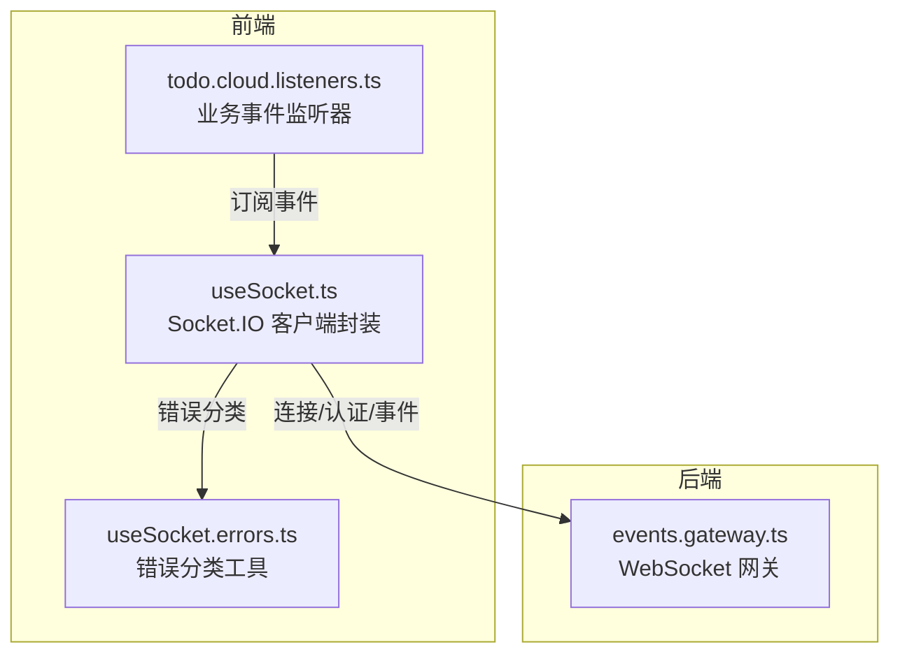
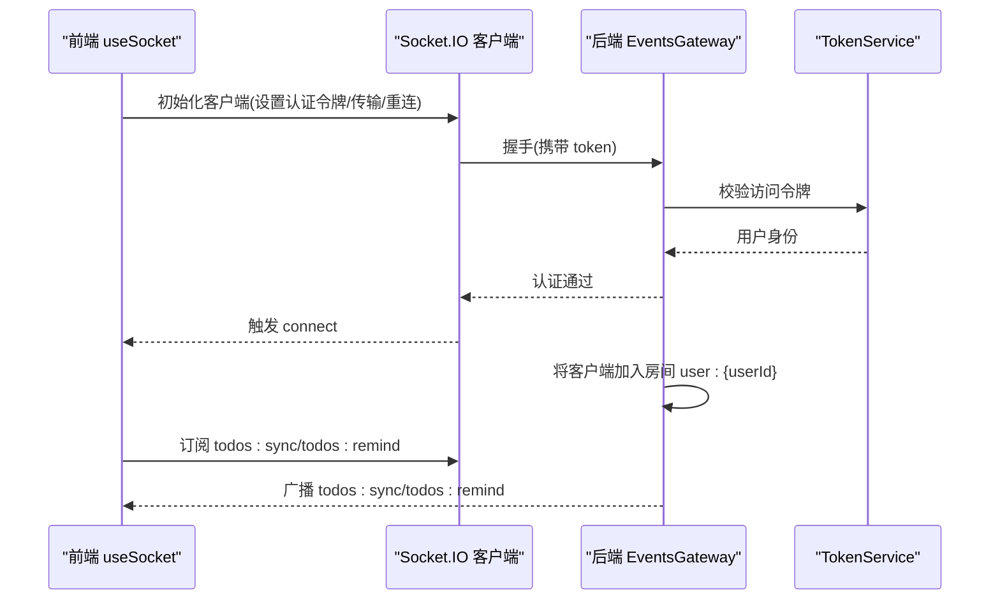
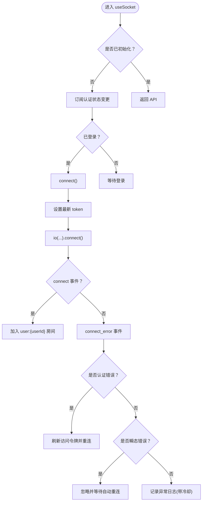
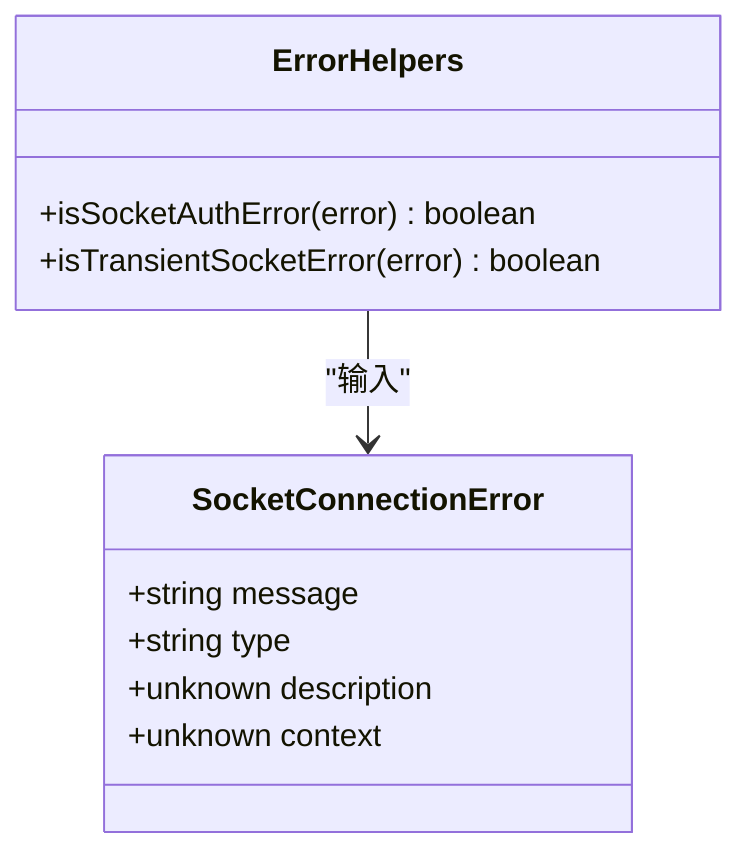
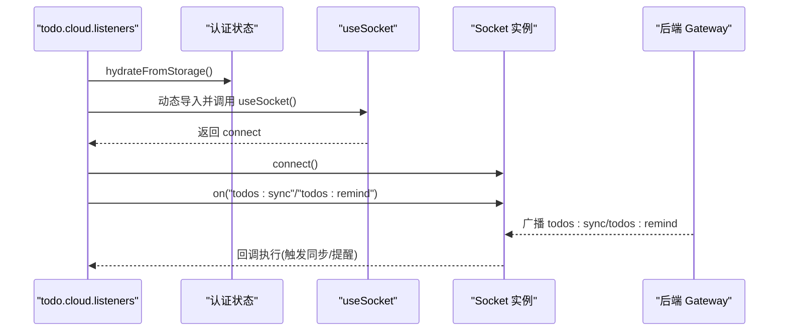
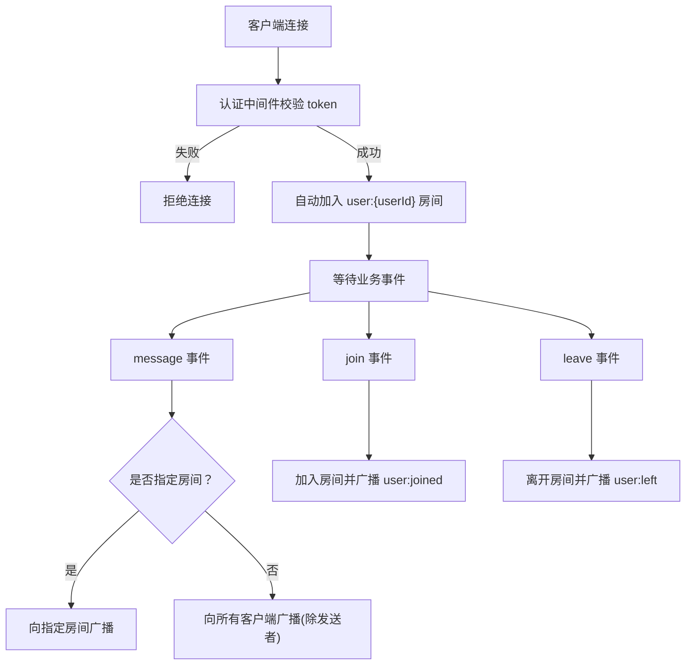
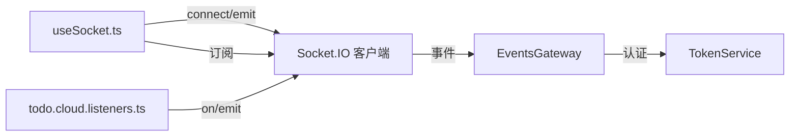

# WebSocket Hooks

<cite>
**本文引用的文件**
- [apps/frontend/src/composables/useSocket.ts](file://apps/frontend/src/composables/useSocket.ts)
- [apps/frontend/src/composables/useSocket.errors.ts](file://apps/frontend/src/composables/useSocket.errors.ts)
- [apps/frontend/src/features/todo/stores/todo.cloud.listeners.ts](file://apps/frontend/src/features/todo/stores/todo.cloud.listeners.ts)
- [apps/backend/src/events/events.gateway.ts](file://apps/backend/src/events/events.gateway.ts)
</cite>

## 目录

1. [简介](#简介)
2. [项目结构](#项目结构)
3. [核心组件](#核心组件)
4. [架构总览](#架构总览)
5. [详细组件分析](#详细组件分析)
6. [依赖关系分析](#依赖关系分析)
7. [性能考量](#性能考量)
8. [故障排查指南](#故障排查指南)
9. [结论](#结论)
10. [附录](#附录)

## 简介

本文件围绕前端组合式API useSocket 的WebSocket通信能力进行系统化说明，覆盖连接管理、消息处理、状态监控、房间管理、事件监听与广播机制，并给出自动重连与错误恢复策略、调试方法、性能优化与安全注意事项。后端基于 NestJS WebSocket Gateway 提供认证、房间与广播能力，前后端通过统一的事件命名空间与鉴权流程协作。

## 项目结构

- 前端
  - 组合式API：useSocket（Socket.IO 客户端封装）、useSocket.errors（错误类型与分类辅助）
  - 功能集成：todo.cloud.listeners 使用 useSocket 订阅 todos:sync、todos:remind 等事件
- 后端
  - WebSocket 网关：EventsGateway，提供认证中间件、房间加入/离开、消息转发与广播

图表来源

- [apps/frontend/src/composables/useSocket.ts:56-191](file://apps/frontend/src/composables/useSocket.ts#L56-L191)
- [apps/frontend/src/composables/useSocket.errors.ts:1-33](file://apps/frontend/src/composables/useSocket.errors.ts#L1-L33)
- [apps/frontend/src/features/todo/stores/todo.cloud.listeners.ts:47-84](file://apps/frontend/src/features/todo/stores/todo.cloud.listeners.ts#L47-L84)
- [apps/backend/src/events/events.gateway.ts:57-266](file://apps/backend/src/events/events.gateway.ts#L57-L266)

章节来源

- [apps/frontend/src/composables/useSocket.ts:56-191](file://apps/frontend/src/composables/useSocket.ts#L56-L191)
- [apps/frontend/src/composables/useSocket.errors.ts:1-33](file://apps/frontend/src/composables/useSocket.errors.ts#L1-L33)
- [apps/frontend/src/features/todo/stores/todo.cloud.listeners.ts:47-84](file://apps/frontend/src/features/todo/stores/todo.cloud.listeners.ts#L47-L84)
- [apps/backend/src/events/events.gateway.ts:57-266](file://apps/backend/src/events/events.gateway.ts#L57-L266)

## 核心组件

- useSocket：提供单例 Socket 实例、连接/断开、等待连接完成、连接状态与 socketId 暴露；内置自动重连与认证错误处理；对前端业务层暴露统一接口。
- useSocket.errors：定义 Socket 连接错误结构体与两类错误识别函数：认证错误与瞬态传输错误。
- todo.cloud.listeners：在认证状态变化时动态挂载事件监听，订阅 todos:sync、todos:remind 等后端广播事件。

章节来源

- [apps/frontend/src/composables/useSocket.ts:19-26](file://apps/frontend/src/composables/useSocket.ts#L19-L26)
- [apps/frontend/src/composables/useSocket.ts:56-191](file://apps/frontend/src/composables/useSocket.ts#L56-L191)
- [apps/frontend/src/composables/useSocket.errors.ts:1-33](file://apps/frontend/src/composables/useSocket.errors.ts#L1-L33)
- [apps/frontend/src/features/todo/stores/todo.cloud.listeners.ts:7-13](file://apps/frontend/src/features/todo/stores/todo.cloud.listeners.ts#L7-L13)

## 架构总览

- 前端通过 useSocket 初始化 Socket.IO 客户端，设置认证令牌、传输协议、重连参数与命名空间路径。
- 后端 EventsGateway 在握手阶段校验 JWT，绑定用户身份到 socket.data.user，并自动将客户端加入其专属房间 user:{userId}。
- 前端在连接成功后可主动 join 房间或由后端自动加入；随后订阅业务事件（如 todos:sync、todos:remind）。
- 后端提供房间级与全站广播能力，用于跨设备同步与提醒等场景。

图表来源

- [apps/frontend/src/composables/useSocket.ts:59-111](file://apps/frontend/src/composables/useSocket.ts#L59-L111)
- [apps/backend/src/events/events.gateway.ts:86-141](file://apps/backend/src/events/events.gateway.ts#L86-L141)

## 详细组件分析

### useSocket 组合式API

- 单例与状态
  - 保持全局唯一 Socket 实例，维护 isConnected 与 socketId 的响应式状态。
  - 仅在首次调用时初始化监听器，避免重复订阅。
- 连接管理
  - 自动连接：当认证状态变为已登录时触发 connect。
  - 手动 connect：若未连接则设置最新 token 并发起连接。
  - 手动 disconnect：断开连接并清理实例与状态。
  - waitForConnection：在超时前等待连接成功或失败，返回 socketId 或 null。
- 事件与房间
  - connect 成功时记录 socketId 并自动加入 user:{userId} 房间。
  - 支持手动 join/leave 房间（由业务侧调用 emit 'join'/'leave'）。
- 错误处理与自动重连
  - 认证错误：当检测到与认证相关的错误且当前已登录时，尝试刷新访问令牌并重新连接。
  - 瞬态错误：对超时、传输关闭/错误等瞬态问题忽略，交由 Socket.IO 自动重连。
  - 其他异常：按冷却时间去重记录日志，避免刷屏。
- 传输与路径
  - 开发环境优先轮询，再 WebSocket；生产环境优先 WebSocket，再轮询。
  - 显式指定 path 与命名空间，确保与 Nginx/反向代理配置一致。

图表来源

- [apps/frontend/src/composables/useSocket.ts:164-180](file://apps/frontend/src/composables/useSocket.ts#L164-L180)
- [apps/frontend/src/composables/useSocket.ts:113-120](file://apps/frontend/src/composables/useSocket.ts#L113-L120)
- [apps/frontend/src/composables/useSocket.ts:93-108](file://apps/frontend/src/composables/useSocket.ts#L93-L108)

章节来源

- [apps/frontend/src/composables/useSocket.ts:56-191](file://apps/frontend/src/composables/useSocket.ts#L56-L191)

### useSocket.errors 错误分类工具

- 类型定义：SocketConnectionError 包含 message、type、description、context 等字段。
- 认证错误识别：根据错误消息中包含 unauthorized、token、jwt、authentication 等关键词判断。
- 瞬态错误识别：根据错误消息或类型中包含 timeout、transport close、transport error、websocket error、xhr poll/post error 等关键词判断。

图表来源

- [apps/frontend/src/composables/useSocket.errors.ts:1-33](file://apps/frontend/src/composables/useSocket.errors.ts#L1-L33)

章节来源

- [apps/frontend/src/composables/useSocket.errors.ts:1-33](file://apps/frontend/src/composables/useSocket.errors.ts#L1-L33)

### 业务事件监听器 todo.cloud.listeners

- 初始化与挂载
  - 首次调用时启动本地提醒循环，加载认证状态，attach 事件监听。
  - 当认证状态变化时，强制重新 attach，确保在登录后自动连接并订阅事件。
- 订阅事件
  - todos:sync：触发去抖动同步逻辑。
  - todos:remind：更新本地待办提醒时间并标记同步状态。
- 与 useSocket 的交互
  - 通过动态导入 useSocket 获取 connect，拿到 Socket 实例后注册事件监听。

图表来源

- [apps/frontend/src/features/todo/stores/todo.cloud.listeners.ts:47-84](file://apps/frontend/src/features/todo/stores/todo.cloud.listeners.ts#L47-L84)
- [apps/frontend/src/composables/useSocket.ts:113-120](file://apps/frontend/src/composables/useSocket.ts#L113-L120)

章节来源

- [apps/frontend/src/features/todo/stores/todo.cloud.listeners.ts:47-84](file://apps/frontend/src/features/todo/stores/todo.cloud.listeners.ts#L47-L84)

### 后端 EventsGateway 能力

- 认证中间件
  - 从握手数据或头部提取 token，校验 JWT 并检查会话是否失效，失败则拒绝连接。
  - 成功后将用户信息写入 socket.data.user，后续房间访问控制以此为准。
- 房间管理
  - 自动加入：连接成功后自动加入 user:{userId} 房间。
  - 手动加入/离开：校验房间归属，仅允许用户加入自己的房间；离开后通知房间内其他成员。
- 事件处理
  - message：支持向指定房间广播或全站广播；返回确认结果。
  - join/leave：加入/离开房间并广播 user:joined/user:left 事件。
- 广播机制
  - broadcastSyncNotify：对同一用户多设备同步进行后端防抖（500ms），避免风暴。
  - broadcastToRoom/broadcastToAll：供其他服务调用进行房间/全站广播。

图表来源

- [apps/backend/src/events/events.gateway.ts:86-141](file://apps/backend/src/events/events.gateway.ts#L86-L141)
- [apps/backend/src/events/events.gateway.ts:150-175](file://apps/backend/src/events/events.gateway.ts#L150-L175)
- [apps/backend/src/events/events.gateway.ts:207-226](file://apps/backend/src/events/events.gateway.ts#L207-L226)
- [apps/backend/src/events/events.gateway.ts:231-250](file://apps/backend/src/events/events.gateway.ts#L231-L250)

章节来源

- [apps/backend/src/events/events.gateway.ts:57-266](file://apps/backend/src/events/events.gateway.ts#L57-L266)

## 依赖关系分析

- 前端依赖
  - useSocket 依赖认证状态存储以驱动连接生命周期。
  - todo.cloud.listeners 依赖 useSocket 的 connect 与事件监听能力。
- 后端依赖
  - EventsGateway 依赖 TokenService 进行 JWT 校验与会话有效性检查。
- 通信契约
  - 前端通过命名空间 /events 与后端通信，显式设置 path 与 transports。
  - 事件名约定：todos:sync、todos:remind、message、join、leave、user:joined、user:left。

图表来源

- [apps/frontend/src/composables/useSocket.ts:56-191](file://apps/frontend/src/composables/useSocket.ts#L56-L191)
- [apps/frontend/src/features/todo/stores/todo.cloud.listeners.ts:47-84](file://apps/frontend/src/features/todo/stores/todo.cloud.listeners.ts#L47-L84)
- [apps/backend/src/events/events.gateway.ts:66-116](file://apps/backend/src/events/events.gateway.ts#L66-L116)

章节来源

- [apps/frontend/src/composables/useSocket.ts:56-191](file://apps/frontend/src/composables/useSocket.ts#L56-L191)
- [apps/frontend/src/features/todo/stores/todo.cloud.listeners.ts:47-84](file://apps/frontend/src/features/todo/stores/todo.cloud.listeners.ts#L47-L84)
- [apps/backend/src/events/events.gateway.ts:57-266](file://apps/backend/src/events/events.gateway.ts#L57-L266)

## 性能考量

- 传输选择
  - 开发环境优先轮询，便于调试；生产环境优先 WebSocket，降低延迟与 CPU 开销。
- 重连策略
  - 设置最大重连次数与指数退避上限，配合随机抖动减少雪崩效应。
- 广播防抖
  - 后端对同一用户的同步广播进行 500ms 防抖，避免频繁广播导致网络与渲染压力。
- 事件粒度
  - 使用房间隔离用户数据，避免全站广播带来的无差别流量。
- 前端去抖
  - 业务侧对同步动作进行去抖，结合本地状态与时间窗口控制同步频率。

[本节为通用性能建议，无需特定文件引用]

## 故障排查指南

- 连接失败
  - 检查认证令牌是否有效与最新；若出现认证类错误，确认 isSocketAuthError 判断逻辑与刷新流程。
  - 关注 connect_error 事件，区分瞬态错误与非瞬态错误；瞬态错误应交由自动重连处理。
- 房间权限
  - 确认 join 时房间名格式 user:{userId} 与当前用户 ID 一致；后端会校验并拒绝越权访问。
- 事件未到达
  - 确认前端已正确订阅 todos:sync、todos:remind 等事件；检查业务 attach 流程是否在登录后执行。
- 日志定位
  - 使用冷却日志策略避免刷屏；关注错误指纹（type+message）以便快速定位重复问题。
- CORS 与路径
  - 确保前端 path 与后端命名空间一致；核对 CORS 配置允许来源与凭证。

章节来源

- [apps/frontend/src/composables/useSocket.ts:32-51](file://apps/frontend/src/composables/useSocket.ts#L32-L51)
- [apps/frontend/src/composables/useSocket.ts:93-108](file://apps/frontend/src/composables/useSocket.ts#L93-L108)
- [apps/backend/src/events/events.gateway.ts:20-56](file://apps/backend/src/events/events.gateway.ts#L20-L56)

## 结论

useSocket 将 Socket.IO 的复杂性封装为简洁的组合式API，提供连接生命周期管理、认证错误自愈、瞬态错误屏蔽与冷却日志等能力；配合后端 EventsGateway 的认证中间件、房间与广播机制，形成完整的实时通信闭环。业务侧通过 todo.cloud.listeners 展示了如何在认证状态变化时动态挂载事件监听，实现跨设备同步与提醒等场景。

[本节为总结，无需特定文件引用]

## 附录

- 事件清单
  - 前端触发：join、leave、message（由业务侧决定是否发送）
  - 前端订阅：todos:sync、todos:remind、user:joined、user:left、message
- 安全要点
  - 强制 JWT 校验与会话有效性检查；房间名严格绑定用户 ID。
  - CORS 显式白名单与凭证支持，避免跨域风险。
- 调试技巧
  - 开启 Socket.IO 客户端与后端日志；利用冷却日志指纹快速定位重复错误；在开发环境切换传输协议以观察行为差异。

[本节为补充信息，无需特定文件引用]
