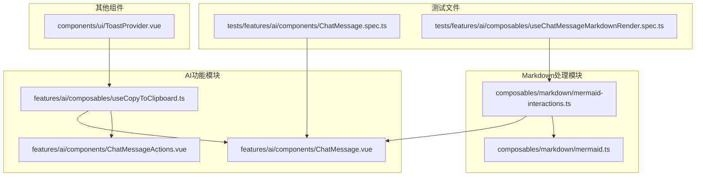
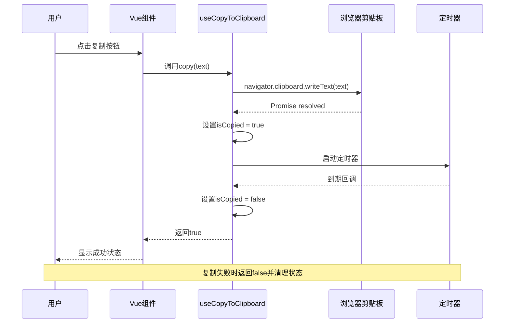
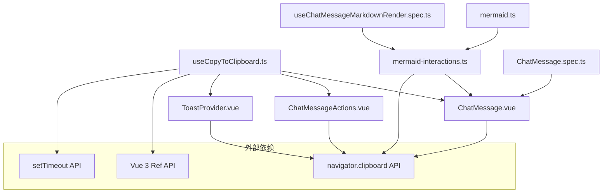

# 复制到剪贴板组合式API

<cite>
**本文档引用的文件**
- [useCopyToClipboard.ts](file://apps/frontend/src/features/ai/composables/useCopyToClipboard.ts)
- [ChatMessage.vue](file://apps/frontend/src/features/ai/components/ChatMessage.vue)
- [ChatMessageActions.vue](file://apps/frontend/src/features/ai/components/ChatMessageActions.vue)
- [mermaid-interactions.ts](file://apps/frontend/src/composables/markdown/mermaid-interactions.ts)
- [ChatMessage.spec.ts](file://apps/frontend/tests/features/ai/components/ChatMessage.spec.ts)
- [useChatMessageMarkdownRender.spec.ts](file://apps/frontend/tests/features/ai/composables/useChatMessageMarkdownRender.spec.ts)
- [ToastProvider.vue](file://apps/frontend/src/components/ui/ToastProvider.vue)
</cite>

## 目录
1. [简介](#简介)
2. [项目结构](#项目结构)
3. [核心组件](#核心组件)
4. [架构概览](#架构概览)
5. [详细组件分析](#详细组件分析)
6. [依赖关系分析](#依赖关系分析)
7. [性能考虑](#性能考虑)
8. [故障排除指南](#故障排除指南)
9. [结论](#结论)

## 简介

本文档深入分析了项目中的"复制到剪贴板组合式API"，这是一个基于Vue 3 Composition API设计的可复用功能模块。该API封装了浏览器原生的navigator.clipboard.writeText方法，提供了统一的复制状态管理和自动清理机制，避免了各组件重复实现相同的复制逻辑。

该功能在AI聊天界面中发挥着重要作用，用户可以通过点击复制按钮快速复制聊天内容、代码片段或Mermaid图表源码。系统还集成了多种复制场景，包括用户消息复制、AI消息复制、代码块复制和图表复制等。

## 项目结构

该项目采用现代化的前端架构，主要包含以下与复制功能相关的文件结构：



**图表来源**
- [useCopyToClipboard.ts:1-38](file://apps/frontend/src/features/ai/composables/useCopyToClipboard.ts#L1-L38)
- [ChatMessage.vue:1-632](file://apps/frontend/src/features/ai/components/ChatMessage.vue#L1-L632)
- [mermaid-interactions.ts:1-145](file://apps/frontend/src/composables/markdown/mermaid-interactions.ts#L1-L145)

**章节来源**
- [useCopyToClipboard.ts:1-38](file://apps/frontend/src/features/ai/composables/useCopyToClipboard.ts#L1-L38)
- [ChatMessage.vue:1-632](file://apps/frontend/src/features/ai/components/ChatMessage.vue#L1-L632)

## 核心组件

### useCopyToClipboard 组合式函数

这是整个复制功能的核心，提供了一个简洁的API接口：

**主要特性：**
- **状态管理**：使用ref跟踪复制状态(isCopied)
- **异步处理**：封装navigator.clipboard.writeText的Promise
- **自动清理**：定时器自动重置复制状态
- **生命周期管理**：在组件卸载时清理定时器

**API定义：**
```typescript
function useCopyToClipboard(resetDelay: number = 2000): {
  isCopied: Ref<boolean>
  copy: (text: string) => Promise<boolean>
}
```

**实现细节：**
- 默认重置延迟为2000毫秒
- 使用try-catch处理复制失败情况
- 支持自定义重置延迟时间
- 自动清理内存泄漏风险

**章节来源**
- [useCopyToClipboard.ts:9-37](file://apps/frontend/src/features/ai/composables/useCopyToClipboard.ts#L9-L37)

## 架构概览

复制功能在整个应用中的架构关系如下：



**图表来源**
- [ChatMessage.vue:83-88](file://apps/frontend/src/features/ai/components/ChatMessage.vue#L83-L88)
- [useCopyToClipboard.ts:20-34](file://apps/frontend/src/features/ai/composables/useCopyToClipboard.ts#L20-L34)

## 详细组件分析

### ChatMessage 组件集成

ChatMessage组件是复制功能的主要使用者之一，实现了用户消息的复制功能：

**关键实现：**
- 导入并使用useCopyToClipboard组合式函数
- 提供copyUserContent方法处理用户消息复制
- 在模板中显示复制状态反馈
- 支持移动端和桌面端的不同UI布局

**状态反馈机制：**
- 使用isCopied布尔值控制按钮图标
- 根据复制状态动态显示"复制"或"已复制"文本
- 支持国际化文本显示

**章节来源**
- [ChatMessage.vue:25-61](file://apps/frontend/src/features/ai/components/ChatMessage.vue#L25-L61)
- [ChatMessage.vue:530-561](file://apps/frontend/src/features/ai/components/ChatMessage.vue#L530-L561)

### ChatMessageActions 组件

ChatMessageActions组件专门处理AI消息的复制操作：

**功能特点：**
- 接收content属性作为复制内容
- 集成useCopyToClipboard进行统一状态管理
- 提供regenerate和delete事件处理
- 支持响应式窗口尺寸检测

**交互流程：**
- 用户点击复制按钮触发copyContent方法
- 调用copyToClipboard函数执行复制操作
- 根据复制结果提供相应的用户反馈
- 复制失败时记录警告信息

**章节来源**
- [ChatMessageActions.vue:17-39](file://apps/frontend/src/features/ai/components/ChatMessageActions.vue#L17-L39)

### Mermaid 图表复制功能

系统还集成了Mermaid图表的复制功能，允许用户复制图表源码：

**实现机制：**
- 在图表容器上添加data-raw属性存储原始代码
- 通过data-action="copy"标识复制按钮
- 使用decodeURIComponent解码原始代码
- 集成到图表的交互控制系统中

**技术细节：**
- 支持编辑器直接打开图表源码
- 集成缩放、拖拽和复制功能
- 使用CSS变量控制图表变换效果

**章节来源**
- [mermaid-interactions.ts:42-47](file://apps/frontend/src/composables/markdown/mermaid-interactions.ts#L42-L47)
- [mermaid.ts:170-172](file://apps/frontend/src/composables/markdown/mermaid.ts#L170-L172)

### 代码块复制功能

系统还支持Markdown代码块的复制功能：

**实现方式：**
- 通过data-code属性存储代码内容
- 使用decodeURIComponent解码实际代码
- 提供视觉反馈显示复制状态
- 支持国际化文本切换

**用户交互：**
- 复制成功后按钮添加copied类名
- 文本内容切换为"已复制"状态
- 2秒后自动恢复原始状态

**章节来源**
- [mermaid-interactions.ts:123-143](file://apps/frontend/src/composables/markdown/mermaid-interactions.ts#L123-L143)

## 依赖关系分析

复制功能的依赖关系图：



**图表来源**
- [useCopyToClipboard.ts:1-38](file://apps/frontend/src/features/ai/composables/useCopyToClipboard.ts#L1-L38)
- [ChatMessage.vue:25](file://apps/frontend/src/features/ai/components/ChatMessage.vue#L25)
- [mermaid-interactions.ts:45](file://apps/frontend/src/composables/markdown/mermaid-interactions.ts#L45)

**依赖特性：**
- **Vue 3 Ref API**：用于状态管理
- **浏览器剪贴板API**：核心复制功能
- **定时器API**：自动状态清理
- **事件监听器**：用户交互处理

**章节来源**
- [useCopyToClipboard.ts:1-38](file://apps/frontend/src/features/ai/composables/useCopyToClipboard.ts#L1-L38)
- [mermaid-interactions.ts:1-145](file://apps/frontend/src/composables/markdown/mermaid-interactions.ts#L1-L145)

## 性能考虑

### 内存管理优化

**定时器清理机制：**
- 在组件卸载时自动清理定时器
- 防止内存泄漏和不必要的资源占用
- 确保多个组件实例间的独立状态管理

**异步操作优化：**
- 使用Promise处理异步复制操作
- 避免阻塞主线程
- 提供及时的状态反馈

### 用户体验优化

**状态反馈机制：**
- 即时的视觉状态变化
- 国际化文本支持
- 响应式设计适配不同设备

**错误处理策略：**
- 复制失败时优雅降级
- 提供用户友好的错误提示
- 记录必要的调试信息

## 故障排除指南

### 常见问题及解决方案

**复制功能失效：**
1. 检查浏览器是否支持navigator.clipboard API
2. 确认页面是否在HTTPS环境下运行
3. 验证用户权限设置

**状态显示异常：**
1. 检查isCopied状态是否正确更新
2. 确认定时器是否正常执行
3. 验证组件生命周期钩子是否正确调用

**测试环境配置：**
```typescript
// 测试中模拟navigator.clipboard
const mockWriteText = vi.fn().mockResolvedValue(undefined)
Object.defineProperty(navigator, 'clipboard', {
  value: { writeText: mockWriteText },
  configurable: true,
})
```

**章节来源**
- [ChatMessage.spec.ts:444-489](file://apps/frontend/tests/features/ai/components/ChatMessage.spec.ts#L444-L489)
- [useChatMessageMarkdownRender.spec.ts:59-85](file://apps/frontend/tests/features/ai/composables/useChatMessageMarkdownRender.spec.ts#L59-L85)

### 调试技巧

**开发工具使用：**
- 利用Vue DevTools监控状态变化
- 检查网络面板确认剪贴板API调用
- 使用浏览器开发者工具调试异步操作

**日志记录：**
- 在复制失败时记录详细错误信息
- 监控定时器执行情况
- 跟踪组件生命周期事件

## 结论

复制到剪贴板组合式API是一个设计精良的功能模块，它成功地解决了跨组件复制功能的复用问题。通过统一的状态管理、完善的错误处理和良好的用户体验设计，该API为整个应用提供了可靠的内容复制能力。

**主要优势：**
- **高复用性**：避免重复代码实现
- **状态统一**：集中管理复制状态
- **用户体验**：即时反馈和自动清理
- **扩展性强**：易于集成新的复制场景

**未来改进方向：**
- 支持更多格式的复制内容
- 增强离线环境下的复制功能
- 优化移动端的复制体验
- 添加复制历史记录功能

该API的设计充分体现了现代前端开发的最佳实践，为类似的功能模块提供了优秀的参考范例。