# 工具类Hooks

<cite>
**本文档引用的文件**
- [apps/frontend/src/composables/useTheme.ts](file://apps/frontend/src/composables/useTheme.ts)
- [apps/frontend/src/composables/useToast.ts](file://apps/frontend/src/composables/useToast.ts)
- [apps/frontend/src/composables/useWindowSize.ts](file://apps/frontend/src/composables/useWindowSize.ts)
- [apps/frontend/src/composables/useFileParsing.ts](file://apps/frontend/src/composables/useFileParsing.ts)
- [apps/frontend/src/composables/useGsap.ts](file://apps/frontend/src/composables/useGsap.ts)
- [apps/frontend/src/composables/useEscClose.ts](file://apps/frontend/src/composables/useEscClose.ts)
- [apps/frontend/src/composables/useResizable.ts](file://apps/frontend/src/composables/useResizable.ts)
- [apps/frontend/src/composables/useSmartScroll.ts](file://apps/frontend/src/composables/useSmartScroll.ts)
- [apps/frontend/src/composables/useSocket.ts](file://apps/frontend/src/composables/useSocket.ts)
- [apps/frontend/src/composables/index.ts](file://apps/frontend/src/composables/index.ts)
- [apps/frontend/tests/composables/useTheme.spec.ts](file://apps/frontend/tests/composables/useTheme.spec.ts)
- [apps/frontend/tests/composables/useWindowSize.spec.ts](file://apps/frontend/tests/composables/useWindowSize.spec.ts)
- [apps/frontend/tests/composables/useFileParsing.spec.ts](file://apps/frontend/tests/composables/useFileParsing.spec.ts)
- [apps/frontend/tests/composables/useGsap.spec.ts](file://apps/frontend/tests/composables/useGsap.spec.ts)
</cite>

## 目录

1. [简介](#简介)
2. [项目结构](#项目结构)
3. [核心组件](#核心组件)
4. [架构总览](#架构总览)
5. [详细组件分析](#详细组件分析)
6. [依赖关系分析](#依赖关系分析)
7. [性能考量](#性能考量)
8. [故障排查指南](#故障排查指南)
9. [结论](#结论)
10. [附录](#附录)

## 简介

本文件面向通用工具类组合式API，系统化梳理并解释以下能力：

- 主题切换与颜色体系：主题模式、预设色板、随机色、可访问性对比度保障、CSS变量注入与持久化。
- 通知提示：消息队列、定时器管理、悬停暂停/恢复、类型化提示。
- 窗口尺寸监听：响应式宽高、移动端断点判断、生命周期安全处理。
- 文件解析：前后端混合解析策略、内容截断与告警、鉴权与错误处理。
- 动画效果：GSAP上下文封装、组件卸载自动清理。
- 跨组件通信与系统集成：ESC键堆叠关闭、可调整面板、智能滚动、Socket连接与重连。

文档同时给出设计原则、复用策略、扩展方法、测试与性能监控建议、错误处理策略以及开发规范与最佳实践。

## 项目结构

工具类hooks集中于前端应用的组合式API目录，按功能域分组导出，便于按需引入与测试隔离。

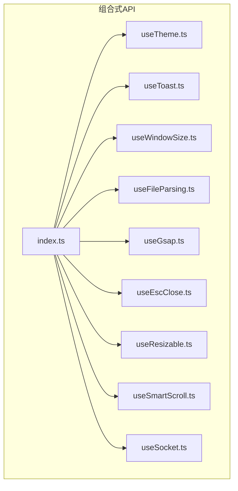

**图表来源**

- [apps/frontend/src/composables/index.ts:1-11](file://apps/frontend/src/composables/index.ts#L1-L11)

**章节来源**

- [apps/frontend/src/composables/index.ts:1-11](file://apps/frontend/src/composables/index.ts#L1-L11)

## 核心组件

- 主题与颜色体系：useTheme 提供主题模式、预设色、随机色、可访问性前景色、CSS变量注入与持久化。
- 通知提示：useToast 提供消息队列、定时器、悬停暂停/恢复、类型化快捷方法。
- 窗口尺寸监听：useWindowSize 与 useIsMobile 提供响应式宽高与移动端断点。
- 文件解析：useFileParsing 提供前端直读与后端解析的混合策略、内容截断与错误处理。
- 动画效果：useGsap 提供GSAP实例与上下文，自动清理。
- ESC键堆叠关闭：useEscClose 提供全局ESC监听与组件级堆叠管理。
- 可调整面板：useResizable 提供拖拽调整宽度/高度、边界约束与回调。
- 智能滚动：useSmartScroll 提供自动粘附、用户交互感知、流式更新优化、RAF批处理与节流。
- Socket连接：useSocket 提供单例连接、鉴权透传、重连策略、错误分类与日志冷却。

**章节来源**

- [apps/frontend/src/composables/useTheme.ts:308-377](file://apps/frontend/src/composables/useTheme.ts#L308-L377)
- [apps/frontend/src/composables/useToast.ts:17-85](file://apps/frontend/src/composables/useToast.ts#L17-L85)
- [apps/frontend/src/composables/useWindowSize.ts:6-44](file://apps/frontend/src/composables/useWindowSize.ts#L6-L44)
- [apps/frontend/src/composables/useFileParsing.ts:24-121](file://apps/frontend/src/composables/useFileParsing.ts#L24-L121)
- [apps/frontend/src/composables/useGsap.ts:7-19](file://apps/frontend/src/composables/useGsap.ts#L7-L19)
- [apps/frontend/src/composables/useEscClose.ts:34-65](file://apps/frontend/src/composables/useEscClose.ts#L34-L65)
- [apps/frontend/src/composables/useResizable.ts:12-69](file://apps/frontend/src/composables/useResizable.ts#L12-L69)
- [apps/frontend/src/composables/useSmartScroll.ts:33-441](file://apps/frontend/src/composables/useSmartScroll.ts#L33-L441)
- [apps/frontend/src/composables/useSocket.ts:56-190](file://apps/frontend/src/composables/useSocket.ts#L56-L190)

## 架构总览

工具hooks遵循“单一职责、最小耦合、可测试”的设计原则，通过Vue响应式系统与浏览器API协作，提供跨组件共享的状态与行为。

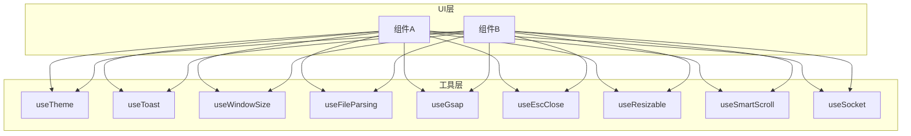

## 详细组件分析

### 主题切换与颜色体系（useTheme）

- 设计要点
  - 主题模式：基于系统偏好与用户选择，支持light/dark/auto三态。
  - 预设色板：内置多组推荐配色，支持随机色。
  - 颜色空间转换：HEX↔RGB↔HSL互转，确保可访问性对比度。
  - CSS变量注入：动态写入CSS变量，覆盖明暗两套主题。
  - 持久化：通过storage保存用户选择，刷新后恢复。
- 状态与持久化
  - effectiveTheme/isDark：计算属性，反映最终生效的主题。
  - themeColor：持久化主题色；支持重置与随机切换。
- 可访问性
  - 自动选择前景色（亮/暗），保证对比度≥4.5。
  - 悬停态亮度调整，确保hover态同样满足对比度。
- 扩展建议
  - 新增预设色时，校验对比度与亮度范围。
  - 支持按品牌色生成衍生色板。

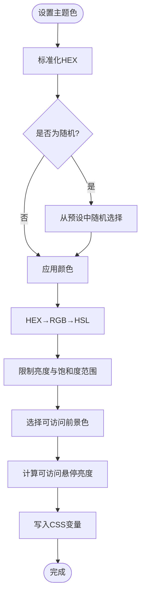

**图表来源**

- [apps/frontend/src/composables/useTheme.ts:237-306](file://apps/frontend/src/composables/useTheme.ts#L237-L306)

**章节来源**

- [apps/frontend/src/composables/useTheme.ts:308-377](file://apps/frontend/src/composables/useTheme.ts#L308-L377)

### 通知提示（useToast）

- 设计要点
  - 消息队列：基于响应式数组维护toast列表。
  - 定时器：每条toast独立计时器，支持暂停/恢复。
  - 类型化：success/info/warning/error快捷方法。
  - 生命周期：移除时清理计时器，避免内存泄漏。
- 使用建议
  - 为重要操作提供action按钮，提升可操作性。
  - 控制全局最大数量，避免遮挡。

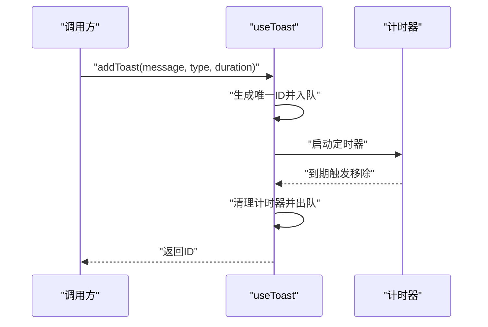

**图表来源**

- [apps/frontend/src/composables/useToast.ts:17-85](file://apps/frontend/src/composables/useToast.ts#L17-L85)

**章节来源**

- [apps/frontend/src/composables/useToast.ts:17-85](file://apps/frontend/src/composables/useToast.ts#L17-L85)

### 窗口尺寸监听（useWindowSize / useIsMobile）

- 设计要点
  - 响应式宽高：在组件挂载时注册resize监听，在卸载时移除。
  - 非组件环境：在window存在时注册监听，避免SSR问题。
  - 移动端断点：以768px为阈值，提供isMobile计算属性。
- 性能
  - 首次值来自window，避免不必要的重排。
  - 非组件场景仅注册一次监听器。

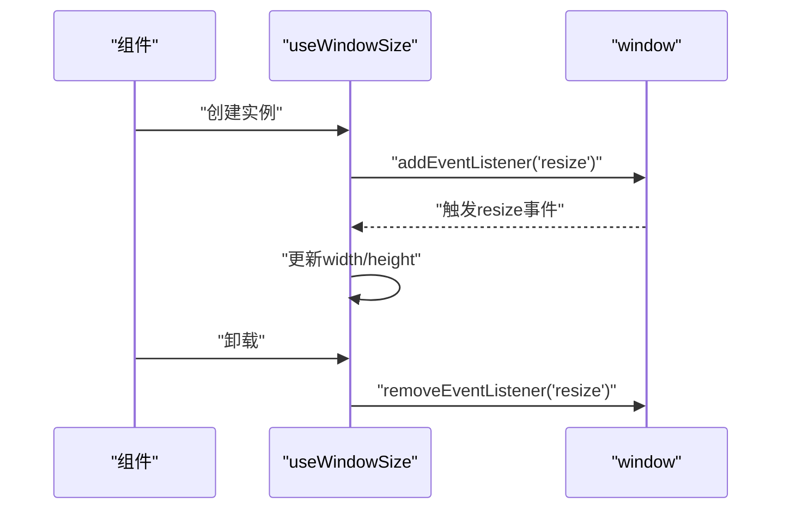

**图表来源**

- [apps/frontend/src/composables/useWindowSize.ts:6-34](file://apps/frontend/src/composables/useWindowSize.ts#L6-L34)

**章节来源**

- [apps/frontend/src/composables/useWindowSize.ts:6-44](file://apps/frontend/src/composables/useWindowSize.ts#L6-L44)

### 文件解析（useFileParsing）

- 设计要点
  - 混合策略：前端直读（文本/代码）与后端解析（PDF/Word/Excel）。
  - 鉴权：复杂文件解析需要登录态，否则抛错。
  - 截断：超过阈值的内容进行截断并告警。
  - 状态：parsing/completed/error，携带错误信息。
- 与系统集成
  - 依赖鉴权store、上传API、国际化与附件常量。
  - 通过toast反馈解析结果与异常。

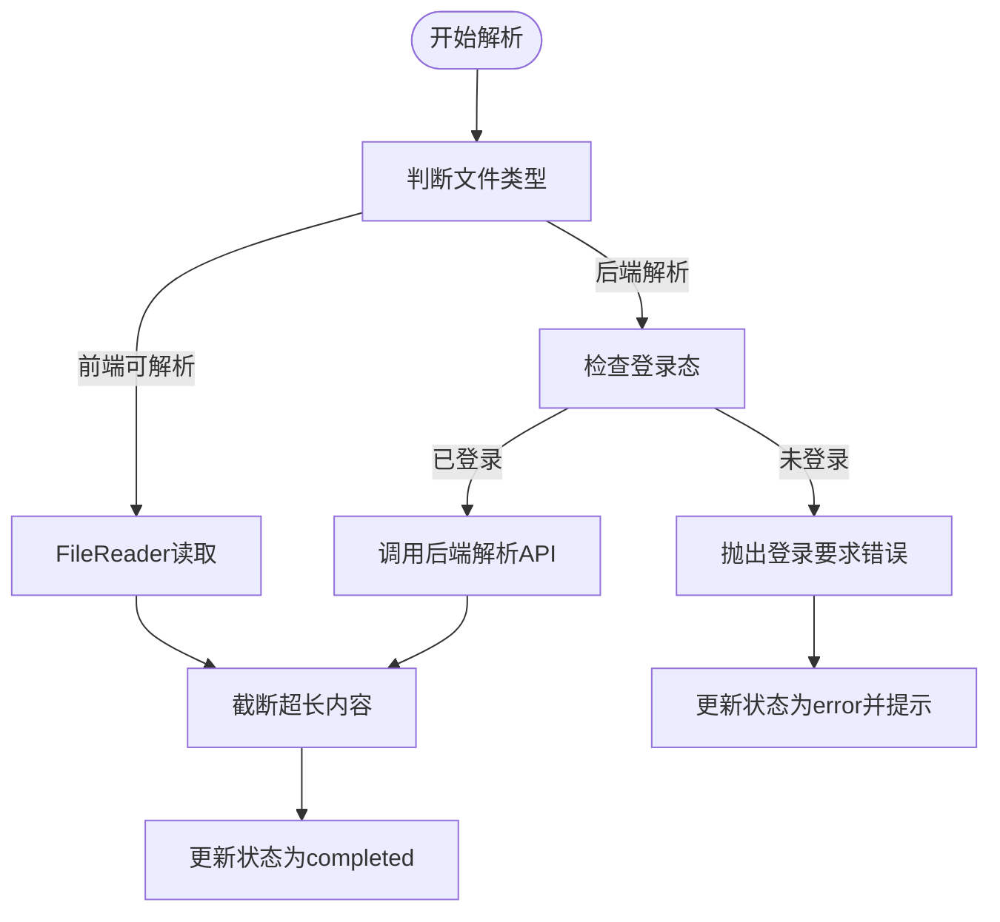

**图表来源**

- [apps/frontend/src/composables/useFileParsing.ts:47-95](file://apps/frontend/src/composables/useFileParsing.ts#L47-L95)

**章节来源**

- [apps/frontend/src/composables/useFileParsing.ts:24-121](file://apps/frontend/src/composables/useFileParsing.ts#L24-L121)

### 动画效果（useGsap）

- 设计要点
  - 注册Flip插件，提供gsap实例与上下文。
  - 组件卸载时自动revert上下文，避免动画残留。
- 使用建议
  - 在setup中调用，配合组件生命周期管理。
  - 对高频动画使用上下文作用域，避免全局污染。

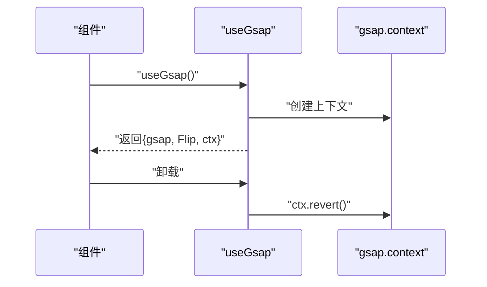

**图表来源**

- [apps/frontend/src/composables/useGsap.ts:7-19](file://apps/frontend/src/composables/useGsap.ts#L7-L19)

**章节来源**

- [apps/frontend/src/composables/useGsap.ts:7-19](file://apps/frontend/src/composables/useGsap.ts#L7-L19)

### ESC键堆叠关闭（useEscClose）

- 设计要点
  - 全局keydown监听，仅注册一次。
  - 堆栈管理：按打开顺序压栈，仅顶层回调生效。
  - 组件卸载时自动出栈，避免内存泄漏。
- 使用建议
  - 仅对真正需要ESC关闭的弹窗/抽屉使用。
  - 避免多层嵌套时的回调冲突。

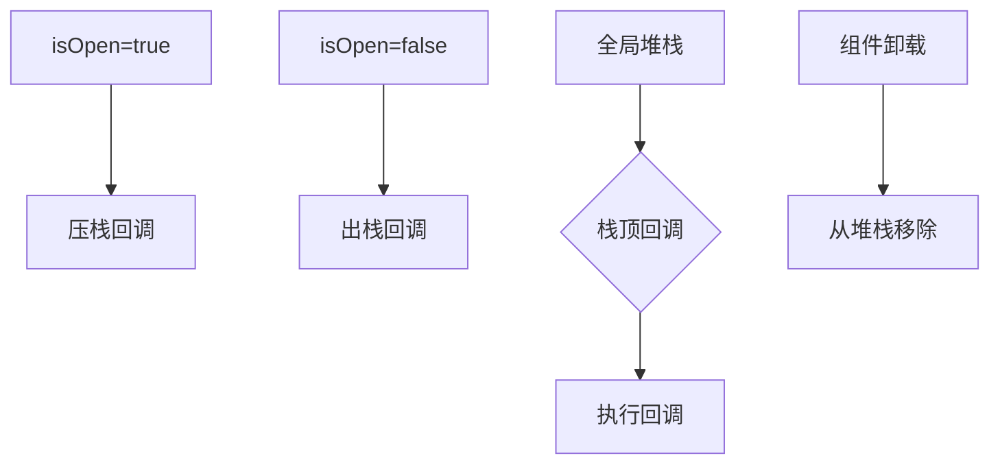

**图表来源**

- [apps/frontend/src/composables/useEscClose.ts:34-65](file://apps/frontend/src/composables/useEscClose.ts#L34-L65)

**章节来源**

- [apps/frontend/src/composables/useEscClose.ts:34-65](file://apps/frontend/src/composables/useEscClose.ts#L34-L65)

### 可调整面板（useResizable）

- 设计要点
  - 支持水平/垂直拖拽，提供min/max约束。
  - 鼠标事件绑定在document上，结束时清理。
  - 回调：onResize/onResizeEnd，便于同步布局或持久化。
- 使用建议
  - 结合响应式宽度与布局断点，提供平滑过渡。

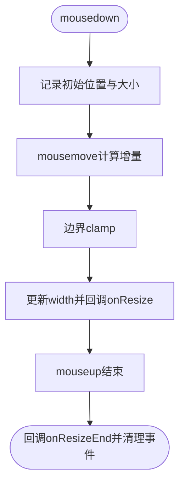

**图表来源**

- [apps/frontend/src/composables/useResizable.ts:50-68](file://apps/frontend/src/composables/useResizable.ts#L50-L68)

**章节来源**

- [apps/frontend/src/composables/useResizable.ts:12-69](file://apps/frontend/src/composables/useResizable.ts#L12-L69)

### 智能滚动（useSmartScroll）

- 设计要点
  - 自动粘附底部：内容新增时自动滚动到底部。
  - 用户交互感知：向上滚动时暂停自动粘附，显示“回到底部”提示。
  - 流式更新优化：高频更新使用RAF批处理与节流。
  - 观察者：ResizeObserver与MutationObserver跟踪尺寸与内容变化。
  - 动画：GSAP平滑滚动，短距离瞬时滚动。
- 性能
  - RAF批处理与节流，降低主线程压力。
  - 程序化滚动标记，避免滚动事件误判。

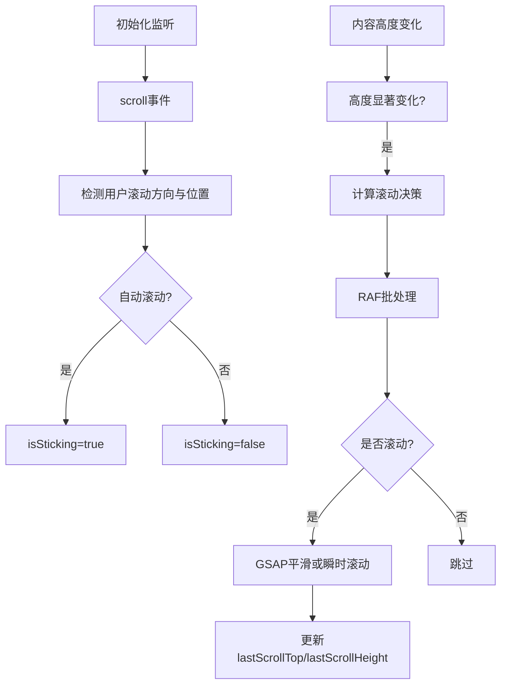

**图表来源**

- [apps/frontend/src/composables/useSmartScroll.ts:182-195](file://apps/frontend/src/composables/useSmartScroll.ts#L182-L195)
- [apps/frontend/src/composables/useSmartScroll.ts:209-240](file://apps/frontend/src/composables/useSmartScroll.ts#L209-L240)
- [apps/frontend/src/composables/useSmartScroll.ts:277-297](file://apps/frontend/src/composables/useSmartScroll.ts#L277-L297)

**章节来源**

- [apps/frontend/src/composables/useSmartScroll.ts:33-441](file://apps/frontend/src/composables/useSmartScroll.ts#L33-L441)

### Socket连接（useSocket）

- 设计要点
  - 单例连接：全局缓存socket实例，避免重复创建。
  - 鉴权：connect时注入token，connect_error时尝试刷新令牌。
  - 重连：指数退避与随机抖动，最大延迟可控。
  - 错误分类：区分鉴权错误与瞬时错误，非瞬时错误进行冷却日志。
  - 生命周期：根据鉴权store订阅自动连接/断开。
- 使用建议
  - 在需要实时事件的页面或模块中调用，避免无谓连接。
  - 使用waitForConnection等待连接稳定后再发送业务消息。

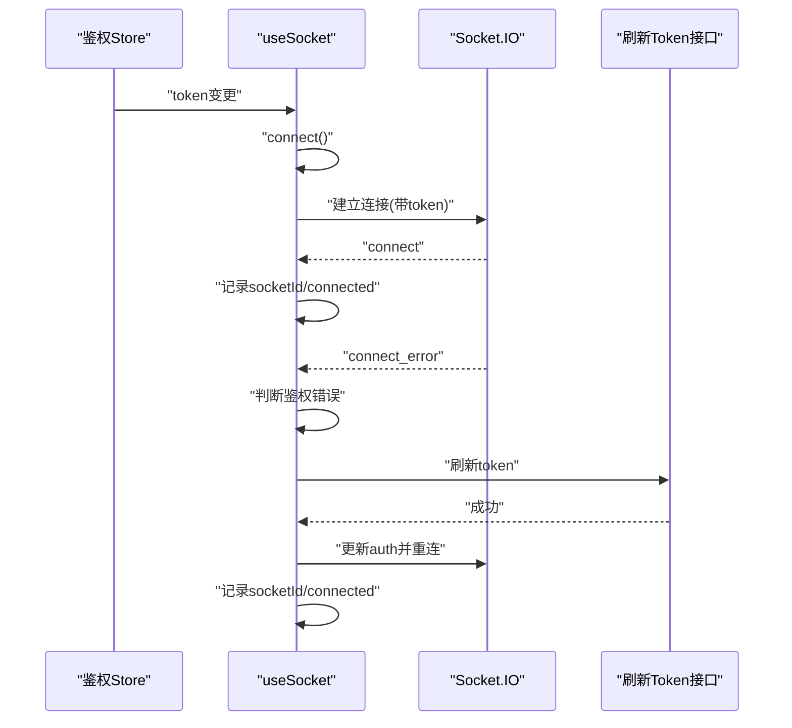

**图表来源**

- [apps/frontend/src/composables/useSocket.ts:56-190](file://apps/frontend/src/composables/useSocket.ts#L56-L190)

**章节来源**

- [apps/frontend/src/composables/useSocket.ts:56-190](file://apps/frontend/src/composables/useSocket.ts#L56-L190)

## 依赖关系分析

- 组件内聚与解耦
  - useTheme与useStorage、@vueuse/core协作，低耦合。
  - useToast独立于UI组件，仅依赖浏览器定时器。
  - useWindowSize仅依赖window对象，无副作用。
  - useFileParsing依赖鉴权store、上传API、i18n与常量。
  - useGsap依赖GSAP与Flip插件，上下文自动清理。
  - useEscClose依赖全局事件与组件ref，避免重复注册。
  - useResizable依赖鼠标事件与边界参数，回调解耦。
  - useSmartScroll依赖GSAP、RAF批处理与观察者，关注点分离。
  - useSocket依赖鉴权store与Socket.IO，错误分类清晰。
- 外部依赖
  - 第三方库：GSAP、Socket.IO、@vueuse/core。
  - 浏览器API：FileReader、File、ResizeObserver、MutationObserver、WebSocket。

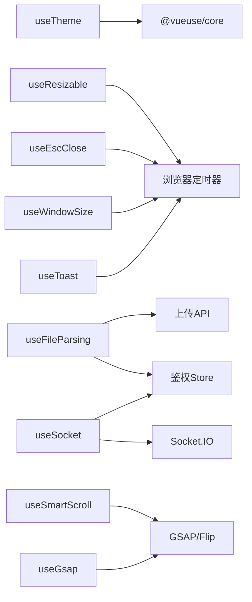

**图表来源**

- [apps/frontend/src/composables/useTheme.ts:1-2](file://apps/frontend/src/composables/useTheme.ts#L1-L2)
- [apps/frontend/src/composables/useFileParsing.ts:2-7](file://apps/frontend/src/composables/useFileParsing.ts#L2-L7)
- [apps/frontend/src/composables/useGsap.ts:1-3](file://apps/frontend/src/composables/useGsap.ts#L1-L3)
- [apps/frontend/src/composables/useSocket.ts:1-3](file://apps/frontend/src/composables/useSocket.ts#L1-L3)

**章节来源**

- [apps/frontend/src/composables/useTheme.ts:1-2](file://apps/frontend/src/composables/useTheme.ts#L1-L2)
- [apps/frontend/src/composables/useFileParsing.ts:2-7](file://apps/frontend/src/composables/useFileParsing.ts#L2-L7)
- [apps/frontend/src/composables/useGsap.ts:1-3](file://apps/frontend/src/composables/useGsap.ts#L1-L3)
- [apps/frontend/src/composables/useSocket.ts:1-3](file://apps/frontend/src/composables/useSocket.ts#L1-L3)

## 性能考量

- 事件与监听
  - useWindowSize：仅在组件上下文挂载/卸载时注册/移除监听，避免重复注册。
  - useEscClose：全局监听仅注册一次，组件级堆栈管理，避免重复监听。
  - useResizable：在document上绑定事件，结束时统一清理。
  - useSmartScroll：使用RAF批处理与节流，ResizeObserver/MutationObserver按需开启。
- 计算与渲染
  - useTheme：颜色转换与对比度计算在设置时进行，避免频繁重算。
  - useToast：每条toast独立计时器，移除时清理，避免内存泄漏。
- 动画与滚动
  - useGsap：上下文自动清理，避免动画残留。
  - useSmartScroll：短距离瞬时滚动，长距离GSAP平滑滚动，兼顾体验与性能。
- 网络与解析
  - useFileParsing：前端直读优先，复杂文件走后端，避免大文件阻塞UI。
  - useSocket：重连策略与错误分类，减少无效重试。

[本节为通用性能指导，无需特定文件来源]

## 故障排查指南

- 主题颜色异常
  - 检查CSS变量是否被覆盖，确认useTheme是否正确写入变量。
  - 验证随机色定时器是否被意外清理。
- 通知不消失或重复
  - 检查定时器是否被多次启动，确认pause/resume逻辑。
- 窗口尺寸不更新
  - 确认组件上下文与window存在性，检查事件监听是否正确注册/移除。
- 文件解析失败
  - 登录态缺失导致后端解析失败；检查鉴权store与国际化文案。
- 动画残留
  - 确认组件卸载时ctx.revert是否执行。
- ESC键无效
  - 检查isOpen与回调是否正确入栈/出栈，避免重复注册。
- 可调整面板异常
  - 检查min/max与回调，确认mouseup事件是否清理。
- 智能滚动卡顿
  - 检查RAF批处理与节流配置，确认观察者是否频繁触发。
- Socket连接失败
  - 查看connect_error日志，确认鉴权错误与瞬时错误分类，检查重连参数。

**章节来源**

- [apps/frontend/src/composables/useTheme.ts:337-353](file://apps/frontend/src/composables/useTheme.ts#L337-L353)
- [apps/frontend/src/composables/useToast.ts:18-26](file://apps/frontend/src/composables/useToast.ts#L18-L26)
- [apps/frontend/src/composables/useWindowSize.ts:18-31](file://apps/frontend/src/composables/useWindowSize.ts#L18-L31)
- [apps/frontend/src/composables/useFileParsing.ts:64-74](file://apps/frontend/src/composables/useFileParsing.ts#L64-L74)
- [apps/frontend/src/composables/useGsap.ts:10-12](file://apps/frontend/src/composables/useGsap.ts#L10-L12)
- [apps/frontend/src/composables/useEscClose.ts:34-65](file://apps/frontend/src/composables/useEscClose.ts#L34-L65)
- [apps/frontend/src/composables/useResizable.ts:27-34](file://apps/frontend/src/composables/useResizable.ts#L27-L34)
- [apps/frontend/src/composables/useSmartScroll.ts:164-177](file://apps/frontend/src/composables/useSmartScroll.ts#L164-L177)
- [apps/frontend/src/composables/useSocket.ts:93-108](file://apps/frontend/src/composables/useSocket.ts#L93-L108)

## 结论

上述工具类hooks以“单一职责、可测试、可扩展”为核心设计原则，通过Vue响应式与浏览器API实现跨组件共享的状态与行为。它们在主题、通知、窗口、文件解析、动画、ESC关闭、可调整面板、智能滚动与Socket连接等场景提供了高复用、低耦合的解决方案，并配套了测试与性能优化策略，适合在大型前端应用中推广使用。

[本节为总结，无需特定文件来源]

## 附录

### 测试方法

- useTheme
  - 模拟useColorMode与useMediaQuery，验证主题解析与CSS变量写入。
  - 验证可访问性对比度与预设亮度上限。
- useWindowSize
  - 模拟window.resize事件，验证宽高更新与监听注册/移除。
- useFileParsing
  - mock鉴权store与上传API，验证前端直读与后端解析分支。
- useGsap
  - 挂载组件验证ctx.revert在卸载时被调用。

**章节来源**

- [apps/frontend/tests/composables/useTheme.spec.ts:72-170](file://apps/frontend/tests/composables/useTheme.spec.ts#L72-L170)
- [apps/frontend/tests/composables/useWindowSize.spec.ts:4-90](file://apps/frontend/tests/composables/useWindowSize.spec.ts#L4-L90)
- [apps/frontend/tests/composables/useFileParsing.spec.ts:32-84](file://apps/frontend/tests/composables/useFileParsing.spec.ts#L32-L84)
- [apps/frontend/tests/composables/useGsap.spec.ts:8-43](file://apps/frontend/tests/composables/useGsap.spec.ts#L8-L43)

### 开发规范与最佳实践

- 命名与导出
  - 统一以use前缀命名，导出在index.ts集中管理。
- 响应式与副作用
  - 在组件挂载时注册事件，卸载时清理；非组件环境谨慎注册。
- 可测试性
  - 将外部依赖（如window、API、store）通过mock或工厂注入。
- 性能
  - 使用RAF批处理、节流与防抖；避免在渲染热路径做昂贵计算。
- 错误处理
  - 区分瞬时错误与不可恢复错误；对未知错误进行冷却日志。
- 可访问性
  - 严格控制对比度，提供可选前景色；提供键盘可达性。
- 文档与注释
  - 为复杂算法与流程提供图示与注释，便于后续维护。

[本节为通用规范，无需特定文件来源]
