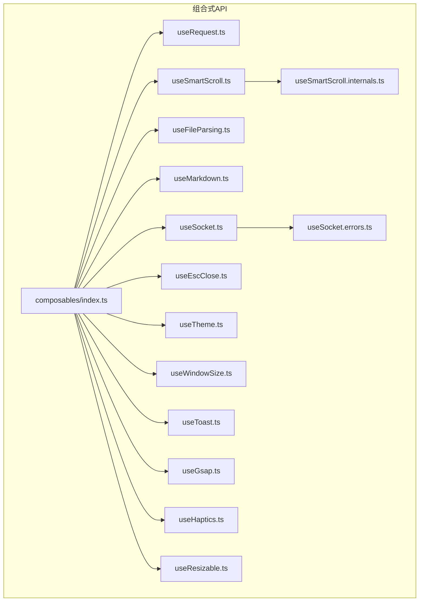
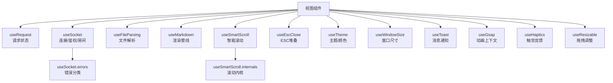
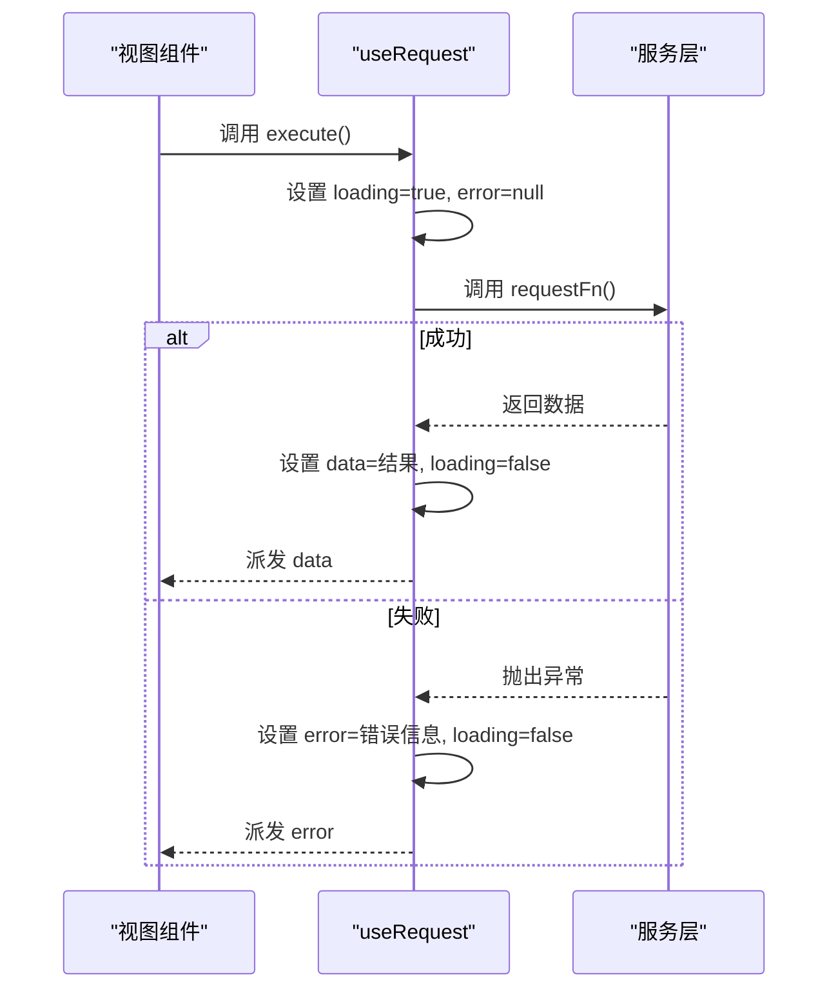
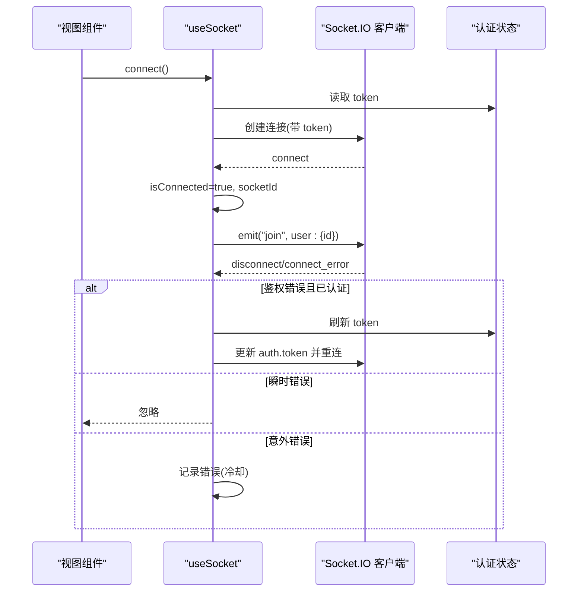
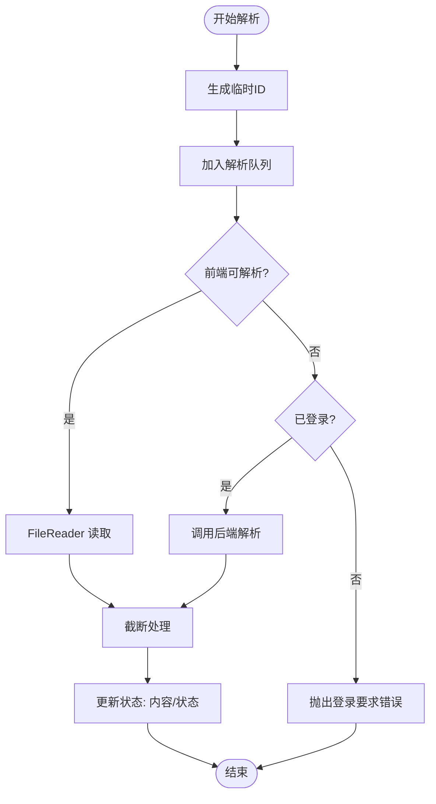
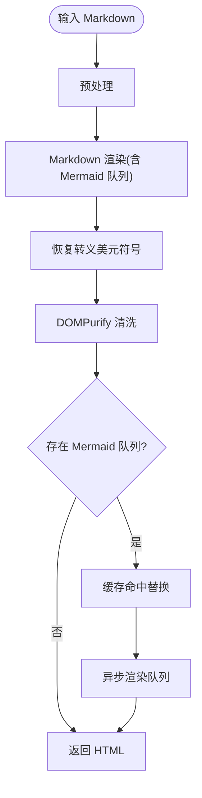
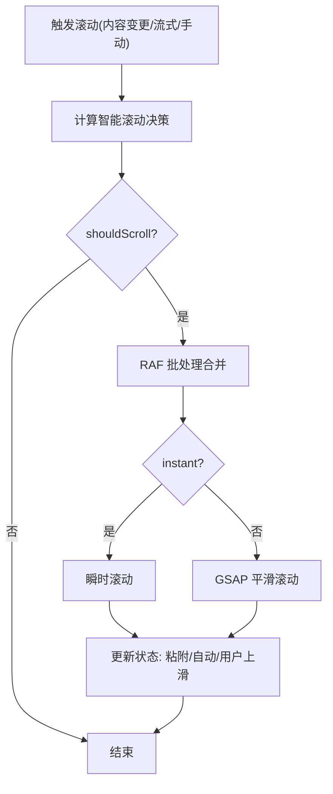
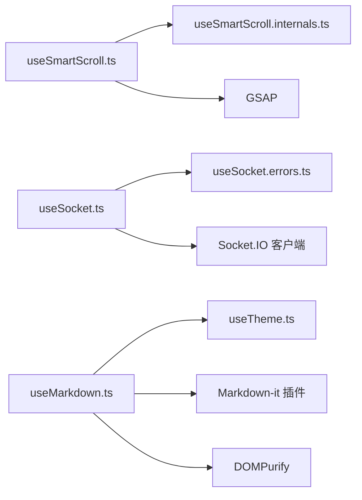

# 组合式API

<cite>
**本文档引用的文件**
- [apps/frontend/src/composables/index.ts](file://apps/frontend/src/composables/index.ts)
- [apps/frontend/src/composables/useRequest.ts](file://apps/frontend/src/composables/useRequest.ts)
- [apps/frontend/src/composables/useSocket.ts](file://apps/frontend/src/composables/useSocket.ts)
- [apps/frontend/src/composables/useSocket.errors.ts](file://apps/frontend/src/composables/useSocket.errors.ts)
- [apps/frontend/src/composables/useFileParsing.ts](file://apps/frontend/src/composables/useFileParsing.ts)
- [apps/frontend/src/composables/useMarkdown.ts](file://apps/frontend/src/composables/useMarkdown.ts)
- [apps/frontend/src/composables/useSmartScroll.ts](file://apps/frontend/src/composables/useSmartScroll.ts)
- [apps/frontend/src/composables/useSmartScroll.internals.ts](file://apps/frontend/src/composables/useSmartScroll.internals.ts)
- [apps/frontend/src/composables/useEscClose.ts](file://apps/frontend/src/composables/useEscClose.ts)
- [apps/frontend/src/composables/useTheme.ts](file://apps/frontend/src/composables/useTheme.ts)
- [apps/frontend/src/composables/useWindowSize.ts](file://apps/frontend/src/composables/useWindowSize.ts)
- [apps/frontend/src/composables/useToast.ts](file://apps/frontend/src/composables/useToast.ts)
- [apps/frontend/src/composables/useGsap.ts](file://apps/frontend/src/composables/useGsap.ts)
- [apps/frontend/src/composables/useHaptics.ts](file://apps/frontend/src/composables/useHaptics.ts)
- [apps/frontend/src/composables/useResizable.ts](file://apps/frontend/src/composables/useResizable.ts)
</cite>

## 目录
1. [简介](#简介)
2. [项目结构](#项目结构)
3. [核心组件](#核心组件)
4. [架构总览](#架构总览)
5. [详细组件分析](#详细组件分析)
6. [依赖分析](#依赖分析)
7. [性能考量](#性能考量)
8. [故障排查指南](#故障排查指南)
9. [结论](#结论)
10. [附录](#附录)

## 简介
本文件系统性梳理 Lumina Todo 前端的组合式 API 设计与实现，覆盖 Vue 3 Composition API 的设计理念、自定义 hooks 的功能特性与使用场景、状态管理与副作用处理、生命周期钩子、复用性设计、性能优化与内存管理，并结合异步数据处理、WebSocket 连接、文件解析等核心能力，给出开发规范、测试策略与最佳实践建议。

## 项目结构
组合式 API 主要位于 apps/frontend/src/composables 目录，按功能域拆分，便于复用与维护；同时通过统一导出入口集中暴露给业务模块使用。

**图示来源**
- [apps/frontend/src/composables/index.ts:1-11](file://apps/frontend/src/composables/index.ts#L1-L11)
- [apps/frontend/src/composables/useSmartScroll.ts:1-442](file://apps/frontend/src/composables/useSmartScroll.ts#L1-L442)
- [apps/frontend/src/composables/useSmartScroll.internals.ts:1-109](file://apps/frontend/src/composables/useSmartScroll.internals.ts#L1-L109)
- [apps/frontend/src/composables/useSocket.ts:1-191](file://apps/frontend/src/composables/useSocket.ts#L1-L191)
- [apps/frontend/src/composables/useSocket.errors.ts:1-33](file://apps/frontend/src/composables/useSocket.errors.ts#L1-L33)

**章节来源**
- [apps/frontend/src/composables/index.ts:1-11](file://apps/frontend/src/composables/index.ts#L1-L11)

## 核心组件
- useRequest：封装通用请求状态与错误处理，统一加载/完成/异常流程。
- useSocket：统一 WebSocket 连接、重连、鉴权刷新、房间加入、连接等待与错误分类处理。
- useFileParsing：混合前后端解析策略，支持前端直读与后端解析，含截断与提示。
- useMarkdown：Markdown 渲染管线，预处理、Mermaid 图表队列、DOMPurify 清洗、主题感知缓存。
- useSmartScroll：智能滚动决策、RAF 批处理与节流、GSAP 平滑滚动、Resize/Mutation 观察者。
- useEscClose：ESC 关闭堆叠栈，全局唯一键盘监听，组件级入栈/出栈。
- useTheme：主题模式、颜色预设、随机色、对比度保障、CSS 变量应用。
- useWindowSize：窗口尺寸响应式，移动端判断。
- useToast：消息通知队列、定时器管理、动作按钮。
- useGsap：GSAP 上下文隔离与自动回收。
- useHaptics：跨平台触觉反馈封装。
- useResizable：拖拽调整尺寸，范围约束与回调。

**章节来源**
- [apps/frontend/src/composables/useRequest.ts:1-45](file://apps/frontend/src/composables/useRequest.ts#L1-L45)
- [apps/frontend/src/composables/useSocket.ts:1-191](file://apps/frontend/src/composables/useSocket.ts#L1-L191)
- [apps/frontend/src/composables/useFileParsing.ts:1-122](file://apps/frontend/src/composables/useFileParsing.ts#L1-L122)
- [apps/frontend/src/composables/useMarkdown.ts:1-108](file://apps/frontend/src/composables/useMarkdown.ts#L1-L108)
- [apps/frontend/src/composables/useSmartScroll.ts:1-442](file://apps/frontend/src/composables/useSmartScroll.ts#L1-L442)
- [apps/frontend/src/composables/useEscClose.ts:1-66](file://apps/frontend/src/composables/useEscClose.ts#L1-L66)
- [apps/frontend/src/composables/useTheme.ts:1-378](file://apps/frontend/src/composables/useTheme.ts#L1-L378)
- [apps/frontend/src/composables/useWindowSize.ts:1-45](file://apps/frontend/src/composables/useWindowSize.ts#L1-L45)
- [apps/frontend/src/composables/useToast.ts:1-87](file://apps/frontend/src/composables/useToast.ts#L1-L87)
- [apps/frontend/src/composables/useGsap.ts:1-20](file://apps/frontend/src/composables/useGsap.ts#L1-L20)
- [apps/frontend/src/composables/useHaptics.ts:1-62](file://apps/frontend/src/composables/useHaptics.ts#L1-L62)
- [apps/frontend/src/composables/useResizable.ts:1-70](file://apps/frontend/src/composables/useResizable.ts#L1-L70)

## 架构总览
组合式 API 以“状态 + 行为 + 生命周期”为核心，围绕以下原则组织：
- 单一职责：每个 hook 聚焦一个明确领域。
- 响应式状态：基于 ref/computed/watch 管理状态与副作用。
- 生命周期绑定：onMounted/onUnmounted 管理 DOM/网络/计时器资源。
- 复用与解耦：通过参数化与内部工具函数提升可复用性。
- 性能优先：RAF 批处理、节流、缓存、最小 DOM 操作。

**图示来源**
- [apps/frontend/src/composables/useSmartScroll.ts:1-442](file://apps/frontend/src/composables/useSmartScroll.ts#L1-L442)
- [apps/frontend/src/composables/useSmartScroll.internals.ts:1-109](file://apps/frontend/src/composables/useSmartScroll.internals.ts#L1-L109)
- [apps/frontend/src/composables/useSocket.ts:1-191](file://apps/frontend/src/composables/useSocket.ts#L1-L191)
- [apps/frontend/src/composables/useSocket.errors.ts:1-33](file://apps/frontend/src/composables/useSocket.errors.ts#L1-L33)

## 详细组件分析

### useRequest：通用请求状态管理
- 功能要点
  - 管理 data/loading/error 三态。
  - 提供 execute 手动触发请求。
  - 统一错误处理与国际化文案。
- 使用场景
  - 列表加载、详情获取、提交表单后的刷新。
- 设计模式
  - 函数式组合：将请求函数注入，返回状态与执行器。
  - 类型安全：泛型约束返回数据类型。
- 性能与内存
  - 无外部订阅，避免额外副作用。
- 开发规范
  - 在调用方捕获异常并传入国际化错误文案。
  - 避免在 execute 中进行复杂逻辑，保持纯函数式请求。

**图示来源**
- [apps/frontend/src/composables/useRequest.ts:17-44](file://apps/frontend/src/composables/useRequest.ts#L17-L44)

**章节来源**
- [apps/frontend/src/composables/useRequest.ts:1-45](file://apps/frontend/src/composables/useRequest.ts#L1-L45)

### useSocket：WebSocket 连接与房间管理
- 功能要点
  - 单例 socket 实例、自动重连、传输选择。
  - 认证错误自动刷新令牌并重连。
  - 连接状态、socketId、等待连接。
  - 房间加入：根据用户 id 加入私有房间。
  - 错误分类：鉴权错误、瞬时错误、意外错误日志冷却。
- 使用场景
  - 实时聊天、事件推送、协作编辑。
- 设计模式
  - 立即执行初始化与全局订阅，按认证状态自动连接/断开。
  - Promise 化等待连接，支持超时。
- 性能与内存
  - 仅一次全局监听器注册，避免重复绑定。
  - 日志冷却避免频繁输出。
- 开发规范
  - 业务侧在连接成功后发送 join 房间事件。
  - 对瞬时错误不打断业务流程，对意外错误记录并上报。

**图示来源**
- [apps/frontend/src/composables/useSocket.ts:56-191](file://apps/frontend/src/composables/useSocket.ts#L56-L191)
- [apps/frontend/src/composables/useSocket.errors.ts:1-33](file://apps/frontend/src/composables/useSocket.errors.ts#L1-L33)

**章节来源**
- [apps/frontend/src/composables/useSocket.ts:1-191](file://apps/frontend/src/composables/useSocket.ts#L1-L191)
- [apps/frontend/src/composables/useSocket.errors.ts:1-33](file://apps/frontend/src/composables/useSocket.errors.ts#L1-L33)

### useFileParsing：混合解析策略
- 功能要点
  - 前端直读：适用于文本/代码类文件。
  - 后端解析：PDF/Word/Excel 等，需要登录态。
  - 截断与提示：超过最大字符数时截断并警告。
  - 状态管理：解析中/完成/错误，错误信息回填。
- 使用场景
  - 附件上传与内容提取、AI 输入预处理。
- 设计模式
  - 状态驱动：parsedFiles/isParsing 管理列表与全局状态。
  - 异常隔离：单个文件失败不影响其他文件。
- 性能与内存
  - 前端直读避免网络开销；后端解析走 API。
  - 清理：支持移除/清空，避免内存泄漏。
- 开发规范
  - 登录态校验在调用前完成。
  - 对大文件提示截断，避免 UI 卡顿。

**图示来源**
- [apps/frontend/src/composables/useFileParsing.ts:24-122](file://apps/frontend/src/composables/useFileParsing.ts#L24-L122)

**章节来源**
- [apps/frontend/src/composables/useFileParsing.ts:1-122](file://apps/frontend/src/composables/useFileParsing.ts#L1-L122)

### useMarkdown：Markdown 渲染管线
- 功能要点
  - 预处理：公式修复、加粗修复等。
  - 渲染：Markdown-it 插件链，支持流式渲染。
  - Mermaid：识别闭合代码块，批量队列渲染，缓存命中直接替换。
  - 安全：DOMPurify 清洗，保护占位符。
  - 主题：主题切换时清理 Mermaid 缓存。
- 使用场景
  - 聊天消息渲染、文档展示、AI 输出渲染。
- 设计模式
  - 环境变量 env 传递渲染上下文（Mermaid 队列、流式标记、闭合块集合）。
  - 缓存键：主题+稳定哈希，避免主题切换导致重复渲染。
- 性能与内存
  - 缓存命中直接 DOM 替换，减少闪烁。
  - 清理：提供缓存清理与主题变更监听。
- 开发规范
  - 保证输入为字符串，避免非字符串导致异常。
  - 流式渲染时正确标记 isStreaming。

**图示来源**
- [apps/frontend/src/composables/useMarkdown.ts:14-108](file://apps/frontend/src/composables/useMarkdown.ts#L14-L108)

**章节来源**
- [apps/frontend/src/composables/useMarkdown.ts:1-108](file://apps/frontend/src/composables/useMarkdown.ts#L1-L108)

### useSmartScroll：智能滚动与动画
- 功能要点
  - 智能决策：根据上下文（流式、新消息、内容变更、手动、尺寸）决定是否滚动及滚动方式。
  - 动画：GSAP 平滑滚动，瞬时滚动用于高频场景。
  - 观察：ResizeObserver/MutationObserver 监听尺寸与内容变化。
  - 节流：RAF 节流处理滚动与尺寸变化。
  - 批处理：RAF 批处理器合并高频滚动请求。
- 使用场景
  - 聊天窗口、消息列表、日志面板。
- 设计模式
  - 参数化选项：容器、初始粘附、自动滚动、阈值、流式瞬时等。
  - 生命周期：onMounted 初始化，onUnmounted 清理。
- 性能与内存
  - RAF 节流/批处理降低主线程压力。
  - MutationObserver 仅在可用时启用。
- 开发规范
  - 高频更新使用 streamingScroll 或 checkAndScroll。
  - 主动向上滚动时自动禁用自动滚动，避免打断用户。

**图示来源**
- [apps/frontend/src/composables/useSmartScroll.ts:164-195](file://apps/frontend/src/composables/useSmartScroll.ts#L164-L195)
- [apps/frontend/src/composables/useSmartScroll.internals.ts:28-64](file://apps/frontend/src/composables/useSmartScroll.internals.ts#L28-L64)

**章节来源**
- [apps/frontend/src/composables/useSmartScroll.ts:1-442](file://apps/frontend/src/composables/useSmartScroll.ts#L1-L442)
- [apps/frontend/src/composables/useSmartScroll.internals.ts:1-109](file://apps/frontend/src/composables/useSmartScroll.internals.ts#L1-L109)

### useEscClose：ESC 关闭堆叠
- 功能要点
  - 全局唯一键盘监听，仅处理栈顶回调。
  - 组件级入栈/出栈，自动清理。
- 使用场景
  - 多层弹窗/抽屉的 ESC 关闭。
- 设计模式
  - 全局栈 + watch 控制入栈/出栈。
- 性能与内存
  - 仅一次全局监听器注册，避免重复绑定。
- 开发规范
  - onClose 为幂等函数，确保多次调用安全。

**章节来源**
- [apps/frontend/src/composables/useEscClose.ts:1-66](file://apps/frontend/src/composables/useEscClose.ts#L1-L66)

### useTheme：主题与颜色系统
- 功能要点
  - 主题模式：亮/暗/自动，媒体查询回退。
  - 颜色预设：多组预设色，随机色轮换。
  - 对比度保障：计算前景色，确保可读性。
  - CSS 变量：动态写入 --user-primary 系列变量。
- 使用场景
  - 应用主题切换、品牌色定制。
- 设计模式
  - watch 监听颜色变化，应用到根节点样式。
  - 随机色定时轮换，避免频繁切换。
- 性能与内存
  - 仅在必要时计算与写入，避免多余重排。
- 开发规范
  - 颜色输入标准化，支持十六进制与随机值。

**章节来源**
- [apps/frontend/src/composables/useTheme.ts:1-378](file://apps/frontend/src/composables/useTheme.ts#L1-L378)

### useWindowSize：窗口尺寸与移动端判断
- 功能要点
  - 响应式宽高，组件/非组件环境兼容。
  - 移动端断点判断。
- 使用场景
  - 布局适配、移动端 UI 切换。
- 设计模式
  - onMounted/onUnmounted 管理监听器。
- 性能与内存
  - 仅在存在 window 时注册监听。
- 开发规范
  - computed 依赖 width，避免在渲染中频繁读取。

**章节来源**
- [apps/frontend/src/composables/useWindowSize.ts:1-45](file://apps/frontend/src/composables/useWindowSize.ts#L1-L45)

### useToast：消息通知队列
- 功能要点
  - 队列管理、定时器、动作按钮。
  - 暂停/恢复计时器（悬停时）。
- 使用场景
  - 操作反馈、错误提示、成功通知。
- 设计模式
  - ref 驱动的队列，id 唯一标识。
- 性能与内存
  - 及时清理计时器，避免内存泄漏。
- 开发规范
  - 为重要操作设置较长时间，普通提示短时即可。

**章节来源**
- [apps/frontend/src/composables/useToast.ts:1-87](file://apps/frontend/src/composables/useToast.ts#L1-L87)

### useGsap：动画上下文隔离
- 功能要点
  - 注册 Flip 插件，自动在卸载时 revert。
- 使用场景
  - 复杂动画、Flip 切换、组件级动画隔离。
- 设计模式
  - gsap.context 自动回收。
- 性能与内存
  - 卸载即回收，避免动画残留。
- 开发规范
  - 在组件销毁时无需手动清理。

**章节来源**
- [apps/frontend/src/composables/useGsap.ts:1-20](file://apps/frontend/src/composables/useGsap.ts#L1-L20)

### useHaptics：触觉反馈
- 功能要点
  - 跨平台触觉：Impact/Selection/Vibrate。
  - 可用性检测：仅在原生平台生效。
- 使用场景
  - 按钮点击反馈、选择变化反馈。
- 设计模式
  - 封装统一接口，异常静默处理。
- 性能与内存
  - 调用轻量，无持久资源。
- 开发规范
  - 仅在交互关键点使用，避免过度。

**章节来源**
- [apps/frontend/src/composables/useHaptics.ts:1-62](file://apps/frontend/src/composables/useHaptics.ts#L1-L62)

### useResizable：拖拽调整尺寸
- 功能要点
  - 鼠标拖拽、方向控制、范围约束、回调。
- 使用场景
  - 侧边栏、抽屉、面板宽度调整。
- 设计模式
  - mousedown/mousemove/mouseup 事件链。
- 性能与内存
  - 仅在拖拽期间绑定事件，释放时清理。
- 开发规范
  - 最小/最大值合理设置，避免 UI 不可预期。

**章节来源**
- [apps/frontend/src/composables/useResizable.ts:1-70](file://apps/frontend/src/composables/useResizable.ts#L1-L70)

## 依赖分析
- 组件内聚与耦合
  - useSmartScroll 与 useSmartScroll.internals 解耦滚动内核与外部接口。
  - useSocket 与 useSocket.errors 解耦错误分类逻辑。
  - useMarkdown 与主题/Mermaid 模块松耦合，通过工具函数交互。
- 外部依赖
  - GSAP：动画与上下文管理。
  - Socket.IO：实时通信。
  - DOMPurify：XSS 清洗。
  - @vueuse/core：useColorMode/useStorage/useMediaQuery 等。
- 循环依赖
  - 未发现直接循环依赖；内部工具函数通过独立文件拆分。

**图示来源**
- [apps/frontend/src/composables/useSmartScroll.ts:1-442](file://apps/frontend/src/composables/useSmartScroll.ts#L1-L442)
- [apps/frontend/src/composables/useSmartScroll.internals.ts:1-109](file://apps/frontend/src/composables/useSmartScroll.internals.ts#L1-L109)
- [apps/frontend/src/composables/useSocket.ts:1-191](file://apps/frontend/src/composables/useSocket.ts#L1-L191)
- [apps/frontend/src/composables/useSocket.errors.ts:1-33](file://apps/frontend/src/composables/useSocket.errors.ts#L1-L33)
- [apps/frontend/src/composables/useMarkdown.ts:1-108](file://apps/frontend/src/composables/useMarkdown.ts#L1-L108)
- [apps/frontend/src/composables/useTheme.ts:1-378](file://apps/frontend/src/composables/useTheme.ts#L1-L378)

**章节来源**
- [apps/frontend/src/composables/useSmartScroll.ts:1-442](file://apps/frontend/src/composables/useSmartScroll.ts#L1-L442)
- [apps/frontend/src/composables/useSocket.ts:1-191](file://apps/frontend/src/composables/useSocket.ts#L1-L191)
- [apps/frontend/src/composables/useMarkdown.ts:1-108](file://apps/frontend/src/composables/useMarkdown.ts#L1-L108)

## 性能考量
- 主线程优化
  - 使用 RAF 节流/批处理（useSmartScroll、useSmartScroll.internals）。
  - 避免在渲染阶段做昂贵计算，将计算前置或缓存。
- DOM 操作
  - 尽可能批量更新，Mermaid 缓存命中直接替换。
  - GSAP 平滑滚动替代频繁 scrollIntoView。
- 网络与连接
  - useSocket 重连指数退避与瞬时错误忽略，降低抖动。
  - useRequest 统一 loading/error，避免重复请求。
- 内存管理
  - useGsap、useSmartScroll、useToast、useEscClose 在卸载时清理计时器/监听器/回调。
  - useFileParsing 清理解析队列，避免残留引用。
- 资源限制
  - useFileParsing 对超长内容截断并提示，避免 UI 卡顿。

[本节为通用指导，无需具体文件来源]

## 故障排查指南
- WebSocket 连接问题
  - 鉴权错误：确认 token 是否有效，是否触发了自动刷新与重连。
  - 瞬时错误：网络波动导致，通常可自动恢复。
  - 意外错误：查看控制台冷却日志，定位错误类型与上下文。
- Markdown 渲染失败
  - 检查输入类型，确保为字符串。
  - 查看 DOMPurify 清洗后的 HTML，确认占位符是否被正确保留。
  - Mermaid 图表未渲染：确认代码块闭合与缓存键。
- 智能滚动异常
  - 容器未挂载或尺寸异常：检查 scrollContainer 引用。
  - 频繁滚动卡顿：确认是否使用 streamingScroll，是否启用了 RAF 批处理。
- 文件解析失败
  - 前端不可解析：确认文件类型是否在前端解析白名单。
  - 后端解析：确认登录态与网络请求状态。
- 主题与颜色
  - 随机色未生效：确认定时器是否被清理，或手动设置颜色。
- Toast 与 ESC
  - Toast 不消失：检查定时器是否被暂停/恢复。
  - ESC 多层冲突：确认关闭回调是否正确入栈/出栈。

**章节来源**
- [apps/frontend/src/composables/useSocket.ts:93-108](file://apps/frontend/src/composables/useSocket.ts#L93-L108)
- [apps/frontend/src/composables/useMarkdown.ts:90-96](file://apps/frontend/src/composables/useMarkdown.ts#L90-L96)
- [apps/frontend/src/composables/useSmartScroll.ts:256-259](file://apps/frontend/src/composables/useSmartScroll.ts#L256-L259)
- [apps/frontend/src/composables/useFileParsing.ts:84-95](file://apps/frontend/src/composables/useFileParsing.ts#L84-L95)
- [apps/frontend/src/composables/useTheme.ts:337-353](file://apps/frontend/src/composables/useTheme.ts#L337-L353)
- [apps/frontend/src/composables/useToast.ts:50-69](file://apps/frontend/src/composables/useToast.ts#L50-L69)
- [apps/frontend/src/composables/useEscClose.ts:34-66](file://apps/frontend/src/composables/useEscClose.ts#L34-L66)

## 结论
Lumina Todo 的组合式 API 以清晰的职责划分、完善的生命周期管理与性能优化策略，构建了高复用、易维护的前端基础设施。通过统一的状态与行为抽象，开发者可以快速搭建复杂交互场景，同时在错误处理、资源管理与用户体验方面提供了稳健保障。

[本节为总结，无需具体文件来源]

## 附录
- 开发规范
  - 所有 hook 以“状态 + 行为 + 生命周期”组织，避免隐式副作用。
  - 在 onMounted/onUnmounted 中管理外部资源，确保成对出现。
  - 对外暴露的 API 保持简洁，内部细节通过工具函数隐藏。
- 测试策略
  - 单元测试：针对状态变更、边界条件、错误分支。
  - 集成测试：模拟 DOM/网络/计时器，验证生命周期与资源回收。
  - 端到端测试：覆盖真实用户路径（如 ESC 关闭、拖拽调整、文件解析）。
- 最佳实践
  - 将复杂逻辑拆分为多个小 hook，提升可测试性与可复用性。
  - 对高频操作使用 RAF 节流/批处理，避免掉帧。
  - 对外提供 clear/cleanup 方法，便于在路由/组件切换时回收资源。

[本节为通用指导，无需具体文件来源]