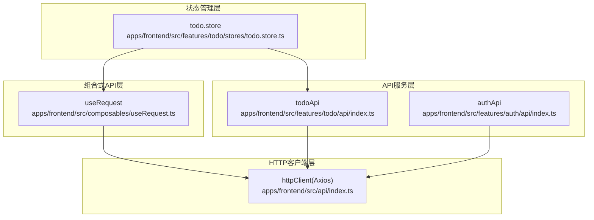
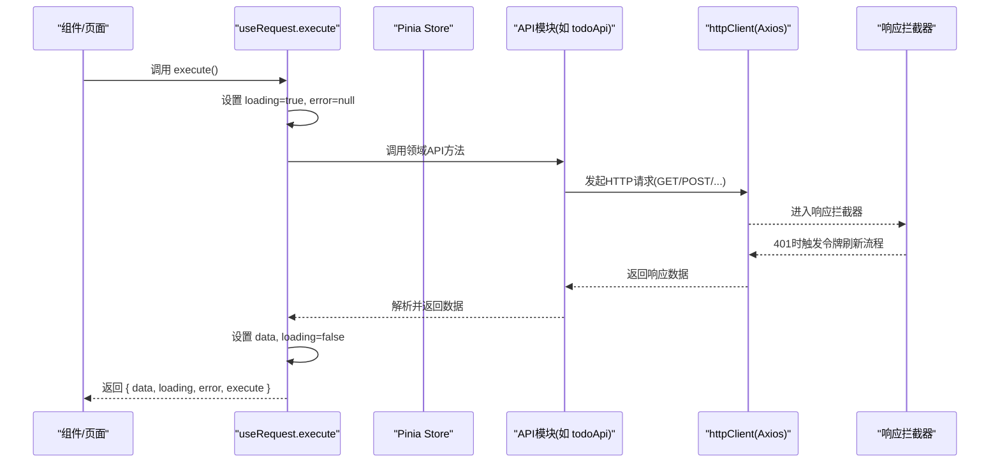
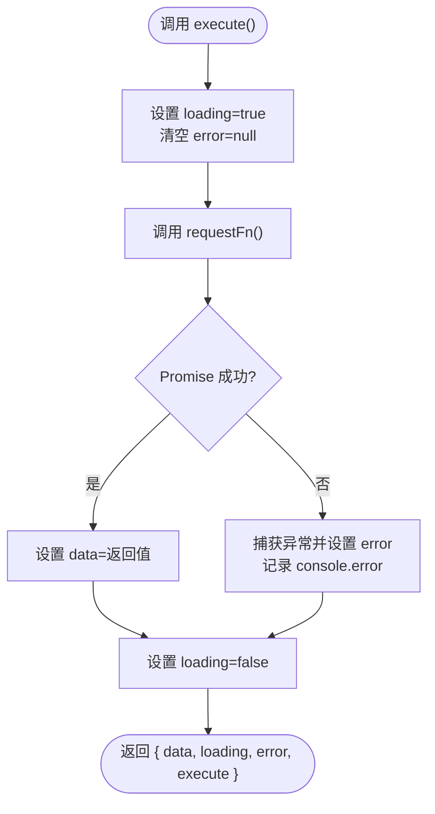
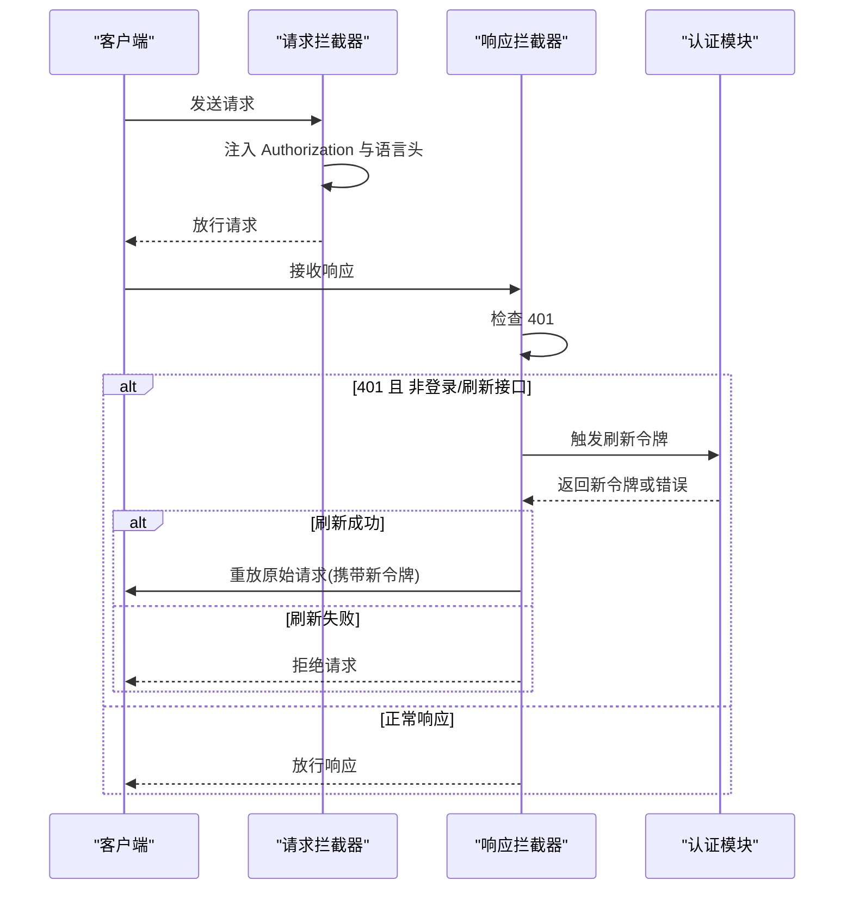
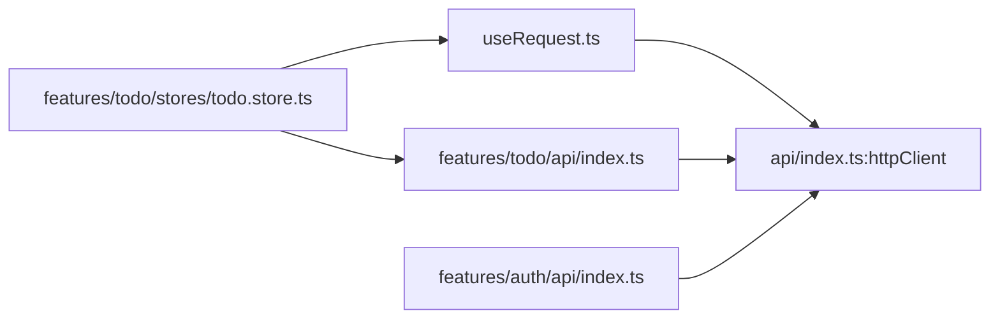

# 网络请求Hooks

<cite>
**本文引用的文件**
- [useRequest.ts](file://apps/frontend/src/composables/useRequest.ts)
- [index.ts](file://apps/frontend/src/composables/index.ts)
- [useRequest.spec.ts](file://apps/frontend/tests/composables/useRequest.spec.ts)
- [index.ts](file://apps/frontend/src/api/index.ts)
- [index.ts](file://apps/frontend/src/features/todo/api/index.ts)
- [index.ts](file://apps/frontend/src/features/auth/api/index.ts)
- [todo.store.ts](file://apps/frontend/src/features/todo/stores/todo.store.ts)
</cite>

## 目录
1. [简介](#简介)
2. [项目结构](#项目结构)
3. [核心组件](#核心组件)
4. [架构总览](#架构总览)
5. [详细组件分析](#详细组件分析)
6. [依赖关系分析](#依赖关系分析)
7. [性能考量](#性能考量)
8. [故障排查指南](#故障排查指南)
9. [结论](#结论)
10. [附录](#附录)

## 简介
本文件围绕前端网络请求相关的组合式API进行系统化说明，重点聚焦于通用请求Hook useRequest的设计理念与实现机制，涵盖HTTP请求封装、错误处理、重试机制、缓存策略、请求/响应拦截器配置与使用、异步数据加载的状态管理（loading与error）、以及GET、POST、PUT、DELETE等HTTP方法的使用范式。同时提供最佳实践、性能优化建议与调试技巧，帮助开发者在复杂业务场景中稳定、高效地管理网络请求。

## 项目结构
本项目的网络请求体系由三层组成：
- 组合式API层：提供useRequest等可复用的请求Hook，统一处理loading、error与execute调用。
- HTTP客户端层：基于Axios封装httpClient，内置请求/响应拦截器，负责认证、国际化、并发刷新控制等横切能力。
- API服务层：按功能域划分API模块（如todo、auth），对httpClient进行二次封装，暴露领域化的请求方法。

图表来源
- [useRequest.ts:1-45](file://apps/frontend/src/composables/useRequest.ts#L1-L45)
- [index.ts:1-199](file://apps/frontend/src/api/index.ts#L1-L199)
- [index.ts:1-62](file://apps/frontend/src/features/todo/api/index.ts#L1-L62)
- [index.ts:1-93](file://apps/frontend/src/features/auth/api/index.ts#L1-L93)
- [todo.store.ts:1-389](file://apps/frontend/src/features/todo/stores/todo.store.ts#L1-L389)

章节来源
- [useRequest.ts:1-45](file://apps/frontend/src/composables/useRequest.ts#L1-L45)
- [index.ts:1-199](file://apps/frontend/src/api/index.ts#L1-L199)
- [index.ts:1-62](file://apps/frontend/src/features/todo/api/index.ts#L1-L62)
- [index.ts:1-93](file://apps/frontend/src/features/auth/api/index.ts#L1-L93)
- [todo.store.ts:1-389](file://apps/frontend/src/features/todo/stores/todo.store.ts#L1-L389)

## 核心组件
- useRequest：通用请求Hook，提供data、loading、error三态与execute方法，封装请求生命周期内的状态切换与错误处理。
- httpClient：Axios实例，统一配置baseURL、超时、凭证、默认头，并通过拦截器实现认证、国际化与令牌刷新。
- API模块：按功能域封装HTTP请求，如todoApi、authApi，分别暴露GET/POST/DELETE等方法。
- Pinia Store：todo.store将loading与error纳入状态管理，便于UI与副作用联动。

章节来源
- [useRequest.ts:17-44](file://apps/frontend/src/composables/useRequest.ts#L17-L44)
- [index.ts:8-18](file://apps/frontend/src/api/index.ts#L8-L18)
- [index.ts:66-91](file://apps/frontend/src/api/index.ts#L66-L91)
- [index.ts:124-196](file://apps/frontend/src/api/index.ts#L124-L196)
- [index.ts:1-62](file://apps/frontend/src/features/todo/api/index.ts#L1-L62)
- [index.ts:1-93](file://apps/frontend/src/features/auth/api/index.ts#L1-L93)
- [todo.store.ts:21-368](file://apps/frontend/src/features/todo/stores/todo.store.ts#L21-L368)

## 架构总览
下图展示从组件到API再到HTTP客户端的整体调用链路，以及拦截器在请求/响应阶段的介入点。

图表来源
- [useRequest.ts:24-36](file://apps/frontend/src/composables/useRequest.ts#L24-L36)
- [index.ts:124-196](file://apps/frontend/src/api/index.ts#L124-L196)
- [index.ts:1-62](file://apps/frontend/src/features/todo/api/index.ts#L1-L62)

## 详细组件分析

### useRequest 设计与实现
- 设计理念
  - 将“请求执行”与“状态管理”解耦，使任意异步函数均可被useRequest包装，统一处理loading与error。
  - 通过Ref类型暴露data、loading、error，天然适配Vue响应式系统。
- 实现要点
  - execute方法在每次调用前重置error，保证多次调用的独立性。
  - 捕获异常并写入error，同时记录console日志；finally确保loading最终归位。
  - 返回对象包含execute，便于外部主动触发请求。
- 类型与扩展
  - 泛型参数T用于约束data的数据类型，支持数组、对象等多种形态。
  - 可与Pinia store结合，将loading与error纳入全局状态，实现跨组件共享。

图表来源
- [useRequest.ts:24-36](file://apps/frontend/src/composables/useRequest.ts#L24-L36)

章节来源
- [useRequest.ts:17-44](file://apps/frontend/src/composables/useRequest.ts#L17-L44)
- [useRequest.spec.ts:10-116](file://apps/frontend/tests/composables/useRequest.spec.ts#L10-L116)

### HTTP客户端与拦截器
- httpClient配置
  - 基础URL、超时、凭据与默认头统一设置，满足前后端一致的请求规范。
- 请求拦截器
  - 自动注入Authorization头（排除令牌刷新接口）。
  - 注入语言头（x-lang与Accept-Language），支持多语言。
- 响应拦截器与令牌刷新
  - 对401未授权进行拦截，避免重复刷新。
  - 并发刷新控制：通过isRefreshing与订阅队列避免重复请求。
  - 刷新成功后重放原始请求并携带新令牌；刷新失败则拒绝后续请求。
- Token管理
  - 内存与localStorage双层缓存，兼容多种持久化方案。
  - 提供getToken/setToken以供拦截器与业务侧使用。

图表来源
- [index.ts:66-91](file://apps/frontend/src/api/index.ts#L66-L91)
- [index.ts:124-196](file://apps/frontend/src/api/index.ts#L124-L196)
- [index.ts:28-60](file://apps/frontend/src/api/index.ts#L28-L60)

章节来源
- [index.ts:8-18](file://apps/frontend/src/api/index.ts#L8-L18)
- [index.ts:66-91](file://apps/frontend/src/api/index.ts#L66-L91)
- [index.ts:124-196](file://apps/frontend/src/api/index.ts#L124-L196)
- [index.ts:28-60](file://apps/frontend/src/api/index.ts#L28-L60)

### API服务模块（GET/POST/PUT/DELETE）
- todoApi
  - 提供同步、查询、回收站恢复、永久删除、清空回收站等方法，均通过httpClient发起请求。
- authApi
  - 提供获取当前用户、登录、注册、忘记密码、重置密码、刷新令牌、登出、头像上传等方法。
- 使用方式
  - 在组件或store中调用对应API方法，内部通过httpClient完成请求。
  - 可配合useRequest进行状态管理与错误处理。

章节来源
- [index.ts:1-62](file://apps/frontend/src/features/todo/api/index.ts#L1-L62)
- [index.ts:1-93](file://apps/frontend/src/features/auth/api/index.ts#L1-L93)

### 与状态管理的集成
- Pinia Store中的loading与error
  - 将loading与error纳入store状态，便于UI组件与副作用逻辑共享。
  - 结合useRequest，可在请求开始时设置loading，在请求结束时清理。
- 与useRequest的协作
  - 组件可通过useRequest包装API调用，获得data/ loading/ error三态。
  - store内部也可直接使用API模块，自行维护loading与error，实现更细粒度的控制。

章节来源
- [todo.store.ts:21-368](file://apps/frontend/src/features/todo/stores/todo.store.ts#L21-L368)

## 依赖关系分析
- 组合式API依赖HTTP客户端：useRequest通过传入的requestFn间接依赖httpClient。
- API模块依赖HTTP客户端：todoApi、authApi均基于httpClient封装具体路径与方法。
- 状态管理依赖API模块：store通过API模块发起请求，并将loading与error写入状态树。
- 拦截器横切依赖：请求/响应拦截器对所有通过httpClient发出的请求生效。

图表来源
- [useRequest.ts:17-44](file://apps/frontend/src/composables/useRequest.ts#L17-L44)
- [index.ts:1-199](file://apps/frontend/src/api/index.ts#L1-L199)
- [index.ts:1-62](file://apps/frontend/src/features/todo/api/index.ts#L1-L62)
- [index.ts:1-93](file://apps/frontend/src/features/auth/api/index.ts#L1-L93)
- [todo.store.ts:21-368](file://apps/frontend/src/features/todo/stores/todo.store.ts#L21-L368)

章节来源
- [index.ts:1-199](file://apps/frontend/src/api/index.ts#L1-L199)
- [index.ts:1-62](file://apps/frontend/src/features/todo/api/index.ts#L1-L62)
- [index.ts:1-93](file://apps/frontend/src/features/auth/api/index.ts#L1-L93)
- [todo.store.ts:21-368](file://apps/frontend/src/features/todo/stores/todo.store.ts#L21-L368)

## 性能考量
- 请求去抖与节流
  - 在高频输入场景（如搜索）中，建议结合防抖/节流策略减少请求次数。
- 并发控制
  - 响应拦截器已内置并发刷新控制，避免重复刷新导致的资源浪费。
- 缓存策略
  - 当前实现未内置HTTP缓存，建议在API层或store层引入轻量缓存（如LRU）以降低重复请求成本。
- 超时与重试
  - httpClient设置了超时时间，可根据业务调整；重试策略建议在useRequest或上层业务中按需实现，避免无界重试。
- UI渲染优化
  - 使用loading与error三态，避免不必要的重渲染；对长列表采用虚拟滚动与懒加载。

## 故障排查指南
- 常见问题定位
  - 401未授权：检查响应拦截器是否正确触发令牌刷新；确认刷新接口未被拦截器排除。
  - 令牌无效：确认getToken与setToken的调用时机；检查localStorage中auth数据结构。
  - 请求未发送：检查请求拦截器是否正确注入Authorization与语言头。
- 日志与调试
  - useRequest在错误时会打印console日志，便于快速定位异常。
  - 建议在开发环境开启Axios日志，观察请求/响应细节。
- 单元测试参考
  - useRequest的单元测试覆盖了初始化状态、loading切换、成功/失败处理、错误重置与多次调用等场景，可作为行为验证的参考。

章节来源
- [useRequest.spec.ts:10-116](file://apps/frontend/tests/composables/useRequest.spec.ts#L10-L116)
- [index.ts:124-196](file://apps/frontend/src/api/index.ts#L124-L196)
- [index.ts:28-60](file://apps/frontend/src/api/index.ts#L28-L60)

## 结论
useRequest提供了简洁而强大的请求抽象，结合httpClient的拦截器能力与API模块的领域化封装，能够覆盖大多数前端网络请求场景。通过将loading与error纳入状态管理，可实现UI与数据层的解耦与协同。建议在实际项目中遵循本文的最佳实践，合理使用缓存、去抖与重试策略，并持续完善错误监控与日志体系，以提升系统的稳定性与可维护性。

## 附录
- 导出入口
  - 组合式API统一导出，便于在应用中按需引入。
- HTTP方法使用范式
  - GET：查询列表/详情
  - POST：提交表单/创建资源
  - PUT：更新资源
  - DELETE：删除资源
  - 多媒体上传：使用FormData并设置正确的Content-Type

章节来源
- [index.ts:1-11](file://apps/frontend/src/composables/index.ts#L1-L11)
- [index.ts:1-62](file://apps/frontend/src/features/todo/api/index.ts#L1-L62)
- [index.ts:1-93](file://apps/frontend/src/features/auth/api/index.ts#L1-L93)