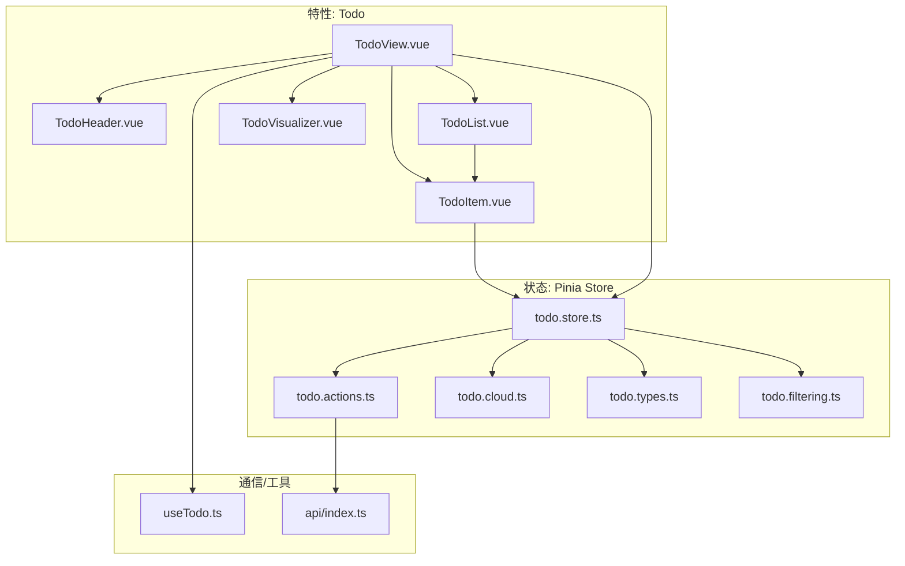
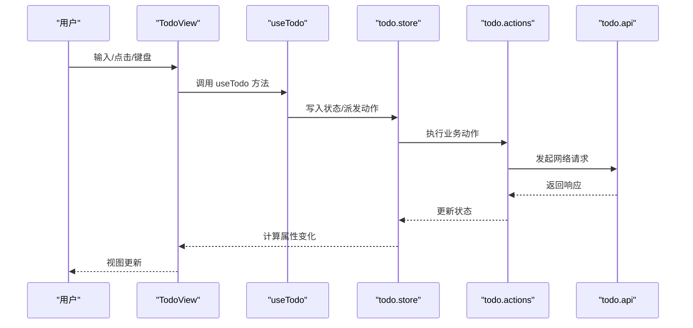
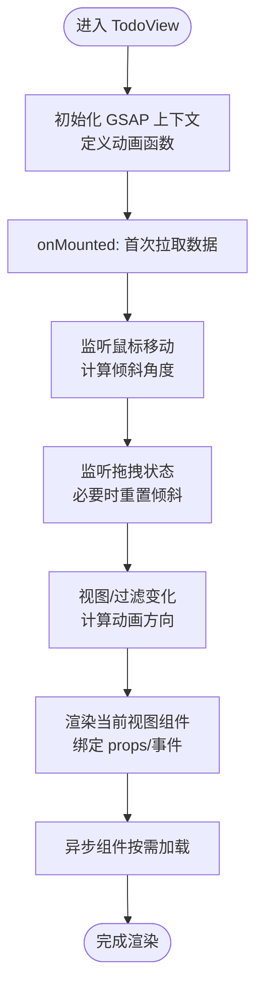
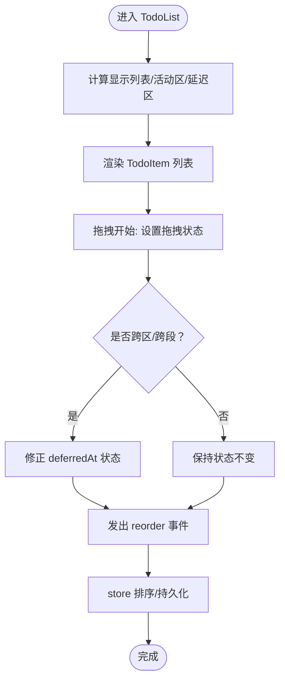
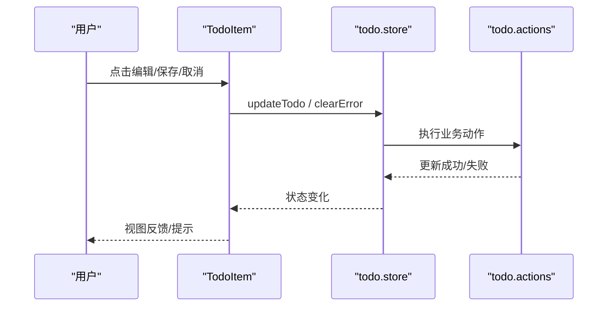
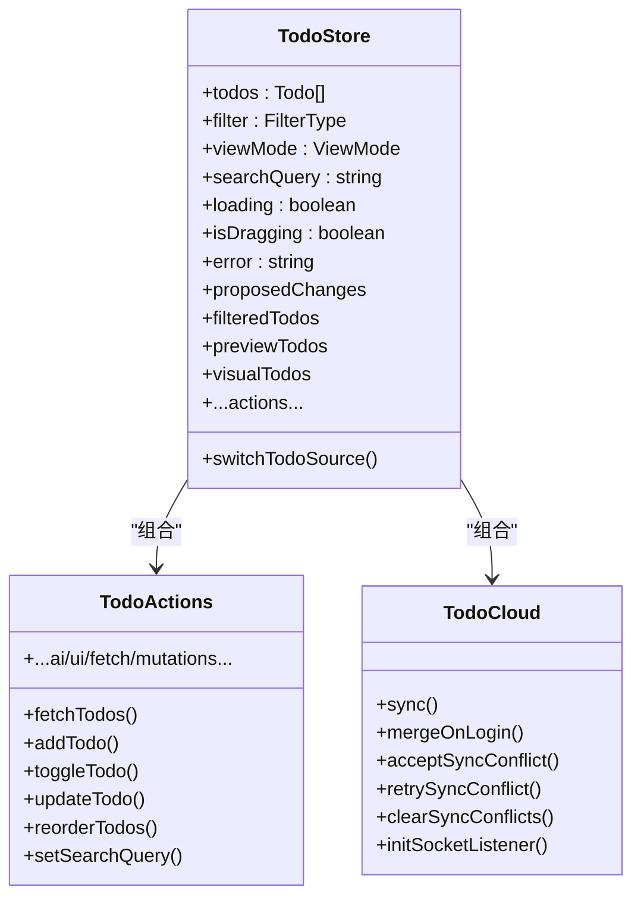
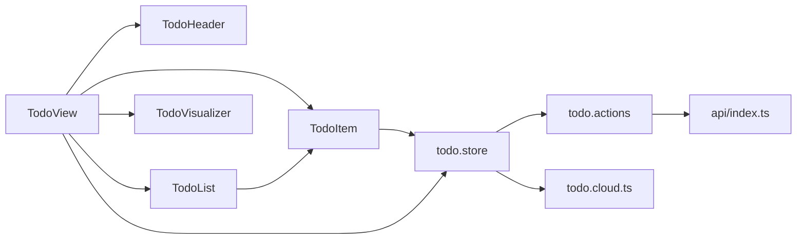

# 设计模式与最佳实践

<cite>
**本文引用的文件**
- [apps/frontend/src/features/todo/TodoView.vue](file://apps/frontend/src/features/todo/TodoView.vue)
- [apps/frontend/src/features/todo/components/TodoList.vue](file://apps/frontend/src/features/todo/components/TodoList.vue)
- [apps/frontend/src/features/todo/components/TodoItem.vue](file://apps/frontend/src/features/todo/components/TodoItem.vue)
- [apps/frontend/src/features/todo/components/TodoHeader.vue](file://apps/frontend/src/features/todo/components/TodoHeader.vue)
- [apps/frontend/src/features/todo/components/TodoVisualizer.vue](file://apps/frontend/src/features/todo/components/TodoVisualizer.vue)
- [apps/frontend/src/features/todo/stores/todo.store.ts](file://apps/frontend/src/features/todo/stores/todo.store.ts)
- [apps/frontend/src/features/todo/stores/todo.actions.ts](file://apps/frontend/src/features/todo/stores/todo.actions.ts)
- [apps/frontend/src/features/todo/stores/todo.types.ts](file://apps/frontend/src/features/todo/stores/todo.types.ts)
- [apps/frontend/src/features/todo/stores/todo.cloud.ts](file://apps/frontend/src/features/todo/stores/todo.cloud.ts)
- [apps/frontend/src/features/todo/stores/todo.filtering.ts](file://apps/frontend/src/features/todo/stores/todo.filtering.ts)
- [apps/frontend/src/features/todo/api/index.ts](file://apps/frontend/src/features/todo/api/index.ts)
- [apps/frontend/src/features/todo/composables/useTodo.ts](file://apps/frontend/src/features/todo/composables/useTodo.ts)
</cite>

## 目录
1. [简介](#简介)
2. [项目结构](#项目结构)
3. [核心组件](#核心组件)
4. [架构总览](#架构总览)
5. [详细组件分析](#详细组件分析)
6. [依赖关系分析](#依赖关系分析)
7. [性能考量](#性能考量)
8. [故障排查指南](#故障排查指南)
9. [结论](#结论)
10. [附录](#附录)

## 简介
本文件系统性梳理 Lumina Todo 组件化架构中的设计模式与实现策略，围绕以下目标展开：
- 组件命名规范、文件组织与目录结构
- 组件通信模式、状态管理模式与数据流设计
- 可测试性、可维护性与可扩展性设计原则
- 性能优化、内存管理与错误处理策略
- 开发标准流程、代码规范与质量保证措施

## 项目结构
Todo 功能位于前端应用的特性域内，采用“特性优先”的模块化组织方式：
- 视图层：TodoView 作为主容器，协调头部、输入、过滤、搜索、列表/可视化/统计视图、计时器、冲突面板等子组件
- 组件层：TodoList、TodoItem、TodoHeader、TodoVisualizer 等具体 UI 组件
- 状态层：基于 Pinia 的 todo store，拆分动作、过滤、云同步、提议变更等子模块
- 通信层：通过 props/事件、组合式函数 useTodo、以及 Pinia store 实现跨组件通信
- 数据访问层：封装 todo API，统一调用后端接口

**图示来源**
- [apps/frontend/src/features/todo/TodoView.vue:1-522](file://apps/frontend/src/features/todo/TodoView.vue#L1-L522)
- [apps/frontend/src/features/todo/components/TodoList.vue:1-316](file://apps/frontend/src/features/todo/components/TodoList.vue#L1-L316)
- [apps/frontend/src/features/todo/components/TodoItem.vue:1-419](file://apps/frontend/src/features/todo/components/TodoItem.vue#L1-L419)
- [apps/frontend/src/features/todo/components/TodoHeader.vue:1-422](file://apps/frontend/src/features/todo/components/TodoHeader.vue#L1-L422)
- [apps/frontend/src/features/todo/components/TodoVisualizer.vue:1-185](file://apps/frontend/src/features/todo/components/TodoVisualizer.vue#L1-L185)
- [apps/frontend/src/features/todo/stores/todo.store.ts:1-389](file://apps/frontend/src/features/todo/stores/todo.store.ts#L1-L389)
- [apps/frontend/src/features/todo/stores/todo.actions.ts:1-111](file://apps/frontend/src/features/todo/stores/todo.actions.ts#L1-L111)
- [apps/frontend/src/features/todo/stores/todo.cloud.ts:1-44](file://apps/frontend/src/features/todo/stores/todo.cloud.ts#L1-L44)
- [apps/frontend/src/features/todo/stores/todo.types.ts:1-69](file://apps/frontend/src/features/todo/stores/todo.types.ts#L1-L69)
- [apps/frontend/src/features/todo/stores/todo.filtering.ts:1-64](file://apps/frontend/src/features/todo/stores/todo.filtering.ts#L1-L64)
- [apps/frontend/src/features/todo/api/index.ts:1-62](file://apps/frontend/src/features/todo/api/index.ts#L1-L62)
- [apps/frontend/src/features/todo/composables/useTodo.ts:1-186](file://apps/frontend/src/features/todo/composables/useTodo.ts#L1-L186)

**章节来源**
- [apps/frontend/src/features/todo/TodoView.vue:1-522](file://apps/frontend/src/features/todo/TodoView.vue#L1-L522)
- [apps/frontend/src/features/todo/stores/todo.store.ts:1-389](file://apps/frontend/src/features/todo/stores/todo.store.ts#L1-L389)

## 核心组件
- TodoView：顶层容器，负责布局、视图切换、动画、GSAP 效果、异步组件加载、与 useTodo 组合式函数协作
- TodoList：列表渲染与拖拽排序，支持“稍后处理”分段与搜索态下的扁平展示
- TodoItem：单条目渲染、编辑、子任务递归、拖拽、展开/折叠、AI 分解、永久删除等
- TodoHeader：视图模式切换、主题/语言切换、源切换（本地/远程）、用户菜单
- TodoVisualizer：树形可视化（ECharts），按筛选条件构建树数据与图表配置

**章节来源**
- [apps/frontend/src/features/todo/TodoView.vue:1-522](file://apps/frontend/src/features/todo/TodoView.vue#L1-L522)
- [apps/frontend/src/features/todo/components/TodoList.vue:1-316](file://apps/frontend/src/features/todo/components/TodoList.vue#L1-L316)
- [apps/frontend/src/features/todo/components/TodoItem.vue:1-419](file://apps/frontend/src/features/todo/components/TodoItem.vue#L1-L419)
- [apps/frontend/src/features/todo/components/TodoHeader.vue:1-422](file://apps/frontend/src/features/todo/components/TodoHeader.vue#L1-L422)
- [apps/frontend/src/features/todo/components/TodoVisualizer.vue:1-185](file://apps/frontend/src/features/todo/components/TodoVisualizer.vue#L1-L185)

## 架构总览
Todo 采用“视图-状态-通信-数据访问”四层架构：
- 视图层：TodoView 作为主控制器，根据 store 状态与路由/视图模式动态渲染不同子视图
- 状态层：todo.store 聚合 todos、过滤、视图模式、搜索、拖拽、提议变更、云同步等状态；通过 createTodoActions 组织业务动作
- 通信层：组件间通过 props/事件、Pinia store、组合式函数 useTodo 传递消息
- 数据访问层：api/index.ts 封装 HTTP 请求，todo.cloud.ts 负责云端同步与冲突处理

**图示来源**
- [apps/frontend/src/features/todo/TodoView.vue:1-522](file://apps/frontend/src/features/todo/TodoView.vue#L1-L522)
- [apps/frontend/src/features/todo/composables/useTodo.ts:1-186](file://apps/frontend/src/features/todo/composables/useTodo.ts#L1-L186)
- [apps/frontend/src/features/todo/stores/todo.store.ts:1-389](file://apps/frontend/src/features/todo/stores/todo.store.ts#L1-L389)
- [apps/frontend/src/features/todo/stores/todo.actions.ts:1-111](file://apps/frontend/src/features/todo/stores/todo.actions.ts#L1-L111)
- [apps/frontend/src/features/todo/api/index.ts:1-62](file://apps/frontend/src/features/todo/api/index.ts#L1-L62)

## 详细组件分析

### TodoView 容器与视图编排
- 视图切换与动画：通过计算属性 currentViewKey/currentViewComponent 控制组件切换，配合 GSAP 实现进入/离开动画，使用 KeepAlive 缓存组件实例
- 响应式布局与交互：鼠标移动触发卡片倾斜，拖拽时重置倾斜；输入区域高度与透明度随视图模式与搜索状态动态调整
- 异步组件：TodoVisualizer、TodoStatistics、PomodoroEarth 按需加载，降低首屏负担
- 与 useTodo 协作：集中处理新增、编辑、搜索、快捷键等逻辑，统一错误提示与节流

**图示来源**
- [apps/frontend/src/features/todo/TodoView.vue:1-522](file://apps/frontend/src/features/todo/TodoView.vue#L1-L522)

**章节来源**
- [apps/frontend/src/features/todo/TodoView.vue:1-522](file://apps/frontend/src/features/todo/TodoView.vue#L1-L522)

### TodoList 列表与拖拽排序
- 结构化展示：支持根节点与子任务的层级展示；回收站与搜索态下扁平化
- “稍后处理”分段：当存在未完成但延迟的任务时，独立展示并可折叠/展开
- 拖拽排序：使用 vuedraggable，区分活动区与延迟区，拖拽前后即时同步 deferredAt 状态，保证 computed 行为正确
- 空态处理：根据过滤条件与搜索状态返回不同的空态图标与文案

**图示来源**
- [apps/frontend/src/features/todo/components/TodoList.vue:1-316](file://apps/frontend/src/features/todo/components/TodoList.vue#L1-L316)

**章节来源**
- [apps/frontend/src/features/todo/components/TodoList.vue:1-316](file://apps/frontend/src/features/todo/components/TodoList.vue#L1-L316)

### TodoItem 单项渲染与交互
- 递归渲染：支持最多两级子任务，子任务列表使用 draggable 实现拖拽排序
- 编辑模式：支持就地编辑标题，保存/取消/回车/ESC 快捷键
- 展开/折叠：使用 GSAP 高性能动画替代 v-show，首次挂载使用 set，后续使用 fromTo/to
- AI 分解：调用 store.breakdownTaskWithAI，成功后给出撤销提示
- 删除策略：普通删除进入回收站，永久删除调用 store.deleteTodoPermanently

**图示来源**
- [apps/frontend/src/features/todo/components/TodoItem.vue:1-419](file://apps/frontend/src/features/todo/components/TodoItem.vue#L1-L419)
- [apps/frontend/src/features/todo/stores/todo.store.ts:1-389](file://apps/frontend/src/features/todo/stores/todo.store.ts#L1-L389)
- [apps/frontend/src/features/todo/stores/todo.actions.ts:1-111](file://apps/frontend/src/features/todo/stores/todo.actions.ts#L1-L111)

**章节来源**
- [apps/frontend/src/features/todo/components/TodoItem.vue:1-419](file://apps/frontend/src/features/todo/components/TodoItem.vue#L1-L419)
- [apps/frontend/src/features/todo/stores/todo.store.ts:1-389](file://apps/frontend/src/features/todo/stores/todo.store.ts#L1-L389)

### TodoHeader 头部控制与多源切换
- 视图模式切换：列表/便签/可视化/统计四种模式，移动端通过下拉菜单
- 主题/语言：内置主题切换与语言切换，写入本地存储
- 源切换：本地/远程双源，登录态下可切换至远程源并进行合并
- 用户菜单：头像上传、登出等

**章节来源**
- [apps/frontend/src/features/todo/components/TodoHeader.vue:1-422](file://apps/frontend/src/features/todo/components/TodoHeader.vue#L1-L422)

### TodoVisualizer 树形可视化
- 尺寸与生命周期：使用 ResizeObserver 与防抖，确保容器尺寸稳定后再初始化图表
- 数据构建：根据过滤条件与搜索条件生成树形数据与图表配置
- 主题适配：深色/浅色主题自动切换

**章节来源**
- [apps/frontend/src/features/todo/components/TodoVisualizer.vue:1-185](file://apps/frontend/src/features/todo/components/TodoVisualizer.vue#L1-L185)

### 状态管理与数据流
- store 聚合：todos、filter、viewMode、searchQuery、拖拽、提议变更、云同步、源管理等
- 动作拆分：fetch/mutations/ui/ai/actions 子模块化，便于维护与测试
- 过滤与排序：统一的过滤与排序逻辑，支持有效完成、延迟任务、置顶、完成优先级等
- 云同步：todo.cloud.ts 封装同步、冲突处理、Socket 监听、清空回收站等

**图示来源**
- [apps/frontend/src/features/todo/stores/todo.store.ts:1-389](file://apps/frontend/src/features/todo/stores/todo.store.ts#L1-L389)
- [apps/frontend/src/features/todo/stores/todo.actions.ts:1-111](file://apps/frontend/src/features/todo/stores/todo.actions.ts#L1-L111)
- [apps/frontend/src/features/todo/stores/todo.cloud.ts:1-44](file://apps/frontend/src/features/todo/stores/todo.cloud.ts#L1-L44)

**章节来源**
- [apps/frontend/src/features/todo/stores/todo.store.ts:1-389](file://apps/frontend/src/features/todo/stores/todo.store.ts#L1-L389)
- [apps/frontend/src/features/todo/stores/todo.actions.ts:1-111](file://apps/frontend/src/features/todo/stores/todo.actions.ts#L1-L111)
- [apps/frontend/src/features/todo/stores/todo.cloud.ts:1-44](file://apps/frontend/src/features/todo/stores/todo.cloud.ts#L1-L44)
- [apps/frontend/src/features/todo/stores/todo.filtering.ts:1-64](file://apps/frontend/src/features/todo/stores/todo.filtering.ts#L1-L64)
- [apps/frontend/src/features/todo/stores/todo.types.ts:1-69](file://apps/frontend/src/features/todo/stores/todo.types.ts#L1-L69)

### 组件通信模式
- 父子通信：props 传入数据，事件向上冒泡（如 toggle/delete/reorder/editKeydown）
- 组合式函数：useTodo 将 UI 与 store 解耦，集中处理输入、搜索、快捷键、错误提示
- Pinia 共享：todos/filter/viewMode/search 等状态在多个组件共享，避免重复请求与状态漂移

**章节来源**
- [apps/frontend/src/features/todo/TodoView.vue:229-273](file://apps/frontend/src/features/todo/TodoView.vue#L229-L273)
- [apps/frontend/src/features/todo/components/TodoList.vue:34-43](file://apps/frontend/src/features/todo/components/TodoList.vue#L34-L43)
- [apps/frontend/src/features/todo/components/TodoItem.vue:41-50](file://apps/frontend/src/features/todo/components/TodoItem.vue#L41-L50)
- [apps/frontend/src/features/todo/composables/useTodo.ts:1-186](file://apps/frontend/src/features/todo/composables/useTodo.ts#L1-L186)

### 数据流设计
- 单向数据流：UI 通过 actions 修改 store，computed 依赖驱动视图更新
- 云同步：本地变更通过 debouncedSync 推送，服务端返回冲突时由用户选择接受/重试/清除
- 提议变更：临时变更集合在预览中生效，支持批量应用/丢弃

**章节来源**
- [apps/frontend/src/features/todo/stores/todo.store.ts:307-317](file://apps/frontend/src/features/todo/stores/todo.store.ts#L307-L317)
- [apps/frontend/src/features/todo/stores/todo.cloud.ts:1-44](file://apps/frontend/src/features/todo/stores/todo.cloud.ts#L1-L44)

## 依赖关系分析
- 组件依赖：TodoView 依赖 TodoHeader、TodoList、TodoItem、TodoVisualizer、useTodo、GSAP、移动端检测等
- 状态依赖：TodoList/TodoItem 依赖 todo.store；TodoHeader 依赖 auth.store 与 todo.store
- 数据访问：todo.actions 调用 api/index.ts；todo.cloud.ts 依赖 http 客户端与 Socket

**图示来源**
- [apps/frontend/src/features/todo/TodoView.vue:1-522](file://apps/frontend/src/features/todo/TodoView.vue#L1-L522)
- [apps/frontend/src/features/todo/components/TodoList.vue:1-316](file://apps/frontend/src/features/todo/components/TodoList.vue#L1-L316)
- [apps/frontend/src/features/todo/components/TodoItem.vue:1-419](file://apps/frontend/src/features/todo/components/TodoItem.vue#L1-L419)
- [apps/frontend/src/features/todo/components/TodoHeader.vue:1-422](file://apps/frontend/src/features/todo/components/TodoHeader.vue#L1-L422)
- [apps/frontend/src/features/todo/components/TodoVisualizer.vue:1-185](file://apps/frontend/src/features/todo/components/TodoVisualizer.vue#L1-L185)
- [apps/frontend/src/features/todo/stores/todo.store.ts:1-389](file://apps/frontend/src/features/todo/stores/todo.store.ts#L1-L389)
- [apps/frontend/src/features/todo/stores/todo.actions.ts:1-111](file://apps/frontend/src/features/todo/stores/todo.actions.ts#L1-L111)
- [apps/frontend/src/features/todo/api/index.ts:1-62](file://apps/frontend/src/features/todo/api/index.ts#L1-L62)
- [apps/frontend/src/features/todo/stores/todo.cloud.ts:1-44](file://apps/frontend/src/features/todo/stores/todo.cloud.ts#L1-L44)

**章节来源**
- [apps/frontend/src/features/todo/stores/todo.store.ts:1-389](file://apps/frontend/src/features/todo/stores/todo.store.ts#L1-L389)
- [apps/frontend/src/features/todo/stores/todo.actions.ts:1-111](file://apps/frontend/src/features/todo/stores/todo.actions.ts#L1-L111)
- [apps/frontend/src/features/todo/api/index.ts:1-62](file://apps/frontend/src/features/todo/api/index.ts#L1-L62)

## 性能考量
- 渲染性能
  - KeepAlive 缓存视图组件，减少重复渲染与初始化成本
  - TodoItem 使用 GSAP 高性能动画替代 v-show，避免频繁 DOM 重排
  - TodoVisualizer 使用 ResizeObserver 与防抖 resize，仅在尺寸稳定后初始化图表
- 状态与计算
  - 过滤与排序逻辑集中在 todo.filtering，避免在组件内重复计算
  - computed 依赖最小化，避免不必要的重算
- 网络与同步
  - actions 中使用防抖同步（debouncedSync），减少频繁网络请求
  - 云同步冲突采用用户交互解决，避免阻塞主线程
- 内存管理
  - 组件卸载时取消动画与定时器（如 TodoVisualizer 的防抖）
  - store 持久化 pick 关键字段，避免存储过大对象

[本节为通用性能建议，无需特定文件引用]

## 故障排查指南
- 新增/编辑失败
  - 现象：输入框出现提示或 Toast 错误
  - 排查：检查 store.error 是否被设置；useTodo 在添加/编辑时会静默 Toast 并在错误后清除
  - 处理：根据错误类型提示用户（如重复项），必要时保留编辑状态
- 拖拽异常
  - 现象：跨区/跨段拖拽后列表错位
  - 排查：确认 TodoList/TodoItem 在拖拽前后是否正确修正 deferredAt 状态
- 同步冲突
  - 现象：出现冲突面板
  - 排查：查看 syncConflicts，确认冲突原因（版本冲突/拥有者不匹配/墓碑）
  - 处理：接受/重试/清除冲突，必要时合并本地/远程数据
- 视图切换卡顿
  - 现象：切换视图时动画卡顿
  - 排查：确认 GSAP 动画是否被提前 kill，过渡钩子是否正确清理 will-change
- 图表不显示
  - 现象：TodoVisualizer 显示加载或空白
  - 排查：容器尺寸是否为 0；isReady 是否被置为 true；debouncedResize 是否被取消

**章节来源**
- [apps/frontend/src/features/todo/composables/useTodo.ts:26-40](file://apps/frontend/src/features/todo/composables/useTodo.ts#L26-L40)
- [apps/frontend/src/features/todo/components/TodoList.vue:47-64](file://apps/frontend/src/features/todo/components/TodoList.vue#L47-L64)
- [apps/frontend/src/features/todo/components/TodoItem.vue:99-113](file://apps/frontend/src/features/todo/components/TodoItem.vue#L99-L113)
- [apps/frontend/src/features/todo/stores/todo.store.ts:319-367](file://apps/frontend/src/features/todo/stores/todo.store.ts#L319-L367)
- [apps/frontend/src/features/todo/components/TodoVisualizer.vue:30-50](file://apps/frontend/src/features/todo/components/TodoVisualizer.vue#L30-L50)

## 结论
Lumina Todo 通过清晰的特性域划分、模块化的状态与动作、稳健的通信与数据流设计，实现了高可维护性与可扩展性。配合性能优化与完善的错误处理机制，能够在复杂交互场景下保持流畅体验。

[本节为总结性内容，无需特定文件引用]

## 附录

### 设计模式与最佳实践清单
- 组件命名与组织
  - 文件名采用 PascalCase（如 TodoList.vue），目录按功能域组织（components/stores/composables）
  - 子组件职责单一，通过 props/事件解耦
- 状态管理
  - Pinia store 聚合状态，动作模块化拆分，避免 store 过大
  - computed 依赖明确，避免重复计算
- 通信策略
  - 父子通信使用 props/事件；跨组件共享使用 Pinia
  - 组合式函数封装 UI 与 store 的桥接逻辑
- 数据流
  - 单向数据流，UI 仅通过 actions 修改状态
  - 云同步采用冲突可见与可交互解决
- 性能优化
  - KeepAlive 缓存、GSAP 动画、防抖/节流、懒加载
- 错误处理
  - 统一错误提示与自动清除，避免重复触发
- 可测试性
  - 将 UI 逻辑放入组合式函数，便于单元测试
  - store 动作可独立测试，API 层可 mock
- 可扩展性
  - 动作与过滤逻辑可插拔，新视图通过计算属性与异步组件接入
- 开发流程与规范
  - 统一 ESLint/Prettier 配置，提交前运行 lint 与测试
  - 新增功能先设计 store 动作与类型，再实现 UI 组件

[本节为通用指导，无需特定文件引用]