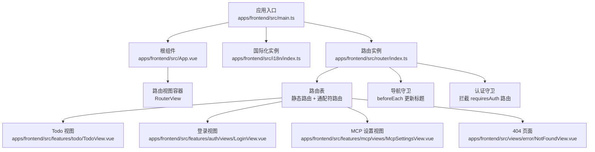
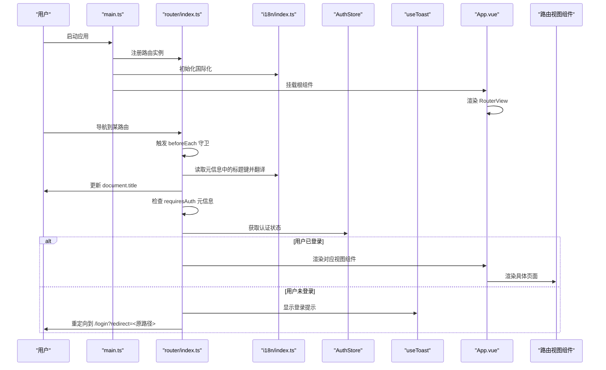
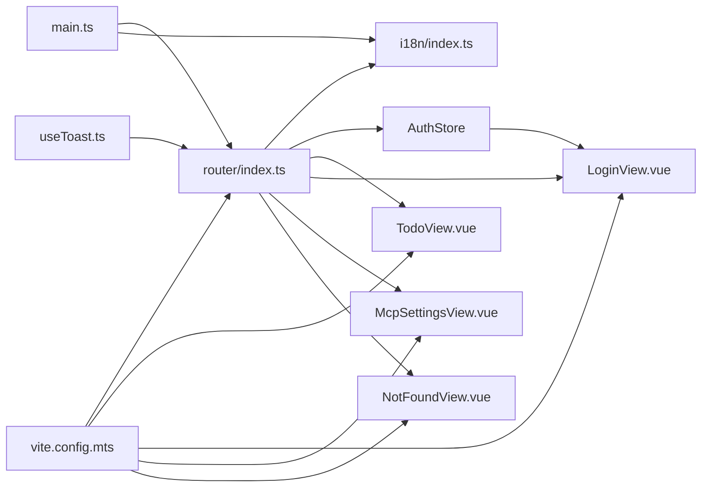

# 路由系统

<cite>
**本文引用的文件**
- [apps/frontend/src/router/index.ts](file://apps/frontend/src/router/index.ts)
- [apps/frontend/src/main.ts](file://apps/frontend/src/main.ts)
- [apps/frontend/src/App.vue](file://apps/frontend/src/App.vue)
- [apps/frontend/src/features/todo/TodoView.vue](file://apps/frontend/src/features/todo/TodoView.vue)
- [apps/frontend/src/features/auth/views/LoginView.vue](file://apps/frontend/src/features/auth/views/LoginView.vue)
- [apps/frontend/src/features/mcp/views/McpSettingsView.vue](file://apps/frontend/src/features/mcp/views/McpSettingsView.vue)
- [apps/frontend/src/views/error/NotFoundView.vue](file://apps/frontend/src/views/error/NotFoundView.vue)
- [apps/frontend/src/i18n/index.ts](file://apps/frontend/src/i18n/index.ts)
- [apps/frontend/src/features/auth/stores/auth.ts](file://apps/frontend/src/features/auth/stores/auth.ts)
- [apps/frontend/src/composables/useToast.ts](file://apps/frontend/src/composables/useToast.ts)
- [apps/frontend/tests/router/index.spec.ts](file://apps/frontend/tests/router/index.spec.ts)
- [apps/frontend/vite.config.mts](file://apps/frontend/vite.config.mts)
</cite>

## 更新摘要

**变更内容**

- 移除了教学仪表板路由，路由结构更加简洁
- 新增全局导航守卫系统，检查 `requiresAuth` 元信息
- 增强认证保护机制，为 MCP 设置等路由添加认证要求
- 改进用户体验，包括登录提示信息和智能重定向逻辑
- 完善测试覆盖，验证认证守卫的正确行为

## 目录

1. [简介](#简介)
2. [项目结构](#项目结构)
3. [核心组件](#核心组件)
4. [架构总览](#架构总览)
5. [详细组件分析](#详细组件分析)
6. [依赖关系分析](#依赖关系分析)
7. [性能考量](#性能考量)
8. [故障排查指南](#故障排查指南)
9. [结论](#结论)
10. [附录](#附录)

## 简介

本文件针对 Lumina Todo 前端的路由系统进行系统性说明，重点覆盖以下方面：

- Vue Router 配置与历史模式选择
- 全局导航守卫与页面标题国际化更新机制
- 路由层级结构、动态路由与嵌套路由的实现现状
- 路由懒加载、代码分割与性能优化策略
- 权限控制、导航守卫与路由元信息的使用
- 路由参数传递、查询字符串处理与路由历史管理
- 路由设计最佳实践与 SEO 优化建议

## 项目结构

前端路由位于应用的前端子工程中，采用 Vue Router 作为核心路由库，并通过 Vite 构建工具进行打包与代码分割。路由配置集中于路由模块，应用入口在 main.ts 中完成依赖注入与挂载；页面标题更新通过路由守卫与国际化模块联动。

**图表来源**

- [apps/frontend/src/main.ts:10-138](file://apps/frontend/src/main.ts#L10-L138)
- [apps/frontend/src/router/index.ts:1-98](file://apps/frontend/src/router/index.ts#L1-L98)
- [apps/frontend/src/App.vue:1-77](file://apps/frontend/src/App.vue#L1-L77)
- [apps/frontend/src/features/todo/TodoView.vue:1-522](file://apps/frontend/src/features/todo/TodoView.vue#L1-L522)
- [apps/frontend/src/features/auth/views/LoginView.vue:1-157](file://apps/frontend/src/features/auth/views/LoginView.vue#L1-L157)
- [apps/frontend/src/features/mcp/views/McpSettingsView.vue:1-279](file://apps/frontend/src/features/mcp/views/McpSettingsView.vue#L1-L279)
- [apps/frontend/src/views/error/NotFoundView.vue:1-21](file://apps/frontend/src/views/error/NotFoundView.vue#L1-L21)

**章节来源**

- [apps/frontend/src/router/index.ts:1-98](file://apps/frontend/src/router/index.ts#L1-L98)
- [apps/frontend/src/main.ts:10-138](file://apps/frontend/src/main.ts#L10-L138)
- [apps/frontend/src/App.vue:1-77](file://apps/frontend/src/App.vue#L1-L77)

## 核心组件

- 路由实例与历史模式
  - 使用 createRouter 创建路由实例，根据运行环境选择历史模式：
    - Wails 模式使用哈希历史（createWebHashHistory），以适配原生窗口环境的 URL 行为
    - Web 模式使用 HTML5 历史（createWebHistory），并支持可配置的基础路径
  - 基础路径由 Vite 配置按环境动态决定，确保多平台部署一致性

- 路由表
  - 根路径 '/' 对应 Todo 主视图，采用懒加载组件
  - 认证相关路径：登录、注册、忘记密码、重置密码，均采用懒加载组件
  - MCP 设置路径 '/settings/mcp' 采用懒加载组件，设置 `requiresAuth: true`
  - 通配符路径 '/:pathMatch(._)_' 匹配所有未识别路径，渲染 404 页面

- 导航守卫
  - beforeEach 守卫读取路由元信息中的标题键，结合国际化模块动态更新 document.title
  - 若未提供特定标题，则回退至完整应用名称，保证页面标题一致性
  - **新增** 全局认证守卫：检查 `meta.requiresAuth` 元信息，拦截未登录用户的访问请求

- 应用集成
  - main.ts 中完成 Pinia、Vue Query、国际化等插件注册，并将 router 注入应用
  - App.vue 中通过 RouterView 渲染当前路由对应的视图组件

**章节来源**

- [apps/frontend/src/router/index.ts:1-98](file://apps/frontend/src/router/index.ts#L1-L98)
- [apps/frontend/src/main.ts:10-138](file://apps/frontend/src/main.ts#L10-L138)
- [apps/frontend/src/App.vue:1-77](file://apps/frontend/src/App.vue#L1-L77)

## 架构总览

下图展示路由系统在应用中的整体交互流程，包括路由初始化、导航守卫、视图渲染与国际化联动。

**图表来源**

- [apps/frontend/src/main.ts:10-138](file://apps/frontend/src/main.ts#L10-L138)
- [apps/frontend/src/router/index.ts:60-95](file://apps/frontend/src/router/index.ts#L60-L95)
- [apps/frontend/src/i18n/index.ts:1-37](file://apps/frontend/src/i18n/index.ts#L1-L37)
- [apps/frontend/src/features/auth/stores/auth.ts:35](file://apps/frontend/src/features/auth/stores/auth.ts#L35)
- [apps/frontend/src/composables/useToast.ts:77-85](file://apps/frontend/src/composables/useToast.ts#L77-L85)
- [apps/frontend/src/App.vue:1-77](file://apps/frontend/src/App.vue#L1-L77)

## 详细组件分析

### 路由配置与历史模式

- 历史模式选择
  - Wails 模式：使用哈希历史，避免原生窗口对 HTML5 History 的兼容性问题
  - Web 模式：使用 HTML5 历史，基础路径由 Vite 动态计算，支持多部署场景
- 基础路径与构建
  - Vite 配置中通过环境变量与条件判断生成 base，确保生产与开发环境的一致性
  - 代码分割策略通过手动分包规则将第三方库拆分为独立 chunk，提升缓存命中率

**章节来源**

- [apps/frontend/src/router/index.ts:7-13](file://apps/frontend/src/router/index.ts#L7-L13)
- [apps/frontend/vite.config.mts:15-21](file://apps/frontend/vite.config.mts#L15-L21)
- [apps/frontend/vite.config.mts:23-78](file://apps/frontend/vite.config.mts#L23-L78)

### 路由表与懒加载

- 路由表结构
  - 根路径 '/' 懒加载 Todo 主视图
  - 认证相关路由：登录、注册、忘记密码、重置密码，均采用懒加载
  - MCP 设置 '/settings/mcp' 懒加载，设置 `requiresAuth: true`
  - 通配符路由 '/:pathMatch(._)_' 懒加载 404 页面
- 懒加载与代码分割
  - 所有视图组件均通过动态 import 实现懒加载
  - Vite 的 manualChunks 将常用第三方库归类到固定 chunk 名称，减少碎片化并提升缓存效率

**章节来源**

- [apps/frontend/src/router/index.ts:14-57](file://apps/frontend/src/router/index.ts#L14-L57)
- [apps/frontend/vite.config.mts:23-78](file://apps/frontend/vite.config.mts#L23-L78)

### 导航守卫与页面标题国际化

- beforeEach 守卫逻辑
  - 从路由元信息读取标题键（如 'login.title'、'register.title' 等）
  - 使用国际化模块进行翻译，拼接应用名称形成最终标题
  - 若无特定标题键，则回退到完整应用名称，确保一致性
- 测试验证
  - 单测覆盖首页与各认证页的标题行为，验证守卫逻辑正确性

**章节来源**

- [apps/frontend/src/router/index.ts:59-73](file://apps/frontend/src/router/index.ts#L59-L73)
- [apps/frontend/src/i18n/index.ts:1-37](file://apps/frontend/src/i18n/index.ts#L1-L37)
- [apps/frontend/tests/router/index.spec.ts:30-59](file://apps/frontend/tests/router/index.spec.ts#L30-L59)

### 全局认证守卫系统

- **新增功能** 全局导航守卫检查 `requiresAuth` 元信息
- 守卫逻辑
  - 检查路由元信息中的 `requiresAuth` 标志
  - 未登录用户访问受保护路由时：
    - 显示登录提示信息
    - 重定向到 `/login` 并携带 `redirect` 查询参数
    - `redirect` 参数包含原始访问路径，支持完整路径重定向
  - 已登录用户访问受保护路由时：直接放行
  - Todo 主页（/）不设置 `requiresAuth`，支持匿名访问
- 特殊处理
  - 登录成功后，LoginView 会解析 `redirect` 参数并安全重定向
  - 仅接受同源相对路径，避免开放重定向攻击
  - 不允许重定向到认证相关页面

**章节来源**

- [apps/frontend/src/router/index.ts:75-95](file://apps/frontend/src/router/index.ts#L75-L95)
- [apps/frontend/src/features/auth/stores/auth.ts:35](file://apps/frontend/src/features/auth/stores/auth.ts#L35)
- [apps/frontend/src/composables/useToast.ts:77-85](file://apps/frontend/src/composables/useToast.ts#L77-L85)
- [apps/frontend/src/features/auth/views/LoginView.vue:20-32](file://apps/frontend/src/features/auth/views/LoginView.vue#L20-L32)

### 路由层级结构与嵌套路由

- 当前实现
  - 路由表为扁平结构，未见明确的嵌套路由配置（如 children 字段）
  - 视图组件内部通过条件渲染与过渡动画实现复杂 UI 切换，而非通过嵌套路由
- 可扩展性
  - 如需引入嵌套路由，可在现有路由基础上增加 children 字段，并在父级路由中放置 RouterView
  - 嵌套路由适合权限控制与布局复用场景，但需注意与现有懒加载策略的配合

**章节来源**

- [apps/frontend/src/router/index.ts:14-57](file://apps/frontend/src/router/index.ts#L14-L57)
- [apps/frontend/src/features/todo/TodoView.vue:444-453](file://apps/frontend/src/features/todo/TodoView.vue#L444-L453)

### 动态路由与通配符路由

- 动态路由
  - 当前路由表未定义具名参数的动态段
  - 通配符路由使用 '/:pathMatch(._)_' 捕获所有未匹配路径，统一跳转至 404 页面
  - 404 页面通过 RouterLink 返回首页，提供友好的用户体验

**章节来源**

- [apps/frontend/src/router/index.ts:50-55](file://apps/frontend/src/router/index.ts#L50-L55)
- [apps/frontend/src/views/error/NotFoundView.vue:13-18](file://apps/frontend/src/views/error/NotFoundView.vue#L13-L18)

### 查询字符串与路由历史管理

- 查询字符串处理
  - 路由表未定义带查询参数的路由规则，组件内部可通过 $route.query 获取查询参数
  - 认证守卫使用 `redirect` 查询参数实现智能重定向
  - LoginView 解析 `redirect` 参数时进行安全验证，防止开放重定向攻击
- 路由历史
  - 应用通过 router.push 或 <router-link> 进行导航，历史记录由 Vue Router 自动维护
  - 在跨页面交互中（如登录成功后跳转首页），使用 router.push 保持历史栈整洁

**章节来源**

- [apps/frontend/src/features/auth/views/LoginView.vue:20-32](file://apps/frontend/src/features/auth/views/LoginView.vue#L20-L32)
- [apps/frontend/src/features/mcp/views/McpSettingsView.vue:80-86](file://apps/frontend/src/features/mcp/views/McpSettingsView.vue#L80-L86)

### 权限控制与导航守卫

- **增强功能** 基于 `requiresAuth` 元信息的权限控制
- 实现方案
  - 在 beforeEach 中检查路由元信息的 `requiresAuth` 属性
  - 结合 Pinia 认证状态管理器判断用户登录状态
  - 未登录用户访问受保护路由时，统一重定向到登录页并携带原路径
- 受保护路由范围
  - MCP 设置：'/settings/mcp'
- 例外情况
  - Todo 主页（/）不设置 `requiresAuth`，支持匿名访问
  - 认证相关页面（登录、注册、忘记密码、重置密码）不设置 `requiresAuth`

**章节来源**

- [apps/frontend/src/router/index.ts:44-49](file://apps/frontend/src/router/index.ts#L44-L49)
- [apps/frontend/src/features/auth/views/LoginView.vue:61-68](file://apps/frontend/src/features/auth/views/LoginView.vue#L61-L68)
- [apps/frontend/src/router/index.ts:75-95](file://apps/frontend/src/router/index.ts#L75-L95)

### 路由元信息与国际化

- 元信息使用
  - 每个路由可携带 meta.title 键，指向国际化键值
  - beforeEach 守卫读取该键并进行翻译，实现页面标题的本地化
  - **新增** `requiresAuth` 元信息用于权限控制
- 国际化配置
  - i18n 模块提供多语言消息与回退策略，确保标题翻译的稳定性

**章节来源**

- [apps/frontend/src/router/index.ts:20-24](file://apps/frontend/src/router/index.ts#L20-L24)
- [apps/frontend/src/i18n/index.ts:1-37](file://apps/frontend/src/i18n/index.ts#L1-L37)

### 路由错误处理与健壮性

- Chunk 加载错误处理
  - main.ts 中为应用配置了全局错误处理器，检测动态导入失败（Chunk Error）
  - 当检测到相关错误时，限制刷新频率并尝试自动刷新，提升部署后的用户体验
- 全局错误捕获
  - 同时处理 window.onerror 与 Promise 拒绝事件，避免因第三方库或异步错误影响应用稳定性

**章节来源**

- [apps/frontend/src/main.ts:56-113](file://apps/frontend/src/main.ts#L56-L113)

## 依赖关系分析

- 路由依赖
  - 路由实例依赖国际化模块以解析标题键
  - 路由实例依赖认证存储以检查用户登录状态
  - 视图组件依赖路由提供的 $route/$router API 进行参数与导航
- 构建依赖
  - Vite 的 manualChunks 将第三方库拆分为稳定 chunk，降低缓存失效概率
  - PWA 插件与压缩插件提升离线体验与传输效率

**图表来源**

- [apps/frontend/src/router/index.ts:1-98](file://apps/frontend/src/router/index.ts#L1-L98)
- [apps/frontend/src/i18n/index.ts:1-37](file://apps/frontend/src/i18n/index.ts#L1-L37)
- [apps/frontend/src/features/auth/stores/auth.ts:1-429](file://apps/frontend/src/features/auth/stores/auth.ts#L1-L429)
- [apps/frontend/src/composables/useToast.ts:1-87](file://apps/frontend/src/composables/useToast.ts#L1-L87)
- [apps/frontend/src/main.ts:10-138](file://apps/frontend/src/main.ts#L10-L138)
- [apps/frontend/vite.config.mts:80-184](file://apps/frontend/vite.config.mts#L80-L184)

**章节来源**

- [apps/frontend/src/router/index.ts:1-98](file://apps/frontend/src/router/index.ts#L1-L98)
- [apps/frontend/src/main.ts:10-138](file://apps/frontend/src/main.ts#L10-L138)
- [apps/frontend/vite.config.mts:80-184](file://apps/frontend/vite.config.mts#L80-L184)

## 性能考量

- 代码分割
  - 通过 manualChunks 将 Vue 生态、UI 组件库、图表库、Markdown 工具链等第三方库分别打包，提升缓存命中率
  - 懒加载视图组件，减少首屏体积与加载时间
- 压缩与缓存
  - 启用 gzip 与 Brotli 压缩，降低传输体积
  - PWA 配置提供离线能力与自动更新机制
- 运行时健壮性
  - 全局错误处理器自动处理 Chunk 加载失败，避免白屏并引导用户刷新
  - 对 ResizeObserver 等常见浏览器警告进行过滤，避免干扰日志

**章节来源**

- [apps/frontend/vite.config.mts:23-78](file://apps/frontend/vite.config.mts#L23-L78)
- [apps/frontend/vite.config.mts:88-103](file://apps/frontend/vite.config.mts#L88-L103)
- [apps/frontend/src/main.ts:56-113](file://apps/frontend/src/main.ts#L56-L113)

## 故障排查指南

- 页面标题未更新
  - 检查路由元信息是否包含有效的标题键
  - 确认国际化键是否存在且已被加载
- 404 页面未显示
  - 确认通配符路由已定义
  - 检查路由跳转是否正确，避免被其他守卫拦截
- 动态导入失败（白屏或空白页）
  - 查看浏览器控制台是否有 Chunk 加载错误
  - 确认服务端部署是否正确更新资源文件
  - 关注全局错误处理器的日志输出
- 导航后历史记录异常
  - 检查组件内是否使用 replace 而非 push
  - 确认路由跳转逻辑是否符合预期
- **新增** 认证相关问题
  - 检查路由元信息中的 `requiresAuth` 标志是否正确设置
  - 确认认证存储中的 `isAuthenticated` 计算属性返回正确的状态
  - 验证登录页面的 `redirect` 参数解析逻辑
  - 检查 Toast 提示信息是否正确显示

**章节来源**

- [apps/frontend/src/router/index.ts:59-95](file://apps/frontend/src/router/index.ts#L59-L95)
- [apps/frontend/src/views/error/NotFoundView.vue:13-18](file://apps/frontend/src/views/error/NotFoundView.vue#L13-L18)
- [apps/frontend/src/main.ts:56-113](file://apps/frontend/src/main.ts#L56-L113)
- [apps/frontend/src/features/auth/stores/auth.ts:35](file://apps/frontend/src/features/auth/stores/auth.ts#L35)

## 结论

Lumina Todo 的前端路由系统以 Vue Router 为核心，结合 Vite 的代码分割与 PWA 能力，实现了简洁高效的页面导航与性能优化。**最新更新**移除了教学仪表板路由，使路由结构更加简洁，同时增强了路由守卫系统，新增全局导航守卫检查 `requiresAuth` 元信息，为 MCP 设置等路由提供了更好的认证保护和用户体验。当前路由表采用扁平结构与懒加载策略，导航守卫负责页面标题的国际化更新和认证拦截。未来可在路由层引入更细粒度的权限控制与嵌套路由，进一步完善权限控制与布局复用；同时建议在需要场景中使用查询参数与书签化路由，以提升 SEO 与可访问性。

## 附录

- 最佳实践
  - 为每个页面提供 meta.title 键，确保标题国际化
  - 对关键页面启用懒加载，减少首屏体积
  - 在 beforeEach 中实现基础权限校验与登录拦截
  - 使用查询参数承载可分享的状态，便于 SEO 与书签化
  - 为所有需要认证的路由设置 `requiresAuth: true` 元信息
  - 在登录页面实现安全的 `redirect` 参数解析，防止开放重定向攻击
- SEO 优化建议
  - 为重要页面提供语义化标题与描述
  - 使用结构化数据（如 JSON-LD）补充页面信息
  - 保持稳定的 URL 结构，避免频繁变更路由路径
  - 配置 robots.txt 与 sitemap，提升搜索引擎收录效率
- 安全考虑
  - 认证守卫应检查所有敏感路由
  - 登录重定向应进行安全验证，仅接受同源相对路径
  - 避免将敏感信息暴露在 URL 查询参数中
  - 实施适当的 CSRF 保护机制
