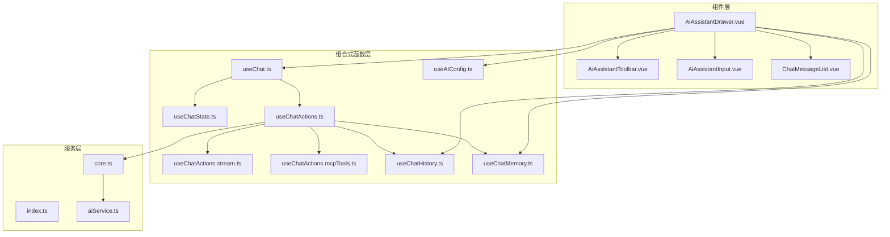
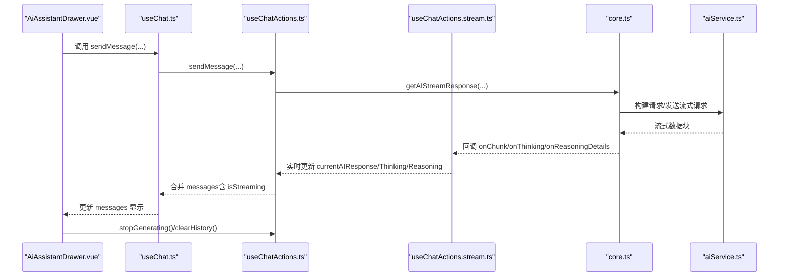
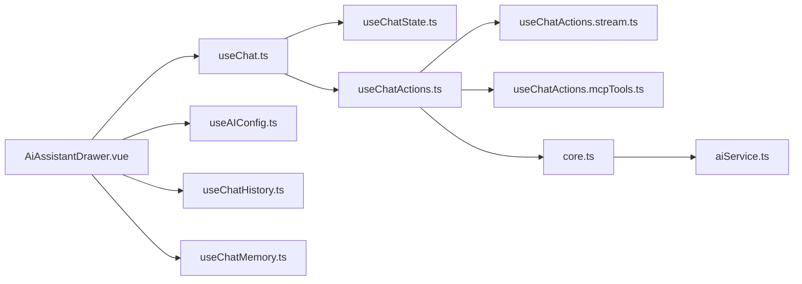

# AI助手

<cite>
**本文档引用的文件**
- [AiAssistantDrawer.vue](file://apps/frontend/src/features/ai/components/AiAssistantDrawer.vue)
- [useChat.ts](file://apps/frontend/src/features/ai/composables/useChat.ts)
- [useChatState.ts](file://apps/frontend/src/features/ai/composables/useChatState.ts)
- [useChatActions.ts](file://apps/frontend/src/features/ai/composables/useChatActions.ts)
- [useChatActions.stream.ts](file://apps/frontend/src/features/ai/composables/useChatActions.stream.ts)
- [useChatActions.mcpTools.ts](file://apps/frontend/src/features/ai/composables/useChatActions.mcpTools.ts)
- [useAIConfig.ts](file://apps/frontend/src/features/ai/composables/useAIConfig.ts)
- [useChatHistory.ts](file://apps/frontend/src/features/ai/composables/useChatHistory.ts)
- [useChatMemory.ts](file://apps/frontend/src/features/ai/composables/useChatMemory.ts)
- [AiAssistantInput.vue](file://apps/frontend/src/features/ai/components/AiAssistantInput.vue)
- [AiAssistantToolbar.vue](file://apps/frontend/src/features/ai/components/AiAssistantToolbar.vue)
- [ChatMessageList.vue](file://apps/frontend/src/features/ai/components/ChatMessageList.vue)
- [core.ts](file://apps/frontend/src/features/ai/services/core.ts)
- [index.ts](file://apps/frontend/src/features/ai/services/index.ts)
- [aiService.ts](file://apps/frontend/src/features/ai/services/aiService.ts)
</cite>

## 目录
1. [简介](#简介)
2. [项目结构](#项目结构)
3. [核心组件](#核心组件)
4. [架构总览](#架构总览)
5. [详细组件分析](#详细组件分析)
6. [依赖关系分析](#依赖关系分析)
7. [性能考量](#性能考量)
8. [故障排查指南](#故障排查指南)
9. [结论](#结论)
10. [附录](#附录)

## 简介
本文件面向“AI助手”功能，围绕前端抽屉组件 AiAssistantDrawer 的设计与实现，系统化阐述以下主题：
- 抽屉布局与交互：对话界面、输入区域、工具栏、侧边面板的组织方式与联动
- 聊天核心能力：消息发送/接收、流式响应处理、上下文管理、记忆存储
- 组合式函数 useChat 的职责边界：消息状态管理、发送流程控制、错误处理、WebSocket/流式连接管理
- AI 服务层：API 调用封装、请求参数构建、响应数据处理、工具调用集成
- 增强功能：Markdown 渲染、代码高亮、图片预览、附件上传

## 项目结构
AI 助手功能位于前端应用的 features/ai 目录下，采用“组件 + 组合式函数 + 服务层”的分层设计：
- 组件层：负责 UI 布局与用户交互（如 AiAssistantDrawer、AiAssistantInput、AiAssistantToolbar、ChatMessageList）
- 组合式函数层：封装状态、动作与业务逻辑（如 useChat、useChatState、useChatActions、useAIConfig、useChatHistory、useChatMemory）
- 服务层：封装网络请求与数据处理（如 aiService、core.ts）

图表来源
- [AiAssistantDrawer.vue:1-348](file://apps/frontend/src/features/ai/components/AiAssistantDrawer.vue#L1-L348)
- [useChat.ts:1-119](file://apps/frontend/src/features/ai/composables/useChat.ts#L1-L119)
- [useChatActions.ts:1-492](file://apps/frontend/src/features/ai/composables/useChatActions.ts#L1-L492)
- [useChatActions.stream.ts:1-269](file://apps/frontend/src/features/ai/composables/useChatActions.stream.ts#L1-L269)
- [useChatActions.mcpTools.ts:1-50](file://apps/frontend/src/features/ai/composables/useChatActions.mcpTools.ts#L1-L50)
- [useAIConfig.ts:1-800](file://apps/frontend/src/features/ai/composables/useAIConfig.ts#L1-L800)
- [useChatHistory.ts:1-479](file://apps/frontend/src/features/ai/composables/useChatHistory.ts#L1-L479)
- [useChatMemory.ts:1-148](file://apps/frontend/src/features/ai/composables/useChatMemory.ts#L1-L148)
- [AiAssistantInput.vue:1-340](file://apps/frontend/src/features/ai/components/AiAssistantInput.vue#L1-L340)
- [AiAssistantToolbar.vue:1-339](file://apps/frontend/src/features/ai/components/AiAssistantToolbar.vue#L1-L339)
- [ChatMessageList.vue:1-489](file://apps/frontend/src/features/ai/components/ChatMessageList.vue#L1-L489)
- [core.ts:1-442](file://apps/frontend/src/features/ai/services/core.ts#L1-L442)
- [index.ts:1-9](file://apps/frontend/src/features/ai/services/index.ts#L1-L9)
- [aiService.ts:1-6](file://apps/frontend/src/features/ai/services/aiService.ts#L1-L6)

章节来源
- [AiAssistantDrawer.vue:1-348](file://apps/frontend/src/features/ai/components/AiAssistantDrawer.vue#L1-L348)
- [useChat.ts:1-119](file://apps/frontend/src/features/ai/composables/useChat.ts#L1-L119)
- [core.ts:1-442](file://apps/frontend/src/features/ai/services/core.ts#L1-L442)

## 核心组件
本节聚焦 AiAssistantDrawer 抽屉组件的设计与实现要点。

- 布局与状态
  - 通过 v-model 控制抽屉显隐；默认宽度、最小/最大宽度、全屏模式由 ResizableDrawer 提供
  - 顶部 Header、中部消息列表、底部工具栏与输入区、右侧设置与历史覆盖层构成主内容区
  - 通过 useWindowSize 计算移动端尺寸，动态调整布局行为

- 配置与模式
  - useAIConfig 提供预设、当前配置、思考模式、讨论模式、图像生成功能开关等
  - useAiAssistantModes 将配置与 UI 行为绑定，支持切换思考/教学/待办/讨论/图像生成等模式

- 会话与历史
  - useChatHistory 提供会话创建、切换、消息增删改、上下文摘要维护
  - navigateToPrevious 支持在生成中止的前提下快速回到上一个会话

- 聊天核心
  - useChat 聚合 useChatState 与 useChatActions，提供 messages、isGenerating、error、sendMessage、stopGenerating、clearHistory、regenerateMessage、deleteMessage、editAndResendMessage 等接口
  - messages 在生成过程中实时合并当前流式响应，保证 UI 即时反馈

- 输入与附件
  - AiAssistantInput 提供文本输入、快捷命令（/）、粘贴、文件上传、图片预览、发送控制
  - useAiAssistantAttachments 负责附件选择、解析、移除、清空、触发上传与粘贴处理

- 面板与设置
  - useAiAssistantPanels 控制设置/历史面板的显示与懒挂载
  - AISettingsDialog/AiAssistantHistoryOverlay 分别承载设置与历史面板

章节来源
- [AiAssistantDrawer.vue:1-348](file://apps/frontend/src/features/ai/components/AiAssistantDrawer.vue#L1-L348)
- [useAIConfig.ts:1-800](file://apps/frontend/src/features/ai/composables/useAIConfig.ts#L1-L800)
- [useChatHistory.ts:1-479](file://apps/frontend/src/features/ai/composables/useChatHistory.ts#L1-L479)
- [useChat.ts:1-119](file://apps/frontend/src/features/ai/composables/useChat.ts#L1-L119)
- [AiAssistantInput.vue:1-340](file://apps/frontend/src/features/ai/components/AiAssistantInput.vue#L1-L340)

## 架构总览
AI 助手的前端架构遵循“组件驱动 + 组合式函数 + 服务层”的分层思想。下图展示从 UI 到服务层的关键交互路径：

图表来源
- [AiAssistantDrawer.vue:60-74](file://apps/frontend/src/features/ai/components/AiAssistantDrawer.vue#L60-L74)
- [useChat.ts:21-118](file://apps/frontend/src/features/ai/composables/useChat.ts#L21-L118)
- [useChatActions.ts:147-372](file://apps/frontend/src/features/ai/composables/useChatActions.ts#L147-L372)
- [useChatActions.stream.ts:202-268](file://apps/frontend/src/features/ai/composables/useChatActions.stream.ts#L202-L268)
- [core.ts:115-338](file://apps/frontend/src/features/ai/services/core.ts#L115-L338)
- [aiService.ts:1-6](file://apps/frontend/src/features/ai/services/aiService.ts#L1-L6)

## 详细组件分析

### AiAssistantDrawer 抽屉组件
- 设计目标
  - 提供沉浸式对话体验：头部控制、消息列表、输入区、工具栏、设置/历史面板
  - 支持多种模式：思考模式、教学模式、待办助手、讨论模式、图像生成
  - 与会话历史、配置、记忆、附件等模块解耦协作

- 关键交互
  - 快捷键 Command/Ctrl + J 新建对话并打开抽屉
  - 生成中可停止；生成结束后可重新生成或编辑重发
  - 支持拖拽调整历史面板宽度，移动端自适应

- 状态与依赖
  - 依赖 useChat/useAIConfig/useChatHistory/useAiAssistantAttachments/useAiAssistantPanels/useAiAssistantModes/useAiAssistantComposer 等组合式函数
  - 通过 ResizableDrawer 提供可调整宽度与全屏能力

章节来源
- [AiAssistantDrawer.vue:1-348](file://apps/frontend/src/features/ai/components/AiAssistantDrawer.vue#L1-L348)

### useChat 组合式函数
- 职责
  - 聚合状态与动作：将 useChatState 与 useChatActions 组合，暴露统一的聊天接口
  - 实时合并消息：在生成过程中将 currentAIResponse 解析为 assistant 消息，注入思考/推理/讨论/待办/教学等结构化信息

- 输出
  - 响应式状态：chatHistory/isGenerating/error/retryCount 等
  - 动作接口：sendMessage/stopGenerating/clearHistory/regenerateMessage/deleteMessage/editAndResendMessage/addMessagePair

章节来源
- [useChat.ts:1-119](file://apps/frontend/src/features/ai/composables/useChat.ts#L1-L119)

### useChatState 状态管理
- 全局单例状态
  - currentAIResponse/currentThinkingContent/currentReasoningDetails/currentDiscussionSteps/currentTodoActions/currentAssistantMessageId
  - isGenerating/isLoading/error/retryCount

- 会话绑定
  - chatHistory 与当前会话关联，切换会话时重置流式状态与错误

- 教学模式答题
  - updateTeachingQuizAnswer/getTeachingQuizSnapshot 支持教学问答的用户答案更新与快照读取

章节来源
- [useChatState.ts:1-144](file://apps/frontend/src/features/ai/composables/useChatState.ts#L1-L144)

### useChatActions 动作逻辑
- 发送消息
  - 构建上下文压缩后的消息列表，注入系统提示、技能上下文、记忆快照
  - 选择讨论模式或多模型讨论流或普通流式请求
  - 支持工具调用：构建 MCP 工具、本地工具处理器、技能运行时工具

- 流式处理
  - createStreamChunkHandler 将流式片段写入 currentAIResponse，并在 [DONE]/[ABORTED] 时完成消息构建与内存提取

- 工具调用
  - buildAiToolsFromMcpTools 将 MCP 工具转换为 AI 可用工具
  - executeToolCalls 执行工具调用并递归触发 sendMessage

- 错误与重试
  - 最多重试 3 次；中断请求通过 AbortController

- 其他动作
  - stopGenerating/clearHistory/deleteMessage/regenerateMessage/regenerateLastResponse/editAndResendMessage/addMessagePair

章节来源
- [useChatActions.ts:1-492](file://apps/frontend/src/features/ai/composables/useChatActions.ts#L1-L492)
- [useChatActions.stream.ts:1-269](file://apps/frontend/src/features/ai/composables/useChatActions.stream.ts#L1-L269)
- [useChatActions.mcpTools.ts:1-50](file://apps/frontend/src/features/ai/composables/useChatActions.mcpTools.ts#L1-L50)

### useAIConfig 配置与预设
- 配置项
  - 基础：baseUrl/model/apiKey/temperature/systemPrompt
  - 模式：thinkingMode/thinkingEffort/todoAssistant/discussionMode/discussionModelIds/discussionPrimaryModelId/memoryModelId
  - 能力：enableImageGeneration/mcpEnabled/contextCompressionEnabled/contextCompressionTriggerChars/contextCompressionModelId/skillIds

- 预设与活动预设
  - 预设持久化与匹配、活动预设切换
  - 思考模式持久化

章节来源
- [useAIConfig.ts:1-800](file://apps/frontend/src/features/ai/composables/useAIConfig.ts#L1-L800)

### useChatHistory 会话历史
- 会话模型
  - ChatSession：id/title/messages/contextSummary/contextSummaryUpdatedAt/contextSummaryUntilMessageId/memorySnapshot/createdAt/updatedAt/isPinned/isAutoTitle

- 持久化与同步
  - 本地存储（带作用域），节流保存，跨标签页事件监听
  - 自动标题、置顶排序、上下文摘要更新

- 操作接口
  - createSession/switchSession/updateSessionMessages/addSessionMessage/updateSessionContextSummary/clearSessionContextSummary/togglePin/renameSession/deleteSession/clearAllSessions/getOrCreateCurrentSession

章节来源
- [useChatHistory.ts:1-479](file://apps/frontend/src/features/ai/composables/useChatHistory.ts#L1-L479)

### useChatMemory 记忆提取
- 触发策略
  - 用户输入包含偏好关键词或周期性触发（每 3 轮）

- 提取流程
  - 调用 getAIStaticResponse 生成记忆抽取提示，解析 JSON 并追加到记忆库

- 错误处理
  - 记录错误并弹出提示

章节来源
- [useChatMemory.ts:1-148](file://apps/frontend/src/features/ai/composables/useChatMemory.ts#L1-L148)

### AiAssistantInput 输入组件
- 功能特性
  - 文本输入自适应高度、移动端优化
  - 快捷命令菜单（/）：待办/教学/绘图/讨论
  - 发送控制：根据输入/图片/文件数量决定可发送状态
  - 文件上传与粘贴事件透传

章节来源
- [AiAssistantInput.vue:1-340](file://apps/frontend/src/features/ai/components/AiAssistantInput.vue#L1-L340)

### AiAssistantToolbar 工具栏
- 快捷操作
  - 新建会话、历史记录、文件上传、停止生成/上一个会话、思考模式开关、模式切换菜单、讨论菜单、MCP 设置、预设菜单、设置

- 响应式布局
  - 容器类型与媒体查询控制按钮文本显示

章节来源
- [AiAssistantToolbar.vue:1-339](file://apps/frontend/src/features/ai/components/AiAssistantToolbar.vue#L1-L339)

### ChatMessageList 消息列表
- 渲染优化
  - 滚动窗口化渲染（可见窗口大小可配置），隐藏消息数量提示与“加载更多”
  - 智能滚动：自动滚动到底部，流式生成时即时滚动，用户手动上滑时显示“回到底部”

- 会话切换
  - 切换时禁用 sticking 与 autoScroll，避免过渡动画导致的滚动错位

章节来源
- [ChatMessageList.vue:1-489](file://apps/frontend/src/features/ai/components/ChatMessageList.vue#L1-L489)

### AI 服务层（core.ts 与 aiService）
- 流式请求
  - getAIStreamResponse：构建消息与系统提示，发送 SSE 流，解析增量内容、工具调用、推理细节
  - 支持 AbortSignal 中断请求

- 非流式请求
  - getAIStaticResponse：一次性请求，返回 content 与 reasoning_details

- 工具调用集成
  - 通过工具名映射 MCP 服务器与工具名，构建 AI 可用工具集

章节来源
- [core.ts:1-442](file://apps/frontend/src/features/ai/services/core.ts#L1-L442)
- [aiService.ts:1-6](file://apps/frontend/src/features/ai/services/aiService.ts#L1-L6)
- [index.ts:1-9](file://apps/frontend/src/features/ai/services/index.ts#L1-L9)

## 依赖关系分析
- 组件与组合式函数
  - AiAssistantDrawer 依赖 useChat/useAIConfig/useChatHistory/useAiAssistantAttachments/useAiAssistantPanels/useAiAssistantModes/useAiAssistantComposer
  - AiAssistantInput/AiAssistantToolbar/ChatMessageList 作为子组件被 Drawer 组织与复用

- 组合式函数之间的耦合
  - useChat 聚合 useChatState 与 useChatActions
  - useChatActions 依赖 useChatState/useChatHistory/useChatMemory/useAIConfig，同时调用 core.ts 与 aiService

- 服务层依赖
  - core.ts 依赖 useAIConfig 与 utils 构建请求，调用 aiService 的工具函数

图表来源
- [AiAssistantDrawer.vue:1-348](file://apps/frontend/src/features/ai/components/AiAssistantDrawer.vue#L1-L348)
- [useChat.ts:1-119](file://apps/frontend/src/features/ai/composables/useChat.ts#L1-L119)
- [useChatActions.ts:1-492](file://apps/frontend/src/features/ai/composables/useChatActions.ts#L1-L492)
- [useChatActions.stream.ts:1-269](file://apps/frontend/src/features/ai/composables/useChatActions.stream.ts#L1-L269)
- [useChatActions.mcpTools.ts:1-50](file://apps/frontend/src/features/ai/composables/useChatActions.mcpTools.ts#L1-L50)
- [core.ts:1-442](file://apps/frontend/src/features/ai/services/core.ts#L1-L442)
- [aiService.ts:1-6](file://apps/frontend/src/features/ai/services/aiService.ts#L1-L6)

## 性能考量
- 渲染性能
  - ChatMessageList 使用窗口化渲染与智能滚动，减少大消息列表的重排与重绘
  - 会话切换时禁用自动滚动与 sticking，避免过渡动画引发的滚动抖动

- 网络与流式
  - 流式响应按块增量更新，避免一次性渲染大量文本
  - AbortController 支持中断请求，降低无效资源占用

- 存储与上下文
  - 会话历史按字符长度截断，避免超长消息与图片导致存储膨胀
  - 上下文压缩与摘要更新，减少长对话的请求体积

- 附件与图片
  - 仅保留远程图片 URL，过滤 data:URL，降低本地存储压力

## 故障排查指南
- 无法发送消息
  - 检查 isGenerating 状态与输入内容/图片/文件数量
  - 确认配置中的 baseUrl/model/apiKey 是否有效

- 流式响应异常中断
  - 查看 error 状态与控制台日志；确认网络与 CORS 设置
  - 使用 stopGenerating 中断请求，重试发送

- 工具调用失败
  - 检查 MCP 工具可用性与权限；确认工具名映射是否正确
  - 查看工具调用回调中的错误信息

- 记忆提取失败
  - 检查记忆模型配置与提示词；查看错误提示与日志

章节来源
- [useChatActions.ts:358-371](file://apps/frontend/src/features/ai/composables/useChatActions.ts#L358-L371)
- [useChatMemory.ts:135-140](file://apps/frontend/src/features/ai/composables/useChatMemory.ts#L135-L140)

## 结论
AiAssistantDrawer 通过清晰的分层设计与组合式函数抽象，实现了可扩展、可维护的 AI 对话体验。其核心优势在于：
- 组件与状态/动作分离，便于测试与演进
- 流式响应与工具调用的无缝集成
- 会话历史与记忆的持久化与上下文压缩
- 输入/工具栏/消息列表的高性能渲染与交互

建议在后续迭代中持续关注：
- Markdown 渲染与代码高亮的性能优化
- 附件上传与图片预览的并发与缓存策略
- 多模型讨论与技能运行时的稳定性与可观测性

## 附录
- 增强功能指引
  - Markdown 渲染与代码高亮：结合 useChatMessageMarkdownRender 与 Markdown-it 插件体系
  - 图片预览：AiAssistantInput 与 ChatMessageImagePreview 组件配合
  - 附件上传：AiAssistantInputAttachments 与 useAiAssistantAttachments 提供文件解析与上传通道