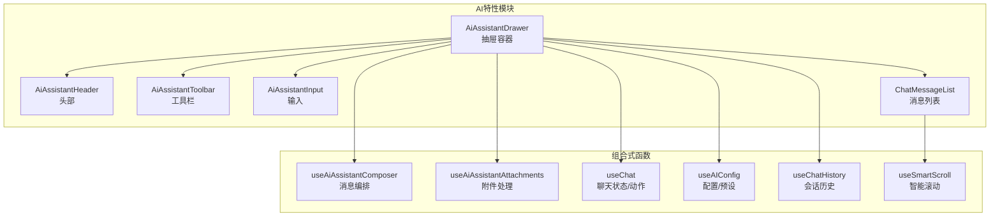
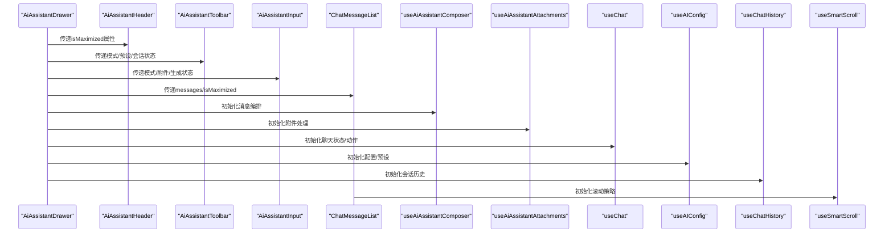
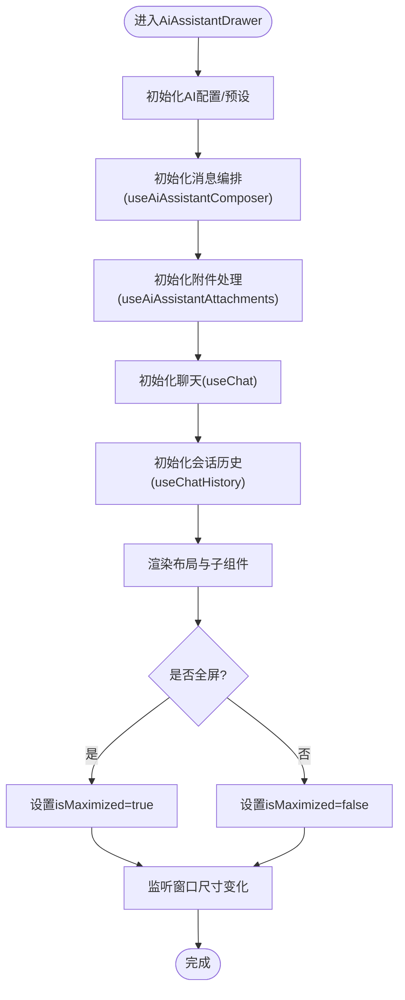
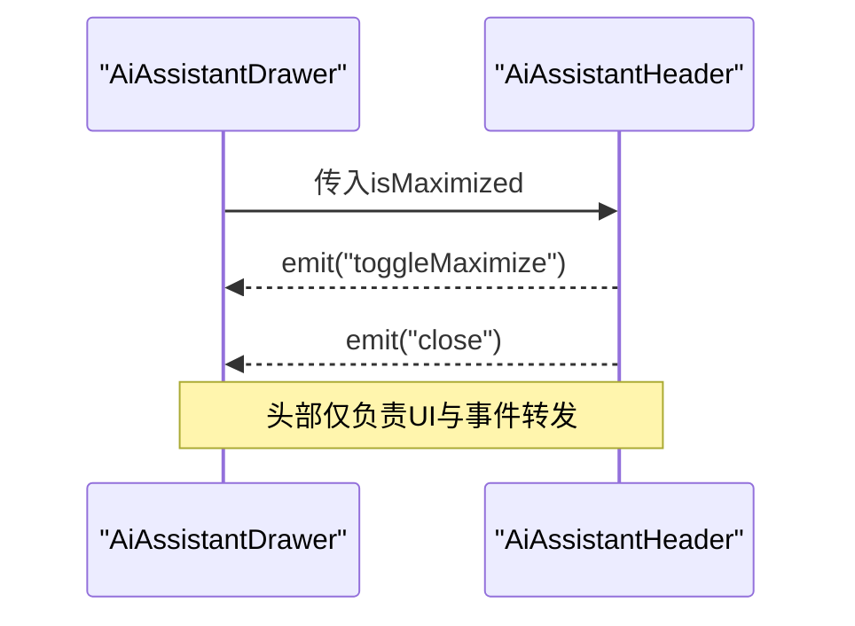
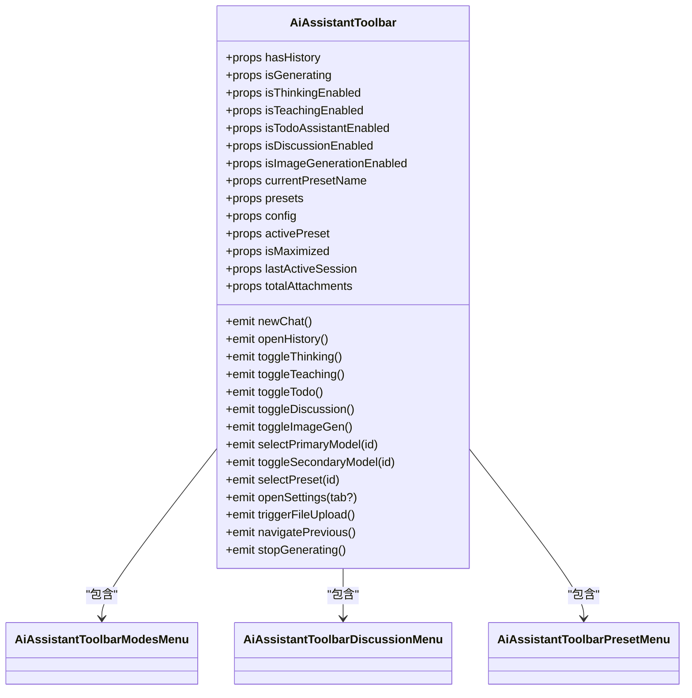
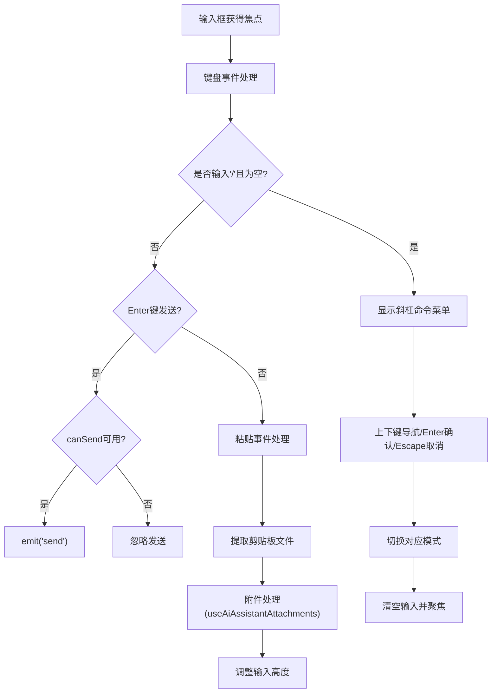
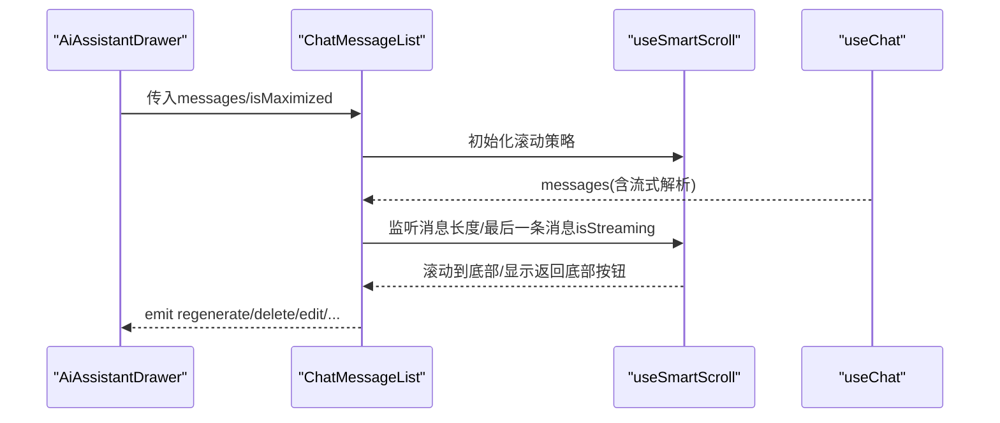
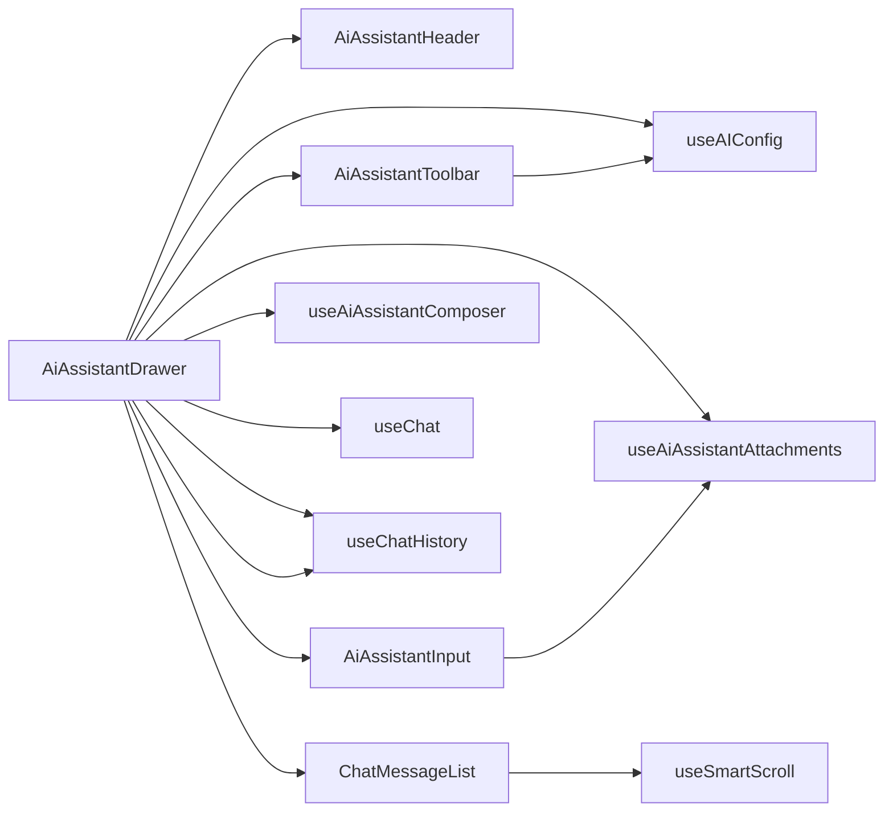

# AI助手界面组件

<cite>
**本文档引用的文件**
- [AiAssistantDrawer.vue](file://apps/frontend/src/features/ai/components/AiAssistantDrawer.vue)
- [AiAssistantHeader.vue](file://apps/frontend/src/features/ai/components/AiAssistantHeader.vue)
- [AiAssistantToolbar.vue](file://apps/frontend/src/features/ai/components/AiAssistantToolbar.vue)
- [AiAssistantInput.vue](file://apps/frontend/src/features/ai/components/AiAssistantInput.vue)
- [ChatMessageList.vue](file://apps/frontend/src/features/ai/components/ChatMessageList.vue)
- [useAiAssistantComposer.ts](file://apps/frontend/src/features/ai/composables/useAiAssistantComposer.ts)
- [useAiAssistantAttachments.ts](file://apps/frontend/src/features/ai/composables/useAiAssistantAttachments.ts)
- [useChat.ts](file://apps/frontend/src/features/ai/composables/useChat.ts)
- [useAIConfig.ts](file://apps/frontend/src/features/ai/composables/useAIConfig.ts)
- [useChatHistory.ts](file://apps/frontend/src/features/ai/composables/useChatHistory.ts)
- [useSmartScroll.ts](file://apps/frontend/src/composables/useSmartScroll.ts)
- [attachments.ts](file://apps/frontend/src/features/ai/constants/attachments.ts)
- [ChatMessage.vue](file://apps/frontend/src/features/ai/components/ChatMessage.vue)
</cite>

## 目录
1. [简介](#简介)
2. [项目结构](#项目结构)
3. [核心组件](#核心组件)
4. [架构总览](#架构总览)
5. [详细组件分析](#详细组件分析)
6. [依赖关系分析](#依赖关系分析)
7. [性能考虑](#性能考虑)
8. [故障排除指南](#故障排除指南)
9. [结论](#结论)

## 简介
本文件系统性地解析了AI助手界面组件的整体架构设计，重点覆盖以下方面：
- 抽屉容器AiAssistantDrawer的响应式布局、尺寸控制与全屏模式切换
- 头部组件AiAssistantHeader的标题显示、最大化按钮与关闭操作
- 工具栏组件AiAssistantToolbar的模式切换按钮、预设管理、会话控制与快捷操作
- 输入组件AiAssistantInput的文本输入、文件上传、粘贴处理与多模态支持
- 消息列表组件ChatMessageList的渲染机制、消息类型识别、Markdown渲染与滚动同步

该文档旨在帮助开发者快速理解各组件职责、交互流程与扩展点，并提供可视化图表辅助理解。

## 项目结构
AI助手界面位于前端应用的AI特性模块中，采用“容器-子组件”分层组织：
- 容器组件：AiAssistantDrawer作为主抽屉容器，协调头部、工具栏、输入与消息列表
- 子组件：AiAssistantHeader、AiAssistantToolbar、AiAssistantInput、ChatMessageList
- 组合式函数：useAiAssistantComposer、useAiAssistantAttachments、useChat、useAIConfig、useChatHistory、useSmartScroll
- 常量与工具：附件上传限制、文件解析、滚动策略

**图表来源**
- [AiAssistantDrawer.vue:1-348](file://apps/frontend/src/features/ai/components/AiAssistantDrawer.vue#L1-L348)
- [AiAssistantHeader.vue:1-88](file://apps/frontend/src/features/ai/components/AiAssistantHeader.vue#L1-L88)
- [AiAssistantToolbar.vue:1-339](file://apps/frontend/src/features/ai/components/AiAssistantToolbar.vue#L1-L339)
- [AiAssistantInput.vue:1-340](file://apps/frontend/src/features/ai/components/AiAssistantInput.vue#L1-L340)
- [ChatMessageList.vue:1-489](file://apps/frontend/src/features/ai/components/ChatMessageList.vue#L1-L489)
- [useAiAssistantComposer.ts:1-113](file://apps/frontend/src/features/ai/composables/useAiAssistantComposer.ts#L1-L113)
- [useAiAssistantAttachments.ts:1-115](file://apps/frontend/src/features/ai/composables/useAiAssistantAttachments.ts#L1-L115)
- [useChat.ts:1-119](file://apps/frontend/src/features/ai/composables/useChat.ts#L1-L119)
- [useAIConfig.ts:1-800](file://apps/frontend/src/features/ai/composables/useAIConfig.ts#L1-L800)
- [useChatHistory.ts:1-479](file://apps/frontend/src/features/ai/composables/useChatHistory.ts#L1-L479)
- [useSmartScroll.ts:1-442](file://apps/frontend/src/composables/useSmartScroll.ts#L1-L442)

**章节来源**
- [AiAssistantDrawer.vue:1-348](file://apps/frontend/src/features/ai/components/AiAssistantDrawer.vue#L1-L348)
- [AiAssistantHeader.vue:1-88](file://apps/frontend/src/features/ai/components/AiAssistantHeader.vue#L1-L88)
- [AiAssistantToolbar.vue:1-339](file://apps/frontend/src/features/ai/components/AiAssistantToolbar.vue#L1-L339)
- [AiAssistantInput.vue:1-340](file://apps/frontend/src/features/ai/components/AiAssistantInput.vue#L1-L340)
- [ChatMessageList.vue:1-489](file://apps/frontend/src/features/ai/components/ChatMessageList.vue#L1-L489)

## 核心组件
本节概述各组件的主要职责与关键交互点：
- AiAssistantDrawer：负责抽屉的宽度、最小/最大宽度、全屏模式、错误提示、设置面板与历史面板的挂载与显示控制；协调输入、工具栏、消息列表与组合式函数
- AiAssistantHeader：显示标题与副标题，提供最大化/最小化与关闭按钮，适配桌面端拖拽与移动端显示
- AiAssistantToolbar：提供新建会话、历史记录、文件上传、停止生成/返回上一会话、思考模式开关、模式切换菜单、讨论菜单、MCP工具、预设菜单与设置入口
- AiAssistantInput：支持文本输入、多行自适应高度、斜杠命令、粘贴处理、文件上传、发送按钮与多种模式开关
- ChatMessageList：负责消息渲染、虚拟滚动窗口、智能滚动、滚动同步、返回底部按钮与空状态展示

**章节来源**
- [AiAssistantDrawer.vue:1-348](file://apps/frontend/src/features/ai/components/AiAssistantDrawer.vue#L1-L348)
- [AiAssistantHeader.vue:1-88](file://apps/frontend/src/features/ai/components/AiAssistantHeader.vue#L1-L88)
- [AiAssistantToolbar.vue:1-339](file://apps/frontend/src/features/ai/components/AiAssistantToolbar.vue#L1-L339)
- [AiAssistantInput.vue:1-340](file://apps/frontend/src/features/ai/components/AiAssistantInput.vue#L1-L340)
- [ChatMessageList.vue:1-489](file://apps/frontend/src/features/ai/components/ChatMessageList.vue#L1-L489)

## 架构总览
整体架构采用“容器-子组件-组合式函数”的分层设计：
- 容器组件负责布局、状态与事件转发
- 子组件专注UI与交互细节
- 组合式函数封装跨组件共享的状态与业务逻辑

**图表来源**
- [AiAssistantDrawer.vue:1-348](file://apps/frontend/src/features/ai/components/AiAssistantDrawer.vue#L1-L348)
- [AiAssistantHeader.vue:1-88](file://apps/frontend/src/features/ai/components/AiAssistantHeader.vue#L1-L88)
- [AiAssistantToolbar.vue:1-339](file://apps/frontend/src/features/ai/components/AiAssistantToolbar.vue#L1-L339)
- [AiAssistantInput.vue:1-340](file://apps/frontend/src/features/ai/components/AiAssistantInput.vue#L1-L340)
- [ChatMessageList.vue:1-489](file://apps/frontend/src/features/ai/components/ChatMessageList.vue#L1-L489)
- [useAiAssistantComposer.ts:1-113](file://apps/frontend/src/features/ai/composables/useAiAssistantComposer.ts#L1-L113)
- [useAiAssistantAttachments.ts:1-115](file://apps/frontend/src/features/ai/composables/useAiAssistantAttachments.ts#L1-L115)
- [useChat.ts:1-119](file://apps/frontend/src/features/ai/composables/useChat.ts#L1-L119)
- [useAIConfig.ts:1-800](file://apps/frontend/src/features/ai/composables/useAIConfig.ts#L1-L800)
- [useChatHistory.ts:1-479](file://apps/frontend/src/features/ai/composables/useChatHistory.ts#L1-L479)
- [useSmartScroll.ts:1-442](file://apps/frontend/src/composables/useSmartScroll.ts#L1-L442)

## 详细组件分析

### AiAssistantDrawer 抽屉容器
- 响应式布局与尺寸控制
  - 使用ResizableDrawer组件，支持默认宽度、最小/最大宽度与全屏模式
  - 基于窗口宽度与isMaximized动态决定默认宽度
- 全屏模式切换
  - 通过todoStore.isMaximized双向绑定实现抽屉全屏
- 会话与历史管理
  - 通过useChatHistory获取lastActiveSession并支持返回上一会话
  - 通过useAiAssistantPanels控制设置与历史面板的打开状态
- 附件与输入集成
  - 通过useAiAssistantAttachments处理图片与文档上传、粘贴
  - 通过useAiAssistantComposer整合输入内容、附件与发送动作
- 错误提示与快捷键
  - 在生成错误时显示错误提示
  - 支持Command/Ctrl+J开启新对话

**图表来源**
- [AiAssistantDrawer.vue:1-348](file://apps/frontend/src/features/ai/components/AiAssistantDrawer.vue#L1-L348)
- [useAIConfig.ts:1-800](file://apps/frontend/src/features/ai/composables/useAIConfig.ts#L1-L800)
- [useAiAssistantComposer.ts:1-113](file://apps/frontend/src/features/ai/composables/useAiAssistantComposer.ts#L1-L113)
- [useAiAssistantAttachments.ts:1-115](file://apps/frontend/src/features/ai/composables/useAiAssistantAttachments.ts#L1-L115)
- [useChat.ts:1-119](file://apps/frontend/src/features/ai/composables/useChat.ts#L1-L119)
- [useChatHistory.ts:1-479](file://apps/frontend/src/features/ai/composables/useChatHistory.ts#L1-L479)

**章节来源**
- [AiAssistantDrawer.vue:1-348](file://apps/frontend/src/features/ai/components/AiAssistantDrawer.vue#L1-L348)

### AiAssistantHeader 头部组件
- 标题显示
  - 显示主标题与副标题（桌面端显示完整应用名）
- 最大化/最小化按钮
  - 根据isMaximized状态切换图标
  - 移动端隐藏最大化按钮
- 关闭操作
  - 触发关闭事件，由父容器modelValue控制抽屉显隐
- 平台适配
  - 通过nativeService与windowWidth判断桌面/移动端，控制按钮可见性与拖拽区域

**图表来源**
- [AiAssistantHeader.vue:1-88](file://apps/frontend/src/features/ai/components/AiAssistantHeader.vue#L1-L88)

**章节来源**
- [AiAssistantHeader.vue:1-88](file://apps/frontend/src/features/ai/components/AiAssistantHeader.vue#L1-L88)

### AiAssistantToolbar 工具栏
- 快捷操作按钮
  - 新建会话：禁用条件为无历史或正在生成
  - 历史记录：禁用条件为正在生成
  - 文件上传：禁用条件为正在生成或附件数量已达上限
  - 停止生成/返回上一会话：根据isGenerating切换
- 模式开关
  - 思考模式：根据isThinkingEnabled切换视觉状态
  - 教学模式、待办助手、图像生成：通过模式菜单控制
- 讨论菜单
  - 多模型协同讨论，支持主模型与次模型切换
- MCP工具与预设管理
  - 打开设置并定位到MCP标签
  - 预设菜单支持选择与打开预设设置
- 插槽与输入
  - 通过插槽承载AiAssistantInput，保证工具栏与输入的一体化体验

**图表来源**
- [AiAssistantToolbar.vue:1-339](file://apps/frontend/src/features/ai/components/AiAssistantToolbar.vue#L1-L339)

**章节来源**
- [AiAssistantToolbar.vue:1-339](file://apps/frontend/src/features/ai/components/AiAssistantToolbar.vue#L1-L339)

### AiAssistantInput 输入组件
- 文本输入与多行自适应
  - 监听modelValue变化动态调整textarea高度，最小高度与最大高度受控
  - 使用ResizeObserver与requestAnimationFrame确保容器变化时高度正确
- 斜杠命令
  - 支持/开头的快捷命令，上下方向键导航，Enter确认，Esc取消
  - 命令包括待办助手、教学模式、图像生成、讨论模式
- 粘贴处理
  - 监听粘贴事件，提取剪贴板中的文件并交由附件处理
- 文件上传
  - 通过隐藏fileInput触发上传，支持多文件，受附件数量与大小限制
- 发送控制
  - canSend基于是否有文本、图片或已完成解析的文档决定
  - Enter键发送（移动端Shift+Enter换行）

**图表来源**
- [AiAssistantInput.vue:1-340](file://apps/frontend/src/features/ai/components/AiAssistantInput.vue#L1-L340)
- [useAiAssistantAttachments.ts:1-115](file://apps/frontend/src/features/ai/composables/useAiAssistantAttachments.ts#L1-L115)

**章节来源**
- [AiAssistantInput.vue:1-340](file://apps/frontend/src/features/ai/components/AiAssistantInput.vue#L1-L340)
- [attachments.ts:1-69](file://apps/frontend/src/features/ai/constants/attachments.ts#L1-L69)

### ChatMessageList 消息列表
- 渲染机制
  - 使用虚拟滚动窗口：默认窗口大小与步进，滚动至顶部时增量加载更多
  - visibleMessages与visibleMessageIds用于减少渲染压力
- 智能滚动
  - useSmartScroll提供自动滚动、用户滚动检测、流式更新滚动与返回底部按钮
  - 会话切换时禁用粘附与自动滚动，避免闪烁
- 消息类型识别与渲染
  - 用户消息、AI消息、工具消息、讨论步骤、思维过程、图片、Markdown、教学测验与学习报告等
  - 支持结构化块警告与待处理状态骨架
- 交互操作
  - 支持重新生成、删除、编辑、选择建议、询问选区、转移选区、教学提交等

**图表来源**
- [ChatMessageList.vue:1-489](file://apps/frontend/src/features/ai/components/ChatMessageList.vue#L1-L489)
- [useSmartScroll.ts:1-442](file://apps/frontend/src/composables/useSmartScroll.ts#L1-L442)
- [useChat.ts:1-119](file://apps/frontend/src/features/ai/composables/useChat.ts#L1-L119)

**章节来源**
- [ChatMessageList.vue:1-489](file://apps/frontend/src/features/ai/components/ChatMessageList.vue#L1-L489)
- [ChatMessage.vue:1-394](file://apps/frontend/src/features/ai/components/ChatMessage.vue#L1-L394)
- [useSmartScroll.ts:1-442](file://apps/frontend/src/composables/useSmartScroll.ts#L1-L442)

## 依赖关系分析
- 组件耦合
  - AiAssistantDrawer是核心容器，依赖多个组合式函数与子组件
  - 子组件相对独立，通过props与事件与容器通信
- 数据流
  - useChat提供messages与生成状态，useChatHistory提供会话列表与当前会话
  - useAIConfig提供配置与预设，useAiAssistantAttachments提供附件状态
- 外部依赖
  - useSmartScroll依赖GSAP进行平滑滚动动画
  - 附件处理依赖浏览器FileReader与剪贴板API

**图表来源**
- [AiAssistantDrawer.vue:1-348](file://apps/frontend/src/features/ai/components/AiAssistantDrawer.vue#L1-L348)
- [useAiAssistantComposer.ts:1-113](file://apps/frontend/src/features/ai/composables/useAiAssistantComposer.ts#L1-L113)
- [useAiAssistantAttachments.ts:1-115](file://apps/frontend/src/features/ai/composables/useAiAssistantAttachments.ts#L1-L115)
- [useChat.ts:1-119](file://apps/frontend/src/features/ai/composables/useChat.ts#L1-L119)
- [useAIConfig.ts:1-800](file://apps/frontend/src/features/ai/composables/useAIConfig.ts#L1-L800)
- [useChatHistory.ts:1-479](file://apps/frontend/src/features/ai/composables/useChatHistory.ts#L1-L479)
- [useSmartScroll.ts:1-442](file://apps/frontend/src/composables/useSmartScroll.ts#L1-L442)

**章节来源**
- [AiAssistantDrawer.vue:1-348](file://apps/frontend/src/features/ai/components/AiAssistantDrawer.vue#L1-L348)

## 性能考虑
- 虚拟滚动与窗口化渲染
  - ChatMessageList采用窗口化渲染，仅渲染可见消息，隐藏消息计数随滚动增量加载，降低DOM节点数量
- 智能滚动策略
  - useSmartScroll通过RAF批处理与GSAP动画提升滚动性能，避免频繁重排
  - 用户向上滚动时自动禁用自动滚动，减少不必要的滚动计算
- 输入自适应高度
  - 使用ResizeObserver与requestAnimationFrame，避免在输入过程中频繁测量导致的性能问题
- 附件处理
  - 限制附件总数与单文件大小，避免内存与网络压力
- 会话历史存储
  - 使用节流保存与本地存储配额检测，防止存储溢出导致性能下降

[本节为通用性能指导，无需特定文件引用]

## 故障排除指南
- 输入框高度异常
  - 检查textareaRef是否存在，确保在nextTick后再调整高度
  - 确认ResizeObserver回调在容器尺寸变化时被正确调用
- 消息滚动错位或闪烁
  - 确认会话切换期间isSwitchingSession标记正确，避免在过渡期间执行滚动
  - 检查useSmartScroll的isSticking与isAutoScrollEnabled状态
- 附件上传失败
  - 检查MAX_TOTAL_ATTACHMENTS与MAX_ATTACHMENT_FILE_SIZE_BYTES限制
  - 确认isAllowedDocument与文件类型匹配
- 快捷键无效
  - 确认onKeyStroke监听未被其他元素拦截
  - 检查isGenerating状态，生成中会阻止新对话快捷键

**章节来源**
- [AiAssistantInput.vue:1-340](file://apps/frontend/src/features/ai/components/AiAssistantInput.vue#L1-L340)
- [ChatMessageList.vue:1-489](file://apps/frontend/src/features/ai/components/ChatMessageList.vue#L1-L489)
- [useSmartScroll.ts:1-442](file://apps/frontend/src/composables/useSmartScroll.ts#L1-L442)
- [attachments.ts:1-69](file://apps/frontend/src/features/ai/constants/attachments.ts#L1-L69)

## 结论
AI助手界面组件通过清晰的容器-子组件分层与组合式函数封装，实现了响应式布局、智能滚动、多模态输入与丰富的交互能力。各组件职责明确、耦合度低，便于维护与扩展。建议在后续迭代中持续关注虚拟滚动与滚动性能、附件处理的健壮性以及移动端体验的一致性。