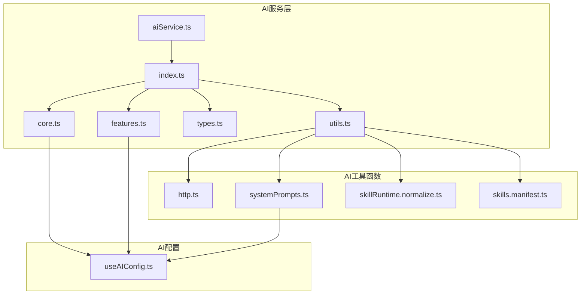
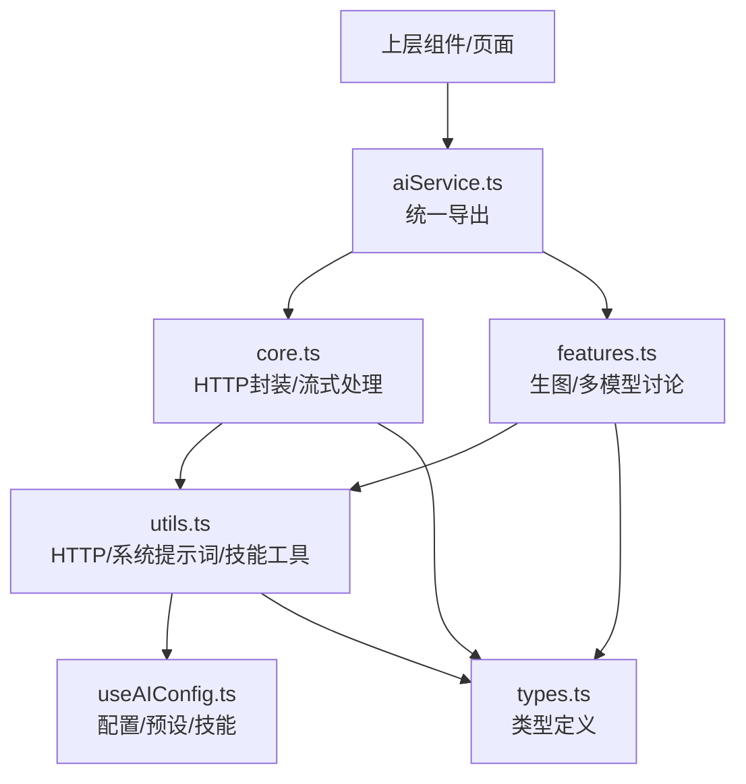
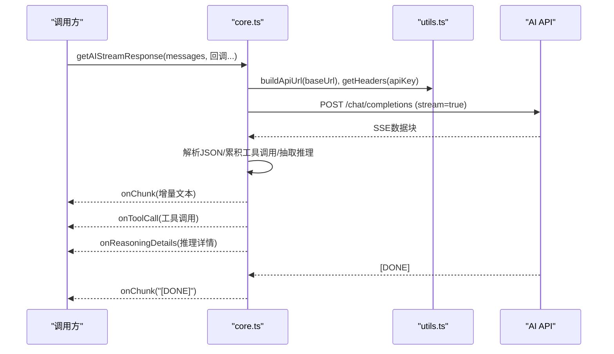
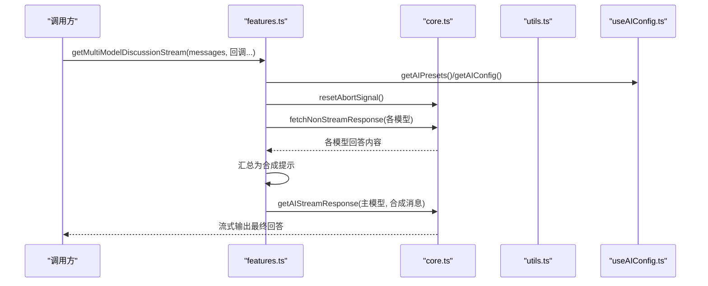
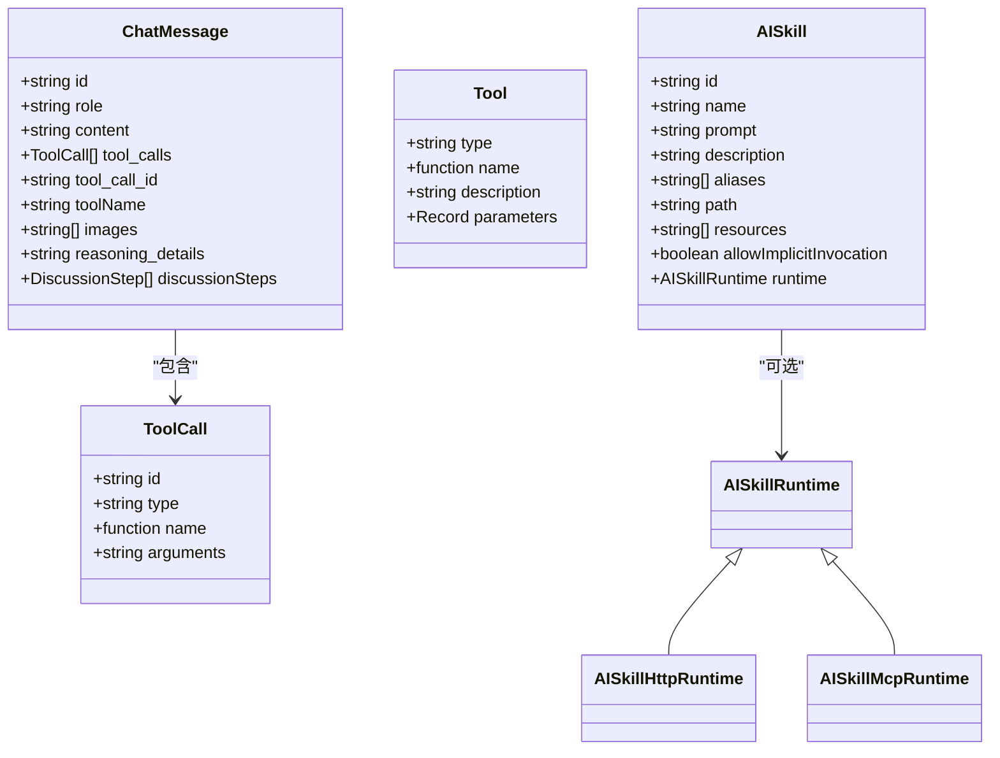
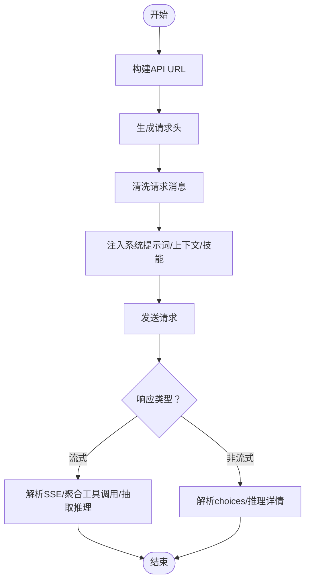
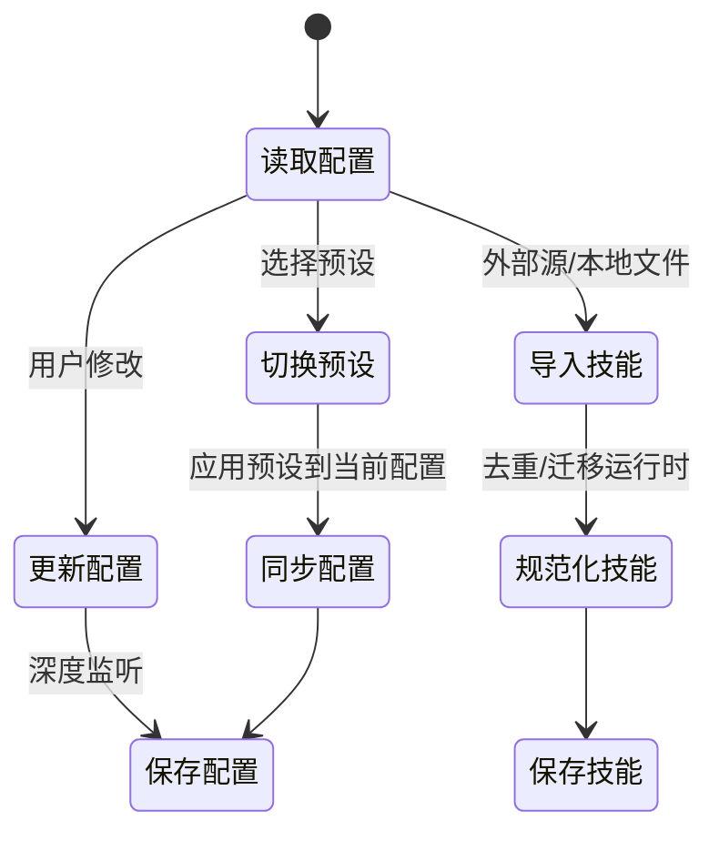
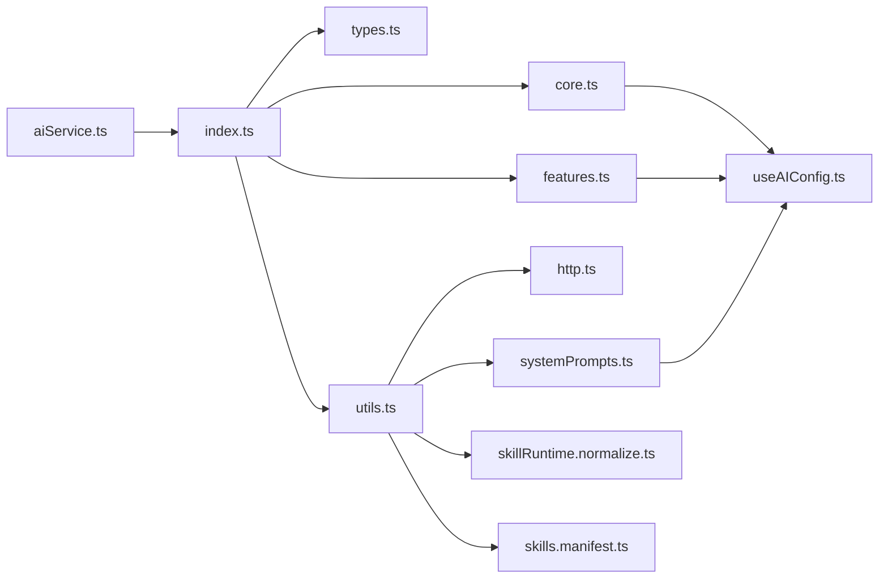

# AI服务层

<cite>
**本文档引用的文件**
- [aiService.ts](file://apps/frontend/src/features/ai/services/aiService.ts)
- [core.ts](file://apps/frontend/src/features/ai/services/core.ts)
- [features.ts](file://apps/frontend/src/features/ai/services/features.ts)
- [types.ts](file://apps/frontend/src/features/ai/services/types.ts)
- [utils.ts](file://apps/frontend/src/features/ai/services/utils.ts)
- [http.ts](file://apps/frontend/src/features/ai/services/utils/http.ts)
- [systemPrompts.ts](file://apps/frontend/src/features/ai/services/utils/systemPrompts.ts)
- [index.ts](file://apps/frontend/src/features/ai/services/index.ts)
- [useAIConfig.ts](file://apps/frontend/src/features/ai/composables/useAIConfig.ts)
- [skillRuntime.normalize.ts](file://apps/frontend/src/features/ai/services/utils/skillRuntime.normalize.ts)
- [skills.manifest.ts](file://apps/frontend/src/features/ai/services/utils/skills.manifest.ts)
</cite>

## 目录
1. [简介](#简介)
2. [项目结构](#项目结构)
3. [核心组件](#核心组件)
4. [架构总览](#架构总览)
5. [详细组件分析](#详细组件分析)
6. [依赖关系分析](#依赖关系分析)
7. [性能考量](#性能考量)
8. [故障排查指南](#故障排查指南)
9. [结论](#结论)
10. [附录](#附录)

## 简介
本文件面向前端AI服务层，系统化梳理并文档化以下能力：
- aiService主服务：统一导出入口，转发至拆分后的模块
- 核心服务core.ts：基础HTTP客户端、认证处理、请求拦截器、响应转换器、流式与非流式响应处理、中断控制
- 特性服务features.ts：生图请求、多模型协同讨论、结果汇总与二次流式合成
- 类型定义types.ts：接口规范、数据模型、枚举定义、泛型约束
- 工具函数utils.ts：HTTP构建、系统提示词注入、技能运行时工具、上下文压缩与安全边界
- 配置管理useAIConfig.ts：AI配置、预设、技能管理、外部源导入与校验
- 高级功能：流式响应处理、工具调用集成、上下文压缩、缓存策略（概念性说明）

## 项目结构
AI服务层位于前端应用的AI特性模块下，采用“按功能域划分”的组织方式，核心文件如下：
- services/ai/services：服务层（aiService.ts、core.ts、features.ts、types.ts、utils.ts、index.ts）
- services/ai/composables：配置与状态管理（useAIConfig.ts）
- services/ai/services/utils：工具函数集合（http.ts、systemPrompts.ts、skillRuntime.*、skills.*）

**图表来源**
- [aiService.ts:1-6](file://apps/frontend/src/features/ai/services/aiService.ts#L1-L6)
- [core.ts:1-442](file://apps/frontend/src/features/ai/services/core.ts#L1-L442)
- [features.ts:1-271](file://apps/frontend/src/features/ai/services/features.ts#L1-L271)
- [types.ts:1-232](file://apps/frontend/src/features/ai/services/types.ts#L1-L232)
- [utils.ts:1-10](file://apps/frontend/src/features/ai/services/utils.ts#L1-L10)
- [http.ts:1-19](file://apps/frontend/src/features/ai/services/utils/http.ts#L1-L19)
- [systemPrompts.ts:1-632](file://apps/frontend/src/features/ai/services/utils/systemPrompts.ts#L1-L632)
- [index.ts:1-9](file://apps/frontend/src/features/ai/services/index.ts#L1-L9)
- [useAIConfig.ts:1-1507](file://apps/frontend/src/features/ai/composables/useAIConfig.ts#L1-L1507)

**章节来源**
- [index.ts:1-9](file://apps/frontend/src/features/ai/services/index.ts#L1-L9)
- [aiService.ts:1-6](file://apps/frontend/src/features/ai/services/aiService.ts#L1-L6)

## 核心组件
- aiService.ts：作为统一导出入口，将模块拆分后的能力暴露给上层调用方，便于按需引入与维护。
- core.ts：提供HTTP请求封装、流式与非流式响应处理、工具调用聚合、推理内容抽取、请求中断与信号管理。
- features.ts：扩展能力，包括图像生成请求、多模型协同讨论与最终合成流式输出。
- types.ts：定义消息、工具、技能、推理细节、请求选项等核心类型，确保强类型约束。
- utils.ts：聚合工具函数，包括HTTP构建、系统提示词注入、技能运行时与清单处理等。
- useAIConfig.ts：集中管理AI配置、预设、技能、外部源导入与校验，提供响应式状态与持久化。

**章节来源**
- [aiService.ts:1-6](file://apps/frontend/src/features/ai/services/aiService.ts#L1-L6)
- [core.ts:1-442](file://apps/frontend/src/features/ai/services/core.ts#L1-L442)
- [features.ts:1-271](file://apps/frontend/src/features/ai/services/features.ts#L1-L271)
- [types.ts:1-232](file://apps/frontend/src/features/ai/services/types.ts#L1-L232)
- [utils.ts:1-10](file://apps/frontend/src/features/ai/services/utils.ts#L1-L10)
- [useAIConfig.ts:1-1507](file://apps/frontend/src/features/ai/composables/useAIConfig.ts#L1-L1507)

## 架构总览
AI服务层采用“分层+职责分离”设计：
- 服务层（core.ts、features.ts）负责API调用、参数构建、响应处理与业务流程编排
- 工具层（utils/*）提供可复用的HTTP构建、系统提示词注入、技能运行时与清单处理
- 配置层（useAIConfig.ts）提供全局AI配置、预设与技能管理
- 类型层（types.ts）提供强类型约束，贯穿请求/响应/消息/工具/技能等

**图表来源**
- [aiService.ts:1-6](file://apps/frontend/src/features/ai/services/aiService.ts#L1-L6)
- [core.ts:1-442](file://apps/frontend/src/features/ai/services/core.ts#L1-L442)
- [features.ts:1-271](file://apps/frontend/src/features/ai/services/features.ts#L1-L271)
- [utils.ts:1-10](file://apps/frontend/src/features/ai/services/utils.ts#L1-L10)
- [useAIConfig.ts:1-1507](file://apps/frontend/src/features/ai/composables/useAIConfig.ts#L1-L1507)
- [types.ts:1-232](file://apps/frontend/src/features/ai/services/types.ts#L1-L232)

## 详细组件分析

### 核心服务 core.ts
职责与能力：
- HTTP客户端与认证：通过工具函数构建URL与请求头，统一注入Authorization
- 请求参数构建：根据AI配置与调用选项组装请求体，支持工具调用、推理参数、思维模式
- 流式响应处理：解析SSE数据块，增量输出文本、聚合工具调用、抽取推理内容
- 非流式响应处理：构造非流式请求，解析choices与推理详情
- 请求中断与信号管理：提供AbortController封装，支持重置与查询进行中状态
- 错误处理：对HTTP错误与解析异常进行捕获与友好提示

关键流程（流式响应）：

**图表来源**
- [core.ts:115-338](file://apps/frontend/src/features/ai/services/core.ts#L115-L338)
- [http.ts:3-14](file://apps/frontend/src/features/ai/services/utils/http.ts#L3-L14)
- [systemPrompts.ts:420-631](file://apps/frontend/src/features/ai/services/utils/systemPrompts.ts#L420-L631)

**章节来源**
- [core.ts:1-442](file://apps/frontend/src/features/ai/services/core.ts#L1-L442)
- [http.ts:1-19](file://apps/frontend/src/features/ai/services/utils/http.ts#L1-L19)
- [systemPrompts.ts:1-632](file://apps/frontend/src/features/ai/services/utils/systemPrompts.ts#L1-L632)

### 特性服务 features.ts
职责与能力：
- 图像生成：将文本与图片作为多模态内容提交，解析返回的图片URL列表
- 多模型协同讨论：并行拉取多个模型的非流式回答，汇总后由主模型进行二次合成与流式输出
- 讨论步骤管理：记录每个模型的回答状态与内容，支持中断与错误处理
- 统一使用AI配置与工具函数，保证一致性与可扩展性

关键流程（多模型讨论）：

**图表来源**
- [features.ts:124-270](file://apps/frontend/src/features/ai/services/features.ts#L124-L270)
- [core.ts:405-424](file://apps/frontend/src/features/ai/services/core.ts#L405-L424)
- [useAIConfig.ts:1490-1502](file://apps/frontend/src/features/ai/composables/useAIConfig.ts#L1490-L1502)

**章节来源**
- [features.ts:1-271](file://apps/frontend/src/features/ai/services/features.ts#L1-L271)
- [core.ts:405-424](file://apps/frontend/src/features/ai/services/core.ts#L405-L424)
- [useAIConfig.ts:1490-1502](file://apps/frontend/src/features/ai/composables/useAIConfig.ts#L1490-L1502)

### 类型定义 types.ts
涵盖范围：
- 推理细节、讨论步骤、工具调用/结果、工具定义
- 技能运行时（HTTP/MCP）、技能清单、技能可用性
- 教学评估与测验结构、结构化区块错误
- 聊天消息、请求选项、多模态内容、聊天补全消息

**图表来源**
- [types.ts:170-232](file://apps/frontend/src/features/ai/services/types.ts#L170-L232)

**章节来源**
- [types.ts:1-232](file://apps/frontend/src/features/ai/services/types.ts#L1-L232)

### 工具函数 utils.ts
- http.ts：构建API端点URL、生成请求头、生成随机ID
- systemPrompts.ts：系统提示词注入、教学进度摘要、记忆与上下文注入、文档与图片内容包装、消息内容清洗
- skillRuntime.normalize.ts：技能运行时规范化、HTTP/MCP运行时迁移、模板值绑定、密钥定义
- skills.manifest.ts：技能清单构建与解析（YAML Front Matter）

**图表来源**
- [http.ts:3-14](file://apps/frontend/src/features/ai/services/utils/http.ts#L3-L14)
- [systemPrompts.ts:397-418](file://apps/frontend/src/features/ai/services/utils/systemPrompts.ts#L397-L418)
- [systemPrompts.ts:420-631](file://apps/frontend/src/features/ai/services/utils/systemPrompts.ts#L420-L631)

**章节来源**
- [utils.ts:1-10](file://apps/frontend/src/features/ai/services/utils.ts#L1-L10)
- [http.ts:1-19](file://apps/frontend/src/features/ai/services/utils/http.ts#L1-L19)
- [systemPrompts.ts:1-632](file://apps/frontend/src/features/ai/services/utils/systemPrompts.ts#L1-L632)
- [skillRuntime.normalize.ts:1-367](file://apps/frontend/src/features/ai/services/utils/skillRuntime.normalize.ts#L1-L367)
- [skills.manifest.ts:1-105](file://apps/frontend/src/features/ai/services/utils/skills.manifest.ts#L1-L105)

### 配置管理 useAIConfig.ts
- AI配置（AIConfig）：模型、温度、系统提示、思维模式、讨论模式、上下文压缩、技能ID等
- 预设（AIPreset）：可复用的配置模板，支持切换与同步
- 技能管理：导入/导出、去重、别名与资源规范化、运行时迁移
- 外部源导入：可信域名校验、代理回退、SHA256校验、ZIP解包与清单提取
- 响应式状态与持久化：localStorage存储、深度监听与自动保存

**图表来源**
- [useAIConfig.ts:600-820](file://apps/frontend/src/features/ai/composables/useAIConfig.ts#L600-L820)
- [useAIConfig.ts:1209-1336](file://apps/frontend/src/features/ai/composables/useAIConfig.ts#L1209-L1336)

**章节来源**
- [useAIConfig.ts:1-1507](file://apps/frontend/src/features/ai/composables/useAIConfig.ts#L1-L1507)

## 依赖关系分析
- aiService.ts 依赖 services/index.ts 进行模块导出
- core.ts 依赖 utils/http.ts 与 utils/systemPrompts.ts，并消费 useAIConfig.ts 提供的全局配置
- features.ts 依赖 core.ts 与 useAIConfig.ts，组合多模型讨论与生图能力
- utils.ts 聚合 http.ts、systemPrompts.ts、skillRuntime.*、skills.*
- types.ts 为所有模块提供类型约束

**图表来源**
- [aiService.ts:1-6](file://apps/frontend/src/features/ai/services/aiService.ts#L1-L6)
- [index.ts:1-9](file://apps/frontend/src/features/ai/services/index.ts#L1-L9)
- [core.ts:1-442](file://apps/frontend/src/features/ai/services/core.ts#L1-L442)
- [features.ts:1-271](file://apps/frontend/src/features/ai/services/features.ts#L1-L271)
- [utils.ts:1-10](file://apps/frontend/src/features/ai/services/utils.ts#L1-L10)
- [http.ts:1-19](file://apps/frontend/src/features/ai/services/utils/http.ts#L1-L19)
- [systemPrompts.ts:1-632](file://apps/frontend/src/features/ai/services/utils/systemPrompts.ts#L1-L632)
- [skillRuntime.normalize.ts:1-367](file://apps/frontend/src/features/ai/services/utils/skillRuntime.normalize.ts#L1-L367)
- [skills.manifest.ts:1-105](file://apps/frontend/src/features/ai/services/utils/skills.manifest.ts#L1-L105)
- [useAIConfig.ts:1-1507](file://apps/frontend/src/features/ai/composables/useAIConfig.ts#L1-L1507)

**章节来源**
- [index.ts:1-9](file://apps/frontend/src/features/ai/services/index.ts#L1-L9)
- [utils.ts:1-10](file://apps/frontend/src/features/ai/services/utils.ts#L1-L10)

## 性能考量
- 流式处理：基于ReadableStream Reader逐行解析，避免一次性缓冲大块数据，降低内存峰值
- 工具调用聚合：使用Map按索引累积，减少重复对象创建
- 请求中断：AbortController按需创建与复用，避免并发请求相互干扰
- 内容清洗：对多模态内容与工具调用进行严格校验与裁剪，减少无效负载
- 上下文注入：按需拼接系统提示词与记忆片段，避免超长提示导致延迟与成本上升
- 缓存策略：当前以localStorage为主，建议在上层组件结合业务场景增加请求级缓存与失效策略（概念性建议）

## 故障排查指南
常见问题与定位要点：
- 流式响应无输出
  - 检查SSE数据格式与[DONE]标记，确认解析逻辑与回调触发
  - 核对工具调用索引聚合是否完整，必要时在回调中补充兜底
- 工具调用未触发
  - 确认请求体中tools与tool_choice字段已正确注入
  - 检查delta.tool_calls解析与累积逻辑
- 推理内容缺失
  - 校验不同模型的推理字段差异（reasoning_details、reasoning、reasoning_content）
  - 确认resolveReasoningDetails的候选顺序与优先级
- HTTP错误
  - 核对Authorization头与API Key有效性
  - 检查buildApiUrl与baseUrl末尾斜杠处理
- 多模型讨论异常
  - 确认预设有效性与主模型ID存在
  - 检查并行请求的中断与错误状态传播
- 技能运行时问题
  - 校验运行时规范化与模板值绑定
  - 确认外部源可信域名与SHA256校验

**章节来源**
- [core.ts:115-338](file://apps/frontend/src/features/ai/services/core.ts#L115-L338)
- [features.ts:124-270](file://apps/frontend/src/features/ai/services/features.ts#L124-L270)
- [http.ts:3-14](file://apps/frontend/src/features/ai/services/utils/http.ts#L3-L14)
- [systemPrompts.ts:420-631](file://apps/frontend/src/features/ai/services/utils/systemPrompts.ts#L420-L631)
- [skillRuntime.normalize.ts:335-367](file://apps/frontend/src/features/ai/services/utils/skillRuntime.normalize.ts#L335-L367)

## 结论
AI服务层通过清晰的分层与职责划分，提供了稳定、可扩展的AI能力封装：
- 核心服务覆盖HTTP、流式与非流式响应、工具调用与推理内容处理
- 特性服务扩展了生图与多模型讨论等高级能力
- 工具函数与类型定义保障了跨模块的一致性与可维护性
- 配置管理提供了灵活的预设与技能体系，支持外部源导入与安全校验

建议在上层组件中结合业务需求完善缓存与重试策略，并持续优化上下文注入与消息清洗逻辑以提升性能与稳定性。

## 附录
- 统一导出入口：services/index.ts
- AI服务入口：services/ai/services/aiService.ts
- 关键流程参考：流式响应与多模型讨论序列图