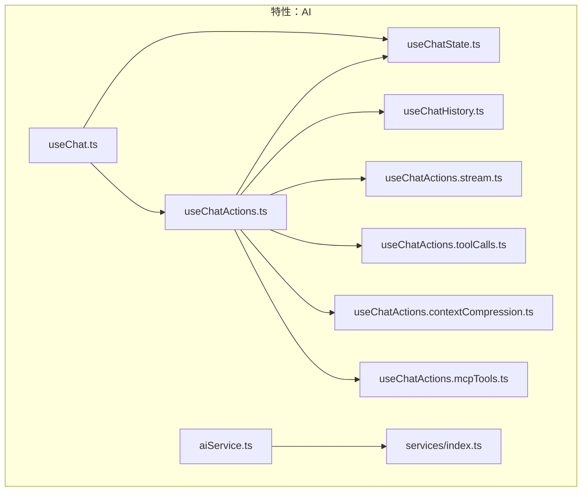
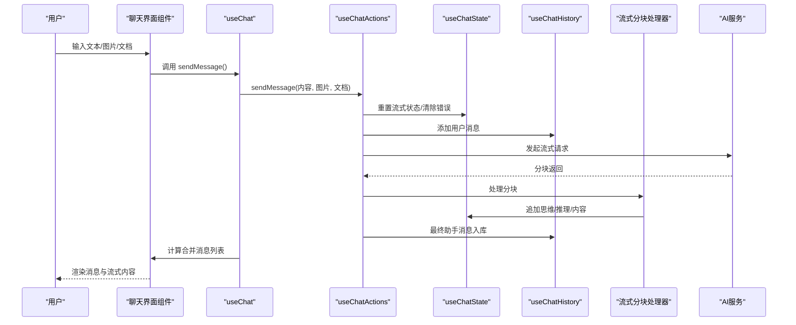
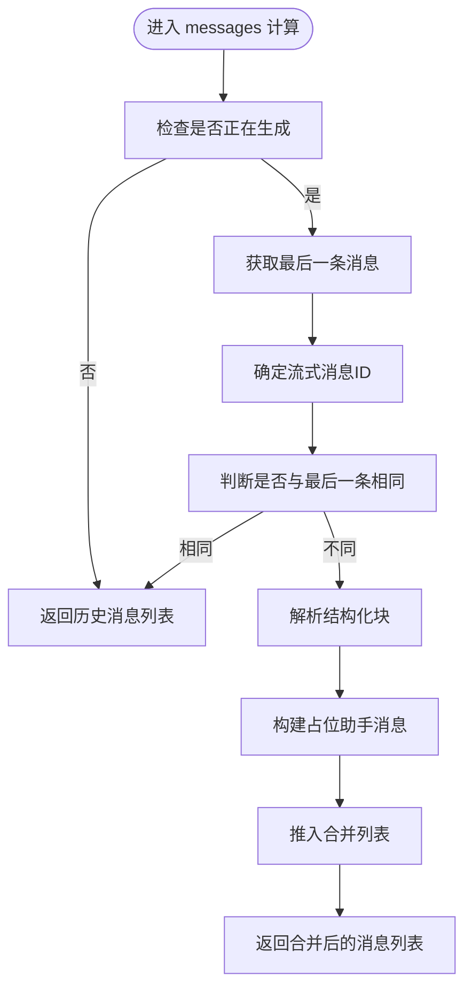
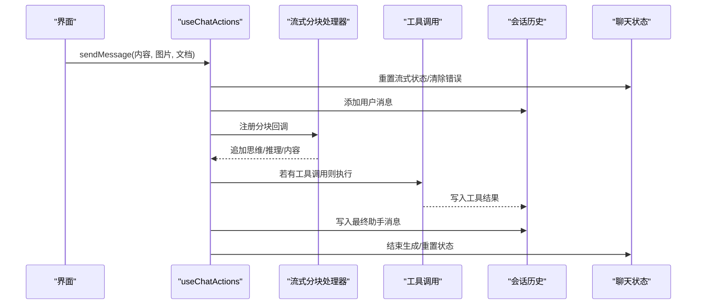
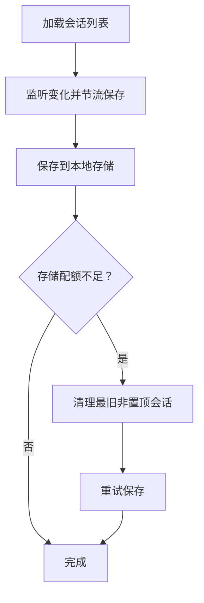
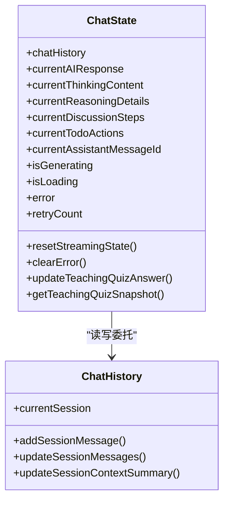
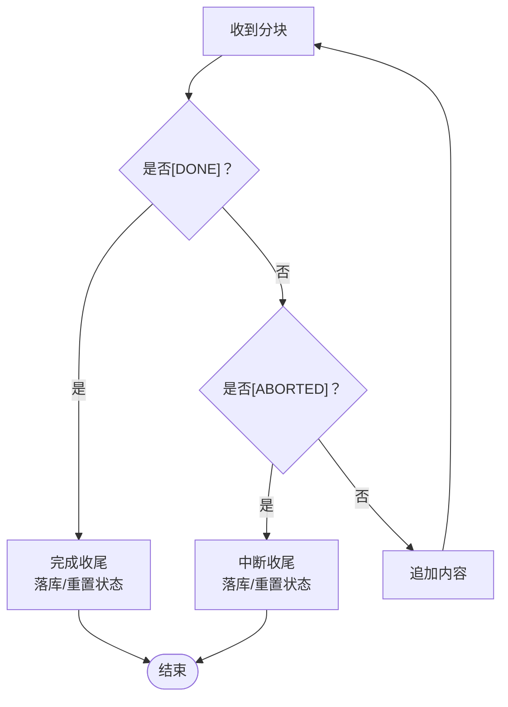
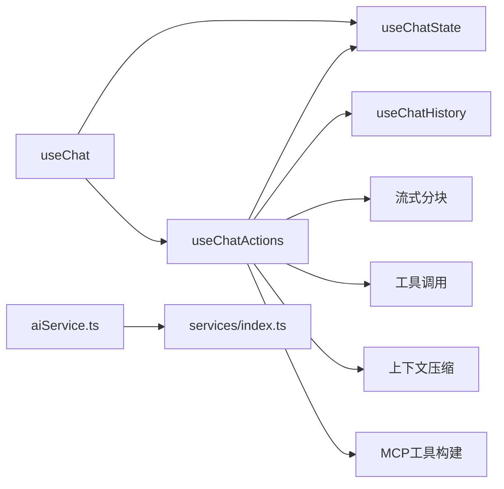

# 聊天核心逻辑

<cite>
**本文引用的文件**   
- [useChat.ts](file://apps/frontend/src/features/ai/composables/useChat.ts)
- [useChatActions.ts](file://apps/frontend/src/features/ai/composables/useChatActions.ts)
- [useChatHistory.ts](file://apps/frontend/src/features/ai/composables/useChatHistory.ts)
- [useChatState.ts](file://apps/frontend/src/features/ai/composables/useChatState.ts)
- [useChatActions.stream.ts](file://apps/frontend/src/features/ai/composables/useChatActions.stream.ts)
- [useChatActions.toolCalls.ts](file://apps/frontend/src/features/ai/composables/useChatActions.toolCalls.ts)
- [useChatActions.contextCompression.ts](file://apps/frontend/src/features/ai/composables/useChatActions.contextCompression.ts)
- [useChatActions.mcpTools.ts](file://apps/frontend/src/features/ai/composables/useChatActions.mcpTools.ts)
- [aiService.ts](file://apps/frontend/src/features/ai/services/aiService.ts)
- [index.ts](file://apps/frontend/src/features/ai/services/index.ts)
</cite>

## 目录
1. [引言](#引言)
2. [项目结构](#项目结构)
3. [核心组件](#核心组件)
4. [架构总览](#架构总览)
5. [详细组件分析](#详细组件分析)
6. [依赖关系分析](#依赖关系分析)
7. [性能考量](#性能考量)
8. [故障排查指南](#故障排查指南)
9. [结论](#结论)
10. [附录](#附录)

## 引言
本文件系统性梳理前端AI聊天功能的核心逻辑，围绕以下关键能力展开：
- useChat 组合式函数：消息状态管理、发送流程控制、生成状态跟踪、错误处理机制
- 聊天动作处理器 useChatActions：消息发送、重新生成、删除、编辑、批量操作、工具调用、流式处理、上下文压缩
- 聊天历史管理 useChatHistory：会话创建、切换、持久化、清理策略
- 聊天状态管理 useChatState：全局状态同步、响应式更新、性能优化
- 关键技术点：WebSocket连接管理、流式响应处理、并发控制、内存管理

## 项目结构
本项目采用“特性域+组合式函数”的组织方式，AI聊天相关代码集中在 apps/frontend/src/features/ai 下，按职责划分为：
- composables：可复用的组合式逻辑（useChat、useChatActions、useChatHistory、useChatState 等）
- services：AI服务封装与类型定义（aiService.ts 转发至 index.ts）
- components：UI组件（与聊天交互相关）

图表来源
- [useChat.ts:1-119](file://apps/frontend/src/features/ai/composables/useChat.ts#L1-L119)
- [useChatActions.ts:1-492](file://apps/frontend/src/features/ai/composables/useChatActions.ts#L1-L492)
- [useChatHistory.ts:1-479](file://apps/frontend/src/features/ai/composables/useChatHistory.ts#L1-L479)
- [useChatState.ts:1-144](file://apps/frontend/src/features/ai/composables/useChatState.ts#L1-L144)
- [useChatActions.stream.ts:1-269](file://apps/frontend/src/features/ai/composables/useChatActions.stream.ts#L1-L269)
- [useChatActions.toolCalls.ts:1-164](file://apps/frontend/src/features/ai/composables/useChatActions.toolCalls.ts#L1-L164)
- [useChatActions.contextCompression.ts:1-263](file://apps/frontend/src/features/ai/composables/useChatActions.contextCompression.ts#L1-L263)
- [useChatActions.mcpTools.ts:1-50](file://apps/frontend/src/features/ai/composables/useChatActions.mcpTools.ts#L1-L50)
- [aiService.ts:1-6](file://apps/frontend/src/features/ai/services/aiService.ts#L1-L6)
- [index.ts:1-9](file://apps/frontend/src/features/ai/services/index.ts#L1-L9)

章节来源
- [useChat.ts:1-119](file://apps/frontend/src/features/ai/composables/useChat.ts#L1-L119)
- [useChatActions.ts:1-492](file://apps/frontend/src/features/ai/composables/useChatActions.ts#L1-L492)
- [useChatHistory.ts:1-479](file://apps/frontend/src/features/ai/composables/useChatHistory.ts#L1-L479)
- [useChatState.ts:1-144](file://apps/frontend/src/features/ai/composables/useChatState.ts#L1-L144)
- [useChatActions.stream.ts:1-269](file://apps/frontend/src/features/ai/composables/useChatActions.stream.ts#L1-L269)
- [useChatActions.toolCalls.ts:1-164](file://apps/frontend/src/features/ai/composables/useChatActions.toolCalls.ts#L1-L164)
- [useChatActions.contextCompression.ts:1-263](file://apps/frontend/src/features/ai/composables/useChatActions.contextCompression.ts#L1-L263)
- [useChatActions.mcpTools.ts:1-50](file://apps/frontend/src/features/ai/composables/useChatActions.mcpTools.ts#L1-L50)
- [aiService.ts:1-6](file://apps/frontend/src/features/ai/services/aiService.ts#L1-L6)
- [index.ts:1-9](file://apps/frontend/src/features/ai/services/index.ts#L1-L9)

## 核心组件
- useChat：聚合状态与动作，负责将聊天历史与流式响应合并为最终消息列表，并提供删除消息等便捷方法
- useChatActions：核心业务动作集合，包含发送消息、图片生成、停止生成、清空历史、重新生成、编辑重发、手动添加消息对、工具调用、流式分块处理、上下文压缩、MCP 工具构建等
- useChatHistory：会话生命周期管理，支持创建、切换、置顶、重命名、删除、清空；持久化到本地存储并带节流与配额溢出清理
- useChatState：全局聊天状态（生成中、错误、思维内容、推理细节、讨论步骤、待办动作等），与当前会话绑定，监听会话切换重置流式状态

章节来源
- [useChat.ts:21-119](file://apps/frontend/src/features/ai/composables/useChat.ts#L21-L119)
- [useChatActions.ts:40-492](file://apps/frontend/src/features/ai/composables/useChatActions.ts#L40-L492)
- [useChatHistory.ts:274-479](file://apps/frontend/src/features/ai/composables/useChatHistory.ts#L274-L479)
- [useChatState.ts:41-144](file://apps/frontend/src/features/ai/composables/useChatState.ts#L41-L144)

## 架构总览
下图展示从用户输入到消息渲染的关键交互链路，以及状态与动作之间的耦合关系。

图表来源
- [useChat.ts:40-85](file://apps/frontend/src/features/ai/composables/useChat.ts#L40-L85)
- [useChatActions.ts:147-372](file://apps/frontend/src/features/ai/composables/useChatActions.ts#L147-L372)
- [useChatActions.stream.ts:202-268](file://apps/frontend/src/features/ai/composables/useChatActions.stream.ts#L202-L268)
- [useChatState.ts:44-70](file://apps/frontend/src/features/ai/composables/useChatState.ts#L44-L70)
- [useChatHistory.ts:346-352](file://apps/frontend/src/features/ai/composables/useChatHistory.ts#L346-L352)

## 详细组件分析

### useChat 组合式函数
- 职责
  - 将 chatHistory 与当前流式响应合并，生成最终 messages 列表
  - 在 isGenerating=true 时，基于 currentAIResponse 等状态动态插入一条“正在生成”的助手消息
  - 提供 deleteMessage 删除消息（含联动清理待办变更）
- 关键点
  - 通过 parseAssistantBlocks 解析结构化块（待办、测验、评估、错误等），并注入到消息对象
  - 仅在流式结束瞬间避免重复插入
  - 对 todo 助手开关进行条件注入
- 性能与复杂度
  - 合并计算为 O(n)，其中 n 为历史消息数量
  - 插入流式占位消息为 O(1) 操作

图表来源
- [useChat.ts:40-85](file://apps/frontend/src/features/ai/composables/useChat.ts#L40-L85)
- [useChat.ts:50-57](file://apps/frontend/src/features/ai/composables/useChat.ts#L50-L57)

章节来源
- [useChat.ts:21-119](file://apps/frontend/src/features/ai/composables/useChat.ts#L21-L119)

### useChatActions 动作处理器
- 职责
  - 发送消息：构建用户消息、触发流式请求、处理分块、最终落库
  - 图片生成：短路径分支，直接调用图片接口并落库
  - 停止生成：中止当前请求
  - 清空历史：新建会话、清理待办、重置流式状态、清除错误
  - 重新生成：回溯至上一用户消息，重新发起
  - 编辑并重发：截断历史，替换指定消息后重新发送
  - 手动添加消息对：便于演示或调试
  - 工具调用：解析并执行本地/远程工具，将结果作为 tool 消息写入历史
  - 流式分块处理：统一的分块处理器，负责追加内容、完成/中断收尾
  - 上下文压缩：根据字符预算与摘要，裁剪历史并增量更新摘要
  - MCP 工具构建：将远端工具映射为AI可用的 function 工具
- 并发与重试
  - 通过 isGenerating 控制并发
  - 最多重试次数为常量，指数退避由外层逻辑保证
- 错误处理
  - 统一设置 error，必要时触发重试
  - 对图片生成的特定错误进行本地化提示

图表来源
- [useChatActions.ts:147-372](file://apps/frontend/src/features/ai/composables/useChatActions.ts#L147-L372)
- [useChatActions.stream.ts:202-268](file://apps/frontend/src/features/ai/composables/useChatActions.stream.ts#L202-L268)
- [useChatActions.toolCalls.ts:25-164](file://apps/frontend/src/features/ai/composables/useChatActions.toolCalls.ts#L25-L164)

章节来源
- [useChatActions.ts:40-492](file://apps/frontend/src/features/ai/composables/useChatActions.ts#L40-L492)
- [useChatActions.stream.ts:1-269](file://apps/frontend/src/features/ai/composables/useChatActions.stream.ts#L1-L269)
- [useChatActions.toolCalls.ts:1-164](file://apps/frontend/src/features/ai/composables/useChatActions.toolCalls.ts#L1-L164)
- [useChatActions.contextCompression.ts:142-262](file://apps/frontend/src/features/ai/composables/useChatActions.contextCompression.ts#L142-L262)
- [useChatActions.mcpTools.ts:26-49](file://apps/frontend/src/features/ai/composables/useChatActions.mcpTools.ts#L26-L49)

### useChatHistory 会话管理
- 职责
  - 会话创建、切换、置顶、重命名、删除、清空
  - 自动标题：当第一条用户消息到达时，自动以内容作为标题
  - 上下文摘要：维护摘要文本及截止消息ID，支持增量更新
  - 持久化：localStorage 节流保存，带配额溢出清理策略
  - 事件同步：监听 storage 事件与其他作用域变更，保持一致性
- 数据模型
  - ChatSession：包含消息数组、摘要、置顶标记、时间戳等
- 策略
  - 排序优先置顶，其次按更新时间倒序
  - 新建会话立即保存，删除会话后回退到上一个激活或最近会话
  - 存储配额不足时，按规则清理最旧非置顶会话

图表来源
- [useChatHistory.ts:71-231](file://apps/frontend/src/features/ai/composables/useChatHistory.ts#L71-L231)
- [useChatHistory.ts:164-205](file://apps/frontend/src/features/ai/composables/useChatHistory.ts#L164-L205)

章节来源
- [useChatHistory.ts:13-479](file://apps/frontend/src/features/ai/composables/useChatHistory.ts#L13-L479)

### useChatState 聊天状态
- 职责
  - 维护全局聊天状态：生成中、加载中、错误、思维内容、推理细节、讨论步骤、待办动作、当前助手消息ID
  - 与当前会话绑定：chatHistory 的 getter/setter 委托给 useChatHistory
  - 会话切换时重置流式状态并清除错误
  - 教学模式答题：支持更新/快照教学测验答案
- 设计要点
  - 使用 ref/ref 记录状态，computed 包装 chatHistory 实现读写委托
  - 通过 watch 监听会话ID变化，确保跨会话切换状态一致

图表来源
- [useChatState.ts:44-51](file://apps/frontend/src/features/ai/composables/useChatState.ts#L44-L51)
- [useChatHistory.ts:346-352](file://apps/frontend/src/features/ai/composables/useChatHistory.ts#L346-L352)

章节来源
- [useChatState.ts:1-144](file://apps/frontend/src/features/ai/composables/useChatState.ts#L1-L144)
- [useChatHistory.ts:274-479](file://apps/frontend/src/features/ai/composables/useChatHistory.ts#L274-L479)

### 流式响应处理与工具调用
- 流式分块处理
  - createStreamChunkHandler：接收分块，追加内容；遇到 [DONE] 完成落库并重置状态；遇到 [ABORTED] 写入中断消息并重置
  - finalizeCompletedResponse/finalizeAbortedResponse：统一封装完成/中断收尾逻辑
- 工具调用
  - executeToolCalls：解析参数、执行本地/远程工具、写入 tool 消息；对超长结果进行截断
  - buildAiToolsFromMcpTools：将远端工具映射为AI可用的 function 工具，建立名称到服务器工具的查找表
- 上下文压缩
  - createContextCompression：根据字符预算裁剪历史，格式化摘要输入，后台增量更新摘要，避免重复压缩

图表来源
- [useChatActions.stream.ts:222-268](file://apps/frontend/src/features/ai/composables/useChatActions.stream.ts#L222-L268)

章节来源
- [useChatActions.stream.ts:1-269](file://apps/frontend/src/features/ai/composables/useChatActions.stream.ts#L1-L269)
- [useChatActions.toolCalls.ts:1-164](file://apps/frontend/src/features/ai/composables/useChatActions.toolCalls.ts#L1-L164)
- [useChatActions.mcpTools.ts:1-50](file://apps/frontend/src/features/ai/composables/useChatActions.mcpTools.ts#L1-L50)
- [useChatActions.contextCompression.ts:1-263](file://apps/frontend/src/features/ai/composables/useChatActions.contextCompression.ts#L1-L263)

## 依赖关系分析
- 组件内聚与耦合
  - useChat 聚合 useChatState 与 useChatActions，低耦合高内聚
  - useChatActions 依赖 useChatState/useChatHistory/useChatMemory/useAIConfig/useTodoStore/useAuthStore，形成清晰的业务边界
  - useChatState 仅依赖 useChatHistory，保持最小依赖
  - useChatActions.stream/toolCalls/contextCompression/mcpTools 形成独立子模块，便于扩展与测试
- 外部依赖
  - aiService.ts 作为统一出口转发至 services/index.ts，便于按需拆分与维护

图表来源
- [useChat.ts:12-24](file://apps/frontend/src/features/ai/composables/useChat.ts#L12-L24)
- [useChatActions.ts:13-33](file://apps/frontend/src/features/ai/composables/useChatActions.ts#L13-L33)
- [aiService.ts:5](file://apps/frontend/src/features/ai/services/aiService.ts#L5)
- [index.ts:5-9](file://apps/frontend/src/features/ai/services/index.ts#L5-L9)

章节来源
- [useChat.ts:12-24](file://apps/frontend/src/features/ai/composables/useChat.ts#L12-L24)
- [useChatActions.ts:13-33](file://apps/frontend/src/features/ai/composables/useChatActions.ts#L13-L33)
- [aiService.ts:1-6](file://apps/frontend/src/features/ai/services/aiService.ts#L1-L6)
- [index.ts:1-9](file://apps/frontend/src/features/ai/services/index.ts#L1-L9)

## 性能考量
- 响应式与计算
  - useChat 的 messages 使用 computed 合并历史与流式内容，避免重复渲染
  - useChatState 的 chatHistory 使用 getter/setter 委托，减少直接写入开销
- 存储与IO
  - useChatHistory 采用节流保存（默认 500ms），并在配额不足时主动清理最旧会话
  - 会话消息内容进行安全裁剪（文本、文档、图片URL过滤），降低存储压力
- 并发与重试
  - 通过 isGenerating 控制并发，避免竞态
  - 最多重试次数限制，防止无限重试导致资源耗尽
- 工具调用与内存
  - 工具结果截断，防止超大字符串占用内存
  - 上下文压缩后台异步执行，避免阻塞主线程

[本节为通用性能建议，不直接分析具体文件]

## 故障排查指南
- 常见问题定位
  - 发送无响应：检查 isGenerating 状态与 error 是否被设置；确认网络与鉴权状态
  - 流式内容不显示：确认流式分块处理器是否注册，[DONE]/[ABORTED] 是否正确处理
  - 会话丢失：检查 localStorage 是否被清理，确认节流保存是否生效
  - 工具调用失败：查看工具参数解析与远端工具映射是否正确
- 快速恢复
  - 清空历史：调用 clearHistory 重建会话并重置状态
  - 停止生成：调用 stopGenerating 中止当前请求
  - 重试：等待自动重试或手动再次发送

章节来源
- [useChatActions.ts:374-383](file://apps/frontend/src/features/ai/composables/useChatActions.ts#L374-L383)
- [useChatActions.stream.ts:222-268](file://apps/frontend/src/features/ai/composables/useChatActions.stream.ts#L222-L268)
- [useChatHistory.ts:164-205](file://apps/frontend/src/features/ai/composables/useChatHistory.ts#L164-L205)

## 结论
本聊天核心逻辑以组合式函数为核心，将状态、动作、历史与服务解耦，形成清晰的职责边界与可扩展架构。通过流式分块处理、上下文压缩、工具调用与会话持久化等关键技术，实现了高性能、可维护的AI聊天体验。建议在后续迭代中进一步完善工具调用的可观测性与错误恢复策略，并持续优化上下文压缩算法与存储清理策略。

[本节为总结性内容，不直接分析具体文件]

## 附录
- WebSocket 连接管理
  - 当前实现基于流式分块处理与工具调用，未显式使用 WebSocket；若未来接入实时通道，建议在流式分块处理器中增加连接状态管理与重连策略
- 并发控制
  - 通过 isGenerating 与 MAX_RETRIES 限制并发与重试次数，避免资源滥用
- 内存管理
  - 工具结果截断、上下文压缩、会话消息裁剪与配额清理共同保障内存健康

[本节为概念性补充，不直接分析具体文件]