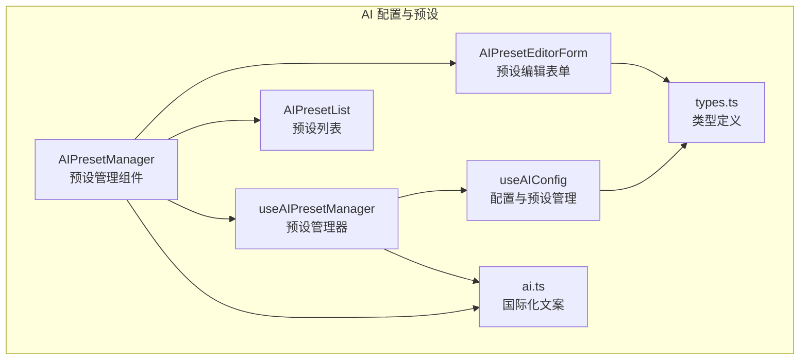
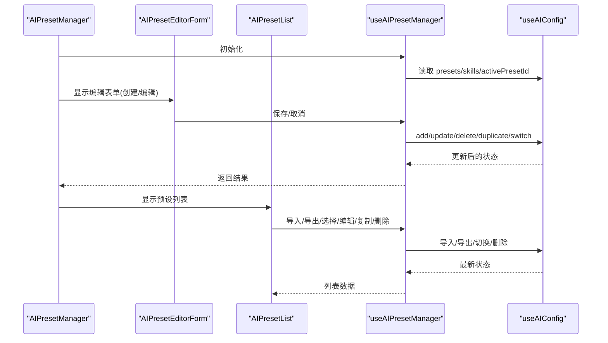
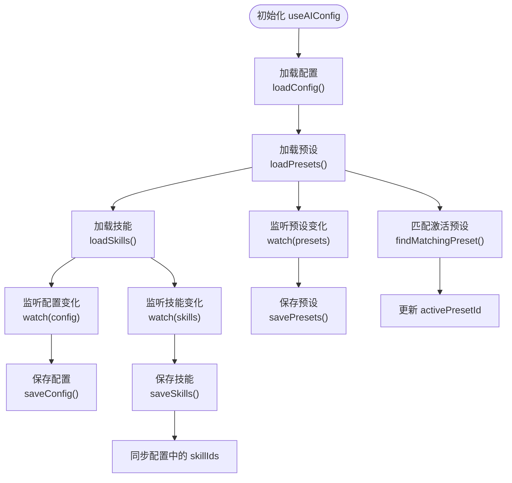
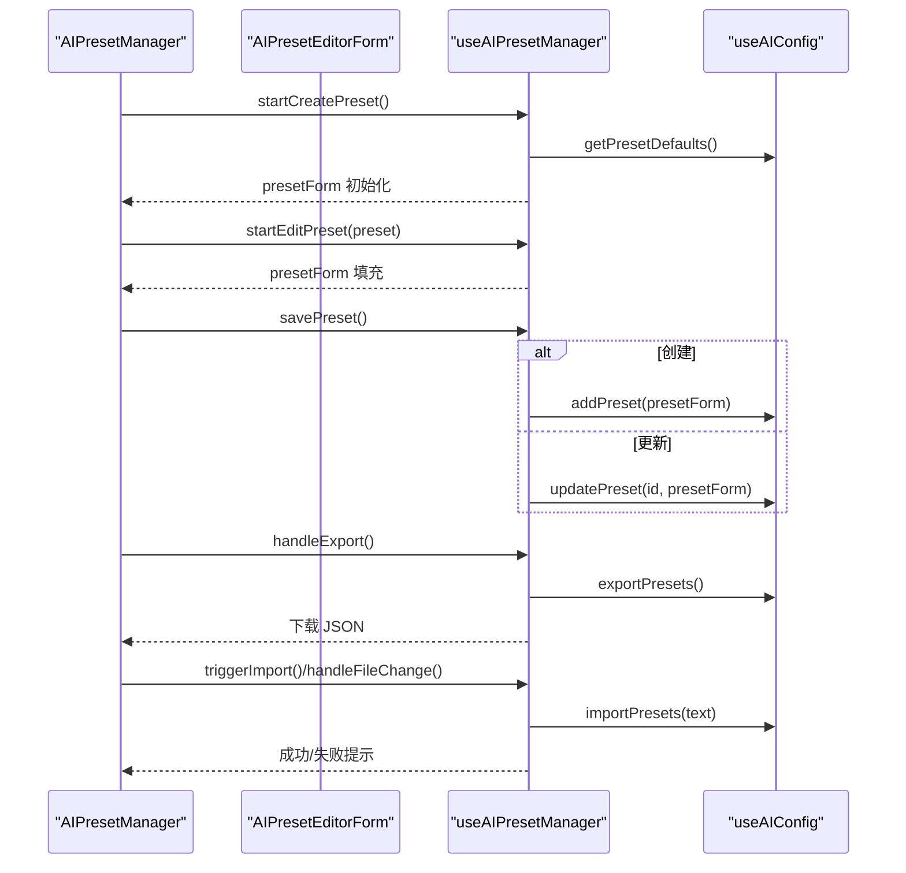
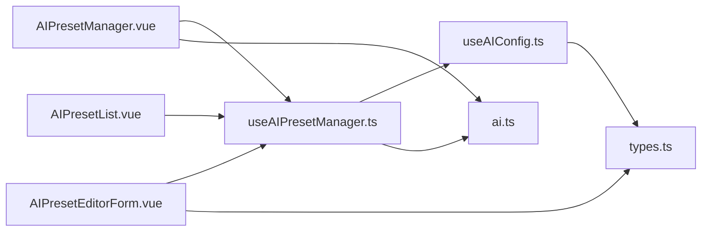

# 配置与预设管理

<cite>
**本文档引用的文件**
- [useAIConfig.ts](file://apps/frontend/src/features/ai/composables/useAIConfig.ts)
- [useAIPresetManager.ts](file://apps/frontend/src/features/ai/composables/useAIPresetManager.ts)
- [AIPresetManager.vue](file://apps/frontend/src/features/ai/components/AIPresetManager.vue)
- [AIPresetEditorForm.vue](file://apps/frontend/src/features/ai/components/AIPresetEditorForm.vue)
- [AIPresetList.vue](file://apps/frontend/src/features/ai/components/AIPresetList.vue)
- [types.ts](file://apps/frontend/src/features/ai/services/types.ts)
- [ai.ts](file://apps/frontend/src/i18n/locales/zh-CN/ai.ts)
</cite>

## 目录
1. [简介](#简介)
2. [项目结构](#项目结构)
3. [核心组件](#核心组件)
4. [架构总览](#架构总览)
5. [详细组件分析](#详细组件分析)
6. [依赖关系分析](#依赖关系分析)
7. [性能考量](#性能考量)
8. [故障排查指南](#故障排查指南)
9. [结论](#结论)
10. [附录](#附录)

## 简介
本技术文档围绕前端 AI 配置与预设管理能力，系统化阐述以下内容：
- useAIConfig 组合式函数：配置加载、实时更新、本地存储、默认值处理、技能与预设联动、外部技能源导入与校验。
- useAIPresetManager 管理器：预设创建、编辑、删除、复制、切换、导入导出、表单校验与防抖保存。
- 预设管理组件 AIPresetManager：用户界面、操作面板、批量管理、搜索过滤。
- 预设编辑表单 AIPresetEditorForm：参数配置、验证规则、模板选择、保存机制。
- 企业级能力：配置同步、版本管理、备份恢复、权限控制（基于本地存储与导入导出流程）。

## 项目结构
本功能位于前端应用的 AI 特性域，采用“组合式函数 + 组件”的分层设计：
- 组合式函数层：useAIConfig、useAIPresetManager 提供状态与业务逻辑。
- 组件层：AIPresetManager、AIPresetEditorForm、AIPresetList 提供 UI 与交互。
- 类型与国际化：types.ts 定义技能与配置类型，ai.ts 提供多语言文案。

图表来源
- [useAIConfig.ts:858-1488](file://apps/frontend/src/features/ai/composables/useAIConfig.ts#L858-L1488)
- [useAIPresetManager.ts:10-221](file://apps/frontend/src/features/ai/composables/useAIPresetManager.ts#L10-L221)
- [AIPresetManager.vue:1-78](file://apps/frontend/src/features/ai/components/AIPresetManager.vue#L1-L78)
- [AIPresetEditorForm.vue:1-253](file://apps/frontend/src/features/ai/components/AIPresetEditorForm.vue#L1-L253)
- [AIPresetList.vue:1-143](file://apps/frontend/src/features/ai/components/AIPresetList.vue#L1-L143)
- [types.ts:105-115](file://apps/frontend/src/features/ai/services/types.ts#L105-L115)
- [ai.ts:52-96](file://apps/frontend/src/i18n/locales/zh-CN/ai.ts#L52-L96)

章节来源
- [useAIConfig.ts:1-1507](file://apps/frontend/src/features/ai/composables/useAIConfig.ts#L1-L1507)
- [useAIPresetManager.ts:1-221](file://apps/frontend/src/features/ai/composables/useAIPresetManager.ts#L1-L221)
- [AIPresetManager.vue:1-78](file://apps/frontend/src/features/ai/components/AIPresetManager.vue#L1-L78)
- [AIPresetEditorForm.vue:1-253](file://apps/frontend/src/features/ai/components/AIPresetEditorForm.vue#L1-L253)
- [AIPresetList.vue:1-143](file://apps/frontend/src/features/ai/components/AIPresetList.vue#L1-L143)
- [types.ts:1-232](file://apps/frontend/src/features/ai/services/types.ts#L1-L232)
- [ai.ts:1-467](file://apps/frontend/src/i18n/locales/zh-CN/ai.ts#L1-L467)

## 核心组件
- useAIConfig：全局 AI 配置与预设、技能的集中管理，提供增删改查、导入导出、同步与校验。
- useAIPresetManager：预设管理器，封装表单状态、校验、防抖保存、导入导出、与 useAIConfig 的桥接。
- AIPresetManager：容器组件，协调表单与列表视图，暴露操作方法。
- AIPresetEditorForm：预设编辑表单，包含参数配置、验证规则、模板选择、保存机制。
- AIPresetList：预设列表，支持创建、导入、导出、选择、编辑、复制、删除等操作。

章节来源
- [useAIConfig.ts:858-1488](file://apps/frontend/src/features/ai/composables/useAIConfig.ts#L858-L1488)
- [useAIPresetManager.ts:10-221](file://apps/frontend/src/features/ai/composables/useAIPresetManager.ts#L10-L221)
- [AIPresetManager.vue:1-78](file://apps/frontend/src/features/ai/components/AIPresetManager.vue#L1-L78)
- [AIPresetEditorForm.vue:1-253](file://apps/frontend/src/features/ai/components/AIPresetEditorForm.vue#L1-L253)
- [AIPresetList.vue:1-143](file://apps/frontend/src/features/ai/components/AIPresetList.vue#L1-L143)

## 架构总览
整体采用“组合式函数 + 组件”分层架构：
- 组合式函数层：useAIConfig 管理配置、预设、技能，提供 CRUD、导入导出、同步与校验。
- 管理器层：useAIPresetManager 将组合式函数能力封装为 UI 友好的接口，提供表单状态、校验、防抖保存。
- 视图层：AIPresetManager 作为容器，调度 AIPresetEditorForm 与 AIPresetList；AIPresetEditorForm 负责编辑；AIPresetList 负责展示与批量操作。

图表来源
- [AIPresetManager.vue:1-78](file://apps/frontend/src/features/ai/components/AIPresetManager.vue#L1-L78)
- [AIPresetEditorForm.vue:1-253](file://apps/frontend/src/features/ai/components/AIPresetEditorForm.vue#L1-L253)
- [AIPresetList.vue:1-143](file://apps/frontend/src/features/ai/components/AIPresetList.vue#L1-L143)
- [useAIPresetManager.ts:10-221](file://apps/frontend/src/features/ai/composables/useAIPresetManager.ts#L10-L221)
- [useAIConfig.ts:858-1488](file://apps/frontend/src/features/ai/composables/useAIConfig.ts#L858-L1488)

## 详细组件分析

### useAIConfig 组合式函数
- 配置加载与默认值
  - 从 localStorage 加载配置，若不存在则回退到 DEFAULT_CONFIG。
  - 对数组字段进行规范化（去重、去空、排序比较）。
- 实时更新与本地存储
  - 通过 watch 监听配置、预设、技能与激活预设 ID 的变化，自动持久化到 localStorage。
- 预设匹配与激活
  - isConfigMatchPreset 用于判断当前配置与预设是否一致；findMatchingPreset 用于查找匹配的预设 ID 并同步 activePresetId。
- 预设 CRUD 与同步
  - addPreset、updatePreset、deletePreset、duplicatePreset、switchPreset、syncConfigToPreset。
  - updatePreset 在更新当前激活预设时，同步更新配置。
- 导入导出
  - exportPresets/exportSkills/importPresets/importSkills/importSkillsFromExternalSource 支持 JSON 与外部来源（含 SHA256 校验、ZIP 解包、HTML 拦截等）。
- 技能管理
  - addSkill/updateSkill/deleteSkill/duplicateSkill/toggleSkill/setSkillIds，与配置中的 skillIds 保持一致性。
- 外部技能源安全
  - buildExternalSkillSourceCandidates、isTrustedSkillSourceUrl、shouldPreferProxyForExternalSource、fetchExternalSourceViaProxy、decodeExternalSourceContentFromBytes、computeSha256 等保障来源可信与内容安全。

图表来源
- [useAIConfig.ts:649-821](file://apps/frontend/src/features/ai/composables/useAIConfig.ts#L649-L821)
- [useAIConfig.ts:892-911](file://apps/frontend/src/features/ai/composables/useAIConfig.ts#L892-L911)
- [useAIConfig.ts:1048-1112](file://apps/frontend/src/features/ai/composables/useAIConfig.ts#L1048-L1112)

章节来源
- [useAIConfig.ts:18-621](file://apps/frontend/src/features/ai/composables/useAIConfig.ts#L18-L621)
- [useAIConfig.ts:649-821](file://apps/frontend/src/features/ai/composables/useAIConfig.ts#L649-L821)
- [useAIConfig.ts:858-1488](file://apps/frontend/src/features/ai/composables/useAIConfig.ts#L858-L1488)

### useAIPresetManager 管理器
- 表单状态与校验
  - presetForm：包含预设的基本字段；nameError 基于预设名称重复与必填校验。
- 预设生命周期
  - startCreatePreset/startEditPreset：初始化表单；getPresetDefaults 从当前配置生成默认值。
  - savePreset：创建或更新预设；cancelEditPreset：取消编辑。
- 防抖保存
  - watch(presetForm) + debounce：编辑时自动保存更新，降低频繁写入。
- 批量操作
  - handleDeletePreset/handleDuplicatePreset：删除与复制。
  - switchPreset：切换到指定预设。
- 导入导出
  - triggerImport/handleFileChange：文件选择与文本读取；importPresets。
  - handleExport：导出为 JSON 文件并触发下载。

图表来源
- [useAIPresetManager.ts:80-197](file://apps/frontend/src/features/ai/composables/useAIPresetManager.ts#L80-L197)
- [useAIConfig.ts:916-958](file://apps/frontend/src/features/ai/composables/useAIConfig.ts#L916-L958)
- [useAIConfig.ts:1032-1112](file://apps/frontend/src/features/ai/composables/useAIConfig.ts#L1032-L1112)

章节来源
- [useAIPresetManager.ts:1-221](file://apps/frontend/src/features/ai/composables/useAIPresetManager.ts#L1-L221)

### 预设管理组件 AIPresetManager
- 协调视图：根据 isCreatingPreset/editingPreset 决定渲染 AIPresetEditorForm 或 AIPresetList。
- 暴露方法：对外暴露创建、编辑、保存、删除、取消等方法，便于父组件或路由层调用。
- 文件导入：隐藏的 fileInputRef 用于触发文件选择与读取。

章节来源
- [AIPresetManager.vue:1-78](file://apps/frontend/src/features/ai/components/AIPresetManager.vue#L1-L78)

### 预设编辑表单 AIPresetEditorForm
- 参数配置：包含名称、Base URL、API Key、模型、系统提示词、温度、技能选择等。
- 验证规则：名称必填且不可重复；API Key 可切换可见；技能选择支持多选。
- 保存机制：创建时禁用保存按钮直到名称通过校验；编辑时通过防抖自动保存。

章节来源
- [AIPresetEditorForm.vue:1-253](file://apps/frontend/src/features/ai/components/AIPresetEditorForm.vue#L1-L253)
- [ai.ts:52-96](file://apps/frontend/src/i18n/locales/zh-CN/ai.ts#L52-L96)

### 预设列表 AIPresetList
- 展示与操作：支持创建、导入、导出、选择、编辑、复制、删除。
- 激活态：当前激活预设以视觉高亮标识；未命名预设显示占位文案。
- 空态：无预设时显示引导文案。

章节来源
- [AIPresetList.vue:1-143](file://apps/frontend/src/features/ai/components/AIPresetList.vue#L1-L143)
- [ai.ts:168-173](file://apps/frontend/src/i18n/locales/zh-CN/ai.ts#L168-L173)

## 依赖关系分析
- 组件依赖
  - AIPresetManager 依赖 useAIPresetManager；useAIPresetManager 依赖 useAIConfig。
  - AIPresetEditorForm 与 AIPresetList 依赖 useAIPresetManager。
- 类型依赖
  - useAIConfig 与 AIPresetEditorForm/AIPresetList 依赖 types.ts 中的 AISkill/AIPreset/AIConfig 类型。
- 国际化依赖
  - 所有组件依赖 ai.ts 的文案键值，保证多语言一致性。

图表来源
- [AIPresetManager.vue:1-78](file://apps/frontend/src/features/ai/components/AIPresetManager.vue#L1-L78)
- [AIPresetEditorForm.vue:1-253](file://apps/frontend/src/features/ai/components/AIPresetEditorForm.vue#L1-L253)
- [AIPresetList.vue:1-143](file://apps/frontend/src/features/ai/components/AIPresetList.vue#L1-L143)
- [useAIPresetManager.ts:10-221](file://apps/frontend/src/features/ai/composables/useAIPresetManager.ts#L10-L221)
- [useAIConfig.ts:858-1488](file://apps/frontend/src/features/ai/composables/useAIConfig.ts#L858-L1488)
- [types.ts:105-115](file://apps/frontend/src/features/ai/services/types.ts#L105-L115)
- [ai.ts:52-96](file://apps/frontend/src/i18n/locales/zh-CN/ai.ts#L52-L96)

章节来源
- [useAIConfig.ts:858-1488](file://apps/frontend/src/features/ai/composables/useAIConfig.ts#L858-L1488)
- [useAIPresetManager.ts:10-221](file://apps/frontend/src/features/ai/composables/useAIPresetManager.ts#L10-L221)
- [AIPresetManager.vue:1-78](file://apps/frontend/src/features/ai/components/AIPresetManager.vue#L1-L78)
- [AIPresetEditorForm.vue:1-253](file://apps/frontend/src/features/ai/components/AIPresetEditorForm.vue#L1-L253)
- [AIPresetList.vue:1-143](file://apps/frontend/src/features/ai/components/AIPresetList.vue#L1-L143)
- [types.ts:105-115](file://apps/frontend/src/features/ai/services/types.ts#L105-L115)
- [ai.ts:52-96](file://apps/frontend/src/i18n/locales/zh-CN/ai.ts#L52-L96)

## 性能考量
- 响应式与持久化
  - 通过 watch 深度监听配置、预设、技能与激活 ID，避免重复写入；对技能序列化后写入，减少不必要的更新。
- 防抖保存
  - 编辑预设时使用防抖，降低频繁更新带来的性能压力。
- 外部技能源
  - 限制最大文件大小与归档大小，拦截 HTML 内容，计算 SHA256 校验，必要时走代理通道，确保安全性与性能平衡。
- 列表渲染
  - 预设列表使用网格布局与条件渲染，避免大量 DOM 渲染。

[本节为通用性能建议，不直接分析具体文件]

## 故障排查指南
- 预设导入失败
  - 检查 JSON 格式是否为数组；确认每项包含必要字段（名称、Base URL、模型）；查看控制台错误信息。
- 外部技能源安装失败
  - 确认来源 URL 是否为受信任主机；检查网络与 CORS；如需 SHA256 校验，确保格式正确。
- 预设切换无效
  - 确认 isConfigMatchPreset 匹配逻辑；检查 activePresetId 是否被正确更新。
- API Key 明文显示
  - 使用表单内置的“显示/隐藏”开关；避免在共享环境中泄露敏感信息。
- 本地存储异常
  - 清理浏览器 localStorage 中相关键值（如 ai-config、ai-presets、ai-active-preset）后重启应用。

章节来源
- [useAIPresetManager.ts:177-197](file://apps/frontend/src/features/ai/composables/useAIPresetManager.ts#L177-L197)
- [useAIConfig.ts:1218-1336](file://apps/frontend/src/features/ai/composables/useAIConfig.ts#L1218-L1336)
- [useAIConfig.ts:775-791](file://apps/frontend/src/features/ai/composables/useAIConfig.ts#L775-L791)

## 结论
本方案通过 useAIConfig 与 useAIPresetManager 的组合，实现了配置与预设的全生命周期管理：从加载、实时更新、本地持久化，到预设的创建、编辑、切换、导入导出，再到技能的导入与外部来源校验。配合 AIPresetManager 与 AIPresetEditorForm 的 UI 层，提供了良好的用户体验与企业级安全保障（来源校验、SHA256 校验、代理通道、防抖保存等）。

[本节为总结性内容，不直接分析具体文件]

## 附录
- 企业级功能建议
  - 配置同步：结合后端 API，将本地配置与云端账号同步，支持多端一致。
  - 版本管理：为预设与技能增加版本号与变更日志，支持回滚与对比。
  - 备份恢复：提供一键导出与导入功能，支持增量备份与差异恢复。
  - 权限控制：基于用户角色与租户隔离，限制敏感字段的可见与编辑权限。

[本节为通用建议，不直接分析具体文件]