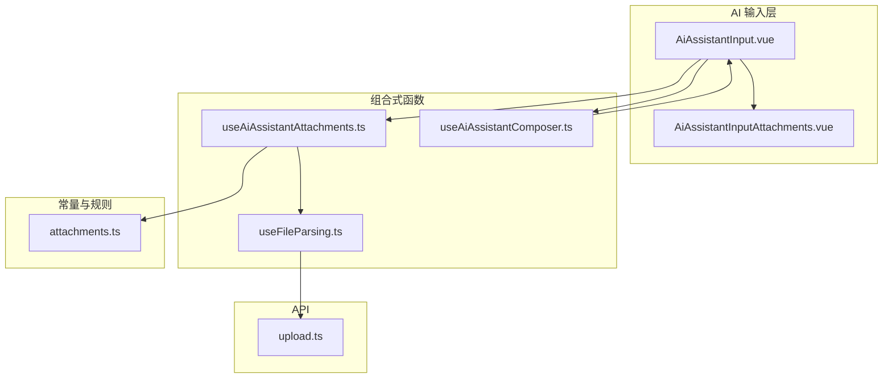
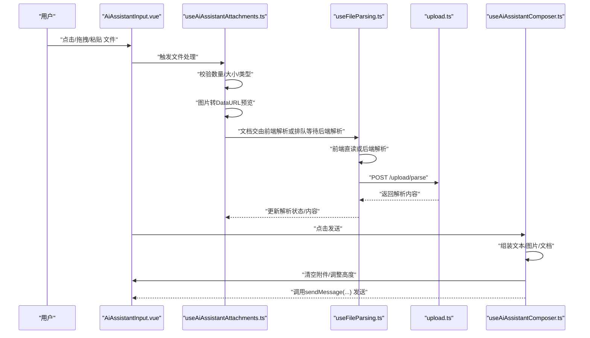
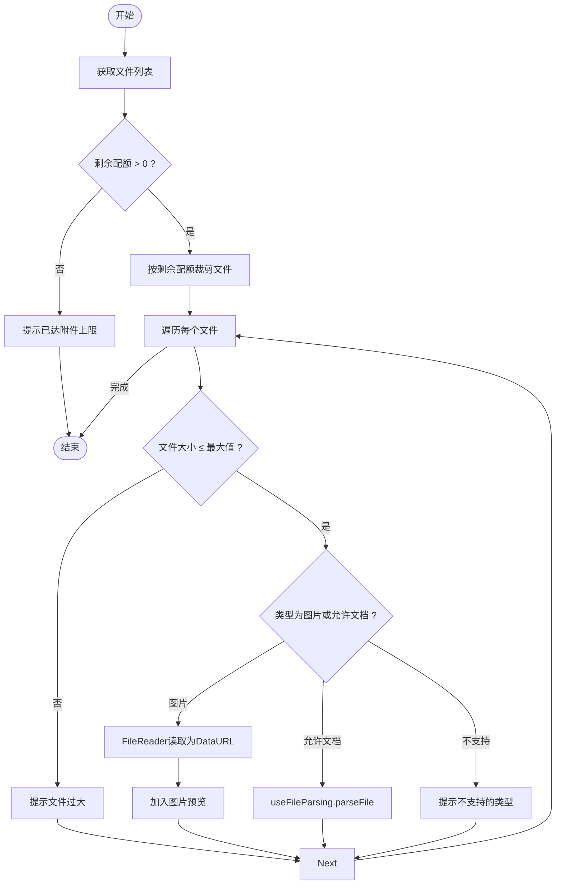
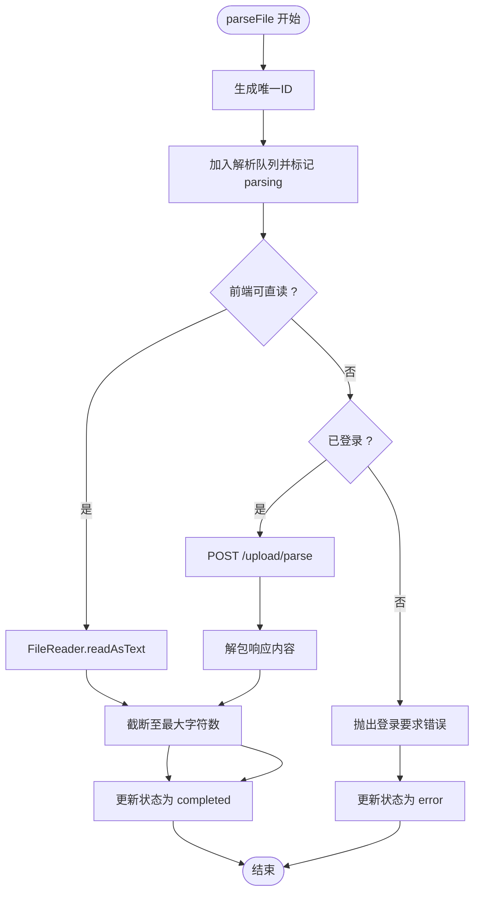
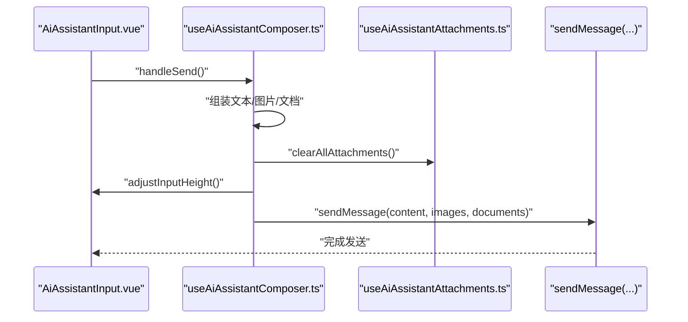
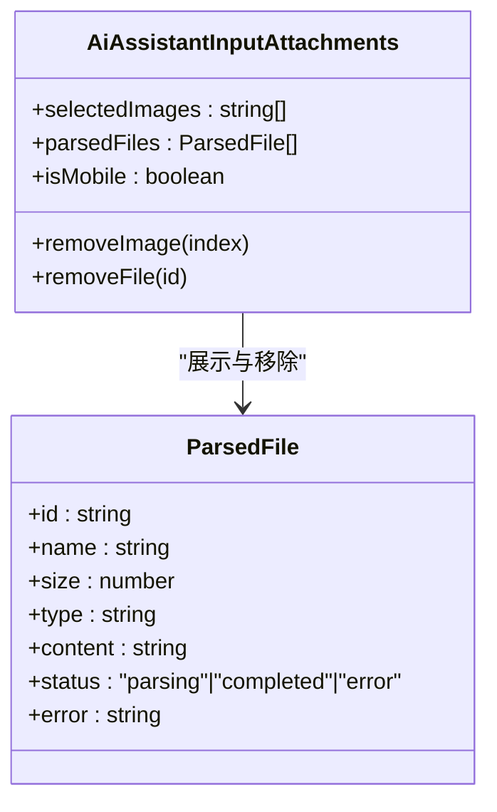
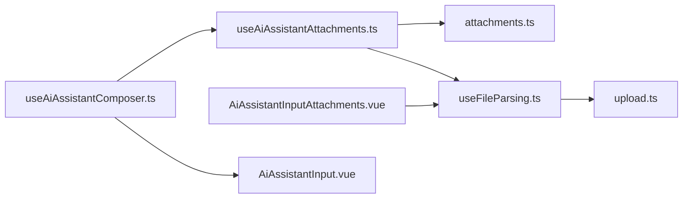

# 附件与工具集成

<cite>
**本文引用的文件**
- [useAiAssistantAttachments.ts](file://apps/frontend/src/features/ai/composables/useAiAssistantAttachments.ts)
- [attachments.ts](file://apps/frontend/src/features/ai/constants/attachments.ts)
- [useFileParsing.ts](file://apps/frontend/src/composables/useFileParsing.ts)
- [upload.ts](file://apps/frontend/src/api/upload.ts)
- [AiAssistantInputAttachments.vue](file://apps/frontend/src/features/ai/components/AiAssistantInputAttachments.vue)
- [AiAssistantInput.vue](file://apps/frontend/src/features/ai/components/AiAssistantInput.vue)
- [useAiAssistantComposer.ts](file://apps/frontend/src/features/ai/composables/useAiAssistantComposer.ts)
</cite>

## 目录
1. [简介](#简介)
2. [项目结构](#项目结构)
3. [核心组件](#核心组件)
4. [架构总览](#架构总览)
5. [详细组件分析](#详细组件分析)
6. [依赖关系分析](#依赖关系分析)
7. [性能考量](#性能考量)
8. [故障排查指南](#故障排查指南)
9. [结论](#结论)
10. [附录](#附录)

## 简介
本文件聚焦于AI助手的“附件与工具集成”能力，系统性解析以下关键模块：
- 组合式函数 useAiAssistantAttachments：文件选择、拖拽上传、粘贴处理、格式验证、大小限制与批量控制
- 附件常量与规则 attachments.ts：支持的文件类型、最大文件大小、预览生成、安全检查
- 组合式函数 useAiAssistantComposer：输入内容组装、工具调用构建、上下文注入、参数序列化
- 附件输入组件 AiAssistantInputAttachments：文件列表展示、移除操作、批量处理、进度反馈
- 多模态输入支持、实时预览、错误处理、性能优化等关键特性

## 项目结构
围绕AI助手输入区域与附件处理的相关文件组织如下：
- 组合式函数：useAiAssistantAttachments、useFileParsing、useAiAssistantComposer
- 常量与规则：attachments.ts
- 组件：AiAssistantInput、AiAssistantInputAttachments
- API：upload.ts（后端解析接口）

图表来源
- [AiAssistantInput.vue:1-340](file://apps/frontend/src/features/ai/components/AiAssistantInput.vue#L1-L340)
- [AiAssistantInputAttachments.vue:1-72](file://apps/frontend/src/features/ai/components/AiAssistantInputAttachments.vue#L1-L72)
- [useAiAssistantAttachments.ts:1-115](file://apps/frontend/src/features/ai/composables/useAiAssistantAttachments.ts#L1-L115)
- [useFileParsing.ts:1-122](file://apps/frontend/src/composables/useFileParsing.ts#L1-L122)
- [useAiAssistantComposer.ts:1-113](file://apps/frontend/src/features/ai/composables/useAiAssistantComposer.ts#L1-L113)
- [attachments.ts:1-69](file://apps/frontend/src/features/ai/constants/attachments.ts#L1-L69)
- [upload.ts:1-23](file://apps/frontend/src/api/upload.ts#L1-L23)

章节来源
- [AiAssistantInput.vue:1-340](file://apps/frontend/src/features/ai/components/AiAssistantInput.vue#L1-L340)
- [AiAssistantInputAttachments.vue:1-72](file://apps/frontend/src/features/ai/components/AiAssistantInputAttachments.vue#L1-L72)
- [useAiAssistantAttachments.ts:1-115](file://apps/frontend/src/features/ai/composables/useAiAssistantAttachments.ts#L1-L115)
- [useFileParsing.ts:1-122](file://apps/frontend/src/composables/useFileParsing.ts#L1-L122)
- [useAiAssistantComposer.ts:1-113](file://apps/frontend/src/features/ai/composables/useAiAssistantComposer.ts#L1-L113)
- [attachments.ts:1-69](file://apps/frontend/src/features/ai/constants/attachments.ts#L1-L69)
- [upload.ts:1-23](file://apps/frontend/src/api/upload.ts#L1-L23)

## 核心组件
- useAiAssistantAttachments：负责文件选择、粘贴处理、格式与大小校验、图片预览、文档解析触发与批量上限控制
- attachments.ts：集中定义支持的扩展名与MIME类型、最大附件数量、单文件大小限制、解析字符数上限、可接受的上传类型
- useFileParsing：实现混合解析策略（前端直读与后端解析），管理解析状态、截断策略与错误处理
- AiAssistantInputAttachments：渲染已选图片与解析后的文档项，提供移除与状态指示
- useAiAssistantComposer：组装发送内容（文本、图片、文档）、处理教学场景批量化提交、清理附件与历史记录

章节来源
- [useAiAssistantAttachments.ts:1-115](file://apps/frontend/src/features/ai/composables/useAiAssistantAttachments.ts#L1-L115)
- [attachments.ts:1-69](file://apps/frontend/src/features/ai/constants/attachments.ts#L1-L69)
- [useFileParsing.ts:1-122](file://apps/frontend/src/composables/useFileParsing.ts#L1-L122)
- [AiAssistantInputAttachments.vue:1-72](file://apps/frontend/src/features/ai/components/AiAssistantInputAttachments.vue#L1-L72)
- [useAiAssistantComposer.ts:1-113](file://apps/frontend/src/features/ai/composables/useAiAssistantComposer.ts#L1-L113)

## 架构总览
下图展示了从用户交互到后端解析与最终发送的完整流程。

图表来源
- [AiAssistantInput.vue:1-340](file://apps/frontend/src/features/ai/components/AiAssistantInput.vue#L1-L340)
- [useAiAssistantAttachments.ts:1-115](file://apps/frontend/src/features/ai/composables/useAiAssistantAttachments.ts#L1-L115)
- [useFileParsing.ts:1-122](file://apps/frontend/src/composables/useFileParsing.ts#L1-L122)
- [upload.ts:1-23](file://apps/frontend/src/api/upload.ts#L1-L23)
- [useAiAssistantComposer.ts:1-113](file://apps/frontend/src/features/ai/composables/useAiAssistantComposer.ts#L1-L113)

## 详细组件分析

### 组合式函数：useAiAssistantAttachments
职责与行为：
- 文件选择与处理：接收HTML input事件，按剩余配额裁剪待处理文件集合，分别处理图片与文档
- 图片预览：对图片使用FileReader读取为DataURL，直接加入预览数组
- 文档解析：对允许的文档类型调用useFileParsing进行解析；非前端可解析类型则排队等待后端解析
- 格式与大小校验：基于attachments.ts中的规则进行类型与大小判断，并通过toast提示
- 批量上限控制：累计当前图片与已解析文档数量，不超过MAX_TOTAL_ATTACHMENTS
- 粘贴处理：从ClipboardEvent中提取文件项，阻止默认粘贴并走相同处理流程
- 清理与触发：提供移除单个图片、移除单个文件、清空全部、触发文件上传入口

图表来源
- [useAiAssistantAttachments.ts:17-60](file://apps/frontend/src/features/ai/composables/useAiAssistantAttachments.ts#L17-L60)
- [attachments.ts:41-61](file://apps/frontend/src/features/ai/constants/attachments.ts#L41-L61)

章节来源
- [useAiAssistantAttachments.ts:1-115](file://apps/frontend/src/features/ai/composables/useAiAssistantAttachments.ts#L1-L115)
- [attachments.ts:1-69](file://apps/frontend/src/features/ai/constants/attachments.ts#L1-L69)

### 附件常量与规则：attachments.ts
- 支持的文本扩展名与MIME类型：用于前端可直读的纯文本/代码类文件
- 支持的文档MIME与扩展名：PDF、Word、Excel及上述文本类型
- 上传接受类型：AI_UPLOAD_ACCEPT = "image/*" + 所有文档扩展名
- 限制与阈值：
  - MAX_TOTAL_ATTACHMENTS：附件总数上限
  - MAX_ATTACHMENT_FILE_SIZE_BYTES：单文件最大字节数
  - MAX_PARSED_FILE_CHARS：单文件解析内容截断字符数
  - MAX_PROMPT_DOC_CHARS_PER_FILE / MAX_PROMPT_DOC_CHARS_TOTAL：提示中每文件与总字符上限（用于后续参数序列化）
- 安全检查：
  - isAllowedDocument：基于MIME类型或扩展名判断是否允许
  - isFrontendParsable：判断是否可前端直读

章节来源
- [attachments.ts:1-69](file://apps/frontend/src/features/ai/constants/attachments.ts#L1-L69)

### 组合式函数：useFileParsing
职责与行为：
- 混合解析策略：
  - 前端直读：对纯文本/代码类文件使用FileReader.readAsText
  - 后端解析：对复杂文档（PDF/Word/Excel）通过POST /upload/parse请求后端
- 状态管理：解析中、已完成、错误三种状态；错误时记录错误信息并通过toast提示
- 截断策略：clampContent根据MAX_PARSED_FILE_CHARS截断并提示
- 并发与去重：为每个解析任务生成唯一ID，避免竞态更新；维护isParsing标志
- 权限要求：后端解析需要登录状态，未登录时抛出错误

图表来源
- [useFileParsing.ts:47-95](file://apps/frontend/src/composables/useFileParsing.ts#L47-L95)
- [upload.ts:11-22](file://apps/frontend/src/api/upload.ts#L11-L22)

章节来源
- [useFileParsing.ts:1-122](file://apps/frontend/src/composables/useFileParsing.ts#L1-L122)
- [upload.ts:1-23](file://apps/frontend/src/api/upload.ts#L1-L23)

### 组合式函数：useAiAssistantComposer
职责与行为：
- 输入组装：收集文本、图片与已完成解析的文档，过滤掉未完成状态
- 发送流程：清空附件、调整输入框高度、调用sendMessage
- 教学场景：
  - 单题提交：更新答案快照后发送带标记的JSON负载
  - 批量提交：对多个题目更新答案快照后合并发送带标记的JSON数组
- 新会话：清空历史与输入，必要时关闭todo助手模式
- 建议与追问：自动切换配置（如开启todo助手）后立即发送

图表来源
- [useAiAssistantComposer.ts:31-49](file://apps/frontend/src/features/ai/composables/useAiAssistantComposer.ts#L31-L49)
- [AiAssistantInput.vue:221-225](file://apps/frontend/src/features/ai/components/AiAssistantInput.vue#L221-L225)

章节来源
- [useAiAssistantComposer.ts:1-113](file://apps/frontend/src/features/ai/composables/useAiAssistantComposer.ts#L1-L113)
- [AiAssistantInput.vue:1-340](file://apps/frontend/src/features/ai/components/AiAssistantInput.vue#L1-L340)

### 附件输入组件：AiAssistantInputAttachments
职责与行为：
- 展示：图片以缩略图形式展示，文档以卡片形式展示（含状态图标与尺寸）
- 交互：悬停显示移除按钮，支持逐项移除图片与文档
- 响应式：移动端采用紧凑布局与垂直滚动
- 状态反馈：解析中显示旋转加载图标，解析失败显示警示图标，否则显示文件图标

图表来源
- [AiAssistantInputAttachments.vue:1-72](file://apps/frontend/src/features/ai/components/AiAssistantInputAttachments.vue#L1-L72)
- [useFileParsing.ts:9-17](file://apps/frontend/src/composables/useFileParsing.ts#L9-L17)

章节来源
- [AiAssistantInputAttachments.vue:1-72](file://apps/frontend/src/features/ai/components/AiAssistantInputAttachments.vue#L1-L72)
- [useFileParsing.ts:1-122](file://apps/frontend/src/composables/useFileParsing.ts#L1-L122)

### 多模态输入支持与实时预览
- 图片：拖拽/粘贴/选择后立即DataURL预览，支持移除
- 文档：前端可直读类型即时解析并展示；复杂类型通过后端解析，解析中显示加载状态
- 实时反馈：解析状态变更时组件自动更新，用户可随时移除
- 错误处理：解析失败时显示错误图标与提示，不影响其他附件

章节来源
- [useAiAssistantAttachments.ts:41-58](file://apps/frontend/src/features/ai/composables/useAiAssistantAttachments.ts#L41-L58)
- [useFileParsing.ts:64-95](file://apps/frontend/src/composables/useFileParsing.ts#L64-L95)
- [AiAssistantInputAttachments.vue:53-55](file://apps/frontend/src/features/ai/components/AiAssistantInputAttachments.vue#L53-L55)

## 依赖关系分析
- useAiAssistantAttachments 依赖：
  - attachments.ts：类型与大小限制
  - useFileParsing：文档解析与状态管理
  - i18n与useToast：国际化提示与错误通知
- useFileParsing 依赖：
  - upload.ts：后端解析API
  - attachments.ts：前端可解析类型判定
  - useAuthStore：登录状态校验
- AiAssistantInputAttachments 依赖：
  - useFileParsing 的 ParsedFile 类型
- useAiAssistantComposer 依赖：
  - AiAssistantInput 暴露的API（高度调整、触发上传）
  - 附件状态（selectedImages、parsedFiles）

图表来源
- [useAiAssistantAttachments.ts:1-115](file://apps/frontend/src/features/ai/composables/useAiAssistantAttachments.ts#L1-L115)
- [attachments.ts:1-69](file://apps/frontend/src/features/ai/constants/attachments.ts#L1-L69)
- [useFileParsing.ts:1-122](file://apps/frontend/src/composables/useFileParsing.ts#L1-L122)
- [upload.ts:1-23](file://apps/frontend/src/api/upload.ts#L1-L23)
- [AiAssistantInputAttachments.vue:1-72](file://apps/frontend/src/features/ai/components/AiAssistantInputAttachments.vue#L1-L72)
- [AiAssistantInput.vue:1-340](file://apps/frontend/src/features/ai/components/AiAssistantInput.vue#L1-L340)
- [useAiAssistantComposer.ts:1-113](file://apps/frontend/src/features/ai/composables/useAiAssistantComposer.ts#L1-L113)

章节来源
- [useAiAssistantAttachments.ts:1-115](file://apps/frontend/src/features/ai/composables/useAiAssistantAttachments.ts#L1-L115)
- [useFileParsing.ts:1-122](file://apps/frontend/src/composables/useFileParsing.ts#L1-L122)
- [useAiAssistantComposer.ts:1-113](file://apps/frontend/src/features/ai/composables/useAiAssistantComposer.ts#L1-L113)
- [AiAssistantInput.vue:1-340](file://apps/frontend/src/features/ai/components/AiAssistantInput.vue#L1-L340)

## 性能考量
- 前端直读优先：对纯文本/代码类文件直接读取，避免网络开销
- 后端解析异步：复杂文档解析通过API异步执行，解析中状态避免阻塞UI
- 字符截断：MAX_PARSED_FILE_CHARS限制单文件解析内容长度，防止超长内容影响性能
- 预览优化：图片仅做DataURL预览，不存储原始二进制，减少内存占用
- 批量上限：MAX_TOTAL_ATTACHMENTS限制附件总量，避免过多并发解析导致卡顿
- 自适应高度：输入框高度动态计算，避免频繁重排

## 故障排查指南
常见问题与定位建议：
- 附件无法上传
  - 检查文件大小是否超过 MAX_ATTACHMENT_FILE_SIZE_BYTES
  - 确认文件类型是否在 AI_UPLOAD_ACCEPT 或 isAllowedDocument 判定范围内
  - 若为复杂文档且未登录，后端解析会因权限不足失败
- 解析失败
  - 查看useFileParsing的错误状态与错误信息，确认是否为前端直读异常或后端解析失败
  - 确认后端 /upload/parse 接口可用与网络状态
- 附件过多被拒绝
  - 当前已选图片与解析完成的文档数量达到 MAX_TOTAL_ATTACHMENTS，需先移除部分附件
- 粘贴无反应
  - 确认浏览器剪贴板权限与ClipboardEvent事件是否被正确触发
- 发送按钮不可用
  - 检查 isGenerating 状态与输入内容/附件状态，确保满足 canSend 条件

章节来源
- [attachments.ts:41-49](file://apps/frontend/src/features/ai/constants/attachments.ts#L41-L49)
- [useAiAssistantAttachments.ts:17-60](file://apps/frontend/src/features/ai/composables/useAiAssistantAttachments.ts#L17-L60)
- [useFileParsing.ts:68-95](file://apps/frontend/src/composables/useFileParsing.ts#L68-L95)
- [AiAssistantInput.vue:99-104](file://apps/frontend/src/features/ai/components/AiAssistantInput.vue#L99-L104)

## 结论
该套附件与工具集成功能通过“前端直读 + 后端解析”的混合策略，实现了对多模态附件的高效处理与安全控制。结合严格的类型与大小限制、实时预览与状态反馈、以及教学场景下的批量提交能力，整体体验在易用性与性能之间取得了良好平衡。后续可在以下方面持续优化：
- 对超大文档增加分块解析与增量展示
- 引入本地缓存与断点续传机制
- 增强拖拽区域的视觉反馈与可访问性

## 附录
- 关键常量与阈值
  - MAX_TOTAL_ATTACHMENTS：附件总数上限
  - MAX_ATTACHMENT_FILE_SIZE_BYTES：单文件最大字节数
  - MAX_PARSED_FILE_CHARS：单文件解析内容截断字符数
  - MAX_PROMPT_DOC_CHARS_PER_FILE / MAX_PROMPT_DOC_CHARS_TOTAL：提示中每文件与总字符上限
- 受支持的MIME与扩展名
  - 文本类：纯文本、Markdown、JSON、CSV、JavaScript、TypeScript等
  - 文档类：PDF、DOCX、XLS、XLSX等
- 上传接受类型
  - AI_UPLOAD_ACCEPT：图像与所有受支持文档扩展名的组合

章节来源
- [attachments.ts:1-69](file://apps/frontend/src/features/ai/constants/attachments.ts#L1-L69)