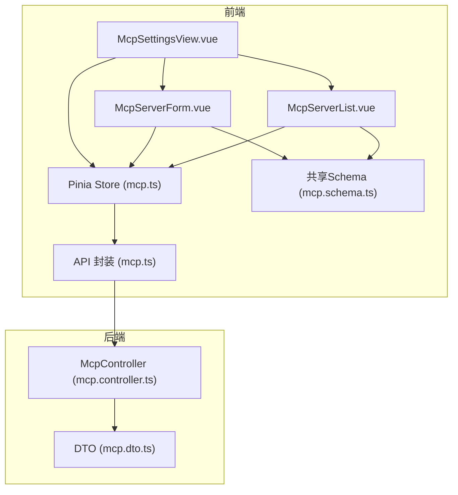
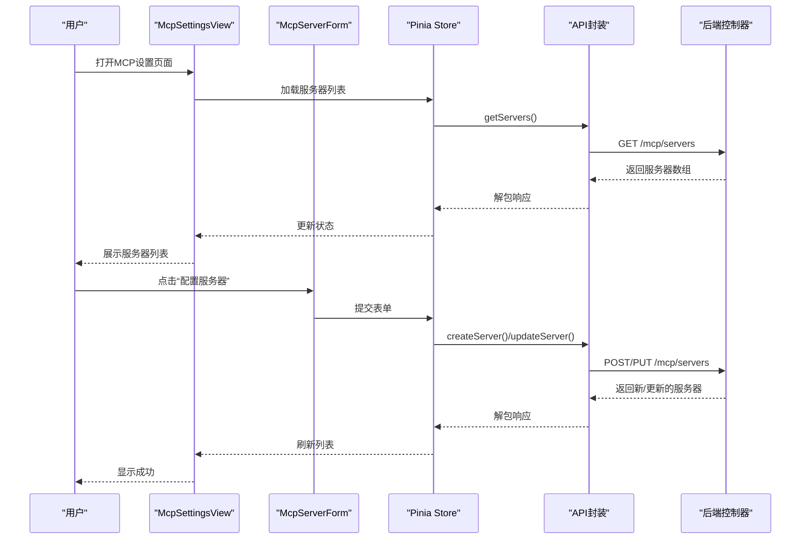
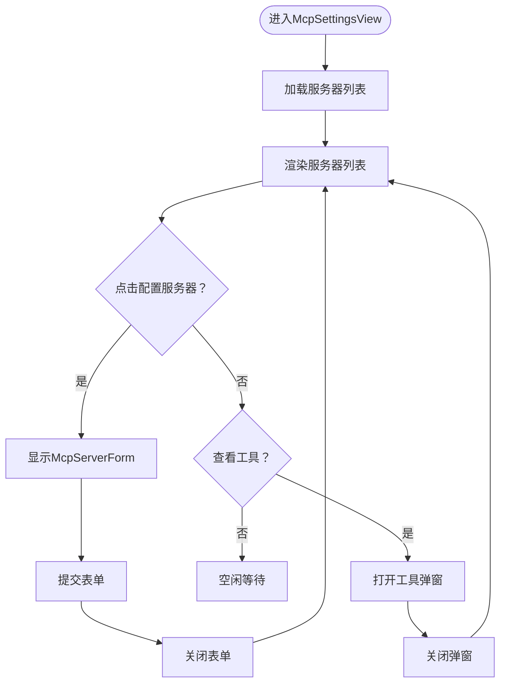
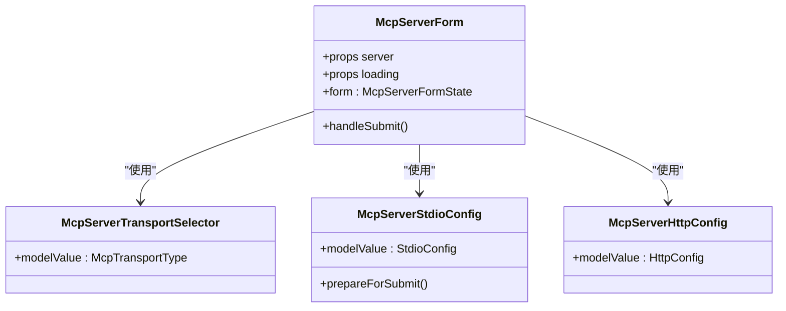
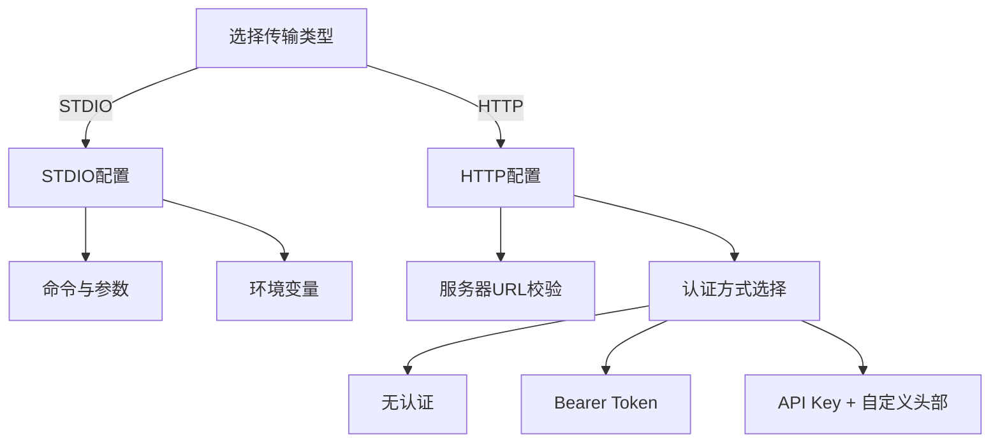
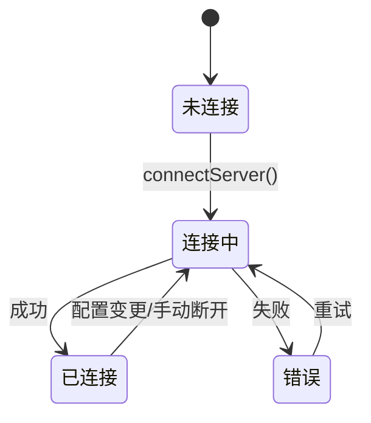
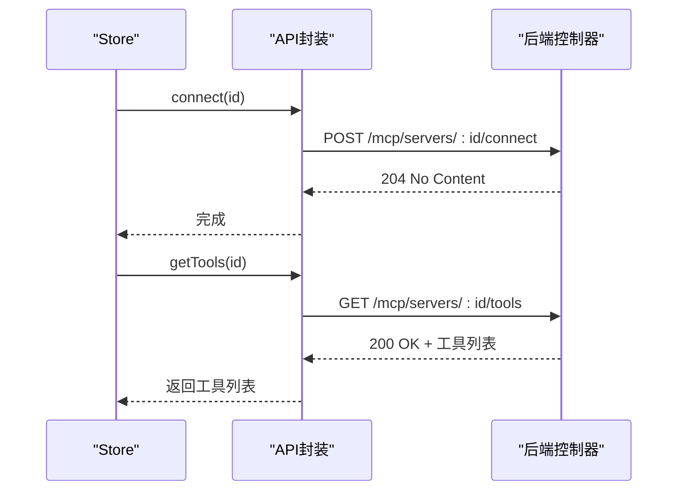
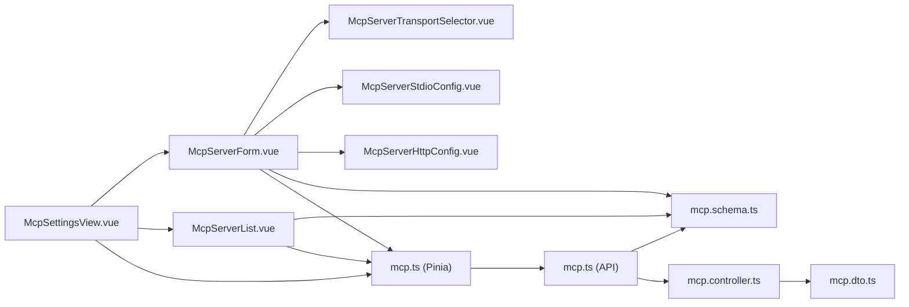

# MCP设置

<cite>
**本文档引用的文件**
- [McpSettingsView.vue](file://apps/frontend/src/features/mcp/views/McpSettingsView.vue)
- [McpServerForm.vue](file://apps/frontend/src/features/mcp/components/McpServerForm.vue)
- [McpServerList.vue](file://apps/frontend/src/features/mcp/components/McpServerList.vue)
- [McpServerTransportSelector.vue](file://apps/frontend/src/features/mcp/components/McpServerTransportSelector.vue)
- [McpServerStdioConfig.vue](file://apps/frontend/src/features/mcp/components/McpServerStdioConfig.vue)
- [McpServerHttpConfig.vue](file://apps/frontend/src/features/mcp/components/McpServerHttpConfig.vue)
- [mcp.ts](file://apps/frontend/src/features/mcp/stores/mcp.ts)
- [mcp.ts](file://apps/frontend/src/features/mcp/api/mcp.ts)
- [mcp.schema.ts](file://packages/shared/src/schemas/mcp.schema.ts)
- [mcp.controller.ts](file://apps/backend/src/mcp/mcp.controller.ts)
- [mcp.dto.ts](file://apps/backend/src/mcp/mcp.dto.ts)
</cite>

## 目录
1. [简介](#简介)
2. [项目结构](#项目结构)
3. [核心组件](#核心组件)
4. [架构总览](#架构总览)
5. [详细组件分析](#详细组件分析)
6. [依赖关系分析](#依赖关系分析)
7. [性能考虑](#性能考虑)
8. [故障排查指南](#故障排查指南)
9. [结论](#结论)

## 简介
本技术文档聚焦于MCP（Model Context Protocol）设置功能，系统性阐述前端MCP设置界面的设计与实现，涵盖：
- 主视图McpSettingsView：服务器配置列表展示、添加/编辑表单入口、工具查看弹窗
- 表单组件McpServerForm：服务器基本信息、传输协议选择（HTTP/STDIO）、认证配置、连接参数设置
- MCP状态管理：服务器配置存储、连接状态跟踪、配置验证、错误处理
- MCP API封装：服务器发现、连接建立、配置更新、断开连接
- 多种传输方式支持、安全配置选项、连接健康检查、故障恢复机制

## 项目结构
MCP设置功能位于前端应用的MCP特性模块中，采用按功能分层的组织方式：
- 视图层：McpSettingsView.vue负责整体布局与交互编排
- 表单组件：McpServerForm.vue及其子组件（传输选择、STDIO配置、HTTP配置）
- 列表组件：McpServerList.vue负责服务器列表展示与操作
- 状态管理：Pinia store（mcp.ts）集中管理服务器配置、连接状态与错误
- API封装：mcp.ts提供统一的HTTP接口调用
- 数据模型：共享schema（mcp.schema.ts）定义前后端一致的数据结构与校验规则
- 后端控制器：NestJS控制器（mcp.controller.ts）实现REST API与客户端连接管理

图表来源
- [McpSettingsView.vue:1-279](file://apps/frontend/src/features/mcp/views/McpSettingsView.vue#L1-L279)
- [McpServerForm.vue:1-188](file://apps/frontend/src/features/mcp/components/McpServerForm.vue#L1-L188)
- [McpServerList.vue:1-351](file://apps/frontend/src/features/mcp/components/McpServerList.vue#L1-L351)
- [mcp.ts:1-246](file://apps/frontend/src/features/mcp/stores/mcp.ts#L1-L246)
- [mcp.ts:1-108](file://apps/frontend/src/features/mcp/api/mcp.ts#L1-L108)
- [mcp.schema.ts:1-220](file://packages/shared/src/schemas/mcp.schema.ts#L1-L220)
- [mcp.controller.ts:1-198](file://apps/backend/src/mcp/mcp.controller.ts#L1-L198)
- [mcp.dto.ts:1-59](file://apps/backend/src/mcp/mcp.dto.ts#L1-L59)

章节来源
- [McpSettingsView.vue:1-279](file://apps/frontend/src/features/mcp/views/McpSettingsView.vue#L1-L279)
- [McpServerForm.vue:1-188](file://apps/frontend/src/features/mcp/components/McpServerForm.vue#L1-L188)
- [McpServerList.vue:1-351](file://apps/frontend/src/features/mcp/components/McpServerList.vue#L1-L351)
- [mcp.ts:1-246](file://apps/frontend/src/features/mcp/stores/mcp.ts#L1-L246)
- [mcp.ts:1-108](file://apps/frontend/src/features/mcp/api/mcp.ts#L1-L108)
- [mcp.schema.ts:1-220](file://packages/shared/src/schemas/mcp.schema.ts#L1-L220)
- [mcp.controller.ts:1-198](file://apps/backend/src/mcp/mcp.controller.ts#L1-L198)
- [mcp.dto.ts:1-59](file://apps/backend/src/mcp/mcp.dto.ts#L1-L59)

## 核心组件
- 主视图McpSettingsView：负责页面布局、编辑/列表模式切换、工具查看弹窗、路由返回
- 表单组件McpServerForm：聚合基础信息、传输选择、具体配置（STDIO/HTTP），提交时进行数据整理与校验
- 列表组件McpServerList：展示服务器列表、状态指示、连接/重试、工具查看、启用/禁用、删除
- Pinia Store（mcp.ts）：集中管理服务器列表、加载状态、连接状态、错误信息，并封装API调用
- API封装（mcp.ts）：对后端REST接口进行统一封装，提供获取服务器、创建/更新/删除、连接/断开、工具列表与调用等方法
- 共享Schema（mcp.schema.ts）：定义服务器响应、传输类型、STDIO/HTTP配置、工具调用等数据结构与校验规则
- 后端控制器（mcp.controller.ts）：实现REST API，负责服务器配置CRUD、连接/断开、工具发现与调用

章节来源
- [McpSettingsView.vue:1-279](file://apps/frontend/src/features/mcp/views/McpSettingsView.vue#L1-L279)
- [McpServerForm.vue:1-188](file://apps/frontend/src/features/mcp/components/McpServerForm.vue#L1-L188)
- [McpServerList.vue:1-351](file://apps/frontend/src/features/mcp/components/McpServerList.vue#L1-L351)
- [mcp.ts:1-246](file://apps/frontend/src/features/mcp/stores/mcp.ts#L1-L246)
- [mcp.ts:1-108](file://apps/frontend/src/features/mcp/api/mcp.ts#L1-L108)
- [mcp.schema.ts:1-220](file://packages/shared/src/schemas/mcp.schema.ts#L1-L220)
- [mcp.controller.ts:1-198](file://apps/backend/src/mcp/mcp.controller.ts#L1-L198)

## 架构总览
MCP设置功能采用“视图-组件-状态-API-后端”的分层架构：
- 视图层：McpSettingsView作为容器视图，协调表单与列表组件
- 组件层：McpServerForm及其子组件负责输入与配置收集
- 状态层：Pinia Store统一管理服务器配置、连接状态与错误
- API层：mcp.ts封装HTTP请求，统一错误处理与超时策略
- 后端层：McpController提供REST接口，管理连接与工具发现

图表来源
- [McpSettingsView.vue:39-86](file://apps/frontend/src/features/mcp/views/McpSettingsView.vue#L39-L86)
- [mcp.ts:43-151](file://apps/frontend/src/features/mcp/stores/mcp.ts#L43-L151)
- [mcp.ts:20-47](file://apps/frontend/src/features/mcp/api/mcp.ts#L20-L47)
- [mcp.controller.ts:45-101](file://apps/backend/src/mcp/mcp.controller.ts#L45-L101)

## 详细组件分析

### 主视图McpSettingsView设计实现
- 页面布局与导航：顶部标题、返回按钮、配置按钮；内容区域根据编辑/列表模式切换
- 服务器列表展示：委托McpServerList渲染，支持编辑、查看工具
- 工具查看弹窗：自定义对话框替代UI库模态，展示工具名称、描述与输入Schema
- 生命周期：组件挂载时自动拉取服务器列表
- 交互流程：点击“配置服务器”进入表单编辑；提交成功后关闭编辑面板

图表来源
- [McpSettingsView.vue:39-86](file://apps/frontend/src/features/mcp/views/McpSettingsView.vue#L39-L86)
- [McpServerList.vue:25-91](file://apps/frontend/src/features/mcp/components/McpServerList.vue#L25-L91)

章节来源
- [McpSettingsView.vue:1-279](file://apps/frontend/src/features/mcp/views/McpSettingsView.vue#L1-L279)

### 表单组件McpServerForm：服务器配置编辑
- 表单状态：包含服务器基本信息（名称、描述、启用）、传输类型、配置（STDIO/HTTP）
- 子组件组合：
  - 基础信息：McpServerFormBaseInfo（未在本文档展开）
  - 传输选择：McpServerTransportSelector（STDIO/HTTP卡片式选择）
  - STDIO配置：McpServerStdioConfig（命令、参数、环境变量）
  - HTTP配置：McpServerHttpConfig（URL、认证方式与参数）
- 提交流程：根据传输类型整理提交数据，过滤空字段，触发父组件回调

图表来源
- [McpServerForm.vue:13-135](file://apps/frontend/src/features/mcp/components/McpServerForm.vue#L13-L135)
- [McpServerTransportSelector.vue:6-117](file://apps/frontend/src/features/mcp/components/McpServerTransportSelector.vue#L6-L117)
- [McpServerStdioConfig.vue:9-75](file://apps/frontend/src/features/mcp/components/McpServerStdioConfig.vue#L9-L75)
- [McpServerHttpConfig.vue:8-37](file://apps/frontend/src/features/mcp/components/McpServerHttpConfig.vue#L8-L37)

章节来源
- [McpServerForm.vue:1-188](file://apps/frontend/src/features/mcp/components/McpServerForm.vue#L1-L188)
- [McpServerTransportSelector.vue:1-117](file://apps/frontend/src/features/mcp/components/McpServerTransportSelector.vue#L1-L117)
- [McpServerStdioConfig.vue:1-215](file://apps/frontend/src/features/mcp/components/McpServerStdioConfig.vue#L1-L215)
- [McpServerHttpConfig.vue:1-180](file://apps/frontend/src/features/mcp/components/McpServerHttpConfig.vue#L1-L180)

### 传输协议与认证配置
- 传输协议选择：STDIO（本地进程）与HTTP（远程服务）
- STDIO配置：命令、参数数组、环境变量、工作目录；支持命令行解析与去重
- HTTP配置：服务器URL（仅允许公共HTTP/HTTPS，禁止私有/回环地址）、请求头、认证方式
- 认证方式：无认证、Bearer Token、API Key（可自定义头部名）

图表来源
- [McpServerTransportSelector.vue:16-114](file://apps/frontend/src/features/mcp/components/McpServerTransportSelector.vue#L16-L114)
- [McpServerStdioConfig.vue:78-214](file://apps/frontend/src/features/mcp/components/McpServerStdioConfig.vue#L78-L214)
- [McpServerHttpConfig.vue:39-179](file://apps/frontend/src/features/mcp/components/McpServerHttpConfig.vue#L39-L179)
- [mcp.schema.ts:63-118](file://packages/shared/src/schemas/mcp.schema.ts#L63-L118)

章节来源
- [McpServerTransportSelector.vue:1-117](file://apps/frontend/src/features/mcp/components/McpServerTransportSelector.vue#L1-L117)
- [McpServerStdioConfig.vue:1-215](file://apps/frontend/src/features/mcp/components/McpServerStdioConfig.vue#L1-L215)
- [McpServerHttpConfig.vue:1-180](file://apps/frontend/src/features/mcp/components/McpServerHttpConfig.vue#L1-L180)
- [mcp.schema.ts:1-220](file://packages/shared/src/schemas/mcp.schema.ts#L1-L220)

### MCP状态管理：服务器配置存储、连接状态跟踪、配置验证、错误处理
- 服务器列表与加载状态：Pinia store维护servers、isLoading、error
- 连接状态：connectionStates（已连接）、connectingStates（连接中）、serverErrors（错误信息）
- 自动连接：首次加载时对启用且未连接的服务器尝试连接
- 配置变更检测：比较前一次与当前配置，若运行时配置发生变化则断开后重建连接
- 错误处理：捕获异常并记录到serverErrors，避免重复打印401/刷新令牌无效等常见错误

图表来源
- [mcp.ts:175-202](file://apps/frontend/src/features/mcp/stores/mcp.ts#L175-L202)
- [mcp.ts:43-84](file://apps/frontend/src/features/mcp/stores/mcp.ts#L43-L84)

章节来源
- [mcp.ts:1-246](file://apps/frontend/src/features/mcp/stores/mcp.ts#L1-L246)

### MCP API封装：服务器发现、连接建立、配置更新、断开连接
- 服务器管理：getServers、getServer、createServer、updateServer、deleteServer
- 工具管理：getTools（单服务器）、getAllTools（聚合所有启用服务器）
- 连接管理：connect、disconnect
- 超时策略：连接超时5分钟，工具发现超时30秒，工具调用超时60秒
- 错误处理：统一解包响应，异常时保留错误消息

图表来源
- [mcp.ts:89-98](file://apps/frontend/src/features/mcp/api/mcp.ts#L89-L98)
- [mcp.ts:59-65](file://apps/frontend/src/features/mcp/api/mcp.ts#L59-L65)
- [mcp.controller.ts:134-175](file://apps/backend/src/mcp/mcp.controller.ts#L134-L175)

章节来源
- [mcp.ts:1-108](file://apps/frontend/src/features/mcp/api/mcp.ts#L1-L108)
- [mcp.controller.ts:1-198](file://apps/backend/src/mcp/mcp.controller.ts#L1-L198)

## 依赖关系分析
- 前端依赖链：
  - McpSettingsView依赖McpServerForm、McpServerList与Pinia Store
  - McpServerForm依赖McpServerTransportSelector、McpServerStdioConfig、McpServerHttpConfig与共享Schema
  - Pinia Store依赖API封装与共享Schema
  - API封装依赖共享Schema与HTTP客户端
- 后端依赖链：
  - McpController依赖McpServerConfigService与McpClientService
  - DTO基于共享Schema

图表来源
- [McpSettingsView.vue:1-279](file://apps/frontend/src/features/mcp/views/McpSettingsView.vue#L1-L279)
- [McpServerForm.vue:1-188](file://apps/frontend/src/features/mcp/components/McpServerForm.vue#L1-L188)
- [McpServerList.vue:1-351](file://apps/frontend/src/features/mcp/components/McpServerList.vue#L1-L351)
- [mcp.ts:1-246](file://apps/frontend/src/features/mcp/stores/mcp.ts#L1-L246)
- [mcp.ts:1-108](file://apps/frontend/src/features/mcp/api/mcp.ts#L1-L108)
- [mcp.schema.ts:1-220](file://packages/shared/src/schemas/mcp.schema.ts#L1-L220)
- [mcp.controller.ts:1-198](file://apps/backend/src/mcp/mcp.controller.ts#L1-L198)
- [mcp.dto.ts:1-59](file://apps/backend/src/mcp/mcp.dto.ts#L1-L59)

章节来源
- [McpSettingsView.vue:1-279](file://apps/frontend/src/features/mcp/views/McpSettingsView.vue#L1-L279)
- [McpServerForm.vue:1-188](file://apps/frontend/src/features/mcp/components/McpServerForm.vue#L1-L188)
- [McpServerList.vue:1-351](file://apps/frontend/src/features/mcp/components/McpServerList.vue#L1-L351)
- [mcp.ts:1-246](file://apps/frontend/src/features/mcp/stores/mcp.ts#L1-L246)
- [mcp.ts:1-108](file://apps/frontend/src/features/mcp/api/mcp.ts#L1-L108)
- [mcp.schema.ts:1-220](file://packages/shared/src/schemas/mcp.schema.ts#L1-L220)
- [mcp.controller.ts:1-198](file://apps/backend/src/mcp/mcp.controller.ts#L1-L198)
- [mcp.dto.ts:1-59](file://apps/backend/src/mcp/mcp.dto.ts#L1-L59)

## 性能考虑
- 连接超时与重试：连接超时5分钟，工具发现30秒，工具调用60秒，避免长时间阻塞
- 自动连接策略：首次加载时仅对启用且未连接的服务器尝试连接，减少不必要的握手
- 配置变更检测：仅在运行时配置发生实质性变化时断开并重建连接，降低频繁重连成本
- 列表渲染优化：使用GSAP动画与过渡组，提升交互体验同时保持渲染性能

## 故障排查指南
- 连接失败：
  - 检查服务器URL是否为公共HTTP/HTTPS，避免私有/回环地址
  - 确认认证配置正确（Bearer Token或API Key）
  - 查看错误弹窗中的错误信息，必要时重试连接
- 工具不可见：
  - 确保服务器已启用且已连接
  - 在工具弹窗中查看工具列表，确认服务器返回了工具清单
- 配置更新后未生效：
  - 若运行时配置（如命令、参数、URL、认证）发生变化，系统会自动断开并重建连接
  - 如仍不生效，尝试手动断开后重新连接

章节来源
- [mcp.ts:175-202](file://apps/frontend/src/features/mcp/stores/mcp.ts#L175-L202)
- [mcp.ts:89-98](file://apps/frontend/src/features/mcp/api/mcp.ts#L89-L98)
- [mcp.schema.ts:63-118](file://packages/shared/src/schemas/mcp.schema.ts#L63-L118)

## 结论
MCP设置功能通过清晰的分层架构与完善的错误处理机制，提供了直观易用的服务器配置与连接管理能力。前端以组件化的方式实现表单与列表，配合Pinia状态管理与API封装，确保了良好的用户体验与可维护性。后端控制器提供稳健的REST接口与连接管理，结合共享Schema保证了前后端数据一致性与安全性。