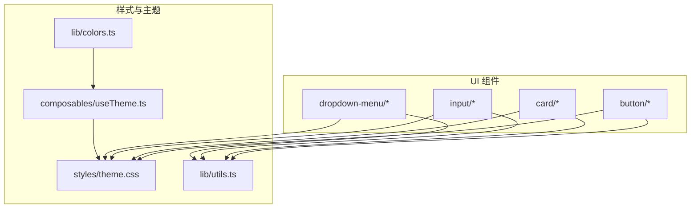
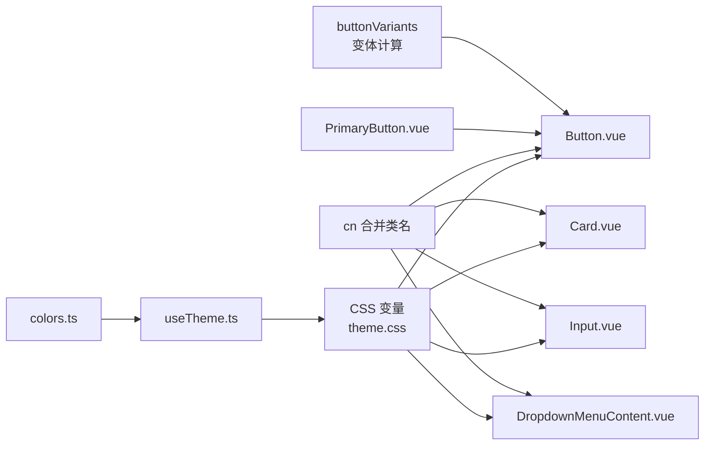
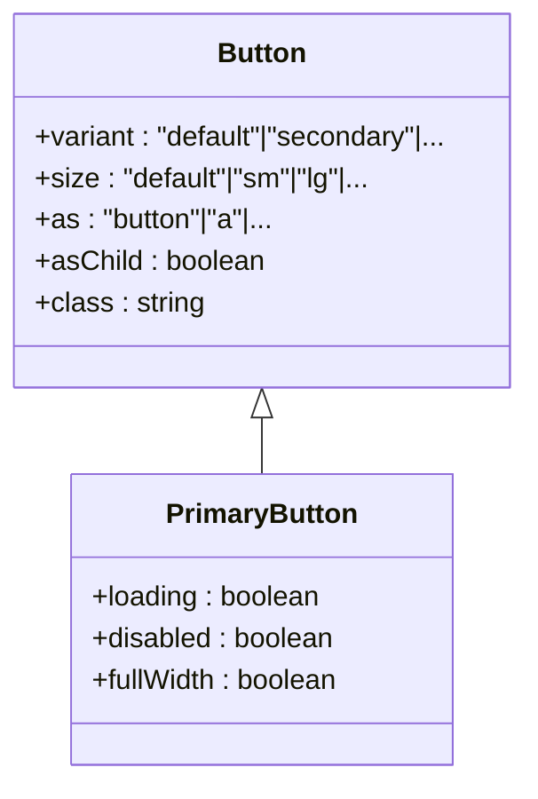
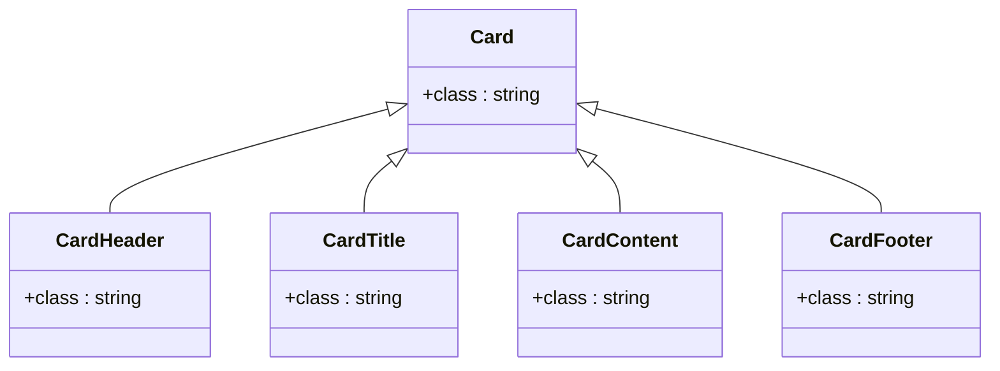
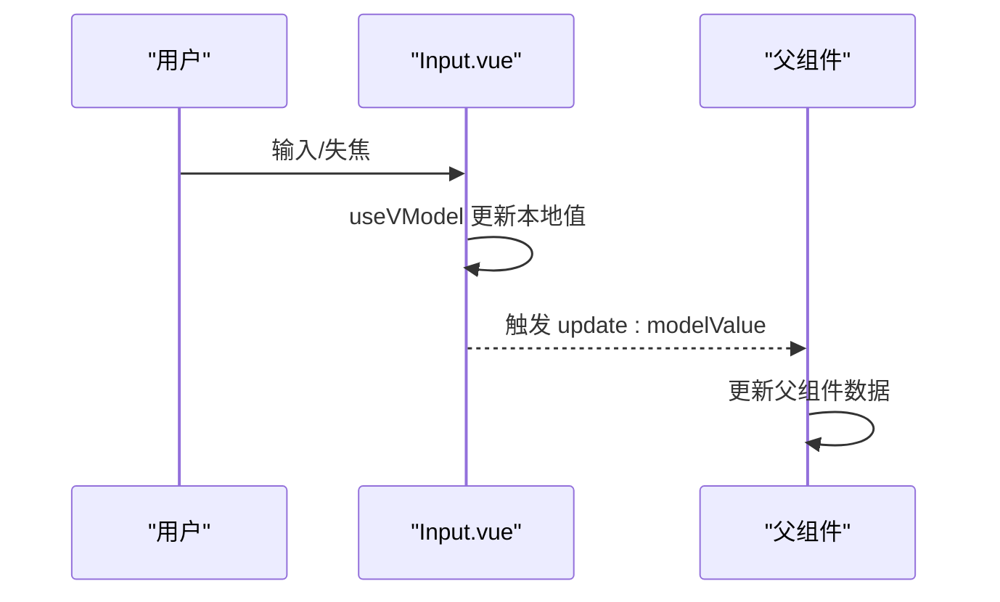
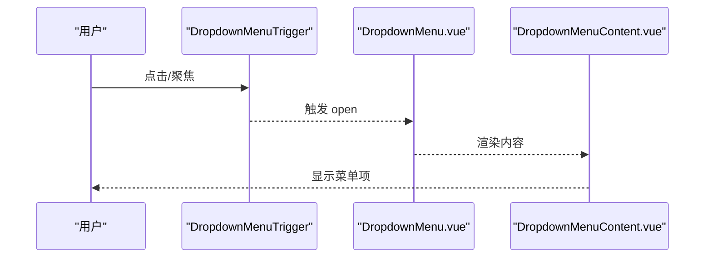
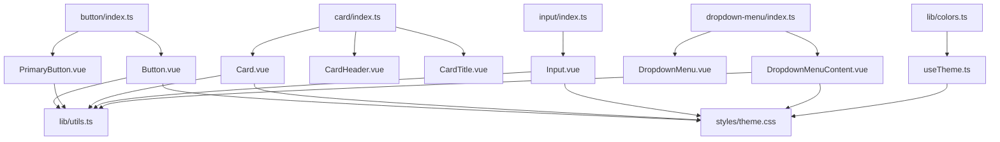
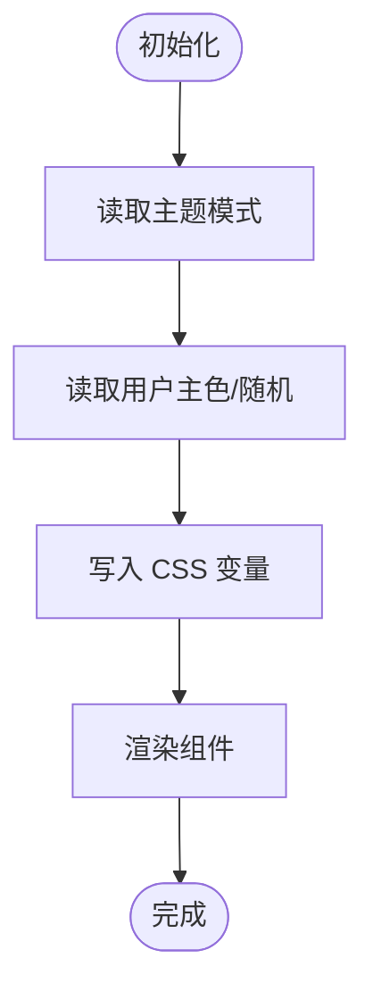

# UI组件库

<cite>
**本文引用的文件**
- [apps/frontend/src/components/ui/button/Button.vue](file://apps/frontend/src/components/ui/button/Button.vue)
- [apps/frontend/src/components/ui/button/index.ts](file://apps/frontend/src/components/ui/button/index.ts)
- [apps/frontend/src/components/ui/button/PrimaryButton.vue](file://apps/frontend/src/components/ui/button/PrimaryButton.vue)
- [apps/frontend/src/components/ui/card/Card.vue](file://apps/frontend/src/components/ui/card/Card.vue)
- [apps/frontend/src/components/ui/card/index.ts](file://apps/frontend/src/components/ui/card/index.ts)
- [apps/frontend/src/components/ui/card/CardHeader.vue](file://apps/frontend/src/components/ui/card/CardHeader.vue)
- [apps/frontend/src/components/ui/card/CardTitle.vue](file://apps/frontend/src/components/ui/card/CardTitle.vue)
- [apps/frontend/src/components/ui/input/Input.vue](file://apps/frontend/src/components/ui/input/Input.vue)
- [apps/frontend/src/components/ui/input/index.ts](file://apps/frontend/src/components/ui/input/index.ts)
- [apps/frontend/src/components/ui/dropdown-menu/DropdownMenu.vue](file://apps/frontend/src/components/ui/dropdown-menu/DropdownMenu.vue)
- [apps/frontend/src/components/ui/dropdown-menu/DropdownMenuContent.vue](file://apps/frontend/src/components/ui/dropdown-menu/DropdownMenuContent.vue)
- [apps/frontend/src/components/ui/dropdown-menu/index.ts](file://apps/frontend/src/components/ui/dropdown-menu/index.ts)
- [apps/frontend/src/styles/theme.css](file://apps/frontend/src/styles/theme.css)
- [apps/frontend/src/composables/useTheme.ts](file://apps/frontend/src/composables/useTheme.ts)
- [apps/frontend/src/lib/colors.ts](file://apps/frontend/src/lib/colors.ts)
- [apps/frontend/src/lib/utils.ts](file://apps/frontend/src/lib/utils.ts)
</cite>

## 目录
1. [引言](#引言)
2. [项目结构](#项目结构)
3. [核心组件](#核心组件)
4. [架构总览](#架构总览)
5. [组件详解](#组件详解)
6. [依赖关系分析](#依赖关系分析)
7. [性能与可访问性](#性能与可访问性)
8. [故障排查指南](#故障排查指南)
9. [结论](#结论)
10. [附录](#附录)

## 引言
本文件为基于 Vue 3 的 UI 组件库技术文档，聚焦于 Button、Card、Input、DropdownMenu 等基础组件的设计与实现。文档涵盖组件设计原则（语义化标签、无障碍访问、响应式设计、主题一致性）、属性接口、事件系统、插槽使用、样式定制选项；同时阐述主题系统（CSS 变量、暗色模式、颜色体系、字体规范）、组件组合与复用策略、性能优化与浏览器兼容性处理，并提供使用示例、最佳实践与自定义扩展方法。

## 项目结构
前端应用采用按功能域分层的组织方式，UI 组件集中位于 apps/frontend/src/components/ui 下，按功能模块拆分子目录，每个模块提供统一的入口 index.ts 导出组件与子组件。样式通过 apps/frontend/src/styles/theme.css 定义 CSS 变量与全局样式层，主题切换与颜色计算通过 apps/frontend/src/composables/useTheme.ts 实现。

**图示来源**
- [apps/frontend/src/components/ui/button/index.ts:1-42](file://apps/frontend/src/components/ui/button/index.ts#L1-L42)
- [apps/frontend/src/components/ui/card/index.ts:1-7](file://apps/frontend/src/components/ui/card/index.ts#L1-L7)
- [apps/frontend/src/components/ui/input/index.ts:1-2](file://apps/frontend/src/components/ui/input/index.ts#L1-L2)
- [apps/frontend/src/components/ui/dropdown-menu/index.ts:1-17](file://apps/frontend/src/components/ui/dropdown-menu/index.ts#L1-L17)
- [apps/frontend/src/styles/theme.css:1-197](file://apps/frontend/src/styles/theme.css#L1-L197)
- [apps/frontend/src/composables/useTheme.ts:1-248](file://apps/frontend/src/composables/useTheme.ts#L1-L248)
- [apps/frontend/src/lib/utils.ts](file://apps/frontend/src/lib/utils.ts)

**章节来源**
- [apps/frontend/src/components/ui/button/index.ts:1-42](file://apps/frontend/src/components/ui/button/index.ts#L1-L42)
- [apps/frontend/src/components/ui/card/index.ts:1-7](file://apps/frontend/src/components/ui/card/index.ts#L1-L7)
- [apps/frontend/src/components/ui/input/index.ts:1-2](file://apps/frontend/src/components/ui/input/index.ts#L1-L2)
- [apps/frontend/src/components/ui/dropdown-menu/index.ts:1-17](file://apps/frontend/src/components/ui/dropdown-menu/index.ts#L1-L17)
- [apps/frontend/src/styles/theme.css:1-197](file://apps/frontend/src/styles/theme.css#L1-L197)

## 核心组件
本节概述四大基础组件的设计目标与通用能力：
- Button：语义化标签、可变外观与尺寸、无障碍交互、可承载图标与加载态。
- Card：卡片容器与语义化标题/描述/内容/页脚组合，支持主题色与阴影。
- Input：受控输入、自动 ID 生成、无障碍关联、玻璃态与过渡效果。
- DropdownMenu：基于 reka-ui 的弹出菜单体系，支持子菜单、勾选/单选组、快捷键提示等。

**章节来源**
- [apps/frontend/src/components/ui/button/Button.vue:1-32](file://apps/frontend/src/components/ui/button/Button.vue#L1-L32)
- [apps/frontend/src/components/ui/button/PrimaryButton.vue:1-62](file://apps/frontend/src/components/ui/button/PrimaryButton.vue#L1-L62)
- [apps/frontend/src/components/ui/card/Card.vue:1-15](file://apps/frontend/src/components/ui/card/Card.vue#L1-L15)
- [apps/frontend/src/components/ui/input/Input.vue:1-42](file://apps/frontend/src/components/ui/input/Input.vue#L1-L42)
- [apps/frontend/src/components/ui/dropdown-menu/DropdownMenu.vue:1-16](file://apps/frontend/src/components/ui/dropdown-menu/DropdownMenu.vue#L1-L16)

## 架构总览
组件库遵循“变体系统 + CSS 变量 + 组合子组件”的架构：
- 变体系统：通过 class-variance-authority 在 button/index.ts 中定义按钮外观与尺寸变体，运行时按 props 计算类名。
- 组合子组件：Card 与 DropdownMenu 提供 Header/Title/Content 等子组件，形成语义化卡片与菜单结构。
- 主题系统：theme.css 定义大量 CSS 变量，useTheme.ts 负责主题模式与用户主色的持久化与动态更新。
- 工具函数：lib/utils.ts 提供 cn 类名合并工具，lib/colors.ts 提供颜色解析与转换工具。

**图示来源**
- [apps/frontend/src/components/ui/button/index.ts:7-39](file://apps/frontend/src/components/ui/button/index.ts#L7-L39)
- [apps/frontend/src/components/ui/button/Button.vue:24-30](file://apps/frontend/src/components/ui/button/Button.vue#L24-L30)
- [apps/frontend/src/components/ui/button/PrimaryButton.vue:10-22](file://apps/frontend/src/components/ui/button/PrimaryButton.vue#L10-L22)
- [apps/frontend/src/components/ui/card/Card.vue:11-11](file://apps/frontend/src/components/ui/card/Card.vue#L11-L11)
- [apps/frontend/src/components/ui/input/Input.vue:34-39](file://apps/frontend/src/components/ui/input/Input.vue#L34-L39)
- [apps/frontend/src/components/ui/dropdown-menu/DropdownMenuContent.vue:26-31](file://apps/frontend/src/components/ui/dropdown-menu/DropdownMenuContent.vue#L26-L31)
- [apps/frontend/src/styles/theme.css:1-197](file://apps/frontend/src/styles/theme.css#L1-L197)
- [apps/frontend/src/composables/useTheme.ts:188-247](file://apps/frontend/src/composables/useTheme.ts#L188-L247)
- [apps/frontend/src/lib/utils.ts](file://apps/frontend/src/lib/utils.ts)
- [apps/frontend/src/lib/colors.ts:1-96](file://apps/frontend/src/lib/colors.ts#L1-L96)

## 组件详解

### Button 组件
- 设计原则
  - 语义化标签：默认 as='button'，支持 asChild 透传原生语义。
  - 可访问性：继承原生按钮行为，焦点可见环、禁用状态明确。
  - 响应式与动画：统一过渡时长与缓动，尺寸变体适配移动端。
  - 主题一致性：基于 CSS 变量与变体系统，确保与整体风格一致。
- 属性接口
  - variant: 变体（default/secondary/destructive/outline/ghost/link）
  - size: 尺寸（default/xs/sm/lg/icon/icon-sm/icon-lg）
  - as/asChild: 原生标签与子节点透传
  - class: 自定义类名
- 事件系统
  - 无特定事件，遵循原生按钮交互。
- 插槽使用
  - 默认插槽用于放置文本或图标。
- 样式定制
  - 通过 variant/size 控制外观与尺寸；通过 class 扩展样式。
  - 支持加载态与全宽展示的专用 PrimaryButton。
- 最佳实践
  - 使用 PrimaryButton 作为主要操作按钮；次级使用 Secondary；危险操作使用 Destructive。
  - 图标与文字组合时，优先使用变体系统而非硬编码样式。

**图示来源**
- [apps/frontend/src/components/ui/button/Button.vue:9-20](file://apps/frontend/src/components/ui/button/Button.vue#L9-L20)
- [apps/frontend/src/components/ui/button/PrimaryButton.vue:2-6](file://apps/frontend/src/components/ui/button/PrimaryButton.vue#L2-L6)

**章节来源**
- [apps/frontend/src/components/ui/button/Button.vue:1-32](file://apps/frontend/src/components/ui/button/Button.vue#L1-L32)
- [apps/frontend/src/components/ui/button/index.ts:7-39](file://apps/frontend/src/components/ui/button/index.ts#L7-L39)
- [apps/frontend/src/components/ui/button/PrimaryButton.vue:1-62](file://apps/frontend/src/components/ui/button/PrimaryButton.vue#L1-L62)

### Card 组件
- 设计原则
  - 语义化卡片容器，配合 Header/Title/Description/Content/Footer 形成完整卡片结构。
  - 使用主题变量控制背景、边框、阴影，保证在明/暗模式下一致观感。
- 子组件
  - CardHeader、CardTitle、CardDescription、CardContent、CardFooter。
- 属性接口
  - class: 自定义类名。
- 插槽使用
  - 子组件均以默认插槽承载内容。
- 样式定制
  - 通过 class 扩展内边距、圆角、阴影等。
- 最佳实践
  - 优先使用组合子组件构建卡片，避免直接操作内部结构。

**图示来源**
- [apps/frontend/src/components/ui/card/Card.vue:5-7](file://apps/frontend/src/components/ui/card/Card.vue#L5-L7)
- [apps/frontend/src/components/ui/card/CardHeader.vue:5-7](file://apps/frontend/src/components/ui/card/CardHeader.vue#L5-L7)
- [apps/frontend/src/components/ui/card/CardTitle.vue:5-7](file://apps/frontend/src/components/ui/card/CardTitle.vue#L5-L7)

**章节来源**
- [apps/frontend/src/components/ui/card/Card.vue:1-15](file://apps/frontend/src/components/ui/card/Card.vue#L1-L15)
- [apps/frontend/src/components/ui/card/CardHeader.vue:1-15](file://apps/frontend/src/components/ui/card/CardHeader.vue#L1-L15)
- [apps/frontend/src/components/ui/card/CardTitle.vue:1-15](file://apps/frontend/src/components/ui/card/CardTitle.vue#L1-L15)
- [apps/frontend/src/components/ui/card/index.ts:1-7](file://apps/frontend/src/components/ui/card/index.ts#L1-L7)

### Input 组件
- 设计原则
  - 受控组件，支持 v-model 与 defaultValue；自动生成唯一 id 并与 label 关联。
  - 使用 CSS 变量实现玻璃态背景、模糊与过渡，提升现代感。
- 属性接口
  - modelValue/value: 受控值
  - defaultValue: 初始值
  - id/name: 表单关联
  - class: 自定义类名
- 事件系统
  - update:modelValue: 输入变更事件。
- 插槽使用
  - 无插槽，通过原生 input 属性与 v-bind 透传。
- 样式定制
  - 通过 class 扩展尺寸、圆角、边框与状态样式。
- 最佳实践
  - 与 FormInput/PasswordInput 等封装组件配合使用，统一表单体验。

**图示来源**
- [apps/frontend/src/components/ui/input/Input.vue:15-25](file://apps/frontend/src/components/ui/input/Input.vue#L15-L25)

**章节来源**
- [apps/frontend/src/components/ui/input/Input.vue:1-42](file://apps/frontend/src/components/ui/input/Input.vue#L1-L42)
- [apps/frontend/src/components/ui/input/index.ts:1-2](file://apps/frontend/src/components/ui/input/index.ts#L1-L2)

### DropdownMenu 组件
- 设计原则
  - 基于 reka-ui 的弹出菜单体系，支持触发器、内容区、子菜单、勾选/单选组、分隔符、快捷键提示等。
  - 使用 Portal 将内容渲染到文档根部，避免定位与层级问题。
- 属性与事件
  - Root: 继承 reka-ui 的 RootProps/RootEmits。
  - Content: 支持 sideOffset 与 class，内置动画与定位类。
- 插槽使用
  - 默认插槽承载菜单项与子菜单。
- 样式定制
  - 通过 class 扩展尺寸、圆角、阴影与动画。
- 最佳实践
  - 使用 DropdownMenuTrigger 触发，DropdownMenuContent 容纳菜单项；复杂场景使用 Sub/Group/Radio/Checkbox 组合。

**图示来源**
- [apps/frontend/src/components/ui/dropdown-menu/DropdownMenu.vue:5-8](file://apps/frontend/src/components/ui/dropdown-menu/DropdownMenu.vue#L5-L8)
- [apps/frontend/src/components/ui/dropdown-menu/DropdownMenuContent.vue:8-19](file://apps/frontend/src/components/ui/dropdown-menu/DropdownMenuContent.vue#L8-L19)

**章节来源**
- [apps/frontend/src/components/ui/dropdown-menu/DropdownMenu.vue:1-16](file://apps/frontend/src/components/ui/dropdown-menu/DropdownMenu.vue#L1-L16)
- [apps/frontend/src/components/ui/dropdown-menu/DropdownMenuContent.vue:1-37](file://apps/frontend/src/components/ui/dropdown-menu/DropdownMenuContent.vue#L1-L37)
- [apps/frontend/src/components/ui/dropdown-menu/index.ts:1-17](file://apps/frontend/src/components/ui/dropdown-menu/index.ts#L1-L17)

## 依赖关系分析
- 组件间耦合
  - Button 依赖变体系统与 cn 工具；PrimaryButton 为 Button 的特化。
  - Card 依赖 cn 工具与主题变量；子组件通过组合增强语义。
  - Input 依赖 useVModel 与 cn 工具；与表单语义强关联。
  - DropdownMenu 依赖 reka-ui 的 Root/Content/Portal 等组件。
- 外部依赖
  - class-variance-authority：变体系统。
  - @vueuse/core：useVModel、useColorMode、useStorage、reactiveOmit。
  - reka-ui：语义化弹出菜单体系。
- 主题与颜色
  - theme.css 定义 CSS 变量；useTheme.ts 动态写入用户主色；colors.ts 提供颜色解析与混合。

**图示来源**
- [apps/frontend/src/components/ui/button/index.ts:1-6](file://apps/frontend/src/components/ui/button/index.ts#L1-L6)
- [apps/frontend/src/components/ui/card/index.ts:1-7](file://apps/frontend/src/components/ui/card/index.ts#L1-L7)
- [apps/frontend/src/components/ui/input/index.ts:1-2](file://apps/frontend/src/components/ui/input/index.ts#L1-L2)
- [apps/frontend/src/components/ui/dropdown-menu/index.ts:1-17](file://apps/frontend/src/components/ui/dropdown-menu/index.ts#L1-L17)
- [apps/frontend/src/lib/utils.ts](file://apps/frontend/src/lib/utils.ts)
- [apps/frontend/src/styles/theme.css:1-197](file://apps/frontend/src/styles/theme.css#L1-L197)
- [apps/frontend/src/composables/useTheme.ts:1-248](file://apps/frontend/src/composables/useTheme.ts#L1-L248)
- [apps/frontend/src/lib/colors.ts:1-96](file://apps/frontend/src/lib/colors.ts#L1-L96)

**章节来源**
- [apps/frontend/src/components/ui/button/index.ts:1-42](file://apps/frontend/src/components/ui/button/index.ts#L1-L42)
- [apps/frontend/src/components/ui/card/index.ts:1-7](file://apps/frontend/src/components/ui/card/index.ts#L1-L7)
- [apps/frontend/src/components/ui/input/index.ts:1-2](file://apps/frontend/src/components/ui/input/index.ts#L1-L2)
- [apps/frontend/src/components/ui/dropdown-menu/index.ts:1-17](file://apps/frontend/src/components/ui/dropdown-menu/index.ts#L1-L17)

## 性能与可访问性
- 性能优化
  - CSS 变量与层叠样式减少重排与重绘；GPU 加速辅助类 scroll-smooth-gpu 优化滚动性能。
  - 过渡动画统一时长与缓动曲线，避免过度动画影响性能。
  - PrimaryButton 的加载态使用 CSS 动画与绝对定位，避免额外 DOM 结构。
- 可访问性
  - Button 使用原生 button 标签，具备键盘可达与焦点环。
  - Input 自动生成 id 并透传原生属性，便于与 label 关联。
  - DropdownMenu 基于 reka-ui，遵循弹出菜单的可访问性约定。
- 浏览器兼容性
  - 使用 CSS 变量与现代布局（Flex/Grid），建议在需要兼容旧版浏览器时提供降级方案或 polyfill。
  - 对动画与滤镜（模糊）进行条件回退，确保在不支持的环境下仍可正常显示。

[本节为通用指导，无需具体文件分析]

## 故障排查指南
- 按钮点击无效或无反馈
  - 检查是否误用 as='button' 或禁用状态；确认事件未被父级拦截。
  - 参考路径：[apps/frontend/src/components/ui/button/Button.vue:24-30](file://apps/frontend/src/components/ui/button/Button.vue#L24-L30)
- 输入框无法双向绑定
  - 确认使用了 useVModel 并正确触发 update:modelValue；检查 defaultValue 与 modelValue 冲突。
  - 参考路径：[apps/frontend/src/components/ui/input/Input.vue:22-25](file://apps/frontend/src/components/ui/input/Input.vue#L22-L25)
- 下拉菜单位置异常
  - 调整 sideOffset；确认使用 Portal 渲染至文档根部。
  - 参考路径：[apps/frontend/src/components/ui/dropdown-menu/DropdownMenuContent.vue:23-35](file://apps/frontend/src/components/ui/dropdown-menu/DropdownMenuContent.vue#L23-L35)
- 主题色不生效或切换无效
  - 检查 CSS 变量是否被覆盖；确认 useTheme.ts 的存储键值与监听逻辑。
  - 参考路径：[apps/frontend/src/composables/useTheme.ts:212-226](file://apps/frontend/src/composables/useTheme.ts#L212-L226), [apps/frontend/src/styles/theme.css:99-168](file://apps/frontend/src/styles/theme.css#L99-L168)

**章节来源**
- [apps/frontend/src/components/ui/button/Button.vue:24-30](file://apps/frontend/src/components/ui/button/Button.vue#L24-L30)
- [apps/frontend/src/components/ui/input/Input.vue:22-25](file://apps/frontend/src/components/ui/input/Input.vue#L22-L25)
- [apps/frontend/src/components/ui/dropdown-menu/DropdownMenuContent.vue:23-35](file://apps/frontend/src/components/ui/dropdown-menu/DropdownMenuContent.vue#L23-L35)
- [apps/frontend/src/composables/useTheme.ts:212-226](file://apps/frontend/src/composables/useTheme.ts#L212-L226)
- [apps/frontend/src/styles/theme.css:99-168](file://apps/frontend/src/styles/theme.css#L99-L168)

## 结论
该 UI 组件库以变体系统与 CSS 变量为核心，结合 reka-ui 的语义化弹出菜单体系，提供了高一致性、可扩展的基础组件集。通过 useTheme.ts 与 colors.ts 实现主题与颜色的灵活管理，辅以 cn 工具与组合子组件，满足从简单按钮到复杂下拉菜单的多样化需求。建议在实际项目中遵循本文档的最佳实践，确保可访问性、性能与可维护性的平衡。

[本节为总结性内容，无需具体文件分析]

## 附录

### 主题系统与颜色体系
- CSS 变量
  - 字体族、主色/次色、边框/输入、圆角半径、图表色、语义化颜色、玻璃态与阴影等。
  - 明/暗两套变量，支持用户主色覆盖与随机主题。
- 颜色工具
  - 提供 HSL/RGB 解析、转换与混合，支撑主题色生成与渐变。
- 主题钩子
  - useTheme：主题模式（light/dark/auto）、用户主色（支持随机）、持久化存储。

**图示来源**
- [apps/frontend/src/styles/theme.css:1-197](file://apps/frontend/src/styles/theme.css#L1-L197)
- [apps/frontend/src/composables/useTheme.ts:188-247](file://apps/frontend/src/composables/useTheme.ts#L188-L247)
- [apps/frontend/src/lib/colors.ts:1-96](file://apps/frontend/src/lib/colors.ts#L1-L96)

**章节来源**
- [apps/frontend/src/styles/theme.css:1-197](file://apps/frontend/src/styles/theme.css#L1-L197)
- [apps/frontend/src/composables/useTheme.ts:188-247](file://apps/frontend/src/composables/useTheme.ts#L188-L247)
- [apps/frontend/src/lib/colors.ts:1-96](file://apps/frontend/src/lib/colors.ts#L1-L96)