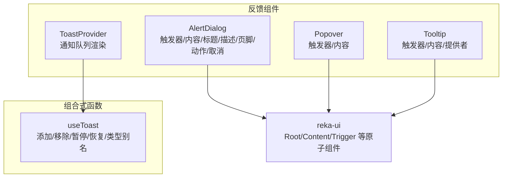
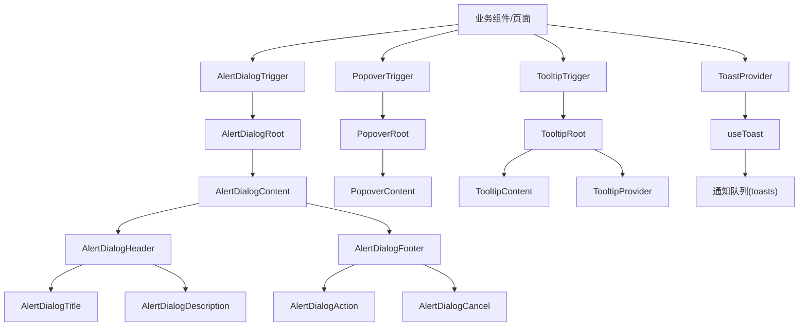
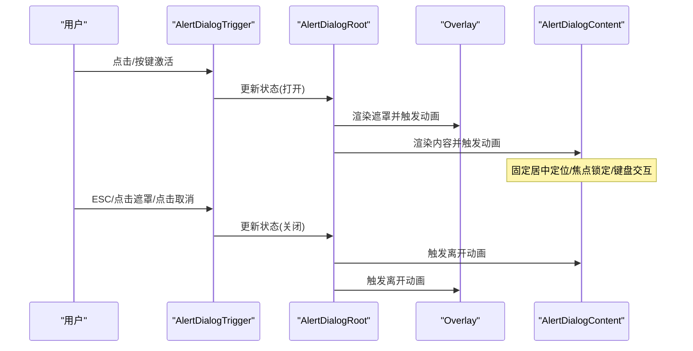
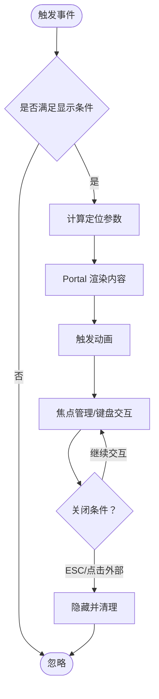
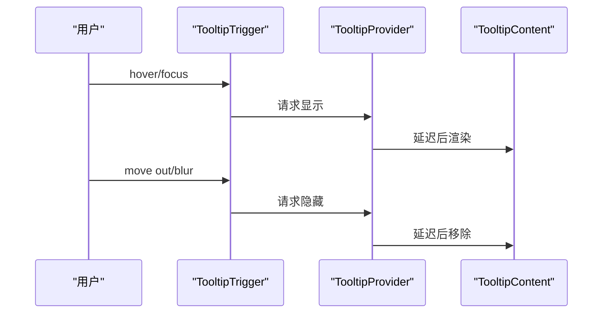
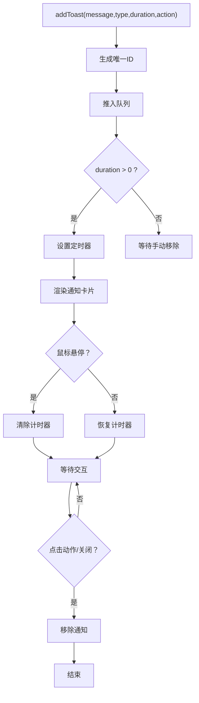
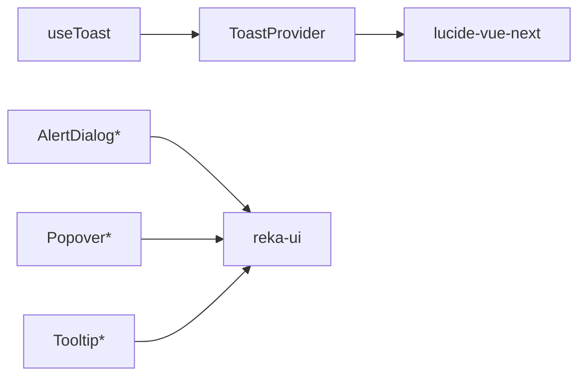

# 反馈组件

<cite>
**本文引用的文件**
- [apps/frontend/src/components/ui/alert-dialog/AlertDialog.vue](file://apps/frontend/src/components/ui/alert-dialog/AlertDialog.vue)
- [apps/frontend/src/components/ui/alert-dialog/AlertDialogContent.vue](file://apps/frontend/src/components/ui/alert-dialog/AlertDialogContent.vue)
- [apps/frontend/src/components/ui/alert-dialog/AlertDialogHeader.vue](file://apps/frontend/src/components/ui/alert-dialog/AlertDialogHeader.vue)
- [apps/frontend/src/components/ui/alert-dialog/AlertDialogTitle.vue](file://apps/frontend/src/components/ui/alert-dialog/AlertDialogTitle.vue)
- [apps/frontend/src/components/ui/alert-dialog/AlertDialogDescription.vue](file://apps/frontend/src/components/ui/alert-dialog/AlertDialogDescription.vue)
- [apps/frontend/src/components/ui/alert-dialog/AlertDialogFooter.vue](file://apps/frontend/src/components/ui/alert-dialog/AlertDialogFooter.vue)
- [apps/frontend/src/components/ui/alert-dialog/AlertDialogAction.vue](file://apps/frontend/src/components/ui/alert-dialog/AlertDialogAction.vue)
- [apps/frontend/src/components/ui/alert-dialog/AlertDialogCancel.vue](file://apps/frontend/src/components/ui/alert-dialog/AlertDialogCancel.vue)
- [apps/frontend/src/components/ui/alert-dialog/AlertDialogTrigger.vue](file://apps/frontend/src/components/ui/alert-dialog/AlertDialogTrigger.vue)
- [apps/frontend/src/components/ui/alert-dialog/index.ts](file://apps/frontend/src/components/ui/alert-dialog/index.ts)
- [apps/frontend/src/components/ui/popover/Popover.vue](file://apps/frontend/src/components/ui/popover/Popover.vue)
- [apps/frontend/src/components/ui/popover/index.ts](file://apps/frontend/src/components/ui/popover/index.ts)
- [apps/frontend/src/components/ui/tooltip/Tooltip.vue](file://apps/frontend/src/components/ui/tooltip/Tooltip.vue)
- [apps/frontend/src/components/ui/tooltip/index.ts](file://apps/frontend/src/components/ui/tooltip/index.ts)
- [apps/frontend/src/components/ui/ToastProvider.vue](file://apps/frontend/src/components/ui/ToastProvider.vue)
- [apps/frontend/src/composables/useToast.ts](file://apps/frontend/src/composables/useToast.ts)
</cite>

## 目录
1. [简介](#简介)
2. [项目结构](#项目结构)
3. [核心组件](#核心组件)
4. [架构总览](#架构总览)
5. [详细组件分析](#详细组件分析)
6. [依赖关系分析](#依赖关系分析)
7. [性能考量](#性能考量)
8. [故障排查指南](#故障排查指南)
9. [结论](#结论)
10. [附录](#附录)

## 简介
本文件聚焦于前端应用中的用户反馈类UI组件，系统性解析以下组件的实现机制与使用方法：
- 对话框：AlertDialog（含触发器、内容容器、标题、描述、页脚、动作按钮、取消按钮）
- 气泡提示：Popover（触发器、内容）与 Tooltip（触发器、内容、提供者）
- 通知：ToastProvider 与 useToast 组合

重点覆盖：
- 对话框的模态管理、背景遮罩、焦点锁定、键盘交互支持
- 气泡提示的定位算法、显示时机、内容渲染、动画效果
- Toast 通知系统的消息队列管理、自动消失、手动控制、位置配置
- 反馈组件的可访问性实现：ARIA 标签、屏幕阅读器支持、键盘导航
- 实际应用场景示例：确认对话框、上下文菜单、帮助提示、状态通知
- 性能考虑与用户体验优化建议

## 项目结构
反馈组件主要位于前端应用的 UI 组件目录中，并通过 reka-ui 提供的原子能力进行组合；Toast 通知通过组合式函数 useToast 管理状态并在 ToastProvider 中渲染。

图表来源
- [apps/frontend/src/components/ui/alert-dialog/AlertDialog.vue:1-16](file://apps/frontend/src/components/ui/alert-dialog/AlertDialog.vue#L1-L16)
- [apps/frontend/src/components/ui/popover/Popover.vue:1-20](file://apps/frontend/src/components/ui/popover/Popover.vue#L1-L20)
- [apps/frontend/src/components/ui/tooltip/Tooltip.vue:1-16](file://apps/frontend/src/components/ui/tooltip/Tooltip.vue#L1-L16)
- [apps/frontend/src/components/ui/ToastProvider.vue:1-81](file://apps/frontend/src/components/ui/ToastProvider.vue#L1-L81)
- [apps/frontend/src/composables/useToast.ts:1-87](file://apps/frontend/src/composables/useToast.ts#L1-L87)

章节来源
- [apps/frontend/src/components/ui/alert-dialog/index.ts:1-10](file://apps/frontend/src/components/ui/alert-dialog/index.ts#L1-L10)
- [apps/frontend/src/components/ui/popover/index.ts:1-4](file://apps/frontend/src/components/ui/popover/index.ts#L1-L4)
- [apps/frontend/src/components/ui/tooltip/index.ts:1-5](file://apps/frontend/src/components/ui/tooltip/index.ts#L1-L5)

## 核心组件
- AlertDialog：基于 reka-ui 的 AlertDialogRoot，通过转发属性与事件，组合 AlertDialogTrigger、AlertDialogContent、AlertDialogHeader/Title/Description、AlertDialogFooter、AlertDialogAction、AlertDialogCancel 等子组件，形成完整的确认/警示对话框。
- Popover：基于 reka-ui 的 PopoverRoot，组合 PopoverTrigger 与 PopoverContent，用于上下文菜单或辅助信息面板。
- Tooltip：基于 reka-ui 的 TooltipRoot，组合 TooltipTrigger 与 TooltipContent，并通过 TooltipProvider 配置全局行为（如延迟、禁用策略等）。
- ToastProvider：基于 useToast 组合式函数，维护通知队列，渲染带图标、颜色主题、过渡动画的通知卡片，支持手动关闭、动作按钮回调、悬停暂停/恢复。

章节来源
- [apps/frontend/src/components/ui/alert-dialog/AlertDialog.vue:1-16](file://apps/frontend/src/components/ui/alert-dialog/AlertDialog.vue#L1-L16)
- [apps/frontend/src/components/ui/popover/Popover.vue:1-20](file://apps/frontend/src/components/ui/popover/Popover.vue#L1-L20)
- [apps/frontend/src/components/ui/tooltip/Tooltip.vue:1-16](file://apps/frontend/src/components/ui/tooltip/Tooltip.vue#L1-L16)
- [apps/frontend/src/components/ui/ToastProvider.vue:1-81](file://apps/frontend/src/components/ui/ToastProvider.vue#L1-L81)
- [apps/frontend/src/composables/useToast.ts:1-87](file://apps/frontend/src/composables/useToast.ts#L1-L87)

## 架构总览
下图展示了反馈组件在应用中的组织方式与数据流：

图表来源
- [apps/frontend/src/components/ui/alert-dialog/AlertDialogTrigger.vue:1-13](file://apps/frontend/src/components/ui/alert-dialog/AlertDialogTrigger.vue#L1-L13)
- [apps/frontend/src/components/ui/alert-dialog/AlertDialogContent.vue:1-39](file://apps/frontend/src/components/ui/alert-dialog/AlertDialogContent.vue#L1-L39)
- [apps/frontend/src/components/ui/alert-dialog/AlertDialogHeader.vue:1-15](file://apps/frontend/src/components/ui/alert-dialog/AlertDialogHeader.vue#L1-L15)
- [apps/frontend/src/components/ui/alert-dialog/AlertDialogTitle.vue:1-18](file://apps/frontend/src/components/ui/alert-dialog/AlertDialogTitle.vue#L1-L18)
- [apps/frontend/src/components/ui/alert-dialog/AlertDialogDescription.vue:1-21](file://apps/frontend/src/components/ui/alert-dialog/AlertDialogDescription.vue#L1-L21)
- [apps/frontend/src/components/ui/alert-dialog/AlertDialogFooter.vue:1-15](file://apps/frontend/src/components/ui/alert-dialog/AlertDialogFooter.vue#L1-L15)
- [apps/frontend/src/components/ui/alert-dialog/AlertDialogAction.vue:1-19](file://apps/frontend/src/components/ui/alert-dialog/AlertDialogAction.vue#L1-L19)
- [apps/frontend/src/components/ui/alert-dialog/AlertDialogCancel.vue:1-22](file://apps/frontend/src/components/ui/alert-dialog/AlertDialogCancel.vue#L1-L22)
- [apps/frontend/src/components/ui/popover/Popover.vue:1-20](file://apps/frontend/src/components/ui/popover/Popover.vue#L1-L20)
- [apps/frontend/src/components/ui/tooltip/Tooltip.vue:1-16](file://apps/frontend/src/components/ui/tooltip/Tooltip.vue#L1-L16)
- [apps/frontend/src/components/ui/ToastProvider.vue:1-81](file://apps/frontend/src/components/ui/ToastProvider.vue#L1-L81)
- [apps/frontend/src/composables/useToast.ts:1-87](file://apps/frontend/src/composables/useToast.ts#L1-L87)

## 详细组件分析

### 对话框 AlertDialog
- 组成与职责
  - 触发器：负责打开/关闭对话框的状态切换
  - 内容容器：承载遮罩层与对话框主体，处理定位与动画
  - 头部/标题/描述：组织标题与说明文本
  - 页脚/动作/取消：放置操作按钮，遵循无障碍与键盘导航约定
- 模态管理与遮罩
  - 使用 Portal 将内容挂载到指定容器，Overlay 背景遮罩具备淡入/淡出动画
  - 容器固定定位并使用层级 z-index，确保在所有内容之上
- 焦点锁定与键盘交互
  - 通过 reka-ui 的 Root/Content 原子组件实现焦点捕获与返回，Tab 切换在对话框内循环
  - ESC 关闭由触发器或内容容器统一处理
- 动画与过渡
  - 打开/关闭分别使用进入/离开动画类，包含淡入/缩放/位移等组合
- 可访问性
  - 标题与描述分别映射至对应语义元素，便于屏幕阅读器识别
  - 按钮具备可读性标签与键盘可达性

图表来源
- [apps/frontend/src/components/ui/alert-dialog/AlertDialogTrigger.vue:1-13](file://apps/frontend/src/components/ui/alert-dialog/AlertDialogTrigger.vue#L1-L13)
- [apps/frontend/src/components/ui/alert-dialog/AlertDialogContent.vue:1-39](file://apps/frontend/src/components/ui/alert-dialog/AlertDialogContent.vue#L1-L39)
- [apps/frontend/src/components/ui/alert-dialog/AlertDialogHeader.vue:1-15](file://apps/frontend/src/components/ui/alert-dialog/AlertDialogHeader.vue#L1-L15)
- [apps/frontend/src/components/ui/alert-dialog/AlertDialogTitle.vue:1-18](file://apps/frontend/src/components/ui/alert-dialog/AlertDialogTitle.vue#L1-L18)
- [apps/frontend/src/components/ui/alert-dialog/AlertDialogDescription.vue:1-21](file://apps/frontend/src/components/ui/alert-dialog/AlertDialogDescription.vue#L1-L21)
- [apps/frontend/src/components/ui/alert-dialog/AlertDialogFooter.vue:1-15](file://apps/frontend/src/components/ui/alert-dialog/AlertDialogFooter.vue#L1-L15)
- [apps/frontend/src/components/ui/alert-dialog/AlertDialogAction.vue:1-19](file://apps/frontend/src/components/ui/alert-dialog/AlertDialogAction.vue#L1-L19)
- [apps/frontend/src/components/ui/alert-dialog/AlertDialogCancel.vue:1-22](file://apps/frontend/src/components/ui/alert-dialog/AlertDialogCancel.vue#L1-L22)

章节来源
- [apps/frontend/src/components/ui/alert-dialog/AlertDialog.vue:1-16](file://apps/frontend/src/components/ui/alert-dialog/AlertDialog.vue#L1-L16)
- [apps/frontend/src/components/ui/alert-dialog/AlertDialogContent.vue:1-39](file://apps/frontend/src/components/ui/alert-dialog/AlertDialogContent.vue#L1-L39)
- [apps/frontend/src/components/ui/alert-dialog/AlertDialogHeader.vue:1-15](file://apps/frontend/src/components/ui/alert-dialog/AlertDialogHeader.vue#L1-L15)
- [apps/frontend/src/components/ui/alert-dialog/AlertDialogTitle.vue:1-18](file://apps/frontend/src/components/ui/alert-dialog/AlertDialogTitle.vue#L1-L18)
- [apps/frontend/src/components/ui/alert-dialog/AlertDialogDescription.vue:1-21](file://apps/frontend/src/components/ui/alert-dialog/AlertDialogDescription.vue#L1-L21)
- [apps/frontend/src/components/ui/alert-dialog/AlertDialogFooter.vue:1-15](file://apps/frontend/src/components/ui/alert-dialog/AlertDialogFooter.vue#L1-L15)
- [apps/frontend/src/components/ui/alert-dialog/AlertDialogAction.vue:1-19](file://apps/frontend/src/components/ui/alert-dialog/AlertDialogAction.vue#L1-L19)
- [apps/frontend/src/components/ui/alert-dialog/AlertDialogCancel.vue:1-22](file://apps/frontend/src/components/ui/alert-dialog/AlertDialogCancel.vue#L1-L22)
- [apps/frontend/src/components/ui/alert-dialog/index.ts:1-10](file://apps/frontend/src/components/ui/alert-dialog/index.ts#L1-L10)

### 气泡提示 Popover
- 组成与职责
  - 触发器：点击/聚焦/长按等事件触发显示
  - 内容：承载上下文菜单或辅助信息，支持定位与边界检测
- 定位算法与显示时机
  - 基于 reka-ui 的定位策略，结合触发元素与内容尺寸，自动选择最佳方位
  - 显示时机：触发器事件（如 click/mouseenter/focus）后立即呈现
- 内容渲染与动画
  - 通过 Portal 渲染至目标容器，避免被父级裁剪
  - 进入/离开动画类控制显隐过渡
- 键盘与可访问性
  - 支持 Tab 导航与 ESC 关闭
  - 屏幕阅读器可读性由触发器与内容的语义标签保证

图表来源
- [apps/frontend/src/components/ui/popover/Popover.vue:1-20](file://apps/frontend/src/components/ui/popover/Popover.vue#L1-L20)

章节来源
- [apps/frontend/src/components/ui/popover/Popover.vue:1-20](file://apps/frontend/src/components/ui/popover/Popover.vue#L1-L20)
- [apps/frontend/src/components/ui/popover/index.ts:1-4](file://apps/frontend/src/components/ui/popover/index.ts#L1-L4)

### 工具提示 Tooltip
- 组成与职责
  - 触发器：hover/focus 等事件触发
  - 内容：简短帮助文本，支持延迟显示/隐藏
  - 提供者：统一配置延迟、禁用全局策略、多实例协调
- 显示时机与定位
  - 默认延迟显示，移出触发区域或失焦后延迟隐藏
  - 定位与 Popover 类似，依据触发元素与内容尺寸自动适配
- 动画与样式
  - 使用过渡类实现平滑出现/消失
  - 主题色与阴影根据类型区分
- 可访问性
  - 文本内容作为 aria-label 或 role="tooltip" 的替代内容
  - 键盘可达与焦点顺序遵循标准

图表来源
- [apps/frontend/src/components/ui/tooltip/Tooltip.vue:1-16](file://apps/frontend/src/components/ui/tooltip/Tooltip.vue#L1-L16)
- [apps/frontend/src/components/ui/tooltip/index.ts:1-5](file://apps/frontend/src/components/ui/tooltip/index.ts#L1-L5)

章节来源
- [apps/frontend/src/components/ui/tooltip/Tooltip.vue:1-16](file://apps/frontend/src/components/ui/tooltip/Tooltip.vue#L1-L16)
- [apps/frontend/src/components/ui/tooltip/index.ts:1-5](file://apps/frontend/src/components/ui/tooltip/index.ts#L1-L5)

### 通知 ToastProvider 与 useToast
- 数据模型
  - 消息对象包含唯一 id、消息文本、类型（成功/错误/信息/警告）、持续时间、计时器句柄、可选动作按钮
- 队列管理
  - 使用响应式数组维护通知列表，支持并发多条通知
- 自动消失与手动控制
  - 添加时启动定时器，超时自动移除
  - 悬停时暂停计时器，移开后恢复剩余时长
  - 支持手动移除与动作按钮回调后移除
- 位置与外观
  - 固定定位在视口顶部中央，垂直堆叠，最大宽度自适应
  - 不同类型使用不同边框/文字/阴影色，图标随类型变化
- 动画与交互
  - 使用 TransitionGroup 实现进入/离开动画
  - 卡片 hover 时轻微放大与阴影增强

图表来源
- [apps/frontend/src/composables/useToast.ts:1-87](file://apps/frontend/src/composables/useToast.ts#L1-L87)
- [apps/frontend/src/components/ui/ToastProvider.vue:1-81](file://apps/frontend/src/components/ui/ToastProvider.vue#L1-L81)

章节来源
- [apps/frontend/src/composables/useToast.ts:1-87](file://apps/frontend/src/composables/useToast.ts#L1-L87)
- [apps/frontend/src/components/ui/ToastProvider.vue:1-81](file://apps/frontend/src/components/ui/ToastProvider.vue#L1-L81)

## 依赖关系分析
- 组件间耦合
  - AlertDialog 系列组件强耦合于 reka-ui 的 Root/Content/Trigger 等原子组件，通过属性与事件转发保持低耦合封装
  - Popover/Tooltip 同样依赖 reka-ui 的 Root/Content/Trigger，提供一致的可访问性与交互体验
  - ToastProvider 与 useToast 解耦：ToastProvider 仅负责渲染，useToast 仅负责状态与逻辑
- 外部依赖
  - reka-ui：提供基础的可访问性与交互语义
  - VueUse：reactiveOmit 等工具简化属性透传
  - lucide-vue-next：通知图标库
- 潜在环路
  - 当前结构无循环依赖，组件通过组合式函数与 Portal 渲染避免深层耦合

图表来源
- [apps/frontend/src/components/ui/ToastProvider.vue:1-81](file://apps/frontend/src/components/ui/ToastProvider.vue#L1-L81)
- [apps/frontend/src/composables/useToast.ts:1-87](file://apps/frontend/src/composables/useToast.ts#L1-L87)
- [apps/frontend/src/components/ui/alert-dialog/AlertDialog.vue:1-16](file://apps/frontend/src/components/ui/alert-dialog/AlertDialog.vue#L1-L16)
- [apps/frontend/src/components/ui/popover/Popover.vue:1-20](file://apps/frontend/src/components/ui/popover/Popover.vue#L1-L20)
- [apps/frontend/src/components/ui/tooltip/Tooltip.vue:1-16](file://apps/frontend/src/components/ui/tooltip/Tooltip.vue#L1-L16)

章节来源
- [apps/frontend/src/components/ui/alert-dialog/index.ts:1-10](file://apps/frontend/src/components/ui/alert-dialog/index.ts#L1-L10)
- [apps/frontend/src/components/ui/popover/index.ts:1-4](file://apps/frontend/src/components/ui/popover/index.ts#L1-L4)
- [apps/frontend/src/components/ui/tooltip/index.ts:1-5](file://apps/frontend/src/components/ui/tooltip/index.ts#L1-L5)

## 性能考量
- 对话框与气泡提示
  - 使用 Portal 减少 DOM 层级嵌套，避免布局抖动
  - 动画使用 CSS 过渡，尽量避免 JS 计算密集操作
  - 控制内容复杂度，避免在 Overlay/Content 中执行重任务
- 工具提示
  - 合理设置延迟阈值，减少频繁创建/销毁
  - 在大量触发器场景下，考虑节流/防抖
- 通知 Toast
  - 队列长度限制与过期策略，避免无限增长
  - 悬停暂停计时器时注意内存释放
  - 图标与阴影使用轻量级 SVG，避免大体积资源
- 可访问性与性能平衡
  - ARIA 标签与键盘导航不应引入额外渲染成本
  - 为屏幕阅读器服务的文本应简洁明确，避免重复冗余

## 故障排查指南
- 对话框无法关闭
  - 检查触发器是否正确绑定事件，Root/Content 是否接收状态更新
  - 确认 ESC/遮罩点击事件未被上层阻止
- 焦点异常
  - 确保内容内存在可聚焦元素，且关闭后焦点返回触发器
- 气泡提示不显示
  - 检查触发事件是否正确，Portal 容器是否存在
  - 确认定位计算未被父级 overflow 影响
- 工具提示延迟无效
  - 核对 Provider 的延迟配置与内容渲染时机
- 通知不消失或重复
  - 检查定时器句柄是否正确清理，ID 生成是否唯一
  - 悬停暂停/恢复逻辑是否与剩余时长一致

章节来源
- [apps/frontend/src/components/ui/alert-dialog/AlertDialogContent.vue:1-39](file://apps/frontend/src/components/ui/alert-dialog/AlertDialogContent.vue#L1-L39)
- [apps/frontend/src/components/ui/ToastProvider.vue:1-81](file://apps/frontend/src/components/ui/ToastProvider.vue#L1-L81)
- [apps/frontend/src/composables/useToast.ts:1-87](file://apps/frontend/src/composables/useToast.ts#L1-L87)

## 结论
本项目通过 reka-ui 原子组件与组合式函数 useToast，构建了高可访问性、可扩展的反馈体系。AlertDialog 提供严谨的模态交互与无障碍保障；Popover/Tooltip 提供灵活的上下文提示；ToastProvider 以简洁的队列与动画实现高效的通知体验。建议在实际使用中关注性能与可访问性的平衡，合理配置延迟与定位策略，并在复杂场景下增加节流与资源控制。

## 附录
- 实际应用场景示例（路径指引）
  - 确认对话框：参考 AlertDialogTrigger → AlertDialogRoot → AlertDialogContent → AlertDialogFooter → AlertDialogAction/AlertDialogCancel 的组合使用
    - [apps/frontend/src/components/ui/alert-dialog/AlertDialogTrigger.vue:1-13](file://apps/frontend/src/components/ui/alert-dialog/AlertDialogTrigger.vue#L1-L13)
    - [apps/frontend/src/components/ui/alert-dialog/AlertDialogContent.vue:1-39](file://apps/frontend/src/components/ui/alert-dialog/AlertDialogContent.vue#L1-L39)
    - [apps/frontend/src/components/ui/alert-dialog/AlertDialogFooter.vue:1-15](file://apps/frontend/src/components/ui/alert-dialog/AlertDialogFooter.vue#L1-L15)
    - [apps/frontend/src/components/ui/alert-dialog/AlertDialogAction.vue:1-19](file://apps/frontend/src/components/ui/alert-dialog/AlertDialogAction.vue#L1-L19)
    - [apps/frontend/src/components/ui/alert-dialog/AlertDialogCancel.vue:1-22](file://apps/frontend/src/components/ui/alert-dialog/AlertDialogCancel.vue#L1-L22)
  - 上下文菜单：参考 PopoverTrigger → PopoverRoot → PopoverContent
    - [apps/frontend/src/components/ui/popover/Popover.vue:1-20](file://apps/frontend/src/components/ui/popover/Popover.vue#L1-L20)
  - 帮助提示：参考 TooltipTrigger → TooltipRoot → TooltipContent，必要时配置 TooltipProvider
    - [apps/frontend/src/components/ui/tooltip/Tooltip.vue:1-16](file://apps/frontend/src/components/ui/tooltip/Tooltip.vue#L1-L16)
    - [apps/frontend/src/components/ui/tooltip/index.ts:1-5](file://apps/frontend/src/components/ui/tooltip/index.ts#L1-L5)
  - 状态通知：通过 useToast 添加不同类型通知，ToastProvider 统一渲染
    - [apps/frontend/src/composables/useToast.ts:1-87](file://apps/frontend/src/composables/useToast.ts#L1-L87)
    - [apps/frontend/src/components/ui/ToastProvider.vue:1-81](file://apps/frontend/src/components/ui/ToastProvider.vue#L1-L81)