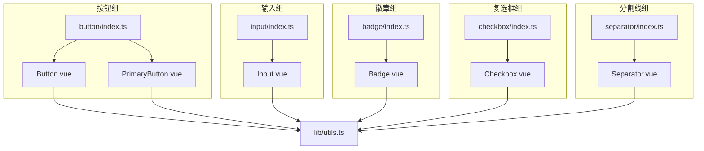
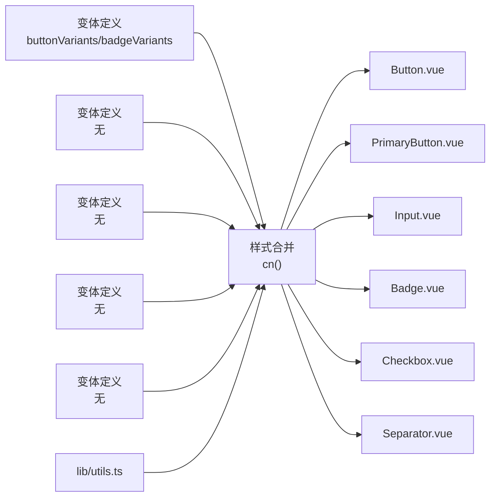
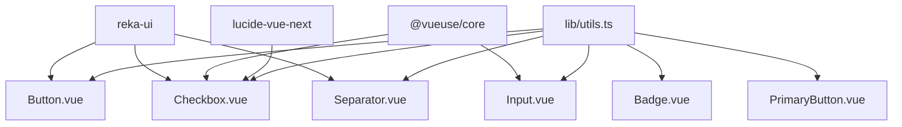

# 基础组件

<cite>
**本文引用的文件**
- [apps/frontend/src/components/ui/button/Button.vue](file://apps/frontend/src/components/ui/button/Button.vue)
- [apps/frontend/src/components/ui/button/PrimaryButton.vue](file://apps/frontend/src/components/ui/button/PrimaryButton.vue)
- [apps/frontend/src/components/ui/button/index.ts](file://apps/frontend/src/components/ui/button/index.ts)
- [apps/frontend/src/components/ui/input/Input.vue](file://apps/frontend/src/components/ui/input/Input.vue)
- [apps/frontend/src/components/ui/input/index.ts](file://apps/frontend/src/components/ui/input/index.ts)
- [apps/frontend/src/components/ui/badge/Badge.vue](file://apps/frontend/src/components/ui/badge/Badge.vue)
- [apps/frontend/src/components/ui/badge/index.ts](file://apps/frontend/src/components/ui/badge/index.ts)
- [apps/frontend/src/components/ui/checkbox/Checkbox.vue](file://apps/frontend/src/components/ui/checkbox/Checkbox.vue)
- [apps/frontend/src/components/ui/checkbox/index.ts](file://apps/frontend/src/components/ui/checkbox/index.ts)
- [apps/frontend/src/components/ui/separator/Separator.vue](file://apps/frontend/src/components/ui/separator/Separator.vue)
- [apps/frontend/src/components/ui/separator/index.ts](file://apps/frontend/src/components/ui/separator/index.ts)
- [apps/frontend/src/lib/utils.ts](file://apps/frontend/src/lib/utils.ts)
- [apps/frontend/tests/components/ui/button/Button.spec.ts](file://apps/frontend/tests/components/ui/button/Button.spec.ts)
</cite>

## 目录
1. [简介](#简介)
2. [项目结构](#项目结构)
3. [核心组件](#核心组件)
4. [架构总览](#架构总览)
5. [详细组件分析](#详细组件分析)
6. [依赖关系分析](#依赖关系分析)
7. [性能考量](#性能考量)
8. [故障排查指南](#故障排查指南)
9. [结论](#结论)
10. [附录](#附录)

## 简介
本文件聚焦于前端组件库中的基础UI组件，系统梳理 Button、Input、Badge、Checkbox、Separator 的实现原理与使用方法，覆盖 props 接口、事件系统、插槽配置、样式定制选项，并阐释设计原则（语义化HTML、无障碍访问、响应式布局）。同时提供可直接定位到源码路径的“示例片段路径”，便于在工程中快速查阅与复用。

## 项目结构
基础组件位于前端应用的 UI 组件目录下，采用按功能分层的组织方式：每个组件独立一个目录，包含组件实现与变体定义（如按钮），并通过统一的 index.ts 暴露导出。

图表来源
- [apps/frontend/src/components/ui/button/Button.vue:1-32](file://apps/frontend/src/components/ui/button/Button.vue#L1-L32)
- [apps/frontend/src/components/ui/button/PrimaryButton.vue:1-62](file://apps/frontend/src/components/ui/button/PrimaryButton.vue#L1-L62)
- [apps/frontend/src/components/ui/button/index.ts:1-42](file://apps/frontend/src/components/ui/button/index.ts#L1-L42)
- [apps/frontend/src/components/ui/input/Input.vue:1-42](file://apps/frontend/src/components/ui/input/Input.vue#L1-L42)
- [apps/frontend/src/components/ui/input/index.ts:1-2](file://apps/frontend/src/components/ui/input/index.ts#L1-L2)
- [apps/frontend/src/components/ui/badge/Badge.vue:1-18](file://apps/frontend/src/components/ui/badge/Badge.vue#L1-L18)
- [apps/frontend/src/components/ui/badge/index.ts:1-26](file://apps/frontend/src/components/ui/badge/index.ts#L1-L26)
- [apps/frontend/src/components/ui/checkbox/Checkbox.vue:1-34](file://apps/frontend/src/components/ui/checkbox/Checkbox.vue#L1-L34)
- [apps/frontend/src/components/ui/checkbox/index.ts:1-2](file://apps/frontend/src/components/ui/checkbox/index.ts#L1-L2)
- [apps/frontend/src/components/ui/separator/Separator.vue:1-29](file://apps/frontend/src/components/ui/separator/Separator.vue#L1-L29)
- [apps/frontend/src/components/ui/separator/index.ts:1-2](file://apps/frontend/src/components/ui/separator/index.ts#L1-L2)
- [apps/frontend/src/lib/utils.ts:1-33](file://apps/frontend/src/lib/utils.ts#L1-L33)

章节来源
- [apps/frontend/src/components/ui/button/index.ts:1-42](file://apps/frontend/src/components/ui/button/index.ts#L1-L42)
- [apps/frontend/src/components/ui/input/index.ts:1-2](file://apps/frontend/src/components/ui/input/index.ts#L1-L2)
- [apps/frontend/src/components/ui/badge/index.ts:1-26](file://apps/frontend/src/components/ui/badge/index.ts#L1-L26)
- [apps/frontend/src/components/ui/checkbox/index.ts:1-2](file://apps/frontend/src/components/ui/checkbox/index.ts#L1-L2)
- [apps/frontend/src/components/ui/separator/index.ts:1-2](file://apps/frontend/src/components/ui/separator/index.ts#L1-L2)

## 核心组件
- Button：支持多种变体与尺寸，可透传原生属性；通过 reka-ui 的 Primitive 实现语义化渲染。
- PrimaryButton：强调态按钮，内置加载态与全宽选项，提供视觉反馈动画。
- Input：受控/非受控输入封装，自动生成 ID，支持 name、默认值与 v-model 双向绑定。
- Badge：轻量标签，基于变体系统提供多风格。
- Checkbox：基于 reka-ui 的复选框，支持指示器插槽与无障碍属性转发。
- Separator：分隔线，支持水平/垂直方向与装饰性语义。

章节来源
- [apps/frontend/src/components/ui/button/Button.vue:1-32](file://apps/frontend/src/components/ui/button/Button.vue#L1-L32)
- [apps/frontend/src/components/ui/button/PrimaryButton.vue:1-62](file://apps/frontend/src/components/ui/button/PrimaryButton.vue#L1-L62)
- [apps/frontend/src/components/ui/input/Input.vue:1-42](file://apps/frontend/src/components/ui/input/Input.vue#L1-L42)
- [apps/frontend/src/components/ui/badge/Badge.vue:1-18](file://apps/frontend/src/components/ui/badge/Badge.vue#L1-L18)
- [apps/frontend/src/components/ui/checkbox/Checkbox.vue:1-34](file://apps/frontend/src/components/ui/checkbox/Checkbox.vue#L1-L34)
- [apps/frontend/src/components/ui/separator/Separator.vue:1-29](file://apps/frontend/src/components/ui/separator/Separator.vue#L1-L29)

## 架构总览
组件遵循“变体定义 + 工具函数 + 组合式封装”的架构模式：
- 变体系统：通过 class-variance-authority 定义样式变体，集中管理类名组合规则。
- 样式合并：通过工具函数合并与去重，避免冲突。
- 组合封装：以 Vue 组合式 API 封装通用逻辑（如 v-model、ID 生成、属性透传）。
- 无障碍与语义：优先使用原生元素或 reka-ui 的语义化组件，确保键盘可达与屏幕阅读器友好。

图表来源
- [apps/frontend/src/components/ui/button/index.ts:7-39](file://apps/frontend/src/components/ui/button/index.ts#L7-L39)
- [apps/frontend/src/components/ui/badge/index.ts:6-23](file://apps/frontend/src/components/ui/badge/index.ts#L6-L23)
- [apps/frontend/src/lib/utils.ts:5-7](file://apps/frontend/src/lib/utils.ts#L5-L7)
- [apps/frontend/src/components/ui/button/Button.vue:24-30](file://apps/frontend/src/components/ui/button/Button.vue#L24-L30)
- [apps/frontend/src/components/ui/button/PrimaryButton.vue:13-22](file://apps/frontend/src/components/ui/button/PrimaryButton.vue#L13-L22)
- [apps/frontend/src/components/ui/input/Input.vue:34-39](file://apps/frontend/src/components/ui/input/Input.vue#L34-L39)
- [apps/frontend/src/components/ui/badge/Badge.vue:14-16](file://apps/frontend/src/components/ui/badge/Badge.vue#L14-L16)
- [apps/frontend/src/components/ui/checkbox/Checkbox.vue:20-25](file://apps/frontend/src/components/ui/checkbox/Checkbox.vue#L20-L25)
- [apps/frontend/src/components/ui/separator/Separator.vue:20-26](file://apps/frontend/src/components/ui/separator/Separator.vue#L20-L26)

## 详细组件分析

### Button 组件
- 设计要点
  - 使用 reka-ui 的 Primitive 渲染，支持 as/asChild 透传原生语义标签。
  - 通过变体系统 buttonVariants 控制外观与尺寸，支持主题色、阴影、悬停/禁用等状态。
  - 默认属性与类型安全：通过 withDefaults 与 TypeScript 接口约束。
- Props 接口
  - as: 原生标签或组件，默认为 button。
  - asChild: 是否将子节点作为渲染树的一部分传递给底层组件。
  - variant: 变体类型，支持 default/destructive/outline/secondary/ghost/link。
  - size: 尺寸类型，支持 default/xs/sm/lg/icon/icon-sm/icon-lg。
  - class: 自定义额外类名。
- 插槽
  - 默认插槽用于放置按钮内容。
- 事件系统
  - 透传底层 Primitive 的事件，保持与原生按钮一致的行为。
- 样式定制
  - 通过 buttonVariants 的变体映射与 cn 合并，支持覆盖默认类名。
- 示例片段路径
  - [按钮变体定义:7-39](file://apps/frontend/src/components/ui/button/index.ts#L7-L39)
  - [按钮组件实现:9-21](file://apps/frontend/src/components/ui/button/Button.vue#L9-L21)
  - [按钮渲染与类名合并:24-30](file://apps/frontend/src/components/ui/button/Button.vue#L24-L30)
- 无障碍与响应式
  - 使用原生 button 语义，具备焦点环与禁用态；响应式尺寸由变体控制。

章节来源
- [apps/frontend/src/components/ui/button/Button.vue:1-32](file://apps/frontend/src/components/ui/button/Button.vue#L1-L32)
- [apps/frontend/src/components/ui/button/index.ts:1-42](file://apps/frontend/src/components/ui/button/index.ts#L1-L42)

### PrimaryButton 组件
- 设计要点
  - 强调态按钮，内置 loading 态与全宽选项。
  - 提供“光晕”动画与过渡效果，增强交互反馈。
- Props 接口
  - loading: 加载态开关。
  - disabled: 禁用态开关。
  - fullWidth: 是否占满容器宽度。
- 插槽
  - 默认插槽：按钮文案。
  - loading 插槽：自定义加载态文案或图标。
- 事件系统
  - 原生 button 行为，支持 click 等事件。
- 样式定制
  - 通过内联类名与 scoped 动画实现，可结合外部 class 覆盖。
- 示例片段路径
  - [强调按钮实现与加载态:10-51](file://apps/frontend/src/components/ui/button/PrimaryButton.vue#L10-L51)
  - [动画定义:55-61](file://apps/frontend/src/components/ui/button/PrimaryButton.vue#L55-L61)

章节来源
- [apps/frontend/src/components/ui/button/PrimaryButton.vue:1-62](file://apps/frontend/src/components/ui/button/PrimaryButton.vue#L1-L62)

### Input 组件
- 设计要点
  - 基于 useVModel 实现 v-model 双向绑定，支持被动更新与默认值。
  - 自动生成唯一 ID，避免表单关联问题。
  - 支持 name、id、其他原生属性透传。
- Props 接口
  - defaultValue: 初始值（非受控模式）。
  - modelValue: 当前值（受控模式）。
  - id/name: 表单标识。
  - class: 自定义类名。
- 事件系统
  - update:modelValue: 更新模型值事件。
- 插槽
  - 无默认插槽。
- 样式定制
  - 内联 Tailwind 类名，支持通过 class 追加或覆盖。
- 示例片段路径
  - [v-model 与 ID 生成:19-25](file://apps/frontend/src/components/ui/input/Input.vue#L19-L25)
  - [输入渲染与类名合并:29-40](file://apps/frontend/src/components/ui/input/Input.vue#L29-L40)

章节来源
- [apps/frontend/src/components/ui/input/Input.vue:1-42](file://apps/frontend/src/components/ui/input/Input.vue#L1-L42)
- [apps/frontend/src/components/ui/input/index.ts:1-2](file://apps/frontend/src/components/ui/input/index.ts#L1-L2)

### Badge 组件
- 设计要点
  - 轻量标签，支持多变体风格。
- Props 接口
  - variant: 变体类型，支持 default/secondary/destructive/outline。
  - class: 自定义类名。
- 插槽
  - 默认插槽：标签内容。
- 事件系统
  - 无事件。
- 样式定制
  - 通过 badgeVariants 控制类名组合。
- 示例片段路径
  - [徽章变体定义:6-23](file://apps/frontend/src/components/ui/badge/index.ts#L6-L23)
  - [徽章渲染:14-16](file://apps/frontend/src/components/ui/badge/Badge.vue#L14-L16)

章节来源
- [apps/frontend/src/components/ui/badge/Badge.vue:1-18](file://apps/frontend/src/components/ui/badge/Badge.vue#L1-L18)
- [apps/frontend/src/components/ui/badge/index.ts:1-26](file://apps/frontend/src/components/ui/badge/index.ts#L1-L26)

### Checkbox 组件
- 设计要点
  - 基于 reka-ui 的 CheckboxRoot/CheckboxIndicator，支持无障碍属性转发与指示器插槽。
  - 通过 cn 合并类名，保持与主题一致的视觉。
- Props 接口
  - 支持 reka-ui 的 CheckboxRootProps，如 checked、disabled、required 等。
  - class: 自定义类名。
- 事件系统
  - 支持 reka-ui 的 CheckboxRootEmits，如 update:checked。
- 插槽
  - 指示器插槽：自定义勾选图标。
- 样式定制
  - 通过内联类名与指示器插槽实现。
- 示例片段路径
  - [复选框渲染与指示器插槽:27-31](file://apps/frontend/src/components/ui/checkbox/Checkbox.vue#L27-L31)

章节来源
- [apps/frontend/src/components/ui/checkbox/Checkbox.vue:1-34](file://apps/frontend/src/components/ui/checkbox/Checkbox.vue#L1-L34)
- [apps/frontend/src/components/ui/checkbox/index.ts:1-2](file://apps/frontend/src/components/ui/checkbox/index.ts#L1-L2)

### Separator 组件
- 设计要点
  - 基于 reka-ui 的 Separator，支持水平/垂直方向与装饰性语义。
- Props 接口
  - orientation: 方向，horizontal/vertical。
  - decorative: 是否为装饰性分隔线。
  - class: 自定义类名。
- 插槽
  - 无默认插槽。
- 事件系统
  - 无事件。
- 样式定制
  - 通过内联类名控制尺寸与方向。
- 示例片段路径
  - [分隔线渲染与方向控制:18-27](file://apps/frontend/src/components/ui/separator/Separator.vue#L18-L27)

章节来源
- [apps/frontend/src/components/ui/separator/Separator.vue:1-29](file://apps/frontend/src/components/ui/separator/Separator.vue#L1-L29)
- [apps/frontend/src/components/ui/separator/index.ts:1-2](file://apps/frontend/src/components/ui/separator/index.ts#L1-L2)

## 依赖关系分析
- 组件间耦合
  - 所有组件均依赖工具函数 cn，用于类名合并与去重，降低耦合度。
  - Button/PrimaryButton 依赖变体定义，形成“样式即接口”的约定。
- 外部依赖
  - reka-ui：提供语义化原语与无障碍能力（Button、Checkbox、Separator）。
  - @vueuse/core：useVModel、useId、reactiveOmit 等组合式工具。
  - lucide-vue-next：图标（Checkbox 指示器）。
- 可能的循环依赖
  - 未见直接循环导入；变体定义与组件实现通过 index.ts 导出，避免相互引用。

图表来源
- [apps/frontend/src/components/ui/button/Button.vue:2-7](file://apps/frontend/src/components/ui/button/Button.vue#L2-L7)
- [apps/frontend/src/components/ui/input/Input.vue:2-5](file://apps/frontend/src/components/ui/input/Input.vue#L2-L5)
- [apps/frontend/src/components/ui/checkbox/Checkbox.vue:2-6](file://apps/frontend/src/components/ui/checkbox/Checkbox.vue#L2-L6)
- [apps/frontend/src/components/ui/separator/Separator.vue:2-5](file://apps/frontend/src/components/ui/separator/Separator.vue#L2-L5)
- [apps/frontend/src/lib/utils.ts:1-7](file://apps/frontend/src/lib/utils.ts#L1-L7)

章节来源
- [apps/frontend/src/components/ui/button/Button.vue:1-32](file://apps/frontend/src/components/ui/button/Button.vue#L1-L32)
- [apps/frontend/src/components/ui/input/Input.vue:1-42](file://apps/frontend/src/components/ui/input/Input.vue#L1-L42)
- [apps/frontend/src/components/ui/checkbox/Checkbox.vue:1-34](file://apps/frontend/src/components/ui/checkbox/Checkbox.vue#L1-L34)
- [apps/frontend/src/components/ui/separator/Separator.vue:1-29](file://apps/frontend/src/components/ui/separator/Separator.vue#L1-L29)
- [apps/frontend/src/lib/utils.ts:1-33](file://apps/frontend/src/lib/utils.ts#L1-L33)

## 性能考量
- 类名合并
  - 使用 cn 合并类名，减少重复与冲突，提升样式计算效率。
- 受控组件
  - Input 使用 useVModel 与被动更新策略，避免不必要的重渲染。
- 变体系统
  - 通过集中定义的变体映射，减少运行时分支判断，提升渲染性能。
- 动画与过渡
  - PrimaryButton 的动画为一次性过渡，注意在大量实例场景下的资源占用。
- 响应式布局
  - 组件内部使用响应式尺寸（如 Button 的 size 变体），避免额外的 JS 计算。

## 故障排查指南
- 输入组件无法双向绑定
  - 确认是否正确使用 v-model 或传入 modelValue 与 update:modelValue。
  - 参考片段路径：[输入组件 v-model 与 ID 生成:19-25](file://apps/frontend/src/components/ui/input/Input.vue#L19-L25)
- 按钮变体不生效
  - 检查 variant/size 是否在变体定义范围内，确认类名合并顺序。
  - 参考片段路径：[按钮变体定义:7-39](file://apps/frontend/src/components/ui/button/index.ts#L7-L39)
- 复选框无障碍属性缺失
  - 确保透传了 required/disabled 等属性，检查 forwarded 逻辑。
  - 参考片段路径：[复选框属性转发:12-14](file://apps/frontend/src/components/ui/checkbox/Checkbox.vue#L12-L14)
- 分隔线方向错误
  - 检查 orientation 设置与内联类名条件判断。
  - 参考片段路径：[分隔线方向控制:20-26](file://apps/frontend/src/components/ui/separator/Separator.vue#L20-L26)
- 测试验证
  - 可参考按钮组件测试用例，验证插槽、变体与尺寸的渲染结果。
  - 参考片段路径：[按钮组件测试:1-39](file://apps/frontend/tests/components/ui/button/Button.spec.ts#L1-L39)

章节来源
- [apps/frontend/src/components/ui/input/Input.vue:19-25](file://apps/frontend/src/components/ui/input/Input.vue#L19-L25)
- [apps/frontend/src/components/ui/button/index.ts:7-39](file://apps/frontend/src/components/ui/button/index.ts#L7-L39)
- [apps/frontend/src/components/ui/checkbox/Checkbox.vue:12-14](file://apps/frontend/src/components/ui/checkbox/Checkbox.vue#L12-L14)
- [apps/frontend/src/components/ui/separator/Separator.vue:20-26](file://apps/frontend/src/components/ui/separator/Separator.vue#L20-L26)
- [apps/frontend/tests/components/ui/button/Button.spec.ts:1-39](file://apps/frontend/tests/components/ui/button/Button.spec.ts#L1-L39)

## 结论
上述基础组件通过“变体系统 + 组合式封装 + 工具函数”的架构，实现了高内聚、低耦合与强扩展性的设计。它们在语义化、无障碍与响应式方面均有明确实践，适合在复杂业务场景中进行组合与复用。建议在团队内统一使用变体定义与工具函数，以保证风格一致性与维护成本可控。

## 附录
- 设计原则速览
  - 语义化：优先使用原生元素或 reka-ui 语义化组件。
  - 无障碍：确保键盘可达、焦点可见、必要时提供 aria-* 属性。
  - 响应式：通过变体与媒体查询适配不同设备。
- 组合与复用策略
  - 将常用组合封装为更高阶组件（如带校验的 Input 组合）。
  - 使用变体系统统一风格，避免硬编码样式。
- 浏览器兼容性
  - reka-ui 与 Vue 3 生态通常具备良好兼容性；如需支持旧版浏览器，请在构建阶段启用相应 polyfill 与转译策略。