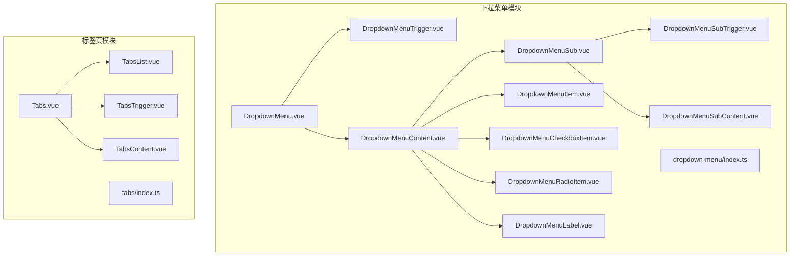
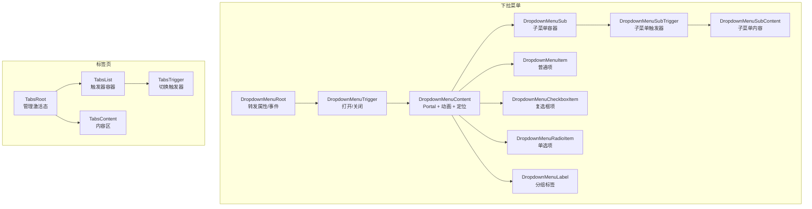
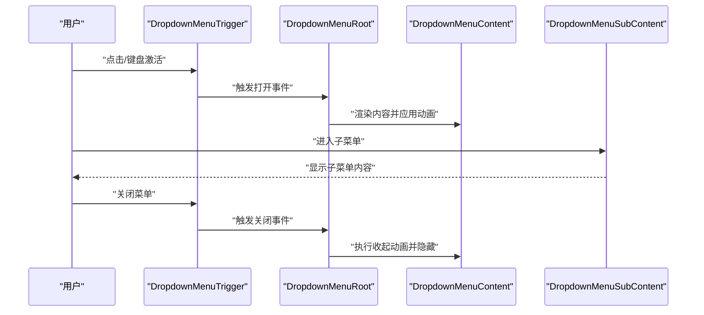
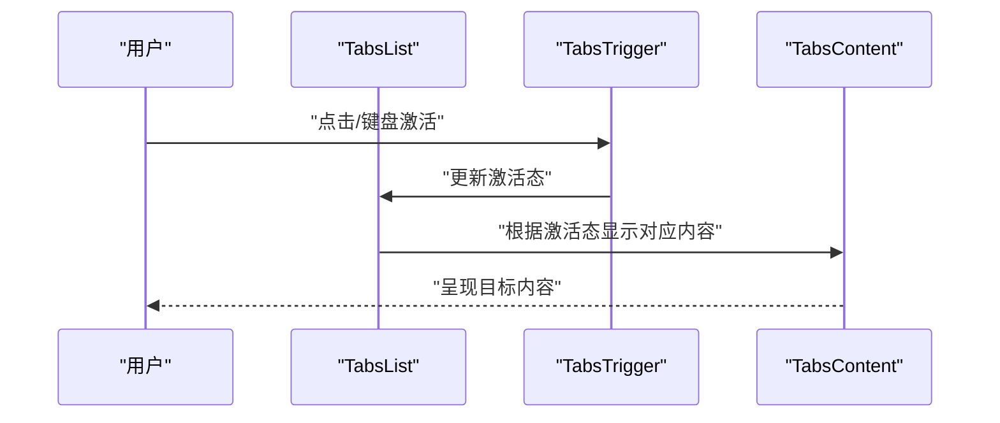
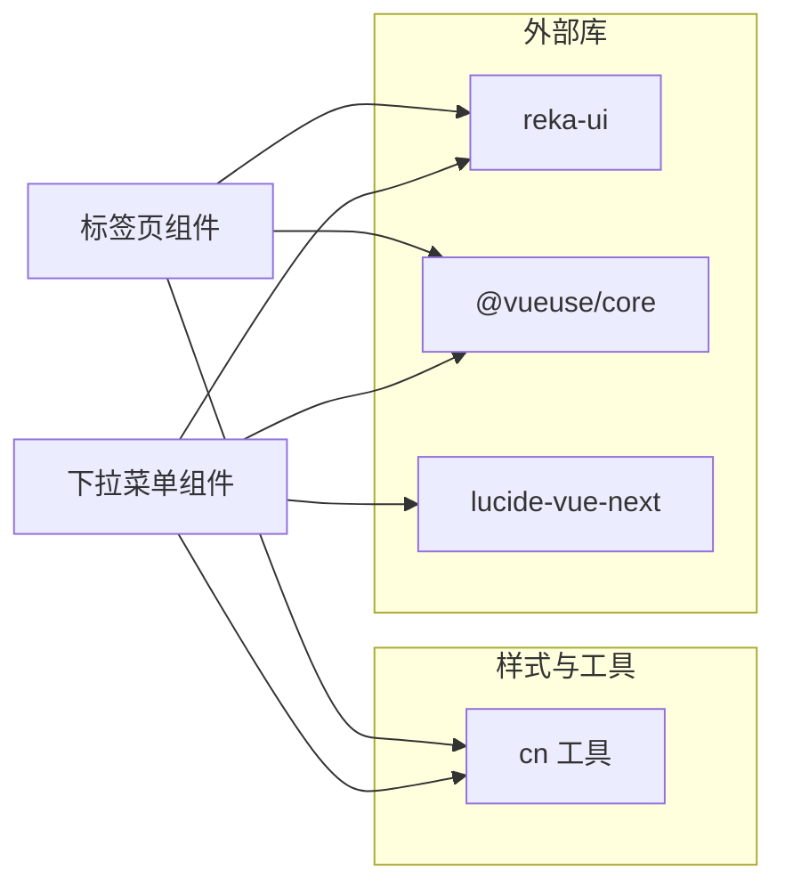

# 导航组件

<cite>
**本文引用的文件**
- [apps/frontend/src/components/ui/dropdown-menu/DropdownMenu.vue](file://apps/frontend/src/components/ui/dropdown-menu/DropdownMenu.vue)
- [apps/frontend/src/components/ui/dropdown-menu/DropdownMenuSub.vue](file://apps/frontend/src/components/ui/dropdown-menu/DropdownMenuSub.vue)
- [apps/frontend/src/components/ui/dropdown-menu/DropdownMenuSubTrigger.vue](file://apps/frontend/src/components/ui/dropdown-menu/DropdownMenuSubTrigger.vue)
- [apps/frontend/src/components/ui/dropdown-menu/DropdownMenuSubContent.vue](file://apps/frontend/src/components/ui/dropdown-menu/DropdownMenuSubContent.vue)
- [apps/frontend/src/components/ui/dropdown-menu/DropdownMenuTrigger.vue](file://apps/frontend/src/components/ui/dropdown-menu/DropdownMenuTrigger.vue)
- [apps/frontend/src/components/ui/dropdown-menu/DropdownMenuContent.vue](file://apps/frontend/src/components/ui/dropdown-menu/DropdownMenuContent.vue)
- [apps/frontend/src/components/ui/dropdown-menu/DropdownMenuItem.vue](file://apps/frontend/src/components/ui/dropdown-menu/DropdownMenuItem.vue)
- [apps/frontend/src/components/ui/dropdown-menu/DropdownMenuCheckboxItem.vue](file://apps/frontend/src/components/ui/dropdown-menu/DropdownMenuCheckboxItem.vue)
- [apps/frontend/src/components/ui/dropdown-menu/DropdownMenuRadioItem.vue](file://apps/frontend/src/components/ui/dropdown-menu/DropdownMenuRadioItem.vue)
- [apps/frontend/src/components/ui/dropdown-menu/DropdownMenuLabel.vue](file://apps/frontend/src/components/ui/dropdown-menu/DropdownMenuLabel.vue)
- [apps/frontend/src/components/ui/dropdown-menu/index.ts](file://apps/frontend/src/components/ui/dropdown-menu/index.ts)
- [apps/frontend/src/components/ui/tabs/Tabs.vue](file://apps/frontend/src/components/ui/tabs/Tabs.vue)
- [apps/frontend/src/components/ui/tabs/TabsList.vue](file://apps/frontend/src/components/ui/tabs/TabsList.vue)
- [apps/frontend/src/components/ui/tabs/TabsTrigger.vue](file://apps/frontend/src/components/ui/tabs/TabsTrigger.vue)
- [apps/frontend/src/components/ui/tabs/TabsContent.vue](file://apps/frontend/src/components/ui/tabs/TabsContent.vue)
- [apps/frontend/src/components/ui/tabs/index.ts](file://apps/frontend/src/components/ui/tabs/index.ts)
</cite>

## 目录
1. [简介](#简介)
2. [项目结构](#项目结构)
3. [核心组件](#核心组件)
4. [架构总览](#架构总览)
5. [详细组件分析](#详细组件分析)
6. [依赖关系分析](#依赖关系分析)
7. [性能考量](#性能考量)
8. [故障排查指南](#故障排查指南)
9. [结论](#结论)
10. [附录](#附录)

## 简介
本文件聚焦于前端应用中的导航相关UI组件，系统性梳理并解析以下能力：
- 下拉菜单（DropdownMenu）：多级子菜单结构、子菜单管理、键盘导航与焦点管理、动画过渡与定位策略。
- 标签页（Tabs）：标签切换机制、内容区域同步、动画过渡效果、无障碍与键盘操作。

文档同时覆盖组件的交互模式（悬停/点击/键盘/焦点）、状态管理、事件传播、可访问性实现，并提供菜单嵌套、标签分组、动态内容加载等高级用法的实践建议与最佳实践。

## 项目结构
导航组件位于前端应用的UI组件目录中，采用按功能域分层组织：
- 下拉菜单模块：以根组件为入口，围绕触发器、内容容器、子菜单、项类型（普通项、复选框、单选项、标签、快捷键、分隔符等）构建完整生态。
- 标签页模块：以根组件为入口，围绕列表、触发器、内容区构建切换体系。

**图表来源**
- [apps/frontend/src/components/ui/dropdown-menu/DropdownMenu.vue:1-16](file://apps/frontend/src/components/ui/dropdown-menu/DropdownMenu.vue#L1-L16)
- [apps/frontend/src/components/ui/dropdown-menu/DropdownMenuTrigger.vue:1-15](file://apps/frontend/src/components/ui/dropdown-menu/DropdownMenuTrigger.vue#L1-L15)
- [apps/frontend/src/components/ui/dropdown-menu/DropdownMenuContent.vue:1-37](file://apps/frontend/src/components/ui/dropdown-menu/DropdownMenuContent.vue#L1-L37)
- [apps/frontend/src/components/ui/dropdown-menu/DropdownMenuSub.vue:1-16](file://apps/frontend/src/components/ui/dropdown-menu/DropdownMenuSub.vue#L1-L16)
- [apps/frontend/src/components/ui/dropdown-menu/DropdownMenuSubTrigger.vue:1-30](file://apps/frontend/src/components/ui/dropdown-menu/DropdownMenuSubTrigger.vue#L1-L30)
- [apps/frontend/src/components/ui/dropdown-menu/DropdownMenuSubContent.vue:1-29](file://apps/frontend/src/components/ui/dropdown-menu/DropdownMenuSubContent.vue#L1-L29)
- [apps/frontend/src/components/ui/dropdown-menu/DropdownMenuItem.vue:1-31](file://apps/frontend/src/components/ui/dropdown-menu/DropdownMenuItem.vue#L1-L31)
- [apps/frontend/src/components/ui/dropdown-menu/DropdownMenuCheckboxItem.vue:1-35](file://apps/frontend/src/components/ui/dropdown-menu/DropdownMenuCheckboxItem.vue#L1-L35)
- [apps/frontend/src/components/ui/dropdown-menu/DropdownMenuRadioItem.vue:1-36](file://apps/frontend/src/components/ui/dropdown-menu/DropdownMenuRadioItem.vue#L1-L36)
- [apps/frontend/src/components/ui/dropdown-menu/DropdownMenuLabel.vue:1-25](file://apps/frontend/src/components/ui/dropdown-menu/DropdownMenuLabel.vue#L1-L25)
- [apps/frontend/src/components/ui/dropdown-menu/index.ts:1-17](file://apps/frontend/src/components/ui/dropdown-menu/index.ts#L1-L17)
- [apps/frontend/src/components/ui/tabs/Tabs.vue:1-16](file://apps/frontend/src/components/ui/tabs/Tabs.vue#L1-L16)
- [apps/frontend/src/components/ui/tabs/TabsList.vue:1-26](file://apps/frontend/src/components/ui/tabs/TabsList.vue#L1-L26)
- [apps/frontend/src/components/ui/tabs/TabsTrigger.vue:1-28](file://apps/frontend/src/components/ui/tabs/TabsTrigger.vue#L1-L28)
- [apps/frontend/src/components/ui/tabs/TabsContent.vue:1-26](file://apps/frontend/src/components/ui/tabs/TabsContent.vue#L1-L26)
- [apps/frontend/src/components/ui/tabs/index.ts:1-5](file://apps/frontend/src/components/ui/tabs/index.ts#L1-L5)

**章节来源**
- [apps/frontend/src/components/ui/dropdown-menu/index.ts:1-17](file://apps/frontend/src/components/ui/dropdown-menu/index.ts#L1-L17)
- [apps/frontend/src/components/ui/tabs/index.ts:1-5](file://apps/frontend/src/components/ui/tabs/index.ts#L1-L5)

## 核心组件
- 下拉菜单根组件：作为上下文容器，转发属性与事件，承载插槽内容。
- 子菜单容器与触发器：支持嵌套展开、定位与动画；触发器负责打开/关闭行为。
- 内容容器：支持侧边偏移、动画入场/出场、Portal 渲染到视口边界，避免被裁剪。
- 项类型：普通项、带指示器的复选框项、带指示器的单选项、带缩进的标签、快捷键、分隔符等。
- 标签页根组件：统一管理当前激活标签与内容同步；列表承载触发器；触发器与内容区一一对应。

以上组件均通过 reka-ui 的原生实现进行封装，保持一致的语义与可访问性特性。

**章节来源**
- [apps/frontend/src/components/ui/dropdown-menu/DropdownMenu.vue:1-16](file://apps/frontend/src/components/ui/dropdown-menu/DropdownMenu.vue#L1-L16)
- [apps/frontend/src/components/ui/dropdown-menu/DropdownMenuSub.vue:1-16](file://apps/frontend/src/components/ui/dropdown-menu/DropdownMenuSub.vue#L1-L16)
- [apps/frontend/src/components/ui/dropdown-menu/DropdownMenuSubTrigger.vue:1-30](file://apps/frontend/src/components/ui/dropdown-menu/DropdownMenuSubTrigger.vue#L1-L30)
- [apps/frontend/src/components/ui/dropdown-menu/DropdownMenuSubContent.vue:1-29](file://apps/frontend/src/components/ui/dropdown-menu/DropdownMenuSubContent.vue#L1-L29)
- [apps/frontend/src/components/ui/dropdown-menu/DropdownMenuTrigger.vue:1-15](file://apps/frontend/src/components/ui/dropdown-menu/DropdownMenuTrigger.vue#L1-L15)
- [apps/frontend/src/components/ui/dropdown-menu/DropdownMenuContent.vue:1-37](file://apps/frontend/src/components/ui/dropdown-menu/DropdownMenuContent.vue#L1-L37)
- [apps/frontend/src/components/ui/dropdown-menu/DropdownMenuItem.vue:1-31](file://apps/frontend/src/components/ui/dropdown-menu/DropdownMenuItem.vue#L1-L31)
- [apps/frontend/src/components/ui/dropdown-menu/DropdownMenuCheckboxItem.vue:1-35](file://apps/frontend/src/components/ui/dropdown-menu/DropdownMenuCheckboxItem.vue#L1-L35)
- [apps/frontend/src/components/ui/dropdown-menu/DropdownMenuRadioItem.vue:1-36](file://apps/frontend/src/components/ui/dropdown-menu/DropdownMenuRadioItem.vue#L1-L36)
- [apps/frontend/src/components/ui/dropdown-menu/DropdownMenuLabel.vue:1-25](file://apps/frontend/src/components/ui/dropdown-menu/DropdownMenuLabel.vue#L1-L25)
- [apps/frontend/src/components/ui/tabs/Tabs.vue:1-16](file://apps/frontend/src/components/ui/tabs/Tabs.vue#L1-L16)
- [apps/frontend/src/components/ui/tabs/TabsList.vue:1-26](file://apps/frontend/src/components/ui/tabs/TabsList.vue#L1-L26)
- [apps/frontend/src/components/ui/tabs/TabsTrigger.vue:1-28](file://apps/frontend/src/components/ui/tabs/TabsTrigger.vue#L1-L28)
- [apps/frontend/src/components/ui/tabs/TabsContent.vue:1-26](file://apps/frontend/src/components/ui/tabs/TabsContent.vue#L1-L26)

## 架构总览
下拉菜单与标签页均采用“根组件 + 列表/触发器 + 内容”的分层设计，通过 reka-ui 提供的上下文与事件机制实现状态共享与行为协调。下拉菜单通过 Portal 将内容渲染至视口，确保在复杂布局中不被遮挡或裁剪；标签页通过数据绑定实现触发器与内容区的同步。

**图表来源**
- [apps/frontend/src/components/ui/dropdown-menu/DropdownMenu.vue:1-16](file://apps/frontend/src/components/ui/dropdown-menu/DropdownMenu.vue#L1-L16)
- [apps/frontend/src/components/ui/dropdown-menu/DropdownMenuTrigger.vue:1-15](file://apps/frontend/src/components/ui/dropdown-menu/DropdownMenuTrigger.vue#L1-L15)
- [apps/frontend/src/components/ui/dropdown-menu/DropdownMenuContent.vue:1-37](file://apps/frontend/src/components/ui/dropdown-menu/DropdownMenuContent.vue#L1-L37)
- [apps/frontend/src/components/ui/dropdown-menu/DropdownMenuSub.vue:1-16](file://apps/frontend/src/components/ui/dropdown-menu/DropdownMenuSub.vue#L1-L16)
- [apps/frontend/src/components/ui/dropdown-menu/DropdownMenuSubTrigger.vue:1-30](file://apps/frontend/src/components/ui/dropdown-menu/DropdownMenuSubTrigger.vue#L1-L30)
- [apps/frontend/src/components/ui/dropdown-menu/DropdownMenuSubContent.vue:1-29](file://apps/frontend/src/components/ui/dropdown-menu/DropdownMenuSubContent.vue#L1-L29)
- [apps/frontend/src/components/ui/dropdown-menu/DropdownMenuItem.vue:1-31](file://apps/frontend/src/components/ui/dropdown-menu/DropdownMenuItem.vue#L1-L31)
- [apps/frontend/src/components/ui/dropdown-menu/DropdownMenuCheckboxItem.vue:1-35](file://apps/frontend/src/components/ui/dropdown-menu/DropdownMenuCheckboxItem.vue#L1-L35)
- [apps/frontend/src/components/ui/dropdown-menu/DropdownMenuRadioItem.vue:1-36](file://apps/frontend/src/components/ui/dropdown-menu/DropdownMenuRadioItem.vue#L1-L36)
- [apps/frontend/src/components/ui/dropdown-menu/DropdownMenuLabel.vue:1-25](file://apps/frontend/src/components/ui/dropdown-menu/DropdownMenuLabel.vue#L1-L25)
- [apps/frontend/src/components/ui/tabs/Tabs.vue:1-16](file://apps/frontend/src/components/ui/tabs/Tabs.vue#L1-L16)
- [apps/frontend/src/components/ui/tabs/TabsList.vue:1-26](file://apps/frontend/src/components/ui/tabs/TabsList.vue#L1-L26)
- [apps/frontend/src/components/ui/tabs/TabsTrigger.vue:1-28](file://apps/frontend/src/components/ui/tabs/TabsTrigger.vue#L1-L28)
- [apps/frontend/src/components/ui/tabs/TabsContent.vue:1-26](file://apps/frontend/src/components/ui/tabs/TabsContent.vue#L1-L26)

## 详细组件分析

### 下拉菜单（DropdownMenu）
- 层级结构与子菜单管理
  - 根组件负责属性与事件的透传，保证上层调用的一致性。
  - 子菜单容器与触发器配合，实现嵌套展开；子菜单内容支持独立定位与动画。
  - 触发器组件对焦点进行管理，确保键盘可达性与可访问性。
- 键盘导航支持
  - 通过 reka-ui 的上下文与事件机制，结合键盘事件（如方向键、Tab、Enter/Space）实现导航与激活。
  - 指示器用于显示复选框与单选项的选中状态，提升视觉反馈。
- 动画与定位
  - 内容容器默认启用淡入/淡出与缩放/滑动动画，配合 sideOffset 实现与触发元素的相对定位。
  - 使用 Portal 将内容渲染到视口，避免被父容器裁剪或受 overflow 影响。
- 可访问性
  - 组件遵循 ARIA 语义，提供正确的 role、aria-expanded、aria-haspopup 等属性，确保屏幕阅读器友好。
  - 焦点管理与键盘操作联动，保证键盘用户与鼠标用户的同等体验。

**图表来源**
- [apps/frontend/src/components/ui/dropdown-menu/DropdownMenuTrigger.vue:1-15](file://apps/frontend/src/components/ui/dropdown-menu/DropdownMenuTrigger.vue#L1-L15)
- [apps/frontend/src/components/ui/dropdown-menu/DropdownMenu.vue:1-16](file://apps/frontend/src/components/ui/dropdown-menu/DropdownMenu.vue#L1-L16)
- [apps/frontend/src/components/ui/dropdown-menu/DropdownMenuContent.vue:1-37](file://apps/frontend/src/components/ui/dropdown-menu/DropdownMenuContent.vue#L1-L37)
- [apps/frontend/src/components/ui/dropdown-menu/DropdownMenuSubContent.vue:1-29](file://apps/frontend/src/components/ui/dropdown-menu/DropdownMenuSubContent.vue#L1-L29)

**章节来源**
- [apps/frontend/src/components/ui/dropdown-menu/DropdownMenu.vue:1-16](file://apps/frontend/src/components/ui/dropdown-menu/DropdownMenu.vue#L1-L16)
- [apps/frontend/src/components/ui/dropdown-menu/DropdownMenuSub.vue:1-16](file://apps/frontend/src/components/ui/dropdown-menu/DropdownMenuSub.vue#L1-L16)
- [apps/frontend/src/components/ui/dropdown-menu/DropdownMenuSubTrigger.vue:1-30](file://apps/frontend/src/components/ui/dropdown-menu/DropdownMenuSubTrigger.vue#L1-L30)
- [apps/frontend/src/components/ui/dropdown-menu/DropdownMenuSubContent.vue:1-29](file://apps/frontend/src/components/ui/dropdown-menu/DropdownMenuSubContent.vue#L1-L29)
- [apps/frontend/src/components/ui/dropdown-menu/DropdownMenuTrigger.vue:1-15](file://apps/frontend/src/components/ui/dropdown-menu/DropdownMenuTrigger.vue#L1-L15)
- [apps/frontend/src/components/ui/dropdown-menu/DropdownMenuContent.vue:1-37](file://apps/frontend/src/components/ui/dropdown-menu/DropdownMenuContent.vue#L1-L37)
- [apps/frontend/src/components/ui/dropdown-menu/DropdownMenuItem.vue:1-31](file://apps/frontend/src/components/ui/dropdown-menu/DropdownMenuItem.vue#L1-L31)
- [apps/frontend/src/components/ui/dropdown-menu/DropdownMenuCheckboxItem.vue:1-35](file://apps/frontend/src/components/ui/dropdown-menu/DropdownMenuCheckboxItem.vue#L1-L35)
- [apps/frontend/src/components/ui/dropdown-menu/DropdownMenuRadioItem.vue:1-36](file://apps/frontend/src/components/ui/dropdown-menu/DropdownMenuRadioItem.vue#L1-L36)
- [apps/frontend/src/components/ui/dropdown-menu/DropdownMenuLabel.vue:1-25](file://apps/frontend/src/components/ui/dropdown-menu/DropdownMenuLabel.vue#L1-L25)

### 标签页（Tabs）
- 标签切换机制
  - 根组件维护当前激活标签，触发器通过数据绑定与内容区建立映射关系。
  - 列表承载多个触发器，每个触发器对应一个内容区，实现一对一的同步切换。
- 内容区域同步
  - 触发器与内容区通过相同的 value 或索引关联，确保仅显示当前激活项的内容。
  - 内容区具备可访问性与焦点管理，保证键盘用户可顺畅切换。
- 动画过渡效果
  - 内容区支持淡入/淡出与过渡动画，提升切换时的视觉连贯性。
- 可访问性
  - 触发器与内容区遵循 ARIA 语义，提供正确的 role、aria-selected、aria-controls 等属性，确保屏幕阅读器正确读取。

**图表来源**
- [apps/frontend/src/components/ui/tabs/TabsList.vue:1-26](file://apps/frontend/src/components/ui/tabs/TabsList.vue#L1-L26)
- [apps/frontend/src/components/ui/tabs/TabsTrigger.vue:1-28](file://apps/frontend/src/components/ui/tabs/TabsTrigger.vue#L1-L28)
- [apps/frontend/src/components/ui/tabs/TabsContent.vue:1-26](file://apps/frontend/src/components/ui/tabs/TabsContent.vue#L1-L26)
- [apps/frontend/src/components/ui/tabs/Tabs.vue:1-16](file://apps/frontend/src/components/ui/tabs/Tabs.vue#L1-L16)

**章节来源**
- [apps/frontend/src/components/ui/tabs/Tabs.vue:1-16](file://apps/frontend/src/components/ui/tabs/Tabs.vue#L1-L16)
- [apps/frontend/src/components/ui/tabs/TabsList.vue:1-26](file://apps/frontend/src/components/ui/tabs/TabsList.vue#L1-L26)
- [apps/frontend/src/components/ui/tabs/TabsTrigger.vue:1-28](file://apps/frontend/src/components/ui/tabs/TabsTrigger.vue#L1-L28)
- [apps/frontend/src/components/ui/tabs/TabsContent.vue:1-26](file://apps/frontend/src/components/ui/tabs/TabsContent.vue#L1-L26)

## 依赖关系分析
- 组件封装策略
  - 所有组件均通过 useForwardProps/useForwardPropsEmits 对外透传属性与事件，确保与 reka-ui 的上下文与行为一致。
  - 通过 reactiveOmit 委托非样式属性，保留 class 自定义能力，便于主题与样式扩展。
- 外部依赖
  - reka-ui：提供核心上下文、事件与可访问性语义。
  - @vueuse/core：提供 reactiveOmit 等工具函数，简化属性委托。
  - lucide-vue-next：提供图标（如 ChevronRight、Check、Circle），增强视觉指示。
- 导出聚合
  - 模块通过 index.ts 聚合导出，形成清晰的 API 表面，便于上层按需引入。

**图表来源**
- [apps/frontend/src/components/ui/dropdown-menu/DropdownMenuSubTrigger.vue:1-30](file://apps/frontend/src/components/ui/dropdown-menu/DropdownMenuSubTrigger.vue#L1-L30)
- [apps/frontend/src/components/ui/dropdown-menu/DropdownMenuSubContent.vue:1-29](file://apps/frontend/src/components/ui/dropdown-menu/DropdownMenuSubContent.vue#L1-L29)
- [apps/frontend/src/components/ui/dropdown-menu/DropdownMenuCheckboxItem.vue:1-35](file://apps/frontend/src/components/ui/dropdown-menu/DropdownMenuCheckboxItem.vue#L1-L35)
- [apps/frontend/src/components/ui/dropdown-menu/DropdownMenuRadioItem.vue:1-36](file://apps/frontend/src/components/ui/dropdown-menu/DropdownMenuRadioItem.vue#L1-L36)
- [apps/frontend/src/components/ui/tabs/TabsTrigger.vue:1-28](file://apps/frontend/src/components/ui/tabs/TabsTrigger.vue#L1-L28)
- [apps/frontend/src/components/ui/tabs/TabsContent.vue:1-26](file://apps/frontend/src/components/ui/tabs/TabsContent.vue#L1-L26)

**章节来源**
- [apps/frontend/src/components/ui/dropdown-menu/index.ts:1-17](file://apps/frontend/src/components/ui/dropdown-menu/index.ts#L1-L17)
- [apps/frontend/src/components/ui/tabs/index.ts:1-5](file://apps/frontend/src/components/ui/tabs/index.ts#L1-L5)

## 性能考量
- 渲染策略
  - 下拉菜单内容通过 Portal 渲染，减少 DOM 树深度与重排范围，提升复杂布局下的稳定性。
  - 动画通过 CSS 过渡实现，避免 JavaScript 驱动的高成本动画。
- 事件传播
  - 使用 useForwardPropsEmits 透传事件，减少中间层处理开销，降低不必要的响应式计算。
- 可访问性与焦点
  - 合理的焦点管理与键盘事件处理，避免频繁的 DOM 查询与重绘，提升交互流畅度。
- 主题与样式
  - 通过 cn 工具合并类名，减少内联样式的重复计算，提高样式应用效率。

## 故障排查指南
- 下拉菜单未显示或被裁剪
  - 检查是否使用了 Portal 渲染；确认容器存在 overflow 或定位限制导致内容被裁剪。
  - 确认 sideOffset 设置合理，避免与触发元素重叠。
- 子菜单无法打开或关闭
  - 检查子菜单触发器与内容容器的配对关系；确认事件已正确透传。
  - 确认键盘事件未被其他组件拦截；验证焦点是否正确落在触发器上。
- 标签页内容不同步
  - 检查触发器与内容区的 value 或索引是否一一对应；确认根组件的激活态管理逻辑。
  - 确认动画过渡未阻塞 DOM 更新；必要时调整过渡时长或禁用动画进行对比测试。
- 可访问性问题
  - 确认 ARIA 属性（如 aria-expanded、aria-selected、aria-controls）正确设置。
  - 验证键盘操作路径完整，Tab 顺序符合预期；焦点应在激活态变化后自动更新。

## 结论
本导航组件体系以 reka-ui 为核心，结合 Portal、动画与可访问性语义，提供了稳定、可扩展且易用的下拉菜单与标签页解决方案。通过合理的属性透传、事件传播与样式工具，既保证了组件间的解耦，也提升了开发效率与用户体验。建议在实际项目中遵循本文档的交互模式、状态管理与可访问性最佳实践，以获得一致且高质量的导航体验。

## 附录
- 高级用法建议
  - 菜单嵌套：利用子菜单容器与触发器实现多级菜单；注意控制层级深度与键盘导航路径。
  - 标签分组：通过列表与触发器的组合实现分组标签；为每组设定唯一标识，避免冲突。
  - 动态内容加载：在内容区使用懒加载或条件渲染，减少初始渲染压力；结合过渡动画提升体验。
- 用户体验最佳实践
  - 明确的视觉反馈：激活态、悬停态与禁用态应有清晰区分。
  - 键盘可达性：确保所有交互可通过键盘完成，提供无障碍替代方案。
  - 性能优先：避免在动画期间进行昂贵的 DOM 操作；合理使用 Portal 与轻量级动画。