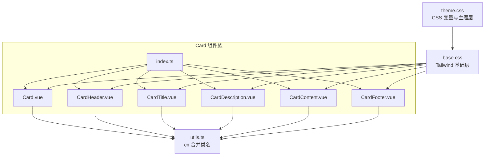
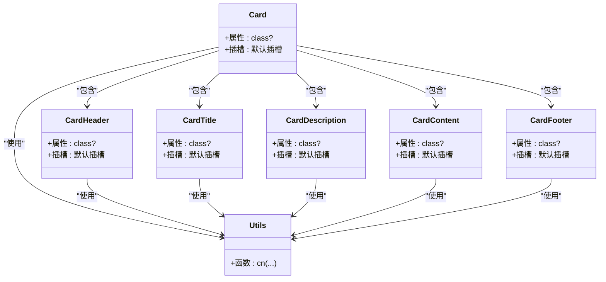
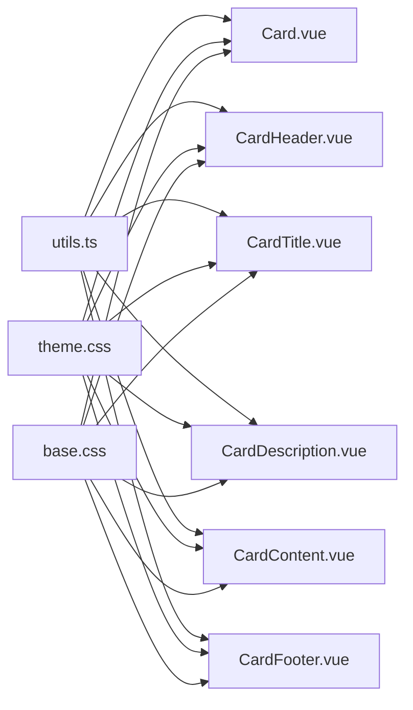

# 布局组件

<cite>
**本文引用的文件**
- [Card.vue](file://apps/frontend/src/components/ui/card/Card.vue)
- [CardContent.vue](file://apps/frontend/src/components/ui/card/CardContent.vue)
- [CardDescription.vue](file://apps/frontend/src/components/ui/card/CardDescription.vue)
- [CardFooter.vue](file://apps/frontend/src/components/ui/card/CardFooter.vue)
- [CardHeader.vue](file://apps/frontend/src/components/ui/card/CardHeader.vue)
- [CardTitle.vue](file://apps/frontend/src/components/ui/card/CardTitle.vue)
- [index.ts](file://apps/frontend/src/components/ui/card/index.ts)
- [utils.ts](file://apps/frontend/src/lib/utils.ts)
- [base.css](file://apps/frontend/src/styles/base.css)
- [theme.css](file://apps/frontend/src/styles/theme.css)
- [ui.css](file://apps/frontend/src/styles/ui.css)
- [TodoStatistics.vue](file://apps/frontend/src/features/todo/components/TodoStatistics.vue)
</cite>

## 目录
1. [简介](#简介)
2. [项目结构](#项目结构)
3. [核心组件](#核心组件)
4. [架构总览](#架构总览)
5. [详细组件分析](#详细组件分析)
6. [依赖分析](#依赖分析)
7. [性能考量](#性能考量)
8. [故障排查指南](#故障排查指南)
9. [结论](#结论)
10. [附录](#附录)

## 简介
本文件系统性梳理前端布局组件中的 Card 组件系列，涵盖 Card、CardContent、CardDescription、CardFooter、CardHeader、CardTitle 等子组件的实现架构与协作机制；阐述内容组织结构、视觉层次构建与响应式布局适配策略；明确嵌套规则、样式继承关系与主题应用方式；并通过真实业务场景示例（信息卡片、设置面板、内容容器）展示组合模式、扩展方法与最佳实践。

## 项目结构
Card 组件位于前端工程的 UI 组件库目录中，采用“功能域 + 子模块”的组织方式：
- 组件入口导出统一管理，便于按需引入与 Tree Shaking
- 各子组件通过共享工具函数实现样式合并与类名处理
- 主题与基础样式通过 CSS 变量与 Tailwind 层级导入，确保一致的视觉与交互体验



**图表来源**
- [index.ts:1-7](file://apps/frontend/src/components/ui/card/index.ts#L1-L7)
- [Card.vue:1-15](file://apps/frontend/src/components/ui/card/Card.vue#L1-L15)
- [CardHeader.vue:1-15](file://apps/frontend/src/components/ui/card/CardHeader.vue#L1-L15)
- [CardTitle.vue:1-15](file://apps/frontend/src/components/ui/card/CardTitle.vue#L1-L15)
- [CardDescription.vue:1-15](file://apps/frontend/src/components/ui/card/CardDescription.vue#L1-L15)
- [CardContent.vue:1-15](file://apps/frontend/src/components/ui/card/CardContent.vue#L1-L15)
- [CardFooter.vue:1-15](file://apps/frontend/src/components/ui/card/CardFooter.vue#L1-L15)
- [utils.ts:1-33](file://apps/frontend/src/lib/utils.ts#L1-L33)
- [theme.css:1-197](file://apps/frontend/src/styles/theme.css#L1-L197)
- [base.css:1-120](file://apps/frontend/src/styles/base.css#L1-L120)

**章节来源**
- [index.ts:1-7](file://apps/frontend/src/components/ui/card/index.ts#L1-L7)
- [Card.vue:1-15](file://apps/frontend/src/components/ui/card/Card.vue#L1-L15)
- [utils.ts:1-33](file://apps/frontend/src/lib/utils.ts#L1-L33)
- [theme.css:1-197](file://apps/frontend/src/styles/theme.css#L1-L197)
- [base.css:1-120](file://apps/frontend/src/styles/base.css#L1-L120)

## 核心组件
- 协作机制
  - Card 作为根容器，承载边框、背景、阴影与圆角等外观；内部通过插槽承载子组件
  - CardHeader、CardContent、CardFooter 提供头部、主体内容与底部区域的排版与间距
  - CardTitle、CardDescription 提供标题与描述文案的语义化与风格化渲染
  - 所有子组件均通过共享工具函数合并类名，支持外部传入自定义 class 进行覆盖或增强
- 设计理念
  - 内容组织结构：以卡片为信息单元，通过 Header/Title/Description/Content/Footer 的层级化结构组织信息密度与阅读节奏
  - 视觉层次构建：依托主题变量与 Tailwind 类，形成统一的背景、前景、边框与阴影体系
  - 响应式布局适配：结合父容器栅格与组件内间距/尺寸类，实现多端一致的可读性与可用性
- 嵌套规则与样式继承
  - 建议嵌套顺序：Card > (CardHeader | CardTitle | CardDescription) > CardContent > (CardFooter | 其他交互元素)
  - 样式继承：子组件通过 CSS 变量与 Tailwind 工具类继承主题色值与字号、字重、行高、间距等
- 主题应用方式
  - 主题变量集中于主题层，Card 系列组件通过语义化类名（如 bg-card、text-card-foreground、border）与变量联动
  - 暗色模式通过伪类切换，无需修改组件代码即可获得一致的主题表现

**章节来源**
- [Card.vue:1-15](file://apps/frontend/src/components/ui/card/Card.vue#L1-L15)
- [CardHeader.vue:1-15](file://apps/frontend/src/components/ui/card/CardHeader.vue#L1-L15)
- [CardTitle.vue:1-15](file://apps/frontend/src/components/ui/card/CardTitle.vue#L1-L15)
- [CardDescription.vue:1-15](file://apps/frontend/src/components/ui/card/CardDescription.vue#L1-L15)
- [CardContent.vue:1-15](file://apps/frontend/src/components/ui/card/CardContent.vue#L1-L15)
- [CardFooter.vue:1-15](file://apps/frontend/src/components/ui/card/CardFooter.vue#L1-L15)
- [utils.ts:1-33](file://apps/frontend/src/lib/utils.ts#L1-L33)
- [theme.css:1-197](file://apps/frontend/src/styles/theme.css#L1-L197)
- [base.css:1-120](file://apps/frontend/src/styles/base.css#L1-L120)

## 架构总览
Card 组件系列采用“容器 + 语义化子块”的分层架构，配合主题层与工具函数，形成可复用、可扩展、可主题化的布局能力。



**图表来源**
- [Card.vue:1-15](file://apps/frontend/src/components/ui/card/Card.vue#L1-L15)
- [CardHeader.vue:1-15](file://apps/frontend/src/components/ui/card/CardHeader.vue#L1-L15)
- [CardTitle.vue:1-15](file://apps/frontend/src/components/ui/card/CardTitle.vue#L1-L15)
- [CardDescription.vue:1-15](file://apps/frontend/src/components/ui/card/CardDescription.vue#L1-L15)
- [CardContent.vue:1-15](file://apps/frontend/src/components/ui/card/CardContent.vue#L1-L15)
- [CardFooter.vue:1-15](file://apps/frontend/src/components/ui/card/CardFooter.vue#L1-L15)
- [utils.ts:1-33](file://apps/frontend/src/lib/utils.ts#L1-L33)

## 详细组件分析

### Card 容器
- 职责：提供卡片的基础外观（圆角、边框、背景、阴影），作为子组件的根容器
- 关键点：通过工具函数合并外部传入的 class，保证可扩展性；内部默认插槽承载子组件
- 主题关联：使用语义化类名与主题变量联动，确保在明/暗主题下的一致表现

**章节来源**
- [Card.vue:1-15](file://apps/frontend/src/components/ui/card/Card.vue#L1-L15)
- [utils.ts:1-33](file://apps/frontend/src/lib/utils.ts#L1-L33)
- [theme.css:1-197](file://apps/frontend/src/styles/theme.css#L1-L197)

### CardHeader 头部区
- 职责：为卡片提供头部区域的排版与间距，常用于放置标题与描述
- 关键点：默认插槽承载子内容；通过工具函数合并外部 class 实现灵活定制

**章节来源**
- [CardHeader.vue:1-15](file://apps/frontend/src/components/ui/card/CardHeader.vue#L1-L15)
- [utils.ts:1-33](file://apps/frontend/src/lib/utils.ts#L1-L33)

### CardTitle 标题
- 职责：渲染卡片主标题，强调语义与可读性
- 关键点：使用语义化标签与字体权重、行高、字重等样式，保证标题层级清晰

**章节来源**
- [CardTitle.vue:1-15](file://apps/frontend/src/components/ui/card/CardTitle.vue#L1-L15)
- [utils.ts:1-33](file://apps/frontend/src/lib/utils.ts#L1-L33)

### CardDescription 描述
- 职责：渲染卡片辅助描述文本，通常用于弱化信息或补充说明
- 关键点：使用“柔和前景色”与较小字号，避免喧宾夺主

**章节来源**
- [CardDescription.vue:1-15](file://apps/frontend/src/components/ui/card/CardDescription.vue#L1-L15)
- [utils.ts:1-33](file://apps/frontend/src/lib/utils.ts#L1-L33)

### CardContent 内容区
- 职责：卡片主体内容区，承载图表、列表、表单等复杂内容
- 关键点：默认插槽承载子内容；通过工具函数合并外部 class 控制内外边距与布局

**章节来源**
- [CardContent.vue:1-15](file://apps/frontend/src/components/ui/card/CardContent.vue#L1-L15)
- [utils.ts:1-33](file://apps/frontend/src/lib/utils.ts#L1-L33)

### CardFooter 底部区
- 职责：卡片底部操作区，常用于放置按钮、状态提示等
- 关键点：默认插槽承载子内容；通过工具函数合并外部 class 控制对齐与间距

**章节来源**
- [CardFooter.vue:1-15](file://apps/frontend/src/components/ui/card/CardFooter.vue#L1-L15)
- [utils.ts:1-33](file://apps/frontend/src/lib/utils.ts#L1-L33)

### 组件协作流程（序列图）
以下序列图展示在业务视图中，卡片组件的典型协作流程：父组件渲染卡片容器，注入头部与内容，最终呈现为完整的卡片信息块。

```mermaid
sequenceDiagram
participant View as "业务视图"
participant Card as "Card"
participant Header as "CardHeader"
participant Title as "CardTitle"
participant Desc as "CardDescription"
participant Content as "CardContent"
View->>Card : 渲染卡片容器
View->>Header : 注入头部区域
Header->>Title : 渲染标题
Header->>Desc : 渲染描述
View->>Content : 注入内容区
Card->>Header : 渲染头部
Card->>Content : 渲染内容
Card-->>View : 输出完整卡片
```

**图表来源**
- [TodoStatistics.vue:268-324](file://apps/frontend/src/features/todo/components/TodoStatistics.vue#L268-L324)
- [Card.vue:1-15](file://apps/frontend/src/components/ui/card/Card.vue#L1-L15)
- [CardHeader.vue:1-15](file://apps/frontend/src/components/ui/card/CardHeader.vue#L1-L15)
- [CardTitle.vue:1-15](file://apps/frontend/src/components/ui/card/CardTitle.vue#L1-L15)
- [CardDescription.vue:1-15](file://apps/frontend/src/components/ui/card/CardDescription.vue#L1-L15)
- [CardContent.vue:1-15](file://apps/frontend/src/components/ui/card/CardContent.vue#L1-L15)

## 依赖分析
- 组件耦合与内聚
  - Card 系列组件高度内聚于布局职责，彼此松耦合，通过统一的工具函数与主题层实现低耦合高复用
- 直接与间接依赖
  - 直接依赖：utils.ts（类名合并）、主题层（CSS 变量与 Tailwind 工具类）
  - 间接依赖：业务视图通过组合使用 Card 系列组件实现复杂布局
- 外部依赖与集成点
  - Tailwind CSS 与 CSS 变量构成主题系统基石
  - Vue 单文件组件的插槽机制支撑内容透传与组合



**图表来源**
- [utils.ts:1-33](file://apps/frontend/src/lib/utils.ts#L1-L33)
- [theme.css:1-197](file://apps/frontend/src/styles/theme.css#L1-L197)
- [base.css:1-120](file://apps/frontend/src/styles/base.css#L1-L120)
- [Card.vue:1-15](file://apps/frontend/src/components/ui/card/Card.vue#L1-L15)
- [CardHeader.vue:1-15](file://apps/frontend/src/components/ui/card/CardHeader.vue#L1-L15)
- [CardTitle.vue:1-15](file://apps/frontend/src/components/ui/card/CardTitle.vue#L1-L15)
- [CardDescription.vue:1-15](file://apps/frontend/src/components/ui/card/CardDescription.vue#L1-L15)
- [CardContent.vue:1-15](file://apps/frontend/src/components/ui/card/CardContent.vue#L1-L15)
- [CardFooter.vue:1-15](file://apps/frontend/src/components/ui/card/CardFooter.vue#L1-L15)

**章节来源**
- [utils.ts:1-33](file://apps/frontend/src/lib/utils.ts#L1-L33)
- [theme.css:1-197](file://apps/frontend/src/styles/theme.css#L1-L197)
- [base.css:1-120](file://apps/frontend/src/styles/base.css#L1-L120)
- [Card.vue:1-15](file://apps/frontend/src/components/ui/card/Card.vue#L1-L15)
- [CardHeader.vue:1-15](file://apps/frontend/src/components/ui/card/CardHeader.vue#L1-L15)
- [CardTitle.vue:1-15](file://apps/frontend/src/components/ui/card/CardTitle.vue#L1-L15)
- [CardDescription.vue:1-15](file://apps/frontend/src/components/ui/card/CardDescription.vue#L1-L15)
- [CardContent.vue:1-15](file://apps/frontend/src/components/ui/card/CardContent.vue#L1-L15)
- [CardFooter.vue:1-15](file://apps/frontend/src/components/ui/card/CardFooter.vue#L1-L15)

## 性能考量
- 样式合并与类名处理
  - 使用工具函数进行类名合并，减少重复计算与无效 DOM 操作
- 主题切换与渲染
  - 主题变量集中管理，切换明/暗主题仅影响 CSS 变量，避免组件级重绘
- 响应式与动画
  - 基础样式层统一控制过渡时间与曲线，业务视图可按需启用/禁用动画以平衡性能与体验

[本节为通用指导，无需特定文件来源]

## 故障排查指南
- 样式未生效
  - 检查是否正确引入主题层与基础样式；确认 CSS 变量未被覆盖
- 类名冲突
  - 使用工具函数合并类名，避免直接覆盖关键类；优先通过外部 class 进行局部增强
- 主题不一致
  - 确认父容器具备正确的主题类；检查是否存在局部样式覆盖主题变量

**章节来源**
- [utils.ts:1-33](file://apps/frontend/src/lib/utils.ts#L1-L33)
- [theme.css:1-197](file://apps/frontend/src/styles/theme.css#L1-L197)
- [base.css:1-120](file://apps/frontend/src/styles/base.css#L1-L120)

## 结论
Card 组件系列以简洁的容器与语义化子块为核心，借助统一的工具函数与主题层，实现了高内聚、低耦合、强扩展的布局能力。通过规范的嵌套规则与样式继承关系，可在不同业务场景中快速搭建信息卡片、设置面板与内容容器等布局形态，并在明/暗主题间保持一致的视觉与交互体验。

[本节为总结性内容，无需特定文件来源]

## 附录

### 使用示例与场景
- 信息卡片
  - 场景：统计概览、数据展示、状态提示
  - 示例路径：[TodoStatistics.vue:268-324](file://apps/frontend/src/features/todo/components/TodoStatistics.vue#L268-L324)
- 设置面板
  - 场景：配置项分组、操作按钮集合
  - 建议：使用 CardHeader 放置标题与描述，CardContent 放置表单项，CardFooter 放置操作按钮
- 内容容器
  - 场景：复杂内容块、图表容器、富文本区域
  - 建议：结合外层栅格与组件内间距类，实现响应式布局与良好的可读性

**章节来源**
- [TodoStatistics.vue:268-324](file://apps/frontend/src/features/todo/components/TodoStatistics.vue#L268-L324)

### 组合模式与最佳实践
- 组合模式
  - 标准组合：Card > (CardHeader | CardTitle | CardDescription) > CardContent > (CardFooter | 操作元素)
  - 扩展组合：在 Content 中嵌套更多语义化区块或业务组件
- 最佳实践
  - 明确语义：优先使用 CardTitle 与 CardDescription 表达层级
  - 控制密度：合理使用内边距与间距类，避免信息拥挤
  - 主题一致：通过主题变量与 Tailwind 工具类统一风格，减少硬编码样式

[本节为通用指导，无需特定文件来源]