# 前端系统

<cite>
**本文引用的文件**   
- [apps/frontend/src/main.ts](file://apps/frontend/src/main.ts)
- [apps/frontend/src/App.vue](file://apps/frontend/src/App.vue)
- [apps/frontend/src/router/index.ts](file://apps/frontend/src/router/index.ts)
- [apps/frontend/vite.config.mts](file://apps/frontend/vite.config.mts)
- [apps/frontend/src/i18n/index.ts](file://apps/frontend/src/i18n/index.ts)
- [apps/frontend/src/composables/useTheme.ts](file://apps/frontend/src/composables/useTheme.ts)
- [apps/frontend/src/composables/useSocket.ts](file://apps/frontend/src/composables/useSocket.ts)
- [apps/frontend/src/composables/useMarkdown.ts](file://apps/frontend/src/composables/useMarkdown.ts)
- [apps/frontend/src/styles/theme.css](file://apps/frontend/src/styles/theme.css)
- [apps/frontend/src/features/auth/stores/auth.ts](file://apps/frontend/src/features/auth/stores/auth.ts)
- [apps/frontend/src/features/todo/stores/todo.ts](file://apps/frontend/src/features/todo/stores/todo.ts)
- [apps/frontend/src/components/ui/button/Button.vue](file://apps/frontend/src/components/ui/button/Button.vue)
- [apps/frontend/src/composables/useFileParsing.ts](file://apps/frontend/src/composables/useFileParsing.ts)
- [apps/frontend/tailwind.config.js](file://apps/frontend/tailwind.config.js)
- [apps/frontend/package.json](file://apps/frontend/package.json)
</cite>

## 目录
1. [简介](#简介)
2. [项目结构](#项目结构)
3. [核心组件](#核心组件)
4. [架构总览](#架构总览)
5. [详细组件分析](#详细组件分析)
6. [依赖关系分析](#依赖关系分析)
7. [性能考量](#性能考量)
8. [故障排查指南](#故障排查指南)
9. [结论](#结论)
10. [附录](#附录)

## 简介
本文件为 Lumina 前端系统的完整技术文档，聚焦基于 Vue 3 + TypeScript 的单页应用架构，涵盖 Composition API 使用、响应式系统、组件设计模式；状态管理（Pinia Store）、路由配置、导航守卫与懒加载策略；UI 组件库设计、主题系统、国际化支持与可访问性实现；实时通信集成（WebSocket）、消息推送处理；文件上传、图片预览、Markdown 渲染、富文本编辑等能力；以及性能优化策略、代码分割、缓存机制与错误边界处理。

## 项目结构
前端工程位于 apps/frontend，采用模块化分层组织：
- 应用入口与全局配置：main.ts、App.vue、router、i18n、styles
- 特性域：features/auth、features/todo、features/ai、features/mcp
- 可复用组合式工具：composables
- UI 组件库：components/ui
- 工具与类型：lib、types
- 构建与打包：vite.config.mts、package.json、tailwind.config.js

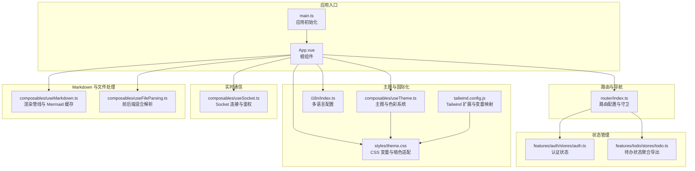

**图表来源**
- [apps/frontend/src/main.ts:1-138](file://apps/frontend/src/main.ts#L1-L138)
- [apps/frontend/src/App.vue:1-77](file://apps/frontend/src/App.vue#L1-L77)
- [apps/frontend/src/router/index.ts:1-73](file://apps/frontend/src/router/index.ts#L1-L73)
- [apps/frontend/src/composables/useTheme.ts:1-248](file://apps/frontend/src/composables/useTheme.ts#L1-L248)
- [apps/frontend/src/i18n/index.ts:1-37](file://apps/frontend/src/i18n/index.ts#L1-L37)
- [apps/frontend/src/styles/theme.css:1-146](file://apps/frontend/src/styles/theme.css#L1-L146)
- [apps/frontend/tailwind.config.js:1-303](file://apps/frontend/tailwind.config.js#L1-L303)
- [apps/frontend/src/composables/useSocket.ts:1-176](file://apps/frontend/src/composables/useSocket.ts#L1-L176)
- [apps/frontend/src/composables/useMarkdown.ts:1-108](file://apps/frontend/src/composables/useMarkdown.ts#L1-L108)
- [apps/frontend/src/composables/useFileParsing.ts:1-122](file://apps/frontend/src/composables/useFileParsing.ts#L1-L122)
- [apps/frontend/src/features/auth/stores/auth.ts:1-391](file://apps/frontend/src/features/auth/stores/auth.ts#L1-L391)
- [apps/frontend/src/features/todo/stores/todo.ts:1-3](file://apps/frontend/src/features/todo/stores/todo.ts#L1-L3)

**章节来源**
- [apps/frontend/src/main.ts:1-138](file://apps/frontend/src/main.ts#L1-L138)
- [apps/frontend/src/App.vue:1-77](file://apps/frontend/src/App.vue#L1-L77)
- [apps/frontend/src/router/index.ts:1-73](file://apps/frontend/src/router/index.ts#L1-L73)
- [apps/frontend/vite.config.mts:1-185](file://apps/frontend/vite.config.mts#L1-L185)
- [apps/frontend/src/i18n/index.ts:1-37](file://apps/frontend/src/i18n/index.ts#L1-L37)
- [apps/frontend/src/composables/useTheme.ts:1-248](file://apps/frontend/src/composables/useTheme.ts#L1-L248)
- [apps/frontend/src/styles/theme.css:1-146](file://apps/frontend/src/styles/theme.css#L1-L146)
- [apps/frontend/tailwind.config.js:1-303](file://apps/frontend/tailwind.config.js#L1-L303)

## 核心组件
- 应用启动与全局配置：初始化 Pinia、Vue Query、i18n、ECharts、全局错误处理与动态导入容错。
- 根组件：统一挂载 TooltipProvider、ToastProvider、主题初始化、Wails 平台适配与 WebSocket 监听。
- 路由系统：基于 History/Hash 模式，按需懒加载视图，前置守卫统一设置页面标题。
- 状态管理：Pinia Store，持久化插件，认证状态与用户态同步。
- 主题系统：CSS 变量驱动，支持用户自定义主色与随机色，暗色模式自动切换。
- 国际化：基于 vue-i18n，支持 zh-CN/en-US，自动检测与本地存储偏好。
- 实时通信：Socket.io 客户端封装，鉴权、重连、房间加入、错误处理。
- Markdown 渲染：预处理、XSS 清洗、Mermaid 图表缓存与异步渲染。
- 文件解析：前端直读与后端解析混合策略，带截断提示与错误反馈。
- UI 组件：基于 reka-ui 的 Button 等，配合 Tailwind CSS 变量与动画。

**章节来源**
- [apps/frontend/src/main.ts:1-138](file://apps/frontend/src/main.ts#L1-L138)
- [apps/frontend/src/App.vue:1-77](file://apps/frontend/src/App.vue#L1-L77)
- [apps/frontend/src/router/index.ts:1-73](file://apps/frontend/src/router/index.ts#L1-L73)
- [apps/frontend/src/features/auth/stores/auth.ts:1-391](file://apps/frontend/src/features/auth/stores/auth.ts#L1-L391)
- [apps/frontend/src/composables/useTheme.ts:1-248](file://apps/frontend/src/composables/useTheme.ts#L1-L248)
- [apps/frontend/src/i18n/index.ts:1-37](file://apps/frontend/src/i18n/index.ts#L1-L37)
- [apps/frontend/src/composables/useSocket.ts:1-176](file://apps/frontend/src/composables/useSocket.ts#L1-L176)
- [apps/frontend/src/composables/useMarkdown.ts:1-108](file://apps/frontend/src/composables/useMarkdown.ts#L1-L108)
- [apps/frontend/src/composables/useFileParsing.ts:1-122](file://apps/frontend/src/composables/useFileParsing.ts#L1-L122)
- [apps/frontend/src/components/ui/button/Button.vue:1-32](file://apps/frontend/src/components/ui/button/Button.vue#L1-L32)

## 架构总览
Lumina 前端采用“特性域 + 组合式工具 + UI 组件库”的分层架构，围绕 Composition API 与响应式系统组织业务逻辑，通过 Pinia 管理跨域状态，借助 Vue Router 实现路由与懒加载，结合 Socket.io 实现实时通信，Tailwind CSS 与 CSS 变量提供一致的主题与可访问性体验。

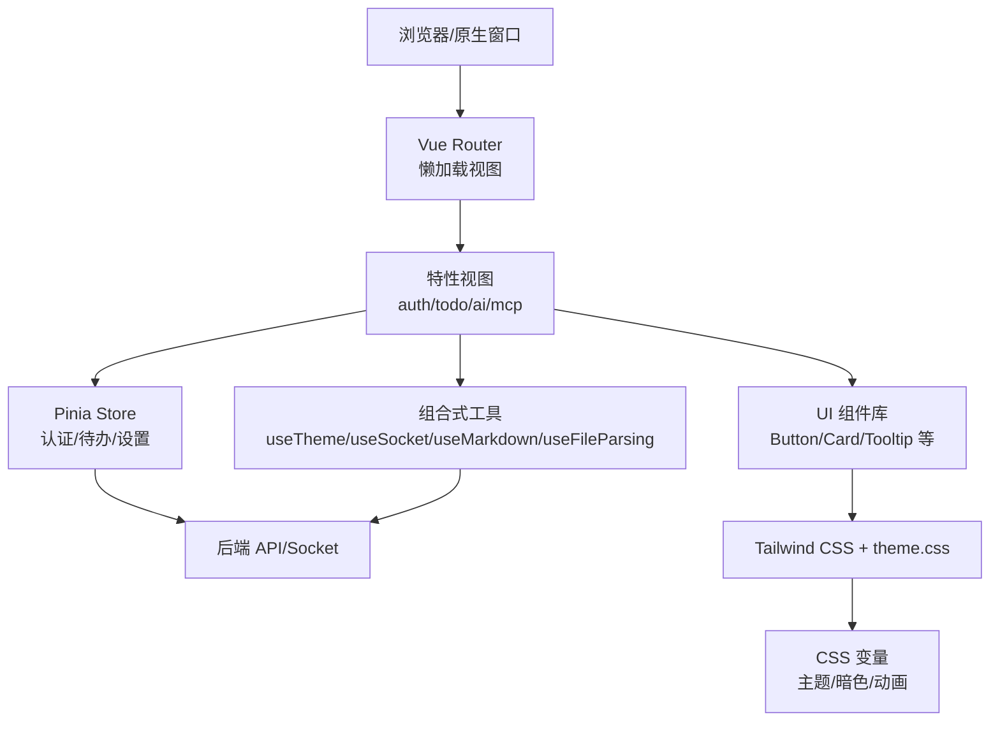

**图表来源**
- [apps/frontend/src/router/index.ts:1-73](file://apps/frontend/src/router/index.ts#L1-L73)
- [apps/frontend/src/features/auth/stores/auth.ts:1-391](file://apps/frontend/src/features/auth/stores/auth.ts#L1-L391)
- [apps/frontend/src/composables/useTheme.ts:1-248](file://apps/frontend/src/composables/useTheme.ts#L1-L248)
- [apps/frontend/src/composables/useSocket.ts:1-176](file://apps/frontend/src/composables/useSocket.ts#L1-L176)
- [apps/frontend/src/composables/useMarkdown.ts:1-108](file://apps/frontend/src/composables/useMarkdown.ts#L1-L108)
- [apps/frontend/src/composables/useFileParsing.ts:1-122](file://apps/frontend/src/composables/useFileParsing.ts#L1-L122)
- [apps/frontend/src/styles/theme.css:1-146](file://apps/frontend/src/styles/theme.css#L1-L146)
- [apps/frontend/tailwind.config.js:1-303](file://apps/frontend/tailwind.config.js#L1-L303)

## 详细组件分析

### 应用启动与全局配置
- 初始化顺序：创建应用实例 → 注册 Pinia/Pinia 持久化 → 注册 Vue Router → 注册 i18n → 注册 Vue Query → 全局注册 VChart → 挂载。
- 全局错误处理：捕获动态导入 Chunk 加载失败、忽略 ResizeObserver 循环警告，记录未处理 Promise 拒绝。
- ECharts 注册：按需引入渲染器与图表组件，提升首屏性能。
- 样式与第三方资源：初始化 Zod 国际化、Markdown 渲染所需样式（highlight.js、KaTeX）。

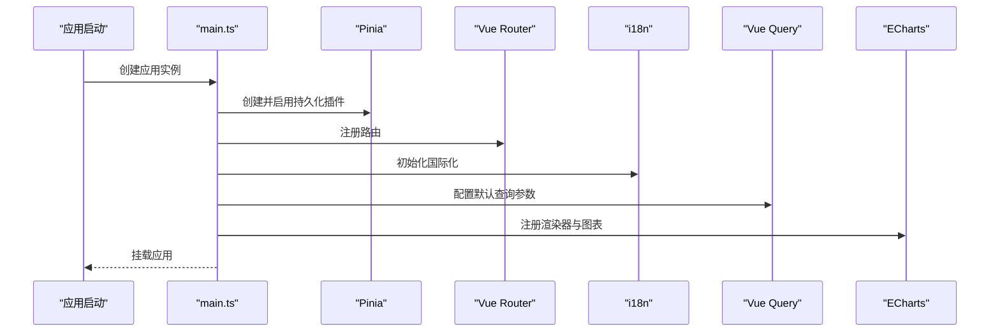

**图表来源**
- [apps/frontend/src/main.ts:1-138](file://apps/frontend/src/main.ts#L1-L138)

**章节来源**
- [apps/frontend/src/main.ts:1-138](file://apps/frontend/src/main.ts#L1-L138)

### 根组件与平台适配
- 初始化主题与 TooltipProvider，保证全局交互一致性。
- Wails 平台下添加拖拽区域与双击最大化逻辑，避免误触拖拽。
- 启动全局 WebSocket 监听，按用户登录态自动连接/断开。

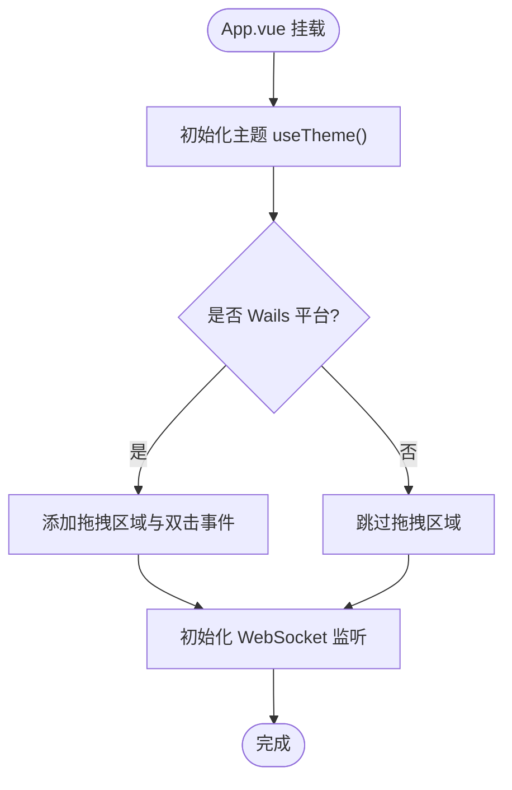

**图表来源**
- [apps/frontend/src/App.vue:1-77](file://apps/frontend/src/App.vue#L1-L77)

**章节来源**
- [apps/frontend/src/App.vue:1-77](file://apps/frontend/src/App.vue#L1-L77)

### 路由配置与导航守卫
- 路由模式：根据运行环境选择 History 或 Hash 模式。
- 懒加载：所有视图均通过动态导入实现按需加载。
- 导航守卫：beforeEach 中根据 meta.title 与 i18n 翻译设置页面标题，未指定时回退到完整应用名。

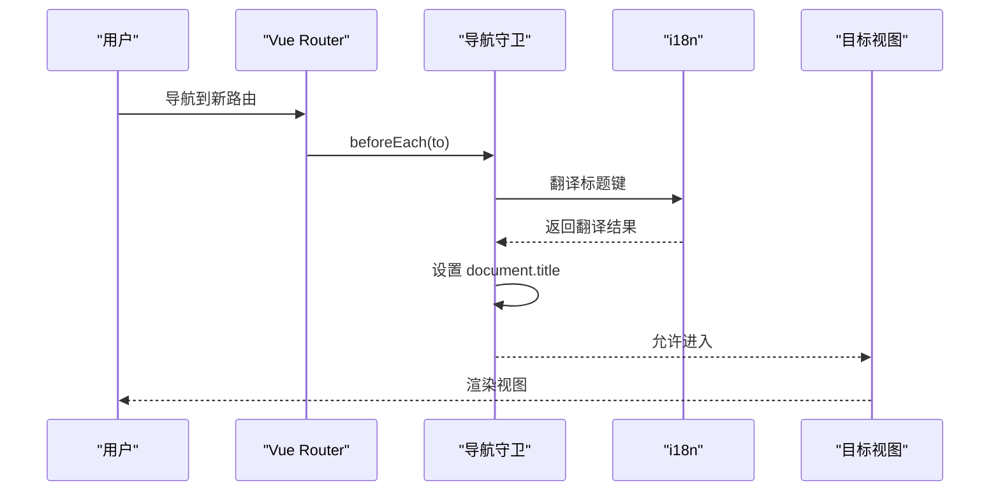

**图表来源**
- [apps/frontend/src/router/index.ts:1-73](file://apps/frontend/src/router/index.ts#L1-L73)

**章节来源**
- [apps/frontend/src/router/index.ts:1-73](file://apps/frontend/src/router/index.ts#L1-L73)

### 状态管理（Pinia Store）
- 认证 Store（auth）：集中管理 token、refreshToken、user、loading、error、fieldErrors；提供登录、注册、忘记密码、重置密码、刷新令牌、登出、获取当前用户等方法；持久化到 localStorage。
- Todo Store（todo）：作为聚合导出入口，内部包含复杂的状态与动作，用于待办事项的增删改查、过滤、视图模式切换等。

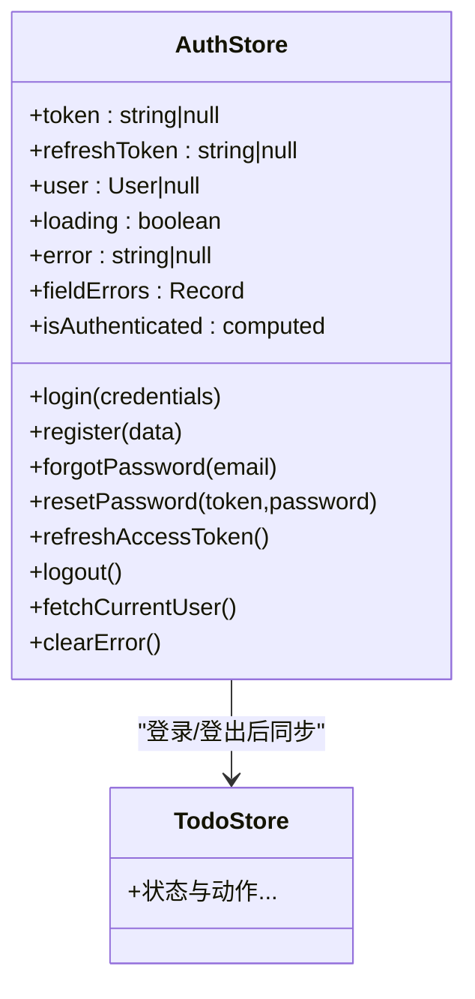

**图表来源**
- [apps/frontend/src/features/auth/stores/auth.ts:1-391](file://apps/frontend/src/features/auth/stores/auth.ts#L1-L391)
- [apps/frontend/src/features/todo/stores/todo.ts:1-3](file://apps/frontend/src/features/todo/stores/todo.ts#L1-L3)

**章节来源**
- [apps/frontend/src/features/auth/stores/auth.ts:1-391](file://apps/frontend/src/features/auth/stores/auth.ts#L1-L391)
- [apps/frontend/src/features/todo/stores/todo.ts:1-3](file://apps/frontend/src/features/todo/stores/todo.ts#L1-L3)

### 主题系统与可访问性
- CSS 变量：在 theme.css 中定义基础色、主色、次色、语义色、图表色、AI 相关变量，并在暗色类下提供对应值。
- 主题组合式：useTheme 支持用户设置主色、随机色、自动切换；RGB/HSL 转换与亮度调节，确保对比度与可读性。
- Tailwind 扩展：colors、fontFamily、borderRadius、boxShadow、keyframes、animation 等映射到 CSS 变量，统一设计语言。
- 可访问性：全局过渡禁用策略（排除 canvas、echarts），避免高频动画影响视觉敏感用户。

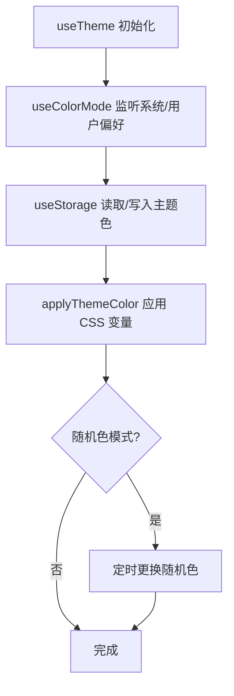

**图表来源**
- [apps/frontend/src/composables/useTheme.ts:1-248](file://apps/frontend/src/composables/useTheme.ts#L1-L248)
- [apps/frontend/src/styles/theme.css:1-146](file://apps/frontend/src/styles/theme.css#L1-L146)
- [apps/frontend/tailwind.config.js:1-303](file://apps/frontend/tailwind.config.js#L1-L303)

**章节来源**
- [apps/frontend/src/composables/useTheme.ts:1-248](file://apps/frontend/src/composables/useTheme.ts#L1-L248)
- [apps/frontend/src/styles/theme.css:1-146](file://apps/frontend/src/styles/theme.css#L1-L146)
- [apps/frontend/tailwind.config.js:1-303](file://apps/frontend/tailwind.config.js#L1-L303)

### 国际化支持
- 自动检测：优先本地存储，其次浏览器语言，再回退到 zh-CN。
- 消息类型：DeepStringify 确保类型安全；支持 zh-CN/en-US 双语。
- 页面标题：导航守卫中通过 i18n 翻译 meta.title，统一命名空间。

**章节来源**
- [apps/frontend/src/i18n/index.ts:1-37](file://apps/frontend/src/i18n/index.ts#L1-L37)
- [apps/frontend/src/router/index.ts:1-73](file://apps/frontend/src/router/index.ts#L1-L73)

### 实时通信与消息推送
- Socket 组合式：封装连接、断开、等待连接、鉴权、重连、房间加入、错误处理。
- 鉴权策略：自动携带 token，认证错误时尝试刷新令牌并重连。
- 用户房间：登录后自动加入 user:{userId} 房间，接收私信/推送。

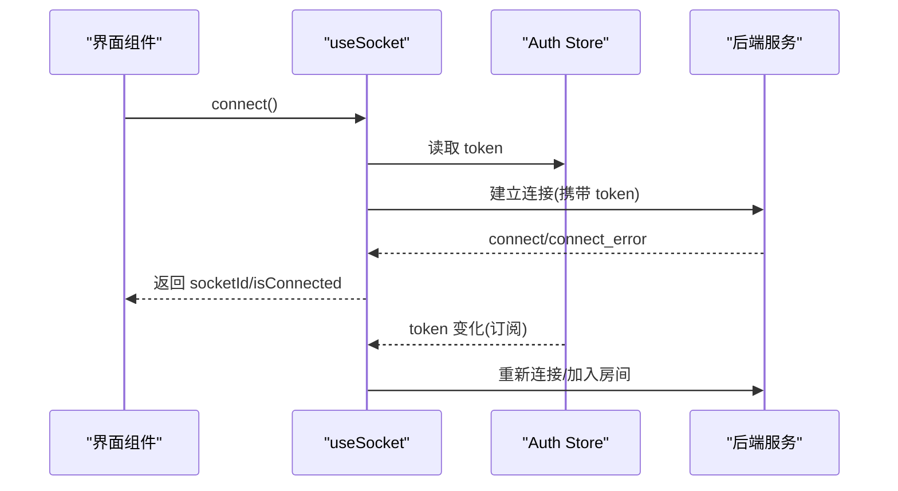

**图表来源**
- [apps/frontend/src/composables/useSocket.ts:1-176](file://apps/frontend/src/composables/useSocket.ts#L1-L176)
- [apps/frontend/src/features/auth/stores/auth.ts:1-391](file://apps/frontend/src/features/auth/stores/auth.ts#L1-L391)

**章节来源**
- [apps/frontend/src/composables/useSocket.ts:1-176](file://apps/frontend/src/composables/useSocket.ts#L1-L176)
- [apps/frontend/src/features/auth/stores/auth.ts:1-391](file://apps/frontend/src/features/auth/stores/auth.ts#L1-L391)

### Markdown 渲染与富文本
- 渲染流程：预处理（公式/加粗修复）→ 渲染 → 恢复美元符号 → DOMPurify 清洗 → Mermaid 队列异步渲染与缓存替换。
- Mermaid 缓存：按主题+稳定哈希缓存 SVG，减少重复渲染闪烁。
- 流式渲染：识别已闭合代码块，优先从缓存替换，再异步渲染新增图表。

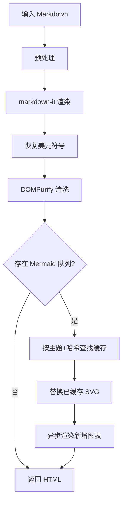

**图表来源**
- [apps/frontend/src/composables/useMarkdown.ts:1-108](file://apps/frontend/src/composables/useMarkdown.ts#L1-L108)

**章节来源**
- [apps/frontend/src/composables/useMarkdown.ts:1-108](file://apps/frontend/src/composables/useMarkdown.ts#L1-L108)

### 文件上传与解析
- 解析策略：简单文本/代码文件前端直读；复杂文档（PDF/Word/Excel）后端解析。
- 登录要求：后端解析需登录态，否则提示登录。
- 截断与提示：超过阈值自动截断并弹出警告 Toast。
- 状态管理：ParsedFile 结构化管理 id/name/type/content/status/error。

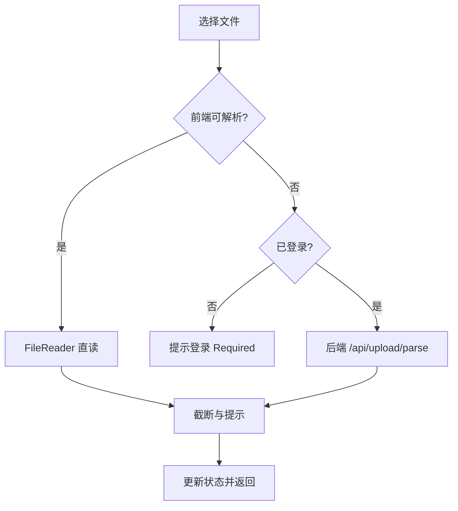

**图表来源**
- [apps/frontend/src/composables/useFileParsing.ts:1-122](file://apps/frontend/src/composables/useFileParsing.ts#L1-L122)

**章节来源**
- [apps/frontend/src/composables/useFileParsing.ts:1-122](file://apps/frontend/src/composables/useFileParsing.ts#L1-L122)

### UI 组件库设计
- Button 组件：基于 reka-ui Primitive，支持 variants/sizes/class 组合，使用 cn 合并类名。
- 设计原则：以 CSS 变量为核心，Tailwind 类名作为风格层，确保一致性与可定制性。

**章节来源**
- [apps/frontend/src/components/ui/button/Button.vue:1-32](file://apps/frontend/src/components/ui/button/Button.vue#L1-L32)
- [apps/frontend/tailwind.config.js:1-303](file://apps/frontend/tailwind.config.js#L1-L303)

## 依赖关系分析
- 构建与打包：Vite 配置按依赖来源进行 manualChunks，分离 vendor 包（vue、ui、chart、mermaid、markdown、utils），开启 gzip/brotli 压缩与 PWA。
- 代理与开发：/api 与 /socket.io 代理到后端，长连接增加超时配置。
- 依赖清单：Vue 3、Vue Router、Pinia、Vue Query、Socket.io、ECharts、Tailwind CSS、markdown-it、mermaid、highlight.js、katex 等。

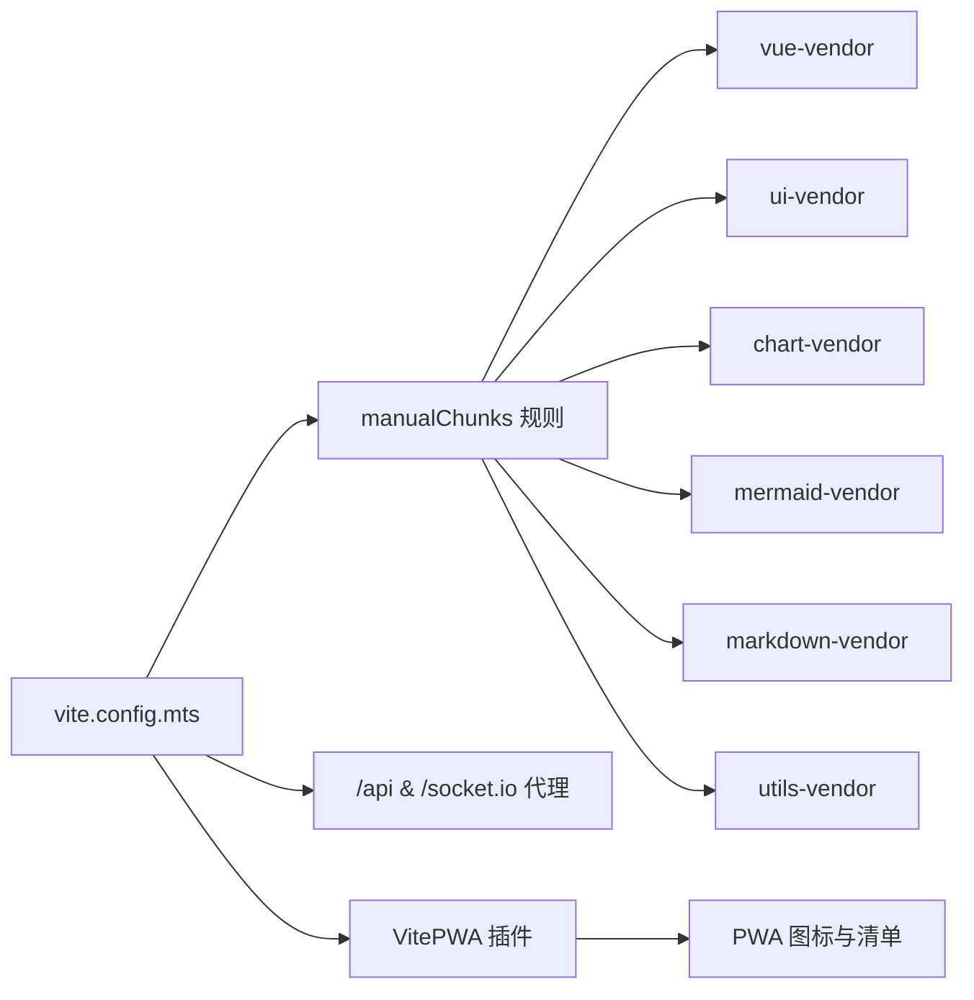

**图表来源**
- [apps/frontend/vite.config.mts:1-185](file://apps/frontend/vite.config.mts#L1-L185)

**章节来源**
- [apps/frontend/vite.config.mts:1-185](file://apps/frontend/vite.config.mts#L1-L185)
- [apps/frontend/package.json:1-104](file://apps/frontend/package.json#L1-L104)

## 性能考量
- 代码分割：按依赖来源拆分 vendor 包，减少单包体积，提升缓存命中率。
- 懒加载：路由视图动态导入，按需加载特性模块。
- 缓存策略：Pinia 持久化、Mermaid 图表缓存、DOMPurify 清洗缓存、主题变更时清理缓存。
- 渲染优化：CSS 变量与 GPU 加速类（scroll-smooth-gpu），全局过渡禁用策略。
- 网络优化：Socket.io 优先 websocket，自动重连与鉴权；Vue Query 默认 staleTime 与 retry 控制。

**章节来源**
- [apps/frontend/vite.config.mts:1-185](file://apps/frontend/vite.config.mts#L1-L185)
- [apps/frontend/src/main.ts:115-127](file://apps/frontend/src/main.ts#L115-L127)
- [apps/frontend/src/composables/useMarkdown.ts:18-22](file://apps/frontend/src/composables/useMarkdown.ts#L18-L22)

## 故障排查指南
- 动态导入失败（Chunk Error）：检测错误信息包含“failed to fetch dynamically imported module”，10 秒内仅刷新一次，避免无限循环。
- ResizeObserver 错误：忽略“loop limit exceeded”等良性错误，避免控制台噪音。
- Socket 连接错误：识别 unauthorized/token/jwt/authentication 相关错误，尝试刷新令牌并重连。
- 登录态异常：检查 Auth Store 的 token/refreshToken 是否持久化，必要时清理本地存储并重新登录。
- PWA 更新：确认 VitePWA 配置与 service worker 更新策略，开发模式可通过环境变量启用。

**章节来源**
- [apps/frontend/src/main.ts:56-113](file://apps/frontend/src/main.ts#L56-L113)
- [apps/frontend/src/composables/useSocket.ts:60-93](file://apps/frontend/src/composables/useSocket.ts#L60-L93)
- [apps/frontend/src/features/auth/stores/auth.ts:112-143](file://apps/frontend/src/features/auth/stores/auth.ts#L112-L143)

## 结论
Lumina 前端系统以 Vue 3 + TypeScript 为基础，结合 Composition API、Pinia、Vue Router、Socket.io 与 Tailwind CSS，构建了主题一致、可扩展、高性能且具备良好可访问性的单页应用。通过合理的代码分割、缓存与错误处理策略，系统在多平台（Web/Wails/Capacitor）下均能提供稳定的用户体验。

## 附录
- 开发命令与脚本：dev、build、preview、lint、test、cap:*、pwa:*、build:wails 等。
- 代理目标：默认指向本地 3000 端口，可通过环境变量覆盖。
- PWA 配置：自动更新、图标生成、manifest 与 includeAssets。

**章节来源**
- [apps/frontend/package.json:9-29](file://apps/frontend/package.json#L9-L29)
- [apps/frontend/vite.config.mts:154-174](file://apps/frontend/vite.config.mts#L154-L174)
- [apps/frontend/vite.config.mts:104-146](file://apps/frontend/vite.config.mts#L104-L146)