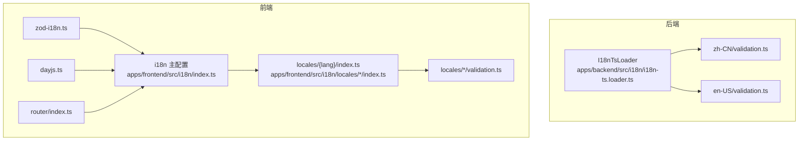
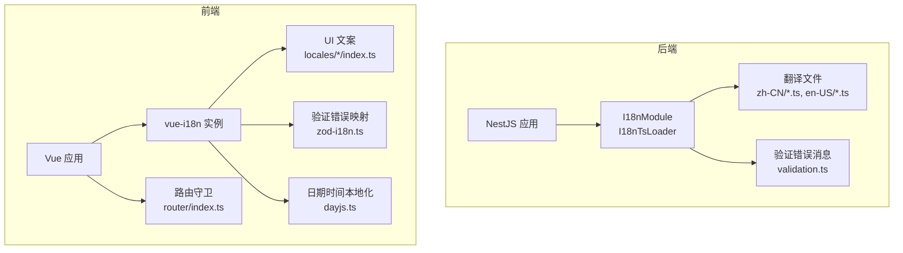
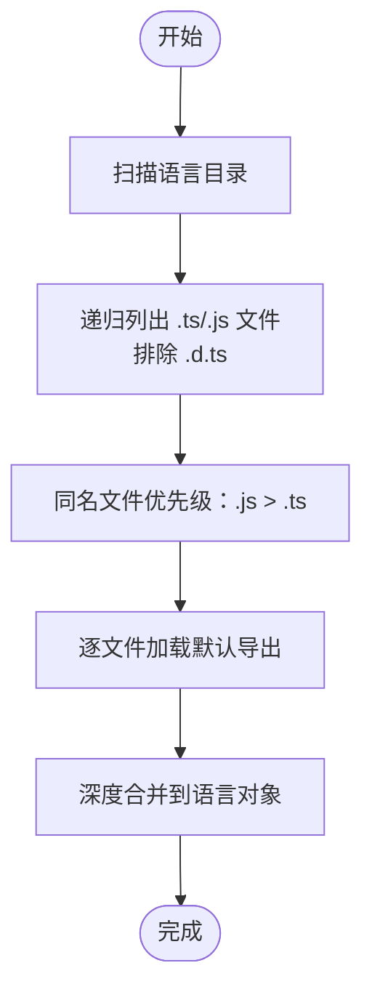
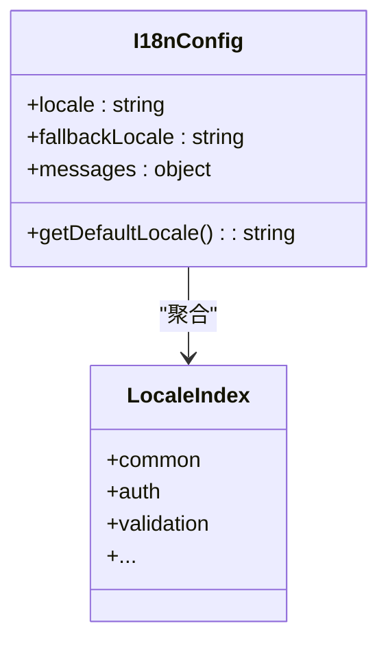
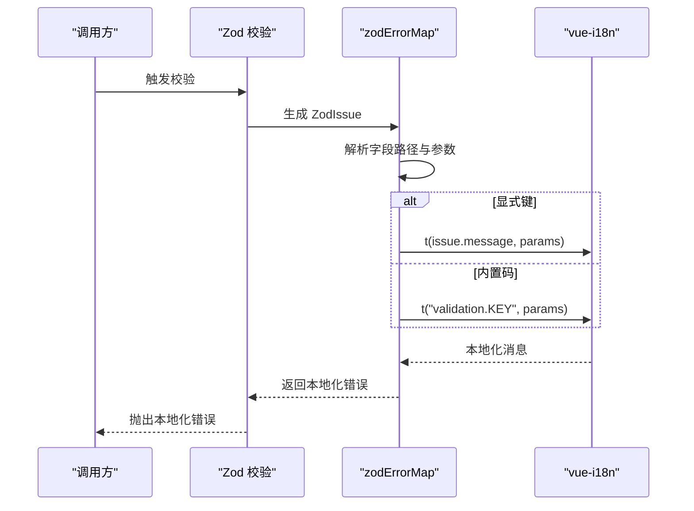
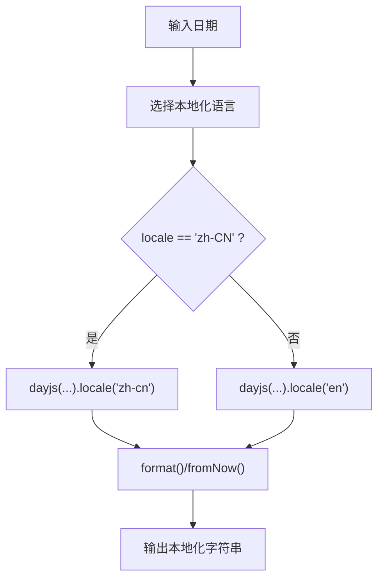
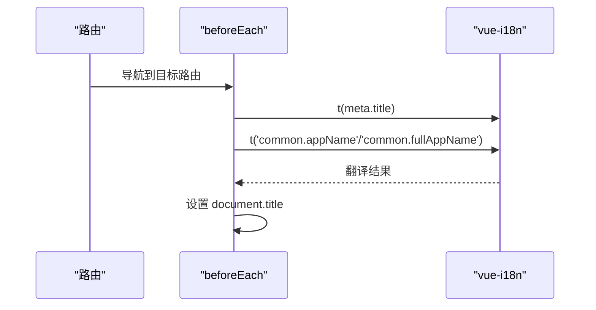
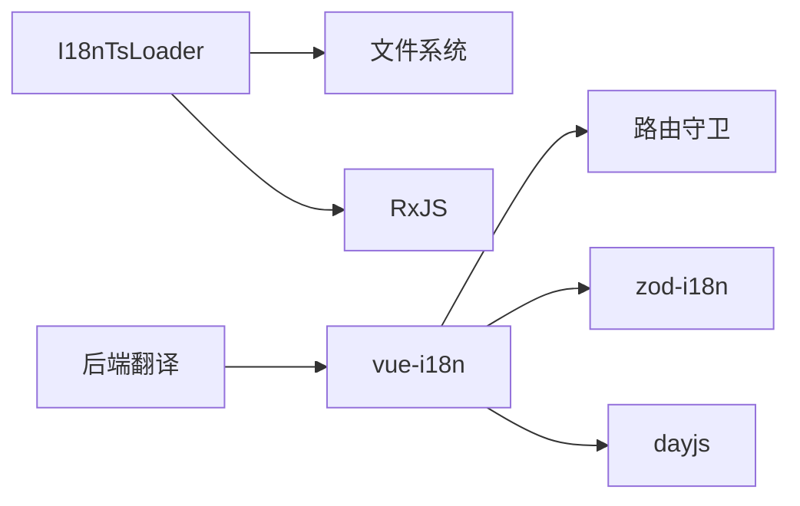
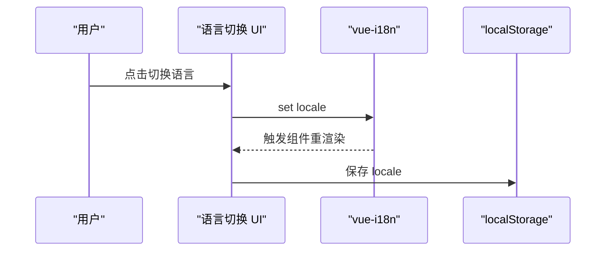

# 国际化

<cite>
**本文引用的文件**
- [apps/backend/src/i18n/i18n-ts.loader.ts](file://apps/backend/src/i18n/i18n-ts.loader.ts)
- [apps/backend/src/i18n/zh-CN/validation.ts](file://apps/backend/src/i18n/zh-CN/validation.ts)
- [apps/backend/src/i18n/en-US/validation.ts](file://apps/backend/src/i18n/en-US/validation.ts)
- [apps/frontend/src/i18n/index.ts](file://apps/frontend/src/i18n/index.ts)
- [apps/frontend/src/i18n/locales/zh-CN/index.ts](file://apps/frontend/src/i18n/locales/zh-CN/index.ts)
- [apps/frontend/src/i18n/locales/en-US/index.ts](file://apps/frontend/src/i18n/locales/en-US/index.ts)
- [apps/frontend/src/i18n/locales/zh-CN/validation.ts](file://apps/frontend/src/i18n/locales/zh-CN/validation.ts)
- [apps/frontend/src/i18n/locales/en-US/validation.ts](file://apps/frontend/src/i18n/locales/en-US/validation.ts)
- [apps/frontend/src/lib/zod-i18n.ts](file://apps/frontend/src/lib/zod-i18n.ts)
- [apps/frontend/src/lib/dayjs.ts](file://apps/frontend/src/lib/dayjs.ts)
- [apps/frontend/src/router/index.ts](file://apps/frontend/src/router/index.ts)
- [apps/frontend/tests/features/todo/components/TodoHeader.spec.ts](file://apps/frontend/tests/features/todo/components/TodoHeader.spec.ts)
- [apps/backend/tests/i18n/i18n-ts-loader.spec.ts](file://apps/backend/tests/i18n/i18n-ts-loader.spec.ts)
</cite>

## 目录
1. [简介](#简介)
2. [项目结构](#项目结构)
3. [核心组件](#核心组件)
4. [架构总览](#架构总览)
5. [详细组件分析](#详细组件分析)
6. [依赖关系分析](#依赖关系分析)
7. [性能考量](#性能考量)
8. [故障排查指南](#故障排查指南)
9. [结论](#结论)
10. [附录](#附录)

## 简介
本文件系统性阐述本仓库的国际化（i18n）体系，覆盖后端与前端两部分。后端基于 NestJS 的 i18n 框架与自研 TypeScript/JavaScript 翻译文件加载器，实现语言包的动态解析与合并；前端采用 vue-i18n 提供的消息与验证本地化能力，并通过路由守卫实现页面标题的动态国际化。文档重点包括：
- 语言包组织与命名空间
- 动态加载机制与回退策略
- 多语言资源管理（键值结构、嵌套命名空间、验证错误本地化）
- Zod 验证器的国际化集成与动态语言切换
- 运行时语言切换（状态管理、组件重渲染、URL 语言参数、浏览器语言检测）
- 新语言添加流程、翻译质量保证、性能优化与兼容性处理

## 项目结构
国际化相关文件分布于后端与前端应用中：
- 后端：翻译文件位于 apps/backend/src/i18n/{lang}/ 下，加载器位于 apps/backend/src/i18n/i18n-ts.loader.ts
- 前端：翻译文件位于 apps/frontend/src/i18n/locales/{lang}/ 下，主配置在 apps/frontend/src/i18n/index.ts，验证与日期工具分别在 apps/frontend/src/lib/zod-i18n.ts 与 apps/frontend/src/lib/dayjs.ts，路由标题国际化在 apps/frontend/src/router/index.ts

**图表来源**
- [apps/backend/src/i18n/i18n-ts.loader.ts:1-185](file://apps/backend/src/i18n/i18n-ts.loader.ts#L1-L185)
- [apps/backend/src/i18n/zh-CN/validation.ts:1-12](file://apps/backend/src/i18n/zh-CN/validation.ts#L1-L12)
- [apps/backend/src/i18n/en-US/validation.ts:1-12](file://apps/backend/src/i18n/en-US/validation.ts#L1-L12)
- [apps/frontend/src/i18n/index.ts:1-37](file://apps/frontend/src/i18n/index.ts#L1-L37)
- [apps/frontend/src/i18n/locales/zh-CN/index.ts:1-28](file://apps/frontend/src/i18n/locales/zh-CN/index.ts#L1-L28)
- [apps/frontend/src/i18n/locales/en-US/index.ts:1-28](file://apps/frontend/src/i18n/locales/en-US/index.ts#L1-L28)
- [apps/frontend/src/i18n/locales/zh-CN/validation.ts:1-14](file://apps/frontend/src/i18n/locales/zh-CN/validation.ts#L1-L14)
- [apps/frontend/src/i18n/locales/en-US/validation.ts:1-14](file://apps/frontend/src/i18n/locales/en-US/validation.ts#L1-L14)
- [apps/frontend/src/lib/zod-i18n.ts:1-96](file://apps/frontend/src/lib/zod-i18n.ts#L1-L96)
- [apps/frontend/src/lib/dayjs.ts:1-35](file://apps/frontend/src/lib/dayjs.ts#L1-L35)
- [apps/frontend/src/router/index.ts:1-73](file://apps/frontend/src/router/index.ts#L1-L73)

**章节来源**
- [apps/backend/src/i18n/i18n-ts.loader.ts:1-185](file://apps/backend/src/i18n/i18n-ts.loader.ts#L1-L185)
- [apps/frontend/src/i18n/index.ts:1-37](file://apps/frontend/src/i18n/index.ts#L1-L37)
- [apps/frontend/src/router/index.ts:1-73](file://apps/frontend/src/router/index.ts#L1-L73)

## 核心组件
- 后端 I18nTsLoader：递归扫描语言目录，按文件扩展名优先级选择加载项，深度合并各模块翻译，支持热更新事件流
- 前端 i18n 主配置：基于 vue-i18n 创建实例，内置 zh-CN/en-US 及其简写 zh/en，提供默认语言检测与回退
- 前端 Zod 国际化：自定义错误映射，将 Zod 校验问题映射到 validation.* 键，支持字段路径翻译与参数注入
- 前端日期时间：基于 dayjs 插件实现相对时间与格式化，按语言切换本地化
- 前端路由标题：在 beforeEach 中根据 meta.title 与 common.* 键动态设置页面标题

**章节来源**
- [apps/backend/src/i18n/i18n-ts.loader.ts:86-184](file://apps/backend/src/i18n/i18n-ts.loader.ts#L86-L184)
- [apps/frontend/src/i18n/index.ts:12-34](file://apps/frontend/src/i18n/index.ts#L12-L34)
- [apps/frontend/src/lib/zod-i18n.ts:18-95](file://apps/frontend/src/lib/zod-i18n.ts#L18-L95)
- [apps/frontend/src/lib/dayjs.ts:17-32](file://apps/frontend/src/lib/dayjs.ts#L17-L32)
- [apps/frontend/src/router/index.ts:56-70](file://apps/frontend/src/router/index.ts#L56-L70)

## 架构总览
后端与前端的国际化分层清晰：后端负责服务端翻译与验证错误消息的本地化；前端负责 UI 文案、验证错误与日期时间的本地化，并通过路由守卫统一管理页面标题。

**图表来源**
- [apps/backend/src/i18n/i18n-ts.loader.ts:86-184](file://apps/backend/src/i18n/i18n-ts.loader.ts#L86-L184)
- [apps/frontend/src/i18n/index.ts:24-34](file://apps/frontend/src/i18n/index.ts#L24-L34)
- [apps/frontend/src/lib/zod-i18n.ts:18-95](file://apps/frontend/src/lib/zod-i18n.ts#L18-L95)
- [apps/frontend/src/lib/dayjs.ts:1-35](file://apps/frontend/src/lib/dayjs.ts#L1-L35)
- [apps/frontend/src/router/index.ts:56-70](file://apps/frontend/src/router/index.ts#L56-L70)

## 详细组件分析

### 后端 I18nTsLoader 加载器
- 文件扫描与优先级：递归遍历语言目录，仅处理 .ts/.js，排除 .d.ts；当同名 .js 与 .ts 并存时优先 .js
- 深度合并：逐文件读取默认导出对象，使用深度合并策略将多个模块的翻译合并为单一语言对象
- 热更新：可选监听目录变更，通过 RxJS 事件流触发 languages/load 的重新计算
- 容错：加载失败时记录错误并返回空对象，避免中断整体启动

**图表来源**
- [apps/backend/src/i18n/i18n-ts.loader.ts:31-75](file://apps/backend/src/i18n/i18n-ts.loader.ts#L31-L75)
- [apps/backend/src/i18n/i18n-ts.loader.ts:146-156](file://apps/backend/src/i18n/i18n-ts.loader.ts#L146-L156)
- [apps/backend/src/i18n/i18n-ts.loader.ts:163-183](file://apps/backend/src/i18n/i18n-ts.loader.ts#L163-L183)

**章节来源**
- [apps/backend/src/i18n/i18n-ts.loader.ts:86-184](file://apps/backend/src/i18n/i18n-ts.loader.ts#L86-L184)
- [apps/backend/tests/i18n/i18n-ts-loader.spec.ts:32-82](file://apps/backend/tests/i18n/i18n-ts-loader.spec.ts#L32-L82)

### 前端 i18n 主配置与语言包组织
- 语言包组织：每个语言目录下以模块拆分（如 common/auth/validation 等），通过 index.ts 聚合导出
- 类型安全：通过 DeepStringify 将消息树转为纯字符串类型，提升编译期校验
- 默认语言与回退：优先从 localStorage 读取，其次根据 navigator.language 推断，最后回退至 zh-CN
- 支持简写：同时注册 zh/en 作为 zh-CN/en-US 的别名

**图表来源**
- [apps/frontend/src/i18n/index.ts:12-34](file://apps/frontend/src/i18n/index.ts#L12-L34)
- [apps/frontend/src/i18n/locales/zh-CN/index.ts:1-28](file://apps/frontend/src/i18n/locales/zh-CN/index.ts#L1-L28)
- [apps/frontend/src/i18n/locales/en-US/index.ts:1-28](file://apps/frontend/src/i18n/locales/en-US/index.ts#L1-L28)

**章节来源**
- [apps/frontend/src/i18n/index.ts:1-37](file://apps/frontend/src/i18n/index.ts#L1-L37)
- [apps/frontend/src/i18n/locales/zh-CN/index.ts:1-28](file://apps/frontend/src/i18n/locales/zh-CN/index.ts#L1-L28)
- [apps/frontend/src/i18n/locales/en-US/index.ts:1-28](file://apps/frontend/src/i18n/locales/en-US/index.ts#L1-L28)

### Zod 验证器国际化集成
- 错误映射策略：
  - 显式键：若自定义消息为单段点号键（无空格），直接按键翻译并注入参数（min/max/minimum/maximum/property 等）
  - 内置码：根据 issue.code 分派到 validation.* 键，如 REQUIRED/INVALID_TYPE/MIN_LENGTH/MAX_LENGTH/INVALID_EMAIL/INVALID_URL 等
  - 字段路径：自动拼接路径为 common.fields.{path}，若存在则使用翻译后的字段名，否则回退为原始路径
- 全局初始化：在应用启动时设置 zod 与共享 schema 的错误映射

**图表来源**
- [apps/frontend/src/lib/zod-i18n.ts:18-87](file://apps/frontend/src/lib/zod-i18n.ts#L18-L87)
- [apps/frontend/src/i18n/locales/zh-CN/validation.ts:1-14](file://apps/frontend/src/i18n/locales/zh-CN/validation.ts#L1-L14)
- [apps/frontend/src/i18n/locales/en-US/validation.ts:1-14](file://apps/frontend/src/i18n/locales/en-US/validation.ts#L1-L14)

**章节来源**
- [apps/frontend/src/lib/zod-i18n.ts:1-96](file://apps/frontend/src/lib/zod-i18n.ts#L1-L96)
- [apps/backend/src/i18n/zh-CN/validation.ts:1-12](file://apps/backend/src/i18n/zh-CN/validation.ts#L1-L12)
- [apps/backend/src/i18n/en-US/validation.ts:1-12](file://apps/backend/src/i18n/en-US/validation.ts#L1-L12)

### 日期时间格式化与本地化
- 相对时间：根据传入 locale 选择 dayjs 本地化语言（zh-CN -> zh-cn，其他 -> en），调用 fromNow 输出相对时间
- 绝对时间：默认格式化模板，可按需传入自定义格式

**图表来源**
- [apps/frontend/src/lib/dayjs.ts:27-32](file://apps/frontend/src/lib/dayjs.ts#L27-L32)

**章节来源**
- [apps/frontend/src/lib/dayjs.ts:1-35](file://apps/frontend/src/lib/dayjs.ts#L1-L35)

### 路由标题国际化
- 在 beforeEach 中读取 to.meta.title 对应的 i18n 键，结合 common.appName/common.fullAppName 组合最终 document.title
- 若未提供 meta.title，则使用完整应用名称

**图表来源**
- [apps/frontend/src/router/index.ts:56-70](file://apps/frontend/src/router/index.ts#L56-L70)

**章节来源**
- [apps/frontend/src/router/index.ts:1-73](file://apps/frontend/src/router/index.ts#L1-L73)

## 依赖关系分析
- 后端 I18nTsLoader 依赖文件系统与 RxJS，用于目录监听与事件流；翻译文件遵循模块化拆分，便于深度合并
- 前端 i18n 依赖 vue-i18n，消息树与路由守卫耦合，确保页面标题一致性
- Zod 国际化依赖 i18n 实例，将验证错误映射到 validation.* 键
- 日期本地化依赖 dayjs 插件与本地化资源

**图表来源**
- [apps/backend/src/i18n/i18n-ts.loader.ts:1-10](file://apps/backend/src/i18n/i18n-ts.loader.ts#L1-L10)
- [apps/frontend/src/i18n/index.ts:1-37](file://apps/frontend/src/i18n/index.ts#L1-L37)
- [apps/frontend/src/lib/zod-i18n.ts:1-96](file://apps/frontend/src/lib/zod-i18n.ts#L1-L96)
- [apps/frontend/src/lib/dayjs.ts:1-35](file://apps/frontend/src/lib/dayjs.ts#L1-L35)
- [apps/frontend/src/router/index.ts:1-73](file://apps/frontend/src/router/index.ts#L1-L73)

**章节来源**
- [apps/backend/src/i18n/i18n-ts.loader.ts:1-185](file://apps/backend/src/i18n/i18n-ts.loader.ts#L1-L185)
- [apps/frontend/src/i18n/index.ts:1-37](file://apps/frontend/src/i18n/index.ts#L1-L37)

## 性能考量
- 后端加载器
  - 文件缓存清理：每次加载前清理 require 缓存，确保热更新生效
  - 事件驱动：watch 模式下仅在文件变更时触发重算，降低不必要的 IO
  - 优先级选择：.js 优先于 .ts，减少编译开销
- 前端加载
  - 按需导入：语言包通过 index.ts 聚合，避免重复加载
  - 类型安全：DeepStringify 在编译期检查消息树，减少运行时错误
- 日期本地化
  - dayjs 插件按需启用，避免额外体积

**章节来源**
- [apps/backend/src/i18n/i18n-ts.loader.ts:146-156](file://apps/backend/src/i18n/i18n-ts.loader.ts#L146-L156)
- [apps/frontend/src/i18n/index.ts:5-10](file://apps/frontend/src/i18n/index.ts#L5-L10)
- [apps/frontend/src/lib/dayjs.ts:1-10](file://apps/frontend/src/lib/dayjs.ts#L1-L10)

## 故障排查指南
- 翻译文件语法错误
  - 现象：对应语言翻译为空
  - 处理：检查翻译文件语法，加载器会记录错误日志并返回空对象
- 语言切换不生效
  - 现象：切换后 UI 未更新
  - 处理：确认已设置 i18n.global.locale；检查 localStorage 是否正确保存；确保组件响应式更新
- 验证错误未本地化
  - 现象：显示英文或键名
  - 处理：确认 validation.* 键存在；检查 zodErrorMap 是否已初始化；核对字段路径是否匹配 common.fields.*
- 页面标题未更新
  - 现象：未按 meta.title 翻译
  - 处理：确认路由 meta.title 键存在；检查 common.appName/common.fullAppName 是否有翻译

**章节来源**
- [apps/backend/tests/i18n/i18n-ts-loader.spec.ts:83-100](file://apps/backend/tests/i18n/i18n-ts-loader.spec.ts#L83-L100)
- [apps/frontend/src/lib/zod-i18n.ts:18-87](file://apps/frontend/src/lib/zod-i18n.ts#L18-L87)
- [apps/frontend/src/router/index.ts:56-70](file://apps/frontend/src/router/index.ts#L56-L70)

## 结论
本项目的国际化体系在后端与前端形成互补：后端通过自研加载器实现灵活的翻译文件组织与热更新，前端通过 vue-i18n 与路由守卫保障 UI 与标题的统一本地化；Zod 国际化与 dayjs 本地化进一步完善了表单与时间场景的用户体验。整体设计具备良好的扩展性与可维护性。

## 附录

### 多语言资源管理要点
- 键值对结构：建议统一使用小写下划线命名，避免层级过深
- 嵌套命名空间：按功能域拆分（common/auth/validation/todo 等），通过 index.ts 聚合
- 复数形式：当前未见专门的复数规则处理，建议在业务层按语言实现或引入 pluralization 工具
- 日期时间格式化：通过 dayjs 插件实现本地化，注意相对时间与绝对时间的区分

**章节来源**
- [apps/frontend/src/i18n/locales/zh-CN/validation.ts:1-14](file://apps/frontend/src/i18n/locales/zh-CN/validation.ts#L1-L14)
- [apps/frontend/src/i18n/locales/en-US/validation.ts:1-14](file://apps/frontend/src/i18n/locales/en-US/validation.ts#L1-L14)
- [apps/frontend/src/lib/dayjs.ts:17-32](file://apps/frontend/src/lib/dayjs.ts#L17-L32)

### 运行时语言切换流程
- 状态管理：通过 i18n.global.locale 切换语言
- 组件重渲染：vue-i18n 的响应式机制自动触发依赖该实例的组件更新
- URL 语言参数：当前未见 URL 参数解析逻辑，可在路由层扩展以支持 URL 带语言参数
- 浏览器语言检测：默认从 localStorage 读取，其次根据 navigator.language 推断

**图表来源**
- [apps/frontend/src/i18n/index.ts:12-20](file://apps/frontend/src/i18n/index.ts#L12-L20)
- [apps/frontend/tests/features/todo/components/TodoHeader.spec.ts:143-180](file://apps/frontend/tests/features/todo/components/TodoHeader.spec.ts#L143-L180)

**章节来源**
- [apps/frontend/src/i18n/index.ts:12-20](file://apps/frontend/src/i18n/index.ts#L12-L20)
- [apps/frontend/tests/features/todo/components/TodoHeader.spec.ts:143-180](file://apps/frontend/tests/features/todo/components/TodoHeader.spec.ts#L143-L180)

### 新语言添加流程
- 后端
  - 在 apps/backend/src/i18n 下新增语言目录（如 fr-FR），按模块拆分翻译文件
  - 启用 watch 模式时，修改即生效；生产环境需重启以加载新文件
- 前端
  - 在 apps/frontend/src/i18n/locales 下新增语言目录，按模块拆分翻译文件
  - 在 apps/frontend/src/i18n/index.ts 中注册 messages 与别名
  - 如需路由标题国际化，补充对应 meta.title 键

**章节来源**
- [apps/backend/src/i18n/i18n-ts.loader.ts:126-144](file://apps/backend/src/i18n/i18n-ts.loader.ts#L126-L144)
- [apps/frontend/src/i18n/index.ts:24-34](file://apps/frontend/src/i18n/index.ts#L24-L34)

### 翻译质量保证
- 单元测试：后端加载器针对合并与优先级进行测试；前端针对路由标题与语言切换进行测试
- 代码规范：统一命名与模块拆分，减少歧义
- 回退策略：fallbackLocale 与简写别名确保语言缺失时仍可显示

**章节来源**
- [apps/backend/tests/i18n/i18n-ts-loader.spec.ts:32-82](file://apps/backend/tests/i18n/i18n-ts-loader.spec.ts#L32-L82)
- [apps/frontend/tests/features/todo/components/TodoHeader.spec.ts:182-205](file://apps/frontend/tests/features/todo/components/TodoHeader.spec.ts#L182-L205)
- [apps/frontend/src/router/index.ts:56-70](file://apps/frontend/src/router/index.ts#L56-L70)

### 兼容性处理方案
- 后端：.js 优先于 .ts，避免编译差异导致的加载失败
- 前端：同时注册 zh/en 与 zh-CN/en-US，提升兼容性
- 日期：dayjs 本地化资源按语言映射，避免硬编码

**章节来源**
- [apps/backend/src/i18n/i18n-ts.loader.ts:53-75](file://apps/backend/src/i18n/i18n-ts.loader.ts#L53-L75)
- [apps/frontend/src/i18n/index.ts:22-34](file://apps/frontend/src/i18n/index.ts#L22-L34)
- [apps/frontend/src/lib/dayjs.ts:27-32](file://apps/frontend/src/lib/dayjs.ts#L27-L32)