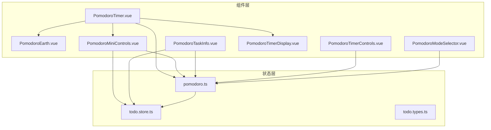
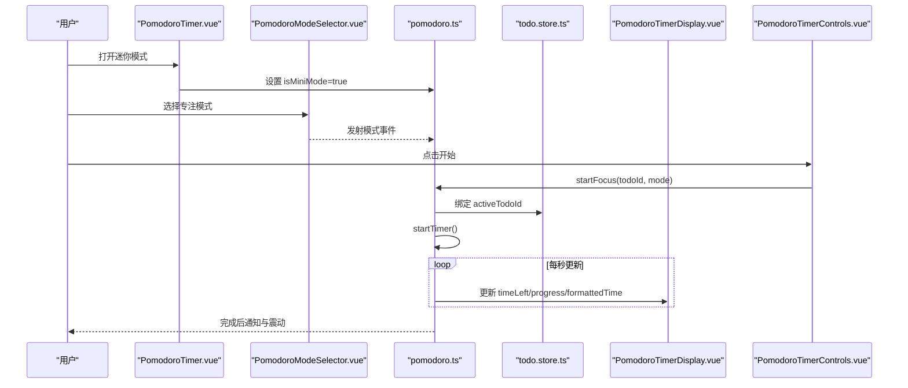
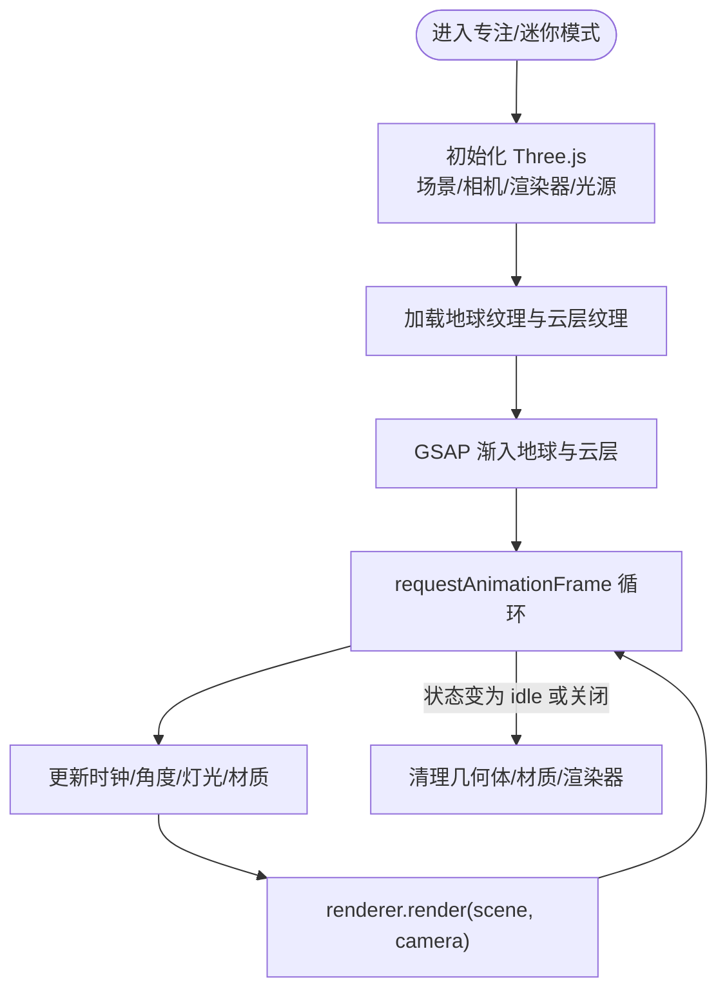
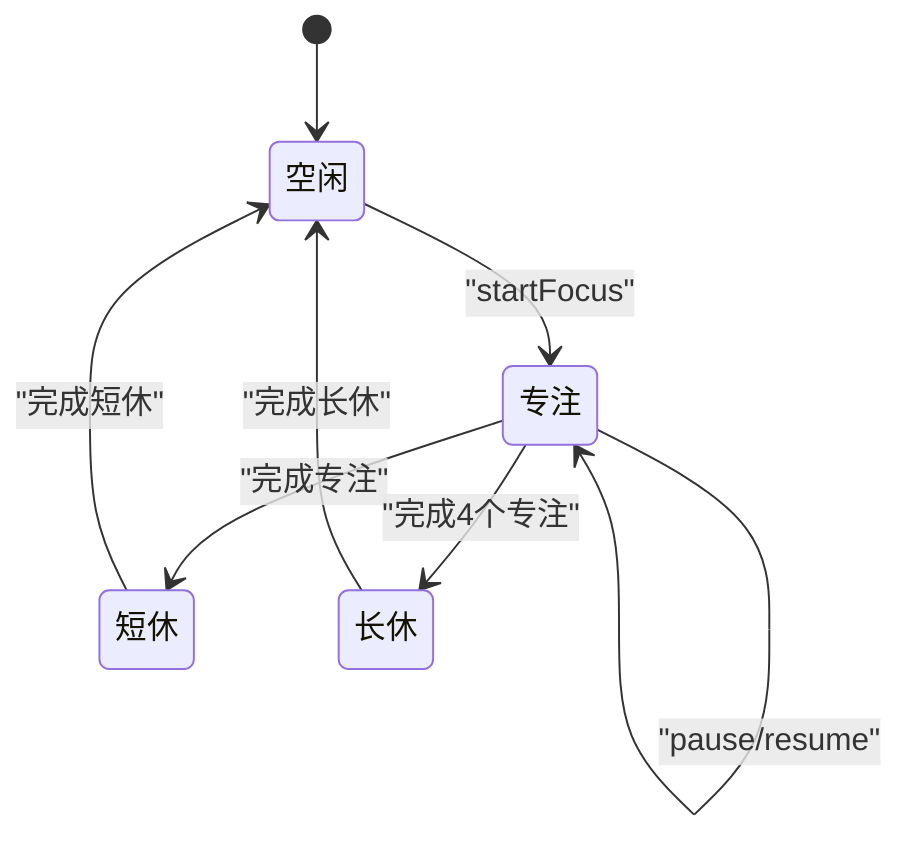
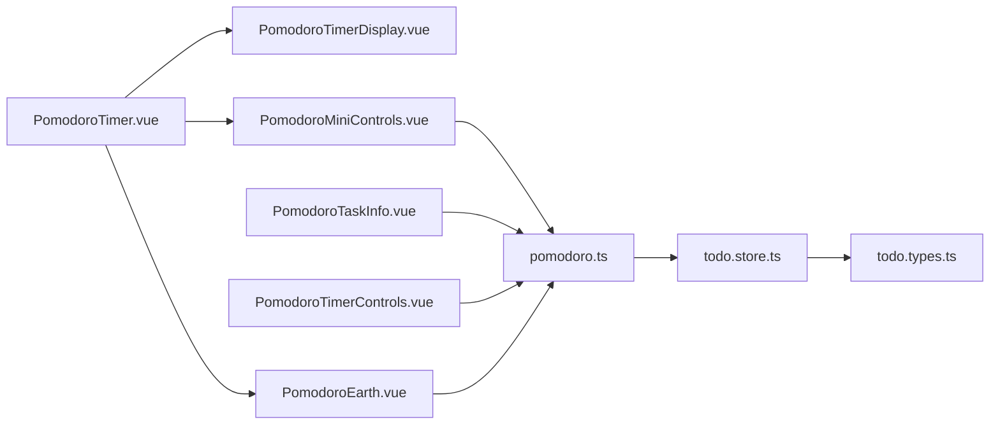

# Pomodoro专注模式

<cite>
**本文引用的文件**
- [PomodoroTimer.vue](file://apps/frontend/src/features/todo/components/PomodoroTimer.vue)
- [PomodoroEarth.vue](file://apps/frontend/src/features/todo/components/pomodoro/PomodoroEarth.vue)
- [PomodoroMiniControls.vue](file://apps/frontend/src/features/todo/components/pomodoro/PomodoroMiniControls.vue)
- [PomodoroTaskInfo.vue](file://apps/frontend/src/features/todo/components/pomodoro/PomodoroTaskInfo.vue)
- [PomodoroTimerControls.vue](file://apps/frontend/src/features/todo/components/pomodoro/PomodoroTimerControls.vue)
- [PomodoroTimerDisplay.vue](file://apps/frontend/src/features/todo/components/pomodoro/PomodoroTimerDisplay.vue)
- [pomodoro.ts](file://apps/frontend/src/features/todo/stores/pomodoro.ts)
- [todo.store.ts](file://apps/frontend/src/features/todo/stores/todo.store.ts)
- [todo.types.ts](file://apps/frontend/src/features/todo/stores/todo.types.ts)
- [PomodoroModeSelector.vue](file://apps/frontend/src/features/todo/components/PomodoroModeSelector.vue)
</cite>

## 目录
1. [简介](#简介)
2. [项目结构](#项目结构)
3. [核心组件](#核心组件)
4. [架构总览](#架构总览)
5. [组件详解](#组件详解)
6. [依赖关系分析](#依赖关系分析)
7. [性能考量](#性能考量)
8. [故障排查指南](#故障排查指南)
9. [结论](#结论)
10. [附录](#附录)

## 简介
本文件面向前端开发者与产品设计人员，系统性阐述 Todo 应用中“Pomodoro专注模式”的技术实现。内容覆盖：
- 计时器组件的时间管理机制：计时逻辑、状态切换、震动反馈、暂停/恢复
- 3D地球动画组件的交互与渲染：鼠标跟随、粒子系统、渐变背景、性能优化
- 迷你模式界面：紧凑控制、任务信息展示、控制按钮
- 可视化显示：进度环绘制、时间格式化、主题色适配
- 与待办事项的深度集成：任务绑定、自动暂停/恢复、完成反馈、统计收集

## 项目结构
围绕 Pomodoro 的核心文件组织如下：
- 组件层（Vue 单文件组件）：PomodoroTimer、PomodoroEarth、PomodoroMiniControls、PomodoroTaskInfo、PomodoroTimerControls、PomodoroTimerDisplay
- 状态层（Pinia Store）：pomodoro.ts（专注计时）、todo.store.ts（待办列表）
- 模式选择器：PomodoroModeSelector.vue（提供多种专注模式配置）

图示来源
- [PomodoroTimer.vue:1-174](file://apps/frontend/src/features/todo/components/PomodoroTimer.vue#L1-L174)
- [PomodoroEarth.vue:1-581](file://apps/frontend/src/features/todo/components/pomodoro/PomodoroEarth.vue#L1-L581)
- [PomodoroMiniControls.vue:1-80](file://apps/frontend/src/features/todo/components/pomodoro/PomodoroMiniControls.vue#L1-L80)
- [PomodoroTaskInfo.vue:1-34](file://apps/frontend/src/features/todo/components/pomodoro/PomodoroTaskInfo.vue#L1-L34)
- [PomodoroTimerControls.vue:1-48](file://apps/frontend/src/features/todo/components/pomodoro/PomodoroTimerControls.vue#L1-L48)
- [PomodoroTimerDisplay.vue:1-142](file://apps/frontend/src/features/todo/components/pomodoro/PomodoroTimerDisplay.vue#L1-L142)
- [pomodoro.ts:1-402](file://apps/frontend/src/features/todo/stores/pomodoro.ts#L1-L402)
- [todo.store.ts:1-335](file://apps/frontend/src/features/todo/stores/todo.store.ts#L1-L335)
- [todo.types.ts:1-68](file://apps/frontend/src/features/todo/stores/todo.types.ts#L1-L68)
- [PomodoroModeSelector.vue:1-75](file://apps/frontend/src/features/todo/components/PomodoroModeSelector.vue#L1-L75)

章节来源
- [PomodoroTimer.vue:1-174](file://apps/frontend/src/features/todo/components/PomodoroTimer.vue#L1-L174)
- [PomodoroEarth.vue:1-581](file://apps/frontend/src/features/todo/components/pomodoro/PomodoroEarth.vue#L1-L581)
- [pomodoro.ts:1-402](file://apps/frontend/src/features/todo/stores/pomodoro.ts#L1-L402)
- [todo.store.ts:1-335](file://apps/frontend/src/features/todo/stores/todo.store.ts#L1-L335)
- [todo.types.ts:1-68](file://apps/frontend/src/features/todo/stores/todo.types.ts#L1-L68)
- [PomodoroModeSelector.vue:1-75](file://apps/frontend/src/features/todo/components/PomodoroModeSelector.vue#L1-L75)

## 核心组件
- 计时器与迷你模式容器：PomodoroTimer 负责在浏览器或桌面端以固定尺寸卡片呈现，并根据状态执行入场动画、背景玻璃拟态与阴影。
- 3D地球动画：PomodoroEarth 使用 Three.js 构建地球、云层、大气辉光与星场，支持鼠标跟随、轨道运动、灯光动态与纹理渐入。
- 迷你控制区：PomodoroMiniControls 展示当前任务标题、重置按钮与AI助手入口，移动端/非移动端行为差异。
- 任务信息展示：PomodoroTaskInfo 呈现当前专注任务的标题与图标。
- 控制按钮：PomodoroTimerControls 提供开始/暂停、重置等操作。
- 时间显示与进度：PomodoroTimerDisplay 渲染圆形进度环、时间文本与星核辉光，适配深浅主题。
- 状态管理：pomodoro.ts 定义专注状态、模式配置、计时逻辑、历史统计与持久化；todo.store.ts 管理待办列表与同步。

章节来源
- [PomodoroTimer.vue:1-174](file://apps/frontend/src/features/todo/components/PomodoroTimer.vue#L1-L174)
- [PomodoroEarth.vue:1-581](file://apps/frontend/src/features/todo/components/pomodoro/PomodoroEarth.vue#L1-L581)
- [PomodoroMiniControls.vue:1-80](file://apps/frontend/src/features/todo/components/pomodoro/PomodoroMiniControls.vue#L1-L80)
- [PomodoroTaskInfo.vue:1-34](file://apps/frontend/src/features/todo/components/pomodoro/PomodoroTaskInfo.vue#L1-L34)
- [PomodoroTimerControls.vue:1-48](file://apps/frontend/src/features/todo/components/pomodoro/PomodoroTimerControls.vue#L1-L48)
- [PomodoroTimerDisplay.vue:1-142](file://apps/frontend/src/features/todo/components/pomodoro/PomodoroTimerDisplay.vue#L1-L142)
- [pomodoro.ts:1-402](file://apps/frontend/src/features/todo/stores/pomodoro.ts#L1-L402)
- [todo.store.ts:1-335](file://apps/frontend/src/features/todo/stores/todo.store.ts#L1-L335)

## 架构总览
专注模式采用“组件 + 状态”分层：
- 视图层：各子组件负责局部UI与交互
- 状态层：Pinia Store 统一管理专注状态、计时、模式、历史与持久化
- 集成层：与待办列表联动，完成任务计数与统计

图示来源
- [PomodoroTimer.vue:1-174](file://apps/frontend/src/features/todo/components/PomodoroTimer.vue#L1-L174)
- [PomodoroModeSelector.vue:1-75](file://apps/frontend/src/features/todo/components/PomodoroModeSelector.vue#L1-L75)
- [pomodoro.ts:196-356](file://apps/frontend/src/features/todo/stores/pomodoro.ts#L196-L356)
- [todo.store.ts:1-335](file://apps/frontend/src/features/todo/stores/todo.store.ts#L1-L335)
- [PomodoroTimerDisplay.vue:1-142](file://apps/frontend/src/features/todo/components/pomodoro/PomodoroTimerDisplay.vue#L1-L142)
- [PomodoroTimerControls.vue:1-48](file://apps/frontend/src/features/todo/components/pomodoro/PomodoroTimerControls.vue#L1-L48)

## 组件详解

### 计时器与迷你模式容器（PomodoroTimer）
- 定位与尺寸：根据平台（浏览器/Wails）计算卡片位置与宽高；迷你模式下固定全屏尺寸并启用拖拽区域。
- 动画入场：状态变化时使用 GSAP 执行缩放/旋转/透明度过渡。
- 背景与玻璃拟态：根据主题与是否已加载地球背景，动态设置圆角、边框、阴影与背景色。
- 子组件组合：内嵌迷你控制区与时间显示。

章节来源
- [PomodoroTimer.vue:25-47](file://apps/frontend/src/features/todo/components/PomodoroTimer.vue#L25-L47)
- [PomodoroTimer.vue:50-76](file://apps/frontend/src/features/todo/components/PomodoroTimer.vue#L50-L76)
- [PomodoroTimer.vue:94-114](file://apps/frontend/src/features/todo/components/PomodoroTimer.vue#L94-L114)

### 3D地球动画（PomodoroEarth）
- 初始化与生命周期：首次进入专注或迷你模式时初始化 Three.js 场景、相机、渲染器与光源；窗口大小变化时重算投影矩阵与像素比。
- 地球与材质：地球主体、云层、大气辉光三重几何体，使用纹理贴图与 Shader 材质实现辉光与发光。
- 粒子系统：远近两层星场与银河辉光，带颜色随机与衰减混合。
- 动画循环：基于兼容性选择 Timer/Clock，按帧更新地球自转、轨道、缩放与灯光；根据鼠标位置进行轻微视差偏移；根据状态动态调整辉光颜色与强度。
- 性能优化：限制设备像素比、使用缓冲几何体、按需淡入纹理、清理时释放资源。

图示来源
- [PomodoroEarth.vue:39-54](file://apps/frontend/src/features/todo/components/pomodoro/PomodoroEarth.vue#L39-L54)
- [PomodoroEarth.vue:107-116](file://apps/frontend/src/features/todo/components/pomodoro/PomodoroEarth.vue#L107-L116)
- [PomodoroEarth.vue:297-464](file://apps/frontend/src/features/todo/components/pomodoro/PomodoroEarth.vue#L297-L464)
- [PomodoroEarth.vue:497-520](file://apps/frontend/src/features/todo/components/pomodoro/PomodoroEarth.vue#L497-L520)

章节来源
- [PomodoroEarth.vue:1-581](file://apps/frontend/src/features/todo/components/pomodoro/PomodoroEarth.vue#L1-L581)

### 迷你控制区（PomodoroMiniControls）
- 任务标题：居中显示当前专注任务标题，悬停卡片时半透明缩放。
- 行为按钮：右侧重置按钮；左侧AI助手入口（非Wails平台），避免与拖拽冲突。
- 响应式：移动端默认可见，非移动端仅悬停显示。

章节来源
- [PomodoroMiniControls.vue:1-80](file://apps/frontend/src/features/todo/components/pomodoro/PomodoroMiniControls.vue#L1-L80)

### 任务信息展示（PomodoroTaskInfo）
- 当存在活动任务时展示卡片，包含任务图标与标题。
- 背景模糊与边框，悬停放大效果。

章节来源
- [PomodoroTaskInfo.vue:1-34](file://apps/frontend/src/features/todo/components/pomodoro/PomodoroTaskInfo.vue#L1-L34)

### 控制按钮（PomodoroTimerControls）
- 开始/暂停：大圆形按钮，运行时显示暂停样式，悬停缩放。
- 重置：方形按钮，悬停高亮。
- 拖拽禁用：通过 CSS 变量标记 no-drag 区域。

章节来源
- [PomodoroTimerControls.vue:1-48](file://apps/frontend/src/features/todo/components/pomodoro/PomodoroTimerControls.vue#L1-L48)

### 时间显示与进度（PomodoroTimerDisplay）
- 进度环：SVG 圆形轨道与描边，基于进度动态计算 dashoffset。
- 星核辉光：根据运行状态显示脉冲动画与模糊效果。
- 文本：等宽字体，深浅主题下的阴影与字号差异。
- 主题适配：使用 CSS 变量获取主题色，用于进度环与标题徽标。

章节来源
- [PomodoroTimerDisplay.vue:1-142](file://apps/frontend/src/features/todo/components/pomodoro/PomodoroTimerDisplay.vue#L1-L142)

### 状态管理（pomodoro.ts）
- 状态与模式：专注、短休、长休、空闲；支持四种模式及其时长配置。
- 计时逻辑：使用 setInterval 与目标结束时间对齐，确保刷新后可恢复计时。
- 自动暂停/恢复：页面恢复时根据目标时间重新计算剩余时间并启动计时。
- 完成处理：完成专注后累加会话数与历史分钟数，按周期切换到长/短休；向待办增加专注次数；触发震动与系统通知；更新文档标题与favicon进度。
- 持久化：仅持久化必要字段，避免污染。

图示来源
- [pomodoro.ts:196-356](file://apps/frontend/src/features/todo/stores/pomodoro.ts#L196-L356)

章节来源
- [pomodoro.ts:1-402](file://apps/frontend/src/features/todo/stores/pomodoro.ts#L1-L402)

### 待办事项集成（todo.store.ts 与 todo.types.ts）
- 类型扩展：在共享类型基础上增加 pomodoroCount 字段，用于记录单任务专注次数。
- 专注计数：专注完成后调用 incrementPomodoro，更新本地存储。
- 数据源：支持本地/远程两种数据源，登录/登出时切换与清理。

章节来源
- [todo.types.ts:1-68](file://apps/frontend/src/features/todo/stores/todo.types.ts#L1-L68)
- [todo.store.ts:139-160](file://apps/frontend/src/features/todo/stores/todo.store.ts#L139-L160)
- [todo.store.ts:297-315](file://apps/frontend/src/features/todo/stores/todo.store.ts#L297-L315)

### 模式选择器（PomodoroModeSelector）
- 下拉菜单：展示四种模式，包含图标、名称、描述与时长标签。
- 事件发射：选择后向外发出模式事件，供上层组件处理。

章节来源
- [PomodoroModeSelector.vue:1-75](file://apps/frontend/src/features/todo/components/PomodoroModeSelector.vue#L1-L75)

## 依赖关系分析
- 组件依赖：PomodoroTimer 作为容器，组合 MiniControls、TimerDisplay；PomodoroEarth 作为背景独立渲染；PomodoroMiniControls 与 PomodoroTaskInfo 依赖 pomodoro.ts；PomodoroTimerControls 依赖 pomodoro.ts；PomodoroTimerDisplay 依赖 pomodoro.ts 与主题。
- 状态依赖：pomodoro.ts 依赖 todo.store.ts 获取当前任务；todo.store.ts 依赖 todo.types.ts 的类型定义。
- 外部库：Three.js 用于3D渲染；GSAP 用于动画；Capacitor Haptics 用于震动反馈；Pinia 用于状态持久化。

图示来源
- [PomodoroTimer.vue:1-174](file://apps/frontend/src/features/todo/components/PomodoroTimer.vue#L1-L174)
- [PomodoroEarth.vue:1-581](file://apps/frontend/src/features/todo/components/pomodoro/PomodoroEarth.vue#L1-L581)
- [PomodoroMiniControls.vue:1-80](file://apps/frontend/src/features/todo/components/pomodoro/PomodoroMiniControls.vue#L1-L80)
- [PomodoroTaskInfo.vue:1-34](file://apps/frontend/src/features/todo/components/pomodoro/PomodoroTaskInfo.vue#L1-L34)
- [PomodoroTimerControls.vue:1-48](file://apps/frontend/src/features/todo/components/pomodoro/PomodoroTimerControls.vue#L1-L48)
- [PomodoroTimerDisplay.vue:1-142](file://apps/frontend/src/features/todo/components/pomodoro/PomodoroTimerDisplay.vue#L1-L142)
- [pomodoro.ts:1-402](file://apps/frontend/src/features/todo/stores/pomodoro.ts#L1-L402)
- [todo.store.ts:1-335](file://apps/frontend/src/features/todo/stores/todo.store.ts#L1-L335)
- [todo.types.ts:1-68](file://apps/frontend/src/features/todo/stores/todo.types.ts#L1-L68)

## 性能考量
- 3D渲染优化
  - 设备像素比上限：限制为2，避免高分屏过度消耗。
  - 几何体复用：使用 BufferGeometry 与共享材质，减少对象数量。
  - 按需加载：纹理加载失败仍继续渲染，保证体验连续性。
  - 动画节流：使用 requestAnimationFrame 与 GSAP 缓动，避免高频重绘。
- 计时精度与恢复
  - 基于目标结束时间对齐，刷新后可恢复计时，避免跳步。
  - 仅持久化关键字段，降低序列化成本。
- UI与主题
  - 进度环使用 SVG 与 CSS 变量，避免复杂脚本计算。
  - 玻璃拟态与阴影在深色模式下增强对比度，提升可读性。

章节来源
- [PomodoroEarth.vue:66-68](file://apps/frontend/src/features/todo/components/pomodoro/PomodoroEarth.vue#L66-L68)
- [PomodoroEarth.vue:107-116](file://apps/frontend/src/features/todo/components/pomodoro/PomodoroEarth.vue#L107-L116)
- [pomodoro.ts:248-265](file://apps/frontend/src/features/todo/stores/pomodoro.ts#L248-L265)
- [PomodoroTimerDisplay.vue:69-77](file://apps/frontend/src/features/todo/components/pomodoro/PomodoroTimerDisplay.vue#L69-L77)

## 故障排查指南
- 3D地球不显示
  - 检查是否处于专注或迷你模式；确认 canvasRef 已挂载；查看纹理加载回调与错误处理。
  - 关注初始化与清理流程，确保渲染器未被提前 dispose。
- 计时不走或跳步
  - 确认目标结束时间与当前时间对齐；检查刷新后自动恢复逻辑。
  - 查看定时器是否重复启动或被意外清除。
- 震动/通知无效
  - 确认 Capacitor Haptics 服务可用；检查平台判断逻辑（Wails）。
- favicon 不更新
  - 确保主题色变量存在；检查动态 favicon 链接替换逻辑。

章节来源
- [PomodoroEarth.vue:497-520](file://apps/frontend/src/features/todo/components/pomodoro/PomodoroEarth.vue#L497-L520)
- [pomodoro.ts:227-245](file://apps/frontend/src/features/todo/stores/pomodoro.ts#L227-L245)
- [pomodoro.ts:317-320](file://apps/frontend/src/features/todo/stores/pomodoro.ts#L317-L320)
- [pomodoro.ts:131-177](file://apps/frontend/src/features/todo/stores/pomodoro.ts#L131-L177)

## 结论
该实现以清晰的组件边界与 Pinia 状态管理为核心，结合 Three.js 的沉浸式背景与精细的计时逻辑，提供了跨平台、可恢复、可统计的专注体验。通过模式选择、任务绑定与完成反馈，形成从“任务—计时—统计”的闭环。

## 附录
- 模式配置：四种专注模式的时长映射，供模式选择器与计时器使用。
- 待办类型：在共享类型基础上扩展 pomodoroCount 字段，便于统计与展示。

章节来源
- [pomodoro.ts:20-25](file://apps/frontend/src/features/todo/stores/pomodoro.ts#L20-L25)
- [todo.types.ts:17-17](file://apps/frontend/src/features/todo/stores/todo.types.ts#L17-L17)