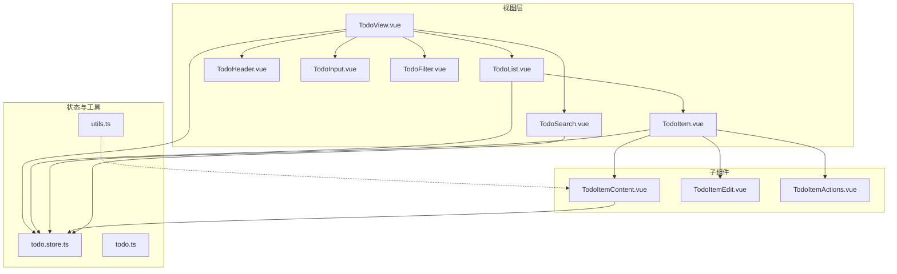
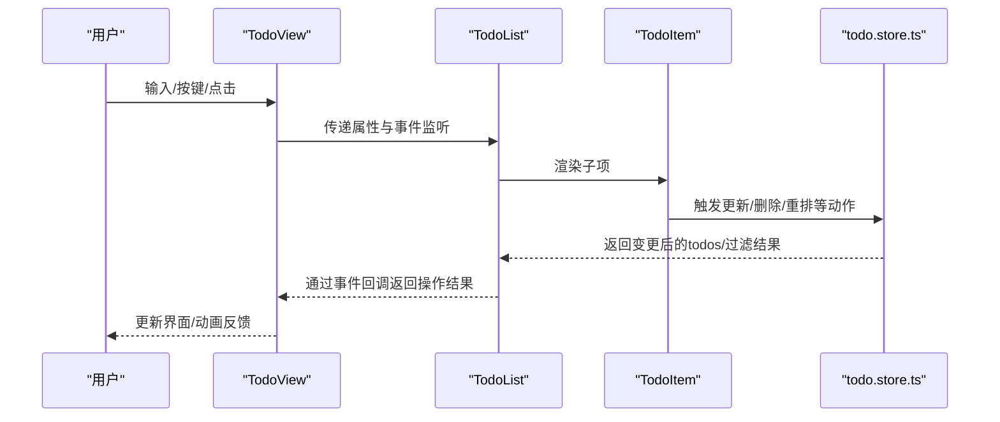
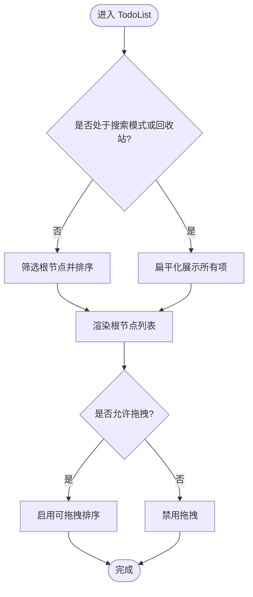
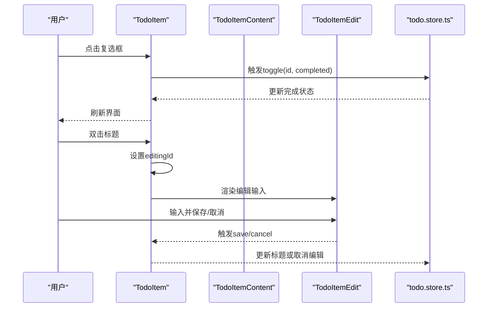
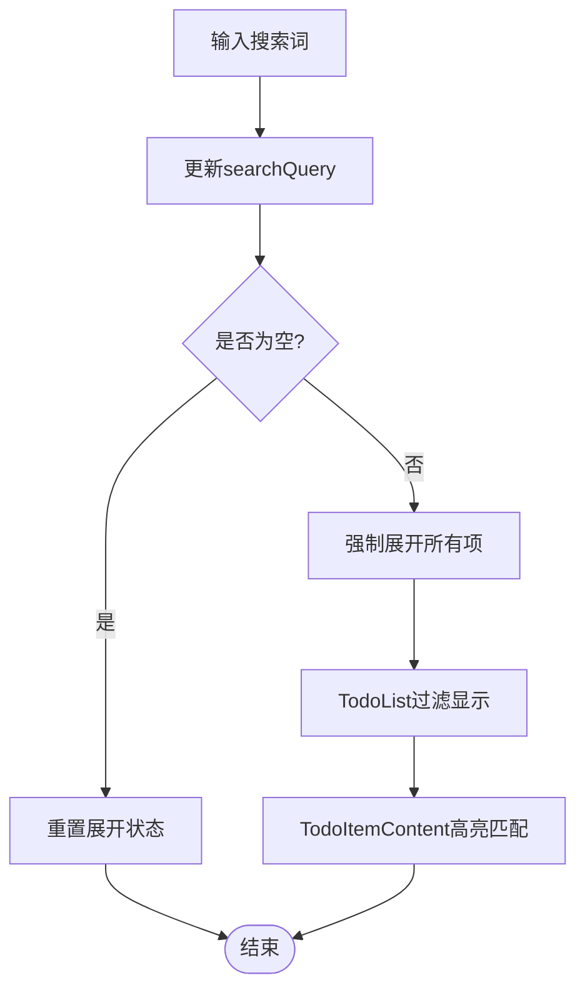
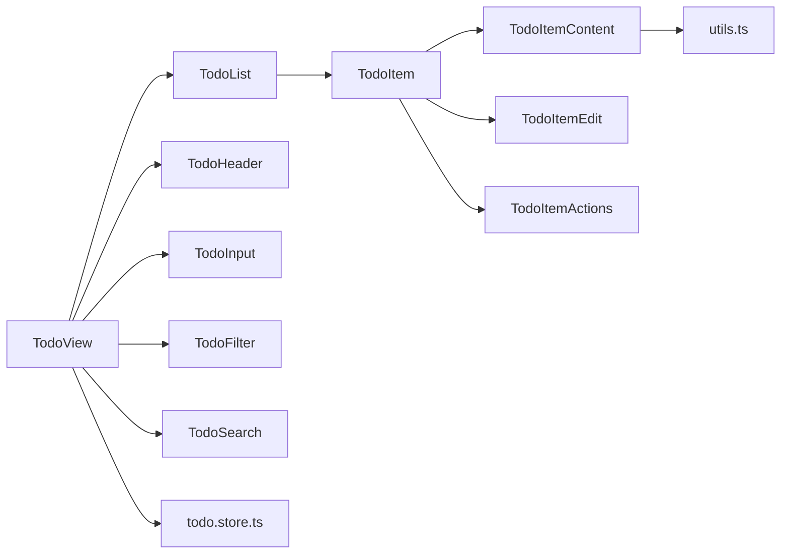

# UI组件系统

<cite>
**本文引用的文件**
- [apps/frontend/src/features/todo/TodoView.vue](file://apps/frontend/src/features/todo/TodoView.vue)
- [apps/frontend/src/features/todo/components/TodoList.vue](file://apps/frontend/src/features/todo/components/TodoList.vue)
- [apps/frontend/src/features/todo/components/TodoItem.vue](file://apps/frontend/src/features/todo/components/TodoItem.vue)
- [apps/frontend/src/features/todo/components/TodoHeader.vue](file://apps/frontend/src/features/todo/components/TodoHeader.vue)
- [apps/frontend/src/features/todo/components/TodoInput.vue](file://apps/frontend/src/features/todo/components/TodoInput.vue)
- [apps/frontend/src/features/todo/components/TodoFilter.vue](file://apps/frontend/src/features/todo/components/TodoFilter.vue)
- [apps/frontend/src/features/todo/components/TodoSearch.vue](file://apps/frontend/src/features/todo/components/TodoSearch.vue)
- [apps/frontend/src/features/todo/components/TodoItemContent.vue](file://apps/frontend/src/features/todo/components/TodoItemContent.vue)
- [apps/frontend/src/features/todo/components/TodoItemEdit.vue](file://apps/frontend/src/features/todo/components/TodoItemEdit.vue)
- [apps/frontend/src/features/todo/components/TodoItemActions.vue](file://apps/frontend/src/features/todo/components/TodoItemActions.vue)
- [apps/frontend/src/features/todo/stores/todo.store.ts](file://apps/frontend/src/features/todo/stores/todo.store.ts)
- [apps/frontend/src/features/todo/stores/todo.ts](file://apps/frontend/src/features/todo/stores/todo.ts)
- [apps/frontend/src/lib/utils.ts](file://apps/frontend/src/lib/utils.ts)
</cite>

## 目录
1. [简介](#简介)
2. [项目结构](#项目结构)
3. [核心组件](#核心组件)
4. [架构总览](#架构总览)
5. [详细组件分析](#详细组件分析)
6. [依赖关系分析](#依赖关系分析)
7. [性能考量](#性能考量)
8. [故障排查指南](#故障排查指南)
9. [结论](#结论)
10. [附录](#附录)

## 简介
本文件为待办事项UI组件系统的深度技术文档，围绕以下目标展开：
- 深入解析TodoList组件的虚拟滚动实现原理、性能优化策略与大数据量渲染处理
- 文档化TodoItem组件的状态管理：完成状态切换、编辑模式、删除动画、拖拽排序交互
- 详解TodoHeader组件的布局设计、响应式适配、主题切换功能
- 解释TodoInput组件的输入验证、快捷键支持、自动完成、错误提示机制
- 包含TodoFilter组件的过滤逻辑、状态图标、筛选条件持久化
- 说明TodoSearch组件的搜索算法、防抖处理、结果高亮显示

## 项目结构
该系统采用“特性驱动”的组织方式，UI组件集中在features/todo目录下，配合Pinia状态管理与可组合函数（composables）实现清晰的职责分离。

图表来源
- [apps/frontend/src/features/todo/TodoView.vue:1-580](file://apps/frontend/src/features/todo/TodoView.vue#L1-L580)
- [apps/frontend/src/features/todo/components/TodoList.vue:1-190](file://apps/frontend/src/features/todo/components/TodoList.vue#L1-L190)
- [apps/frontend/src/features/todo/components/TodoItem.vue:1-406](file://apps/frontend/src/features/todo/components/TodoItem.vue#L1-L406)
- [apps/frontend/src/features/todo/components/TodoHeader.vue:1-421](file://apps/frontend/src/features/todo/components/TodoHeader.vue#L1-L421)
- [apps/frontend/src/features/todo/components/TodoInput.vue:1-202](file://apps/frontend/src/features/todo/components/TodoInput.vue#L1-L202)
- [apps/frontend/src/features/todo/components/TodoFilter.vue:1-204](file://apps/frontend/src/features/todo/components/TodoFilter.vue#L1-L204)
- [apps/frontend/src/features/todo/components/TodoSearch.vue:1-88](file://apps/frontend/src/features/todo/components/TodoSearch.vue#L1-L88)
- [apps/frontend/src/features/todo/components/TodoItemContent.vue:1-231](file://apps/frontend/src/features/todo/components/TodoItemContent.vue#L1-L231)
- [apps/frontend/src/features/todo/components/TodoItemEdit.vue:1-101](file://apps/frontend/src/features/todo/components/TodoItemEdit.vue#L1-L101)
- [apps/frontend/src/features/todo/components/TodoItemActions.vue:1-92](file://apps/frontend/src/features/todo/components/TodoItemActions.vue#L1-L92)
- [apps/frontend/src/features/todo/stores/todo.store.ts:1-335](file://apps/frontend/src/features/todo/stores/todo.store.ts#L1-L335)
- [apps/frontend/src/features/todo/stores/todo.ts:1-3](file://apps/frontend/src/features/todo/stores/todo.ts#L1-L3)
- [apps/frontend/src/lib/utils.ts:1-33](file://apps/frontend/src/lib/utils.ts#L1-L33)

章节来源
- [apps/frontend/src/features/todo/TodoView.vue:1-580](file://apps/frontend/src/features/todo/TodoView.vue#L1-L580)
- [apps/frontend/src/features/todo/components/TodoList.vue:1-190](file://apps/frontend/src/features/todo/components/TodoList.vue#L1-L190)
- [apps/frontend/src/features/todo/components/TodoItem.vue:1-406](file://apps/frontend/src/features/todo/components/TodoItem.vue#L1-L406)
- [apps/frontend/src/features/todo/components/TodoHeader.vue:1-421](file://apps/frontend/src/features/todo/components/TodoHeader.vue#L1-L421)
- [apps/frontend/src/features/todo/components/TodoInput.vue:1-202](file://apps/frontend/src/features/todo/components/TodoInput.vue#L1-L202)
- [apps/frontend/src/features/todo/components/TodoFilter.vue:1-204](file://apps/frontend/src/features/todo/components/TodoFilter.vue#L1-L204)
- [apps/frontend/src/features/todo/components/TodoSearch.vue:1-88](file://apps/frontend/src/features/todo/components/TodoSearch.vue#L1-L88)
- [apps/frontend/src/features/todo/components/TodoItemContent.vue:1-231](file://apps/frontend/src/features/todo/components/TodoItemContent.vue#L1-L231)
- [apps/frontend/src/features/todo/components/TodoItemEdit.vue:1-101](file://apps/frontend/src/features/todo/components/TodoItemEdit.vue#L1-L101)
- [apps/frontend/src/features/todo/components/TodoItemActions.vue:1-92](file://apps/frontend/src/features/todo/components/TodoItemActions.vue#L1-L92)
- [apps/frontend/src/features/todo/stores/todo.store.ts:1-335](file://apps/frontend/src/features/todo/stores/todo.store.ts#L1-L335)
- [apps/frontend/src/features/todo/stores/todo.ts:1-3](file://apps/frontend/src/features/todo/stores/todo.ts#L1-L3)
- [apps/frontend/src/lib/utils.ts:1-33](file://apps/frontend/src/lib/utils.ts#L1-L33)

## 核心组件
- TodoView：顶层容器，协调头部、输入区、过滤器、搜索条与列表/可视化/统计视图的切换与过渡动画，并注入GSAP上下文以实现高性能动画。
- TodoList：负责渲染待办列表，支持空态、拖拽排序、搜索与回收站模式下的扁平化展示。
- TodoItem：单个待办项，包含完成状态、编辑、子任务、展开/折叠、动作面板等；支持递归渲染与拖拽排序。
- TodoHeader：应用品牌、视图模式切换、主题/语言切换、数据源切换、用户登录入口等。
- TodoInput：输入框与添加按钮，内置简单自然语言日期解析、错误提示与自动聚焦。
- TodoFilter：过滤标签页（进行中/已完成）、搜索开关、回收站过滤、清空回收站、展开/折叠全部。
- TodoSearch：搜索输入与快捷键处理（ESC清空或关闭），支持清除按钮与自动聚焦。
- 子组件：TodoItemContent（内容与元信息展示、高亮）、TodoItemEdit（编辑输入）、TodoItemActions（动作面板）。

章节来源
- [apps/frontend/src/features/todo/TodoView.vue:1-580](file://apps/frontend/src/features/todo/TodoView.vue#L1-L580)
- [apps/frontend/src/features/todo/components/TodoList.vue:1-190](file://apps/frontend/src/features/todo/components/TodoList.vue#L1-L190)
- [apps/frontend/src/features/todo/components/TodoItem.vue:1-406](file://apps/frontend/src/features/todo/components/TodoItem.vue#L1-L406)
- [apps/frontend/src/features/todo/components/TodoHeader.vue:1-421](file://apps/frontend/src/features/todo/components/TodoHeader.vue#L1-L421)
- [apps/frontend/src/features/todo/components/TodoInput.vue:1-202](file://apps/frontend/src/features/todo/components/TodoInput.vue#L1-L202)
- [apps/frontend/src/features/todo/components/TodoFilter.vue:1-204](file://apps/frontend/src/features/todo/components/TodoFilter.vue#L1-L204)
- [apps/frontend/src/features/todo/components/TodoSearch.vue:1-88](file://apps/frontend/src/features/todo/components/TodoSearch.vue#L1-L88)
- [apps/frontend/src/features/todo/components/TodoItemContent.vue:1-231](file://apps/frontend/src/features/todo/components/TodoItemContent.vue#L1-L231)
- [apps/frontend/src/features/todo/components/TodoItemEdit.vue:1-101](file://apps/frontend/src/features/todo/components/TodoItemEdit.vue#L1-L101)
- [apps/frontend/src/features/todo/components/TodoItemActions.vue:1-92](file://apps/frontend/src/features/todo/components/TodoItemActions.vue#L1-L92)

## 架构总览
系统采用“视图-组件-状态”三层协作：
- 视图层（TodoView）通过Pinia状态驱动组件树，使用GSAP实现视图切换与卡片倾斜等动画。
- 组件层（TodoList/TodoItem等）通过事件向上冒泡，由TodoView统一处理业务逻辑（如切换完成状态、编辑、删除、拖拽重排）。
- 状态层（todo.store.ts）集中管理待办数据、过滤、视图模式、搜索、拖拽状态、同步冲突、数据源等，并提供持久化配置。

图表来源
- [apps/frontend/src/features/todo/TodoView.vue:180-247](file://apps/frontend/src/features/todo/TodoView.vue#L180-L247)
- [apps/frontend/src/features/todo/components/TodoList.vue:25-34](file://apps/frontend/src/features/todo/components/TodoList.vue#L25-L34)
- [apps/frontend/src/features/todo/components/TodoItem.vue:37-46](file://apps/frontend/src/features/todo/components/TodoItem.vue#L37-L46)
- [apps/frontend/src/features/todo/stores/todo.store.ts:162-203](file://apps/frontend/src/features/todo/stores/todo.store.ts#L162-L203)

## 详细组件分析

### TodoList 组件：虚拟滚动与大数据渲染
- 渲染策略
  - 使用滚动区域组件承载列表，内部通过可拖拽列表实现根节点的拖拽排序。
  - 在非搜索模式下，仅展示根节点，子任务通过TodoItem递归渲染，避免一次性渲染大量节点。
  - 搜索模式与回收站模式下，直接扁平化展示，便于快速浏览。
- 性能优化
  - 通过computed缓存displayTodos，减少重复计算。
  - 拖拽禁用在搜索期间，降低复杂度。
  - 使用滚动区域组件限制可视区域，避免全量DOM。
- 大数据量处理
  - 通过分层渲染与懒加载（isExpanded控制）减少初始渲染压力。
  - 拖拽动画时长与类名配置（ghost-class/chosen-class/drag-class）保证流畅性。

图表来源
- [apps/frontend/src/features/todo/components/TodoList.vue:76-87](file://apps/frontend/src/features/todo/components/TodoList.vue#L76-L87)
- [apps/frontend/src/features/todo/components/TodoList.vue:125-138](file://apps/frontend/src/features/todo/components/TodoList.vue#L125-L138)

章节来源
- [apps/frontend/src/features/todo/components/TodoList.vue:1-190](file://apps/frontend/src/features/todo/components/TodoList.vue#L1-L190)

### TodoItem 组件：状态管理与交互
- 状态管理
  - 完成状态：通过Checkbox触发toggle事件，由父级统一处理。
  - 编辑模式：当editingId匹配当前项时，渲染TodoItemEdit；保存/取消通过事件回传。
  - 删除与恢复：在回收站模式下，提供恢复与永久删除动作。
  - 展开/折叠：根据expanded状态与父子关系控制子任务渲染。
- 交互细节
  - 拖拽排序：支持根节点与子任务两层拖拽，分别维护各自顺序。
  - 子任务添加：进入添加子任务模式后自动展开父项。
  - AI拆分：调用AI服务生成子任务，提供撤销提示。
- 错误反馈
  - 当store.error存在且处于编辑或添加子任务场景，显示提示反馈。

图表来源
- [apps/frontend/src/features/todo/components/TodoItem.vue:145-156](file://apps/frontend/src/features/todo/components/TodoItem.vue#L145-L156)
- [apps/frontend/src/features/todo/components/TodoItem.vue:261-271](file://apps/frontend/src/features/todo/components/TodoItem.vue#L261-L271)
- [apps/frontend/src/features/todo/components/TodoItem.vue:33-46](file://apps/frontend/src/features/todo/components/TodoItem.vue#L33-L46)
- [apps/frontend/src/features/todo/stores/todo.store.ts:186-203](file://apps/frontend/src/features/todo/stores/todo.store.ts#L186-L203)

章节来源
- [apps/frontend/src/features/todo/components/TodoItem.vue:1-406](file://apps/frontend/src/features/todo/components/TodoItem.vue#L1-L406)
- [apps/frontend/src/features/todo/components/TodoItemContent.vue:1-231](file://apps/frontend/src/features/todo/components/TodoItemContent.vue#L1-L231)
- [apps/frontend/src/features/todo/components/TodoItemEdit.vue:1-101](file://apps/frontend/src/features/todo/components/TodoItemEdit.vue#L1-L101)
- [apps/frontend/src/features/todo/components/TodoItemActions.vue:1-92](file://apps/frontend/src/features/todo/components/TodoItemActions.vue#L1-L92)

### TodoHeader 组件：布局、响应式与主题切换
- 布局与响应式
  - 品牌区与操作区水平分布，移动端通过下拉菜单整合工具。
  - 视图模式切换（列表/可视化/统计）在桌面端以按钮组呈现，在移动端通过下拉菜单。
- 主题与语言
  - 主题切换与颜色选择器集成，支持本地持久化。
  - 语言切换写入localStorage，即时生效。
- 数据源
  - 本地/云端数据源切换，云端需登录态；切换时触发合并与同步初始化。
- 用户入口
  - 登录/登出入口，显示在线指示与头像占位。

章节来源
- [apps/frontend/src/features/todo/components/TodoHeader.vue:1-421](file://apps/frontend/src/features/todo/components/TodoHeader.vue#L1-L421)

### TodoInput 组件：输入验证、快捷键与自动完成
- 输入验证与错误提示
  - 通过store.error与Tooltip展示错误消息，错误时边框与提示样式高亮。
- 快捷键支持
  - 支持回车添加，移动端自动聚焦。
- 自动完成与日期解析
  - 内置简单自然语言日期解析（中文/英文关键词），解析成功时显示时间徽章。
- 自动聚焦
  - 非移动端在组件挂载后延迟聚焦，配合入场动画。

章节来源
- [apps/frontend/src/features/todo/components/TodoInput.vue:1-202](file://apps/frontend/src/features/todo/components/TodoInput.vue#L1-L202)

### TodoFilter 组件：过滤逻辑、状态图标与持久化
- 过滤逻辑
  - 通过Tabs实现“进行中/已完成”切换，状态图标随激活状态变化。
  - 搜索开关与回收站过滤独立控制，清空回收站弹出确认对话。
- 展开/折叠全部
  - 根据当前过滤结果判断是否全部展开，一键切换。
- 筛选条件持久化
  - todo.store.ts对filter、viewMode等关键状态进行localStorage持久化，确保刷新后状态一致。

章节来源
- [apps/frontend/src/features/todo/components/TodoFilter.vue:1-204](file://apps/frontend/src/features/todo/components/TodoFilter.vue#L1-L204)
- [apps/frontend/src/features/todo/stores/todo.store.ts:317-334](file://apps/frontend/src/features/todo/stores/todo.store.ts#L317-L334)

### TodoSearch 组件：搜索算法、防抖与高亮
- 搜索算法
  - 通过store.searchQuery驱动TodoList/TodoItemContent的过滤与高亮。
- 防抖处理
  - TodoView中对searchQuery变化进行节流/防抖处理（见TodoView相关逻辑），避免频繁重算。
- 结果高亮
  - TodoItemContent使用utils.highlightMatch对匹配文本进行HTML安全的高亮包裹，支持大小写不敏感匹配。

图表来源
- [apps/frontend/src/features/todo/TodoView.vue:92-100](file://apps/frontend/src/features/todo/TodoView.vue#L92-L100)
- [apps/frontend/src/features/todo/TodoView.vue:144-150](file://apps/frontend/src/features/todo/TodoView.vue#L144-L150)
- [apps/frontend/src/features/todo/components/TodoItemContent.vue:12-32](file://apps/frontend/src/features/todo/components/TodoItemContent.vue#L12-L32)
- [apps/frontend/src/lib/utils.ts:9-33](file://apps/frontend/src/lib/utils.ts#L9-L33)

章节来源
- [apps/frontend/src/features/todo/components/TodoSearch.vue:1-88](file://apps/frontend/src/features/todo/components/TodoSearch.vue#L1-L88)
- [apps/frontend/src/features/todo/components/TodoItemContent.vue:1-231](file://apps/frontend/src/features/todo/components/TodoItemContent.vue#L1-L231)
- [apps/frontend/src/lib/utils.ts:1-33](file://apps/frontend/src/lib/utils.ts#L1-L33)

## 依赖关系分析
- 组件耦合
  - TodoView与各子组件通过props/events解耦，事件在TodoView集中处理，降低耦合度。
  - TodoItem与子组件（内容/编辑/动作）内聚，职责清晰。
- 状态依赖
  - 所有组件共享useTodoStore，过滤、搜索、拖拽状态、数据源等均来自store。
- 外部依赖
  - 拖拽使用vuedraggable，滚动区域使用自研ScrollArea，动画使用GSAP。
  - 工具函数highlightMatch提供安全高亮。

图表来源
- [apps/frontend/src/features/todo/TodoView.vue:1-580](file://apps/frontend/src/features/todo/TodoView.vue#L1-L580)
- [apps/frontend/src/features/todo/components/TodoList.vue:1-190](file://apps/frontend/src/features/todo/components/TodoList.vue#L1-L190)
- [apps/frontend/src/features/todo/components/TodoItem.vue:1-406](file://apps/frontend/src/features/todo/components/TodoItem.vue#L1-L406)
- [apps/frontend/src/features/todo/components/TodoHeader.vue:1-421](file://apps/frontend/src/features/todo/components/TodoHeader.vue#L1-L421)
- [apps/frontend/src/features/todo/components/TodoInput.vue:1-202](file://apps/frontend/src/features/todo/components/TodoInput.vue#L1-L202)
- [apps/frontend/src/features/todo/components/TodoFilter.vue:1-204](file://apps/frontend/src/features/todo/components/TodoFilter.vue#L1-L204)
- [apps/frontend/src/features/todo/components/TodoSearch.vue:1-88](file://apps/frontend/src/features/todo/components/TodoSearch.vue#L1-L88)
- [apps/frontend/src/features/todo/stores/todo.store.ts:1-335](file://apps/frontend/src/features/todo/stores/todo.store.ts#L1-L335)
- [apps/frontend/src/lib/utils.ts:1-33](file://apps/frontend/src/lib/utils.ts#L1-L33)

章节来源
- [apps/frontend/src/features/todo/TodoView.vue:1-580](file://apps/frontend/src/features/todo/TodoView.vue#L1-L580)
- [apps/frontend/src/features/todo/stores/todo.store.ts:1-335](file://apps/frontend/src/features/todo/stores/todo.store.ts#L1-L335)

## 性能考量
- 渲染优化
  - TodoList仅渲染根节点，子任务按需展开，避免一次性渲染大量DOM。
  - 使用computed缓存过滤结果与displayTodos，减少重复计算。
- 拖拽与动画
  - vuedraggable配置ghost-class/chosen-class/drag-class提升拖拽体验。
  - GSAP在TodoView中统一管理动画生命周期，避免内存泄漏。
- 数据源与同步
  - 本地/远程数据源切换时，通过snapshot与diff策略减少不必要的重绘。
  - 持久化pick字段仅保存必要状态，减小存储体积。
- 搜索与高亮
  - 高亮函数对HTML进行转义，避免XSS风险；匹配逻辑大小写不敏感，兼顾可用性。

## 故障排查指南
- 输入错误提示
  - 若编辑或新增失败，store.error会触发TodoItem/TodoItemEdit/TodoInput的提示显示，检查后端返回与本地校验。
- 拖拽异常
  - 检查searchQuery是否为空（搜索期间禁用拖拽），确认vuedraggable配置与drag-class设置。
- 搜索无结果
  - 确认searchQuery是否为空，以及TodoView中对searchQuery变化的处理逻辑。
- 回收站清空
  - 通过TodoFilter的Popover确认清空操作，注意不可逆。
- 主题/语言切换无效
  - 检查localStorage写入与组件重新渲染逻辑。

章节来源
- [apps/frontend/src/features/todo/components/TodoItem.vue:180-188](file://apps/frontend/src/features/todo/components/TodoItem.vue#L180-L188)
- [apps/frontend/src/features/todo/components/TodoFilter.vue:43-47](file://apps/frontend/src/features/todo/components/TodoFilter.vue#L43-L47)
- [apps/frontend/src/features/todo/components/TodoInput.vue:131-139](file://apps/frontend/src/features/todo/components/TodoInput.vue#L131-L139)

## 结论
该UI组件系统通过清晰的分层与状态集中管理，实现了高性能、可扩展的待办事项界面。TodoList的分层渲染与TodoItem的递归结构有效支撑了大数据量场景；TodoHeader/TodoFilter/TodoSearch/TodoInput等组件在交互与可用性上做了充分考虑；Pinia持久化与GSAP动画进一步提升了用户体验与开发效率。

## 附录
- 关键流程参考
  - 视图切换与动画：TodoView中的Transition与GSAP配置
  - 搜索与高亮：TodoSearch与TodoItemContent结合utils.highlightMatch
  - 数据源切换：TodoHeader与todo.store.ts的switchTodoSource