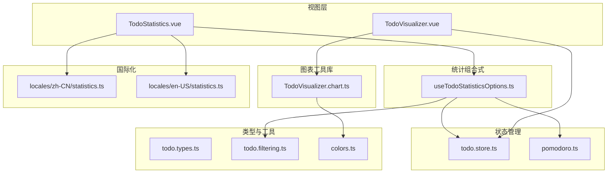
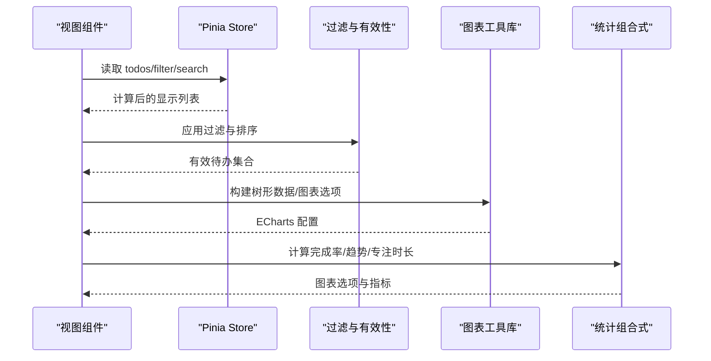
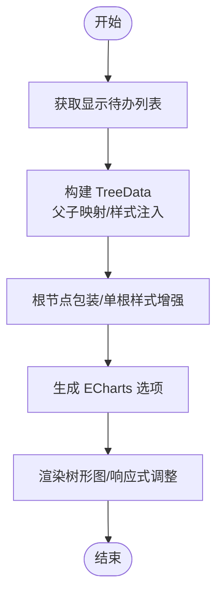
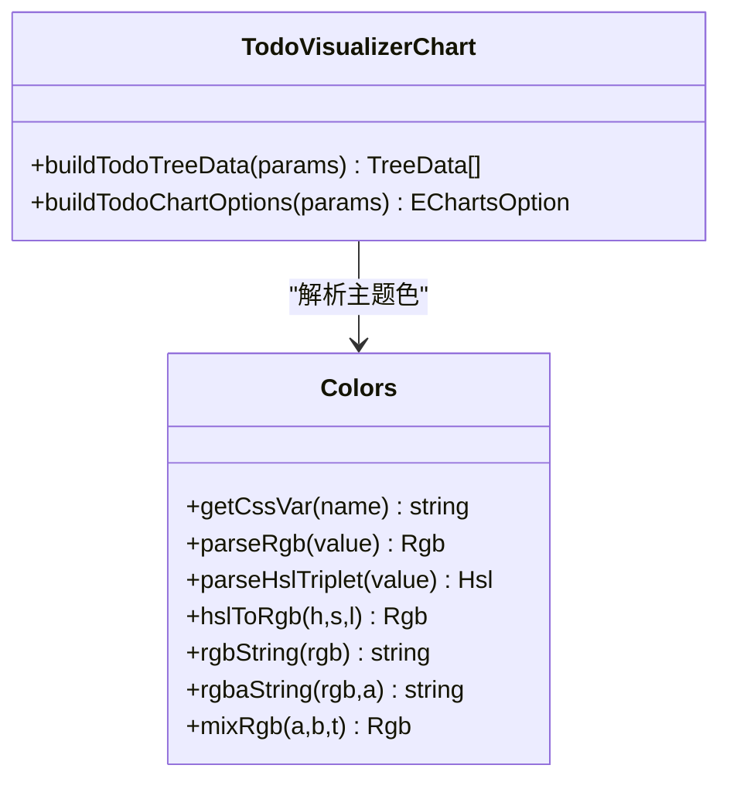
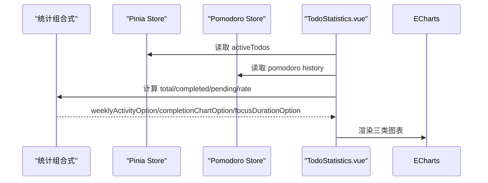
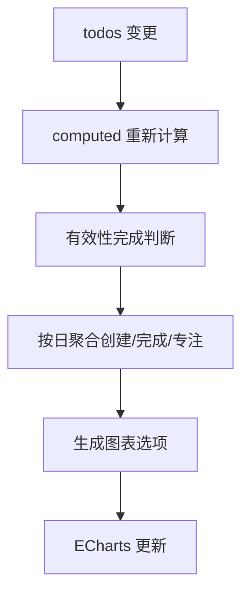
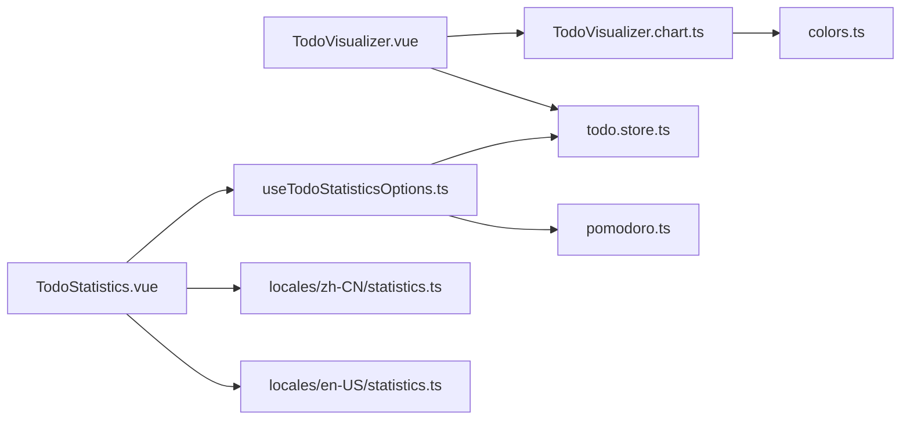

# 可视化与统计分析

<cite>
**本文引用的文件**
- [apps/frontend/src/features/todo/components/TodoVisualizer.vue](file://apps/frontend/src/features/todo/components/TodoVisualizer.vue)
- [apps/frontend/src/features/todo/components/TodoVisualizer.chart.ts](file://apps/frontend/src/features/todo/components/TodoVisualizer.chart.ts)
- [apps/frontend/src/features/todo/components/TodoStatistics.vue](file://apps/frontend/src/features/todo/components/TodoStatistics.vue)
- [apps/frontend/src/features/todo/composables/useTodoStatisticsOptions.ts](file://apps/frontend/src/features/todo/composables/useTodoStatisticsOptions.ts)
- [apps/frontend/src/features/todo/stores/todo.types.ts](file://apps/frontend/src/features/todo/stores/todo.types.ts)
- [apps/frontend/src/features/todo/stores/todo.store.ts](file://apps/frontend/src/features/todo/stores/todo.store.ts)
- [apps/frontend/src/features/todo/stores/todo.filtering.ts](file://apps/frontend/src/features/todo/stores/todo.filtering.ts)
- [apps/frontend/src/features/todo/stores/pomodoro.ts](file://apps/frontend/src/features/todo/stores/pomodoro.ts)
- [apps/frontend/src/lib/colors.ts](file://apps/frontend/src/lib/colors.ts)
- [apps/frontend/src/i18n/locales/zh-CN/statistics.ts](file://apps/frontend/src/i18n/locales/zh-CN/statistics.ts)
- [apps/frontend/src/i18n/locales/en-US/statistics.ts](file://apps/frontend/src/i18n/locales/en-US/statistics.ts)
</cite>

## 目录
1. [简介](#简介)
2. [项目结构](#项目结构)
3. [核心组件](#核心组件)
4. [架构总览](#架构总览)
5. [组件详解](#组件详解)
6. [依赖关系分析](#依赖关系分析)
7. [性能考量](#性能考量)
8. [故障排查指南](#故障排查指南)
9. [结论](#结论)
10. [附录](#附录)

## 简介
本文件聚焦于待办事项应用中的“可视化与统计分析”能力，围绕以下目标展开：
- TodoVisualizer 组件：树形图数据可视化实现（图表类型选择、数据转换、交互设计、响应式布局）
- TodoStatistics 组件：统计计算逻辑（完成率、时间分布、趋势分析、导出能力）
- 图表工具库封装：TodoVisualizer.chart.ts 的通用配置、主题适配、动画与性能优化
- 数据聚合策略：按日期、类别、优先级等维度的多维统计、实时更新与缓存策略
- 用户行为分析：完成习惯追踪、效率指标、个性化建议、历史对比

## 项目结构
与可视化与统计分析直接相关的前端模块位于 apps/frontend/src/features/todo，主要由以下层次构成：
- 视图层组件：TodoVisualizer.vue、TodoStatistics.vue
- 图表工具库：TodoVisualizer.chart.ts
- 统计组合式函数：useTodoStatisticsOptions.ts
- 状态管理：todo.store.ts、pomodoro.ts
- 类型定义：todo.types.ts
- 过滤与有效性判断：todo.filtering.ts
- 主题与颜色工具：colors.ts
- 国际化统计文案：locales/zh-CN/statistics.ts、locales/en-US/statistics.ts

**图表来源**
- [apps/frontend/src/features/todo/components/TodoVisualizer.vue:1-185](file://apps/frontend/src/features/todo/components/TodoVisualizer.vue#L1-L185)
- [apps/frontend/src/features/todo/components/TodoVisualizer.chart.ts:1-327](file://apps/frontend/src/features/todo/components/TodoVisualizer.chart.ts#L1-L327)
- [apps/frontend/src/features/todo/components/TodoStatistics.vue:1-342](file://apps/frontend/src/features/todo/components/TodoStatistics.vue#L1-L342)
- [apps/frontend/src/features/todo/composables/useTodoStatisticsOptions.ts:1-355](file://apps/frontend/src/features/todo/composables/useTodoStatisticsOptions.ts#L1-L355)
- [apps/frontend/src/features/todo/stores/todo.store.ts:1-335](file://apps/frontend/src/features/todo/stores/todo.store.ts#L1-L335)
- [apps/frontend/src/features/todo/stores/pomodoro.ts:1-402](file://apps/frontend/src/features/todo/stores/pomodoro.ts#L1-L402)
- [apps/frontend/src/features/todo/stores/todo.types.ts:1-68](file://apps/frontend/src/features/todo/stores/todo.types.ts#L1-L68)
- [apps/frontend/src/features/todo/stores/todo.filtering.ts:1-54](file://apps/frontend/src/features/todo/stores/todo.filtering.ts#L1-L54)
- [apps/frontend/src/lib/colors.ts:1-96](file://apps/frontend/src/lib/colors.ts#L1-L96)
- [apps/frontend/src/i18n/locales/zh-CN/statistics.ts:1-19](file://apps/frontend/src/i18n/locales/zh-CN/statistics.ts#L1-L19)
- [apps/frontend/src/i18n/locales/en-US/statistics.ts:1-19](file://apps/frontend/src/i18n/locales/en-US/statistics.ts#L1-L19)

**章节来源**
- [apps/frontend/src/features/todo/components/TodoVisualizer.vue:1-185](file://apps/frontend/src/features/todo/components/TodoVisualizer.vue#L1-L185)
- [apps/frontend/src/features/todo/components/TodoVisualizer.chart.ts:1-327](file://apps/frontend/src/features/todo/components/TodoVisualizer.chart.ts#L1-L327)
- [apps/frontend/src/features/todo/components/TodoStatistics.vue:1-342](file://apps/frontend/src/features/todo/components/TodoStatistics.vue#L1-L342)
- [apps/frontend/src/features/todo/composables/useTodoStatisticsOptions.ts:1-355](file://apps/frontend/src/features/todo/composables/useTodoStatisticsOptions.ts#L1-L355)
- [apps/frontend/src/features/todo/stores/todo.store.ts:1-335](file://apps/frontend/src/features/todo/stores/todo.store.ts#L1-L335)
- [apps/frontend/src/features/todo/stores/pomodoro.ts:1-402](file://apps/frontend/src/features/todo/stores/pomodoro.ts#L1-L402)
- [apps/frontend/src/features/todo/stores/todo.types.ts:1-68](file://apps/frontend/src/features/todo/stores/todo.types.ts#L1-L68)
- [apps/frontend/src/features/todo/stores/todo.filtering.ts:1-54](file://apps/frontend/src/features/todo/stores/todo.filtering.ts#L1-L54)
- [apps/frontend/src/lib/colors.ts:1-96](file://apps/frontend/src/lib/colors.ts#L1-L96)
- [apps/frontend/src/i18n/locales/zh-CN/statistics.ts:1-19](file://apps/frontend/src/i18n/locales/zh-CN/statistics.ts#L1-L19)
- [apps/frontend/src/i18n/locales/en-US/statistics.ts:1-19](file://apps/frontend/src/i18n/locales/en-US/statistics.ts#L1-L19)

## 核心组件
- TodoVisualizer：基于 ECharts 的树形图，将待办任务转换为树形节点，支持深色/浅色主题、动态样式与交互高亮，具备响应式布局与加载骨架。
- TodoStatistics：综合卡片与多种图表（饼图、柱状图、折线图）展示完成率、周活跃度与专注时长，提供数据概览与趋势分析。

**章节来源**
- [apps/frontend/src/features/todo/components/TodoVisualizer.vue:1-185](file://apps/frontend/src/features/todo/components/TodoVisualizer.vue#L1-L185)
- [apps/frontend/src/features/todo/components/TodoStatistics.vue:1-342](file://apps/frontend/src/features/todo/components/TodoStatistics.vue#L1-L342)

## 架构总览
整体流程从 Pinia Store 获取待办数据，经过滤与有效性判断后，分别进入可视化与统计模块；颜色系统与主题钩子贯穿于图表配置与样式渲染。

**图表来源**
- [apps/frontend/src/features/todo/components/TodoVisualizer.vue:92-126](file://apps/frontend/src/features/todo/components/TodoVisualizer.vue#L92-L126)
- [apps/frontend/src/features/todo/components/TodoVisualizer.chart.ts:160-326](file://apps/frontend/src/features/todo/components/TodoVisualizer.chart.ts#L160-L326)
- [apps/frontend/src/features/todo/composables/useTodoStatisticsOptions.ts:39-354](file://apps/frontend/src/features/todo/composables/useTodoStatisticsOptions.ts#L39-L354)
- [apps/frontend/src/features/todo/stores/todo.store.ts:45-136](file://apps/frontend/src/features/todo/stores/todo.store.ts#L45-L136)
- [apps/frontend/src/features/todo/stores/todo.filtering.ts:12-53](file://apps/frontend/src/features/todo/stores/todo.filtering.ts#L12-L53)

## 组件详解

### TodoVisualizer 组件
- 数据可视化实现
  - 图表类型：使用树形图（tree），通过父子关系构建层级树。
  - 数据转换：将 Todo 列表转换为 TreeData 结构，支持根节点包装与单根节点样式增强。
  - 交互设计：tooltip 格式化、强调态聚焦、符号大小区分叶子与分支。
  - 响应式布局：使用 ResizeObserver 与防抖 resize，确保容器尺寸稳定后再初始化与调整。
- 主题与样式
  - 基于 CSS 自定义属性解析主色、成功色、破坏色，生成 RGB/HSL 色值。
  - 深色/浅色模式下线条、节点、阴影与透明度差异化呈现。
- 动画与性能
  - 节点展开/折叠动画时长与缓动设置。
  - 首屏加载骨架与空态提示，避免空白闪烁。

**图表来源**
- [apps/frontend/src/features/todo/components/TodoVisualizer.chart.ts:160-200](file://apps/frontend/src/features/todo/components/TodoVisualizer.chart.ts#L160-L200)
- [apps/frontend/src/features/todo/components/TodoVisualizer.chart.ts:202-326](file://apps/frontend/src/features/todo/components/TodoVisualizer.chart.ts#L202-L326)
- [apps/frontend/src/features/todo/components/TodoVisualizer.vue:51-90](file://apps/frontend/src/features/todo/components/TodoVisualizer.vue#L51-L90)

**章节来源**
- [apps/frontend/src/features/todo/components/TodoVisualizer.vue:1-185](file://apps/frontend/src/features/todo/components/TodoVisualizer.vue#L1-L185)
- [apps/frontend/src/features/todo/components/TodoVisualizer.chart.ts:1-327](file://apps/frontend/src/features/todo/components/TodoVisualizer.chart.ts#L1-L327)
- [apps/frontend/src/lib/colors.ts:1-96](file://apps/frontend/src/lib/colors.ts#L1-L96)

### TodoVisualizer.chart.ts 图表工具库
- 通用配置
  - 构建 TreeData：遍历待办，生成节点样式与富文本标签，支持“提议/删除/完成/普通”等标签类型。
  - 根节点包装：当存在多个根节点时，自动包裹一层根节点并应用主题色。
  - ECharts 选项：tooltip、series（tree）、label 富文本样式、强调态、动画参数。
- 主题适配
  - 解析 CSS 变量（--primary-rgb、--success、--destructive），在深色/浅色模式下生成一致的视觉风格。
- 动画效果
  - 节点展开/折叠使用 cubicOut 缓动与 400ms 动画时长，强调态增加阴影与描边宽度。
- 性能优化
  - 防抖 ResizeObserver，避免频繁重绘。
  - 首屏骨架屏与空态过渡动画，提升感知性能。

**图表来源**
- [apps/frontend/src/features/todo/components/TodoVisualizer.chart.ts:1-327](file://apps/frontend/src/features/todo/components/TodoVisualizer.chart.ts#L1-L327)
- [apps/frontend/src/lib/colors.ts:1-96](file://apps/frontend/src/lib/colors.ts#L1-L96)

**章节来源**
- [apps/frontend/src/features/todo/components/TodoVisualizer.chart.ts:1-327](file://apps/frontend/src/features/todo/components/TodoVisualizer.chart.ts#L1-L327)
- [apps/frontend/src/lib/colors.ts:1-96](file://apps/frontend/src/lib/colors.ts#L1-L96)

### TodoStatistics 组件
- 统计计算逻辑
  - 完成率：基于“有效完成”的概念（含子任务继承完成），计算百分比并四舍五入。
  - 时间分布：近 7 天创建与完成任务数量，按日粒度聚合。
  - 趋势分析：专注时长折线图，按日累计分钟数。
  - 导出功能：当前未内置导出按钮或下载逻辑，可扩展为将 ECharts 实例导出为图片或 PDF。
- 图表类型与交互
  - 饼图：完成/待完成占比，中心突出显示百分比。
  - 柱状图：周活跃度（创建/完成）。
  - 折线图：专注时长趋势，带面积填充。
- 响应式布局
  - 使用 ResizeObserver 与防抖，保证容器尺寸稳定后渲染图表。
  - 卡片网格布局，支持双列到四列自适应。

**图表来源**
- [apps/frontend/src/features/todo/components/TodoStatistics.vue:1-342](file://apps/frontend/src/features/todo/components/TodoStatistics.vue#L1-L342)
- [apps/frontend/src/features/todo/composables/useTodoStatisticsOptions.ts:39-354](file://apps/frontend/src/features/todo/composables/useTodoStatisticsOptions.ts#L39-L354)
- [apps/frontend/src/features/todo/stores/todo.store.ts:106-116](file://apps/frontend/src/features/todo/stores/todo.store.ts#L106-L116)
- [apps/frontend/src/features/todo/stores/pomodoro.ts:27-47](file://apps/frontend/src/features/todo/stores/pomodoro.ts#L27-L47)

**章节来源**
- [apps/frontend/src/features/todo/components/TodoStatistics.vue:1-342](file://apps/frontend/src/features/todo/components/TodoStatistics.vue#L1-L342)
- [apps/frontend/src/features/todo/composables/useTodoStatisticsOptions.ts:1-355](file://apps/frontend/src/features/todo/composables/useTodoStatisticsOptions.ts#L1-L355)
- [apps/frontend/src/features/todo/stores/todo.store.ts:106-116](file://apps/frontend/src/features/todo/stores/todo.store.ts#L106-L116)
- [apps/frontend/src/features/todo/stores/pomodoro.ts:27-47](file://apps/frontend/src/features/todo/stores/pomodoro.ts#L27-L47)

### 数据聚合策略与实时更新
- 多维度统计
  - 日期维度：近 7 天创建/完成任务按日聚合；专注时长按日累计。
  - 有效性完成：子任务完成需继承父任务完成状态，避免重复计数。
- 实时更新机制
  - 依赖 Pinia 计算属性（computed）与 watch，数据变更即触发重新计算。
  - 图表通过 ECharts option 更新，无需重建实例。
- 缓存策略
  - 当前未见显式缓存实现；建议对“近 7 天聚合结果”进行内存缓存，减少重复计算。

**图表来源**
- [apps/frontend/src/features/todo/composables/useTodoStatisticsOptions.ts:19-37](file://apps/frontend/src/features/todo/composables/useTodoStatisticsOptions.ts#L19-L37)
- [apps/frontend/src/features/todo/stores/todo.filtering.ts:3-10](file://apps/frontend/src/features/todo/stores/todo.filtering.ts#L3-L10)
- [apps/frontend/src/features/todo/stores/todo.store.ts:45-136](file://apps/frontend/src/features/todo/stores/todo.store.ts#L45-L136)

**章节来源**
- [apps/frontend/src/features/todo/composables/useTodoStatisticsOptions.ts:1-355](file://apps/frontend/src/features/todo/composables/useTodoStatisticsOptions.ts#L1-L355)
- [apps/frontend/src/features/todo/stores/todo.filtering.ts:1-54](file://apps/frontend/src/features/todo/stores/todo.filtering.ts#L1-L54)
- [apps/frontend/src/features/todo/stores/todo.store.ts:1-335](file://apps/frontend/src/features/todo/stores/todo.store.ts#L1-L335)

### 用户行为分析
- 完成习惯追踪
  - 基于“有效完成”与近 7 天完成任务数，形成完成趋势。
- 效率指标
  - 专注时长（分钟/天）与番茄钟会话数结合，反映集中工作时长。
- 个性化建议
  - 可扩展：根据完成率与专注时长生成“高效/低效”标签与建议。
- 历史对比
  - 可扩展：对比“本周 vs 上周”完成任务数与专注时长，提供环比/同比。

**章节来源**
- [apps/frontend/src/features/todo/composables/useTodoStatisticsOptions.ts:58-176](file://apps/frontend/src/features/todo/composables/useTodoStatisticsOptions.ts#L58-L176)
- [apps/frontend/src/features/todo/stores/pomodoro.ts:326-332](file://apps/frontend/src/features/todo/stores/pomodoro.ts#L326-L332)

## 依赖关系分析
- 组件耦合
  - TodoVisualizer 依赖 TodoVisualizer.chart.ts 与 Pinia Todo Store。
  - TodoStatistics 依赖 useTodoStatisticsOptions.ts、Todo Store 与 Pomodoro Store。
- 外部依赖
  - ECharts（vue-echarts）、@vueuse/core（ResizeObserver、深色模式）、lodash-es（防抖）。
- 潜在循环依赖
  - 未发现直接循环导入；工具函数 colors.ts 仅被图表工具库调用。

**图表来源**
- [apps/frontend/src/features/todo/components/TodoVisualizer.vue:1-12](file://apps/frontend/src/features/todo/components/TodoVisualizer.vue#L1-L12)
- [apps/frontend/src/features/todo/components/TodoVisualizer.chart.ts:1-10](file://apps/frontend/src/features/todo/components/TodoVisualizer.chart.ts#L1-L10)
- [apps/frontend/src/features/todo/components/TodoStatistics.vue:1-29](file://apps/frontend/src/features/todo/components/TodoStatistics.vue#L1-L29)
- [apps/frontend/src/features/todo/composables/useTodoStatisticsOptions.ts:1-13](file://apps/frontend/src/features/todo/composables/useTodoStatisticsOptions.ts#L1-L13)
- [apps/frontend/src/features/todo/stores/todo.store.ts:1-20](file://apps/frontend/src/features/todo/stores/todo.store.ts#L1-L20)
- [apps/frontend/src/features/todo/stores/pomodoro.ts:1-9](file://apps/frontend/src/features/todo/stores/pomodoro.ts#L1-L9)
- [apps/frontend/src/lib/colors.ts:1-14](file://apps/frontend/src/lib/colors.ts#L1-L14)
- [apps/frontend/src/i18n/locales/zh-CN/statistics.ts:1-19](file://apps/frontend/src/i18n/locales/zh-CN/statistics.ts#L1-L19)
- [apps/frontend/src/i18n/locales/en-US/statistics.ts:1-19](file://apps/frontend/src/i18n/locales/en-US/statistics.ts#L1-L19)

**章节来源**
- [apps/frontend/src/features/todo/components/TodoVisualizer.vue:1-12](file://apps/frontend/src/features/todo/components/TodoVisualizer.vue#L1-L12)
- [apps/frontend/src/features/todo/components/TodoVisualizer.chart.ts:1-10](file://apps/frontend/src/features/todo/components/TodoVisualizer.chart.ts#L1-L10)
- [apps/frontend/src/features/todo/components/TodoStatistics.vue:1-29](file://apps/frontend/src/features/todo/components/TodoStatistics.vue#L1-L29)
- [apps/frontend/src/features/todo/composables/useTodoStatisticsOptions.ts:1-13](file://apps/frontend/src/features/todo/composables/useTodoStatisticsOptions.ts#L1-L13)
- [apps/frontend/src/features/todo/stores/todo.store.ts:1-20](file://apps/frontend/src/features/todo/stores/todo.store.ts#L1-L20)
- [apps/frontend/src/features/todo/stores/pomodoro.ts:1-9](file://apps/frontend/src/features/todo/stores/pomodoro.ts#L1-L9)
- [apps/frontend/src/lib/colors.ts:1-14](file://apps/frontend/src/lib/colors.ts#L1-L14)
- [apps/frontend/src/i18n/locales/zh-CN/statistics.ts:1-19](file://apps/frontend/src/i18n/locales/zh-CN/statistics.ts#L1-L19)
- [apps/frontend/src/i18n/locales/en-US/statistics.ts:1-19](file://apps/frontend/src/i18n/locales/en-US/statistics.ts#L1-L19)

## 性能考量
- 首屏体验
  - TodoVisualizer 与 TodoStatistics 均提供骨架屏与空态过渡，降低感知延迟。
- 重绘控制
  - 使用 ResizeObserver 与 lodash-es 防抖，避免频繁 resize 导致的重绘风暴。
- 动画与阴影
  - 树形图强调态与阴影在深色模式下适度增强，兼顾可读性与性能。
- 计算复杂度
  - 近 7 天聚合为 O(n) 遍历，建议对相同窗口内结果做内存缓存以进一步降噪。

[本节为通用性能讨论，不直接分析具体文件]

## 故障排查指南
- 图表不显示或空白
  - 检查容器尺寸是否为 0，确认 ResizeObserver 是否触发与防抖取消逻辑。
  - 确认 isReady 状态与 v-if/v-else 分支切换。
- 主题色异常
  - 检查 CSS 变量 --primary-rgb/--success/--destructive 是否正确注入。
  - 确认 useTheme/useDark 返回值与 isDark 传参一致。
- 数据未更新
  - 确认 Pinia computed 依赖是否正确，watch 是否触发。
  - 检查 isEffectivelyCompleted 与过滤逻辑是否符合预期。
- 专注时长无数据
  - 确认 pomodoro history 的日期格式（YYYY-MM-DD）与本地化匹配。
  - 检查 completedSessions 与历史记录写入逻辑。

**章节来源**
- [apps/frontend/src/features/todo/components/TodoVisualizer.vue:51-90](file://apps/frontend/src/features/todo/components/TodoVisualizer.vue#L51-L90)
- [apps/frontend/src/features/todo/components/TodoStatistics.vue:57-117](file://apps/frontend/src/features/todo/components/TodoStatistics.vue#L57-L117)
- [apps/frontend/src/features/todo/composables/useTodoStatisticsOptions.ts:256-268](file://apps/frontend/src/features/todo/composables/useTodoStatisticsOptions.ts#L256-L268)
- [apps/frontend/src/features/todo/stores/pomodoro.ts:326-332](file://apps/frontend/src/features/todo/stores/pomodoro.ts#L326-L332)
- [apps/frontend/src/features/todo/stores/todo.filtering.ts:3-10](file://apps/frontend/src/features/todo/stores/todo.filtering.ts#L3-L10)

## 结论
本方案通过“组件 + 工具库 + 组合式统计 + Pinia 状态”的分层设计，实现了：
- 可视化的树形图与统计图表，覆盖完成率、时间分布与趋势分析；
- 主题与颜色系统的统一适配，保障深色/浅色一致性；
- 响应式布局与性能优化，提升用户体验；
- 可扩展的导出与个性化建议能力，为后续迭代奠定基础。

[本节为总结性内容，不直接分析具体文件]

## 附录
- 国际化键值参考
  - 中文：见 locales/zh-CN/statistics.ts
  - 英文：见 locales/en-US/statistics.ts

**章节来源**
- [apps/frontend/src/i18n/locales/zh-CN/statistics.ts:1-19](file://apps/frontend/src/i18n/locales/zh-CN/statistics.ts#L1-L19)
- [apps/frontend/src/i18n/locales/en-US/statistics.ts:1-19](file://apps/frontend/src/i18n/locales/en-US/statistics.ts#L1-L19)