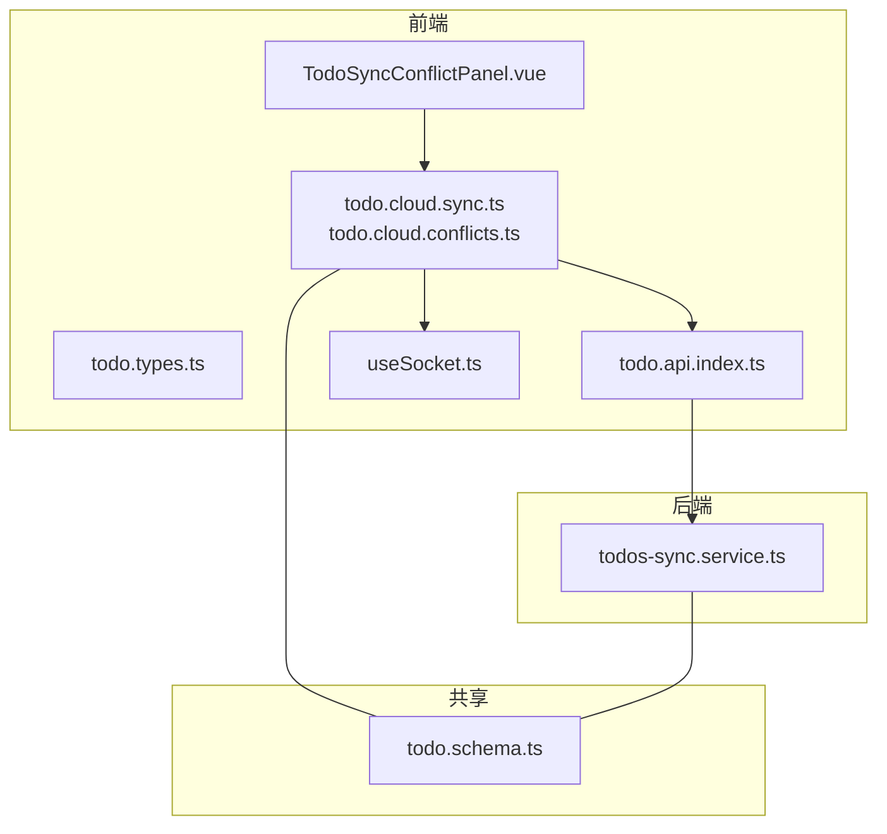
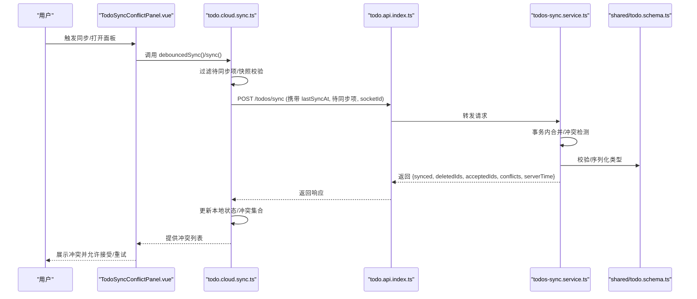
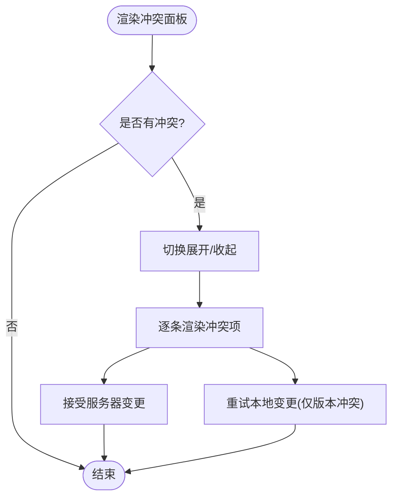
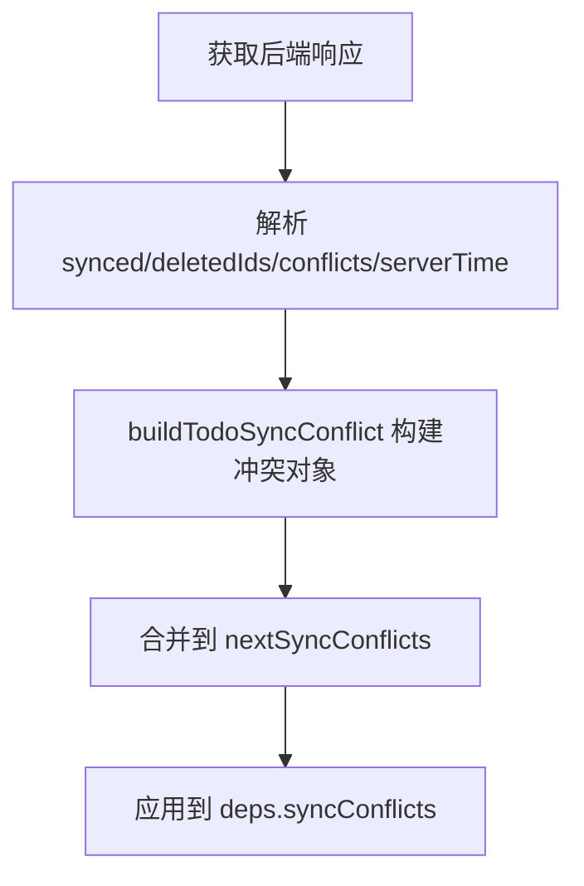
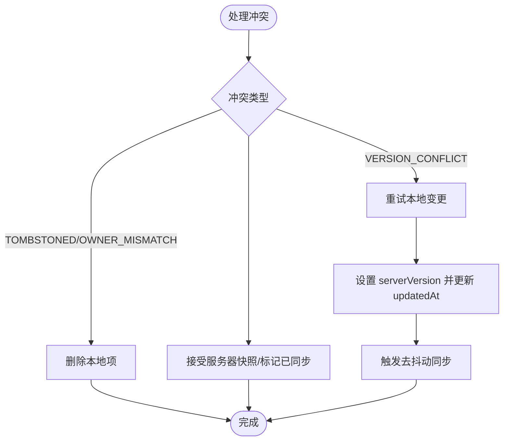
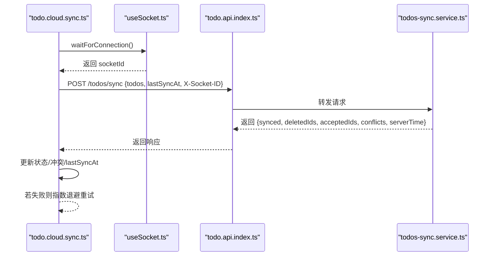
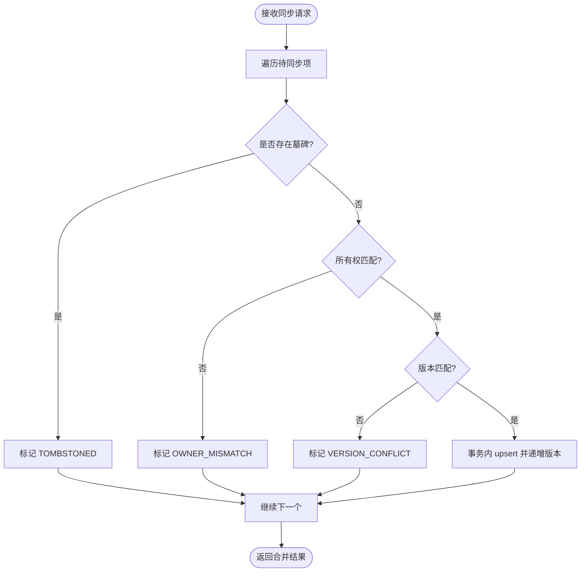
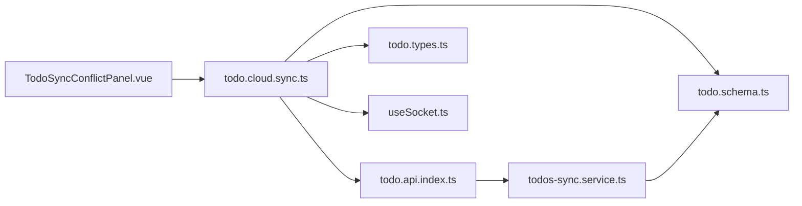

# 同步与冲突解决

<cite>
**本文引用的文件**
- [apps/frontend/src/features/todo/components/TodoSyncConflictPanel.vue](file://apps/frontend/src/features/todo/components/TodoSyncConflictPanel.vue)
- [apps/frontend/src/features/todo/stores/todo.cloud.sync.ts](file://apps/frontend/src/features/todo/stores/todo.cloud.sync.ts)
- [apps/frontend/src/features/todo/stores/todo.cloud.conflicts.ts](file://apps/frontend/src/features/todo/stores/todo.cloud.conflicts.ts)
- [apps/frontend/src/features/todo/stores/todo.types.ts](file://apps/frontend/src/features/todo/stores/todo.types.ts)
- [apps/frontend/src/features/todo/api/index.ts](file://apps/frontend/src/features/todo/api/index.ts)
- [apps/backend/src/todos/todos-sync.service.ts](file://apps/backend/src/todos/todos-sync.service.ts)
- [packages/shared/src/schemas/todo.schema.ts](file://packages/shared/src/schemas/todo.schema.ts)
- [apps/frontend/src/features/todo/stores/todo.cloud.types.ts](file://apps/frontend/src/features/todo/stores/todo.cloud.types.ts)
- [apps/frontend/src/composables/useSocket.ts](file://apps/frontend/src/composables/useSocket.ts)
</cite>

## 目录
1. [简介](#简介)
2. [项目结构](#项目结构)
3. [核心组件](#核心组件)
4. [架构总览](#架构总览)
5. [详细组件分析](#详细组件分析)
6. [依赖关系分析](#依赖关系分析)
7. [性能考量](#性能考量)
8. [故障排查指南](#故障排查指南)
9. [结论](#结论)
10. [附录](#附录)

## 简介
本文件面向“待办事项同步与冲突解决系统”，围绕以下目标展开：  
- 深入说明 TodoSyncConflictPanel 组件的冲突检测机制：数据差异比较、冲突类型识别、解决方案展示。  
- 文档化云端同步流程：数据上传下载、增量同步、版本控制、网络异常处理。  
- 详细介绍冲突解决策略：自动合并规则、手动选择方案、历史记录追踪、回滚机制。  
- 解释本地缓存管理：数据持久化、离线模式、缓存清理、存储优化。  
- 包含同步状态监控：进度指示、错误日志、重试机制、用户通知。  
- 说明多设备协调：设备间同步、时间戳处理、并发控制、一致性保证。

## 项目结构
该系统由前端 Vue 应用与 NestJS 后端共同组成，共享类型定义于 shared 包中。前端通过 API 调用后端同步接口，并通过 Socket 实时接收其他设备的同步通知；后端负责事务性合并、冲突检测与增量拉取。

图表来源
- [apps/frontend/src/features/todo/components/TodoSyncConflictPanel.vue:1-119](file://apps/frontend/src/features/todo/components/TodoSyncConflictPanel.vue#L1-L119)
- [apps/frontend/src/features/todo/stores/todo.cloud.sync.ts:1-214](file://apps/frontend/src/features/todo/stores/todo.cloud.sync.ts#L1-L214)
- [apps/frontend/src/features/todo/stores/todo.cloud.conflicts.ts:1-91](file://apps/frontend/src/features/todo/stores/todo.cloud.conflicts.ts#L1-L91)
- [apps/frontend/src/features/todo/stores/todo.types.ts:1-68](file://apps/frontend/src/features/todo/stores/todo.types.ts#L1-L68)
- [apps/frontend/src/features/todo/api/index.ts:1-62](file://apps/frontend/src/features/todo/api/index.ts#L1-L62)
- [apps/frontend/src/composables/useSocket.ts:83-175](file://apps/frontend/src/composables/useSocket.ts#L83-L175)
- [apps/backend/src/todos/todos-sync.service.ts:1-221](file://apps/backend/src/todos/todos-sync.service.ts#L1-L221)
- [packages/shared/src/schemas/todo.schema.ts:1-75](file://packages/shared/src/schemas/todo.schema.ts#L1-L75)

章节来源
- [apps/frontend/src/features/todo/components/TodoSyncConflictPanel.vue:1-119](file://apps/frontend/src/features/todo/components/TodoSyncConflictPanel.vue#L1-L119)
- [apps/frontend/src/features/todo/stores/todo.cloud.sync.ts:1-214](file://apps/frontend/src/features/todo/stores/todo.cloud.sync.ts#L1-L214)
- [apps/frontend/src/features/todo/stores/todo.cloud.conflicts.ts:1-91](file://apps/frontend/src/features/todo/stores/todo.cloud.conflicts.ts#L1-L91)
- [apps/frontend/src/features/todo/stores/todo.types.ts:1-68](file://apps/frontend/src/features/todo/stores/todo.types.ts#L1-L68)
- [apps/frontend/src/features/todo/api/index.ts:1-62](file://apps/frontend/src/features/todo/api/index.ts#L1-L62)
- [apps/frontend/src/composables/useSocket.ts:83-175](file://apps/frontend/src/composables/useSocket.ts#L83-L175)
- [apps/backend/src/todos/todos-sync.service.ts:1-221](file://apps/backend/src/todos/todos-sync.service.ts#L1-L221)
- [packages/shared/src/schemas/todo.schema.ts:1-75](file://packages/shared/src/schemas/todo.schema.ts#L1-L75)

## 核心组件
- TodoSyncConflictPanel：用于展示冲突列表、提供接受或重试操作的 UI 组件。  
- todo.cloud.sync.ts：负责云端同步主流程、状态管理、错误与重试、冲突收集与应用。  
- todo.cloud.conflicts.ts：构建冲突对象、执行冲突接受/重试/清除等动作。  
- todo.types.ts：定义 Todo 与 TodoSyncConflict 的类型结构。  
- todo.api.index.ts：封装 /todos/sync 接口调用。  
- todos-sync.service.ts：后端同步服务，实现事务性合并、冲突检测、增量拉取与广播。  
- todo.schema.ts：前后端共享的同步请求/响应与冲突类型定义。  
- useSocket.ts：Socket 初始化、连接等待、鉴权与断线重连。

章节来源
- [apps/frontend/src/features/todo/components/TodoSyncConflictPanel.vue:1-119](file://apps/frontend/src/features/todo/components/TodoSyncConflictPanel.vue#L1-L119)
- [apps/frontend/src/features/todo/stores/todo.cloud.sync.ts:1-214](file://apps/frontend/src/features/todo/stores/todo.cloud.sync.ts#L1-L214)
- [apps/frontend/src/features/todo/stores/todo.cloud.conflicts.ts:1-91](file://apps/frontend/src/features/todo/stores/todo.cloud.conflicts.ts#L1-L91)
- [apps/frontend/src/features/todo/stores/todo.types.ts:1-68](file://apps/frontend/src/features/todo/stores/todo.types.ts#L1-L68)
- [apps/frontend/src/features/todo/api/index.ts:1-62](file://apps/frontend/src/features/todo/api/index.ts#L1-L62)
- [apps/backend/src/todos/todos-sync.service.ts:1-221](file://apps/backend/src/todos/todos-sync.service.ts#L1-L221)
- [packages/shared/src/schemas/todo.schema.ts:1-75](file://packages/shared/src/schemas/todo.schema.ts#L1-L75)
- [apps/frontend/src/composables/useSocket.ts:83-175](file://apps/frontend/src/composables/useSocket.ts#L83-L175)

## 架构总览
下图展示了从用户操作到云端合并再到冲突展示的整体流程。

图表来源
- [apps/frontend/src/features/todo/stores/todo.cloud.sync.ts:36-181](file://apps/frontend/src/features/todo/stores/todo.cloud.sync.ts#L36-L181)
- [apps/frontend/src/features/todo/api/index.ts:8-20](file://apps/frontend/src/features/todo/api/index.ts#L8-L20)
- [apps/backend/src/todos/todos-sync.service.ts:51-219](file://apps/backend/src/todos/todos-sync.service.ts#L51-L219)
- [packages/shared/src/schemas/todo.schema.ts:39-67](file://packages/shared/src/schemas/todo.schema.ts#L39-L67)
- [apps/frontend/src/features/todo/components/TodoSyncConflictPanel.vue:1-119](file://apps/frontend/src/features/todo/components/TodoSyncConflictPanel.vue#L1-L119)

## 详细组件分析

### TodoSyncConflictPanel 组件
职责与行为
- 展示冲突计数与折叠/展开状态。  
- 对每条冲突显示标题与原因标签。  
- 提供“接受服务器”和“重试本地”两个操作按钮，其中“重试本地”仅对 VERSION_CONFLICT 生效。  
- 支持一键清空所有冲突。

图表来源
- [apps/frontend/src/features/todo/components/TodoSyncConflictPanel.vue:1-119](file://apps/frontend/src/features/todo/components/TodoSyncConflictPanel.vue#L1-L119)

章节来源
- [apps/frontend/src/features/todo/components/TodoSyncConflictPanel.vue:1-119](file://apps/frontend/src/features/todo/components/TodoSyncConflictPanel.vue#L1-L119)

### 冲突检测与识别（前端）
构建与应用
- 使用 buildTodoSyncConflict 将后端返回的冲突信息映射为前端冲突对象，包含本地草稿与服务器快照。  
- 在同步完成后，根据已同步/已删除/冲突 ID 集合更新本地冲突列表，并裁剪掉已不存在的冲突项。

图表来源
- [apps/frontend/src/features/todo/stores/todo.cloud.sync.ts:115-147](file://apps/frontend/src/features/todo/stores/todo.cloud.sync.ts#L115-L147)
- [apps/frontend/src/features/todo/stores/todo.cloud.conflicts.ts:6-19](file://apps/frontend/src/features/todo/stores/todo.cloud.conflicts.ts#L6-L19)

章节来源
- [apps/frontend/src/features/todo/stores/todo.cloud.sync.ts:115-147](file://apps/frontend/src/features/todo/stores/todo.cloud.sync.ts#L115-L147)
- [apps/frontend/src/features/todo/stores/todo.cloud.conflicts.ts:6-19](file://apps/frontend/src/features/todo/stores/todo.cloud.conflicts.ts#L6-L19)

### 冲突解决策略（前端）
- 接受服务器：对 TOMBSTONED 或 OWNER_MISMATCH 直接删除本地对应项；否则用服务器快照替换本地项或标记为已同步。  
- 重试本地：仅对 VERSION_CONFLICT 生效，将本地草稿恢复为待同步状态并递增版本号，随后触发一次去抖动同步。  
- 清除冲突：一键清空当前冲突列表。

图表来源
- [apps/frontend/src/features/todo/stores/todo.cloud.conflicts.ts:33-83](file://apps/frontend/src/features/todo/stores/todo.cloud.conflicts.ts#L33-L83)

章节来源
- [apps/frontend/src/features/todo/stores/todo.cloud.conflicts.ts:1-91](file://apps/frontend/src/features/todo/stores/todo.cloud.conflicts.ts#L1-L91)

### 云端同步流程（前端）
- 认证与冷却：检查远端源开关、加载状态、认证状态与同步冷却时间。  
- Socket 连接：动态导入 useSocket 并等待连接，必要时提示版本更新。  
- 数据准备：筛选未同步项、生成快照时间映射。  
- 请求发送：携带 todos 与 lastSyncAt，以及 socketId。  
- 结果应用：根据 acceptedIds/deletedIds/conflicts 更新本地状态与冲突集合；若无冲突且无接受项，则回退标记为已同步；最后更新 lastSyncAt。  
- 错误与重试：捕获错误并最多三次指数退避重试；动态模块加载失败直接中断。  
- 用户通知：通过 toast 提示版本更新与同步失败。

图表来源
- [apps/frontend/src/features/todo/stores/todo.cloud.sync.ts:36-181](file://apps/frontend/src/features/todo/stores/todo.cloud.sync.ts#L36-L181)
- [apps/frontend/src/composables/useSocket.ts:116-146](file://apps/frontend/src/composables/useSocket.ts#L116-L146)
- [apps/frontend/src/features/todo/api/index.ts:8-20](file://apps/frontend/src/features/todo/api/index.ts#L8-L20)
- [apps/backend/src/todos/todos-sync.service.ts:51-219](file://apps/backend/src/todos/todos-sync.service.ts#L51-L219)

章节来源
- [apps/frontend/src/features/todo/stores/todo.cloud.sync.ts:1-214](file://apps/frontend/src/features/todo/stores/todo.cloud.sync.ts#L1-L214)
- [apps/frontend/src/composables/useSocket.ts:83-175](file://apps/frontend/src/composables/useSocket.ts#L83-L175)
- [apps/frontend/src/features/todo/api/index.ts:1-62](file://apps/frontend/src/features/todo/api/index.ts#L1-L62)
- [apps/backend/src/todos/todos-sync.service.ts:1-221](file://apps/backend/src/todos/todos-sync.service.ts#L1-L221)

### 版本控制与冲突检测（后端）
- 严格版本匹配：客户端提交的 version 必须与服务端现有 version 完全一致，否则视为 VERSION_CONFLICT。  
- 所有权检查：若现有记录的 userId 与当前用户不同，标记 OWNER_MISMATCH。  
- 坍缩墓碑：若存在墓碑记录，标记 TOMBSTONED。  
- 事务合并：使用 Prisma 事务批量 upsert，同时维护版本号与递归任务生成。  
- 增量拉取：基于 lastSyncAt 拉取服务器端变更，初次同步排除回收站内容。  
- 广播通知：当有成功写入项时，向其他在线设备广播同步通知。

图表来源
- [apps/backend/src/todos/todos-sync.service.ts:66-174](file://apps/backend/src/todos/todos-sync.service.ts#L66-L174)

章节来源
- [apps/backend/src/todos/todos-sync.service.ts:1-221](file://apps/backend/src/todos/todos-sync.service.ts#L1-L221)

### 类型与契约（共享层）
- Todo/RecurrenceRule/SyncItem/SyncMergeRequest/SyncConflict/SyncResponse：统一前后端的数据结构与校验。  
- TodoSyncConflict：前端侧冲突对象，包含冲突原因、服务器版本、本地草稿与服务器快照。

章节来源
- [packages/shared/src/schemas/todo.schema.ts:1-75](file://packages/shared/src/schemas/todo.schema.ts#L1-L75)
- [apps/frontend/src/features/todo/stores/todo.types.ts:20-29](file://apps/frontend/src/features/todo/stores/todo.types.ts#L20-L29)

## 依赖关系分析
- 前端依赖
  - 组件依赖 store 动作与类型定义。  
  - store 依赖 API 与 Socket，同时消费共享类型。  
  - API 依赖 http 客户端与共享响应类型。  
- 后端依赖
  - 服务依赖 Prisma 与事件网关，输出符合共享 Schema 的响应。  

图表来源
- [apps/frontend/src/features/todo/components/TodoSyncConflictPanel.vue:1-119](file://apps/frontend/src/features/todo/components/TodoSyncConflictPanel.vue#L1-L119)
- [apps/frontend/src/features/todo/stores/todo.cloud.sync.ts:1-214](file://apps/frontend/src/features/todo/stores/todo.cloud.sync.ts#L1-L214)
- [apps/frontend/src/features/todo/stores/todo.types.ts:1-68](file://apps/frontend/src/features/todo/stores/todo.types.ts#L1-L68)
- [apps/frontend/src/features/todo/api/index.ts:1-62](file://apps/frontend/src/features/todo/api/index.ts#L1-L62)
- [apps/backend/src/todos/todos-sync.service.ts:1-221](file://apps/backend/src/todos/todos-sync.service.ts#L1-L221)
- [packages/shared/src/schemas/todo.schema.ts:1-75](file://packages/shared/src/schemas/todo.schema.ts#L1-L75)
- [apps/frontend/src/composables/useSocket.ts:83-175](file://apps/frontend/src/composables/useSocket.ts#L83-L175)

章节来源
- [apps/frontend/src/features/todo/stores/todo.cloud.sync.ts:1-214](file://apps/frontend/src/features/todo/stores/todo.cloud.sync.ts#L1-L214)
- [apps/frontend/src/features/todo/api/index.ts:1-62](file://apps/frontend/src/features/todo/api/index.ts#L1-L62)
- [apps/backend/src/todos/todos-sync.service.ts:1-221](file://apps/backend/src/todos/todos-sync.service.ts#L1-L221)
- [packages/shared/src/schemas/todo.schema.ts:1-75](file://packages/shared/src/schemas/todo.schema.ts#L1-L75)
- [apps/frontend/src/composables/useSocket.ts:83-175](file://apps/frontend/src/composables/useSocket.ts#L83-L175)

## 性能考量
- 去抖动与冷却：SYNC_COOLDOWN_MS 防止频繁触发同步，减少网络与数据库压力。  
- 事务合并：后端批量 upsert，降低写放大与锁竞争。  
- 增量同步：基于 lastSyncAt 拉取变更，避免全量扫描。  
- 快照校验：前端在应用前对比 updatedAt，防止过期写入覆盖。  
- 指数退避：最大三次重试，避免雪崩式重试。  
- Socket 单例：连接与监听生命周期管理，避免重复订阅。

## 故障排查指南
常见问题与定位
- 同步失败
  - 检查认证状态与 token 是否有效。  
  - 查看错误码与 toast 提示，确认是否为版本更新导致的动态模块加载失败。  
  - 观察重试次数与延迟，确认是否达到上限。  
- 冲突频繁出现
  - 核对客户端时钟与服务器时间差，避免版本漂移。  
  - 检查是否多人编辑同一项且未及时同步。  
- Socket 连接异常
  - 确认 waitForConnection 是否超时，关注 connect/connect_error 回调。  
  - 若认证错误，检查令牌刷新流程是否成功。  
- 墓碑/权限冲突
  - TOMBSTONED：确认该项已被彻底删除。  
  - OWNER_MISMATCH：确认用户切换或权限变更后是否正确合并。

章节来源
- [apps/frontend/src/features/todo/stores/todo.cloud.sync.ts:165-181](file://apps/frontend/src/features/todo/stores/todo.cloud.sync.ts#L165-L181)
- [apps/frontend/src/composables/useSocket.ts:116-146](file://apps/frontend/src/composables/useSocket.ts#L116-L146)
- [apps/backend/src/todos/todos-sync.service.ts:106-122](file://apps/backend/src/todos/todos-sync.service.ts#L106-L122)

## 结论
本系统通过严格的版本控制与事务合并，在前端与后端分别承担“冲突检测与展示”和“合并与增量拉取”的职责，辅以 Socket 广播与去抖动/冷却策略，实现了稳定高效的多设备协同。前端提供直观的冲突面板与可操作的解决路径，后端保障数据一致性与递归任务的正确生成。

## 附录
- 关键流程速览
  - 前端：过滤待同步项 → 发送同步请求 → 应用结果 → 更新冲突 → 用户交互。  
  - 后端：事务合并 → 冲突检测 → 增量拉取 → 广播通知。  
- 最佳实践
  - 保持客户端与服务器时间同步，避免版本漂移。  
  - 在高并发场景下优先使用去抖动与冷却策略。  
  - 对动态模块加载失败进行明确提示与错误分类。  
  - 对冲突类型进行清晰标注与引导，提升用户决策效率。