# 待办事项管理

<cite>
**本文引用的文件**
- [apps/frontend/src/features/todo/TodoView.vue](file://apps/frontend/src/features/todo/TodoView.vue)
- [apps/frontend/src/features/todo/components/TodoList.vue](file://apps/frontend/src/features/todo/components/TodoList.vue)
- [apps/frontend/src/features/todo/components/TodoItem.vue](file://apps/frontend/src/features/todo/components/TodoItem.vue)
- [apps/frontend/src/features/todo/composables/useTodo.ts](file://apps/frontend/src/features/todo/composables/useTodo.ts)
- [apps/frontend/src/features/todo/stores/todo.store.ts](file://apps/frontend/src/features/todo/stores/todo.store.ts)
- [apps/frontend/src/features/todo/stores/todo.types.ts](file://apps/frontend/src/features/todo/stores/todo.types.ts)
- [apps/frontend/src/features/todo/stores/pomodoro.ts](file://apps/frontend/src/features/todo/stores/pomodoro.ts)
- [apps/frontend/src/features/todo/components/TodoStatistics.vue](file://apps/frontend/src/features/todo/components/TodoStatistics.vue)
- [apps/frontend/src/features/todo/components/TodoVisualizer.vue](file://apps/frontend/src/features/todo/components/TodoVisualizer.vue)
- [apps/frontend/src/features/todo/stores/todo.cloud.ts](file://apps/frontend/src/features/todo/stores/todo.cloud.ts)
- [apps/backend/src/todos/todos.service.ts](file://apps/backend/src/todos/todos.service.ts)
</cite>

## 目录
1. [简介](#简介)
2. [项目结构](#项目结构)
3. [核心组件](#核心组件)
4. [架构总览](#架构总览)
5. [详细组件分析](#详细组件分析)
6. [依赖关系分析](#依赖关系分析)
7. [性能考量](#性能考量)
8. [故障排查指南](#故障排查指南)
9. [结论](#结论)
10. [附录](#附录)

## 简介
本技术文档围绕前端“待办事项管理”功能展开，重点覆盖以下方面：
- TodoView 主视图组件：任务列表渲染、交互逻辑、状态管理与视图切换。
- TodoList 组件：虚拟滚动实现思路、拖拽排序、空态与搜索态处理。
- TodoItem 组件：状态切换、子任务展开/折叠、动作面板与递归渲染。
- Pinia Store 的状态设计：任务数据结构、过滤器与搜索、同步状态与冲突处理。
- useTodo 组合式函数：任务操作 API、批量操作、数据校验与错误处理。
- Pomodoro 专注模式集成：计时、会话统计、与任务关联。
- 任务统计图表：概览卡片、完成率饼图、每周活跃度与专注时长。
- 云端同步机制与离线缓存策略：本地/远程源切换、冲突检测与解决。

## 项目结构
前端采用按特性分层的组织方式，待办事项相关代码集中在 features/todo 目录下，包含组件、组合式函数与 Pinia Store。后端提供 todos 服务接口，支持基础查询、回收站恢复与清空等操作。

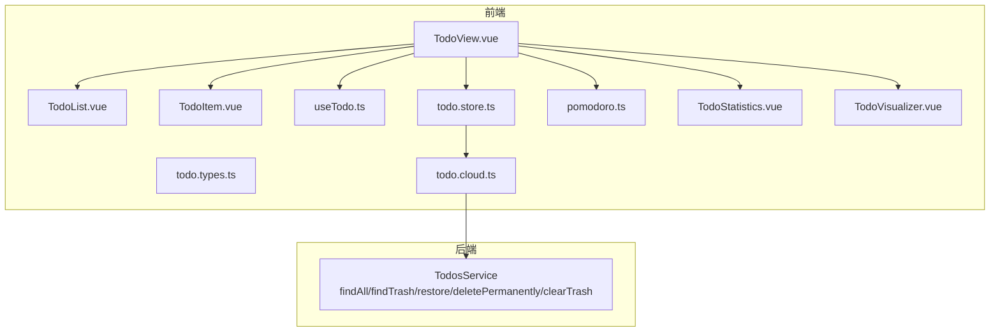

**图表来源**
- [apps/frontend/src/features/todo/TodoView.vue:1-562](file://apps/frontend/src/features/todo/TodoView.vue#L1-L562)
- [apps/frontend/src/features/todo/components/TodoList.vue:1-190](file://apps/frontend/src/features/todo/components/TodoList.vue#L1-L190)
- [apps/frontend/src/features/todo/components/TodoItem.vue:1-406](file://apps/frontend/src/features/todo/components/TodoItem.vue#L1-L406)
- [apps/frontend/src/features/todo/composables/useTodo.ts:1-186](file://apps/frontend/src/features/todo/composables/useTodo.ts#L1-L186)
- [apps/frontend/src/features/todo/stores/todo.store.ts:1-335](file://apps/frontend/src/features/todo/stores/todo.store.ts#L1-L335)
- [apps/frontend/src/features/todo/stores/todo.types.ts:1-68](file://apps/frontend/src/features/todo/stores/todo.types.ts#L1-L68)
- [apps/frontend/src/features/todo/stores/pomodoro.ts:1-402](file://apps/frontend/src/features/todo/stores/pomodoro.ts#L1-L402)
- [apps/frontend/src/features/todo/components/TodoStatistics.vue:1-342](file://apps/frontend/src/features/todo/components/TodoStatistics.vue#L1-L342)
- [apps/frontend/src/features/todo/components/TodoVisualizer.vue:1-185](file://apps/frontend/src/features/todo/components/TodoVisualizer.vue#L1-L185)
- [apps/frontend/src/features/todo/stores/todo.cloud.ts:1-44](file://apps/frontend/src/features/todo/stores/todo.cloud.ts#L1-L44)
- [apps/backend/src/todos/todos.service.ts:1-146](file://apps/backend/src/todos/todos.service.ts#L1-L146)

**章节来源**
- [apps/frontend/src/features/todo/TodoView.vue:1-562](file://apps/frontend/src/features/todo/TodoView.vue#L1-L562)
- [apps/frontend/src/features/todo/stores/todo.store.ts:1-335](file://apps/frontend/src/features/todo/stores/todo.store.ts#L1-L335)

## 核心组件
- TodoView 主视图：负责布局、动画、视图切换（列表/可视化/统计）、输入区与搜索区控制、Pomodoro 集成与云同步冲突面板挂载。
- TodoList 列表：基于可拖拽库实现拖拽排序；根据过滤器与搜索条件渲染；空态提示；滚动区域封装。
- TodoItem 子项：单条任务渲染与交互；支持展开/折叠、编辑、删除、永久删除、子任务新增与递归渲染；与拖拽子任务列表联动。
- useTodo 组合式函数：统一处理输入、搜索、添加、切换、编辑、快捷键等交互；错误提示与节流搜索。
- Pinia Store：集中管理任务数据、过滤器、视图模式、搜索、拖拽状态、错误、抽屉开关、同步状态与冲突；提供 CRUD、排序、切换源、云同步等动作。
- Pomodoro Store：专注计时、会话统计、迷你模式、主题色与 favicon 同步、历史记录。
- 统计与可视化：统计卡片、完成率饼图、每周活跃度、专注时长折线图；可视化树图。

**章节来源**
- [apps/frontend/src/features/todo/TodoView.vue:1-562](file://apps/frontend/src/features/todo/TodoView.vue#L1-L562)
- [apps/frontend/src/features/todo/components/TodoList.vue:1-190](file://apps/frontend/src/features/todo/components/TodoList.vue#L1-L190)
- [apps/frontend/src/features/todo/components/TodoItem.vue:1-406](file://apps/frontend/src/features/todo/components/TodoItem.vue#L1-L406)
- [apps/frontend/src/features/todo/composables/useTodo.ts:1-186](file://apps/frontend/src/features/todo/composables/useTodo.ts#L1-L186)
- [apps/frontend/src/features/todo/stores/todo.store.ts:1-335](file://apps/frontend/src/features/todo/stores/todo.store.ts#L1-L335)
- [apps/frontend/src/features/todo/stores/pomodoro.ts:1-402](file://apps/frontend/src/features/todo/stores/pomodoro.ts#L1-L402)
- [apps/frontend/src/features/todo/components/TodoStatistics.vue:1-342](file://apps/frontend/src/features/todo/components/TodoStatistics.vue#L1-L342)
- [apps/frontend/src/features/todo/components/TodoVisualizer.vue:1-185](file://apps/frontend/src/features/todo/components/TodoVisualizer.vue#L1-L185)

## 架构总览
前端通过 TodoView 统一调度各子组件与 Store，TodoList/TodoItem 实现任务渲染与交互，useTodo 抽象通用交互逻辑，Pinia Store 负责状态持久化与云同步。Pomodoro Store 与 Todo Store 解耦但存在会话与计数联动。统计与可视化组件消费 Store 数据生成图表。

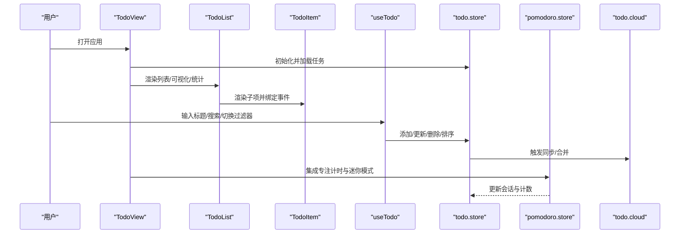

**图表来源**
- [apps/frontend/src/features/todo/TodoView.vue:1-562](file://apps/frontend/src/features/todo/TodoView.vue#L1-L562)
- [apps/frontend/src/features/todo/components/TodoList.vue:1-190](file://apps/frontend/src/features/todo/components/TodoList.vue#L1-L190)
- [apps/frontend/src/features/todo/components/TodoItem.vue:1-406](file://apps/frontend/src/features/todo/components/TodoItem.vue#L1-L406)
- [apps/frontend/src/features/todo/composables/useTodo.ts:1-186](file://apps/frontend/src/features/todo/composables/useTodo.ts#L1-L186)
- [apps/frontend/src/features/todo/stores/todo.store.ts:1-335](file://apps/frontend/src/features/todo/stores/todo.store.ts#L1-L335)
- [apps/frontend/src/features/todo/stores/pomodoro.ts:1-402](file://apps/frontend/src/features/todo/stores/pomodoro.ts#L1-L402)
- [apps/frontend/src/features/todo/stores/todo.cloud.ts:1-44](file://apps/frontend/src/features/todo/stores/todo.cloud.ts#L1-L44)

## 详细组件分析

### TodoView 主视图组件
- 视图切换与动画：通过计算属性与 GSAP 控制列表/可视化/统计之间的过渡方向与动画参数，保证流畅体验。
- 输入区与搜索区：根据视图模式与过滤器动态显示输入框与搜索栏，支持折叠与渐变过渡。
- 鼠标交互：实时追踪鼠标位置，为卡片与背景提供倾斜与位移反馈；拖拽时重置倾斜。
- 云同步冲突面板：在顶部展示冲突列表，支持接受、重试与一键清除。
- AI 助手抽屉：通过抽屉开关控制挂载时机，避免不必要的渲染。
- Pomodoro 集成：在专注模式或迷你模式下挂载地球背景与计时器组件。

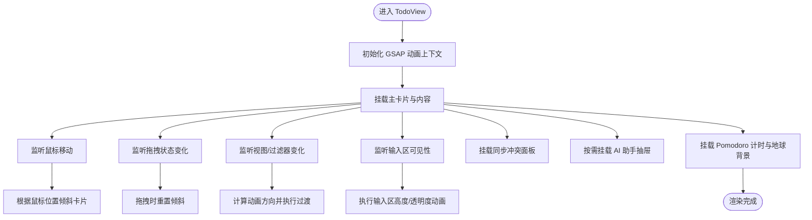

**图表来源**
- [apps/frontend/src/features/todo/TodoView.vue:1-562](file://apps/frontend/src/features/todo/TodoView.vue#L1-L562)

**章节来源**
- [apps/frontend/src/features/todo/TodoView.vue:1-562](file://apps/frontend/src/features/todo/TodoView.vue#L1-L562)

### TodoList 列表组件
- 虚拟滚动与可拖拽：使用滚动区域组件包裹列表，结合可拖拽库实现整组任务的拖拽排序；拖拽句柄限定在可拖拽区域内。
- 空态与搜索态：当无任务或处于搜索/回收站模式时，显示相应图标与文案；搜索模式下禁用拖拽。
- 展示逻辑：非搜索模式下仅显示根节点，子任务由 TodoItem 递归渲染。

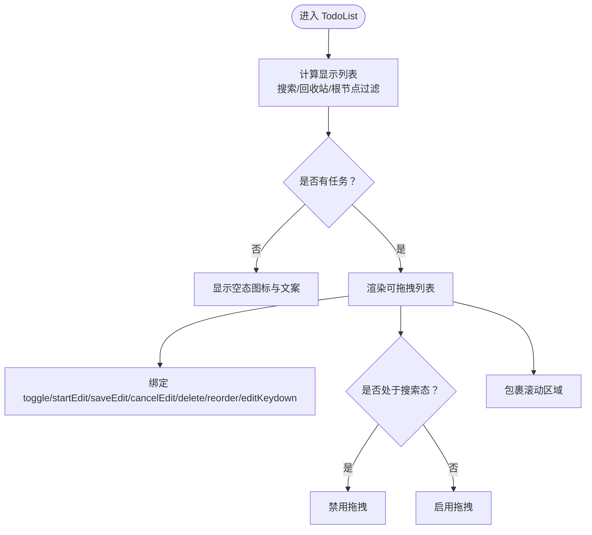

**图表来源**
- [apps/frontend/src/features/todo/components/TodoList.vue:1-190](file://apps/frontend/src/features/todo/components/TodoList.vue#L1-L190)

**章节来源**
- [apps/frontend/src/features/todo/components/TodoList.vue:1-190](file://apps/frontend/src/features/todo/components/TodoList.vue#L1-L190)

### TodoItem 子项组件
- 展开/折叠：根据父子关系与层级控制展开按钮与子任务区域；移动端/桌面端样式差异。
- 状态切换：复选框切换完成状态，触觉反馈；支持禁止切换（如提案删除）。
- 编辑与保存：进入编辑态后，失焦或回车保存；重复标题等错误通过 Store 错误状态反馈。
- 删除与永久删除：软删除进入回收站，永久删除调用 Store 删除流程。
- 子任务新增与递归渲染：支持在当前项下新增子任务，自动展开父级；递归渲染子任务树。
- AI 分解：调用 Store 的 AI 分解能力，成功后给出撤销提示。

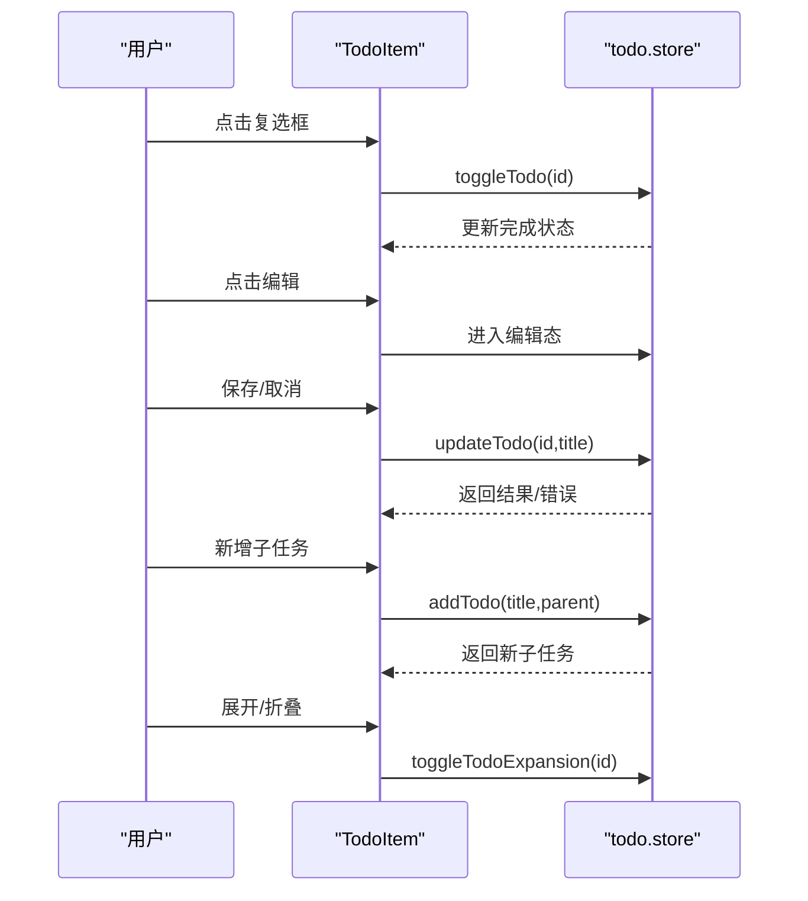

**图表来源**
- [apps/frontend/src/features/todo/components/TodoItem.vue:1-406](file://apps/frontend/src/features/todo/components/TodoItem.vue#L1-L406)
- [apps/frontend/src/features/todo/stores/todo.store.ts:1-335](file://apps/frontend/src/features/todo/stores/todo.store.ts#L1-L335)

**章节来源**
- [apps/frontend/src/features/todo/components/TodoItem.vue:1-406](file://apps/frontend/src/features/todo/components/TodoItem.vue#L1-L406)

### useTodo 组合式函数
- 输入与搜索：双向绑定输入框，使用防抖更新 Store 的搜索查询。
- 错误提示：监听 Store 错误并在非静默状态下弹出提示，避免重复触发。
- 任务操作：封装添加、切换、编辑、保存、取消、键盘事件等常用交互。
- 全局快捷键：Command+E 或 Alt+E 切换 AI 助手抽屉，避免在 AI 输入框内触发。
- 火花特效：完成未完成任务时触发烟花动画。

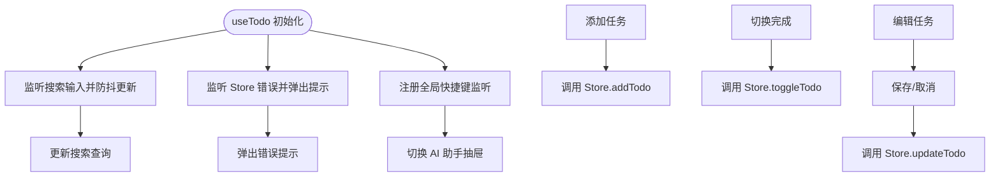

**图表来源**
- [apps/frontend/src/features/todo/composables/useTodo.ts:1-186](file://apps/frontend/src/features/todo/composables/useTodo.ts#L1-L186)

**章节来源**
- [apps/frontend/src/features/todo/composables/useTodo.ts:1-186](file://apps/frontend/src/features/todo/composables/useTodo.ts#L1-L186)

### Pinia Store 状态设计与动作
- 数据模型：任务对象扩展了完成时间、删除时间、到期提醒、递归规则、父 ID、展开状态、提案标记、同步状态与专注计数等字段。
- 过滤与搜索：根据过滤器与搜索词对任务进行筛选与排序；搜索时强制展开所有任务。
- 视图与拖拽：维护当前视图模式、过滤器、拖拽状态、错误信息、抽屉开关等。
- 同步与冲突：维护最后同步时间、同步拥有者、冲突列表；提供冲突接受、重试与清除；支持 Socket 监听。
- 源切换：支持本地与远程源切换，登录后自动合并远程数据。
- 动作模块：封装 CRUD、排序、切换、删除、清空回收站、提案变更应用等。

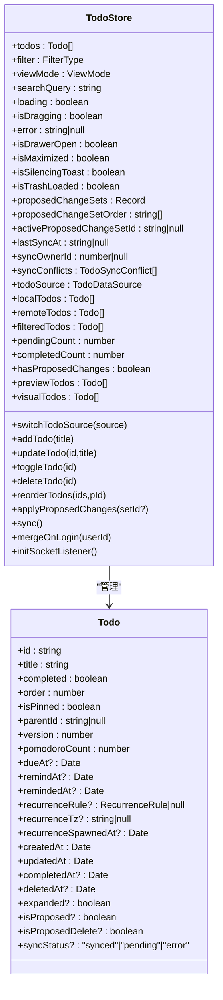

**图表来源**
- [apps/frontend/src/features/todo/stores/todo.store.ts:1-335](file://apps/frontend/src/features/todo/stores/todo.store.ts#L1-L335)
- [apps/frontend/src/features/todo/stores/todo.types.ts:1-68](file://apps/frontend/src/features/todo/stores/todo.types.ts#L1-L68)

**章节来源**
- [apps/frontend/src/features/todo/stores/todo.store.ts:1-335](file://apps/frontend/src/features/todo/stores/todo.store.ts#L1-L335)
- [apps/frontend/src/features/todo/stores/todo.types.ts:1-68](file://apps/frontend/src/features/todo/stores/todo.types.ts#L1-L68)

### Pomodoro 专注模式集成
- 计时与会话：支持多种模式（经典/冰breaker/Flow/Cosmos），自动切换短休/长休；完成一个专注周期后增加会话计数与历史记录。
- 迷你模式：专注时隐藏卡片布局，仅保留计时器与地球背景；支持窗口大小变化与 Wails 同步。
- 文档标题与 favicon：根据当前状态与进度动态更新标题与 favicon 圆环。
- 与任务联动：专注完成后更新当前任务的专注计数。

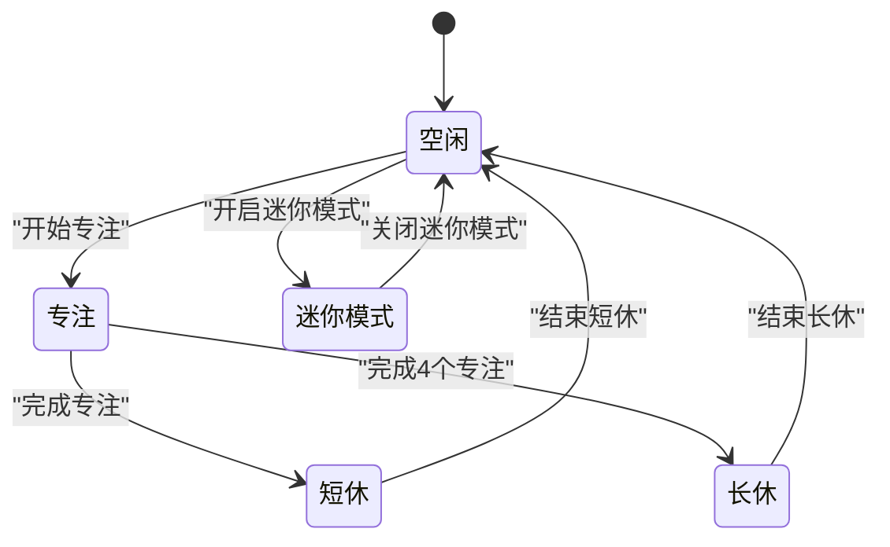

**图表来源**
- [apps/frontend/src/features/todo/stores/pomodoro.ts:1-402](file://apps/frontend/src/features/todo/stores/pomodoro.ts#L1-L402)

**章节来源**
- [apps/frontend/src/features/todo/stores/pomodoro.ts:1-402](file://apps/frontend/src/features/todo/stores/pomodoro.ts#L1-L402)

### 任务统计图表
- 概览卡片：总任务、已完成、待完成、专注会话数。
- 完成率饼图：基于完成/未完成任务比例绘制。
- 每周活跃度：基于历史记录绘制折线图。
- 专注时长：基于每日专注分钟数绘制柱状图。
- 图表初始化：使用 ResizeObserver 确保容器尺寸就绪后渲染，避免首次空白；支持暗色主题与主题色同步。

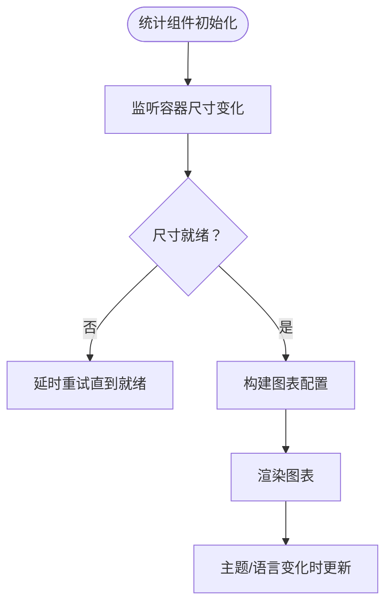

**图表来源**
- [apps/frontend/src/features/todo/components/TodoStatistics.vue:1-342](file://apps/frontend/src/features/todo/components/TodoStatistics.vue#L1-L342)

**章节来源**
- [apps/frontend/src/features/todo/components/TodoStatistics.vue:1-342](file://apps/frontend/src/features/todo/components/TodoStatistics.vue#L1-L342)

### 任务可视化树图
- 数据准备：根据过滤器与搜索条件筛选任务，构建树形数据结构。
- 图表选项：基于树形数据生成可视化配置，支持深色主题与主题色。
- 空态处理：无数据时显示占位与提示文本。

**章节来源**
- [apps/frontend/src/features/todo/components/TodoVisualizer.vue:1-185](file://apps/frontend/src/features/todo/components/TodoVisualizer.vue#L1-L185)

### 云端同步机制与离线缓存
- 同步入口：Store 内部通过云模块暴露 sync、debouncedSync、mergeOnLogin、initSocketListener 等方法。
- 冲突处理：维护冲突列表，支持接受、重试与清除；冲突类型包括墓碑、拥有者不匹配、版本冲突。
- 源切换：登录后自动切换至远程源并合并数据；登出时清空远程数据与冲突。
- 后端支持：后端提供基础查询、回收站恢复与清空、永久删除等接口。

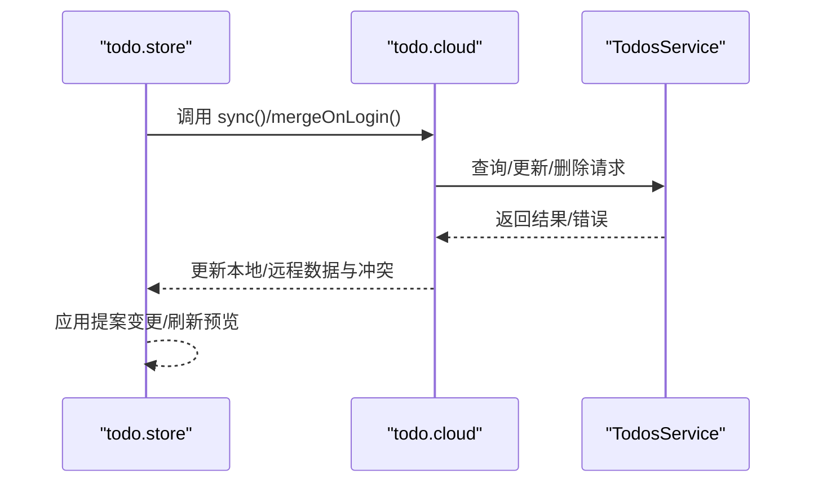

**图表来源**
- [apps/frontend/src/features/todo/stores/todo.store.ts:1-335](file://apps/frontend/src/features/todo/stores/todo.store.ts#L1-L335)
- [apps/frontend/src/features/todo/stores/todo.cloud.ts:1-44](file://apps/frontend/src/features/todo/stores/todo.cloud.ts#L1-L44)
- [apps/backend/src/todos/todos.service.ts:1-146](file://apps/backend/src/todos/todos.service.ts#L1-L146)

**章节来源**
- [apps/frontend/src/features/todo/stores/todo.store.ts:1-335](file://apps/frontend/src/features/todo/stores/todo.store.ts#L1-L335)
- [apps/frontend/src/features/todo/stores/todo.cloud.ts:1-44](file://apps/frontend/src/features/todo/stores/todo.cloud.ts#L1-L44)
- [apps/backend/src/todos/todos.service.ts:1-146](file://apps/backend/src/todos/todos.service.ts#L1-L146)

## 依赖关系分析
- 组件依赖：TodoView 依赖 TodoList、TodoItem、useTodo、Pomodoro Store、统计与可视化组件；TodoList 依赖 TodoItem 与滚动区域；TodoItem 依赖动作面板与内容组件。
- Store 依赖：todo.store 依赖过滤/排序、云模块、提案变更、源管理、日期规范化与快照工具；pomodoro.store 依赖 todo.store 获取当前任务。
- 后端依赖：云模块通过共享类型与后端服务交互，实现任务查询与回收站操作。

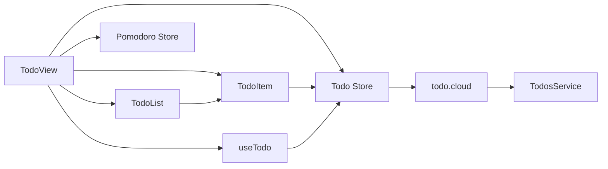

**图表来源**
- [apps/frontend/src/features/todo/TodoView.vue:1-562](file://apps/frontend/src/features/todo/TodoView.vue#L1-L562)
- [apps/frontend/src/features/todo/components/TodoList.vue:1-190](file://apps/frontend/src/features/todo/components/TodoList.vue#L1-L190)
- [apps/frontend/src/features/todo/components/TodoItem.vue:1-406](file://apps/frontend/src/features/todo/components/TodoItem.vue#L1-L406)
- [apps/frontend/src/features/todo/composables/useTodo.ts:1-186](file://apps/frontend/src/features/todo/composables/useTodo.ts#L1-L186)
- [apps/frontend/src/features/todo/stores/todo.store.ts:1-335](file://apps/frontend/src/features/todo/stores/todo.store.ts#L1-L335)
- [apps/frontend/src/features/todo/stores/pomodoro.ts:1-402](file://apps/frontend/src/features/todo/stores/pomodoro.ts#L1-L402)
- [apps/frontend/src/features/todo/stores/todo.cloud.ts:1-44](file://apps/frontend/src/features/todo/stores/todo.cloud.ts#L1-L44)
- [apps/backend/src/todos/todos.service.ts:1-146](file://apps/backend/src/todos/todos.service.ts#L1-L146)

**章节来源**
- [apps/frontend/src/features/todo/TodoView.vue:1-562](file://apps/frontend/src/features/todo/TodoView.vue#L1-L562)
- [apps/frontend/src/features/todo/stores/todo.store.ts:1-335](file://apps/frontend/src/features/todo/stores/todo.store.ts#L1-L335)

## 性能考量
- 动画与渲染：TodoView 使用 GSAP 控制过渡与倾斜，避免不必要的重排；TodoList 在搜索态禁用拖拽，减少计算量。
- 图表渲染：统计与可视化组件使用 ResizeObserver 与防抖 resize，确保容器尺寸稳定后再渲染，降低首屏闪烁与重绘成本。
- 搜索防抖：useTodo 对搜索输入进行防抖，减少 Store 更新频率与后续渲染压力。
- 源切换与持久化：Store 对关键状态进行本地持久化，减少刷新后的重建成本；源切换时仅应用目标源快照，避免全量重算。
- 拖拽优化：TodoItem 的子任务拖拽与父任务拖拽分别维护独立列表，减少跨层级拖拽带来的复杂度。

## 故障排查指南
- 拖拽失败或报错：检查 Store 错误状态与 isSilencingToast 标志，确认是否为重复项或权限问题；在 useTodo 中查看错误提示逻辑。
- 同步冲突：在 TodoView 顶部冲突面板中查看冲突原因与时间，选择接受或重试；必要时清除冲突列表。
- Pomodoro 计时异常：检查状态机流转与定时器生命周期，确认是否正确暂停/恢复；核对 mini 模式与窗口同步。
- 图表不显示：确认容器尺寸是否就绪，检查 isReady 标志与 ResizeObserver 回调；确保主题与语言变化时重新渲染。
- 登录/登出后数据错乱：确认源切换逻辑与 mergeOnLogin/mergeOnLogout 是否正确执行。

**章节来源**
- [apps/frontend/src/features/todo/composables/useTodo.ts:1-186](file://apps/frontend/src/features/todo/composables/useTodo.ts#L1-L186)
- [apps/frontend/src/features/todo/stores/todo.store.ts:1-335](file://apps/frontend/src/features/todo/stores/todo.store.ts#L1-L335)
- [apps/frontend/src/features/todo/stores/pomodoro.ts:1-402](file://apps/frontend/src/features/todo/stores/pomodoro.ts#L1-L402)
- [apps/frontend/src/features/todo/components/TodoStatistics.vue:1-342](file://apps/frontend/src/features/todo/components/TodoStatistics.vue#L1-L342)

## 结论
该待办事项管理功能通过清晰的组件分层与 Pinia 状态管理，实现了从任务渲染、交互到云端同步与可视化的完整闭环。TodoView 作为中枢协调各子组件与 Store，useTodo 抽象通用交互，Pomodoro Store 与任务数据联动，统计与可视化组件提供多维度洞察。建议持续关注性能优化与错误处理的边界场景，确保在复杂任务与大规模数据下的稳定性与响应速度。

## 附录
- 关键状态与动作一览
  - 过滤器：pending/completed/trash
  - 视图模式：list/visual/stats
  - 拖拽状态：isDragging
  - 错误状态：error
  - 同步状态：loading、lastSyncAt、syncConflicts
  - 源状态：todoSource/local/remote
  - 提案变更：proposedChangeSets、activeProposedChangeSetId
- 常用动作
  - 添加/更新/删除/切换完成
  - 排序（整组/父子）
  - 切换源（本地/远程）
  - 同步/合并/冲突处理
  - 清空回收站/永久删除
  - 应用/丢弃提案变更