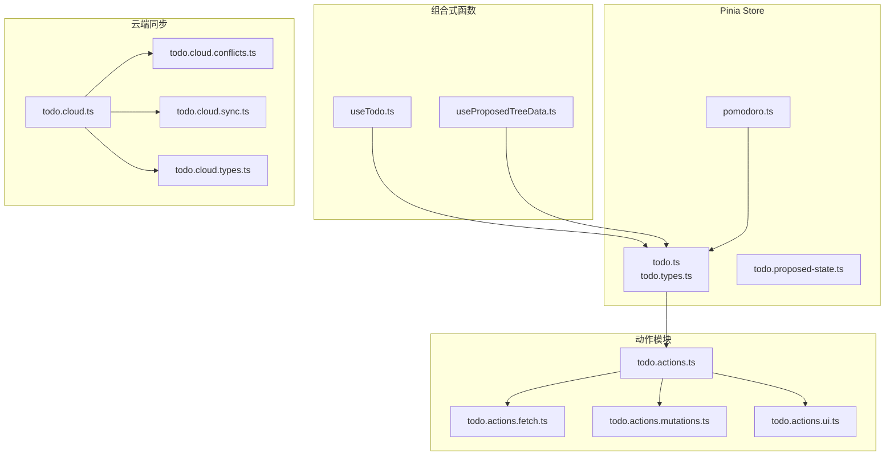
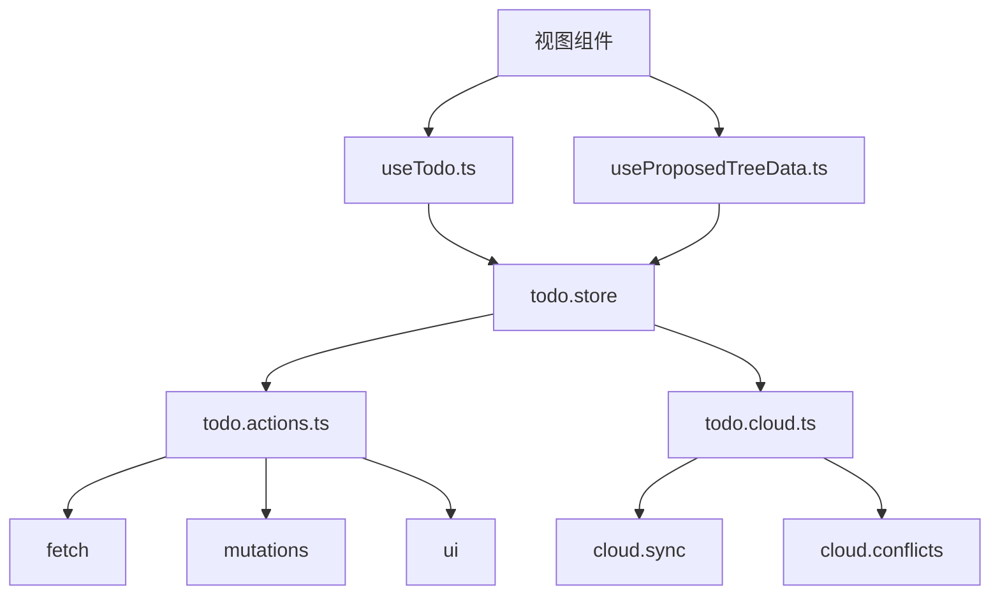
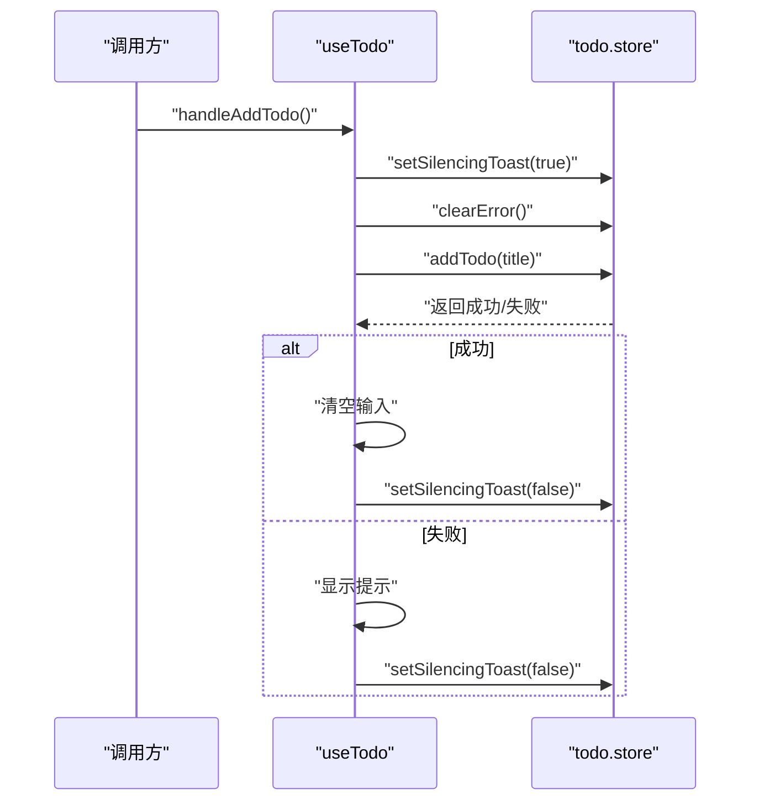
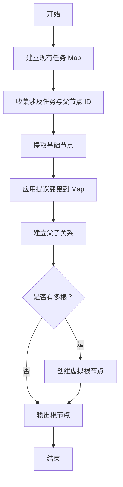
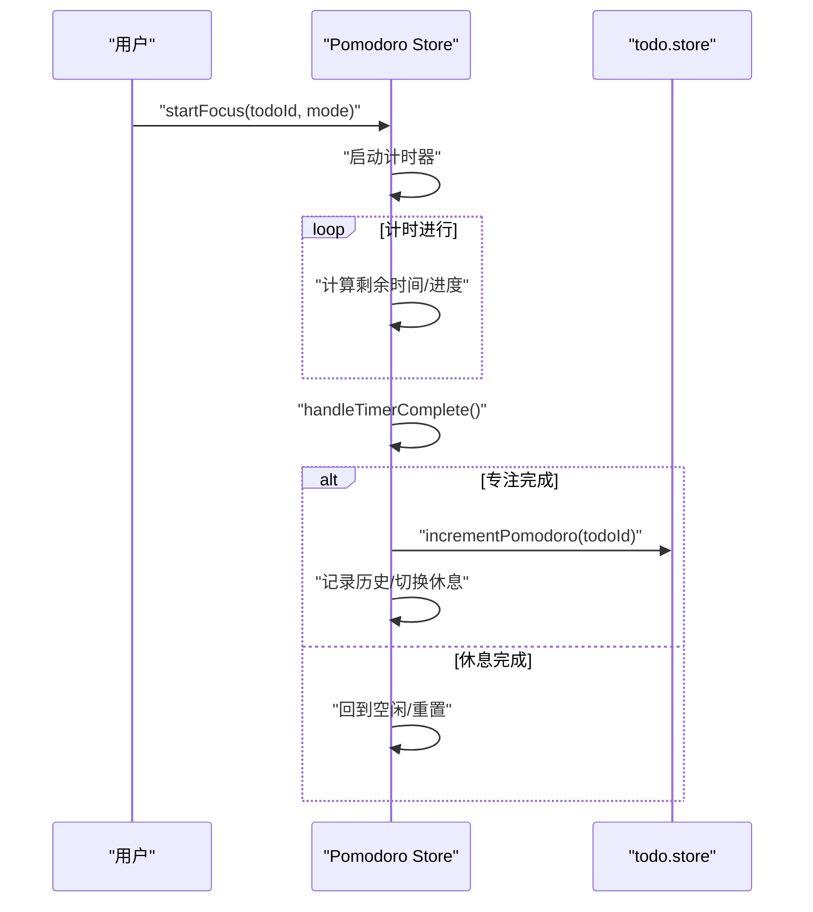
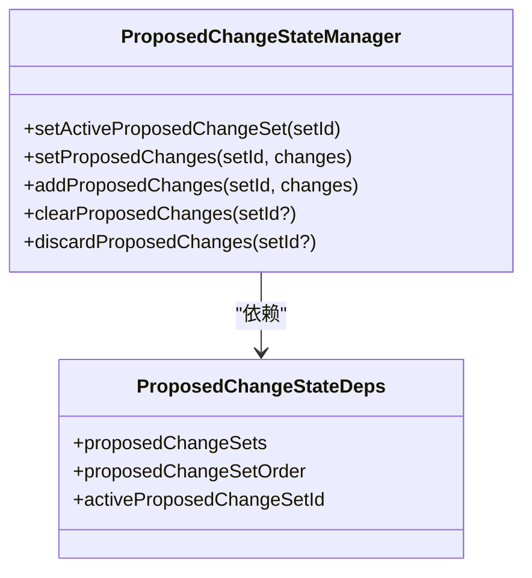
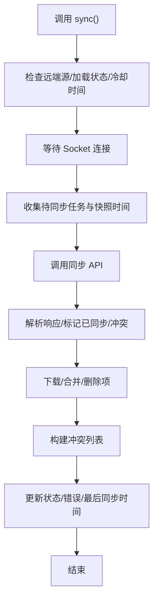
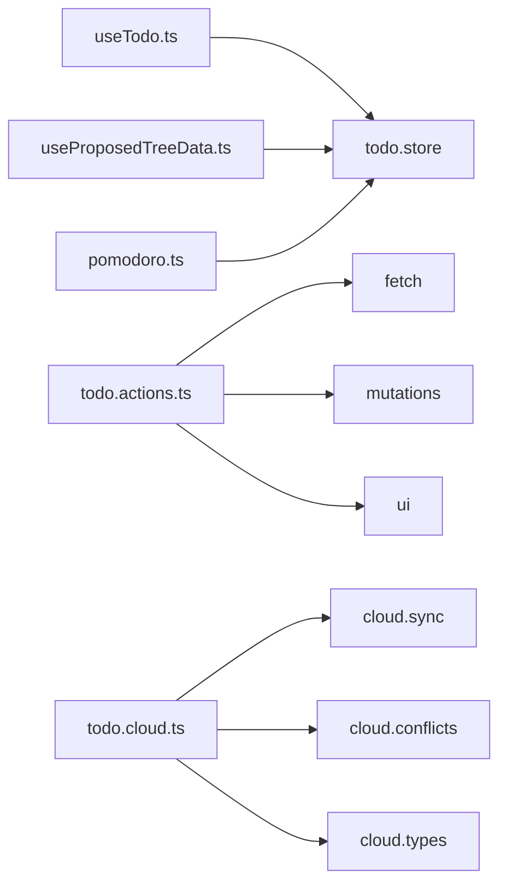

# 状态管理系统

<cite>
**本文引用的文件**
- [apps/frontend/src/features/todo/composables/useTodo.ts](file://apps/frontend/src/features/todo/composables/useTodo.ts)
- [apps/frontend/src/features/todo/composables/useProposedTreeData.ts](file://apps/frontend/src/features/todo/composables/useProposedTreeData.ts)
- [apps/frontend/src/features/todo/stores/pomodoro.ts](file://apps/frontend/src/features/todo/stores/pomodoro.ts)
- [apps/frontend/src/features/todo/stores/todo.actions.ts](file://apps/frontend/src/features/todo/stores/todo.actions.ts)
- [apps/frontend/src/features/todo/stores/todo.actions.mutations.ts](file://apps/frontend/src/features/todo/stores/todo.actions.mutations.ts)
- [apps/frontend/src/features/todo/stores/todo.actions.fetch.ts](file://apps/frontend/src/features/todo/stores/todo.actions.fetch.ts)
- [apps/frontend/src/features/todo/stores/todo.actions.ui.ts](file://apps/frontend/src/features/todo/stores/todo.actions.ui.ts)
- [apps/frontend/src/features/todo/stores/todo.proposed-state.ts](file://apps/frontend/src/features/todo/stores/todo.proposed-state.ts)
- [apps/frontend/src/features/todo/stores/todo.cloud.ts](file://apps/frontend/src/features/todo/stores/todo.cloud.ts)
- [apps/frontend/src/features/todo/stores/todo.cloud.sync.ts](file://apps/frontend/src/features/todo/stores/todo.cloud.sync.ts)
- [apps/frontend/src/features/todo/stores/todo.cloud.conflicts.ts](file://apps/frontend/src/features/todo/stores/todo.cloud.conflicts.ts)
- [apps/frontend/src/features/todo/stores/todo.types.ts](file://apps/frontend/src/features/todo/stores/todo.types.ts)
- [apps/frontend/src/features/todo/stores/todo.cloud.types.ts](file://apps/frontend/src/features/todo/stores/todo.cloud.types.ts)
</cite>

## 目录
1. [简介](#简介)
2. [项目结构](#项目结构)
3. [核心组件](#核心组件)
4. [架构总览](#架构总览)
5. [详细组件分析](#详细组件分析)
6. [依赖分析](#依赖分析)
7. [性能考虑](#性能考虑)
8. [故障排查指南](#故障排查指南)
9. [结论](#结论)
10. [附录](#附录)

## 简介
本文件面向“待办事项状态管理系统”的前端状态层，围绕以下目标展开：
- 深入解析 Pinia Store 的设计架构：任务数据结构、状态分层与模块化组织
- 文档化 useTodo 组合式函数：任务增删改查、批量操作、数据校验与错误处理
- 详解 Pomodoro Store 与任务状态的集成：专注计时、任务暂停、状态同步机制
- 解释提议状态系统：useProposedTreeData 的树形数据管理、变更预览与冲突解决策略
- 说明云端同步状态管理：同步队列、冲突检测、回滚机制与离线缓存策略

## 项目结构
本系统采用“按功能域划分”的模块化组织方式，核心位于 todo 功能域，包含：
- 组合式函数：useTodo、useProposedTreeData
- Pinia Store：todo 主状态、pomodoro 专注计时、提议状态管理器
- 同步子系统：todo.cloud.* 与 todo.cloud.sync/conflicts/types
- 动作聚合：todo.actions.* 将获取、变更、UI、AI 动作模块化组合

图表来源
- [apps/frontend/src/features/todo/composables/useTodo.ts:1-186](file://apps/frontend/src/features/todo/composables/useTodo.ts#L1-L186)
- [apps/frontend/src/features/todo/composables/useProposedTreeData.ts:1-169](file://apps/frontend/src/features/todo/composables/useProposedTreeData.ts#L1-L169)
- [apps/frontend/src/features/todo/stores/pomodoro.ts:1-402](file://apps/frontend/src/features/todo/stores/pomodoro.ts#L1-L402)
- [apps/frontend/src/features/todo/stores/todo.actions.ts:1-105](file://apps/frontend/src/features/todo/stores/todo.actions.ts#L1-L105)
- [apps/frontend/src/features/todo/stores/todo.actions.fetch.ts:1-69](file://apps/frontend/src/features/todo/stores/todo.actions.fetch.ts#L1-L69)
- [apps/frontend/src/features/todo/stores/todo.actions.mutations.ts:1-417](file://apps/frontend/src/features/todo/stores/todo.actions.mutations.ts#L1-L417)
- [apps/frontend/src/features/todo/stores/todo.actions.ui.ts:1-95](file://apps/frontend/src/features/todo/stores/todo.actions.ui.ts#L1-L95)
- [apps/frontend/src/features/todo/stores/todo.cloud.ts:1-44](file://apps/frontend/src/features/todo/stores/todo.cloud.ts#L1-L44)
- [apps/frontend/src/features/todo/stores/todo.cloud.sync.ts:1-214](file://apps/frontend/src/features/todo/stores/todo.cloud.sync.ts#L1-L214)
- [apps/frontend/src/features/todo/stores/todo.cloud.conflicts.ts:1-91](file://apps/frontend/src/features/todo/stores/todo.cloud.conflicts.ts#L1-L91)
- [apps/frontend/src/features/todo/stores/todo.types.ts:1-68](file://apps/frontend/src/features/todo/stores/todo.types.ts#L1-L68)
- [apps/frontend/src/features/todo/stores/todo.cloud.types.ts:1-17](file://apps/frontend/src/features/todo/stores/todo.cloud.types.ts#L1-L17)

章节来源
- [apps/frontend/src/features/todo/composables/useTodo.ts:1-186](file://apps/frontend/src/features/todo/composables/useTodo.ts#L1-L186)
- [apps/frontend/src/features/todo/stores/todo.actions.ts:1-105](file://apps/frontend/src/features/todo/stores/todo.actions.ts#L1-L105)

## 核心组件
- 数据模型与类型
  - Todo 类型扩展自共享模型，新增完成时间、删除时间、到期/提醒时间、递归规则、父节点、展开状态、提议标记、同步状态、专注次数等字段
  - 提议变更类型定义了 add/update/delete/toggle/pin 五种变更类型及对应的数据载荷
  - 同步冲突类型包含冲突原因、服务端版本、本地草稿与服务端快照等
- 动作聚合器
  - todo.actions.ts 将获取、变更、UI、AI 动作拆分为独立模块并通过依赖注入组合，提供统一入口
- 云同步抽象
  - todo.cloud.ts 作为工厂函数，封装云数据模块（数据、冲突、监听、提醒、回收站）并暴露统一接口
  - todo.cloud.sync.ts 实现同步主流程、冷却节流、重试与冲突收集
  - todo.cloud.conflicts.ts 定义冲突构建与接受/重试/清理逻辑

章节来源
- [apps/frontend/src/features/todo/stores/todo.types.ts:1-68](file://apps/frontend/src/features/todo/stores/todo.types.ts#L1-L68)
- [apps/frontend/src/features/todo/stores/todo.actions.ts:1-105](file://apps/frontend/src/features/todo/stores/todo.actions.ts#L1-L105)
- [apps/frontend/src/features/todo/stores/todo.cloud.ts:1-44](file://apps/frontend/src/features/todo/stores/todo.cloud.ts#L1-L44)
- [apps/frontend/src/features/todo/stores/todo.cloud.sync.ts:1-214](file://apps/frontend/src/features/todo/stores/todo.cloud.sync.ts#L1-L214)
- [apps/frontend/src/features/todo/stores/todo.cloud.conflicts.ts:1-91](file://apps/frontend/src/features/todo/stores/todo.cloud.conflicts.ts#L1-L91)

## 架构总览
系统采用“组合式函数 + Pinia Store + 动作模块 + 云同步子系统”的分层架构：
- 视图层通过组合式函数 useTodo 与 useProposedTreeData 与状态层交互
- Pinia Store 负责集中式状态与持久化（如 Pomodoro）
- 动作模块实现业务逻辑（获取、变更、UI、AI），统一调用云同步
- 云同步子系统负责与后端通信、冲突检测与回滚

图表来源
- [apps/frontend/src/features/todo/composables/useTodo.ts:1-186](file://apps/frontend/src/features/todo/composables/useTodo.ts#L1-L186)
- [apps/frontend/src/features/todo/composables/useProposedTreeData.ts:1-169](file://apps/frontend/src/features/todo/composables/useProposedTreeData.ts#L1-L169)
- [apps/frontend/src/features/todo/stores/todo.actions.ts:1-105](file://apps/frontend/src/features/todo/stores/todo.actions.ts#L1-L105)
- [apps/frontend/src/features/todo/stores/todo.cloud.ts:1-44](file://apps/frontend/src/features/todo/stores/todo.cloud.ts#L1-L44)
- [apps/frontend/src/features/todo/stores/todo.cloud.sync.ts:1-214](file://apps/frontend/src/features/todo/stores/todo.cloud.sync.ts#L1-L214)
- [apps/frontend/src/features/todo/stores/todo.cloud.conflicts.ts:1-91](file://apps/frontend/src/features/todo/stores/todo.cloud.conflicts.ts#L1-L91)

## 详细组件分析

### 组件一：useTodo 组合式函数
职责与能力
- 管理新增任务标题、搜索面板开关、搜索输入与烟花动画状态
- 通过防抖更新搜索查询，降低频繁刷新
- 监听全局错误并在非直接操作时弹出提示
- 提供新增、切换完成、编辑、保存、取消、快捷键等方法
- 与 Toast、国际化、防抖工具协作

关键流程
- 新增任务：设置静默提示、清空错误、调用 store.addTodo，成功后清空输入并关闭静默；失败时开启提示并稍后关闭静默
- 编辑保存：设置静默提示、清空错误、调用 store.updateTodo；若为重复项则保持编辑态并稍后关闭静默
- 键盘快捷键：全局监听 Cmd/Ctrl+E 切换抽屉

图表来源
- [apps/frontend/src/features/todo/composables/useTodo.ts:52-68](file://apps/frontend/src/features/todo/composables/useTodo.ts#L52-L68)
- [apps/frontend/src/features/todo/stores/todo.actions.mutations.ts:90-144](file://apps/frontend/src/features/todo/stores/todo.actions.mutations.ts#L90-L144)

章节来源
- [apps/frontend/src/features/todo/composables/useTodo.ts:1-186](file://apps/frontend/src/features/todo/composables/useTodo.ts#L1-L186)

### 组件二：useProposedTreeData 树形数据管理
职责与能力
- 基于现有任务与提议变更集合生成树形数据
- 为新增、更新、删除、置顶、切换等变更类型设置不同样式与标签
- 自动维护父子关系与多根场景下的虚拟根节点
- 支持深色主题下的视觉差异

算法要点
- 快速索引：基于现有任务建立 Map，提升查找性能
- 涉及节点集：收集变更涉及的任务与父节点 ID，保证树结构完整性
- 应用变更：根据变更类型动态调整节点样式、标签与父子关系
- 根节点判定：若无根节点则推入虚拟根节点，便于展示

图表来源
- [apps/frontend/src/features/todo/composables/useProposedTreeData.ts:10-163](file://apps/frontend/src/features/todo/composables/useProposedTreeData.ts#L10-L163)

章节来源
- [apps/frontend/src/features/todo/composables/useProposedTreeData.ts:1-169](file://apps/frontend/src/features/todo/composables/useProposedTreeData.ts#L1-L169)

### 组件三：Pomodoro Store 与任务状态集成
职责与能力
- 管理专注状态、模式配置、剩余时间、当前会话总时长、完成轮数、历史统计
- 与任务状态联动：完成一轮专注后对活跃任务增加专注次数
- 与原生窗口同步迷你模式、震动反馈、通知与标题栏/图标进度提示
- 支持自动恢复计时（页面刷新后基于目标结束时间精确恢复）

关键交互
- 开始专注：选择任务与模式，启动计时并进入专注状态
- 计时完成：根据状态切换休息或重置，记录历史，必要时通知用户
- 与任务集成：完成专注后调用 todoStore.incrementPomodoro

图表来源
- [apps/frontend/src/features/todo/stores/pomodoro.ts:196-356](file://apps/frontend/src/features/todo/stores/pomodoro.ts#L196-L356)
- [apps/frontend/src/features/todo/stores/todo.actions.mutations.ts:265-273](file://apps/frontend/src/features/todo/stores/todo.actions.mutations.ts#L265-L273)

章节来源
- [apps/frontend/src/features/todo/stores/pomodoro.ts:1-402](file://apps/frontend/src/features/todo/stores/pomodoro.ts#L1-L402)

### 组件四：提议状态管理器（ProposedChangeStateManager）
职责与能力
- 管理提议变更集合的增删改与激活集切换
- 维护变更集顺序，支持清空、丢弃与追加
- 与 useProposedTreeData 协作，驱动树形数据渲染

图表来源
- [apps/frontend/src/features/todo/stores/todo.proposed-state.ts:4-79](file://apps/frontend/src/features/todo/stores/todo.proposed-state.ts#L4-L79)

章节来源
- [apps/frontend/src/features/todo/stores/todo.proposed-state.ts:1-79](file://apps/frontend/src/features/todo/stores/todo.proposed-state.ts#L1-L79)

### 组件五：云端同步与冲突处理
职责与能力
- 统一同步入口：合并 fetch/mutations/ui/ai 动作，提供 debouncedSync、mergeOnLogin、accept/retry/clear 冲突等
- 同步流程：节流冷却、等待 Socket 连接、收集待同步任务、调用 API、映射响应、更新本地状态与冲突列表
- 冲突策略：TOMBSTONED/OWNER_MISMATCH 直接移除；VERSION_CONFLICT 重试并更新版本号与时间戳
- 回滚与清理：支持接受冲突、重试冲突、清理冲突列表

图表来源
- [apps/frontend/src/features/todo/stores/todo.cloud.sync.ts:36-181](file://apps/frontend/src/features/todo/stores/todo.cloud.sync.ts#L36-L181)
- [apps/frontend/src/features/todo/stores/todo.cloud.conflicts.ts:33-83](file://apps/frontend/src/features/todo/stores/todo.cloud.conflicts.ts#L33-L83)

章节来源
- [apps/frontend/src/features/todo/stores/todo.cloud.ts:1-44](file://apps/frontend/src/features/todo/stores/todo.cloud.ts#L1-L44)
- [apps/frontend/src/features/todo/stores/todo.cloud.sync.ts:1-214](file://apps/frontend/src/features/todo/stores/todo.cloud.sync.ts#L1-L214)
- [apps/frontend/src/features/todo/stores/todo.cloud.conflicts.ts:1-91](file://apps/frontend/src/features/todo/stores/todo.cloud.conflicts.ts#L1-L91)

## 依赖分析
- 组合式函数依赖
  - useTodo 依赖 todo.store 与 Toast、国际化、防抖工具
  - useProposedTreeData 依赖 todo.store 与国际化
- Store 间耦合
  - pomodoro.store 依赖 todo.store 以更新任务专注次数
  - todo.store 通过 actions 聚合器调用 fetch/mutations/ui/ai 子模块
- 云同步依赖
  - todo.cloud.ts 作为门面，依赖 todo.cloud.data（含 sync/conflicts/types）
  - 同步过程依赖 Socket 与 API 层，错误处理包含动态模块加载失败的降级

图表来源
- [apps/frontend/src/features/todo/composables/useTodo.ts:1-186](file://apps/frontend/src/features/todo/composables/useTodo.ts#L1-L186)
- [apps/frontend/src/features/todo/composables/useProposedTreeData.ts:1-169](file://apps/frontend/src/features/todo/composables/useProposedTreeData.ts#L1-L169)
- [apps/frontend/src/features/todo/stores/pomodoro.ts:1-402](file://apps/frontend/src/features/todo/stores/pomodoro.ts#L1-L402)
- [apps/frontend/src/features/todo/stores/todo.actions.ts:1-105](file://apps/frontend/src/features/todo/stores/todo.actions.ts#L1-L105)
- [apps/frontend/src/features/todo/stores/todo.cloud.ts:1-44](file://apps/frontend/src/features/todo/stores/todo.cloud.ts#L1-L44)
- [apps/frontend/src/features/todo/stores/todo.cloud.sync.ts:1-214](file://apps/frontend/src/features/todo/stores/todo.cloud.sync.ts#L1-L214)
- [apps/frontend/src/features/todo/stores/todo.cloud.conflicts.ts:1-91](file://apps/frontend/src/features/todo/stores/todo.cloud.conflicts.ts#L1-L91)

章节来源
- [apps/frontend/src/features/todo/stores/todo.actions.ts:1-105](file://apps/frontend/src/features/todo/stores/todo.actions.ts#L1-L105)
- [apps/frontend/src/features/todo/stores/todo.cloud.ts:1-44](file://apps/frontend/src/features/todo/stores/todo.cloud.ts#L1-L44)

## 性能考虑
- 防抖与节流
  - 搜索输入使用防抖减少频繁刷新
  - 同步冷却时间限制请求频率，避免风暴
- 惰性加载与动态导入
  - Socket 模块按需加载，失败时提示版本更新
- 计算属性与只读派生
  - 进度、格式化时间、活动任务等通过计算属性避免重复计算
- 批量操作
  - 批量新增、排序变更后统一触发一次同步，降低网络往返

## 故障排查指南
- 新增/更新失败
  - 检查重复项与父任务完成状态，错误码由 store.error 提供
  - 在 useTodo 中监听错误并弹出提示
- 同步失败
  - 查看同步冷却时间与 Socket 连接状态
  - 动态模块加载失败时，提示版本更新并记录错误
- 冲突处理
  - TOMBSTONED/OWNER_MISMATCH：直接移除本地对应任务
  - VERSION_CONFLICT：重试并更新版本号与时间戳
  - 清理冲突列表以避免阻塞后续同步

章节来源
- [apps/frontend/src/features/todo/stores/todo.actions.mutations.ts:90-144](file://apps/frontend/src/features/todo/stores/todo.actions.mutations.ts#L90-L144)
- [apps/frontend/src/features/todo/stores/todo.cloud.sync.ts:165-181](file://apps/frontend/src/features/todo/stores/todo.cloud.sync.ts#L165-L181)
- [apps/frontend/src/features/todo/stores/todo.cloud.conflicts.ts:33-83](file://apps/frontend/src/features/todo/stores/todo.cloud.conflicts.ts#L33-L83)

## 结论
该状态管理系统通过清晰的模块划分与职责分离，实现了：
- 任务数据结构的完备表达与类型安全
- 动作层的高内聚低耦合与可测试性
- 与 Pomodoro 的自然集成与原生能力利用
- 提议状态的可视化与冲突治理
- 云端同步的稳健性与用户体验保障

建议持续关注：
- 更细粒度的错误边界与可观测性
- 离线优先策略与增量同步优化
- 提议变更的原子化与事务化回滚

## 附录
- 关键类型与字段
  - Todo：扩展字段包括完成/删除时间、到期/提醒/提醒时间、递归规则与时区、父节点、展开状态、提议标记、同步状态、专注次数
  - 提议变更：add/update/delete/toggle/pin 五类
  - 冲突原因：TOMBSTONED、OWNER_MISMATCH、VERSION_CONFLICT
- 常用动作
  - 新增/批量新增、更新、删除、恢复、切换完成、置顶、排序、更新计划（到期/提醒/递归）
  - 设置过滤器、搜索、抽屉开关、全展开/折叠、路径查询
  - 同步、去抖动同步、合并登录、接受/重试/清理冲突、初始化 Socket 监听、永久删除、清空回收站