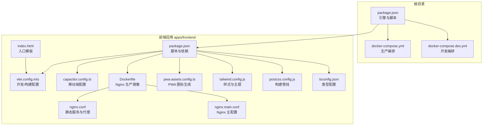
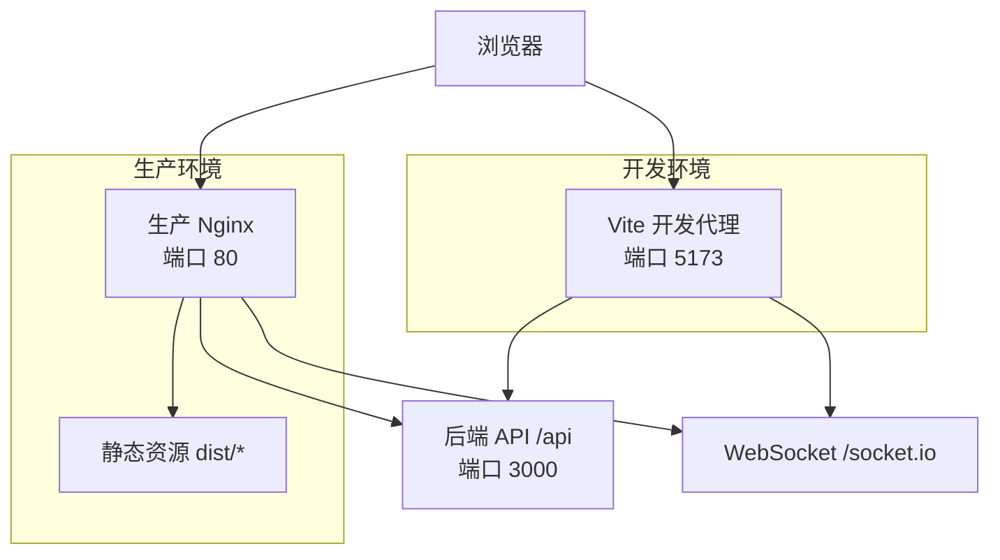
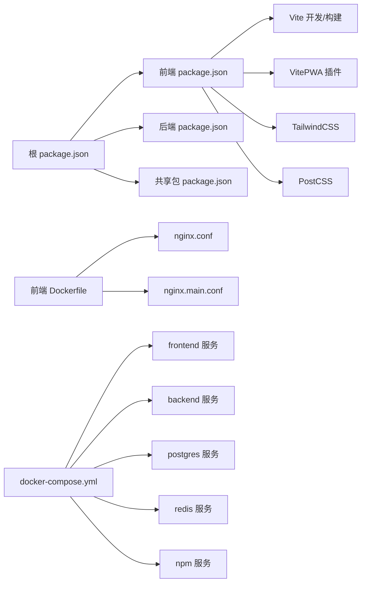

# 快速开始

<cite>
**本文引用的文件**   
- [apps/frontend/package.json](file://apps/frontend/package.json)
- [apps/frontend/vite.config.mts](file://apps/frontend/vite.config.mts)
- [apps/frontend/capacitor.config.ts](file://apps/frontend/capacitor.config.ts)
- [apps/frontend/Dockerfile](file://apps/frontend/Dockerfile)
- [apps/frontend/nginx.conf](file://apps/frontend/nginx.conf)
- [apps/frontend/nginx.main.conf](file://apps/frontend/nginx.main.conf)
- [apps/frontend/pwa-assets.config.ts](file://apps/frontend/pwa-assets.config.ts)
- [apps/frontend/tailwind.config.js](file://apps/frontend/tailwind.config.js)
- [apps/frontend/postcss.config.js](file://apps/frontend/postcss.config.js)
- [apps/frontend/tsconfig.json](file://apps/frontend/tsconfig.json)
- [apps/frontend/index.html](file://apps/frontend/index.html)
- [apps/frontend/public/health.html](file://apps/frontend/public/health.html)
- [package.json](file://package.json)
- [docker-compose.yml](file://docker-compose.yml)
- [docker-compose.dev.yml](file://docker-compose.dev.yml)
</cite>

## 目录
1. [简介](#简介)
2. [项目结构](#项目结构)
3. [核心组件](#核心组件)
4. [架构总览](#架构总览)
5. [详细组件解析](#详细组件解析)
6. [依赖关系分析](#依赖关系分析)
7. [性能考量](#性能考量)
8. [故障排查指南](#故障排查指南)
9. [结论](#结论)
10. [附录](#附录)

## 简介
本指南面向首次接触 Lumina 前端系统的开发者，帮助你在最短时间内完成开发环境搭建、启动本地服务、理解热重载机制、掌握构建与部署流程，并覆盖 Docker 容器化与 PWA 能力。同时提供移动端调试与 Capacitor 配置说明，以及常见问题的排查建议。

## 项目结构
Lumina 采用多包工作区（pnpm workspace）组织，前端位于 apps/frontend，后端位于 apps/backend，共享包在 packages/shared。根目录提供统一的 monorepo 脚本与 Docker 编排。

图表来源
- [package.json:1-133](file://package.json#L1-L133)
- [apps/frontend/package.json:1-104](file://apps/frontend/package.json#L1-L104)
- [apps/frontend/vite.config.mts:1-185](file://apps/frontend/vite.config.mts#L1-L185)
- [apps/frontend/capacitor.config.ts:1-23](file://apps/frontend/capacitor.config.ts#L1-L23)
- [apps/frontend/Dockerfile:1-94](file://apps/frontend/Dockerfile#L1-L94)
- [apps/frontend/nginx.conf:1-203](file://apps/frontend/nginx.conf#L1-L203)
- [apps/frontend/nginx.main.conf:1-51](file://apps/frontend/nginx.main.conf#L1-L51)
- [apps/frontend/pwa-assets.config.ts:1-7](file://apps/frontend/pwa-assets.config.ts#L1-L7)
- [apps/frontend/tailwind.config.js:1-303](file://apps/frontend/tailwind.config.js#L1-L303)
- [apps/frontend/postcss.config.js:1-8](file://apps/frontend/postcss.config.js#L1-L8)
- [apps/frontend/tsconfig.json:1-28](file://apps/frontend/tsconfig.json#L1-L28)
- [apps/frontend/index.html:1-39](file://apps/frontend/index.html#L1-L39)

章节来源
- [package.json:1-133](file://package.json#L1-L133)
- [apps/frontend/package.json:1-104](file://apps/frontend/package.json#L1-L104)

## 核心组件
- 包管理器与引擎要求
  - 使用 pnpm 作为包管理器，版本要求见根目录 package.json 的 engines 字段。
  - Node.js 版本要求：>= 20.19.0。
- 前端开发工具链
  - Vite 作为开发服务器与构建工具，内置 Gzip/Brotli 压缩与 PWA 插件。
  - TypeScript 与 Vue 3 生态，TailwindCSS 与 PostCSS。
- 移动端与桌面端
  - Capacitor 配置用于 iOS/Android 与桌面端集成。
  - Wails 构建脚本用于桌面原生应用打包。
- 容器化与反向代理
  - 前端镜像基于 Nginx 提供静态服务与 API/WS 代理。
  - Docker Compose 提供生产与开发双环境编排。

章节来源
- [package.json:26-30](file://package.json#L26-L30)
- [apps/frontend/package.json:1-104](file://apps/frontend/package.json#L1-L104)
- [apps/frontend/vite.config.mts:1-185](file://apps/frontend/vite.config.mts#L1-L185)
- [apps/frontend/capacitor.config.ts:1-23](file://apps/frontend/capacitor.config.ts#L1-L23)
- [apps/frontend/Dockerfile:1-94](file://apps/frontend/Dockerfile#L1-L94)
- [apps/frontend/nginx.conf:1-203](file://apps/frontend/nginx.conf#L1-L203)

## 架构总览
下图展示从浏览器到后端的请求路径，以及开发与生产的差异：

图表来源
- [apps/frontend/vite.config.mts:154-174](file://apps/frontend/vite.config.mts#L154-L174)
- [apps/frontend/nginx.conf:127-180](file://apps/frontend/nginx.conf#L127-L180)
- [docker-compose.yml:142-172](file://docker-compose.yml#L142-L172)

## 详细组件解析

### 开发环境搭建与启动
- 环境要求
  - Node.js >= 20.19.0
  - pnpm >= 9.15.0
- 依赖安装
  - 在仓库根目录执行安装，pnpm 会基于 pnpm-workspace.yaml 与锁定文件安装所有包。
- 启动命令
  - 一键启动：根目录脚本会同时启动共享包、后端与前端开发服务。
  - 分别启动：前端与后端分别进入对应目录执行 dev 脚本。
- 端口与代理
  - 前端开发服务器默认监听 5173，可通过环境变量 VITE_PROXY_TARGET 指向后端地址。
  - /api 与 /socket.io 通过 Vite 代理转发至后端，支持 WebSocket。

章节来源
- [package.json:26-30](file://package.json#L26-L30)
- [package.json:32-35](file://package.json#L32-L35)
- [apps/frontend/package.json:9-28](file://apps/frontend/package.json#L9-L28)
- [apps/frontend/vite.config.mts:154-174](file://apps/frontend/vite.config.mts#L154-L174)

### 热重载机制
- Vite 热重载
  - 前端开发服务器在 5173 端口监听，修改源码后自动刷新。
  - 代理配置确保 API 与 WebSocket 请求在开发阶段直连后端。
- 容器内热重载（开发编排）
  - docker-compose.dev.yml 将项目目录挂载到容器中，实现代码热更新。
  - 前端容器以 pnpm dev --host 0.0.0.0 运行，便于宿主机访问。

章节来源
- [apps/frontend/vite.config.mts:154-174](file://apps/frontend/vite.config.mts#L154-L174)
- [docker-compose.dev.yml:147-180](file://docker-compose.dev.yml#L147-L180)

### 构建流程与生产部署
- 构建命令
  - 前端构建：pnpm build 生成 dist 目录。
  - Wails 桌面构建：通过 build:wails 脚本将构建产物复制到 apps/wails/frontend/dist。
- 生产镜像
  - apps/frontend/Dockerfile 使用两阶段构建：先安装依赖与构建，再将 dist 复制到 Nginx 镜像。
  - Nginx 配置位于 apps/frontend/nginx.conf 与 nginx.main.conf，提供静态服务、缓存、CSP、健康检查等。
- 部署方式
  - docker-compose.yml 提供生产编排，包含数据库、缓存、后端、前端与 Nginx Proxy Manager。
  - 前端服务健康检查通过 /health 端点验证。

章节来源
- [apps/frontend/package.json:13-28](file://apps/frontend/package.json#L13-L28)
- [apps/frontend/Dockerfile:1-94](file://apps/frontend/Dockerfile#L1-L94)
- [apps/frontend/nginx.conf:1-203](file://apps/frontend/nginx.conf#L1-L203)
- [apps/frontend/nginx.main.conf:1-51](file://apps/frontend/nginx.main.conf#L1-L51)
- [docker-compose.yml:142-172](file://docker-compose.yml#L142-L172)

### PWA 功能启用
- PWA 插件
  - VitePWA 已在 vite.config.mts 中启用，支持自动更新与清单配置。
- 图标生成
  - pwa-assets.config.ts 使用最小化预设生成多尺寸图标，配合 VitePWA 的 includeAssets。
- 开发模式
  - 通过 VITE_PWA_DEV=true 可在开发时启用 PWA 开发模式。

章节来源
- [apps/frontend/vite.config.mts:104-146](file://apps/frontend/vite.config.mts#L104-L146)
- [apps/frontend/pwa-assets.config.ts:1-7](file://apps/frontend/pwa-assets.config.ts#L1-L7)
- [apps/frontend/package.json:27-27](file://apps/frontend/package.json#L27-L27)

### 移动端调试与 Capacitor 配置
- Capacitor 配置
  - 应用 ID、名称、Web 目录与开发服务器配置在 capacitor.config.ts 中。
  - 开发时可启用热重载（需将 server.url 指向本机 IP）。
- 命令
  - 同步、打开、运行 iOS/Android 的 Capacitor 命令已在前端 package.json 中定义。
- 调试要点
  - iOS/Android 设备需允许明文流量（cleartext: true），并正确配置 androidScheme。
  - 如需热重载，确保设备与开发机在同一网络，并设置正确的 server.url。

章节来源
- [apps/frontend/capacitor.config.ts:1-23](file://apps/frontend/capacitor.config.ts#L1-L23)
- [apps/frontend/package.json:21-26](file://apps/frontend/package.json#L21-L26)

### 样式与构建管线
- TailwindCSS
  - tailwind.config.js 定义了深浅色主题、响应式断点、字体、阴影、动画等。
- PostCSS
  - postcss.config.js 集成 postcss-import、tailwindcss、autoprefixer。
- TypeScript
  - tsconfig.json 统一路径别名与模块解析策略，确保 Vite/Vitest/PWA 等工具链协同。

章节来源
- [apps/frontend/tailwind.config.js:1-303](file://apps/frontend/tailwind.config.js#L1-L303)
- [apps/frontend/postcss.config.js:1-8](file://apps/frontend/postcss.config.js#L1-L8)
- [apps/frontend/tsconfig.json:1-28](file://apps/frontend/tsconfig.json#L1-L28)

### 入口与模板
- index.html
  - 设置视口、主题色、预连接 CDN、PWA 图标与初始标题逻辑。
- 健康页
  - public/health.html 用于 Nginx 健康检查返回。

章节来源
- [apps/frontend/index.html:1-39](file://apps/frontend/index.html#L1-L39)
- [apps/frontend/public/health.html:1-11](file://apps/frontend/public/health.html#L1-L11)

## 依赖关系分析

图表来源
- [package.json:1-133](file://package.json#L1-L133)
- [apps/frontend/package.json:1-104](file://apps/frontend/package.json#L1-L104)
- [apps/frontend/vite.config.mts:1-185](file://apps/frontend/vite.config.mts#L1-L185)
- [apps/frontend/Dockerfile:1-94](file://apps/frontend/Dockerfile#L1-L94)
- [apps/frontend/nginx.conf:1-203](file://apps/frontend/nginx.conf#L1-L203)
- [apps/frontend/nginx.main.conf:1-51](file://apps/frontend/nginx.main.conf#L1-L51)
- [docker-compose.yml:1-237](file://docker-compose.yml#L1-L237)

章节来源
- [package.json:1-133](file://package.json#L1-L133)
- [apps/frontend/package.json:1-104](file://apps/frontend/package.json#L1-L104)
- [apps/frontend/vite.config.mts:1-185](file://apps/frontend/vite.config.mts#L1-L185)
- [apps/frontend/Dockerfile:1-94](file://apps/frontend/Dockerfile#L1-L94)
- [apps/frontend/nginx.conf:1-203](file://apps/frontend/nginx.conf#L1-L203)
- [apps/frontend/nginx.main.conf:1-51](file://apps/frontend/nginx.main.conf#L1-L51)
- [docker-compose.yml:1-237](file://docker-compose.yml#L1-L237)

## 性能考量
- 构建优化
  - VitePWA 自动更新与静态资源缓存策略，减少首屏加载时间。
  - Gzip/Brotli 压缩提升传输效率。
  - Rollup manualChunks 按库拆分 vendor 包，提升缓存命中率。
- Nginx 优化
  - gzip_static 优先使用预压缩文件，开启 sendfile 与 tcp_nodelay。
  - 静态资源长期缓存与禁止访问敏感文件。
- WebSocket 实时通信
  - Nginx 禁用代理缓冲，延长超时时间，确保长连接稳定。

章节来源
- [apps/frontend/vite.config.mts:88-103](file://apps/frontend/vite.config.mts#L88-L103)
- [apps/frontend/vite.config.mts:175-182](file://apps/frontend/vite.config.mts#L175-L182)
- [apps/frontend/nginx.conf:11-71](file://apps/frontend/nginx.conf#L11-L71)
- [apps/frontend/nginx.conf:169-177](file://apps/frontend/nginx.conf#L169-L177)

## 故障排查指南
- 端口冲突
  - 前端开发端口：5173；后端默认 3000；Nginx 80；Redis 6379；PostgreSQL 5432。
  - 若冲突，请在 docker-compose 或本地启动时调整映射端口。
- 依赖版本兼容性
  - 严格遵循根目录 engines 字段的 Node.js 与 pnpm 版本要求。
  - 如遇依赖冲突，检查 pnpm overrides 与锁定文件，必要时清理缓存后重装。
- 跨平台编译问题
  - 使用 Docker 镜像中的固定 Node.js 与 pnpm 版本，避免宿主机差异导致的编译失败。
- 热重载不生效
  - 确认 Vite 代理目标 VITE_PROXY_TARGET 是否正确指向后端容器地址。
  - 容器内开发模式需将 Vite 绑定到 0.0.0.0，并确保网络互通。
- PWA 未生效
  - 开发模式下启用 VITE_PWA_DEV=true；生产模式下确保 PWA 插件与图标生成配置正确。
- 移动端调试
  - iOS/Android 需允许明文流量，且 server.url 指向本机 IP。
  - 如无法热重载，检查设备与开发机网络与防火墙设置。

章节来源
- [package.json:26-30](file://package.json#L26-L30)
- [apps/frontend/vite.config.mts:154-174](file://apps/frontend/vite.config.mts#L154-L174)
- [docker-compose.dev.yml:152-180](file://docker-compose.dev.yml#L152-L180)
- [apps/frontend/capacitor.config.ts:7-12](file://apps/frontend/capacitor.config.ts#L7-L12)
- [apps/frontend/package.json:27-27](file://apps/frontend/package.json#L27-L27)

## 结论
通过本指南，你可以在本地快速搭建 Lumina 前端开发环境，理解热重载与代理机制，掌握构建与容器化部署流程，并启用 PWA 与移动端调试能力。遇到问题时，可依据“故障排查指南”逐项定位与修复。

## 附录
- 常用命令速查
  - 安装依赖：在根目录执行 pnpm install
  - 启动开发：pnpm dev 或 pnpm dev:frontend
  - 构建生产：pnpm build
  - 容器化部署：docker compose up -d
  - 移动端调试：cap sync / cap run ios / cap run android
  - PWA 图标生成：pnpm pwa:generate-icons
  - Wails 桌面构建：pnpm build:wails

章节来源
- [package.json:32-75](file://package.json#L32-L75)
- [apps/frontend/package.json:9-28](file://apps/frontend/package.json#L9-L28)
- [apps/frontend/package.json:21-28](file://apps/frontend/package.json#L21-L28)
- [apps/frontend/package.json:27-27](file://apps/frontend/package.json#L27-L27)