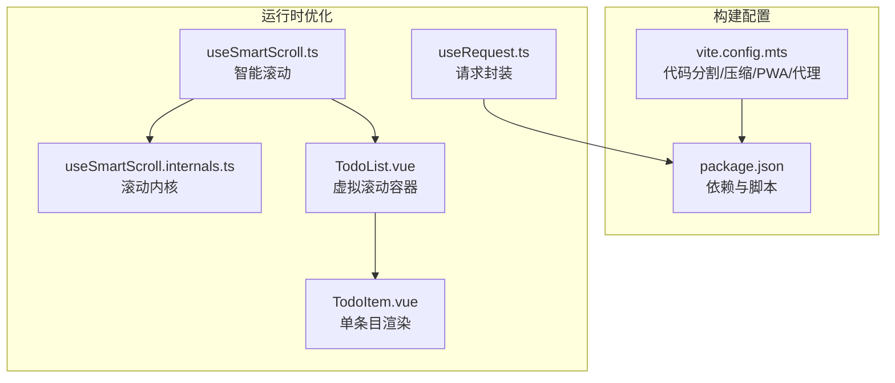
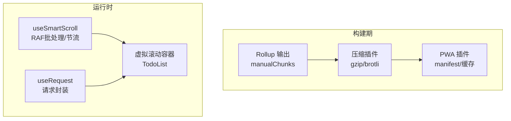
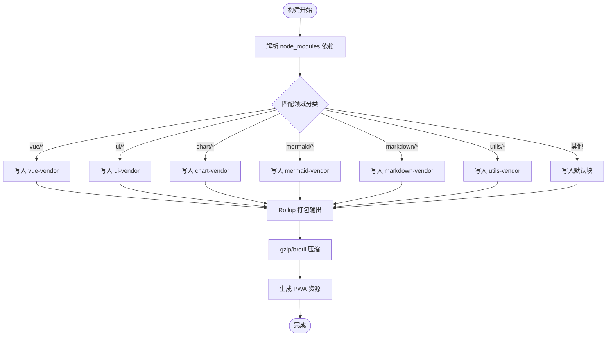
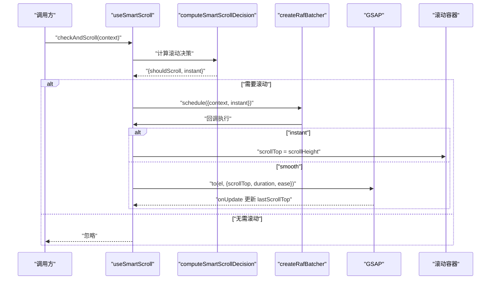
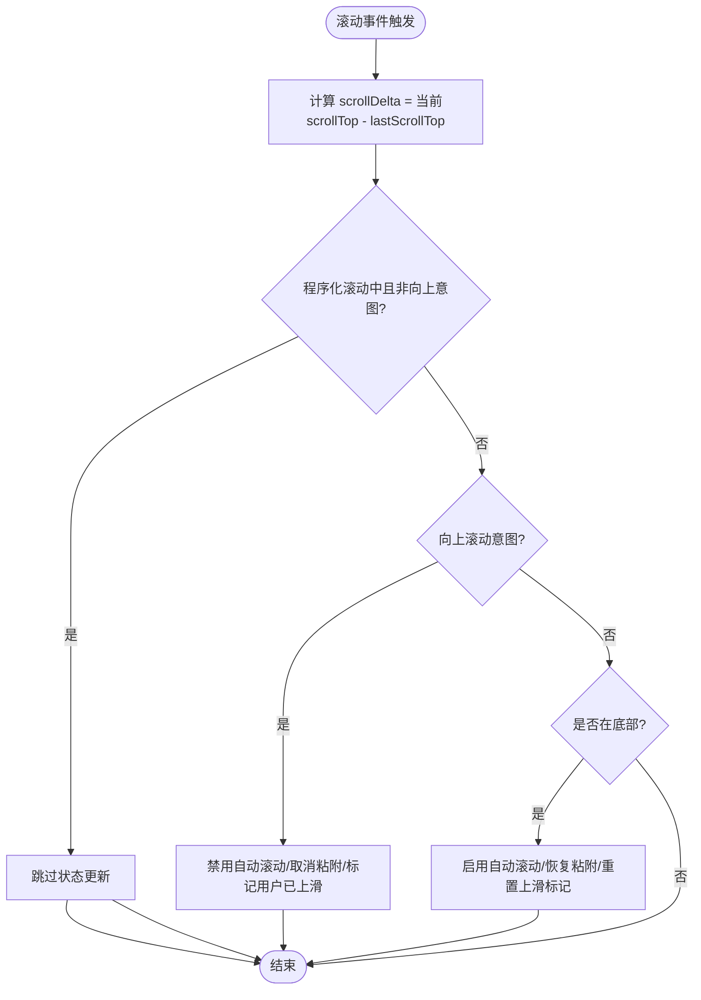
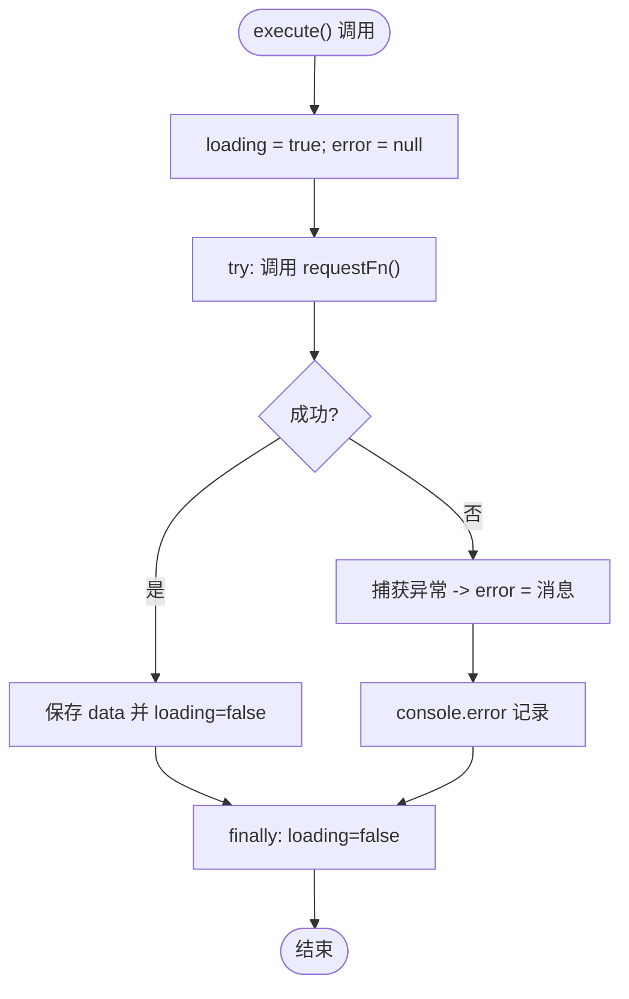
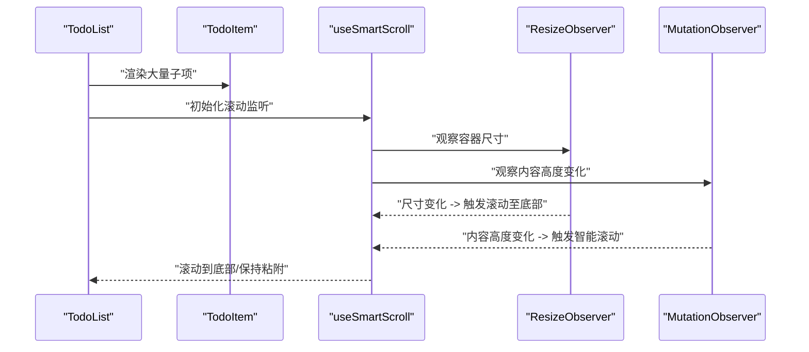
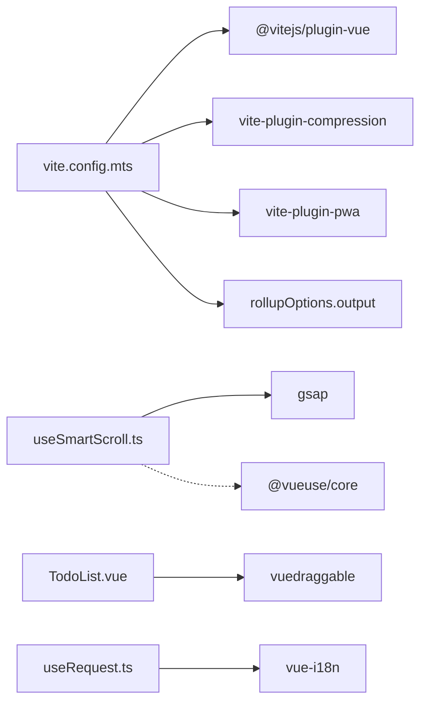

# 性能优化

<cite>
**本文引用的文件**
- [vite.config.mts](file://apps/frontend/vite.config.mts)
- [package.json](file://apps/frontend/package.json)
- [useSmartScroll.ts](file://apps/frontend/src/composables/useSmartScroll.ts)
- [useSmartScroll.internals.ts](file://apps/frontend/src/composables/useSmartScroll.internals.ts)
- [useRequest.ts](file://apps/frontend/src/composables/useRequest.ts)
- [TodoList.vue](file://apps/frontend/src/features/todo/components/TodoList.vue)
- [TodoItem.vue](file://apps/frontend/src/features/todo/components/TodoItem.vue)
- [useSmartScroll.spec.ts](file://apps/frontend/tests/composables/useSmartScroll.spec.ts)
</cite>

## 目录
1. [简介](#简介)
2. [项目结构](#项目结构)
3. [核心组件](#核心组件)
4. [架构总览](#架构总览)
5. [详细组件分析](#详细组件分析)
6. [依赖关系分析](#依赖关系分析)
7. [性能考量](#性能考量)
8. [故障排查指南](#故障排查指南)
9. [结论](#结论)
10. [附录](#附录)

## 简介
本技术文档聚焦前端性能优化，围绕以下主题展开：
- 构建期优化：Vite 代码分割策略、懒加载、Tree Shaking、压缩与 PWA
- 运行时优化：虚拟滚动、组件懒加载、图片懒加载、内存管理
- 智能滚动系统：useSmartScroll 组合式函数、滚动性能优化、视口检测、动画流畅度
- 数据获取优化：请求封装、并发控制、错误重试与缓存策略
- 性能监控与评估：指标采集、瓶颈识别、优化效果验证

## 项目结构
前端位于 apps/frontend，采用 Vite + Vue 3 技术栈，结合 Pinia、Vue Router、TailwindCSS、GSAP 等生态库。构建配置通过 vite.config.mts 完成，性能优化点主要集中在打包分包、压缩、PWA 缓存与运行时滚动、请求与组件渲染优化。

图表来源
- [vite.config.mts:80-185](file://apps/frontend/vite.config.mts#L80-L185)
- [package.json:1-104](file://apps/frontend/package.json#L1-L104)
- [useSmartScroll.ts:33-442](file://apps/frontend/src/composables/useSmartScroll.ts#L33-L442)
- [useSmartScroll.internals.ts:1-109](file://apps/frontend/src/composables/useSmartScroll.internals.ts#L1-L109)
- [useRequest.ts:1-45](file://apps/frontend/src/composables/useRequest.ts#L1-L45)
- [TodoList.vue:1-190](file://apps/frontend/src/features/todo/components/TodoList.vue#L1-L190)
- [TodoItem.vue:1-406](file://apps/frontend/src/features/todo/components/TodoItem.vue#L1-L406)

章节来源
- [vite.config.mts:1-185](file://apps/frontend/vite.config.mts#L1-L185)
- [package.json:1-104](file://apps/frontend/package.json#L1-L104)

## 核心组件
- Vite 构建配置：基于模块 ID 的手动分包策略，按功能域拆分 vendor 包；开启 gzip/brotli 压缩与 PWA；开发代理与权限头配置。
- useSmartScroll：提供智能滚动、流式更新、程序化滚动、RAF 批处理与节流、Resize/Mutation 观察器集成。
- useRequest：统一请求状态封装，简化加载/错误处理。
- TodoList/TodoItem：列表容器与单条目渲染，配合虚拟滚动与组件懒加载策略。

章节来源
- [vite.config.mts:23-78](file://apps/frontend/vite.config.mts#L23-L78)
- [vite.config.mts:175-182](file://apps/frontend/vite.config.mts#L175-L182)
- [useSmartScroll.ts:33-442](file://apps/frontend/src/composables/useSmartScroll.ts#L33-L442)
- [useSmartScroll.internals.ts:28-64](file://apps/frontend/src/composables/useSmartScroll.internals.ts#L28-L64)
- [useRequest.ts:17-44](file://apps/frontend/src/composables/useRequest.ts#L17-L44)
- [TodoList.vue:124-162](file://apps/frontend/src/features/todo/components/TodoList.vue#L124-L162)
- [TodoItem.vue:134-178](file://apps/frontend/src/features/todo/components/TodoItem.vue#L134-L178)

## 架构总览
前端性能优化贯穿“构建期”和“运行时”两条主线：
- 构建期：通过 Rollup manualChunks 将第三方库按领域拆分为独立 chunk，减少重复依赖；开启多算法压缩提升传输体积；PWA 提升缓存命中与离线体验。
- 运行时：useSmartScroll 以 RAF 批处理与节流降低滚动事件开销；TodoList 作为虚拟滚动容器承载大量 TodoItem；useRequest 统一错误与加载状态，避免重复请求与闪烁。

图表来源
- [vite.config.mts:175-182](file://apps/frontend/vite.config.mts#L175-L182)
- [vite.config.mts:88-103](file://apps/frontend/vite.config.mts#L88-L103)
- [vite.config.mts:104-146](file://apps/frontend/vite.config.mts#L104-L146)
- [useSmartScroll.ts:164-195](file://apps/frontend/src/composables/useSmartScroll.ts#L164-L195)
- [TodoList.vue:124-162](file://apps/frontend/src/features/todo/components/TodoList.vue#L124-L162)
- [useRequest.ts:24-36](file://apps/frontend/src/composables/useRequest.ts#L24-L36)

## 详细组件分析

### Vite 构建配置优化
- 代码分割策略
  - 基于模块 ID 的 manualChunks 函数将依赖归类到 vue-vendor、ui-vendor、chart-vendor、mermaid-vendor、markdown-vendor、utils-vendor 等领域块，降低重复打包与缓存失效范围。
  - 通过 Rollup output.manualChunks 应用该策略。
- Tree Shaking
  - 项目使用 ES Module 与现代打包链，配合按需引入与未使用导出移除，实现 Tree Shaking。
- 压缩与传输优化
  - 同时启用 gzip 与 brotli 压缩，提升网络传输效率。
- PWA 与缓存
  - 自动注册更新、生成 manifest 与图标资源，提升首屏与离线体验。
- 开发代理与安全头
  - 配置代理与权限策略头，保障开发与跨域场景稳定。

图表来源
- [vite.config.mts:23-78](file://apps/frontend/vite.config.mts#L23-L78)
- [vite.config.mts:175-182](file://apps/frontend/vite.config.mts#L175-L182)
- [vite.config.mts:88-103](file://apps/frontend/vite.config.mts#L88-L103)
- [vite.config.mts:104-146](file://apps/frontend/vite.config.mts#L104-L146)

章节来源
- [vite.config.mts:23-78](file://apps/frontend/vite.config.mts#L23-L78)
- [vite.config.mts:88-103](file://apps/frontend/vite.config.mts#L88-L103)
- [vite.config.mts:104-146](file://apps/frontend/vite.config.mts#L104-L146)
- [vite.config.mts:175-182](file://apps/frontend/vite.config.mts#L175-L182)

### 智能滚动系统 useSmartScroll
- 设计目标
  - 在消息流式更新、内容变更、窗口尺寸变化时，智能判断是否滚动到底部，保证用户体验与性能平衡。
- 关键机制
  - 视口检测：根据 scrollTop、scrollHeight、clientHeight 计算是否接近底部，支持阈值。
  - 程序化滚动：支持 instant/smooth 两种行为，smooth 使用 GSAP 动画，缩短动画时间并覆盖重叠动画。
  - 批处理与节流：使用 RAF batcher 合并高频滚动请求；使用 RAF throttle 限制滚动事件处理频率。
  - 观察器：ResizeObserver 监听容器尺寸变化；MutationObserver 监听内容高度变化。
  - 用户意图识别：当检测到用户向上滚动意图时，暂停自动滚动并允许用户查看历史消息。
- 参数与行为
  - 支持初始粘附底部、自动滚动开关、滚动行为选择、流式更新瞬时滚动、用户滚动灵敏度、是否监听尺寸变化等。
  - 提供 setStreamingMode、enableAutoScroll、disableAutoScroll 等控制方法。

图表来源
- [useSmartScroll.ts:182-195](file://apps/frontend/src/composables/useSmartScroll.ts#L182-L195)
- [useSmartScroll.internals.ts:28-64](file://apps/frontend/src/composables/useSmartScroll.internals.ts#L28-L64)
- [useSmartScroll.ts:164-177](file://apps/frontend/src/composables/useSmartScroll.ts#L164-L177)
- [useSmartScroll.ts:114-142](file://apps/frontend/src/composables/useSmartScroll.ts#L114-L142)

图表来源
- [useSmartScroll.ts:209-240](file://apps/frontend/src/composables/useSmartScroll.ts#L209-L240)

章节来源
- [useSmartScroll.ts:33-442](file://apps/frontend/src/composables/useSmartScroll.ts#L33-L442)
- [useSmartScroll.internals.ts:1-109](file://apps/frontend/src/composables/useSmartScroll.internals.ts#L1-L109)
- [useSmartScroll.spec.ts:1-281](file://apps/frontend/tests/composables/useSmartScroll.spec.ts#L1-L281)

### 数据获取优化：useRequest
- 统一加载/错误状态管理，避免重复请求与闪烁。
- 错误国际化提示与日志记录，便于问题定位。
- 可扩展为与缓存/重试策略结合（当前为基础封装）。

图表来源
- [useRequest.ts:24-36](file://apps/frontend/src/composables/useRequest.ts#L24-L36)

章节来源
- [useRequest.ts:1-45](file://apps/frontend/src/composables/useRequest.ts#L1-L45)

### 运行时性能优化：虚拟滚动与组件懒加载
- 虚拟滚动容器
  - TodoList 作为滚动容器，内部通过 draggable 和子组件 TodoItem 渲染大量条目。
  - 结合 useSmartScroll 的智能滚动，仅在必要时滚动到底部，避免全量重排。
- 组件懒加载
  - 子组件按需导入，减少首屏 JS 体积与初次渲染压力。
- 图片懒加载
  - 建议对富文本或聊天中的图片采用懒加载策略，减少首屏带宽与内存占用。
- 内存管理
  - useSmartScroll 在卸载时清理事件监听、GSAP 动画、观察器与定时器，避免内存泄漏。
  - TodoItem 中的动画与过渡可根据系统偏好减少动画（prefers-reduced-motion）。

图表来源
- [TodoList.vue:124-162](file://apps/frontend/src/features/todo/components/TodoList.vue#L124-L162)
- [TodoItem.vue:331-349](file://apps/frontend/src/features/todo/components/TodoItem.vue#L331-L349)
- [useSmartScroll.ts:304-342](file://apps/frontend/src/composables/useSmartScroll.ts#L304-L342)

章节来源
- [TodoList.vue:1-190](file://apps/frontend/src/features/todo/components/TodoList.vue#L1-L190)
- [TodoItem.vue:1-406](file://apps/frontend/src/features/todo/components/TodoItem.vue#L1-L406)
- [useSmartScroll.ts:304-342](file://apps/frontend/src/composables/useSmartScroll.ts#L304-L342)

## 依赖关系分析
- 构建期依赖
  - @vitejs/plugin-vue、vite-plugin-compression、vite-plugin-pwa、rollupOptions.output.manualChunks
- 运行时依赖
  - GSAP 用于平滑滚动动画；vuedraggable 用于拖拽排序；vue-i18n 用于错误提示国际化；@vueuse/core 用于窗口尺寸等工具。

图表来源
- [vite.config.mts:86-146](file://apps/frontend/vite.config.mts#L86-L146)
- [package.json:30-69](file://apps/frontend/package.json#L30-L69)
- [useSmartScroll.ts:1-12](file://apps/frontend/src/composables/useSmartScroll.ts#L1-L12)

章节来源
- [package.json:30-69](file://apps/frontend/package.json#L30-L69)
- [vite.config.mts:86-146](file://apps/frontend/vite.config.mts#L86-L146)

## 性能考量
- 构建期
  - 分包粒度：确保常用库独立分包，避免热更新影响面过大；定期评估分包命中率与缓存策略。
  - 压缩策略：对比 gzip/brotli 对不同资源类型的效果，按需调整阈值与算法。
  - PWA：关注缓存策略与更新时机，避免旧版本资源阻塞新功能。
- 运行时
  - 滚动性能：使用 RAF 批处理与节流，避免每帧多次 DOM 查询；平滑滚动使用 GSAP 并限制动画时长。
  - 虚拟滚动：在 TodoList 中仅渲染可见区域子项，结合智能滚动减少重排。
  - 请求优化：结合 useRequest 与缓存策略（建议引入缓存/去重/重试），避免重复请求与闪烁。
  - 内存管理：及时清理事件监听、观察器与动画，确保组件销毁时无残留。

## 故障排查指南
- 滚动异常
  - 症状：滚动卡顿、无法自动回到底部、用户上滑后无法恢复自动滚动。
  - 排查：确认 passive: true 的滚动监听是否生效；检查 isProgrammaticScroll 标记与定时器清理；验证 ResizeObserver/MutationObserver 是否正确断开。
- 构建体积异常
  - 症状：chunk 过大、缓存命中率低。
  - 排查：检查 manualChunks 分类是否合理；确认未将小体积依赖打入 vendor；验证压缩插件是否启用。
- 请求失败
  - 症状：加载状态不消失、错误提示不一致。
  - 排查：检查 useRequest 的错误赋值与国际化文案；确认代理配置与后端响应。

章节来源
- [useSmartScroll.ts:347-370](file://apps/frontend/src/composables/useSmartScroll.ts#L347-L370)
- [vite.config.mts:88-103](file://apps/frontend/vite.config.mts#L88-L103)
- [useRequest.ts:24-36](file://apps/frontend/src/composables/useRequest.ts#L24-L36)

## 结论
通过合理的构建分包与压缩策略、运行时的智能滚动与虚拟滚动、以及统一的请求封装，项目在加载速度、交互流畅度与可维护性方面得到显著提升。后续可在数据层引入缓存/去重/重试策略，并完善性能监控与指标评估体系，持续迭代优化。

## 附录
- 相关文件路径与用途
  - vite.config.mts：构建配置与分包策略
  - package.json：依赖与脚本
  - useSmartScroll.ts / useSmartScroll.internals.ts：智能滚动核心
  - useRequest.ts：请求封装
  - TodoList.vue / TodoItem.vue：虚拟滚动与渲染