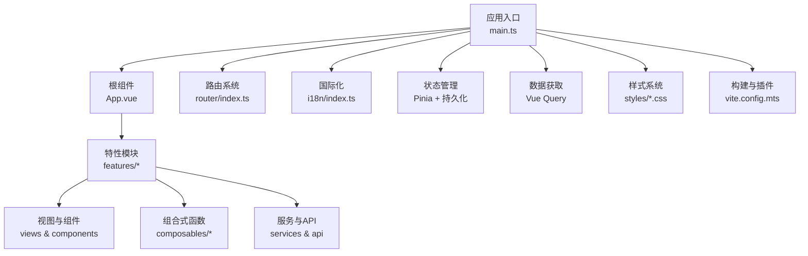
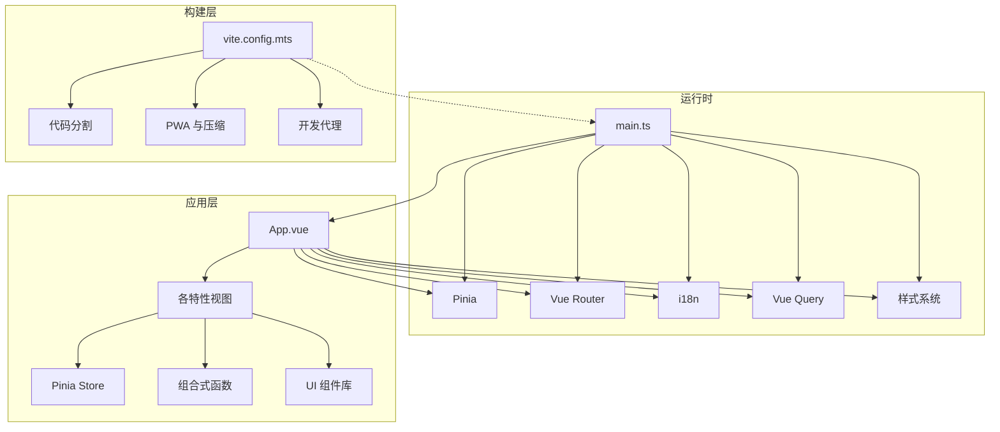
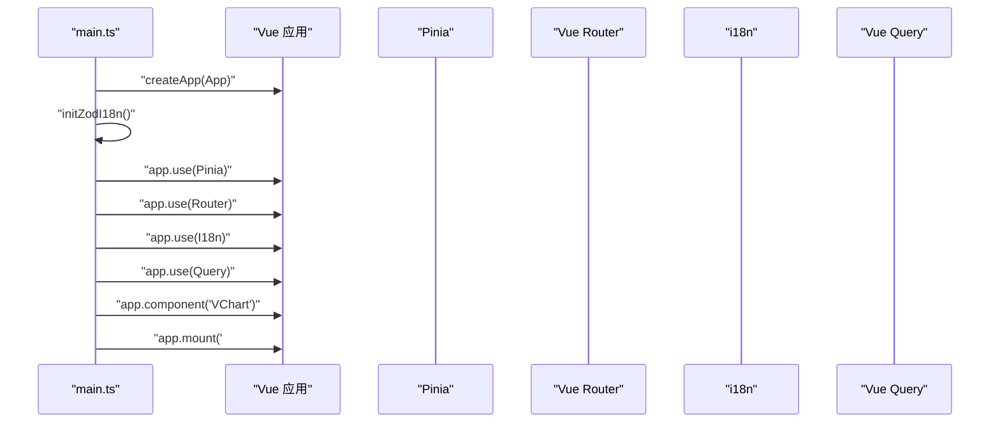
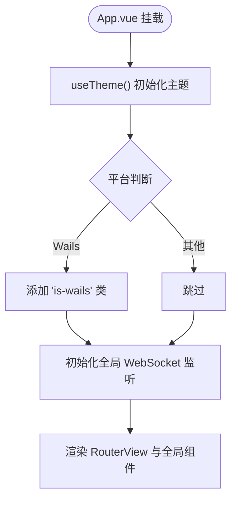
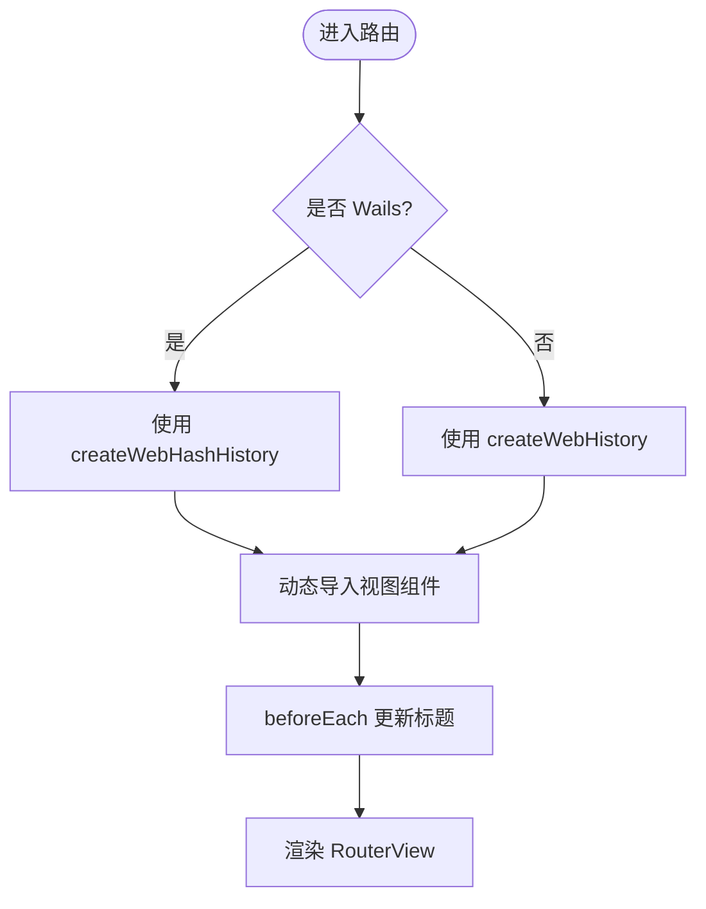
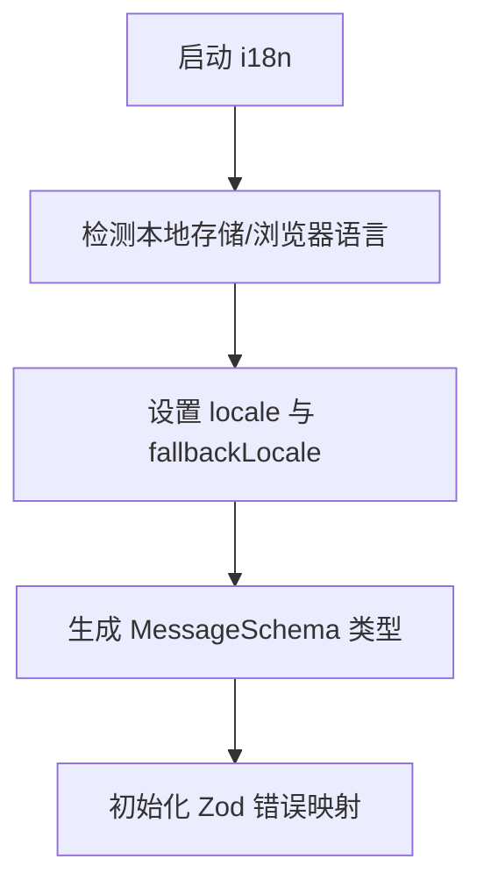
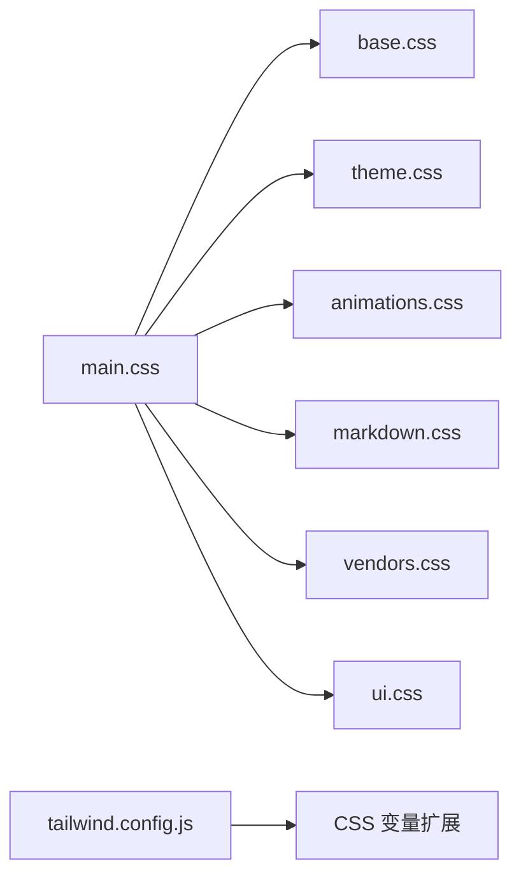
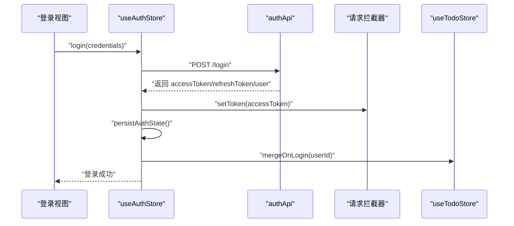
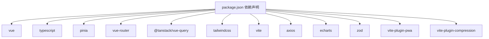

# 架构概览

<cite>
**本文引用的文件**
- [apps/frontend/src/main.ts](file://apps/frontend/src/main.ts)
- [apps/frontend/src/App.vue](file://apps/frontend/src/App.vue)
- [apps/frontend/src/router/index.ts](file://apps/frontend/src/router/index.ts)
- [apps/frontend/vite.config.mts](file://apps/frontend/vite.config.mts)
- [apps/frontend/package.json](file://apps/frontend/package.json)
- [apps/frontend/src/i18n/index.ts](file://apps/frontend/src/i18n/index.ts)
- [apps/frontend/src/styles/main.css](file://apps/frontend/src/styles/main.css)
- [apps/frontend/tailwind.config.js](file://apps/frontend/tailwind.config.js)
- [apps/frontend/tsconfig.json](file://apps/frontend/tsconfig.json)
- [apps/frontend/src/composables/useTheme.ts](file://apps/frontend/src/composables/useTheme.ts)
- [apps/frontend/src/features/auth/stores/auth.ts](file://apps/frontend/src/features/auth/stores/auth.ts)
- [apps/frontend/src/lib/zod-i18n.ts](file://apps/frontend/src/lib/zod-i18n.ts)
- [apps/frontend/src/services/native.ts](file://apps/frontend/src/services/native.ts)
</cite>

## 目录
1. [引言](#引言)
2. [项目结构](#项目结构)
3. [核心组件](#核心组件)
4. [架构总览](#架构总览)
5. [详细组件分析](#详细组件分析)
6. [依赖关系分析](#依赖关系分析)
7. [性能考量](#性能考量)
8. [故障排查指南](#故障排查指南)
9. [结论](#结论)
10. [附录](#附录)

## 引言
本文件面向Lumina前端系统，聚焦Vue 3 + TypeScript单页应用的架构设计与实现要点。文档围绕应用入口点、根组件结构、路由系统、国际化、样式体系、组件库设计原则展开，并结合状态管理、数据获取、插件注册、全局配置、性能优化与缓存策略进行系统化说明，帮助开发者快速理解并高效迭代。

## 项目结构
前端工程位于apps/frontend目录，采用模块化分层组织：
- 应用入口与根组件：main.ts、App.vue
- 路由系统：router/index.ts
- 国际化：i18n/index.ts及多语言资源
- 样式系统：styles目录与Tailwind配置
- 状态管理：Pinia Store（认证等）
- 数据获取：Vue Query客户端缓存与并发控制
- 插件与工具：Vite配置、PWA、压缩、代理
- 原生桥接：native服务抽象不同运行环境（Wails/Capacitor/Web）

图表来源
- [apps/frontend/src/main.ts:54-137](file://apps/frontend/src/main.ts#L54-L137)
- [apps/frontend/src/App.vue:1-63](file://apps/frontend/src/App.vue#L1-L63)
- [apps/frontend/src/router/index.ts:7-54](file://apps/frontend/src/router/index.ts#L7-L54)
- [apps/frontend/src/i18n/index.ts:24-34](file://apps/frontend/src/i18n/index.ts#L24-L34)
- [apps/frontend/src/styles/main.css:1-7](file://apps/frontend/src/styles/main.css#L1-L7)
- [apps/frontend/vite.config.mts:80-184](file://apps/frontend/vite.config.mts#L80-L184)

章节来源
- [apps/frontend/src/main.ts:10-31](file://apps/frontend/src/main.ts#L10-L31)
- [apps/frontend/src/App.vue:30-63](file://apps/frontend/src/App.vue#L30-L63)
- [apps/frontend/src/router/index.ts:1-73](file://apps/frontend/src/router/index.ts#L1-L73)
- [apps/frontend/src/i18n/index.ts:12-34](file://apps/frontend/src/i18n/index.ts#L12-L34)
- [apps/frontend/src/styles/main.css:1-7](file://apps/frontend/src/styles/main.css#L1-L7)
- [apps/frontend/vite.config.mts:15-21](file://apps/frontend/vite.config.mts#L15-L21)

## 核心组件
- 应用入口与初始化：创建Vue实例、注册Pinia/Vue Router/I18n/Vue Query、全局组件注册、错误处理与持久化配置
- 根组件：提供顶层布局、主题初始化、全局提示与AI迁移对话框、原生平台适配
- 路由系统：按功能模块拆分异步加载、路由守卫更新页面标题、历史模式与哈希模式切换
- 国际化：基于vue-i18n，支持本地存储与浏览器语言回退，类型安全的消息键
- 样式系统：主入口聚合基础、主题、动画、Markdown、第三方、UI样式；Tailwind扩展颜色、字体、阴影、动画
- 状态管理：Pinia + 持久化插件，认证状态持久化与跨页面恢复
- 数据获取：Vue Query客户端缓存、过期时间与重试策略
- 构建与插件：Vite配置、PWA、Gzip/Brotli压缩、代码分割策略、开发代理

章节来源
- [apps/frontend/src/main.ts:54-137](file://apps/frontend/src/main.ts#L54-L137)
- [apps/frontend/src/App.vue:11-27](file://apps/frontend/src/App.vue#L11-L27)
- [apps/frontend/src/router/index.ts:7-70](file://apps/frontend/src/router/index.ts#L7-L70)
- [apps/frontend/src/i18n/index.ts:24-34](file://apps/frontend/src/i18n/index.ts#L24-L34)
- [apps/frontend/src/styles/main.css:1-7](file://apps/frontend/src/styles/main.css#L1-L7)
- [apps/frontend/tailwind.config.js:32-286](file://apps/frontend/tailwind.config.js#L32-L286)
- [apps/frontend/src/features/auth/stores/auth.ts:383-390](file://apps/frontend/src/features/auth/stores/auth.ts#L383-L390)
- [apps/frontend/src/lib/zod-i18n.ts:92-95](file://apps/frontend/src/lib/zod-i18n.ts#L92-L95)

## 架构总览
Lumina前端采用“入口装配 + 功能域划分”的架构风格：
- 入口装配：集中初始化与插件注册，统一错误处理与全局配置
- 功能域划分：按特性模块组织（todo、auth、ai、mcp），每个模块自包含视图、组件、store、api、composables
- 技术栈协同：Vue 3 Composition API + TypeScript提供类型安全与组合式逻辑；Pinia负责状态；Vue Router提供路由与导航；Vue Query负责数据获取与缓存；Tailwind提供原子化样式；Vite提供构建与开发体验

图表来源
- [apps/frontend/src/main.ts:54-137](file://apps/frontend/src/main.ts#L54-L137)
- [apps/frontend/src/App.vue:1-63](file://apps/frontend/src/App.vue#L1-L63)
- [apps/frontend/vite.config.mts:80-184](file://apps/frontend/vite.config.mts#L80-L184)

## 详细组件分析

### 应用入口与初始化流程
- 创建Vue应用实例，注册Pinia（含持久化插件）、Vue Router、i18n、Vue Query
- 初始化Zod国际化映射，注册Markdown渲染所需样式
- 配置ECharts必要组件并全局注册VChart
- 安装全局错误处理器：捕获动态Chunk加载失败、忽略特定ResizeObserver良性错误
- 配置Vue Query默认缓存策略（staleTime、retry）
- 挂载应用

图表来源
- [apps/frontend/src/main.ts:29-37](file://apps/frontend/src/main.ts#L29-L37)
- [apps/frontend/src/main.ts:115-137](file://apps/frontend/src/main.ts#L115-L137)

章节来源
- [apps/frontend/src/main.ts:54-137](file://apps/frontend/src/main.ts#L54-L137)

### 根组件结构与平台适配
- 初始化主题（useTheme），支持明暗模式与主题色
- 根据原生平台（Wails/Capacitor/Web）添加类名与拖拽区域
- 通过RouterView承载路由视图
- 全局提供Toast与AI匿名迁移对话框
- 初始化WebSocket监听（仅在特定平台）

图表来源
- [apps/frontend/src/App.vue:11-27](file://apps/frontend/src/App.vue#L11-L27)

章节来源
- [apps/frontend/src/App.vue:11-27](file://apps/frontend/src/App.vue#L11-L27)

### 路由系统设计
- 基于history或hash模式（根据是否为Wails环境自动切换）
- 路由懒加载：按特性模块异步导入视图组件
- 路由守卫：读取meta.title，结合i18n动态设置document.title
- 路由覆盖：通配符路由指向404视图

图表来源
- [apps/frontend/src/router/index.ts:7-70](file://apps/frontend/src/router/index.ts#L7-L70)

章节来源
- [apps/frontend/src/router/index.ts:1-73](file://apps/frontend/src/router/index.ts#L1-L73)

### 国际化系统架构
- 基于vue-i18n，支持zh-CN/en-US双语
- 默认语言策略：本地存储优先，其次浏览器语言，最后回退到zh-CN
- 类型安全：通过DeepStringify生成消息键类型，避免硬编码字符串
- Zod表单校验国际化：自定义错误映射，支持字段名翻译与参数注入

图表来源
- [apps/frontend/src/i18n/index.ts:12-34](file://apps/frontend/src/i18n/index.ts#L12-L34)
- [apps/frontend/src/lib/zod-i18n.ts:92-95](file://apps/frontend/src/lib/zod-i18n.ts#L92-L95)

章节来源
- [apps/frontend/src/i18n/index.ts:12-34](file://apps/frontend/src/i18n/index.ts#L12-L34)
- [apps/frontend/src/lib/zod-i18n.ts:18-87](file://apps/frontend/src/lib/zod-i18n.ts#L18-L87)

### 样式系统组织与组件库设计原则
- 主入口样式聚合：base/theme/animations/markdown/vendors/ui
- Tailwind扩展：颜色系统（基于CSS变量）、字体、圆角、阴影、动画、尺寸与z-index
- 设计原则：以CSS变量为核心的主题系统，组件库遵循原子化与可组合原则，避免重复样式

图表来源
- [apps/frontend/src/styles/main.css:1-7](file://apps/frontend/src/styles/main.css#L1-L7)
- [apps/frontend/tailwind.config.js:32-286](file://apps/frontend/tailwind.config.js#L32-L286)

章节来源
- [apps/frontend/src/styles/main.css:1-7](file://apps/frontend/src/styles/main.css#L1-L7)
- [apps/frontend/tailwind.config.js:32-286](file://apps/frontend/tailwind.config.js#L32-L286)

### 状态管理与认证流程
- Pinia + 持久化：认证状态持久化到localStorage，支持跨页面恢复
- 认证流程：登录/注册成功后立即同步token到拦截器内存并持久化；登出时清理本地状态并通知后端
- 令牌刷新：带重试与瞬时错误处理，区分未授权与网络异常
- 与特性模块联动：登录后触发待办数据合并与AI匿名迁移

图表来源
- [apps/frontend/src/features/auth/stores/auth.ts:148-179](file://apps/frontend/src/features/auth/stores/auth.ts#L148-L179)
- [apps/frontend/src/features/auth/stores/auth.ts:383-390](file://apps/frontend/src/features/auth/stores/auth.ts#L383-L390)

章节来源
- [apps/frontend/src/features/auth/stores/auth.ts:23-390](file://apps/frontend/src/features/auth/stores/auth.ts#L23-L390)

### 数据获取与缓存策略
- Vue Query客户端缓存：默认staleTime 1分钟，重试1次
- 与路由懒加载配合，按需加载视图与查询逻辑
- 通过QueryClient统一配置，便于扩展全局行为

章节来源
- [apps/frontend/src/main.ts:120-127](file://apps/frontend/src/main.ts#L120-L127)

### 插件注册机制与全局配置
- 插件注册：Pinia、Router、I18n、Vue Query、全局VChart组件
- 全局错误处理：捕获Chunk加载失败与特定浏览器错误，避免影响用户体验
- 构建配置：别名@指向src，@lumina/shared指向共享包；开发代理转发/api与/socket.io；PWA与压缩插件；代码分割策略

章节来源
- [apps/frontend/src/main.ts:115-137](file://apps/frontend/src/main.ts#L115-L137)
- [apps/frontend/vite.config.mts:80-184](file://apps/frontend/vite.config.mts#L80-L184)
- [apps/frontend/tsconfig.json:8-14](file://apps/frontend/tsconfig.json#L8-L14)

### 主题系统与原生桥接
- 主题系统：useTheme支持明暗模式、主题色（含随机模式）、CSS变量注入与响应式更新
- 原生桥接：nativeService抽象Wails/Capacitor/Web差异，提供通知、触感反馈、打开浏览器、窗口操作等能力

章节来源
- [apps/frontend/src/composables/useTheme.ts:188-247](file://apps/frontend/src/composables/useTheme.ts#L188-L247)
- [apps/frontend/src/services/native.ts:9-115](file://apps/frontend/src/services/native.ts#L9-L115)

## 依赖关系分析
- 技术栈依赖：Vue 3、TypeScript、Pinia、Vue Router、Vue Query、Tailwind、Vite
- 构建与工具：PWA、Gzip/Brotli压缩、代码分割、开发代理
- 运行时依赖：axios、echarts、mermaid、zod、vee-validate、socket.io-client等

图表来源
- [apps/frontend/package.json:30-69](file://apps/frontend/package.json#L30-L69)

章节来源
- [apps/frontend/package.json:30-69](file://apps/frontend/package.json#L30-L69)

## 性能考量
- 代码分割：Vite Rollup manualChunks按库维度拆分（vue-vendor、ui-vendor、chart-vendor、mermaid-vendor、markdown-vendor、utils-vendor），降低首屏体积与提升缓存命中
- 缓存策略：Vue Query默认staleTime 1分钟，减少重复请求；Pinia持久化避免频繁登录态重建
- 构建优化：Gzip/Brotli压缩、PWA离线与自动更新、开发代理长连接超时配置
- 样式优化：Tailwind原子化减少冗余样式，CSS变量驱动主题切换

章节来源
- [apps/frontend/vite.config.mts:23-78](file://apps/frontend/vite.config.mts#L23-L78)
- [apps/frontend/src/main.ts:120-127](file://apps/frontend/src/main.ts#L120-L127)
- [apps/frontend/src/composables/useTheme.ts:188-247](file://apps/frontend/src/composables/useTheme.ts#L188-L247)

## 故障排查指南
- 动态Chunk加载失败：入口全局错误处理器会识别并触发页面刷新，限制刷新频率避免死循环
- ResizeObserver相关错误：忽略特定良性错误，避免控制台噪音
- 未处理Promise拒绝：统一记录原因，便于定位问题
- 国际化与表单校验：检查i18n键是否存在、Zod错误映射是否正确初始化
- 路由标题：确认meta.title键与i18n对应，路由守卫是否生效

章节来源
- [apps/frontend/src/main.ts:59-113](file://apps/frontend/src/main.ts#L59-L113)
- [apps/frontend/src/router/index.ts:56-70](file://apps/frontend/src/router/index.ts#L56-L70)
- [apps/frontend/src/lib/zod-i18n.ts:92-95](file://apps/frontend/src/lib/zod-i18n.ts#L92-L95)

## 结论
Lumina前端以Vue 3 + TypeScript为基础，结合Pinia、Vue Router、Vue Query与Tailwind，形成清晰的功能域划分与可维护的架构。通过统一的入口装配、完善的国际化与主题系统、合理的代码分割与缓存策略，系统在易用性、性能与可扩展性之间取得良好平衡。建议持续关注路由与状态的边界划分、国际化键的治理以及构建产物的体积监控。

## 附录
- TypeScript配置：路径别名、模块解析、无编译输出、测试包含范围
- Tailwind配置：颜色系统、字体、圆角、阴影、动画、尺寸与z-index扩展

章节来源
- [apps/frontend/tsconfig.json:8-27](file://apps/frontend/tsconfig.json#L8-L27)
- [apps/frontend/tailwind.config.js:32-286](file://apps/frontend/tailwind.config.js#L32-L286)