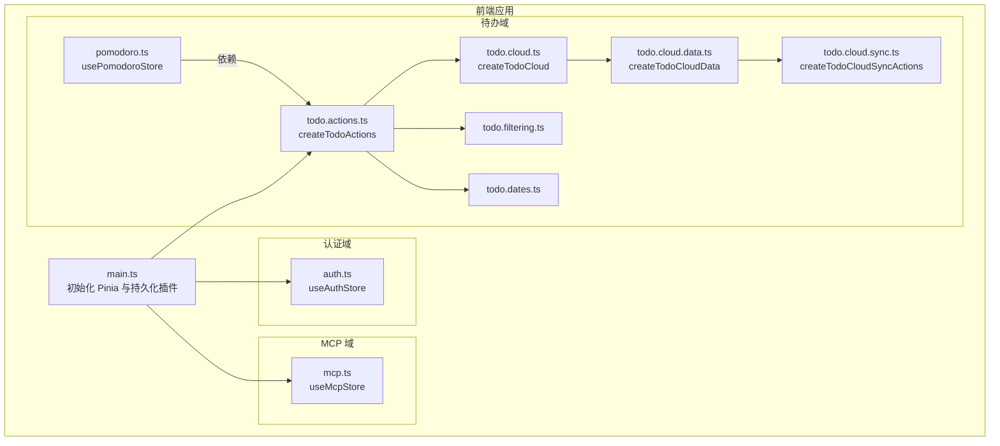
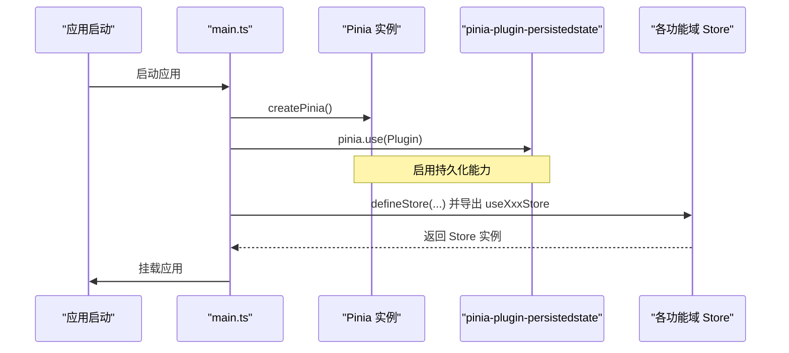
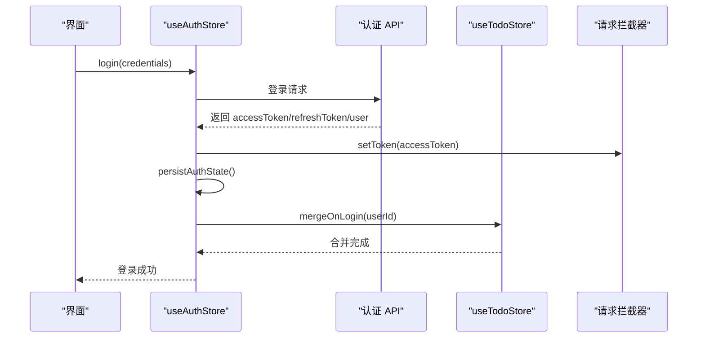
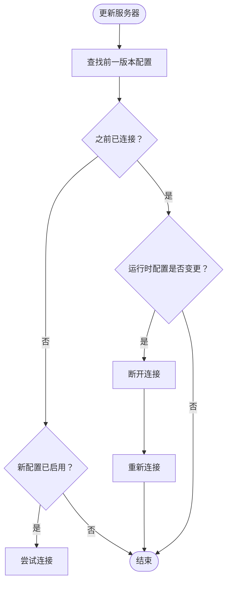
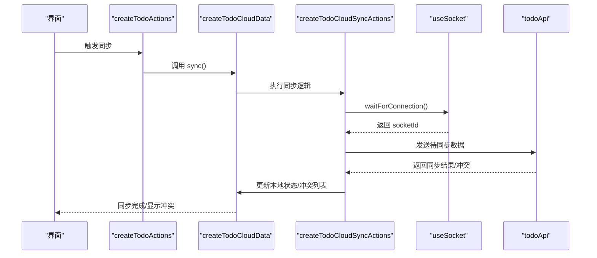

# Pinia Store架构

<cite>
**本文档引用的文件**
- [apps/frontend/src/main.ts](file://apps/frontend/src/main.ts)
- [apps/frontend/src/features/auth/stores/auth.ts](file://apps/frontend/src/features/auth/stores/auth.ts)
- [apps/frontend/src/features/mcp/stores/mcp.ts](file://apps/frontend/src/features/mcp/stores/mcp.ts)
- [apps/frontend/src/features/todo/stores/todo.actions.ts](file://apps/frontend/src/features/todo/stores/todo.actions.ts)
- [apps/frontend/src/features/todo/stores/todo.cloud.ts](file://apps/frontend/src/features/todo/stores/todo.cloud.ts)
- [apps/frontend/src/features/todo/stores/todo.cloud.data.ts](file://apps/frontend/src/features/todo/stores/todo.cloud.data.ts)
- [apps/frontend/src/features/todo/stores/todo.cloud.sync.ts](file://apps/frontend/src/features/todo/stores/todo.cloud.sync.ts)
- [apps/frontend/src/features/todo/stores/todo.filtering.ts](file://apps/frontend/src/features/todo/stores/todo.filtering.ts)
- [apps/frontend/src/features/todo/stores/todo.dates.ts](file://apps/frontend/src/features/todo/stores/todo.dates.ts)
- [apps/frontend/src/features/todo/stores/pomodoro.ts](file://apps/frontend/src/features/todo/stores/pomodoro.ts)
- [apps/frontend/package.json](file://apps/frontend/package.json)
</cite>

## 目录
1. [简介](#简介)
2. [项目结构](#项目结构)
3. [核心组件](#核心组件)
4. [架构总览](#架构总览)
5. [详细组件分析](#详细组件分析)
6. [依赖关系分析](#依赖关系分析)
7. [性能考量](#性能考量)
8. [故障排查指南](#故障排查指南)
9. [结论](#结论)
10. [附录](#附录)

## 简介
本文件系统性梳理前端应用中基于 Pinia 的状态管理架构，重点覆盖以下方面：
- Store 设计模式：状态定义、getter 计算属性、action 动作方法的设计原则
- 模块化组织：按功能域划分 store、模块间依赖关系、命名空间隔离
- 状态持久化策略：localStorage/sessionStorage 集成、序列化/反序列化处理、持久化配置选项
- Store 组合使用、跨模块通信、状态订阅机制
- 最佳实践：避免状态污染、性能优化技巧、调试工具使用

## 项目结构
前端采用多特征域的模块化组织方式，每个功能域拥有独立的 store 目录，便于职责分离与边界清晰：
- 认证域：认证状态与令牌管理
- MCP 域：MCP 服务器配置与连接状态
- 待办域：待办事项的 CRUD、过滤、UI 状态、云端同步与冲突处理
- 其他域：如 AI、任务计时等



**图表来源**
- [apps/frontend/src/main.ts:115-132](file://apps/frontend/src/main.ts#L115-L132)
- [apps/frontend/src/features/auth/stores/auth.ts:23-390](file://apps/frontend/src/features/auth/stores/auth.ts#L23-L390)
- [apps/frontend/src/features/mcp/stores/mcp.ts:15-245](file://apps/frontend/src/features/mcp/stores/mcp.ts#L15-L245)
- [apps/frontend/src/features/todo/stores/todo.actions.ts:8-104](file://apps/frontend/src/features/todo/stores/todo.actions.ts#L8-L104)
- [apps/frontend/src/features/todo/stores/todo.cloud.ts:6-43](file://apps/frontend/src/features/todo/stores/todo.cloud.ts#L6-L43)
- [apps/frontend/src/features/todo/stores/todo.cloud.data.ts:7-42](file://apps/frontend/src/features/todo/stores/todo.cloud.data.ts#L7-L42)
- [apps/frontend/src/features/todo/stores/todo.cloud.sync.ts:36-213](file://apps/frontend/src/features/todo/stores/todo.cloud.sync.ts#L36-L213)
- [apps/frontend/src/features/todo/stores/todo.filtering.ts:12-53](file://apps/frontend/src/features/todo/stores/todo.filtering.ts#L12-L53)
- [apps/frontend/src/features/todo/stores/todo.dates.ts:3-55](file://apps/frontend/src/features/todo/stores/todo.dates.ts#L3-L55)
- [apps/frontend/src/features/todo/stores/pomodoro.ts:32-36](file://apps/frontend/src/features/todo/stores/pomodoro.ts#L32-L36)

**章节来源**
- [apps/frontend/src/main.ts:115-132](file://apps/frontend/src/main.ts#L115-L132)

## 核心组件
本节从设计模式角度解析 Store 的三要素：状态、计算属性、动作。

- 状态定义
  - 使用 ref 定义可变状态，如 token、refreshToken、user、servers、todos 等
  - 使用对象/数组承载复杂数据，配合不可变更新策略
- 计算属性
  - 使用 computed 将派生状态暴露为只读视图，如 isAuthenticated
  - 在过滤与排序场景中，通过纯函数对数据进行筛选与排序
- 动作方法
  - 提供异步/同步操作，封装副作用与业务流程
  - 将大功能拆分为多个子动作模块，便于组合与复用

示例要点（以认证与待办为例）：
- 认证 store：登录、注册、刷新令牌、登出、获取当前用户等
- 待办 actions：fetch、add、remove、toggle、reorder、UI 控制、AI 辅助分解等

**章节来源**
- [apps/frontend/src/features/auth/stores/auth.ts:26-381](file://apps/frontend/src/features/auth/stores/auth.ts#L26-L381)
- [apps/frontend/src/features/todo/stores/todo.actions.ts:8-104](file://apps/frontend/src/features/todo/stores/todo.actions.ts#L8-L104)
- [apps/frontend/src/features/todo/stores/todo.filtering.ts:12-53](file://apps/frontend/src/features/todo/stores/todo.filtering.ts#L12-L53)

## 架构总览
Pinia 在应用启动时全局初始化，并启用持久化插件。各功能域 store 通过 defineStore 定义，内部通过组合式函数将状态、计算属性与动作解耦，形成“数据层 + 行为层”的清晰分层。



**图表来源**
- [apps/frontend/src/main.ts:115-132](file://apps/frontend/src/main.ts#L115-L132)

**章节来源**
- [apps/frontend/src/main.ts:115-132](file://apps/frontend/src/main.ts#L115-L132)
- [apps/frontend/package.json:57-58](file://apps/frontend/package.json#L57-L58)

## 详细组件分析

### 认证 Store（useAuthStore）
- 设计要点
  - 状态：token、refreshToken、user、loading、error、fieldErrors
  - 计算属性：isAuthenticated
  - 动作：login、register、forgotPassword、resetPassword、logout、fetchCurrentUser、refreshAccessToken、clearError
  - 持久化：通过插件配置 key、storage、pick 字段实现局部持久化
  - 跨模块通信：登录后联动待办合并、触发 AI 匿名迁移；登出后清理远程数据
- 关键流程
  - 登录/注册：成功后立即设置拦截器 token 并持久化；随后触发待办合并与 AI 迁移
  - 刷新令牌：带重试与瞬时错误判断，失败时触发登出
  - 存储恢复：hydrateFromStorage 支持多种历史存储结构兼容



**图表来源**
- [apps/frontend/src/features/auth/stores/auth.ts:148-179](file://apps/frontend/src/features/auth/stores/auth.ts#L148-L179)
- [apps/frontend/src/features/auth/stores/auth.ts:167-170](file://apps/frontend/src/features/auth/stores/auth.ts#L167-L170)

**章节来源**
- [apps/frontend/src/features/auth/stores/auth.ts:23-390](file://apps/frontend/src/features/auth/stores/auth.ts#L23-L390)

### MCP Store（useMcpStore）
- 设计要点
  - 状态：servers、connectionStates、connectingStates、serverErrors、isLoading、error
  - 动作：fetchServers、createServer、updateServer、deleteServer、connectServer、disconnectServer、getTools、toggleActive
  - 自动连接：根据服务器启用状态与连接状态自动尝试连接
  - 错误处理：区分 401 与其它错误，避免无意义日志输出
- 关键流程
  - 更新服务器：若运行时配置变更且已连接，则断开后重新连接
  - 启停切换：通过 toggleActive 委托 updateServer 完成启停与连接状态切换



**图表来源**
- [apps/frontend/src/features/mcp/stores/mcp.ts:116-152](file://apps/frontend/src/features/mcp/stores/mcp.ts#L116-L152)
- [apps/frontend/src/features/mcp/stores/mcp.ts:175-202](file://apps/frontend/src/features/mcp/stores/mcp.ts#L175-L202)

**章节来源**
- [apps/frontend/src/features/mcp/stores/mcp.ts:15-245](file://apps/frontend/src/features/mcp/stores/mcp.ts#L15-L245)

### 待办 Store（组合式 Actions 与 Cloud 同步）
- 设计要点
  - 动作组合：createTodoActions 将 fetch、mutations、UI、AI 动作聚合，返回统一接口
  - 过滤与排序：applyFilterAndSort 结合过滤类型、搜索词、置顶与完成状态进行排序
  - 日期规范化：toDate 与 cloneTodo 确保时间字段一致性与深拷贝
  - 云端同步：createTodoCloudData 组合 sync、conflict、listener、trash 等子模块
  - 冲突处理：构建冲突快照，支持接受或重试
  - Socket 监听：等待连接后执行同步，失败时提示版本更新并降级处理



**图表来源**
- [apps/frontend/src/features/todo/stores/todo.actions.ts:8-104](file://apps/frontend/src/features/todo/stores/todo.actions.ts#L8-L104)
- [apps/frontend/src/features/todo/stores/todo.cloud.data.ts:7-42](file://apps/frontend/src/features/todo/stores/todo.cloud.data.ts#L7-L42)
- [apps/frontend/src/features/todo/stores/todo.cloud.sync.ts:36-213](file://apps/frontend/src/features/todo/stores/todo.cloud.sync.ts#L36-L213)

**章节来源**
- [apps/frontend/src/features/todo/stores/todo.actions.ts:8-104](file://apps/frontend/src/features/todo/stores/todo.actions.ts#L8-L104)
- [apps/frontend/src/features/todo/stores/todo.cloud.ts:6-43](file://apps/frontend/src/features/todo/stores/todo.cloud.ts#L6-L43)
- [apps/frontend/src/features/todo/stores/todo.cloud.data.ts:7-42](file://apps/frontend/src/features/todo/stores/todo.cloud.data.ts#L7-L42)
- [apps/frontend/src/features/todo/stores/todo.cloud.sync.ts:36-213](file://apps/frontend/src/features/todo/stores/todo.cloud.sync.ts#L36-L213)
- [apps/frontend/src/features/todo/stores/todo.filtering.ts:12-53](file://apps/frontend/src/features/todo/stores/todo.filtering.ts#L12-L53)
- [apps/frontend/src/features/todo/stores/todo.dates.ts:3-55](file://apps/frontend/src/features/todo/stores/todo.dates.ts#L3-L55)

### 任务计时器 Store（usePomodoroStore）
- 设计要点
  - 依赖待办 store 与主题 store，结合原生服务与 Toast 提示
  - 模式配置：支持多种番茄钟模式及其时长
  - 历史统计：记录每日专注分钟数
- 交互关系
  - 与待办 store 协同，用于专注模式下的任务选择与反馈

**章节来源**
- [apps/frontend/src/features/todo/stores/pomodoro.ts:32-36](file://apps/frontend/src/features/todo/stores/pomodoro.ts#L32-L36)

## 依赖关系分析
- 模块化与命名空间
  - 各功能域通过独立目录与文件组织，store 名称唯一，避免命名冲突
  - 通过 defineStore 的第一个参数作为 store key，实现命名空间隔离
- 跨模块依赖
  - 认证 store 在登录/登出时与待办 store 交互
  - 待办 cloud 同步依赖认证 store 的令牌与用户上下文
  - 任务计时器依赖待办 store 的任务状态
- 外部依赖
  - Pinia 与持久化插件
  - Axios、Socket.IO、Vue Query 等

```mermaid
graph LR
Auth["auth.ts"] -- "登录/登出" --> Todo["todo.actions.ts"]
Todo -- "云端同步" --> Cloud["todo.cloud.data.ts"]
Cloud --> Sync["todo.cloud.sync.ts"]
Todo -- "过滤/排序" --> Filter["todo.filtering.ts"]
Todo -- "日期处理" --> Dates["todo.dates.ts"]
Pomodoro["pomodoro.ts"] -- "依赖" --> Todo
MCP["mcp.ts"] -- "服务器配置" --> |"连接/断开"| Socket["Socket.IO"]
```

**图表来源**
- [apps/frontend/src/features/auth/stores/auth.ts:167-170](file://apps/frontend/src/features/auth/stores/auth.ts#L167-L170)
- [apps/frontend/src/features/todo/stores/todo.actions.ts:8-104](file://apps/frontend/src/features/todo/stores/todo.actions.ts#L8-L104)
- [apps/frontend/src/features/todo/stores/todo.cloud.data.ts:7-42](file://apps/frontend/src/features/todo/stores/todo.cloud.data.ts#L7-L42)
- [apps/frontend/src/features/todo/stores/todo.cloud.sync.ts:45-76](file://apps/frontend/src/features/todo/stores/todo.cloud.sync.ts#L45-L76)
- [apps/frontend/src/features/todo/stores/todo.filtering.ts:12-53](file://apps/frontend/src/features/todo/stores/todo.filtering.ts#L12-L53)
- [apps/frontend/src/features/todo/stores/todo.dates.ts:3-55](file://apps/frontend/src/features/todo/stores/todo.dates.ts#L3-L55)
- [apps/frontend/src/features/todo/stores/pomodoro.ts:32-36](file://apps/frontend/src/features/todo/stores/pomodoro.ts#L32-L36)
- [apps/frontend/src/features/mcp/stores/mcp.ts:175-202](file://apps/frontend/src/features/mcp/stores/mcp.ts#L175-L202)

**章节来源**
- [apps/frontend/src/features/auth/stores/auth.ts:167-170](file://apps/frontend/src/features/auth/stores/auth.ts#L167-L170)
- [apps/frontend/src/features/todo/stores/todo.cloud.sync.ts:45-76](file://apps/frontend/src/features/todo/stores/todo.cloud.sync.ts#L45-L76)
- [apps/frontend/src/features/mcp/stores/mcp.ts:175-202](file://apps/frontend/src/features/mcp/stores/mcp.ts#L175-L202)

## 性能考量
- 状态粒度与不可变更新
  - 将复杂对象拆分为细粒度状态，减少不必要的响应式开销
  - 对数组/对象更新采用替换策略，避免深层监听带来的性能损耗
- 异步与重试
  - 云端同步采用指数退避重试与冷却时间，降低频繁请求压力
  - 使用防抖（debounce）合并高频同步调用
- 计算属性与派生状态
  - 将昂贵的过滤/排序逻辑放在纯函数中，避免在模板中直接计算
- 依赖懒加载
  - 动态导入 socket 模块，避免首屏阻塞；出现模块加载错误时提示版本更新并降级处理

**章节来源**
- [apps/frontend/src/features/todo/stores/todo.cloud.sync.ts:183-183](file://apps/frontend/src/features/todo/stores/todo.cloud.sync.ts#L183-L183)
- [apps/frontend/src/features/todo/stores/todo.cloud.sync.ts:172-175](file://apps/frontend/src/features/todo/stores/todo.cloud.sync.ts#L172-L175)
- [apps/frontend/src/main.ts:59-79](file://apps/frontend/src/main.ts#L59-L79)

## 故障排查指南
- 模块加载失败（Chunk Error）
  - 现象：动态导入模块失败，常见于部署后资源版本变化
  - 处理：全局错误处理器检测并自动刷新页面；限制刷新频率防止死循环
- 云端同步异常
  - 现象：同步失败、冲突、版本更新提示
  - 处理：检查认证状态与 Socket 连接；根据错误类型提示用户或自动重试
- 令牌与持久化问题
  - 现象：刷新后丢失登录态
  - 处理：确认持久化配置 pick 字段包含必要字段；检查历史存储结构兼容逻辑

**章节来源**
- [apps/frontend/src/main.ts:59-79](file://apps/frontend/src/main.ts#L59-L79)
- [apps/frontend/src/features/todo/stores/todo.cloud.sync.ts:53-72](file://apps/frontend/src/features/todo/stores/todo.cloud.sync.ts#L53-L72)
- [apps/frontend/src/features/todo/stores/todo.cloud.sync.ts:165-177](file://apps/frontend/src/features/todo/stores/todo.cloud.sync.ts#L165-L177)
- [apps/frontend/src/features/auth/stores/auth.ts:112-143](file://apps/frontend/src/features/auth/stores/auth.ts#L112-L143)

## 结论
该 Pinia 架构通过明确的状态、计算属性与动作划分，结合模块化组织与持久化策略，实现了高内聚、低耦合的状态管理。认证、MCP、待办三大域分别承担身份、外部服务与核心业务，彼此通过轻量级交互协作。云端同步与冲突处理进一步增强了跨设备一致性与用户体验。建议在后续迭代中持续关注性能优化与错误降级策略，确保在复杂场景下保持稳定与流畅。

## 附录
- 持久化配置示例路径
  - 认证 store 的持久化配置：[apps/frontend/src/features/auth/stores/auth.ts:383-390](file://apps/frontend/src/features/auth/stores/auth.ts#L383-L390)
- 插件安装与全局启用
  - Pinia 初始化与持久化插件启用：[apps/frontend/src/main.ts:115-132](file://apps/frontend/src/main.ts#L115-L132)
- 依赖声明
  - Pinia 与持久化插件版本：[apps/frontend/package.json:57-58](file://apps/frontend/package.json#L57-L58)