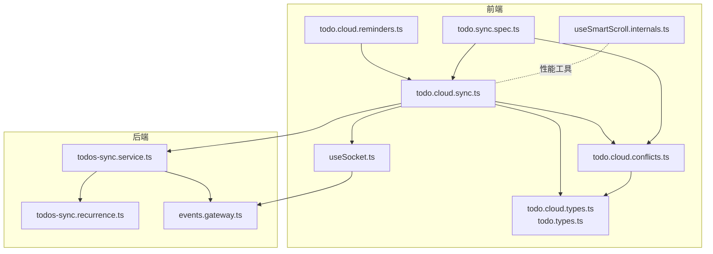
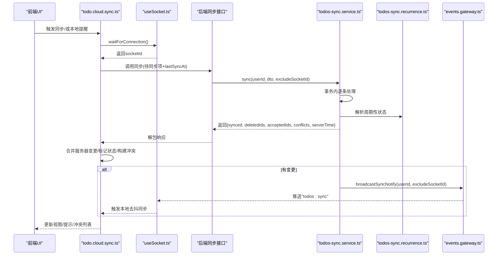
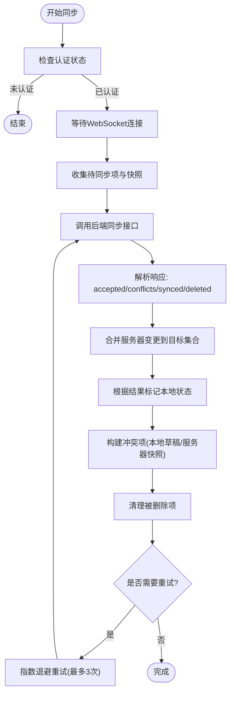
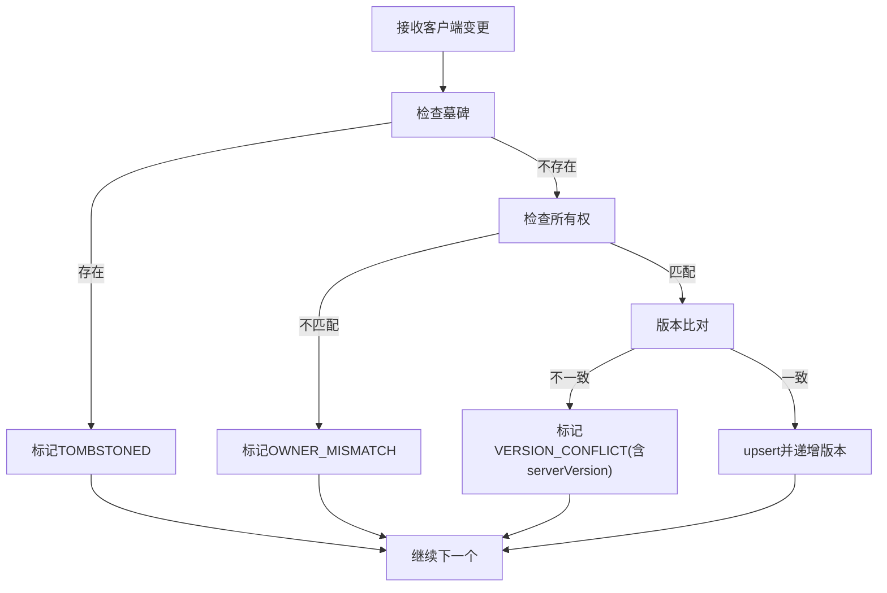
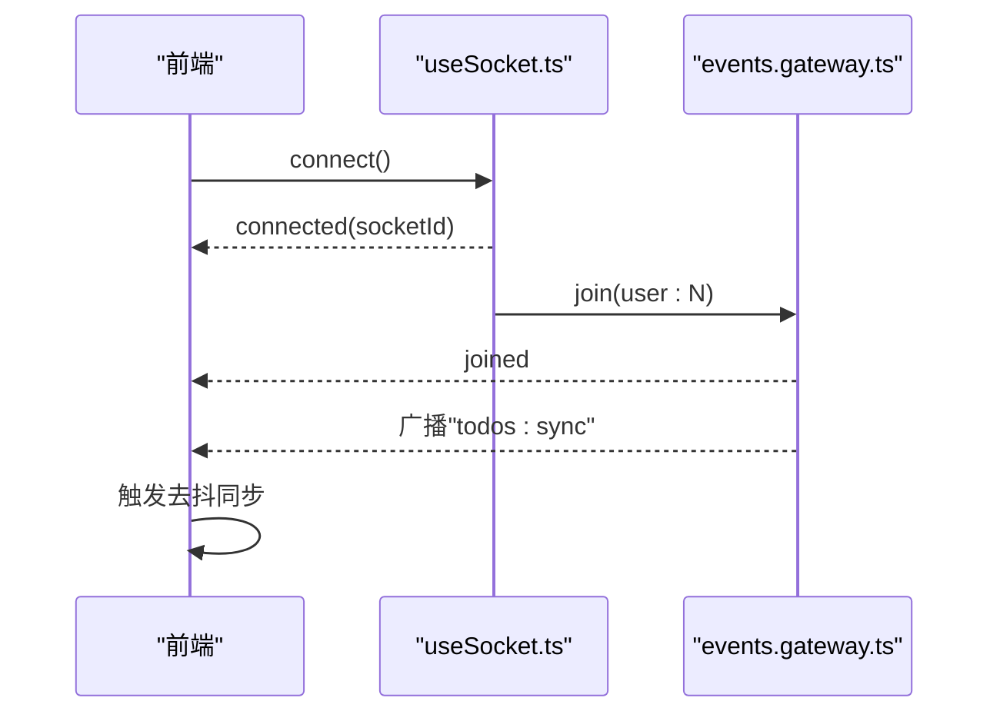
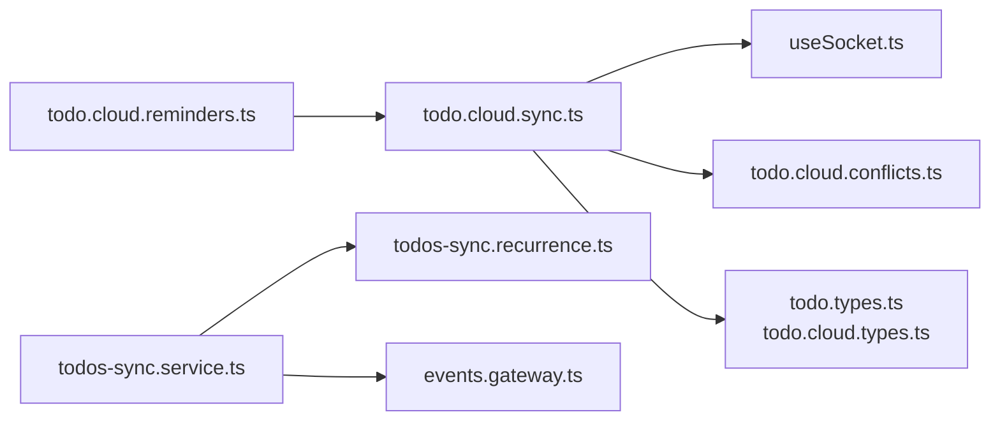

# 状态同步

<cite>
**本文引用的文件**
- [apps/frontend/src/features/todo/stores/todo.cloud.sync.ts](file://apps/frontend/src/features/todo/stores/todo.cloud.sync.ts)
- [apps/frontend/src/features/todo/stores/todo.cloud.conflicts.ts](file://apps/frontend/src/features/todo/stores/todo.cloud.conflicts.ts)
- [apps/frontend/src/features/todo/stores/todo.cloud.reminders.ts](file://apps/frontend/src/features/todo/stores/todo.cloud.reminders.ts)
- [apps/frontend/src/features/todo/stores/todo.cloud.types.ts](file://apps/frontend/src/features/todo/stores/todo.cloud.types.ts)
- [apps/frontend/src/features/todo/stores/todo.types.ts](file://apps/frontend/src/features/todo/stores/todo.types.ts)
- [apps/frontend/src/composables/useSocket.ts](file://apps/frontend/src/composables/useSocket.ts)
- [apps/backend/src/todos/todos-sync.service.ts](file://apps/backend/src/todos/todos-sync.service.ts)
- [apps/backend/src/todos/todos-sync.recurrence.ts](file://apps/backend/src/todos/todos-sync.recurrence.ts)
- [apps/backend/src/events/events.gateway.ts](file://apps/backend/src/events/events.gateway.ts)
- [apps/frontend/tests/features/todo/stores/todo.sync.spec.ts](file://apps/frontend/tests/features/todo/stores/todo.sync.spec.ts)
- [apps/frontend/src/composables/useSmartScroll.internals.ts](file://apps/frontend/src/composables/useSmartScroll.internals.ts)
</cite>

## 目录
1. [简介](#简介)
2. [项目结构](#项目结构)
3. [核心组件](#核心组件)
4. [架构总览](#架构总览)
5. [详细组件分析](#详细组件分析)
6. [依赖关系分析](#依赖关系分析)
7. [性能考量](#性能考量)
8. [故障排查指南](#故障排查指南)
9. [结论](#结论)
10. [附录](#附录)

## 简介
本技术文档聚焦于“状态同步”机制，系统化阐述本地状态与服务器状态的双向协调：包括双向同步流程、冲突检测算法、版本比较机制；乐观更新策略（本地修改预应用、服务器确认回滚、并发冲突处理）；实时同步监听（WebSocket 连接管理、事件订阅机制、增量更新推送）；离线状态处理（离线数据存储、队列管理、重连重试、数据完整性保证）；以及同步性能优化（批量更新、去抖动、节流控制、网络状态感知）。同时提供调试工具、日志记录与错误恢复机制的实践建议。

## 项目结构
围绕“待办事项”功能的状态同步，前端与后端的关键模块如下：
- 前端
  - todo.cloud.sync.ts：云端同步动作与重试、去抖动、冲突合并、删除项清理
  - todo.cloud.conflicts.ts：冲突构建与处理（接受、重试、清除）
  - todo.cloud.reminders.ts：本地提醒循环（远程模式下触发同步）
  - useSocket.ts：WebSocket 连接、认证、重连、等待连接
  - todo.cloud.types.ts / todo.types.ts：同步依赖与类型定义
  - tests/features/todo/stores/todo.sync.spec.ts：同步与冲突行为测试
  - composables/useSmartScroll.internals.ts：批处理与节流（通用性能工具）
- 后端
  - todos-sync.service.ts：增量同步、冲突检测、版本递增、广播通知
  - todos-sync.recurrence.ts：周期性任务解析与派生
  - events.gateway.ts：WebSocket 网关、房间管理、广播防抖

**图表来源**
- [apps/frontend/src/features/todo/stores/todo.cloud.sync.ts:1-214](file://apps/frontend/src/features/todo/stores/todo.cloud.sync.ts#L1-L214)
- [apps/frontend/src/features/todo/stores/todo.cloud.conflicts.ts:1-91](file://apps/frontend/src/features/todo/stores/todo.cloud.conflicts.ts#L1-L91)
- [apps/frontend/src/features/todo/stores/todo.cloud.reminders.ts:1-40](file://apps/frontend/src/features/todo/stores/todo.cloud.reminders.ts#L1-L40)
- [apps/frontend/src/composables/useSocket.ts:1-176](file://apps/frontend/src/composables/useSocket.ts#L1-L176)
- [apps/frontend/src/features/todo/stores/todo.cloud.types.ts:1-17](file://apps/frontend/src/features/todo/stores/todo.cloud.types.ts#L1-L17)
- [apps/frontend/src/features/todo/stores/todo.types.ts:1-68](file://apps/frontend/src/features/todo/stores/todo.types.ts#L1-L68)
- [apps/backend/src/todos/todos-sync.service.ts:1-221](file://apps/backend/src/todos/todos-sync.service.ts#L1-L221)
- [apps/backend/src/todos/todos-sync.recurrence.ts:1-208](file://apps/backend/src/todos/todos-sync.recurrence.ts#L1-L208)
- [apps/backend/src/events/events.gateway.ts:1-266](file://apps/backend/src/events/events.gateway.ts#L1-L266)
- [apps/frontend/tests/features/todo/stores/todo.sync.spec.ts:327-468](file://apps/frontend/tests/features/todo/stores/todo.sync.spec.ts#L327-L468)
- [apps/frontend/src/composables/useSmartScroll.internals.ts:66-108](file://apps/frontend/src/composables/useSmartScroll.internals.ts#L66-L108)

**章节来源**
- [apps/frontend/src/features/todo/stores/todo.cloud.sync.ts:1-214](file://apps/frontend/src/features/todo/stores/todo.cloud.sync.ts#L1-L214)
- [apps/backend/src/todos/todos-sync.service.ts:1-221](file://apps/backend/src/todos/todos-sync.service.ts#L1-L221)

## 核心组件
- 云端同步动作（前端）
  - 同步入口与冷却：限制频繁同步，避免抖动；等待 WebSocket 连接；收集待同步项与快照；调用后端接口；合并结果、冲突、删除项；更新最后同步时间；错误重试与提示。
  - 冲突处理：构建冲突项（含本地草稿与服务器快照）；接受冲突（按原因处理，如删除或覆盖）；重试冲突（基于服务器版本基线重建本地草稿并重新提交）。
  - 本地提醒：在远程模式下，到达提醒时间自动标记为待同步并触发去抖同步。
- WebSocket 连接（前端）
  - 初始化、认证、重连、等待连接；自动加入用户房间；错误处理（认证失败时刷新令牌并重连）。
- 后端同步服务
  - 增量同步：事务内逐条处理客户端推送；严格版本比对；冲突分类（墓碑、所有权、版本）；版本递增；周期性任务派生；拉取自上次同步以来的服务器变更；广播通知。
- 事件网关（后端）
  - 房间权限校验、广播防抖（同一用户 500ms 内仅一次）；向用户所有在线设备推送“todos:sync”事件。

**章节来源**
- [apps/frontend/src/features/todo/stores/todo.cloud.sync.ts:36-181](file://apps/frontend/src/features/todo/stores/todo.cloud.sync.ts#L36-L181)
- [apps/frontend/src/features/todo/stores/todo.cloud.conflicts.ts:21-89](file://apps/frontend/src/features/todo/stores/todo.cloud.conflicts.ts#L21-L89)
- [apps/frontend/src/features/todo/stores/todo.cloud.reminders.ts:11-38](file://apps/frontend/src/features/todo/stores/todo.cloud.reminders.ts#L11-L38)
- [apps/frontend/src/composables/useSocket.ts:22-175](file://apps/frontend/src/composables/useSocket.ts#L22-L175)
- [apps/backend/src/todos/todos-sync.service.ts:51-219](file://apps/backend/src/todos/todos-sync.service.ts#L51-L219)
- [apps/backend/src/events/events.gateway.ts:180-202](file://apps/backend/src/events/events.gateway.ts#L180-L202)

## 架构总览
下面的序列图展示了“本地修改 → 乐观预应用 → 后端校验与合并 → 冲突/接受/重试 → 实时广播”的完整闭环。

**图表来源**
- [apps/frontend/src/features/todo/stores/todo.cloud.sync.ts:84-163](file://apps/frontend/src/features/todo/stores/todo.cloud.sync.ts#L84-L163)
- [apps/frontend/src/composables/useSocket.ts:116-146](file://apps/frontend/src/composables/useSocket.ts#L116-L146)
- [apps/backend/src/todos/todos-sync.service.ts:51-219](file://apps/backend/src/todos/todos-sync.service.ts#L51-L219)
- [apps/backend/src/todos/todos-sync.recurrence.ts:87-151](file://apps/backend/src/todos/todos-sync.recurrence.ts#L87-L151)
- [apps/backend/src/events/events.gateway.ts:180-202](file://apps/backend/src/events/events.gateway.ts#L180-L202)

## 详细组件分析

### 组件A：云端同步与冲突合并（前端）
- 功能要点
  - 待同步项筛选与快照：仅对非“已同步”项参与同步，并记录 updatedAt 快照用于一致性校验。
  - 响应解析与合并：根据 acceptedIds、conflicts、synced、deletedIds 合并到目标集合；若无明确结果则回退标记为“已同步”。
  - 冲突构建与保留：将冲突项写入冲突列表，包含本地草稿与服务器快照，便于人工选择。
  - 删除项清理：服务端返回 deletedIds 后，前端同步清理对应项与冲突。
  - 错误与重试：动态导入 socket 模块失败时区分“版本更新”场景；普通错误最多重试 3 次，指数退避。
- 乐观更新策略
  - 本地先标记为“已同步”，若服务端接受则保持；若冲突则标记为“错误”，交由用户处理。
  - 重试冲突时以服务器版本为基线重建本地草稿，确保版本一致性后再提交。

**图表来源**
- [apps/frontend/src/features/todo/stores/todo.cloud.sync.ts:36-181](file://apps/frontend/src/features/todo/stores/todo.cloud.sync.ts#L36-L181)

**章节来源**
- [apps/frontend/src/features/todo/stores/todo.cloud.sync.ts:78-163](file://apps/frontend/src/features/todo/stores/todo.cloud.sync.ts#L78-L163)
- [apps/frontend/src/features/todo/stores/todo.cloud.conflicts.ts:6-19](file://apps/frontend/src/features/todo/stores/todo.cloud.conflicts.ts#L6-L19)

### 组件B：冲突检测与处理（前后端协同）
- 冲突检测（后端）
  - 墓碑冲突：客户端提交的 todo 在服务端存在墓碑记录。
  - 所有权冲突：现有记录属于其他用户。
  - 版本冲突：客户端版本与服务端版本不一致（严格匹配，避免时钟漂移影响）。
- 冲突处理（前端）
  - 接受冲突：按原因删除或覆盖；更新状态并清空冲突。
  - 重试冲突：基于服务器版本基线重建本地草稿，更新时间戳与状态，重新触发去抖同步。
- 测试验证
  - 版本冲突：本地草稿保留，接受服务器快照；重试时以服务器版本为基线再次提交并通过。

**图表来源**
- [apps/backend/src/todos/todos-sync.service.ts:66-122](file://apps/backend/src/todos/todos-sync.service.ts#L66-L122)

**章节来源**
- [apps/backend/src/todos/todos-sync.service.ts:111-122](file://apps/backend/src/todos/todos-sync.service.ts#L111-L122)
- [apps/frontend/tests/features/todo/stores/todo.sync.spec.ts:335-457](file://apps/frontend/tests/features/todo/stores/todo.sync.spec.ts#L335-L457)

### 组件C：实时同步监听与增量推送
- WebSocket 连接与认证
  - 初始化 socket，设置传输方式、重连参数、认证信息；连接成功后加入用户房间；连接错误时尝试刷新令牌并重连。
- 事件订阅与广播
  - 后端在有变更时广播“todos:sync”事件；前端监听到后触发本地去抖同步，实现增量更新推送。
- 房间权限与安全
  - 网关中间件校验 JWT，禁止跨房间访问；断开时清理定时器。

**图表来源**
- [apps/frontend/src/composables/useSocket.ts:25-96](file://apps/frontend/src/composables/useSocket.ts#L25-L96)
- [apps/backend/src/events/events.gateway.ts:180-202](file://apps/backend/src/events/events.gateway.ts#L180-L202)

**章节来源**
- [apps/frontend/src/composables/useSocket.ts:116-146](file://apps/frontend/src/composables/useSocket.ts#L116-L146)
- [apps/backend/src/events/events.gateway.ts:180-202](file://apps/backend/src/events/events.gateway.ts#L180-L202)

### 组件D：本地提醒与乐观更新联动
- 本地提醒循环
  - 每 15 秒扫描一次，命中提醒条件即触发通知并打上提醒时间戳；在远程模式下同时标记为“待同步”并触发去抖同步。
- 与同步的协作
  - 通过统一的去抖同步函数，避免频繁网络请求；在提醒触发时确保本地状态尽快进入“待同步”。

**章节来源**
- [apps/frontend/src/features/todo/stores/todo.cloud.reminders.ts:20-38](file://apps/frontend/src/features/todo/stores/todo.cloud.reminders.ts#L20-L38)

### 组件E：周期性任务与版本比较
- 周期性任务解析
  - 解析客户端/服务端的到期时间、提醒时间、时区与派生状态；在完成态且满足规则时派生下一次任务。
- 版本比较机制
  - 后端严格比对客户端版本与服务端版本，不一致即冲突；前端在重试时以服务器版本为基线重建本地草稿。

**章节来源**
- [apps/backend/src/todos/todos-sync.recurrence.ts:87-151](file://apps/backend/src/todos/todos-sync.recurrence.ts#L87-L151)
- [apps/backend/src/todos/todos-sync.service.ts:111-122](file://apps/backend/src/todos/todos-sync.service.ts#L111-L122)

## 依赖关系分析
- 前端依赖
  - todo.cloud.sync.ts 依赖 useSocket.ts 获取 socketId；依赖 todo.cloud.conflicts.ts 构建与处理冲突；依赖 todo.types.ts/todo.cloud.types.ts 的类型与状态字段。
  - todo.cloud.reminders.ts 依赖 todo.dates 工具与去抖同步回调。
- 后端依赖
  - todos-sync.service.ts 依赖 Prisma 事务、事件网关广播；todos-sync.recurrence.ts 提供周期性任务解析。
- 事件网关
  - 对用户房间进行权限校验，广播防抖避免风暴。

**图表来源**
- [apps/frontend/src/features/todo/stores/todo.cloud.sync.ts:1-214](file://apps/frontend/src/features/todo/stores/todo.cloud.sync.ts#L1-L214)
- [apps/frontend/src/features/todo/stores/todo.cloud.conflicts.ts:1-91](file://apps/frontend/src/features/todo/stores/todo.cloud.conflicts.ts#L1-L91)
- [apps/frontend/src/features/todo/stores/todo.cloud.reminders.ts:1-40](file://apps/frontend/src/features/todo/stores/todo.cloud.reminders.ts#L1-L40)
- [apps/frontend/src/composables/useSocket.ts:1-176](file://apps/frontend/src/composables/useSocket.ts#L1-L176)
- [apps/frontend/src/features/todo/stores/todo.types.ts:1-68](file://apps/frontend/src/features/todo/stores/todo.types.ts#L1-L68)
- [apps/frontend/src/features/todo/stores/todo.cloud.types.ts:1-17](file://apps/frontend/src/features/todo/stores/todo.cloud.types.ts#L1-L17)
- [apps/backend/src/todos/todos-sync.service.ts:1-221](file://apps/backend/src/todos/todos-sync.service.ts#L1-L221)
- [apps/backend/src/todos/todos-sync.recurrence.ts:1-208](file://apps/backend/src/todos/todos-sync.recurrence.ts#L1-L208)
- [apps/backend/src/events/events.gateway.ts:1-266](file://apps/backend/src/events/events.gateway.ts#L1-L266)

**章节来源**
- [apps/frontend/src/features/todo/stores/todo.cloud.sync.ts:1-214](file://apps/frontend/src/features/todo/stores/todo.cloud.sync.ts#L1-L214)
- [apps/backend/src/todos/todos-sync.service.ts:1-221](file://apps/backend/src/todos/todos-sync.service.ts#L1-L221)

## 性能考量
- 批量更新与去抖动
  - 前端同步冷却与去抖动：SYNC_COOLDOWN_MS 控制最小调用间隔；debounce 包裹同步入口，避免高频变更导致的抖动。
  - 后端广播防抖：同一用户 500ms 内仅广播一次，降低风暴。
- 节流与批处理
  - 使用 requestAnimationFrame 批处理与节流（如 useSmartScroll.internals.ts 的批处理与节流工具），减少渲染压力。
- 网络状态感知
  - WebSocket 自动重连与等待连接超时；连接错误时尝试刷新令牌；动态导入模块失败时区分“版本更新”场景，避免无意义重试。
- 数据完整性
  - 事务内处理客户端推送，严格版本比对；服务端拉取自上次同步以来的变更，确保不漏掉同一毫秒更新。

**章节来源**
- [apps/frontend/src/features/todo/stores/todo.cloud.sync.ts:15-183](file://apps/frontend/src/features/todo/stores/todo.cloud.sync.ts#L15-L183)
- [apps/backend/src/events/events.gateway.ts:180-202](file://apps/backend/src/events/events.gateway.ts#L180-L202)
- [apps/frontend/src/composables/useSmartScroll.internals.ts:66-108](file://apps/frontend/src/composables/useSmartScroll.internals.ts#L66-L108)
- [apps/frontend/src/composables/useSocket.ts:116-146](file://apps/frontend/src/composables/useSocket.ts#L116-L146)

## 故障排查指南
- 同步失败与重试
  - 若动态导入 socket 模块失败且提示动态模块加载错误，前端会提示“版本已更新”，并停止继续重试；否则最多重试 3 次，每次指数退避。
- 冲突处理
  - 版本冲突：保留本地草稿，接受服务器快照或重试；重试时以服务器版本为基线重建本地草稿。
  - 墓碑冲突：服务端返回墓碑，前端应删除本地对应项。
  - 所有权冲突：服务端返回所有权不匹配，前端应删除本地对应项。
- WebSocket 连接问题
  - 认证失败：连接错误回调中尝试刷新令牌并重连；若仍失败，检查 JWT 是否失效或被撤销。
  - 房间权限：确保加入房间时携带正确的用户 ID，避免跨房间访问被拒绝。
- 日志与监控
  - 前端：同步失败打印错误日志；WebSocket 连接错误输出详细上下文；动态导入失败时提示“版本更新”。
  - 后端：网关记录连接、断开、认证失败、房间操作等日志；广播前记录计时器清理。

**章节来源**
- [apps/frontend/src/features/todo/stores/todo.cloud.sync.ts:165-181](file://apps/frontend/src/features/todo/stores/todo.cloud.sync.ts#L165-L181)
- [apps/frontend/src/features/todo/stores/todo.cloud.conflicts.ts:33-58](file://apps/frontend/src/features/todo/stores/todo.cloud.conflicts.ts#L33-L58)
- [apps/frontend/src/composables/useSocket.ts:60-93](file://apps/frontend/src/composables/useSocket.ts#L60-L93)
- [apps/backend/src/events/events.gateway.ts:68-116](file://apps/backend/src/events/events.gateway.ts#L68-L116)

## 结论
本方案通过“乐观预应用 + 严格版本比对 + 冲突可视化 + 实时广播”的组合，实现了高效、可靠的双向状态同步。前端采用去抖动与节流控制网络与渲染压力，后端通过事务与广播防抖保障一致性与性能。配合本地提醒与冲突重试机制，进一步提升了用户体验与数据完整性。

## 附录
- 关键流程与测试参考
  - 版本冲突接受与重试流程可参考测试用例中的断言与交互步骤。
- 类型与状态字段
  - 前端 Todo 类型扩展了完成/删除/提醒/周期性等字段与 syncStatus；冲突类型包含原因、服务器版本与快照。

**章节来源**
- [apps/frontend/tests/features/todo/stores/todo.sync.spec.ts:335-457](file://apps/frontend/tests/features/todo/stores/todo.sync.spec.ts#L335-L457)
- [apps/frontend/src/features/todo/stores/todo.types.ts:3-18](file://apps/frontend/src/features/todo/stores/todo.types.ts#L3-L18)
- [apps/frontend/src/features/todo/stores/todo.cloud.types.ts:5-16](file://apps/frontend/src/features/todo/stores/todo.cloud.types.ts#L5-L16)