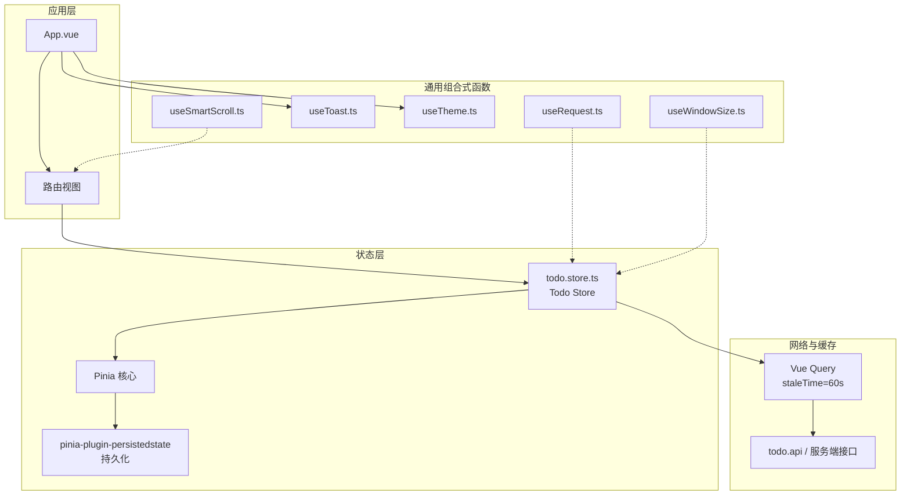
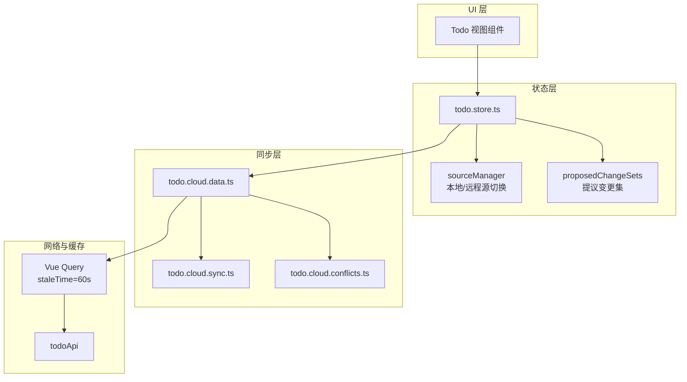
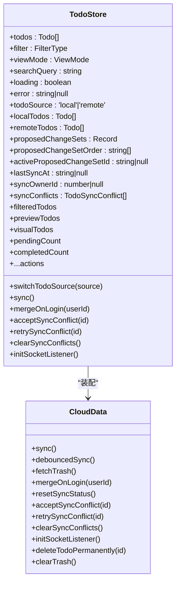
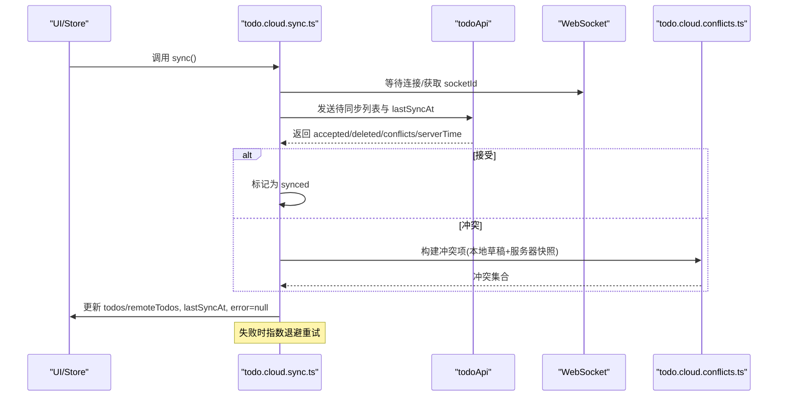
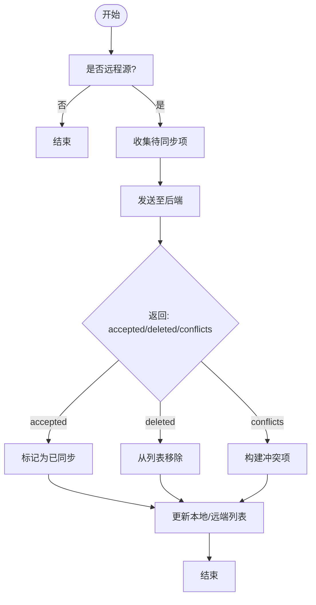
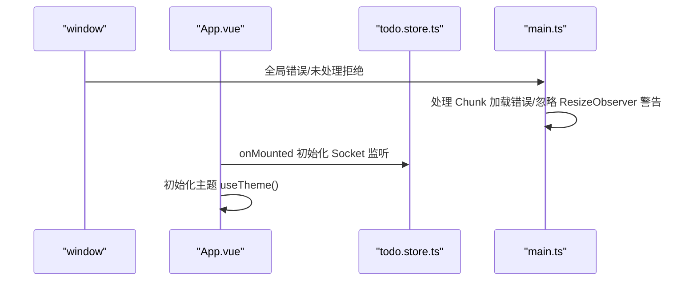
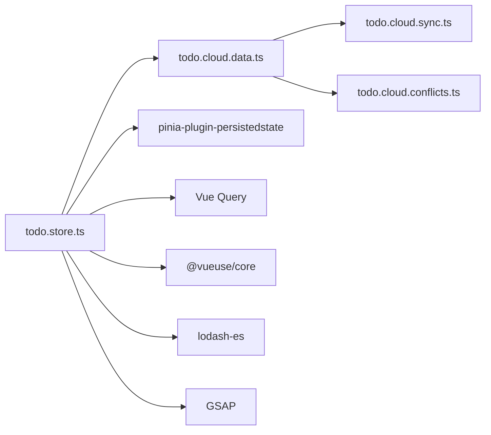

# 状态管理

<cite>
**本文档引用的文件**
- [main.ts](file://apps/frontend/src/main.ts)
- [App.vue](file://apps/frontend/src/App.vue)
- [useRequest.ts](file://apps/frontend/src/composables/useRequest.ts)
- [useToast.ts](file://apps/frontend/src/composables/useToast.ts)
- [useTheme.ts](file://apps/frontend/src/composables/useTheme.ts)
- [useWindowSize.ts](file://apps/frontend/src/composables/useWindowSize.ts)
- [useSmartScroll.ts](file://apps/frontend/src/composables/useSmartScroll.ts)
- [todo.store.ts](file://apps/frontend/src/features/todo/stores/todo.store.ts)
- [todo.cloud.data.ts](file://apps/frontend/src/features/todo/stores/todo.cloud.data.ts)
- [todo.cloud.sync.ts](file://apps/frontend/src/features/todo/stores/todo.cloud.sync.ts)
- [todo.cloud.conflicts.ts](file://apps/frontend/src/features/todo/stores/todo.cloud.conflicts.ts)
- [NotFoundView.vue](file://apps/frontend/src/views/error/NotFoundView.vue)
</cite>

## 目录
1. [简介](#简介)
2. [项目结构](#项目结构)
3. [核心组件](#核心组件)
4. [架构总览](#架构总览)
5. [详细组件分析](#详细组件分析)
6. [依赖关系分析](#依赖关系分析)
7. [性能考量](#性能考量)
8. [故障排查指南](#故障排查指南)
9. [结论](#结论)
10. [附录](#附录)

## 简介
本技术文档聚焦前端状态管理，系统性阐述以下主题：
- Pinia 状态管理架构：Store 设计模式、模块化组织、状态持久化策略
- 组合式函数使用：useRequest 数据请求封装、useToast 通知管理、useTheme 主题切换、useWindowSize 窗口尺寸监听
- 状态同步机制：本地状态与服务器状态的协调、乐观更新策略、冲突解决
- 缓存策略：查询缓存、数据过期、手动刷新、垃圾回收
- 状态调试工具、性能监控、内存泄漏防护、错误边界处理

## 项目结构
前端应用基于 Vue 3 + Pinia + Vue Query 构建，状态管理以模块化 Store 为核心，配合组合式函数提供跨模块的通用能力；同时通过全局错误处理与路由错误视图保障用户体验。



**图表来源**
- [main.ts:115-132](file://apps/frontend/src/main.ts#L115-L132)
- [todo.store.ts:21-335](file://apps/frontend/src/features/todo/stores/todo.store.ts#L21-L335)
- [App.vue:11-23](file://apps/frontend/src/App.vue#L11-L23)

**章节来源**
- [main.ts:115-132](file://apps/frontend/src/main.ts#L115-L132)
- [App.vue:11-23](file://apps/frontend/src/App.vue#L11-L23)

## 核心组件
- Pinia Store（Todo）：集中管理待办事项列表、过滤器、视图模式、搜索、拖拽状态、抽屉开关、远程/本地源切换、同步状态与冲突、提议变更集等。
- 组合式函数：useRequest、useToast、useTheme、useWindowSize、useSmartScroll 提供跨模块复用能力。
- 同步与冲突：todo.cloud.* 模块负责与后端同步、冲突构建与解决、监听器初始化、回收站操作。
- 缓存与持久化：Pinia 持久化插件 + Vue Query 查询缓存，结合防抖与冷却时间控制同步频率。

**章节来源**
- [todo.store.ts:21-335](file://apps/frontend/src/features/todo/stores/todo.store.ts#L21-L335)
- [useRequest.ts:17-44](file://apps/frontend/src/composables/useRequest.ts#L17-L44)
- [useToast.ts:17-86](file://apps/frontend/src/composables/useToast.ts#L17-L86)
- [useTheme.ts:188-247](file://apps/frontend/src/composables/useTheme.ts#L188-L247)
- [useWindowSize.ts:6-34](file://apps/frontend/src/composables/useWindowSize.ts#L6-L34)
- [useSmartScroll.ts:33-441](file://apps/frontend/src/composables/useSmartScroll.ts#L33-L441)

## 架构总览
整体架构围绕“模块化 Store + 组合式函数 + 网络与缓存”展开，Todo Store 作为中枢协调本地/远程数据、同步、冲突与 UI 行为。



**图表来源**
- [todo.store.ts:62-90](file://apps/frontend/src/features/todo/stores/todo.store.ts#L62-L90)
- [todo.cloud.data.ts:7-42](file://apps/frontend/src/features/todo/stores/todo.cloud.data.ts#L7-L42)
- [todo.cloud.sync.ts:25-31](file://apps/frontend/src/features/todo/stores/todo.cloud.sync.ts#L25-L31)
- [todo.cloud.conflicts.ts:21-28](file://apps/frontend/src/features/todo/stores/todo.cloud.conflicts.ts#L21-L28)

## 详细组件分析

### Pinia Todo Store 设计与持久化
- 设计模式
  - 使用 defineStore 定义命名空间化的 Todo Store，内部以响应式 ref/computed 管理状态，导出动作函数与派生状态。
  - 通过 createTodoSourceManager 实现本地/远程源的切换与快照应用，保证数据一致性。
  - 通过 createTodoCloud 将同步、冲突、监听器、回收站等能力注入 Store，形成高内聚的模块化职责划分。
- 模块化组织
  - todo.store.ts 负责聚合：状态、计算属性、动作、源管理、提议变更、同步集成。
  - todo.cloud.data.ts 统一装配同步、冲突、监听器、回收站等子模块。
  - todo.cloud.sync.ts 实现与后端的同步协议、重试与冷却、冲突映射。
  - todo.cloud.conflicts.ts 负责冲突对象构建与解决策略。
- 状态持久化
  - 通过 pinia-plugin-persistedstate 在 main.ts 中启用，并在 todo.store.ts 的 Store 配置中指定 pick 字段，仅持久化必要字段（如 todoSource、localTodos、remoteTodos、filter、viewMode 等），避免冗余存储。



**图表来源**
- [todo.store.ts:21-335](file://apps/frontend/src/features/todo/stores/todo.store.ts#L21-L335)
- [todo.cloud.data.ts:7-42](file://apps/frontend/src/features/todo/stores/todo.cloud.data.ts#L7-L42)

**章节来源**
- [todo.store.ts:21-335](file://apps/frontend/src/features/todo/stores/todo.store.ts#L21-L335)
- [todo.cloud.data.ts:7-42](file://apps/frontend/src/features/todo/stores/todo.cloud.data.ts#L7-L42)
- [main.ts:115-117](file://apps/frontend/src/main.ts#L115-L117)

### 组合式函数：useRequest、useToast、useTheme、useWindowSize
- useRequest
  - 封装加载、错误、数据三态，提供 execute 执行器，统一错误国际化提示与日志输出。
- useToast
  - 维护 Toast 列表，支持定时自动消失、暂停/恢复、动作回调；提供成功/错误/信息/警告便捷方法。
- useTheme
  - 基于颜色模式与存储，动态应用主题色变量，支持随机主题色轮换与定时切换。
- useWindowSize
  - 提供窗口宽高响应式数据，自动挂载/卸载 resize 监听；提供移动端断点判断。

```mermaid
sequenceDiagram
participant Comp as "组件"
participant Req as "useRequest"
participant API as "请求函数"
Comp->>Req : 调用 execute()
Req->>Req : 设置 loading=true, error=null
Req->>API : 执行请求
alt 成功
API-->>Req : 返回数据
Req->>Req : 设置 data=结果
else 失败
API-->>Req : 抛出异常
Req->>Req : 设置 error=国际化消息
Req->>Req : 记录控制台错误
finally
Req->>Req : 设置 loading=false
end
```

**图表来源**
- [useRequest.ts:24-36](file://apps/frontend/src/composables/useRequest.ts#L24-L36)

**章节来源**
- [useRequest.ts:17-44](file://apps/frontend/src/composables/useRequest.ts#L17-L44)
- [useToast.ts:17-86](file://apps/frontend/src/composables/useToast.ts#L17-L86)
- [useTheme.ts:188-247](file://apps/frontend/src/composables/useTheme.ts#L188-L247)
- [useWindowSize.ts:6-34](file://apps/frontend/src/composables/useWindowSize.ts#L6-L34)

### 状态同步机制：本地与服务器协调、乐观更新、冲突解决
- 协调策略
  - 本地变更标记为“待同步”，在合适的时机批量发送至后端；后端返回已接受、删除、冲突与服务器时间戳。
  - 对于冲突，构建冲突对象并保留本地草稿与服务器快照，等待用户选择或重试。
- 乐观更新
  - 在本地立即应用变更（如标记完成、更新时间），随后与后端对齐；若后端返回冲突，则回滚或合并。
- 冷却与重试
  - 同步调用有最小冷却时间，避免频繁抖动；失败时指数退避重试，超过阈值后记录错误。
- 监听与增量
  - 通过 Socket 监听远端变更，按需拉取增量并合并到当前视图。



**图表来源**
- [todo.cloud.sync.ts:36-181](file://apps/frontend/src/features/todo/stores/todo.cloud.sync.ts#L36-L181)
- [todo.cloud.conflicts.ts:6-19](file://apps/frontend/src/features/todo/stores/todo.cloud.conflicts.ts#L6-L19)

**章节来源**
- [todo.cloud.sync.ts:25-31](file://apps/frontend/src/features/todo/stores/todo.cloud.sync.ts#L25-L31)
- [todo.cloud.conflicts.ts:21-28](file://apps/frontend/src/features/todo/stores/todo.cloud.conflicts.ts#L21-L28)

### 缓存策略：查询缓存、过期、手动刷新、垃圾回收
- 查询缓存与过期
  - Vue Query 默认查询缓存 1 分钟，减少重复请求；错误重试 1 次，避免瞬时网络波动影响体验。
- 手动刷新
  - Store 提供 debouncedSync 与 sync，用于在用户操作或登录/登出场景主动触发同步。
- 垃圾回收
  - 冲突解决后清理冲突集合；删除项从列表与冲突集合中剔除；退出远程源时重置同步状态。



**图表来源**
- [todo.cloud.sync.ts:78-161](file://apps/frontend/src/features/todo/stores/todo.cloud.sync.ts#L78-L161)

**章节来源**
- [main.ts:120-127](file://apps/frontend/src/main.ts#L120-L127)
- [todo.cloud.sync.ts:183-200](file://apps/frontend/src/features/todo/stores/todo.cloud.sync.ts#L183-L200)

### 状态调试工具、性能监控、内存泄漏防护、错误边界处理
- 状态调试与持久化
  - Pinia 持久化仅保存必要字段，便于 DevTools 观察与调试；建议在开发环境开启严格模式与日志。
- 性能监控
  - useSmartScroll 通过 RAF 批处理与节流、GSAP 平滑滚动、MutationObserver 监听内容高度变化，降低主线程压力。
- 内存泄漏防护
  - useWindowSize 在非组件上下文仅在 window 存在时添加监听；useSmartScroll 在 onUnmounted 中清理事件、ResizeObserver、MutationObserver、GSAP 动画与定时器。
- 错误边界与全局错误处理
  - main.ts 中捕获动态导入失败（Chunk 加载错误）、忽略 ResizeObserver 循环警告、记录未处理异常；App.vue 初始化主题与全局 Socket 监听；NotFoundView 提供 404 页面。



**图表来源**
- [main.ts:59-113](file://apps/frontend/src/main.ts#L59-L113)
- [App.vue:16-23](file://apps/frontend/src/App.vue#L16-L23)

**章节来源**
- [useSmartScroll.ts:347-370](file://apps/frontend/src/composables/useSmartScroll.ts#L347-L370)
- [useWindowSize.ts:18-31](file://apps/frontend/src/composables/useWindowSize.ts#L18-L31)
- [main.ts:59-113](file://apps/frontend/src/main.ts#L59-L113)
- [App.vue:16-23](file://apps/frontend/src/App.vue#L16-L23)
- [NotFoundView.vue:1-21](file://apps/frontend/src/views/error/NotFoundView.vue#L1-L21)

## 依赖关系分析
- 模块耦合
  - todo.store.ts 通过 createTodoSourceManager、createTodoCloud 聚合多个职责，保持 Store 内聚；cloud 模块进一步拆分同步、冲突、监听器、回收站。
- 外部依赖
  - Pinia + pinia-plugin-persistedstate：状态持久化
  - Vue Query：查询缓存与过期
  - @vueuse/core：颜色模式与存储
  - lodash-es：防抖
  - GSAP：平滑滚动动画



**图表来源**
- [todo.store.ts:13-204](file://apps/frontend/src/features/todo/stores/todo.store.ts#L13-L204)
- [todo.cloud.data.ts:19-42](file://apps/frontend/src/features/todo/stores/todo.cloud.data.ts#L19-L42)
- [main.ts:115-117](file://apps/frontend/src/main.ts#L115-L117)

**章节来源**
- [todo.store.ts:13-204](file://apps/frontend/src/features/todo/stores/todo.store.ts#L13-L204)
- [todo.cloud.data.ts:19-42](file://apps/frontend/src/features/todo/stores/todo.cloud.data.ts#L19-L42)
- [main.ts:115-117](file://apps/frontend/src/main.ts#L115-L117)

## 性能考量
- 同步冷却与防抖：SYNC_COOLDOWN_MS 与 debounce 减少频繁网络请求。
- 查询缓存：Vue Query staleTime=60s，降低后端压力与首屏延迟。
- 滚动优化：useSmartScroll 使用 RAF、批处理、GSAP，避免主线程阻塞。
- 内存管理：组件卸载时清理监听器与定时器，避免内存泄漏。

[本节为通用指导，无需特定文件引用]

## 故障排查指南
- 动态导入失败（Chunk 加载错误）
  - 现象：页面报错提示“动态导入模块失败”或“Importing a module script failed”
  - 处理：main.ts 中统一捕获并提示刷新；若短时间内多次触发，建议手动刷新
  - 参考：[main.ts:59-79](file://apps/frontend/src/main.ts#L59-L79)
- ResizeObserver 循环警告
  - 现象：控制台出现“ResizeObserver loop limit exceeded”等警告
  - 处理：main.ts 中忽略该类警告，不影响功能
  - 参考：[main.ts:85-92](file://apps/frontend/src/main.ts#L85-L92)
- 同步失败与冲突
  - 现象：同步失败、冲突弹窗、错误提示
  - 处理：使用 accept/retry/clear 解决；必要时重置同步状态
  - 参考：[todo.cloud.sync.ts:165-181](file://apps/frontend/src/features/todo/stores/todo.cloud.sync.ts#L165-L181), [todo.cloud.conflicts.ts:33-58](file://apps/frontend/src/features/todo/stores/todo.cloud.conflicts.ts#L33-L58)
- 404 页面
  - 处理：NotFoundView 提供友好引导返回首页
  - 参考：[NotFoundView.vue:1-21](file://apps/frontend/src/views/error/NotFoundView.vue#L1-L21)

**章节来源**
- [main.ts:59-113](file://apps/frontend/src/main.ts#L59-L113)
- [todo.cloud.sync.ts:165-181](file://apps/frontend/src/features/todo/stores/todo.cloud.sync.ts#L165-L181)
- [todo.cloud.conflicts.ts:33-58](file://apps/frontend/src/features/todo/stores/todo.cloud.conflicts.ts#L33-L58)
- [NotFoundView.vue:1-21](file://apps/frontend/src/views/error/NotFoundView.vue#L1-L21)

## 结论
本项目通过 Pinia 模块化 Store 与组合式函数，实现了清晰的状态管理与跨模块复用；借助 Vue Query 与 Pinia 持久化，兼顾了缓存效率与用户体验；todo.cloud.* 模块提供了完善的同步、冲突与监听能力，满足多端协作场景。配合全局错误处理与性能优化手段，整体具备良好的稳定性与可维护性。

[本节为总结，无需特定文件引用]

## 附录
- 开发建议
  - 在 Store 中仅持久化必要字段，避免过度序列化
  - 合理使用 debounce 与冷却时间，平衡实时性与性能
  - 对高频 DOM 操作使用 RAF/批处理，减少主线程压力
  - 在组件卸载时清理所有外部监听与定时器

[本节为通用建议，无需特定文件引用]