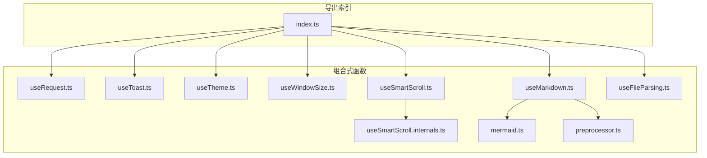
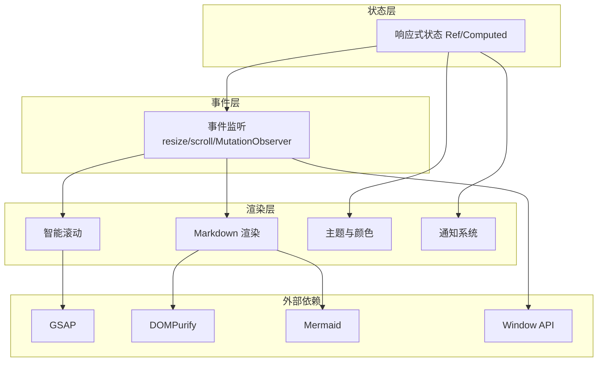
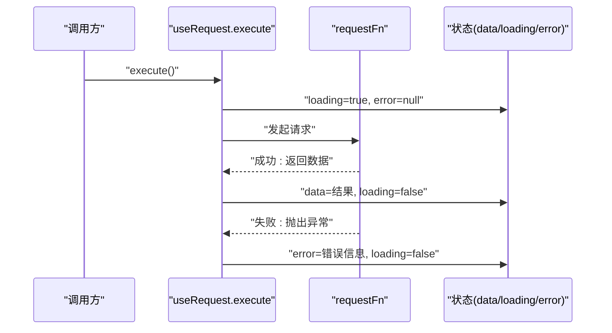
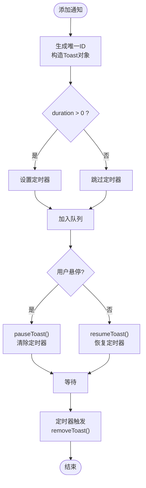
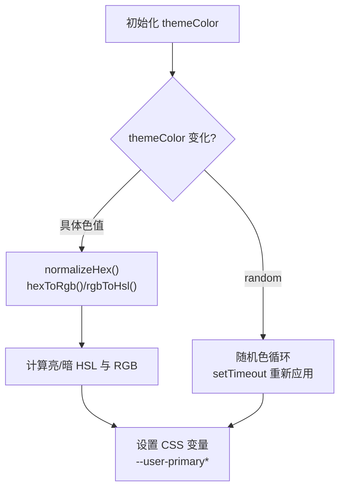
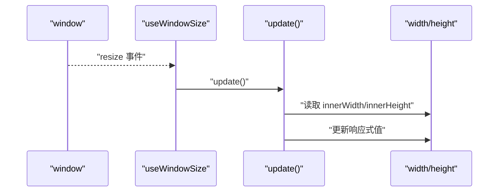
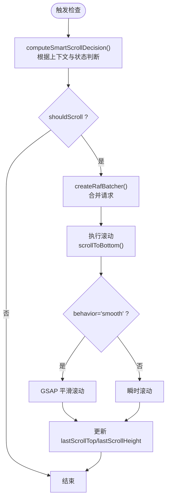
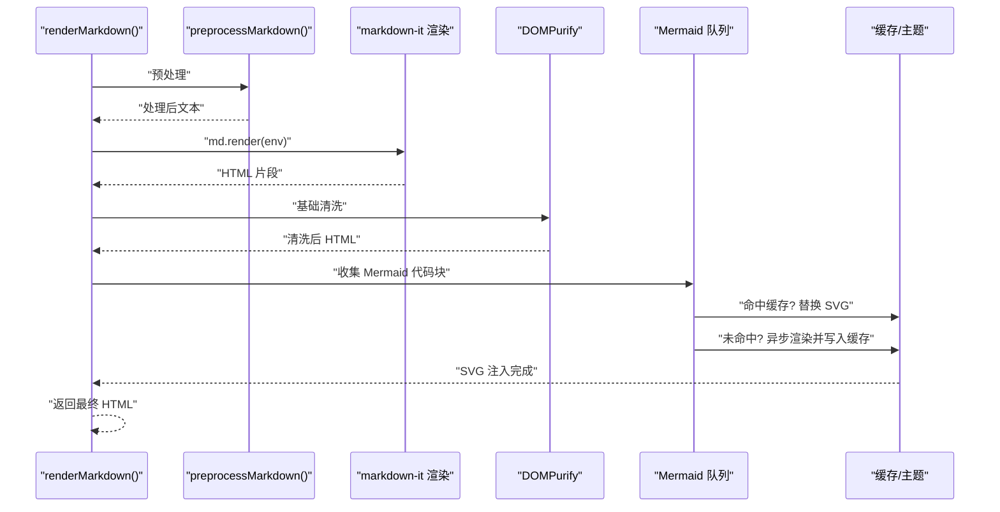
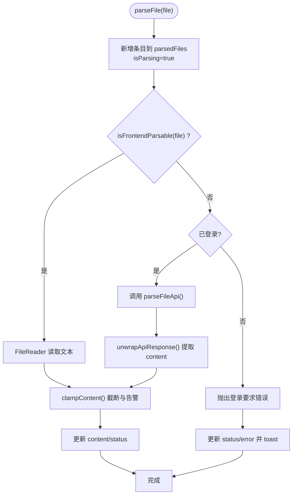
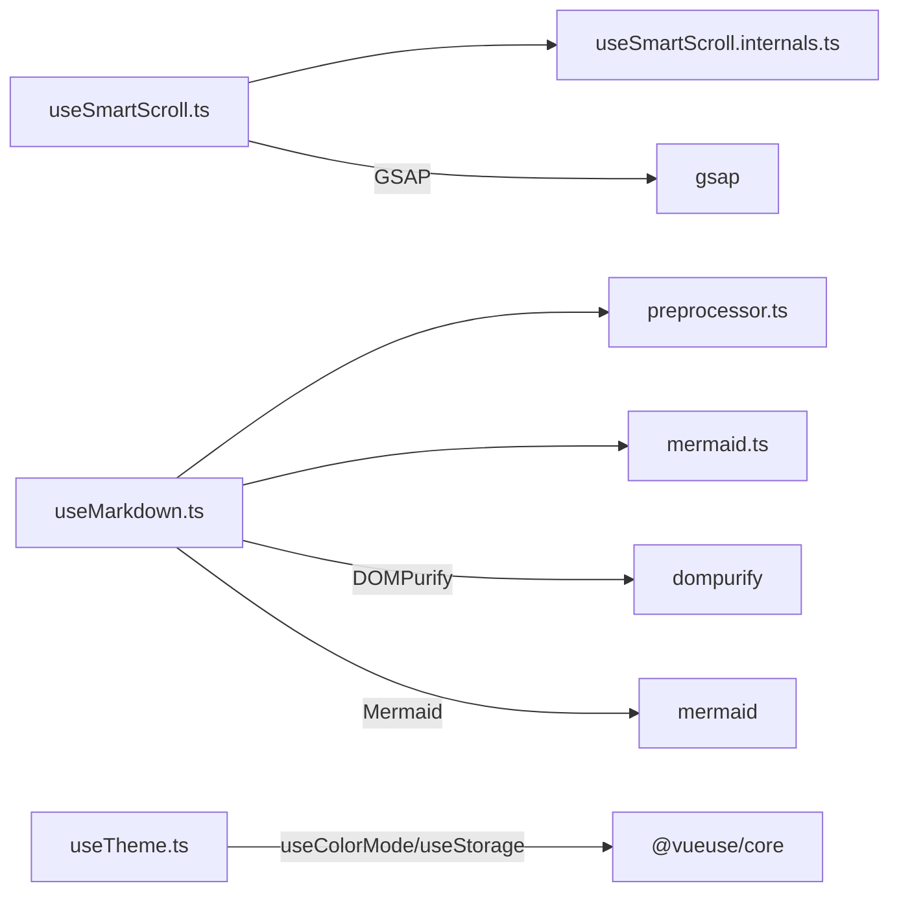

# 组合式函数

<cite>
**本文档引用的文件**
- [useRequest.ts](file://apps/frontend/src/composables/useRequest.ts)
- [useToast.ts](file://apps/frontend/src/composables/useToast.ts)
- [useTheme.ts](file://apps/frontend/src/composables/useTheme.ts)
- [useWindowSize.ts](file://apps/frontend/src/composables/useWindowSize.ts)
- [useSmartScroll.ts](file://apps/frontend/src/composables/useSmartScroll.ts)
- [useSmartScroll.internals.ts](file://apps/frontend/src/composables/useSmartScroll.internals.ts)
- [useMarkdown.ts](file://apps/frontend/src/composables/useMarkdown.ts)
- [mermaid.ts](file://apps/frontend/src/composables/markdown/mermaid.ts)
- [preprocessor.ts](file://apps/frontend/src/composables/markdown/preprocessor.ts)
- [useFileParsing.ts](file://apps/frontend/src/composables/useFileParsing.ts)
- [useRequest.spec.ts](file://apps/frontend/tests/composables/useRequest.spec.ts)
- [useTheme.spec.ts](file://apps/frontend/tests/composables/useTheme.spec.ts)
- [useSmartScroll.spec.ts](file://apps/frontend/tests/composables/useSmartScroll.spec.ts)
- [useMarkdown.spec.ts](file://apps/frontend/tests/composables/useMarkdown.spec.ts)
- [useFileParsing.spec.ts](file://apps/frontend/tests/composables/useFileParsing.spec.ts)
- [useWindowSize.spec.ts](file://apps/frontend/tests/composables/useWindowSize.spec.ts)
- [index.ts](file://apps/frontend/src/composables/index.ts)
</cite>

## 目录
1. [简介](#简介)
2. [项目结构](#项目结构)
3. [核心组件](#核心组件)
4. [架构总览](#架构总览)
5. [详细组件分析](#详细组件分析)
6. [依赖关系分析](#依赖关系分析)
7. [性能考量](#性能考量)
8. [故障排查指南](#故障排查指南)
9. [结论](#结论)
10. [附录](#附录)

## 简介
本文件系统性梳理前端组合式函数库中的关键能力，重点覆盖以下主题：
- useRequest 数据请求封装：请求状态管理、错误处理、重试机制、取消操作
- useToast 通知管理：消息类型分类、显示时长控制、自动消失、用户交互响应
- useTheme 主题切换：深色/浅色模式、动态主题变量、CSS 变量绑定、用户偏好保存
- useWindowSize 窗口尺寸监听：响应式布局适配、断点管理、性能优化
- 其他组合式函数：useSmartScroll 智能滚动、useMarkdown 渲染、useFileParsing 文件解析的实现原理与使用场景

## 项目结构
组合式函数集中位于前端应用的 composables 目录，按功能域划分清晰，便于复用与测试。

**图示来源**
- [index.ts:1-11](file://apps/frontend/src/composables/index.ts#L1-L11)
- [useRequest.ts:1-45](file://apps/frontend/src/composables/useRequest.ts#L1-L45)
- [useToast.ts:1-87](file://apps/frontend/src/composables/useToast.ts#L1-L87)
- [useTheme.ts:1-248](file://apps/frontend/src/composables/useTheme.ts#L1-L248)
- [useWindowSize.ts:1-45](file://apps/frontend/src/composables/useWindowSize.ts#L1-L45)
- [useSmartScroll.ts:1-442](file://apps/frontend/src/composables/useSmartScroll.ts#L1-L442)
- [useSmartScroll.internals.ts:1-109](file://apps/frontend/src/composables/useSmartScroll.internals.ts#L1-L109)
- [useMarkdown.ts:1-108](file://apps/frontend/src/composables/useMarkdown.ts#L1-L108)
- [mermaid.ts:1-188](file://apps/frontend/src/composables/markdown/mermaid.ts#L1-L188)
- [preprocessor.ts:1-47](file://apps/frontend/src/composables/markdown/preprocessor.ts#L1-L47)
- [useFileParsing.ts:1-122](file://apps/frontend/src/composables/useFileParsing.ts#L1-L122)

**章节来源**
- [index.ts:1-11](file://apps/frontend/src/composables/index.ts#L1-L11)

## 核心组件
- useRequest：封装请求执行、加载状态、错误处理，提供 execute 调用入口
- useToast：统一通知管理，支持多种类型、定时消失、暂停/恢复、动作回调
- useTheme：深浅色模式切换、主题色动态计算与 CSS 变量注入、随机主题色轮换
- useWindowSize：窗口尺寸监听与断点判断，支持 SSR/SSG 安全初始化
- useSmartScroll：智能滚动决策、RAF 批处理与节流、GSAP 平滑滚动、流式更新优化
- useMarkdown：Markdown 预处理、渲染管线、Mermaid 图表异步渲染与缓存
- useFileParsing：前后端混合解析策略、内容截断与告警、状态跟踪

**章节来源**
- [useRequest.ts:17-44](file://apps/frontend/src/composables/useRequest.ts#L17-L44)
- [useToast.ts:17-85](file://apps/frontend/src/composables/useToast.ts#L17-L85)
- [useTheme.ts:188-247](file://apps/frontend/src/composables/useTheme.ts#L188-L247)
- [useWindowSize.ts:6-34](file://apps/frontend/src/composables/useWindowSize.ts#L6-L34)
- [useSmartScroll.ts:33-441](file://apps/frontend/src/composables/useSmartScroll.ts#L33-L441)
- [useMarkdown.ts:14-107](file://apps/frontend/src/composables/useMarkdown.ts#L14-L107)
- [useFileParsing.ts:24-121](file://apps/frontend/src/composables/useFileParsing.ts#L24-L121)

## 架构总览
组合式函数通过 Vue 响应式系统协调状态，结合浏览器 API（window、ResizeObserver、MutationObserver）、第三方库（GSAP、DOMPurify、Mermaid）实现高性能与可维护性的 UI 交互与数据处理。

**图示来源**
- [useSmartScroll.ts:304-342](file://apps/frontend/src/composables/useSmartScroll.ts#L304-L342)
- [useMarkdown.ts:27-96](file://apps/frontend/src/composables/useMarkdown.ts#L27-L96)
- [mermaid.ts:27-50](file://apps/frontend/src/composables/markdown/mermaid.ts#L27-L50)
- [useWindowSize.ts:18-31](file://apps/frontend/src/composables/useWindowSize.ts#L18-L31)
- [useTheme.ts:132-186](file://apps/frontend/src/composables/useTheme.ts#L132-L186)
- [useToast.ts:17-85](file://apps/frontend/src/composables/useToast.ts#L17-L85)

## 详细组件分析

### useRequest 数据请求封装
- 请求状态管理
  - data：存储请求结果，初始为空
  - loading：请求进行中标志
  - error：错误信息，异常时记录或回退到国际化文案
- 错误处理
  - 捕获异常并设置 error，同时在 finally 中关闭 loading
  - 非 Error 类型统一转为国际化默认文案
- 重试机制
  - 提供 execute 函数，可多次调用；每次调用会重置 error 并更新 data
  - 未内置自动重试逻辑，可通过业务侧再次调用 execute 实现
- 取消操作
  - 未提供显式取消能力；如需取消，可在 requestFn 内集成 AbortController 或 Promise 包装

**图示来源**
- [useRequest.ts:24-36](file://apps/frontend/src/composables/useRequest.ts#L24-L36)
- [useRequest.ts:28-35](file://apps/frontend/src/composables/useRequest.ts#L28-L35)

**章节来源**
- [useRequest.ts:17-44](file://apps/frontend/src/composables/useRequest.ts#L17-L44)
- [useRequest.spec.ts:10-116](file://apps/frontend/tests/composables/useRequest.spec.ts#L10-L116)

### useToast 通知管理
- 消息类型分类
  - success、error、info、warning 四类快捷方法
- 显示时长控制
  - duration 参数控制自动消失时长（毫秒），0 表示不自动消失
- 自动消失与计时器
  - addToast 创建定时器，超时后 removeToast 移除
- 用户交互响应
  - pauseToast：暂停计时器（悬停时）
  - resumeToast：恢复计时器（移开时）

**图示来源**
- [useToast.ts:28-45](file://apps/frontend/src/composables/useToast.ts#L28-L45)
- [useToast.ts:50-69](file://apps/frontend/src/composables/useToast.ts#L50-L69)

**章节来源**
- [useToast.ts:17-85](file://apps/frontend/src/composables/useToast.ts#L17-L85)

### useTheme 主题切换
- 深色/浅色模式
  - 基于 @vueuse/core 的 useColorMode，通过 class 属性切换
- 动态主题变量
  - 将十六进制主题色转换为 HSL，限定饱和度与亮度范围，生成亮/暗两套变量
  - 注入 CSS 变量 --user-primary(-dark)、--user-primary-foreground(-dark)、--user-primary-rgb(-dark)
- CSS 变量绑定
  - 在 documentElement 上设置/移除 CSS 变量，供全局样式使用
- 用户偏好保存
  - 使用 useStorage 将主题色持久化到本地存储
- 随机主题色轮换
  - 随机选择预设色板，定时器每 30-60 分钟切换一次，避免频繁干扰

**图示来源**
- [useTheme.ts:188-247](file://apps/frontend/src/composables/useTheme.ts#L188-L247)
- [useTheme.ts:132-186](file://apps/frontend/src/composables/useTheme.ts#L132-L186)
- [useTheme.spec.ts:28-50](file://apps/frontend/tests/composables/useTheme.spec.ts#L28-L50)

**章节来源**
- [useTheme.ts:188-247](file://apps/frontend/src/composables/useTheme.ts#L188-L247)
- [useTheme.spec.ts:16-50](file://apps/frontend/tests/composables/useTheme.spec.ts#L16-L50)

### useWindowSize 窗口尺寸监听
- 响应式布局适配
  - 提供 width/height 响应式引用，随窗口 resize 更新
- 断点管理
  - useIsMobile 基于宽度阈值（768）判断移动端
- 性能优化
  - 非组件上下文时仅在 window 存在时添加监听
  - 生命周期内注册/注销事件，避免内存泄漏

**图示来源**
- [useWindowSize.ts:18-31](file://apps/frontend/src/composables/useWindowSize.ts#L18-L31)
- [useWindowSize.ts:39-44](file://apps/frontend/src/composables/useWindowSize.ts#L39-L44)

**章节来源**
- [useWindowSize.ts:6-34](file://apps/frontend/src/composables/useWindowSize.ts#L6-L34)
- [useWindowSize.spec.ts:42-89](file://apps/frontend/tests/composables/useWindowSize.spec.ts#L42-L89)

### useSmartScroll 智能滚动
- 滚动容器与状态
  - 通过 ref 接收滚动容器，暴露 isSticking、isAutoScrollEnabled、isUserScrolledUp、isScrollable、isStreamingMode
- 智能决策
  - 根据上下文（streaming/new-message/content-change/manual/resize）与当前状态决定是否滚动及滚动方式
  - RAF 批处理器合并高频滚动请求，降低重绘压力
- 平滑与瞬时滚动
  - 使用 GSAP 平滑滚动，距离极近时走瞬时滚动路径
  - 程序化滚动期间屏蔽用户向上滚动的自动恢复
- 事件与观察者
  - 事件：passive scroll 监听，RAF 节流处理
  - 观察者：ResizeObserver 监听容器尺寸变化；MutationObserver 监听内容高度变化
- 生命周期
  - onMounted 初始化监听，onUnmounted 清理资源（事件、观察者、批处理器、定时器）

**图示来源**
- [useSmartScroll.ts:182-195](file://apps/frontend/src/composables/useSmartScroll.ts#L182-L195)
- [useSmartScroll.internals.ts:28-64](file://apps/frontend/src/composables/useSmartScroll.internals.ts#L28-L64)
- [useSmartScroll.internals.ts:66-94](file://apps/frontend/src/composables/useSmartScroll.internals.ts#L66-L94)

**章节来源**
- [useSmartScroll.ts:33-441](file://apps/frontend/src/composables/useSmartScroll.ts#L33-L441)
- [useSmartScroll.internals.ts:1-109](file://apps/frontend/src/composables/useSmartScroll.internals.ts#L1-L109)
- [useSmartScroll.spec.ts:76-280](file://apps/frontend/tests/composables/useSmartScroll.spec.ts#L76-L280)

### useMarkdown 渲染
- 渲染流程
  - 预处理：保护代码块、修复加粗/斜体边界、规范化块级公式
  - 渲染：使用 markdown-it 插件链生成 HTML
  - 清洗：DOMPurify 基础清洗，保护占位符
  - Mermaid：识别闭合代码块，异步渲染并缓存 SVG，支持主题感知
- 主题联动
  - 监听主题变化，清空 Mermaid 缓存，保证图表与主题一致
- 错误兜底
  - 渲染异常捕获并返回错误提示

**图示来源**
- [useMarkdown.ts:27-96](file://apps/frontend/src/composables/useMarkdown.ts#L27-L96)
- [preprocessor.ts:4-46](file://apps/frontend/src/composables/markdown/preprocessor.ts#L4-L46)
- [mermaid.ts:137-187](file://apps/frontend/src/composables/markdown/mermaid.ts#L137-L187)

**章节来源**
- [useMarkdown.ts:14-107](file://apps/frontend/src/composables/useMarkdown.ts#L14-L107)
- [preprocessor.ts:1-47](file://apps/frontend/src/composables/markdown/preprocessor.ts#L1-L47)
- [mermaid.ts:1-188](file://apps/frontend/src/composables/markdown/mermaid.ts#L1-L188)
- [useMarkdown.spec.ts:12-39](file://apps/frontend/tests/composables/useMarkdown.spec.ts#L12-L39)

### useFileParsing 文件解析
- 解析策略
  - 前端可解析：直接 FileReader 读取文本
  - 后端复杂解析：鉴权后调用 /api/upload/parse，解包响应内容
- 状态管理
  - parsedFiles 数组记录每个文件的 id/name/size/type/content/status/error
  - isParsing 标识整体解析状态
- 内容截断与告警
  - 超过最大字符数时截断，并通过 toast 警告
- 错误处理
  - 记录错误状态与消息，统一 toast 提示

**图示来源**
- [useFileParsing.ts:47-95](file://apps/frontend/src/composables/useFileParsing.ts#L47-L95)
- [useFileParsing.ts:97-104](file://apps/frontend/src/composables/useFileParsing.ts#L97-L104)

**章节来源**
- [useFileParsing.ts:24-121](file://apps/frontend/src/composables/useFileParsing.ts#L24-L121)
- [useFileParsing.spec.ts:38-84](file://apps/frontend/tests/composables/useFileParsing.spec.ts#L38-L84)

## 依赖关系分析
- 组件内聚与耦合
  - useSmartScroll 内部拆分 internals，降低主逻辑复杂度，提升可测试性
  - useMarkdown 将 Mermaid 与预处理拆分为独立模块，职责清晰
- 外部依赖
  - GSAP：用于平滑滚动动画
  - DOMPurify：XSS 清洗
  - Mermaid：图表渲染与主题适配
  - @vueuse/core：颜色模式与本地存储
- 循环依赖
  - 未发现直接循环导入；各模块通过相对路径引用，结构清晰

**图示来源**
- [useSmartScroll.ts:4-12](file://apps/frontend/src/composables/useSmartScroll.ts#L4-L12)
- [useMarkdown.ts:2-9](file://apps/frontend/src/composables/useMarkdown.ts#L2-L9)
- [useTheme.ts:1](file://apps/frontend/src/composables/useTheme.ts#L1)

**章节来源**
- [useSmartScroll.ts:1-442](file://apps/frontend/src/composables/useSmartScroll.ts#L1-L442)
- [useMarkdown.ts:1-108](file://apps/frontend/src/composables/useMarkdown.ts#L1-L108)
- [useTheme.ts:1-248](file://apps/frontend/src/composables/useTheme.ts#L1-L248)

## 性能考量
- useSmartScroll
  - RAF 批处理与节流：减少高频滚动触发次数，避免掉帧
  - 程序化滚动标记：在动画期间屏蔽用户交互，避免冲突
  - ResizeObserver/MutationObserver：仅在需要时启用，避免不必要的观测
- useMarkdown
  - Mermaid 缓存：基于主题与哈希的缓存，避免重复渲染
  - DOMPurify：在渲染后统一清洗，降低 XSS 风险
- useWindowSize
  - 条件注册事件：非组件上下文仅在 window 存在时注册，避免服务端渲染问题
- useRequest
  - 无额外节流/防抖：适合由调用方控制触发频率，避免过度封装

[本节为通用性能建议，无需特定文件引用]

## 故障排查指南
- useRequest
  - 症状：连续请求后 error 不刷新
  - 处理：确认每次 execute 前后 error 是否被正确重置；查看测试用例中“重置 error”的断言
  - 参考测试：[useRequest.spec.ts:78-95](file://apps/frontend/tests/composables/useRequest.spec.ts#L78-L95)
- useToast
  - 症状：通知不消失或重复出现
  - 处理：检查 duration 与定时器生命周期；确认 pause/resume 的配对使用
  - 参考测试：[useToast.ts:28-45](file://apps/frontend/src/composables/useToast.ts#L28-L45)
- useTheme
  - 症状：CSS 变量未生效
  - 处理：确认 normalizeHex 输入合法；检查 watch 回调是否执行；验证随机色定时器
  - 参考测试：[useTheme.spec.ts:28-50](file://apps/frontend/tests/composables/useTheme.spec.ts#L28-L50)
- useWindowSize
  - 症状：SSR 下初始化异常
  - 处理：确认在客户端上下文再注册事件；参考非组件环境分支
  - 参考测试：[useWindowSize.spec.ts:73-89](file://apps/frontend/tests/composables/useWindowSize.spec.ts#L73-L89)
- useSmartScroll
  - 症状：滚动冲突或无法自动回到底部
  - 处理：检查 isProgrammaticScroll 标记与用户滚动方向；确认 RAF 节流与批处理
  - 参考测试：[useSmartScroll.spec.ts:184-233](file://apps/frontend/tests/composables/useSmartScroll.spec.ts#L184-L233)
- useMarkdown
  - 症状：Mermaid 图表不显示或主题不匹配
  - 处理：确认主题变化时缓存清空；检查 initializeMermaid 调用与主题参数
  - 参考测试：[useMarkdown.spec.ts:12-39](file://apps/frontend/tests/composables/useMarkdown.spec.ts#L12-L39)
- useFileParsing
  - 症状：复杂文件解析失败
  - 处理：确认登录状态；检查 parseFileApi 返回结构；查看截断与告警逻辑
  - 参考测试：[useFileParsing.spec.ts:52-83](file://apps/frontend/tests/composables/useFileParsing.spec.ts#L52-L83)

**章节来源**
- [useRequest.spec.ts:78-95](file://apps/frontend/tests/composables/useRequest.spec.ts#L78-L95)
- [useToast.ts:28-45](file://apps/frontend/src/composables/useToast.ts#L28-L45)
- [useTheme.spec.ts:28-50](file://apps/frontend/tests/composables/useTheme.spec.ts#L28-L50)
- [useWindowSize.spec.ts:73-89](file://apps/frontend/tests/composables/useWindowSize.spec.ts#L73-L89)
- [useSmartScroll.spec.ts:184-233](file://apps/frontend/tests/composables/useSmartScroll.spec.ts#L184-L233)
- [useMarkdown.spec.ts:12-39](file://apps/frontend/tests/composables/useMarkdown.spec.ts#L12-L39)
- [useFileParsing.spec.ts:52-83](file://apps/frontend/tests/composables/useFileParsing.spec.ts#L52-L83)

## 结论
本组合式函数库围绕“状态驱动 + 浏览器 API + 第三方库”构建，具备良好的可测试性与可扩展性。各模块职责明确，通过响应式状态与事件监听实现高性能交互体验。建议在业务层按需组合使用，并遵循各模块的生命周期与性能约束。

[本节为总结性内容，无需特定文件引用]

## 附录
- 导出索引：统一导出常用组合式函数，便于按需引入
  - 参考：[index.ts:1-11](file://apps/frontend/src/composables/index.ts#L1-L11)

**章节来源**
- [index.ts:1-11](file://apps/frontend/src/composables/index.ts#L1-L11)