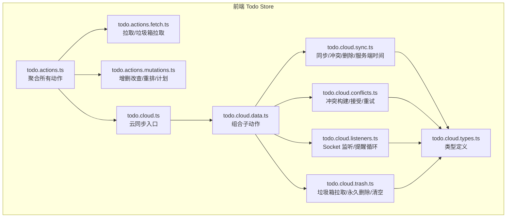
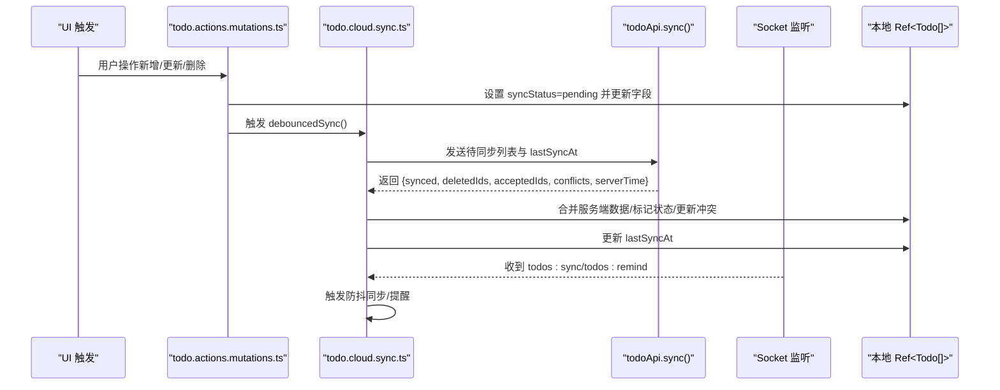
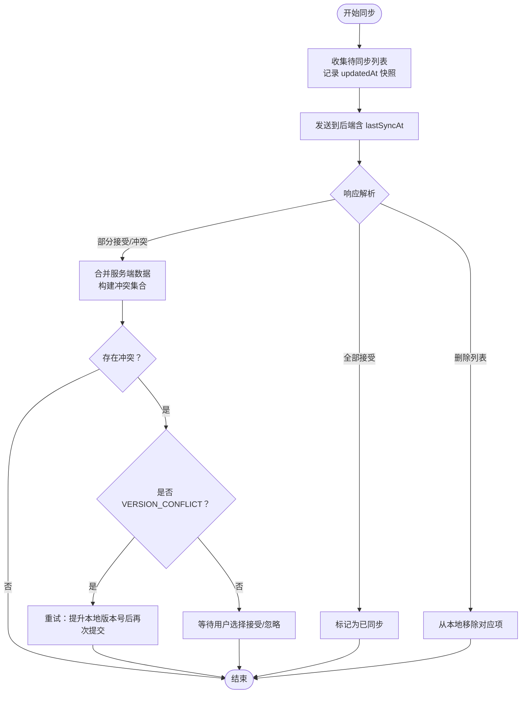
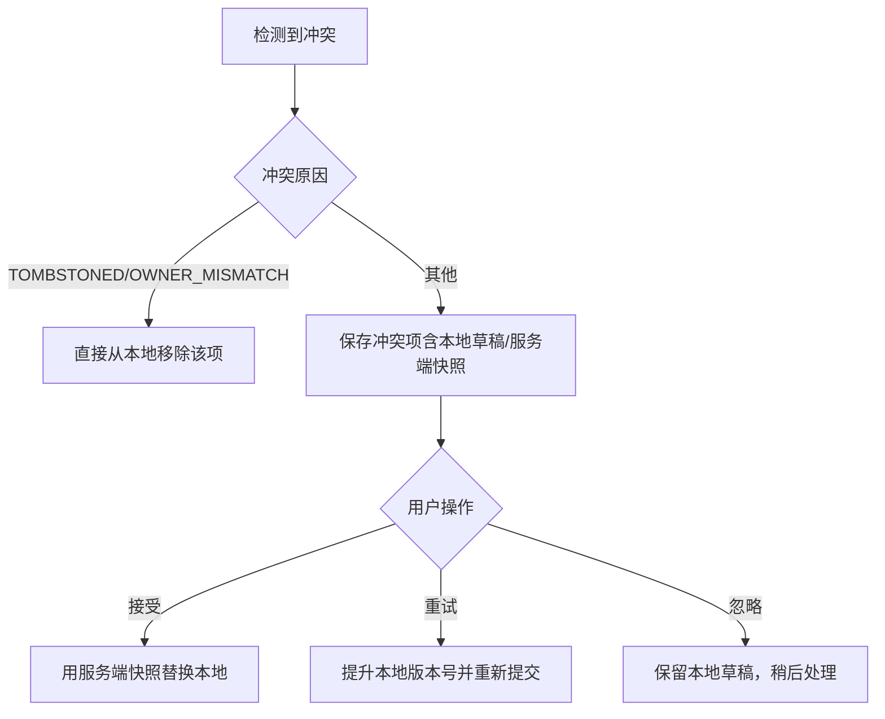
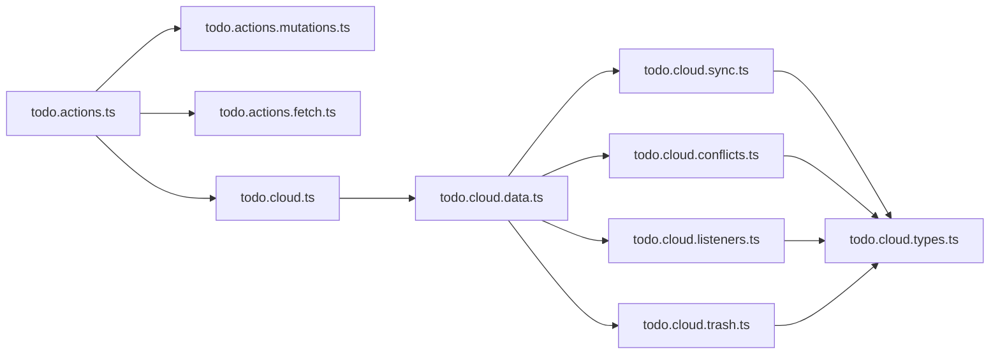

# 缓存策略

<cite>
**本文引用的文件**
- [apps/frontend/src/features/todo/stores/todo.cloud.ts](file://apps/frontend/src/features/todo/stores/todo.cloud.ts)
- [apps/frontend/src/features/todo/stores/todo.cloud.data.ts](file://apps/frontend/src/features/todo/stores/todo.cloud.data.ts)
- [apps/frontend/src/features/todo/stores/todo.cloud.sync.ts](file://apps/frontend/src/features/todo/stores/todo.cloud.sync.ts)
- [apps/frontend/src/features/todo/stores/todo.cloud.conflicts.ts](file://apps/frontend/src/features/todo/stores/todo.cloud.conflicts.ts)
- [apps/frontend/src/features/todo/stores/todo.cloud.listeners.ts](file://apps/frontend/src/features/todo/stores/todo.cloud.listeners.ts)
- [apps/frontend/src/features/todo/stores/todo.cloud.trash.ts](file://apps/frontend/src/features/todo/stores/todo.cloud.trash.ts)
- [apps/frontend/src/features/todo/stores/todo.actions.ts](file://apps/frontend/src/features/todo/stores/todo.actions.ts)
- [apps/frontend/src/features/todo/stores/todo.actions.fetch.ts](file://apps/frontend/src/features/todo/stores/todo.actions.fetch.ts)
- [apps/frontend/src/features/todo/stores/todo.actions.mutations.ts](file://apps/frontend/src/features/todo/stores/todo.actions.mutations.ts)
- [apps/frontend/src/features/todo/stores/todo.cloud.types.ts](file://apps/frontend/src/features/todo/stores/todo.cloud.types.ts)
</cite>

## 目录
1. [简介](#简介)
2. [项目结构](#项目结构)
3. [核心组件](#核心组件)
4. [架构总览](#架构总览)
5. [详细组件分析](#详细组件分析)
6. [依赖关系分析](#依赖关系分析)
7. [性能考量](#性能考量)
8. [故障排除指南](#故障排除指南)
9. [结论](#结论)
10. [附录](#附录)

## 简介
本文件系统性梳理前端 Todo 应用的缓存与同步策略，重点覆盖以下方面：
- 查询缓存机制：缓存键生成、数据存储位置、缓存失效策略
- 数据过期管理：TTL 时间设置、LRU 淘汰算法、手动清理接口
- 缓存更新策略：乐观更新、悲观更新、条件更新、版本控制
- 冲突解决机制：客户端优先、服务器优先、合并策略、用户选择界面
- 性能优化：内存管理、存储限制、异步加载、预加载策略
- 调试工具、监控指标、故障排除指南

说明：当前仓库前端未发现显式的“本地持久化缓存”（如 IndexedDB、LocalStorage）实现；应用采用“内存态 + 后端同步”的模式，通过 WebSocket 推送与后端进行实时同步，并在本地维护一个内存中的 Todo 列表。因此，本文将围绕“内存态缓存 + 同步策略 + 冲突处理 + 预加载/防抖”展开。

## 项目结构
前端 Todo 功能以“模块化 Store + 组合式 Action”的方式组织，核心位于 todo 子模块的 stores 目录中。云同步相关逻辑集中在 todo.cloud.* 文件中，配合 todo.actions.* 提供增删改查与 UI 行为。

图表来源
- [apps/frontend/src/features/todo/stores/todo.actions.ts:1-105](file://apps/frontend/src/features/todo/stores/todo.actions.ts#L1-L105)
- [apps/frontend/src/features/todo/stores/todo.actions.fetch.ts:1-69](file://apps/frontend/src/features/todo/stores/todo.actions.fetch.ts#L1-L69)
- [apps/frontend/src/features/todo/stores/todo.actions.mutations.ts:1-417](file://apps/frontend/src/features/todo/stores/todo.actions.mutations.ts#L1-L417)
- [apps/frontend/src/features/todo/stores/todo.cloud.ts:1-44](file://apps/frontend/src/features/todo/stores/todo.cloud.ts#L1-L44)
- [apps/frontend/src/features/todo/stores/todo.cloud.data.ts:1-43](file://apps/frontend/src/features/todo/stores/todo.cloud.data.ts#L1-L43)
- [apps/frontend/src/features/todo/stores/todo.cloud.sync.ts:1-214](file://apps/frontend/src/features/todo/stores/todo.cloud.sync.ts#L1-L214)
- [apps/frontend/src/features/todo/stores/todo.cloud.conflicts.ts:1-91](file://apps/frontend/src/features/todo/stores/todo.cloud.conflicts.ts#L1-L91)
- [apps/frontend/src/features/todo/stores/todo.cloud.listeners.ts:1-90](file://apps/frontend/src/features/todo/stores/todo.cloud.listeners.ts#L1-L90)
- [apps/frontend/src/features/todo/stores/todo.cloud.trash.ts:1-81](file://apps/frontend/src/features/todo/stores/todo.cloud.trash.ts#L1-L81)
- [apps/frontend/src/features/todo/stores/todo.cloud.types.ts:1-17](file://apps/frontend/src/features/todo/stores/todo.cloud.types.ts#L1-L17)

章节来源
- [apps/frontend/src/features/todo/stores/todo.actions.ts:1-105](file://apps/frontend/src/features/todo/stores/todo.actions.ts#L1-L105)
- [apps/frontend/src/features/todo/stores/todo.cloud.ts:1-44](file://apps/frontend/src/features/todo/stores/todo.cloud.ts#L1-L44)

## 核心组件
- 云同步入口与组合器
  - 入口函数负责导出统一的同步、冲突处理、监听、垃圾箱操作等方法，内部委托给具体子模块。
  - 参考路径：[apps/frontend/src/features/todo/stores/todo.cloud.ts:1-44](file://apps/frontend/src/features/todo/stores/todo.cloud.ts#L1-L44)
- 云同步数据组合器
  - 将同步、冲突、监听、垃圾箱等子动作组合为统一的数据依赖对象，便于复用与测试。
  - 参考路径：[apps/frontend/src/features/todo/stores/todo.cloud.data.ts:1-43](file://apps/frontend/src/features/todo/stores/todo.cloud.data.ts#L1-L43)
- 同步动作（含防抖、冷却、重试）
  - 实现同步主流程、冲突识别、删除处理、服务端时间回写、错误重试与冷却控制。
  - 参考路径：[apps/frontend/src/features/todo/stores/todo.cloud.sync.ts:1-214](file://apps/frontend/src/features/todo/stores/todo.cloud.sync.ts#L1-L214)
- 冲突构建与处理
  - 构建冲突项、接受冲突（含删除/替换）、重试冲突（基于版本号）。
  - 参考路径：[apps/frontend/src/features/todo/stores/todo.cloud.conflicts.ts:1-91](file://apps/frontend/src/features/todo/stores/todo.cloud.conflicts.ts#L1-L91)
- Socket 监听与本地提醒循环
  - 订阅 todos:sync/todos:remind 事件，触发本地同步或提醒通知。
  - 参考路径：[apps/frontend/src/features/todo/stores/todo.cloud.listeners.ts:1-90](file://apps/frontend/src/features/todo/stores/todo.cloud.listeners.ts#L1-L90)
- 垃圾箱操作
  - 拉取垃圾箱、永久删除、清空垃圾箱；与后端保持一致。
  - 参考路径：[apps/frontend/src/features/todo/stores/todo.cloud.trash.ts:1-81](file://apps/frontend/src/features/todo/stores/todo.cloud.trash.ts#L1-L81)
- 动作聚合与调用链
  - todo.actions.ts 聚合 fetch/mutations/ai/ui 等动作，并注入 sync/debouncedSync 等能力。
  - 参考路径：[apps/frontend/src/features/todo/stores/todo.actions.ts:1-105](file://apps/frontend/src/features/todo/stores/todo.actions.ts#L1-L105)
- 拉取与垃圾箱拉取
  - fetchTodos 在认证且远端源时触发同步；fetchTrash 拉取远端垃圾箱并合并到本地。
  - 参考路径：[apps/frontend/src/features/todo/stores/todo.actions.fetch.ts:1-69](file://apps/frontend/src/features/todo/stores/todo.actions.fetch.ts#L1-L69)
- 增删改查与重排/计划
  - 所有变更均设置 syncStatus 为 pending，并在必要时触发防抖同步。
  - 参考路径：[apps/frontend/src/features/todo/stores/todo.actions.mutations.ts:1-417](file://apps/frontend/src/features/todo/stores/todo.actions.mutations.ts#L1-L417)
- 类型定义
  - 定义云同步依赖的 Ref 类型、Todo 结构、冲突结构等。
  - 参考路径：[apps/frontend/src/features/todo/stores/todo.cloud.types.ts:1-17](file://apps/frontend/src/features/todo/stores/todo.cloud.types.ts#L1-L17)

章节来源
- [apps/frontend/src/features/todo/stores/todo.cloud.ts:1-44](file://apps/frontend/src/features/todo/stores/todo.cloud.ts#L1-L44)
- [apps/frontend/src/features/todo/stores/todo.cloud.data.ts:1-43](file://apps/frontend/src/features/todo/stores/todo.cloud.data.ts#L1-L43)
- [apps/frontend/src/features/todo/stores/todo.cloud.sync.ts:1-214](file://apps/frontend/src/features/todo/stores/todo.cloud.sync.ts#L1-L214)
- [apps/frontend/src/features/todo/stores/todo.cloud.conflicts.ts:1-91](file://apps/frontend/src/features/todo/stores/todo.cloud.conflicts.ts#L1-L91)
- [apps/frontend/src/features/todo/stores/todo.cloud.listeners.ts:1-90](file://apps/frontend/src/features/todo/stores/todo.cloud.listeners.ts#L1-L90)
- [apps/frontend/src/features/todo/stores/todo.cloud.trash.ts:1-81](file://apps/frontend/src/features/todo/stores/todo.cloud.trash.ts#L1-L81)
- [apps/frontend/src/features/todo/stores/todo.actions.ts:1-105](file://apps/frontend/src/features/todo/stores/todo.actions.ts#L1-L105)
- [apps/frontend/src/features/todo/stores/todo.actions.fetch.ts:1-69](file://apps/frontend/src/features/todo/stores/todo.actions.fetch.ts#L1-L69)
- [apps/frontend/src/features/todo/stores/todo.actions.mutations.ts:1-417](file://apps/frontend/src/features/todo/stores/todo.actions.mutations.ts#L1-L417)
- [apps/frontend/src/features/todo/stores/todo.cloud.types.ts:1-17](file://apps/frontend/src/features/todo/stores/todo.cloud.types.ts#L1-L17)

## 架构总览
前端采用“内存态 + 后端同步”的缓存模型：
- 内存态：本地 Ref<Todo[]> 作为唯一真相源
- 同步通道：WebSocket 事件推送 + HTTP 同步请求
- 冲突处理：基于服务端返回的冲突集合与版本信息
- 过期与淘汰：无显式 TTL/LRU；通过 lastSyncAt 与服务端时间对齐，结合防抖/冷却避免频繁请求

图表来源
- [apps/frontend/src/features/todo/stores/todo.actions.mutations.ts:1-417](file://apps/frontend/src/features/todo/stores/todo.actions.mutations.ts#L1-L417)
- [apps/frontend/src/features/todo/stores/todo.cloud.sync.ts:1-214](file://apps/frontend/src/features/todo/stores/todo.cloud.sync.ts#L1-L214)
- [apps/frontend/src/features/todo/stores/todo.cloud.listeners.ts:1-90](file://apps/frontend/src/features/todo/stores/todo.cloud.listeners.ts#L1-L90)

## 详细组件分析

### 查询缓存机制
- 缓存键生成
  - 当前未实现显式查询缓存键；所有查询均通过 HTTP 接口或 Socket 事件驱动，本地仅维护内存列表。
  - 同步时使用 pending 列表与 lastSyncAt 作为“增量查询”的依据。
- 数据存储位置
  - 本地内存：Ref<Todo[]>；远端：后端数据库
  - 垃圾箱数据通过独立接口拉取并合并至本地列表
- 缓存失效策略
  - 无显式 TTL；通过 lastSyncAt 与服务端时间对齐，结合 Socket 推送触发失效与刷新
  - 登录切换或用户变更时，重置 lastSyncAt 并触发全量同步

章节来源
- [apps/frontend/src/features/todo/stores/todo.cloud.sync.ts:1-214](file://apps/frontend/src/features/todo/stores/todo.cloud.sync.ts#L1-L214)
- [apps/frontend/src/features/todo/stores/todo.cloud.trash.ts:1-81](file://apps/frontend/src/features/todo/stores/todo.cloud.trash.ts#L1-L81)
- [apps/frontend/src/features/todo/stores/todo.actions.fetch.ts:1-69](file://apps/frontend/src/features/todo/stores/todo.actions.fetch.ts#L1-L69)

### 数据过期管理
- TTL 时间设置
  - 未实现前端 TTL；lastSyncAt 仅用于增量同步的时间锚点
- LRU 淘汰算法
  - 未实现 LRU；当前策略为“全量替换 + 冲突合并”
- 手动清理接口
  - 清空垃圾箱：clearTrash
  - 永久删除：deleteTodoPermanently（递归删除子项）

章节来源
- [apps/frontend/src/features/todo/stores/todo.cloud.trash.ts:1-81](file://apps/frontend/src/features/todo/stores/todo.cloud.trash.ts#L1-L81)
- [apps/frontend/src/features/todo/stores/todo.cloud.sync.ts:1-214](file://apps/frontend/src/features/todo/stores/todo.cloud.sync.ts#L1-L214)

### 缓存更新策略
- 乐观更新
  - 用户操作立即反映在本地（设置 syncStatus=pending），随后异步与后端对齐
- 悲观更新
  - 未实现；当前策略偏向乐观
- 条件更新
  - 使用 pending 列表与 updatedAt 快照比对，确保仅在未被其他客户端修改的前提下接受服务端结果
- 版本控制
  - 服务端返回冲突时携带 serverVersion；重试冲突时可将本地版本号对齐后再次提交

图表来源
- [apps/frontend/src/features/todo/stores/todo.cloud.sync.ts:1-214](file://apps/frontend/src/features/todo/stores/todo.cloud.sync.ts#L1-L214)
- [apps/frontend/src/features/todo/stores/todo.cloud.conflicts.ts:1-91](file://apps/frontend/src/features/todo/stores/todo.cloud.conflicts.ts#L1-L91)

章节来源
- [apps/frontend/src/features/todo/stores/todo.cloud.sync.ts:1-214](file://apps/frontend/src/features/todo/stores/todo.cloud.sync.ts#L1-L214)
- [apps/frontend/src/features/todo/stores/todo.cloud.conflicts.ts:1-91](file://apps/frontend/src/features/todo/stores/todo.cloud.conflicts.ts#L1-L91)

### 冲突解决机制
- 客户端优先
  - 未实现；当前冲突处理以服务端为准，支持用户接受或重试
- 服务器优先
  - 支持：acceptSyncConflict 对于非 TOMBSTONED/OWNER_MISMATCH 的冲突，直接替换为服务端快照
- 合并策略
  - 未实现；当前采用“接受服务端或重试”的二元决策
- 用户选择界面
  - 冲突集合保存在 syncConflicts 中，可通过 accept/retry/clear 进行交互

图表来源
- [apps/frontend/src/features/todo/stores/todo.cloud.conflicts.ts:1-91](file://apps/frontend/src/features/todo/stores/todo.cloud.conflicts.ts#L1-L91)

章节来源
- [apps/frontend/src/features/todo/stores/todo.cloud.conflicts.ts:1-91](file://apps/frontend/src/features/todo/stores/todo.cloud.conflicts.ts#L1-L91)

### 性能优化
- 内存管理
  - 本地仅维护内存列表；删除/恢复/重排等操作在内存中完成，减少 IO
- 存储限制
  - 未实现前端持久化存储；建议后续引入 IndexedDB 并设置容量上限
- 异步加载
  - Socket 模块按需动态导入，避免首屏阻塞
- 预加载策略
  - fetchTodos 在认证且远端源时触发同步；Socket 监听收到 todos:sync 事件后触发防抖同步

章节来源
- [apps/frontend/src/features/todo/stores/todo.cloud.listeners.ts:1-90](file://apps/frontend/src/features/todo/stores/todo.cloud.listeners.ts#L1-L90)
- [apps/frontend/src/features/todo/stores/todo.actions.fetch.ts:1-69](file://apps/frontend/src/features/todo/stores/todo.actions.fetch.ts#L1-L69)

## 依赖关系分析
- 组件耦合
  - todo.actions.ts 聚合多类动作，依赖 todo.cloud.* 与 todo.actions.mutations.ts
  - todo.cloud.data.ts 将多个子动作组合为统一数据依赖，降低上层耦合
- 外部依赖
  - Socket 事件：todos:sync、todos:remind
  - HTTP 接口：同步、垃圾箱拉取、永久删除、清空垃圾箱
- 循环依赖
  - 未见循环依赖；各模块职责清晰

图表来源
- [apps/frontend/src/features/todo/stores/todo.actions.ts:1-105](file://apps/frontend/src/features/todo/stores/todo.actions.ts#L1-L105)
- [apps/frontend/src/features/todo/stores/todo.cloud.ts:1-44](file://apps/frontend/src/features/todo/stores/todo.cloud.ts#L1-L44)
- [apps/frontend/src/features/todo/stores/todo.cloud.data.ts:1-43](file://apps/frontend/src/features/todo/stores/todo.cloud.data.ts#L1-L43)
- [apps/frontend/src/features/todo/stores/todo.cloud.sync.ts:1-214](file://apps/frontend/src/features/todo/stores/todo.cloud.sync.ts#L1-L214)
- [apps/frontend/src/features/todo/stores/todo.cloud.conflicts.ts:1-91](file://apps/frontend/src/features/todo/stores/todo.cloud.conflicts.ts#L1-L91)
- [apps/frontend/src/features/todo/stores/todo.cloud.listeners.ts:1-90](file://apps/frontend/src/features/todo/stores/todo.cloud.listeners.ts#L1-L90)
- [apps/frontend/src/features/todo/stores/todo.cloud.trash.ts:1-81](file://apps/frontend/src/features/todo/stores/todo.cloud.trash.ts#L1-L81)
- [apps/frontend/src/features/todo/stores/todo.cloud.types.ts:1-17](file://apps/frontend/src/features/todo/stores/todo.cloud.types.ts#L1-L17)

章节来源
- [apps/frontend/src/features/todo/stores/todo.actions.ts:1-105](file://apps/frontend/src/features/todo/stores/todo.actions.ts#L1-L105)
- [apps/frontend/src/features/todo/stores/todo.cloud.ts:1-44](file://apps/frontend/src/features/todo/stores/todo.cloud.ts#L1-L44)

## 性能考量
- 同步冷却与防抖
  - 同步冷却时间为固定值，避免频繁请求；同时使用防抖函数减少抖动
- 错误重试
  - 最多重试 3 次，指数退避延迟
- Socket 模块动态导入
  - 避免首屏加载额外模块，降低包体
- 本地提醒循环
  - 本地提醒循环与 Socket 监听并行，减少用户等待

章节来源
- [apps/frontend/src/features/todo/stores/todo.cloud.sync.ts:1-214](file://apps/frontend/src/features/todo/stores/todo.cloud.sync.ts#L1-L214)
- [apps/frontend/src/features/todo/stores/todo.cloud.listeners.ts:1-90](file://apps/frontend/src/features/todo/stores/todo.cloud.listeners.ts#L1-L90)

## 故障排除指南
- 同步失败
  - 现象：loading 状态持续、错误码为同步失败
  - 排查：检查网络、Socket 连接、后端状态；确认重试次数与冷却时间
  - 参考路径：[apps/frontend/src/features/todo/stores/todo.cloud.sync.ts:165-180](file://apps/frontend/src/features/todo/stores/todo.cloud.sync.ts#L165-L180)
- Socket 模块动态导入失败
  - 现象：提示版本更新或模块加载失败
  - 排查：确认部署后静态资源已更新；检查 CDN 缓存
  - 参考路径：[apps/frontend/src/features/todo/stores/todo.cloud.sync.ts:53-72](file://apps/frontend/src/features/todo/stores/todo.cloud.sync.ts#L53-L72)
- 冲突未解决
  - 现象：冲突列表累积
  - 排查：检查冲突原因、用户是否接受/重试；必要时清空冲突
  - 参考路径：[apps/frontend/src/features/todo/stores/todo.cloud.conflicts.ts:29-31](file://apps/frontend/src/features/todo/stores/todo.cloud.conflicts.ts#L29-L31)
- 垃圾箱无法清空
  - 现象：本地仍显示已删除项
  - 排查：确认后端接口调用成功；检查 isTrashLoaded 标记
  - 参考路径：[apps/frontend/src/features/todo/stores/todo.cloud.trash.ts:62-73](file://apps/frontend/src/features/todo/stores/todo.cloud.trash.ts#L62-L73)

章节来源
- [apps/frontend/src/features/todo/stores/todo.cloud.sync.ts:165-180](file://apps/frontend/src/features/todo/stores/todo.cloud.sync.ts#L165-L180)
- [apps/frontend/src/features/todo/stores/todo.cloud.sync.ts:53-72](file://apps/frontend/src/features/todo/stores/todo.cloud.sync.ts#L53-L72)
- [apps/frontend/src/features/todo/stores/todo.cloud.conflicts.ts:29-31](file://apps/frontend/src/features/todo/stores/todo.cloud.conflicts.ts#L29-L31)
- [apps/frontend/src/features/todo/stores/todo.cloud.trash.ts:62-73](file://apps/frontend/src/features/todo/stores/todo.cloud.trash.ts#L62-L73)

## 结论
本项目采用“内存态 + 后端同步”的前端缓存模型，通过 Socket 推送与 HTTP 同步实现近实时一致性。当前未实现显式 TTL/LRU 与前端持久化存储，但具备完善的冲突构建与用户交互机制。建议后续引入前端持久化缓存（IndexedDB）与 TTL/LRU 策略，以进一步提升离线可用性与性能稳定性。

## 附录
- 关键流程图与序列图请参见前述章节
- 代码片段路径请参考各章节来源