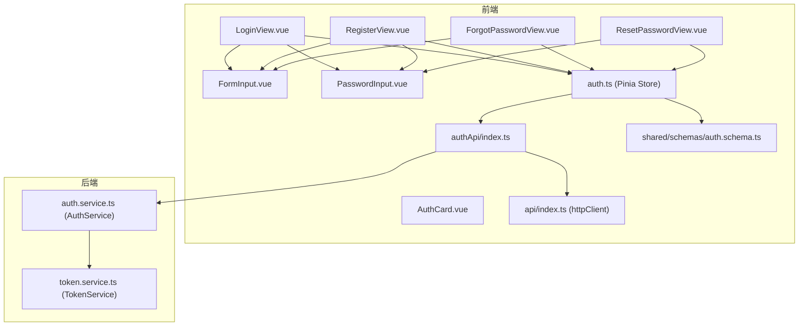
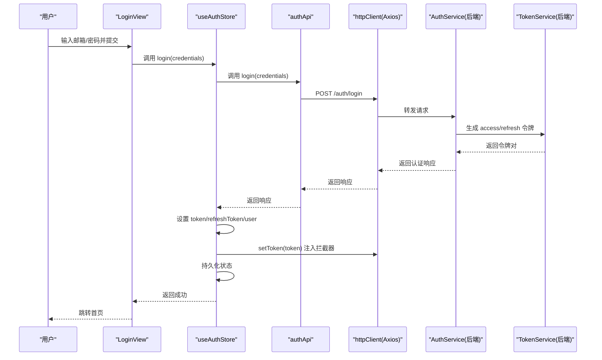
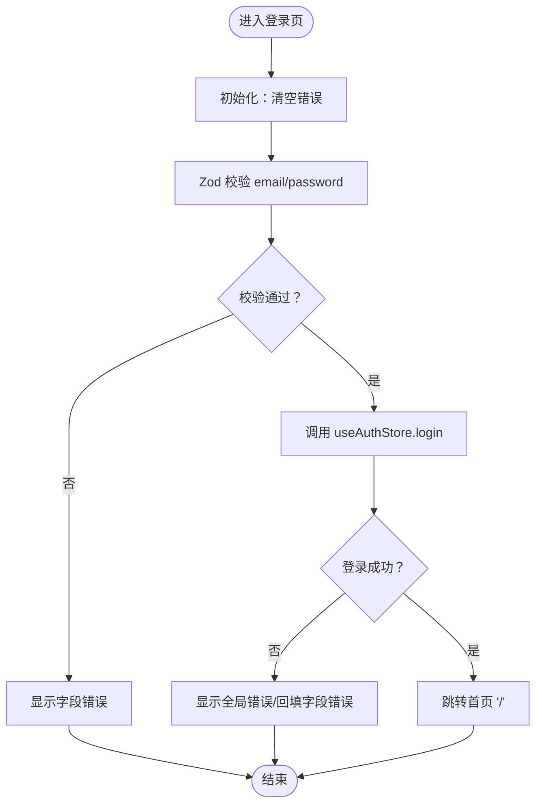
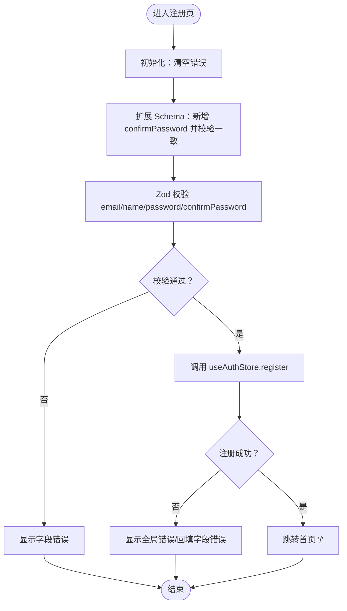
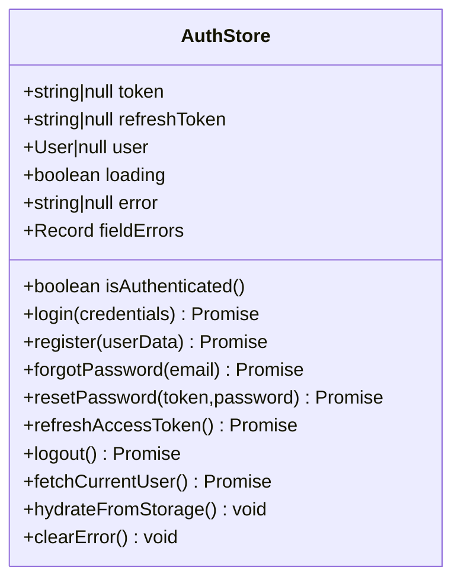
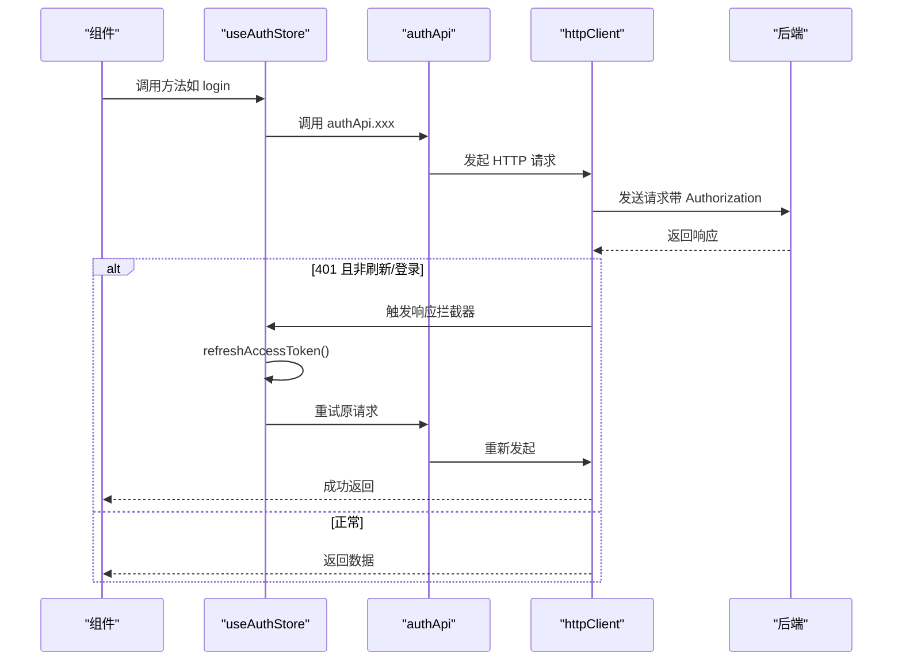
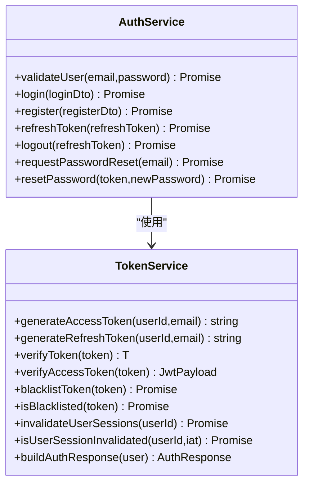
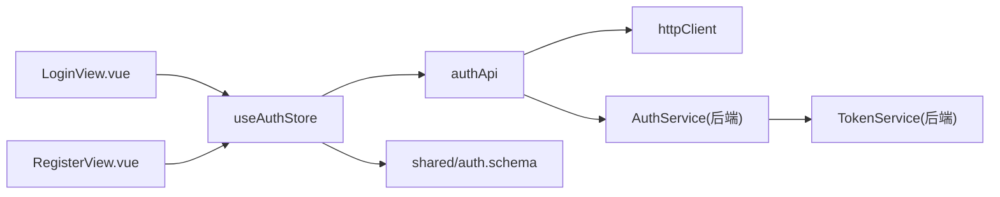

# 用户认证

<cite>
**本文引用的文件**   
- [apps/frontend/src/features/auth/views/LoginView.vue](file://apps/frontend/src/features/auth/views/LoginView.vue)
- [apps/frontend/src/features/auth/views/RegisterView.vue](file://apps/frontend/src/features/auth/views/RegisterView.vue)
- [apps/frontend/src/features/auth/views/ForgotPasswordView.vue](file://apps/frontend/src/features/auth/views/ForgotPasswordView.vue)
- [apps/frontend/src/features/auth/views/ResetPasswordView.vue](file://apps/frontend/src/features/auth/views/ResetPasswordView.vue)
- [apps/frontend/src/features/auth/stores/auth.ts](file://apps/frontend/src/features/auth/stores/auth.ts)
- [apps/frontend/src/features/auth/api/index.ts](file://apps/frontend/src/features/auth/api/index.ts)
- [apps/frontend/src/api/index.ts](file://apps/frontend/src/api/index.ts)
- [packages/shared/src/schemas/auth.schema.ts](file://packages/shared/src/schemas/auth.schema.ts)
- [apps/frontend/src/components/auth/AuthCard.vue](file://apps/frontend/src/components/auth/AuthCard.vue)
- [apps/frontend/src/components/auth/FormInput.vue](file://apps/frontend/src/components/auth/FormInput.vue)
- [apps/frontend/src/components/auth/PasswordInput.vue](file://apps/frontend/src/components/auth/PasswordInput.vue)
- [apps/backend/src/auth/auth.service.ts](file://apps/backend/src/auth/auth.service.ts)
- [apps/backend/src/auth/token.service.ts](file://apps/backend/src/auth/token.service.ts)
</cite>

## 目录
1. [简介](#简介)
2. [项目结构](#项目结构)
3. [核心组件](#核心组件)
4. [架构总览](#架构总览)
5. [详细组件分析](#详细组件分析)
6. [依赖关系分析](#依赖关系分析)
7. [性能考量](#性能考量)
8. [故障排查指南](#故障排查指南)
9. [结论](#结论)
10. [附录](#附录)

## 简介
本文件面向前端与后端工程师，系统化梳理用户认证子系统的实现，覆盖登录与注册页面设计、Pinia 认证 Store 的状态管理、认证 API 封装、JWT 令牌处理、认证拦截器与登出流程等。文档同时提供多类可视化图示，帮助快速理解控制流与数据流。

## 项目结构
认证相关代码主要分布在前端的 features/auth 与 shared 的 schemas，以及后端的 auth 模块：
- 前端
  - 视图层：LoginView、RegisterView、ForgotPasswordView、ResetPasswordView
  - 组件层：AuthCard、FormInput、PasswordInput
  - 状态层：Pinia Store（useAuthStore）
  - API 层：authApi（封装认证相关请求）
  - HTTP 层：httpClient（Axios 实例，含请求/响应拦截器）
  - 校验层：共享 Schema（email/password/Login/Register 等）
- 后端
  - 认证服务：AuthService（整合 TokenService、PasswordService）
  - 令牌服务：TokenService（JWT 生成、校验、黑名单、会话失效）
  - 控制器与策略由仓库其他模块提供，认证模块通过 Guard/Strategy 使用上述服务

**图表来源**
- [apps/frontend/src/features/auth/views/LoginView.vue:1-111](file://apps/frontend/src/features/auth/views/LoginView.vue#L1-L111)
- [apps/frontend/src/features/auth/views/RegisterView.vue:1-121](file://apps/frontend/src/features/auth/views/RegisterView.vue#L1-L121)
- [apps/frontend/src/features/auth/views/ForgotPasswordView.vue:1-104](file://apps/frontend/src/features/auth/views/ForgotPasswordView.vue#L1-L104)
- [apps/frontend/src/features/auth/views/ResetPasswordView.vue:1-152](file://apps/frontend/src/features/auth/views/ResetPasswordView.vue#L1-L152)
- [apps/frontend/src/features/auth/stores/auth.ts:1-391](file://apps/frontend/src/features/auth/stores/auth.ts#L1-L391)
- [apps/frontend/src/features/auth/api/index.ts:1-79](file://apps/frontend/src/features/auth/api/index.ts#L1-L79)
- [apps/frontend/src/api/index.ts:1-199](file://apps/frontend/src/api/index.ts#L1-L199)
- [packages/shared/src/schemas/auth.schema.ts:1-121](file://packages/shared/src/schemas/auth.schema.ts#L1-L121)
- [apps/backend/src/auth/auth.service.ts:1-127](file://apps/backend/src/auth/auth.service.ts#L1-L127)
- [apps/backend/src/auth/token.service.ts:1-187](file://apps/backend/src/auth/token.service.ts#L1-L187)

**章节来源**
- [apps/frontend/src/features/auth/views/LoginView.vue:1-111](file://apps/frontend/src/features/auth/views/LoginView.vue#L1-L111)
- [apps/frontend/src/features/auth/views/RegisterView.vue:1-121](file://apps/frontend/src/features/auth/views/RegisterView.vue#L1-L121)
- [apps/frontend/src/features/auth/stores/auth.ts:1-391](file://apps/frontend/src/features/auth/stores/auth.ts#L1-L391)
- [apps/frontend/src/features/auth/api/index.ts:1-79](file://apps/frontend/src/features/auth/api/index.ts#L1-L79)
- [apps/frontend/src/api/index.ts:1-199](file://apps/frontend/src/api/index.ts#L1-L199)
- [packages/shared/src/schemas/auth.schema.ts:1-121](file://packages/shared/src/schemas/auth.schema.ts#L1-L121)
- [apps/backend/src/auth/auth.service.ts:1-127](file://apps/backend/src/auth/auth.service.ts#L1-L127)
- [apps/backend/src/auth/token.service.ts:1-187](file://apps/backend/src/auth/token.service.ts#L1-L187)

## 核心组件
- 登录页 LoginView
  - 使用 vee-validate + Zod Schema 进行表单校验；绑定 email/password 字段；提交时调用 useAuthStore.login 并根据结果跳转或显示错误。
  - 支持字段级错误回填与全局错误展示，集成国际化文案。
- 注册页 RegisterView
  - 基于 RegisterSchema，额外增加 confirm password 字段与一致性校验；提交时调用 useAuthStore.register。
  - 支持邮箱、用户名长度、密码长度等约束。
- Pinia 认证 Store（useAuthStore）
  - 状态：token、refreshToken、user、loading、error、fieldErrors、isAuthenticated
  - 方法：login、register、forgotPassword、resetPassword、refreshAccessToken、logout、fetchCurrentUser、clearError
  - 自动登录：hydrateFromStorage 从 localStorage 恢复状态并注入到拦截器；持久化：persisted localStorage
  - 令牌刷新：带重试与并发保护；登出：清理本地状态并尝试后端注销
- 认证 API 封装（authApi）
  - 提供 getMe、login、register、forgotPassword、resetPassword、refreshToken、logout 等方法
- HTTP 客户端（httpClient）
  - 请求头注入 Authorization: Bearer token；响应拦截器处理 401 自动刷新；并发刷新去重
- 后端认证服务（AuthService）
  - login/register：调用 TokenService 生成双令牌；validateUser：密码校验
  - refreshToken：校验刷新令牌合法性、用户是否存在、会话是否被作废
  - logout：将刷新令牌加入黑名单
- 令牌服务（TokenService）
  - 生成 access/refresh JWT；校验令牌；黑名单；按用户维度会话作废

**章节来源**
- [apps/frontend/src/features/auth/views/LoginView.vue:1-111](file://apps/frontend/src/features/auth/views/LoginView.vue#L1-L111)
- [apps/frontend/src/features/auth/views/RegisterView.vue:1-121](file://apps/frontend/src/features/auth/views/RegisterView.vue#L1-L121)
- [apps/frontend/src/features/auth/stores/auth.ts:1-391](file://apps/frontend/src/features/auth/stores/auth.ts#L1-L391)
- [apps/frontend/src/features/auth/api/index.ts:1-79](file://apps/frontend/src/features/auth/api/index.ts#L1-L79)
- [apps/frontend/src/api/index.ts:1-199](file://apps/frontend/src/api/index.ts#L1-L199)
- [apps/backend/src/auth/auth.service.ts:1-127](file://apps/backend/src/auth/auth.service.ts#L1-L127)
- [apps/backend/src/auth/token.service.ts:1-187](file://apps/backend/src/auth/token.service.ts#L1-L187)

## 架构总览
认证系统从前端视图层到状态层、API 层，再到后端服务与令牌服务形成闭环。前端通过 httpClient 发起请求，拦截器负责自动刷新与错误处理；后端通过 AuthService 统一编排，TokenService 负责 JWT 生命周期与安全策略。

**图表来源**
- [apps/frontend/src/features/auth/views/LoginView.vue:30-37](file://apps/frontend/src/features/auth/views/LoginView.vue#L30-L37)
- [apps/frontend/src/features/auth/stores/auth.ts:148-179](file://apps/frontend/src/features/auth/stores/auth.ts#L148-L179)
- [apps/frontend/src/features/auth/api/index.ts:19-22](file://apps/frontend/src/features/auth/api/index.ts#L19-L22)
- [apps/frontend/src/api/index.ts:66-91](file://apps/frontend/src/api/index.ts#L66-L91)
- [apps/backend/src/auth/auth.service.ts:41-49](file://apps/backend/src/auth/auth.service.ts#L41-L49)
- [apps/backend/src/auth/token.service.ts:175-185](file://apps/backend/src/auth/token.service.ts#L175-L185)

## 详细组件分析

### 登录页面 LoginView 设计与实现
- 表单验证
  - 使用 toTypedSchema(LoginSchema) 对 email/password 进行类型安全校验
  - v-model 双向绑定至 defineField 定义的字段
- 错误提示
  - 全局错误：authStore.error（来自后端消息或 i18n 键）
  - 字段级错误：authStore.fieldErrors 映射到对应字段的 errors
- 用户体验优化
  - 加载态：按钮 loading 绑定 authStore.loading
  - 国际化：标题、占位符、链接文案均来自 i18n
  - 视觉反馈：错误卡片、图标、动画过渡
- 跳转逻辑：登录成功后 push 到根路径

**图表来源**
- [apps/frontend/src/features/auth/views/LoginView.vue:19-37](file://apps/frontend/src/features/auth/views/LoginView.vue#L19-L37)
- [apps/frontend/src/features/auth/stores/auth.ts:148-179](file://apps/frontend/src/features/auth/stores/auth.ts#L148-L179)
- [packages/shared/src/schemas/auth.schema.ts:25-28](file://packages/shared/src/schemas/auth.schema.ts#L25-L28)

**章节来源**
- [apps/frontend/src/features/auth/views/LoginView.vue:1-111](file://apps/frontend/src/features/auth/views/LoginView.vue#L1-L111)
- [apps/frontend/src/components/auth/FormInput.vue:1-134](file://apps/frontend/src/components/auth/FormInput.vue#L1-L134)
- [apps/frontend/src/components/auth/PasswordInput.vue:1-137](file://apps/frontend/src/components/auth/PasswordInput.vue#L1-L137)
- [apps/frontend/src/components/auth/AuthCard.vue:1-125](file://apps/frontend/src/components/auth/AuthCard.vue#L1-L125)
- [packages/shared/src/schemas/auth.schema.ts:25-28](file://packages/shared/src/schemas/auth.schema.ts#L25-L28)

### 注册页面 RegisterView 设计与实现
- 字段验证
  - 基于 RegisterSchema：email、name、password
  - 额外定义 confirmPassword 字段并通过 refine 校验一致性
- 密码强度检查
  - 密码最小长度与最大长度约束由共享 Schema 提供
- 邮箱确认流程
  - 当前注册页不包含邮箱确认步骤；邮箱确认通常在后端完成并发送邮件，前端在注册成功后可进行数据合并与迁移
- 用户体验
  - 加载态、错误展示、国际化文案、回到登录链接

**图表来源**
- [apps/frontend/src/features/auth/views/RegisterView.vue:20-47](file://apps/frontend/src/features/auth/views/RegisterView.vue#L20-L47)
- [apps/frontend/src/features/auth/stores/auth.ts:184-212](file://apps/frontend/src/features/auth/stores/auth.ts#L184-L212)
- [packages/shared/src/schemas/auth.schema.ts:33-41](file://packages/shared/src/schemas/auth.schema.ts#L33-L41)

**章节来源**
- [apps/frontend/src/features/auth/views/RegisterView.vue:1-121](file://apps/frontend/src/features/auth/views/RegisterView.vue#L1-L121)
- [apps/frontend/src/features/auth/stores/auth.ts:184-212](file://apps/frontend/src/features/auth/stores/auth.ts#L184-L212)
- [packages/shared/src/schemas/auth.schema.ts:33-41](file://packages/shared/src/schemas/auth.schema.ts#L33-L41)

### Pinia 认证 Store 状态管理
- 状态与计算属性
  - token、refreshToken、user、loading、error、fieldErrors、isAuthenticated
- 关键方法
  - login/register：调用 authApi，解析响应，设置 token/user，注入拦截器，持久化，触发数据合并与 AI 迁移
  - forgotPassword/resetPassword：请求密码找回/重置，处理错误
  - refreshAccessToken：带重试与并发保护，必要时回退到登出
  - logout：清理本地状态，尝试后端注销，清理远程待办
  - fetchCurrentUser：在 401 时触发登出
  - hydrateFromStorage/clearPersistedAuth：从 localStorage 恢复/清理持久化状态
- 自动登录机制
  - 应用启动时 hydrateFromStorage 读取持久化数据，setToken 注入拦截器，确保后续请求可用

**图表来源**
- [apps/frontend/src/features/auth/stores/auth.ts:23-391](file://apps/frontend/src/features/auth/stores/auth.ts#L23-L391)

**章节来源**
- [apps/frontend/src/features/auth/stores/auth.ts:1-391](file://apps/frontend/src/features/auth/stores/auth.ts#L1-L391)

### 认证 API 封装与 HTTP 客户端
- 认证 API（authApi）
  - getMe、login、register、forgotPassword、resetPassword、refreshToken、logout
- HTTP 客户端（httpClient）
  - 基础配置：baseURL、withCredentials、超时、语言头
  - 请求拦截器：从 localStorage/内存获取 token，注入 Authorization；排除 /auth/refresh
  - 响应拦截器：401 自动刷新；并发刷新去重；失败透传错误
  - 并发刷新控制：isRefreshing、subscribeTokenRefresh、onRefreshed/onRefreshError

**图表来源**
- [apps/frontend/src/features/auth/api/index.ts:1-79](file://apps/frontend/src/features/auth/api/index.ts#L1-L79)
- [apps/frontend/src/api/index.ts:66-196](file://apps/frontend/src/api/index.ts#L66-L196)
- [apps/frontend/src/features/auth/stores/auth.ts:275-320](file://apps/frontend/src/features/auth/stores/auth.ts#L275-L320)

**章节来源**
- [apps/frontend/src/features/auth/api/index.ts:1-79](file://apps/frontend/src/features/auth/api/index.ts#L1-L79)
- [apps/frontend/src/api/index.ts:1-199](file://apps/frontend/src/api/index.ts#L1-L199)

### 后端认证与令牌服务
- AuthService
  - validateUser：查询用户并比对密码
  - login/register：构建认证响应（access/refresh 令牌）
  - refreshToken：校验刷新令牌、用户存在性、会话作废；非法则抛出 401
  - logout：将刷新令牌加入黑名单
- TokenService
  - 生成 access/refresh JWT，设置过期时间与密钥
  - 校验令牌（区分 access/refresh），黑名单检查
  - 按用户维度会话作废：记录 invalidate 时间并与令牌签发时间比较

**图表来源**
- [apps/backend/src/auth/auth.service.ts:1-127](file://apps/backend/src/auth/auth.service.ts#L1-L127)
- [apps/backend/src/auth/token.service.ts:1-187](file://apps/backend/src/auth/token.service.ts#L1-L187)

**章节来源**
- [apps/backend/src/auth/auth.service.ts:1-127](file://apps/backend/src/auth/auth.service.ts#L1-L127)
- [apps/backend/src/auth/token.service.ts:1-187](file://apps/backend/src/auth/token.service.ts#L1-L187)

## 依赖关系分析
- 前端视图依赖 Pinia Store 与共享 Schema
- Store 依赖 authApi 与 httpClient
- authApi 依赖 httpClient
- 后端 AuthService 依赖 TokenService 与 UsersService
- TokenService 依赖 JwtService、ConfigService、RedisService

**图表来源**
- [apps/frontend/src/features/auth/views/LoginView.vue:1-14](file://apps/frontend/src/features/auth/views/LoginView.vue#L1-L14)
- [apps/frontend/src/features/auth/views/RegisterView.vue:1-14](file://apps/frontend/src/features/auth/views/RegisterView.vue#L1-L14)
- [apps/frontend/src/features/auth/stores/auth.ts:1-8](file://apps/frontend/src/features/auth/stores/auth.ts#L1-L8)
- [apps/frontend/src/features/auth/api/index.ts:1-2](file://apps/frontend/src/features/auth/api/index.ts#L1-L2)
- [apps/frontend/src/api/index.ts:1-1](file://apps/frontend/src/api/index.ts#L1-L1)
- [packages/shared/src/schemas/auth.schema.ts:1-1](file://packages/shared/src/schemas/auth.schema.ts#L1-L1)
- [apps/backend/src/auth/auth.service.ts:1-6](file://apps/backend/src/auth/auth.service.ts#L1-L6)
- [apps/backend/src/auth/token.service.ts:1-5](file://apps/backend/src/auth/token.service.ts#L1-L5)

**章节来源**
- [apps/frontend/src/features/auth/views/LoginView.vue:1-14](file://apps/frontend/src/features/auth/views/LoginView.vue#L1-L14)
- [apps/frontend/src/features/auth/views/RegisterView.vue:1-14](file://apps/frontend/src/features/auth/views/RegisterView.vue#L1-L14)
- [apps/frontend/src/features/auth/stores/auth.ts:1-8](file://apps/frontend/src/features/auth/stores/auth.ts#L1-L8)
- [apps/frontend/src/features/auth/api/index.ts:1-2](file://apps/frontend/src/features/auth/api/index.ts#L1-L2)
- [apps/frontend/src/api/index.ts:1-1](file://apps/frontend/src/api/index.ts#L1-L1)
- [apps/backend/src/auth/auth.service.ts:1-6](file://apps/backend/src/auth/auth.service.ts#L1-L6)
- [apps/backend/src/auth/token.service.ts:1-5](file://apps/backend/src/auth/token.service.ts#L1-L5)

## 性能考量
- 令牌刷新重试与并发控制
  - Store 中设置重试次数与延迟，避免频繁刷新导致抖动
  - httpClient 响应拦截器防止并发刷新请求风暴
- 本地状态持久化
  - 使用 localStorage 持久化 token/refreshToken/user，减少刷新后的二次登录
- 请求头注入与语言头
  - 一次性注入，避免每次请求重复计算
- 组件渲染优化
  - 错误提示使用过渡动画，避免不必要的重排

[本节为通用指导，不直接分析具体文件]

## 故障排查指南
- 登录/注册失败
  - 检查 authStore.error 与 fieldErrors 是否被正确回填
  - 确认共享 Schema 的字段约束是否满足
- 401 未授权
  - 响应拦截器会尝试刷新；若刷新失败，Store 会触发 logout
  - 检查 refreshToken 是否存在、是否被黑名单或作废
- 令牌过期或无效
  - 后端会校验 access/refresh 令牌类型与签名；若过期或被作废，需重新登录
- 黑名单与会话作废
  - TokenService 会在 Redis 中记录黑名单与用户会话作废时间
- 登出后仍可访问
  - 确认后端已将刷新令牌加入黑名单，前端已清理本地状态并调用 logout

**章节来源**
- [apps/frontend/src/features/auth/stores/auth.ts:262-351](file://apps/frontend/src/features/auth/stores/auth.ts#L262-L351)
- [apps/frontend/src/api/index.ts:124-196](file://apps/frontend/src/api/index.ts#L124-L196)
- [apps/backend/src/auth/auth.service.ts:59-101](file://apps/backend/src/auth/auth.service.ts#L59-L101)
- [apps/backend/src/auth/token.service.ts:129-170](file://apps/backend/src/auth/token.service.ts#L129-L170)

## 结论
该认证系统采用前后端分离的清晰分层：前端以 Pinia Store 为核心协调视图与 API，借助共享 Schema 保证前后端一致的校验规则；HTTP 客户端内置拦截器实现自动刷新与错误处理；后端通过 AuthService 与 TokenService 提供安全可靠的令牌生命周期管理。整体设计兼顾安全性、可维护性与用户体验。

[本节为总结性内容，不直接分析具体文件]

## 附录
- 密码强度与邮箱规则
  - 密码最小长度、最大长度与邮箱格式由共享 Schema 提供
- 组件复用
  - AuthCard、FormInput、PasswordInput 提供一致的视觉与交互体验

**章节来源**
- [packages/shared/src/schemas/auth.schema.ts:7-41](file://packages/shared/src/schemas/auth.schema.ts#L7-L41)
- [apps/frontend/src/components/auth/AuthCard.vue:1-125](file://apps/frontend/src/components/auth/AuthCard.vue#L1-L125)
- [apps/frontend/src/components/auth/FormInput.vue:1-134](file://apps/frontend/src/components/auth/FormInput.vue#L1-L134)
- [apps/frontend/src/components/auth/PasswordInput.vue:1-137](file://apps/frontend/src/components/auth/PasswordInput.vue#L1-L137)