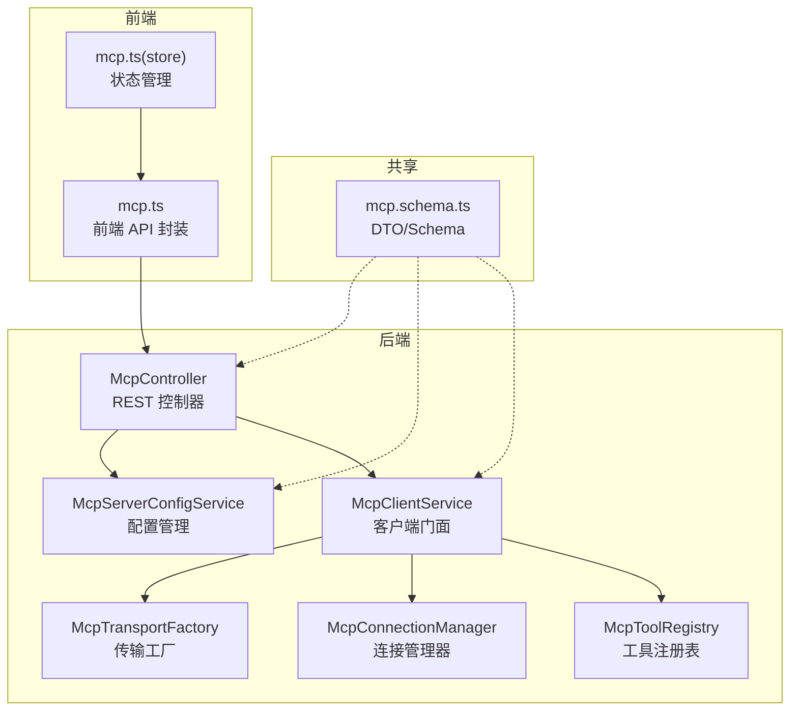
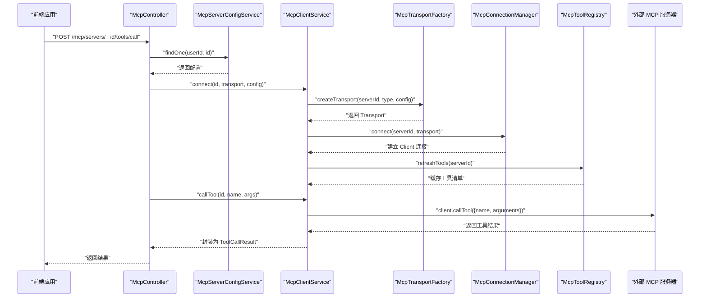
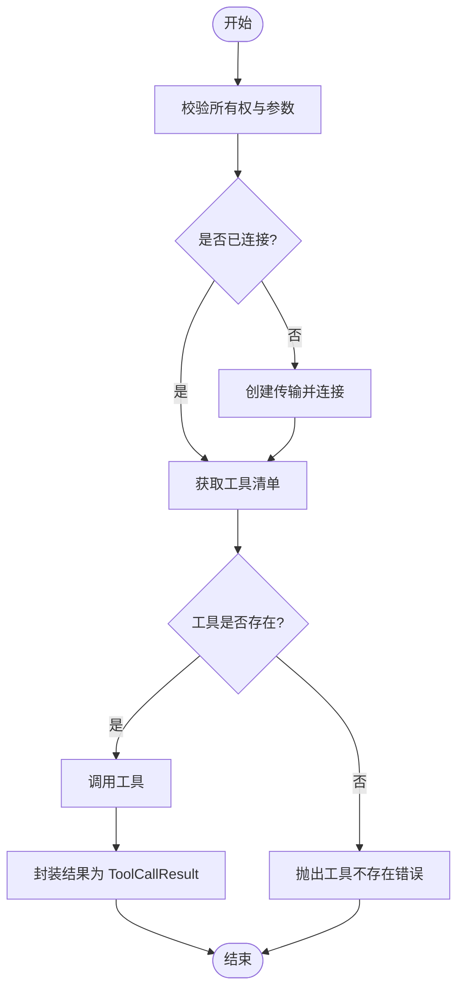
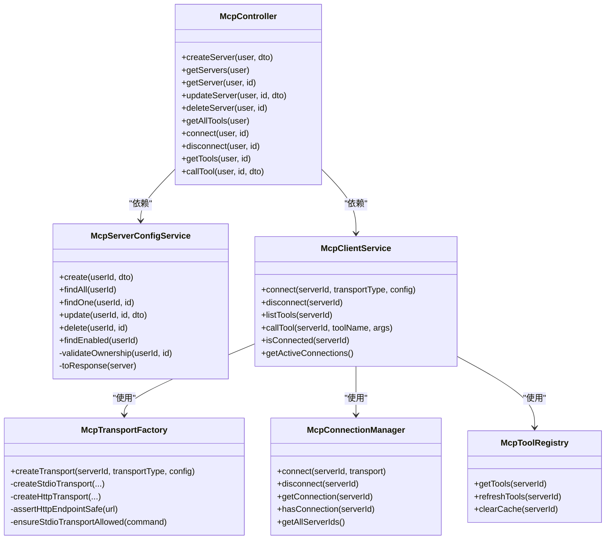

# MCP API 集成

<cite>
**本文引用的文件**
- [apps/backend/src/mcp/mcp.controller.ts](file://apps/backend/src/mcp/mcp.controller.ts)
- [apps/backend/src/mcp/mcp.dto.ts](file://apps/backend/src/mcp/mcp.dto.ts)
- [apps/backend/src/mcp/mcp.module.ts](file://apps/backend/src/mcp/mcp.module.ts)
- [apps/backend/src/mcp/mcp-client.service.ts](file://apps/backend/src/mcp/mcp-client.service.ts)
- [apps/backend/src/mcp/mcp-server-config.service.ts](file://apps/backend/src/mcp/mcp-server-config.service.ts)
- [apps/backend/src/mcp/core/mcp-transport.factory.ts](file://apps/backend/src/mcp/core/mcp-transport.factory.ts)
- [apps/backend/src/mcp/core/mcp-connection.manager.ts](file://apps/backend/src/mcp/core/mcp-connection.manager.ts)
- [apps/backend/src/mcp/core/mcp-tool.registry.ts](file://apps/backend/src/mcp/core/mcp-tool.registry.ts)
- [packages/shared/src/schemas/mcp.schema.ts](file://packages/shared/src/schemas/mcp.schema.ts)
- [apps/backend/src/auth/jwt-auth.guard.ts](file://apps/backend/src/auth/jwt-auth.guard.ts)
- [apps/backend/src/auth/auth.controller.ts](file://apps/backend/src/auth/auth.controller.ts)
- [apps/backend/src/common/filters/all-exceptions.filter.ts](file://apps/backend/src/common/filters/all-exceptions.filter.ts)
- [apps/frontend/src/features/mcp/api/mcp.ts](file://apps/frontend/src/features/mcp/api/mcp.ts)
- [apps/frontend/src/features/mcp/stores/mcp.ts](file://apps/frontend/src/features/mcp/stores/mcp.ts)
- [apps/backend/tests/mcp/mcp-client.service.spec.ts](file://apps/backend/tests/mcp/mcp-client.service.spec.ts)
- [apps/backend/tests/mcp/mcp-server-config.service.spec.ts](file://apps/backend/tests/mcp/mcp-server-config.service.spec.ts)
</cite>

## 目录
1. [简介](#简介)
2. [项目结构](#项目结构)
3. [核心组件](#核心组件)
4. [架构总览](#架构总览)
5. [详细组件分析](#详细组件分析)
6. [依赖关系分析](#依赖关系分析)
7. [性能考虑](#性能考虑)
8. [故障排查指南](#故障排查指南)
9. [结论](#结论)
10. [附录](#附录)

## 简介
本文件面向后端与前端开发者，系统化阐述 MCP API 的 RESTful 设计与路由配置、MCP 服务器管理的 HTTP 接口规范、工具调用的 API 调用方式与参数传递机制、认证与访问控制策略、错误码与异常处理流程、完整使用示例与集成指南、版本管理与向后兼容策略，以及性能监控与限流实践。目标是帮助团队快速、安全、稳定地集成 MCP 工具链。

## 项目结构
MCP 能力由后端 NestJS 模块提供，前端通过统一的 API 服务封装调用。核心模块包括：
- 控制器层：暴露 RESTful 路由，负责鉴权与参数校验
- 服务层：配置管理与客户端门面
- 核心基础设施：传输工厂、连接管理器、工具注册表
- 共享层：前后端一致的数据结构与校验规则
- 前端 API 层：对后端接口的封装与状态管理

图表来源
- [apps/backend/src/mcp/mcp.controller.ts:34-197](file://apps/backend/src/mcp/mcp.controller.ts#L34-L197)
- [apps/backend/src/mcp/mcp-client.service.ts:18-123](file://apps/backend/src/mcp/mcp-client.service.ts#L18-L123)
- [apps/backend/src/mcp/mcp-server-config.service.ts:10-155](file://apps/backend/src/mcp/mcp-server-config.service.ts#L10-L155)
- [apps/backend/src/mcp/core/mcp-transport.factory.ts:10-219](file://apps/backend/src/mcp/core/mcp-transport.factory.ts#L10-L219)
- [apps/backend/src/mcp/core/mcp-connection.manager.ts:13-100](file://apps/backend/src/mcp/core/mcp-connection.manager.ts#L13-L100)
- [apps/backend/src/mcp/core/mcp-tool.registry.ts:6-47](file://apps/backend/src/mcp/core/mcp-tool.registry.ts#L6-L47)
- [packages/shared/src/schemas/mcp.schema.ts:1-220](file://packages/shared/src/schemas/mcp.schema.ts#L1-L220)
- [apps/frontend/src/features/mcp/api/mcp.ts:16-107](file://apps/frontend/src/features/mcp/api/mcp.ts#L16-L107)
- [apps/frontend/src/features/mcp/stores/mcp.ts:15-245](file://apps/frontend/src/features/mcp/stores/mcp.ts#L15-L245)

章节来源
- [apps/backend/src/mcp/mcp.module.ts:9-24](file://apps/backend/src/mcp/mcp.module.ts#L9-L24)

## 核心组件
- McpController：暴露 MCP 服务器配置与工具调用的 REST 接口，统一使用 JWT 认证守卫，并通过 Swagger 注解标注接口用途与认证要求。
- McpServerConfigService：负责用户维度的 MCP 服务器配置的增删改查、启用筛选与所有权校验。
- McpClientService：作为门面，协调传输工厂、连接管理器与工具注册表，完成连接、工具列举与工具调用。
- McpTransportFactory：根据配置创建 STDIO 或 HTTP 传输，内置安全检查（主机白名单、协议限制、命令白名单等）。
- McpConnectionManager：维护活跃连接，负责连接生命周期与错误事件处理。
- McpToolRegistry：缓存工具清单，支持刷新与清理。
- 前端 mcp.ts：封装后端路由调用，提供超时与错误处理；Pinia store 管理连接状态与错误展示。

章节来源
- [apps/backend/src/mcp/mcp.controller.ts:34-197](file://apps/backend/src/mcp/mcp.controller.ts#L34-L197)
- [apps/backend/src/mcp/mcp-server-config.service.ts:10-155](file://apps/backend/src/mcp/mcp-server-config.service.ts#L10-L155)
- [apps/backend/src/mcp/mcp-client.service.ts:18-123](file://apps/backend/src/mcp/mcp-client.service.ts#L18-L123)
- [apps/backend/src/mcp/core/mcp-transport.factory.ts:10-219](file://apps/backend/src/mcp/core/mcp-transport.factory.ts#L10-L219)
- [apps/backend/src/mcp/core/mcp-connection.manager.ts:13-100](file://apps/backend/src/mcp/core/mcp-connection.manager.ts#L13-L100)
- [apps/backend/src/mcp/core/mcp-tool.registry.ts:6-47](file://apps/backend/src/mcp/core/mcp-tool.registry.ts#L6-L47)
- [apps/frontend/src/features/mcp/api/mcp.ts:16-107](file://apps/frontend/src/features/mcp/api/mcp.ts#L16-L107)
- [apps/frontend/src/features/mcp/stores/mcp.ts:15-245](file://apps/frontend/src/features/mcp/stores/mcp.ts#L15-L245)

## 架构总览
下图展示了从前端到后端再到 MCP 服务器的调用链路与职责划分。

图表来源
- [apps/backend/src/mcp/mcp.controller.ts:180-196](file://apps/backend/src/mcp/mcp.controller.ts#L180-L196)
- [apps/backend/src/mcp/mcp-client.service.ts:33-108](file://apps/backend/src/mcp/mcp-client.service.ts#L33-L108)
- [apps/backend/src/mcp/core/mcp-transport.factory.ts:112-218](file://apps/backend/src/mcp/core/mcp-transport.factory.ts#L112-L218)
- [apps/backend/src/mcp/core/mcp-connection.manager.ts:23-73](file://apps/backend/src/mcp/core/mcp-connection.manager.ts#L23-L73)
- [apps/backend/src/mcp/core/mcp-tool.registry.ts:20-42](file://apps/backend/src/mcp/core/mcp-tool.registry.ts#L20-L42)

## 详细组件分析

### RESTful API 设计与路由配置
- 资源路径与方法
  - 创建服务器配置：POST /mcp/servers
  - 查询所有配置：GET /mcp/servers
  - 查询单个配置：GET /mcp/servers/:id
  - 更新配置：PUT /mcp/servers/:id
  - 删除配置：DELETE /mcp/servers/:id
  - 获取所有可用工具：GET /mcp/tools
  - 连接服务器：POST /mcp/servers/:id/connect
  - 断开连接：POST /mcp/servers/:id/disconnect
  - 获取某服务器工具：GET /mcp/servers/:id/tools
  - 调用工具：POST /mcp/servers/:id/tools/call
- 认证与授权
  - 控制器使用 JwtAuthGuard，要求携带 Bearer Token
  - 所有读写操作均进行“所有权校验”，防止越权访问
- 请求与响应
  - 请求体与响应体遵循共享 DTO 规范，后端在响应中将时间字段转换为 Date 类型
  - 工具调用返回 ToolCallResult，包含内容数组与可选的错误标记

章节来源
- [apps/backend/src/mcp/mcp.controller.ts:45-196](file://apps/backend/src/mcp/mcp.controller.ts#L45-L196)
- [apps/backend/src/mcp/mcp.dto.ts:37-53](file://apps/backend/src/mcp/mcp.dto.ts#L37-L53)
- [apps/backend/src/auth/jwt-auth.guard.ts:8-9](file://apps/backend/src/auth/jwt-auth.guard.ts#L8-L9)

### MCP 服务器管理接口规范
- 服务器配置字段
  - 名称、描述、传输类型（STDIO/HTTP）、配置对象、启用标志、用户标识、创建/更新时间
- 传输配置
  - STDIO：命令、参数、工作目录、环境变量
  - HTTP：URL、请求头、认证（Bearer/OAuth/API Key）
- 安全约束
  - HTTP 协议仅允许 http/https，禁止 localhost、.local、私网地址解析
  - STDIO 在生产需开启白名单命令，否则禁用
- 数据一致性
  - 传输类型与配置对象必须匹配，否则校验失败

章节来源
- [packages/shared/src/schemas/mcp.schema.ts:123-180](file://packages/shared/src/schemas/mcp.schema.ts#L123-L180)
- [apps/backend/src/mcp/core/mcp-transport.factory.ts:91-110](file://apps/backend/src/mcp/core/mcp-transport.factory.ts#L91-L110)
- [apps/backend/src/mcp/core/mcp-transport.factory.ts:128-188](file://apps/backend/src/mcp/core/mcp-transport.factory.ts#L128-L188)
- [apps/backend/src/mcp/core/mcp-transport.factory.ts:190-218](file://apps/backend/src/mcp/core/mcp-transport.factory.ts#L190-L218)

### 工具调用 API 流程
- 路由：POST /mcp/servers/:id/tools/call
- 参数：工具名称与参数对象（默认空对象）
- 执行步骤
  - 校验所有权与连接状态，必要时自动连接
  - 从注册表获取工具清单并校验工具存在性
  - 通过连接的 MCP 客户端发起 callTool 调用
  - 将返回结果封装为 ToolCallResult 并返回
- 前端调用
  - 前端 API 对应路由，设置合理超时（工具执行最长可达 60 秒）

图表来源
- [apps/backend/src/mcp/mcp.controller.ts:180-196](file://apps/backend/src/mcp/mcp.controller.ts#L180-L196)
- [apps/backend/src/mcp/mcp-client.service.ts:70-108](file://apps/backend/src/mcp/mcp-client.service.ts#L70-L108)

章节来源
- [apps/frontend/src/features/mcp/api/mcp.ts:69-84](file://apps/frontend/src/features/mcp/api/mcp.ts#L69-L84)

### 认证、授权与访问控制
- 认证
  - 使用 JWT Bearer Token，受 JwtAuthGuard 保护
  - 登录、注册、刷新、登出接口位于 /auth 下，具备速率限制
- 授权
  - 所有 MCP 配置操作均进行“用户 ID 与配置记录匹配”校验
  - 删除前先验证所有权，防止跨用户删除
- 速率限制
  - 认证相关接口使用 @Throttle 设置每分钟最大请求数

章节来源
- [apps/backend/src/auth/auth.controller.ts:22-48](file://apps/backend/src/auth/auth.controller.ts#L22-L48)
- [apps/backend/src/mcp/mcp-server-config.service.ts:114-127](file://apps/backend/src/mcp/mcp-server-config.service.ts#L114-L127)

### 错误码定义与异常处理
- 标准化错误响应
  - 统一由全局异常过滤器输出，包含 success、data、message、errors、statusCode、timestamp
  - Zod 校验错误会被转换为结构化字段级错误对象
- 常见错误场景
  - 未找到资源：404（如配置不存在）
  - 权限不足：403（非配置拥有者）
  - 未连接：调用工具时报错（连接管理器未持有该服务器连接）
  - 工具不存在：工具名不在注册表中
  - 传输不安全：HTTP 主机被阻断或协议不受支持
  - STDIO 禁用：生产环境未配置允许命令或未开启 STDIO
- 国际化
  - 错误消息支持多语言键值，前端可按需显示本地化文案

章节来源
- [apps/backend/src/common/filters/all-exceptions.filter.ts:16-136](file://apps/backend/src/common/filters/all-exceptions.filter.ts#L16-L136)
- [apps/backend/src/mcp/mcp-client.service.ts:74-107](file://apps/backend/src/mcp/mcp-client.service.ts#L74-L107)
- [apps/backend/src/mcp/mcp-server-config.service.ts:55-57](file://apps/backend/src/mcp/mcp-server-config.service.ts#L55-L57)
- [apps/backend/src/mcp/mcp-server-config.service.ts:124-126](file://apps/backend/src/mcp/mcp-server-config.service.ts#L124-L126)
- [apps/backend/src/mcp/core/mcp-transport.factory.ts:91-110](file://apps/backend/src/mcp/core/mcp-transport.factory.ts#L91-L110)
- [apps/backend/src/mcp/core/mcp-transport.factory.ts:128-137](file://apps/backend/src/mcp/core/mcp-transport.factory.ts#L128-L137)

### API 使用示例与集成指南
- 前端集成要点
  - 使用 mcpApi 封装的方法调用后端路由，注意传入正确的服务器 ID 与工具参数
  - 对工具调用设置较长超时（约 60 秒），对连接设置更长超时（约 300 秒）
  - 在 Pinia store 中维护连接状态与错误提示，实现 UI 友好反馈
- 后端集成要点
  - 控制器已内置 JWT 认证与参数校验
  - 传输工厂负责安全检查，建议在生产环境配置 STDIO 命令白名单
  - 工具注册表缓存工具清单，减少重复查询

章节来源
- [apps/frontend/src/features/mcp/api/mcp.ts:16-107](file://apps/frontend/src/features/mcp/api/mcp.ts#L16-L107)
- [apps/frontend/src/features/mcp/stores/mcp.ts:15-245](file://apps/frontend/src/features/mcp/stores/mcp.ts#L15-L245)
- [apps/backend/src/mcp/mcp.controller.ts:45-196](file://apps/backend/src/mcp/mcp.controller.ts#L45-L196)
- [apps/backend/src/mcp/core/mcp-transport.factory.ts:67-89](file://apps/backend/src/mcp/core/mcp-transport.factory.ts#L67-L89)

### 版本管理与向后兼容
- 数据模型演进
  - 服务器配置与工具响应结构在共享层定义，前后端保持一致
  - 传输类型与配置对象严格匹配，避免运行时不一致
- 兼容策略
  - 传输工厂对 HTTP URL 进行协议与主机白名单校验，确保未来变更不影响现有安全策略
  - STDIO 命令白名单机制可在升级时逐步收紧或放宽
- 前后端契约
  - 所有 DTO 与 Schema 位于共享包，避免分散定义导致的不一致

章节来源
- [packages/shared/src/schemas/mcp.schema.ts:123-180](file://packages/shared/src/schemas/mcp.schema.ts#L123-L180)
- [apps/backend/src/mcp/core/mcp-transport.factory.ts:91-110](file://apps/backend/src/mcp/core/mcp-transport.factory.ts#L91-L110)

### 性能监控与限流
- 传输与连接
  - 连接管理器对 STDIO 的 stderr 输出进行日志记录，便于定位问题
  - 工具注册表缓存工具清单，降低重复查询成本
- 前端超时
  - 前端 API 对连接与工具调用分别设置超时，避免长时间阻塞
- 后端限流
  - 认证接口使用 @Throttle 限制频率，缓解暴力破解与滥用风险

章节来源
- [apps/backend/src/mcp/core/mcp-connection.manager.ts:44-58](file://apps/backend/src/mcp/core/mcp-connection.manager.ts#L44-L58)
- [apps/backend/src/mcp/core/mcp-tool.registry.ts:12-42](file://apps/backend/src/mcp/core/mcp-tool.registry.ts#L12-L42)
- [apps/frontend/src/features/mcp/api/mcp.ts:62-82](file://apps/frontend/src/features/mcp/api/mcp.ts#L62-L82)
- [apps/backend/src/auth/auth.controller.ts:23-48](file://apps/backend/src/auth/auth.controller.ts#L23-L48)

## 依赖关系分析

图表来源
- [apps/backend/src/mcp/mcp.controller.ts:34-197](file://apps/backend/src/mcp/mcp.controller.ts#L34-L197)
- [apps/backend/src/mcp/mcp-server-config.service.ts:10-155](file://apps/backend/src/mcp/mcp-server-config.service.ts#L10-L155)
- [apps/backend/src/mcp/mcp-client.service.ts:18-123](file://apps/backend/src/mcp/mcp-client.service.ts#L18-L123)
- [apps/backend/src/mcp/core/mcp-transport.factory.ts:10-219](file://apps/backend/src/mcp/core/mcp-transport.factory.ts#L10-L219)
- [apps/backend/src/mcp/core/mcp-connection.manager.ts:13-100](file://apps/backend/src/mcp/core/mcp-connection.manager.ts#L13-L100)
- [apps/backend/src/mcp/core/mcp-tool.registry.ts:6-47](file://apps/backend/src/mcp/core/mcp-tool.registry.ts#L6-L47)

## 性能考虑
- 连接复用与懒加载
  - 仅在需要时连接服务器，避免无谓的进程/网络开销
- 工具清单缓存
  - 工具注册表缓存工具清单，减少重复查询；断连或刷新时清理缓存
- 传输选择
  - HTTP 传输采用可流式传输，适合远端 MCP 服务器
  - STDIO 传输在本地或受控环境中使用，需配合命令白名单
- 超时与重试
  - 前端为连接与工具调用设置不同超时，避免阻塞 UI
  - 后端连接超时可配置，避免长时间等待

[本节为通用指导，无需列出章节来源]

## 故障排查指南
- 常见问题与定位
  - 401/403：确认 JWT 有效且为配置拥有者
  - 404：确认服务器 ID 存在
  - 未连接错误：先调用连接接口或确保服务器处于启用状态
  - 工具不存在：确认工具名称正确且服务器已连接
  - HTTP 不安全：检查 URL 协议与主机是否被阻断
  - STDIO 禁用：检查环境变量与命令白名单配置
- 日志与监控
  - 后端连接管理器记录 stderr、关闭与错误事件
  - 全局异常过滤器输出结构化错误，便于前端展示与后端审计
- 单元测试参考
  - 客户端服务测试覆盖连接、工具列举、工具调用与断连
  - 配置服务测试覆盖创建、查询与所有权校验

章节来源
- [apps/backend/src/mcp/core/mcp-connection.manager.ts:44-58](file://apps/backend/src/mcp/core/mcp-connection.manager.ts#L44-L58)
- [apps/backend/src/common/filters/all-exceptions.filter.ts:16-136](file://apps/backend/src/common/filters/all-exceptions.filter.ts#L16-L136)
- [apps/backend/tests/mcp/mcp-client.service.spec.ts:10-144](file://apps/backend/tests/mcp/mcp-client.service.spec.ts#L10-L144)
- [apps/backend/tests/mcp/mcp-server-config.service.spec.ts:8-116](file://apps/backend/tests/mcp/mcp-server-config.service.spec.ts#L8-L116)

## 结论
MCP API 通过清晰的 REST 设计、严格的认证与授权、完善的传输安全策略、以及前后端一致的 DTO 约定，实现了对 MCP 服务器的可靠管理与工具调用。结合缓存、懒加载与超时控制，既保证了易用性也兼顾了性能与安全性。建议在生产环境启用传输安全检查与命令白名单，并在前端做好连接状态与错误提示的用户体验设计。

[本节为总结性内容，无需列出章节来源]

## 附录

### API 路由与权限对照
- /mcp/servers
  - GET：查询用户所有配置（需认证）
  - POST：创建配置（需认证）
- /mcp/servers/:id
  - GET：查询单个配置（需认证+所有权）
  - PUT：更新配置（需认证+所有权）
  - DELETE：删除配置（需认证+所有权）
- /mcp/servers/:id/connect
  - POST：连接服务器（需认证+所有权）
- /mcp/servers/:id/disconnect
  - POST：断开连接（需认证+所有权）
- /mcp/servers/:id/tools
  - GET：获取服务器工具（需认证+所有权）
- /mcp/servers/:id/tools/call
  - POST：调用工具（需认证+所有权）
- /mcp/tools
  - GET：获取所有启用服务器的工具（需认证）

章节来源
- [apps/backend/src/mcp/mcp.controller.ts:45-196](file://apps/backend/src/mcp/mcp.controller.ts#L45-L196)