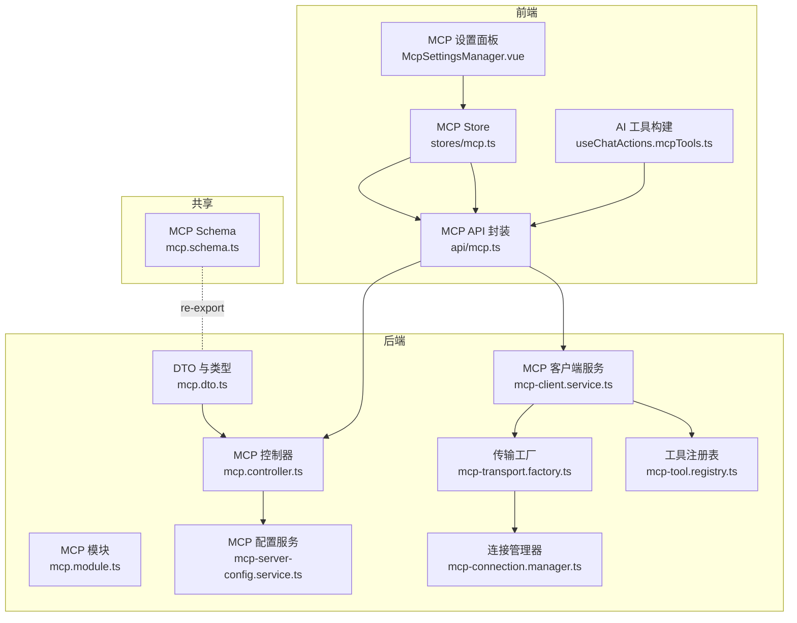
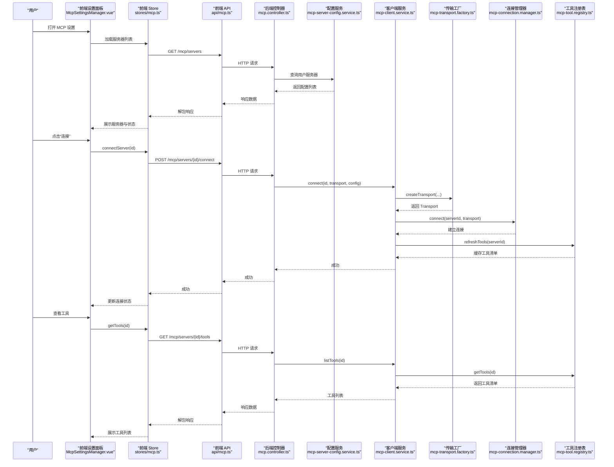
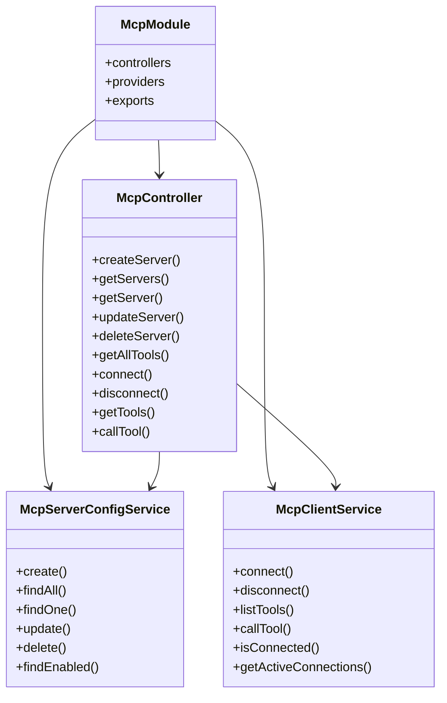
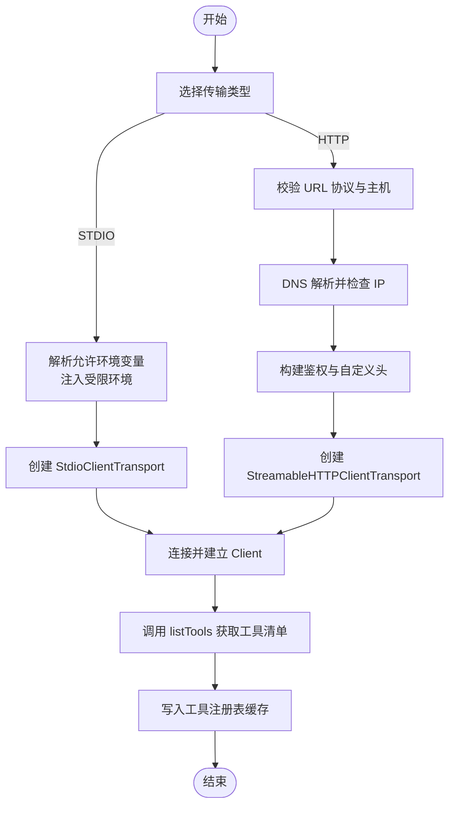
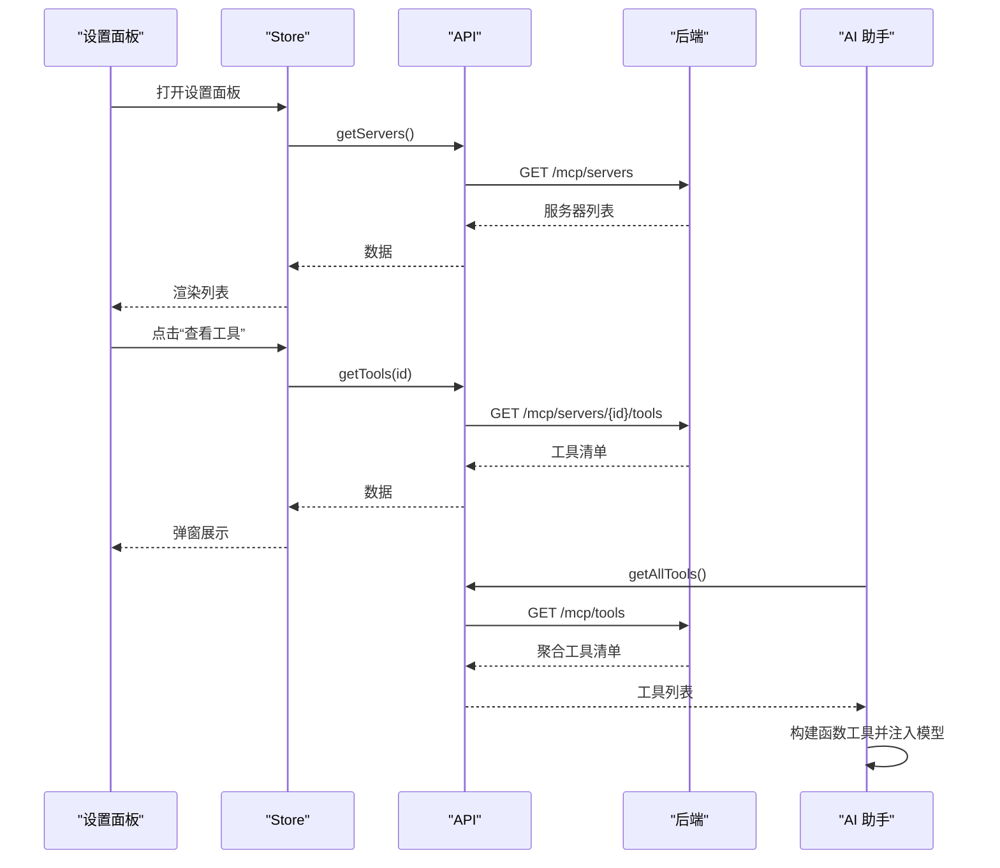
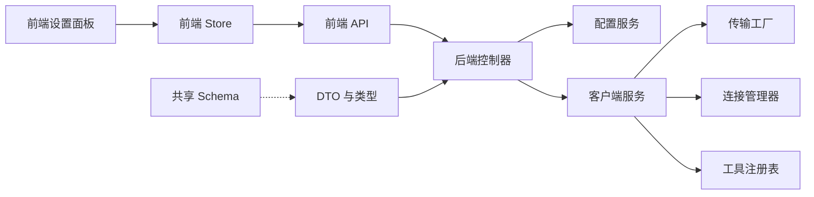

# MCP 协议概述

<cite>
**本文引用的文件**
- [apps/backend/src/mcp/mcp.module.ts](file://apps/backend/src/mcp/mcp.module.ts)
- [apps/backend/src/mcp/mcp.controller.ts](file://apps/backend/src/mcp/mcp.controller.ts)
- [apps/backend/src/mcp/mcp-client.service.ts](file://apps/backend/src/mcp/mcp-client.service.ts)
- [apps/backend/src/mcp/mcp-server-config.service.ts](file://apps/backend/src/mcp/mcp-server-config.service.ts)
- [apps/backend/src/mcp/core/mcp-transport.factory.ts](file://apps/backend/src/mcp/core/mcp-transport.factory.ts)
- [apps/backend/src/mcp/core/mcp-connection.manager.ts](file://apps/backend/src/mcp/core/mcp-connection.manager.ts)
- [apps/backend/src/mcp/core/mcp-tool.registry.ts](file://apps/backend/src/mcp/core/mcp-tool.registry.ts)
- [apps/backend/src/mcp/mcp.dto.ts](file://apps/backend/src/mcp/mcp.dto.ts)
- [packages/shared/src/schemas/mcp.schema.ts](file://packages/shared/src/schemas/mcp.schema.ts)
- [apps/frontend/src/features/mcp/components/McpSettingsManager.vue](file://apps/frontend/src/features/mcp/components/McpSettingsManager.vue)
- [apps/frontend/src/features/mcp/stores/mcp.ts](file://apps/frontend/src/features/mcp/stores/mcp.ts)
- [apps/frontend/src/features/mcp/api/mcp.ts](file://apps/frontend/src/features/mcp/api/mcp.ts)
- [apps/frontend/src/features/ai/composables/useChatActions.mcpTools.ts](file://apps/frontend/src/features/ai/composables/useChatActions.mcpTools.ts)
- [apps/frontend/src/features/ai/composables/useChatActions.ts](file://apps/frontend/src/features/ai/composables/useChatActions.ts)
</cite>

## 目录
1. [引言](#引言)
2. [项目结构](#项目结构)
3. [核心组件](#核心组件)
4. [架构总览](#架构总览)
5. [详细组件分析](#详细组件分析)
6. [依赖关系分析](#依赖关系分析)
7. [性能考量](#性能考量)
8. [故障排查指南](#故障排查指南)
9. [结论](#结论)
10. [附录](#附录)

## 引言
本文件面向希望理解并应用 Model Context Protocol（MCP）的开发者与产品人员，系统阐述 MCP 在本项目中的实现与使用方式。MCP 是一种标准化协议，允许 AI 助手系统以一致的方式发现、调用外部工具与服务，从而增强智能体的上下文能力与可扩展性。本项目的后端通过 NestJS 模块化实现 MCP 客户端与服务器配置管理，前端提供可视化配置界面与工具发现集成，形成“配置—连接—发现—调用”的闭环。

## 项目结构
本项目围绕“后端模块 + 前端组件 + 共享模式”组织 MCP 相关代码：
- 后端模块：提供 MCP 控制器、客户端服务、传输工厂、连接管理器、工具注册表与配置服务。
- 前端模块：提供 MCP 设置面板、Pinia Store 与 API 封装，支持工具列表展示与一键调用。
- 共享模式：前后端共享 MCP 的数据结构与校验 Schema，确保一致性。

图示来源
- [apps/backend/src/mcp/mcp.module.ts:1-25](file://apps/backend/src/mcp/mcp.module.ts#L1-L25)
- [apps/backend/src/mcp/mcp.controller.ts:1-198](file://apps/backend/src/mcp/mcp.controller.ts#L1-L198)
- [apps/backend/src/mcp/mcp-client.service.ts:1-124](file://apps/backend/src/mcp/mcp-client.service.ts#L1-L124)
- [apps/backend/src/mcp/mcp-server-config.service.ts:1-156](file://apps/backend/src/mcp/mcp-server-config.service.ts#L1-L156)
- [apps/backend/src/mcp/core/mcp-transport.factory.ts:1-220](file://apps/backend/src/mcp/core/mcp-transport.factory.ts#L1-L220)
- [apps/backend/src/mcp/core/mcp-connection.manager.ts:1-101](file://apps/backend/src/mcp/core/mcp-connection.manager.ts#L1-L101)
- [apps/backend/src/mcp/core/mcp-tool.registry.ts:1-48](file://apps/backend/src/mcp/core/mcp-tool.registry.ts#L1-L48)
- [apps/backend/src/mcp/mcp.dto.ts:1-59](file://apps/backend/src/mcp/mcp.dto.ts#L1-L59)
- [apps/frontend/src/features/mcp/components/McpSettingsManager.vue:1-286](file://apps/frontend/src/features/mcp/components/McpSettingsManager.vue#L1-L286)
- [apps/frontend/src/features/mcp/stores/mcp.ts:1-246](file://apps/frontend/src/features/mcp/stores/mcp.ts#L1-L246)
- [apps/frontend/src/features/mcp/api/mcp.ts:1-108](file://apps/frontend/src/features/mcp/api/mcp.ts#L1-L108)
- [apps/frontend/src/features/ai/composables/useChatActions.mcpTools.ts:1-50](file://apps/frontend/src/features/ai/composables/useChatActions.mcpTools.ts#L1-L50)

章节来源
- [apps/backend/src/mcp/mcp.module.ts:1-25](file://apps/backend/src/mcp/mcp.module.ts#L1-L25)
- [apps/frontend/src/features/mcp/components/McpSettingsManager.vue:1-286](file://apps/frontend/src/features/mcp/components/McpSettingsManager.vue#L1-L286)

## 核心组件
- MCP 模块：集中导出控制器与服务，便于注入与复用。
- MCP 控制器：提供服务器配置的增删改查、连接/断开、工具发现与调用接口。
- MCP 客户端服务：封装传输创建、连接生命周期、工具注册表与工具调用。
- 传输工厂：根据配置创建 STDIO 或 HTTP 传输，并进行安全校验与环境变量注入。
- 连接管理器：维护活跃连接，负责连接建立、关闭与事件监听。
- 工具注册表：缓存工具清单，按需刷新，降低重复查询成本。
- 配置服务：基于数据库持久化用户 MCP 服务器配置，支持启用/禁用与权限校验。
- 前端设置面板：提供图形化配置入口、工具列表查看与一键连接。
- 前端 Store/API：统一管理服务器状态、连接状态与工具调用。
- 共享 Schema：定义传输类型、配置结构、工具响应与调用结果的数据契约。

章节来源
- [apps/backend/src/mcp/mcp.controller.ts:42-196](file://apps/backend/src/mcp/mcp.controller.ts#L42-L196)
- [apps/backend/src/mcp/mcp-client.service.ts:30-122](file://apps/backend/src/mcp/mcp-client.service.ts#L30-L122)
- [apps/backend/src/mcp/core/mcp-transport.factory.ts:112-218](file://apps/backend/src/mcp/core/mcp-transport.factory.ts#L112-L218)
- [apps/backend/src/mcp/core/mcp-connection.manager.ts:23-95](file://apps/backend/src/mcp/core/mcp-connection.manager.ts#L23-L95)
- [apps/backend/src/mcp/core/mcp-tool.registry.ts:12-46](file://apps/backend/src/mcp/core/mcp-tool.registry.ts#L12-L46)
- [apps/backend/src/mcp/mcp-server-config.service.ts:18-109](file://apps/backend/src/mcp/mcp-server-config.service.ts#L18-L109)
- [apps/frontend/src/features/mcp/components/McpSettingsManager.vue:36-82](file://apps/frontend/src/features/mcp/components/McpSettingsManager.vue#L36-L82)
- [apps/frontend/src/features/mcp/stores/mcp.ts:43-244](file://apps/frontend/src/features/mcp/stores/mcp.ts#L43-L244)
- [apps/frontend/src/features/mcp/api/mcp.ts:16-107](file://apps/frontend/src/features/mcp/api/mcp.ts#L16-L107)
- [packages/shared/src/schemas/mcp.schema.ts:63-220](file://packages/shared/src/schemas/mcp.schema.ts#L63-L220)

## 架构总览
下图展示了从用户操作到工具调用的完整链路，涵盖前后端交互、传输选择、连接建立与工具发现流程。

图示来源
- [apps/frontend/src/features/mcp/components/McpSettingsManager.vue:36-82](file://apps/frontend/src/features/mcp/components/McpSettingsManager.vue#L36-L82)
- [apps/frontend/src/features/mcp/stores/mcp.ts:43-244](file://apps/frontend/src/features/mcp/stores/mcp.ts#L43-L244)
- [apps/frontend/src/features/mcp/api/mcp.ts:16-107](file://apps/frontend/src/features/mcp/api/mcp.ts#L16-L107)
- [apps/backend/src/mcp/mcp.controller.ts:134-175](file://apps/backend/src/mcp/mcp.controller.ts#L134-L175)
- [apps/backend/src/mcp/mcp-client.service.ts:33-108](file://apps/backend/src/mcp/mcp-client.service.ts#L33-L108)
- [apps/backend/src/mcp/core/mcp-transport.factory.ts:112-218](file://apps/backend/src/mcp/core/mcp-transport.factory.ts#L112-L218)
- [apps/backend/src/mcp/core/mcp-connection.manager.ts:23-95](file://apps/backend/src/mcp/core/mcp-connection.manager.ts#L23-L95)
- [apps/backend/src/mcp/core/mcp-tool.registry.ts:12-46](file://apps/backend/src/mcp/core/mcp-tool.registry.ts#L12-L46)

## 详细组件分析

### 后端模块与控制器
- 模块装配：集中注册控制器与服务，便于跨模块复用。
- 控制器职责：
  - 服务器配置：创建、查询、更新、删除、分页与按启用状态筛选。
  - 连接管理：按需连接/断开，支持懒连接策略。
  - 工具发现：聚合启用服务器的工具清单，注入 serverId 便于前端识别来源。
  - 工具调用：校验连接状态与工具存在性，转发调用并返回结果。

图示来源
- [apps/backend/src/mcp/mcp.module.ts:13-22](file://apps/backend/src/mcp/mcp.module.ts#L13-L22)
- [apps/backend/src/mcp/mcp.controller.ts:42-196](file://apps/backend/src/mcp/mcp.controller.ts#L42-L196)
- [apps/backend/src/mcp/mcp-server-config.service.ts:18-109](file://apps/backend/src/mcp/mcp-server-config.service.ts#L18-L109)
- [apps/backend/src/mcp/mcp-client.service.ts:33-122](file://apps/backend/src/mcp/mcp-client.service.ts#L33-L122)

章节来源
- [apps/backend/src/mcp/mcp.module.ts:1-25](file://apps/backend/src/mcp/mcp.module.ts#L1-L25)
- [apps/backend/src/mcp/mcp.controller.ts:42-196](file://apps/backend/src/mcp/mcp.controller.ts#L42-L196)
- [apps/backend/src/mcp/mcp-server-config.service.ts:18-109](file://apps/backend/src/mcp/mcp-server-config.service.ts#L18-L109)
- [apps/backend/src/mcp/mcp-client.service.ts:33-122](file://apps/backend/src/mcp/mcp-client.service.ts#L33-L122)

### 客户端服务与传输层
- 客户端服务作为门面，协调传输工厂、连接管理器与工具注册表，屏蔽上层复杂度。
- 传输工厂：
  - STDIO：命令白名单、环境变量注入、包名纠错、工作目录与错误输出捕获。
  - HTTP：URL 协议校验、主机黑名单过滤、DNS 解析与 IP 地址限制、鉴权头注入。
- 连接管理器：统一管理 Client 实例与 Transport 生命周期，处理 stderr、onclose、onerror 等事件。
- 工具注册表：缓存工具清单，首次访问或刷新时从连接上调用 listTools 并写入缓存。

图示来源
- [apps/backend/src/mcp/core/mcp-transport.factory.ts:112-218](file://apps/backend/src/mcp/core/mcp-transport.factory.ts#L112-L218)
- [apps/backend/src/mcp/core/mcp-connection.manager.ts:23-95](file://apps/backend/src/mcp/core/mcp-connection.manager.ts#L23-L95)
- [apps/backend/src/mcp/core/mcp-tool.registry.ts:20-41](file://apps/backend/src/mcp/core/mcp-tool.registry.ts#L20-L41)

章节来源
- [apps/backend/src/mcp/mcp-client.service.ts:33-108](file://apps/backend/src/mcp/mcp-client.service.ts#L33-L108)
- [apps/backend/src/mcp/core/mcp-transport.factory.ts:112-218](file://apps/backend/src/mcp/core/mcp-transport.factory.ts#L112-L218)
- [apps/backend/src/mcp/core/mcp-connection.manager.ts:23-95](file://apps/backend/src/mcp/core/mcp-connection.manager.ts#L23-L95)
- [apps/backend/src/mcp/core/mcp-tool.registry.ts:12-46](file://apps/backend/src/mcp/core/mcp-tool.registry.ts#L12-L46)

### 前端集成与工具构建
- 设置面板：提供 MCP 开关、服务器列表、新增/编辑、查看工具弹窗与连接状态反馈。
- Store：统一管理服务器列表、连接状态、正在连接状态与错误信息；支持自动连接与运行时配置变更后的重连。
- API：封装后端接口，设置合理超时时间，支持获取全部工具用于 AI 助手自动发现。
- 工具构建：将 MCP 工具转换为 AI 函数工具，生成唯一函数名并建立映射，便于后续调用回溯。

图示来源
- [apps/frontend/src/features/mcp/components/McpSettingsManager.vue:36-82](file://apps/frontend/src/features/mcp/components/McpSettingsManager.vue#L36-L82)
- [apps/frontend/src/features/mcp/stores/mcp.ts:43-244](file://apps/frontend/src/features/mcp/stores/mcp.ts#L43-L244)
- [apps/frontend/src/features/mcp/api/mcp.ts:16-107](file://apps/frontend/src/features/mcp/api/mcp.ts#L16-L107)
- [apps/frontend/src/features/ai/composables/useChatActions.mcpTools.ts:26-49](file://apps/frontend/src/features/ai/composables/useChatActions.mcpTools.ts#L26-L49)
- [apps/frontend/src/features/ai/composables/useChatActions.ts:269-277](file://apps/frontend/src/features/ai/composables/useChatActions.ts#L269-L277)

章节来源
- [apps/frontend/src/features/mcp/components/McpSettingsManager.vue:36-82](file://apps/frontend/src/features/mcp/components/McpSettingsManager.vue#L36-L82)
- [apps/frontend/src/features/mcp/stores/mcp.ts:43-244](file://apps/frontend/src/features/mcp/stores/mcp.ts#L43-L244)
- [apps/frontend/src/features/mcp/api/mcp.ts:16-107](file://apps/frontend/src/features/mcp/api/mcp.ts#L16-L107)
- [apps/frontend/src/features/ai/composables/useChatActions.mcpTools.ts:26-49](file://apps/frontend/src/features/ai/composables/useChatActions.mcpTools.ts#L26-L49)
- [apps/frontend/src/features/ai/composables/useChatActions.ts:269-277](file://apps/frontend/src/features/ai/composables/useChatActions.ts#L269-L277)

## 依赖关系分析
- 后端内部依赖：控制器依赖配置服务与客户端服务；客户端服务依赖传输工厂、连接管理器与工具注册表。
- 前后端耦合：前端通过统一 API 适配后端控制器；共享 Schema 确保数据契约一致。
- 安全边界：传输工厂对 STDIO 命令进行白名单与包名纠错，对 HTTP URL 进行协议与主机/地址黑名单校验。

图示来源
- [apps/backend/src/mcp/mcp.controller.ts:42-196](file://apps/backend/src/mcp/mcp.controller.ts#L42-L196)
- [apps/backend/src/mcp/mcp-client.service.ts:33-108](file://apps/backend/src/mcp/mcp-client.service.ts#L33-L108)
- [apps/backend/src/mcp/core/mcp-transport.factory.ts:112-218](file://apps/backend/src/mcp/core/mcp-transport.factory.ts#L112-L218)
- [apps/backend/src/mcp/core/mcp-connection.manager.ts:23-95](file://apps/backend/src/mcp/core/mcp-connection.manager.ts#L23-L95)
- [apps/backend/src/mcp/core/mcp-tool.registry.ts:12-46](file://apps/backend/src/mcp/core/mcp-tool.registry.ts#L12-L46)
- [apps/backend/src/mcp/mcp.dto.ts:1-59](file://apps/backend/src/mcp/mcp.dto.ts#L1-L59)
- [packages/shared/src/schemas/mcp.schema.ts:63-220](file://packages/shared/src/schemas/mcp.schema.ts#L63-L220)

章节来源
- [apps/backend/src/mcp/mcp.controller.ts:42-196](file://apps/backend/src/mcp/mcp.controller.ts#L42-L196)
- [apps/backend/src/mcp/mcp-client.service.ts:33-108](file://apps/backend/src/mcp/mcp-client.service.ts#L33-L108)
- [apps/backend/src/mcp/core/mcp-transport.factory.ts:112-218](file://apps/backend/src/mcp/core/mcp-transport.factory.ts#L112-L218)
- [apps/backend/src/mcp/core/mcp-connection.manager.ts:23-95](file://apps/backend/src/mcp/core/mcp-connection.manager.ts#L23-L95)
- [apps/backend/src/mcp/core/mcp-tool.registry.ts:12-46](file://apps/backend/src/mcp/core/mcp-tool.registry.ts#L12-L46)
- [apps/backend/src/mcp/mcp.dto.ts:1-59](file://apps/backend/src/mcp/mcp.dto.ts#L1-L59)
- [packages/shared/src/schemas/mcp.schema.ts:63-220](file://packages/shared/src/schemas/mcp.schema.ts#L63-L220)

## 性能考量
- 懒连接策略：仅在需要时建立连接，减少资源占用与冷启动时间。
- 工具清单缓存：工具注册表缓存工具清单，避免重复查询；断开连接或刷新时清理缓存。
- 传输超时设置：不同接口设置差异化超时，平衡用户体验与稳定性。
- 自动连接与重连：启用服务器自动连接；运行时配置变更触发断开/重连，保证一致性。

章节来源
- [apps/backend/src/mcp/mcp.controller.ts:114-128](file://apps/backend/src/mcp/mcp.controller.ts#L114-L128)
- [apps/backend/src/mcp/mcp-client.service.ts:52-55](file://apps/backend/src/mcp/mcp-client.service.ts#L52-L55)
- [apps/backend/src/mcp/core/mcp-tool.registry.ts:44-46](file://apps/backend/src/mcp/core/mcp-tool.registry.ts#L44-L46)
- [apps/frontend/src/features/mcp/stores/mcp.ts:62-72](file://apps/frontend/src/features/mcp/stores/mcp.ts#L62-L72)
- [apps/frontend/src/features/mcp/api/mcp.ts:60-91](file://apps/frontend/src/features/mcp/api/mcp.ts#L60-L91)

## 故障排查指南
- 连接失败
  - 检查传输配置：STDIO 命令是否在白名单内、包名是否正确；HTTP URL 协议与主机是否被允许。
  - 查看 stderr 输出与 onclose/onerror 事件日志，定位远端进程问题。
- 工具不可见
  - 确认服务器已连接且工具注册表已刷新；若断开连接，缓存会被清理，需重新连接后刷新。
- 权限与鉴权
  - HTTP 传输支持 Bearer/OAuth/API Key 鉴权，确认头字段与令牌配置正确。
- 前端无工具列表
  - 确认全局 MCP 开关已开启且已登录；检查 getAllTools 接口调用是否成功。

章节来源
- [apps/backend/src/mcp/core/mcp-transport.factory.ts:91-110](file://apps/backend/src/mcp/core/mcp-transport.factory.ts#L91-L110)
- [apps/backend/src/mcp/core/mcp-connection.manager.ts:44-58](file://apps/backend/src/mcp/core/mcp-connection.manager.ts#L44-L58)
- [apps/backend/src/mcp/core/mcp-tool.registry.ts:20-41](file://apps/backend/src/mcp/core/mcp-tool.registry.ts#L20-L41)
- [apps/frontend/src/features/mcp/api/mcp.ts:103-106](file://apps/frontend/src/features/mcp/api/mcp.ts#L103-L106)

## 结论
本项目通过模块化后端与可视化前端，实现了 MCP 协议在 AI 助手中的标准化接入：用户可在前端直观配置与管理多个 MCP 服务器，后端按需建立连接并缓存工具清单，最终由 AI 助手在对话中自动发现并调用这些工具。该方案具备良好的安全性（传输与地址校验）、可扩展性（支持 STDIO 与 HTTP）与可观测性（日志与错误处理），适合在多租户与多服务场景中推广使用。

## 附录
- 协议与数据契约
  - 传输类型：STDIO、HTTP。
  - 配置结构：STDIO 命令、参数、环境变量、工作目录；HTTP URL、头、鉴权。
  - 工具响应：名称、描述、输入 Schema；调用结果包含内容数组与错误标记。
- 版本兼容性与未来方向
  - 当前实现基于共享 Schema 的强类型约束，确保前后端一致。
  - 未来可扩展：支持更多传输类型、增强工具调用流控与并发管理、引入工具调用审计与追踪。

章节来源
- [packages/shared/src/schemas/mcp.schema.ts:63-220](file://packages/shared/src/schemas/mcp.schema.ts#L63-L220)
- [apps/backend/src/mcp/mcp.dto.ts:37-59](file://apps/backend/src/mcp/mcp.dto.ts#L37-L59)