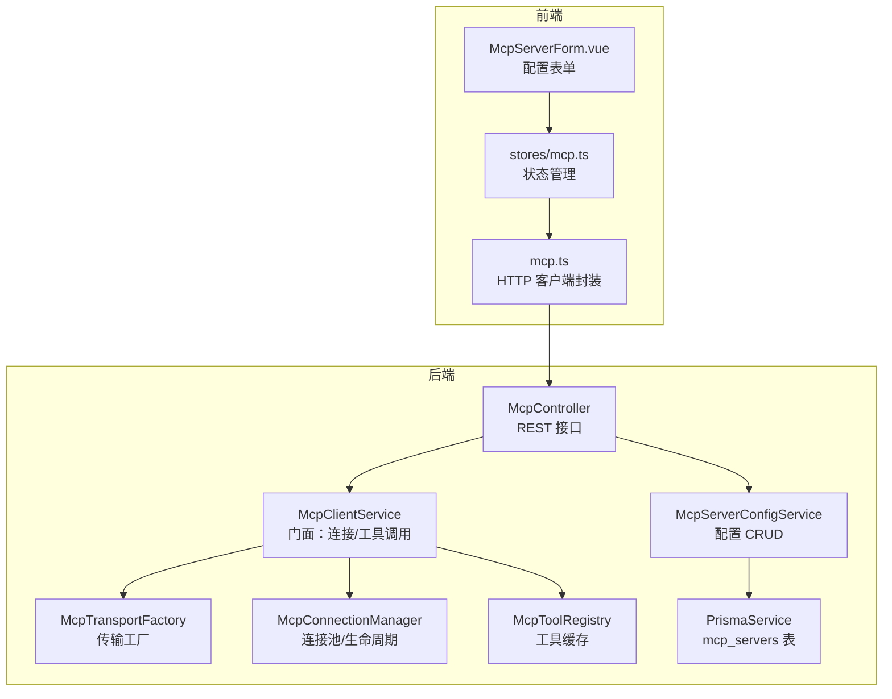
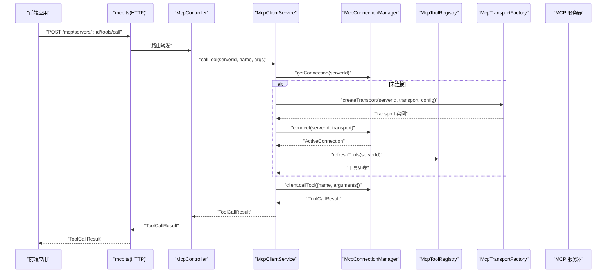
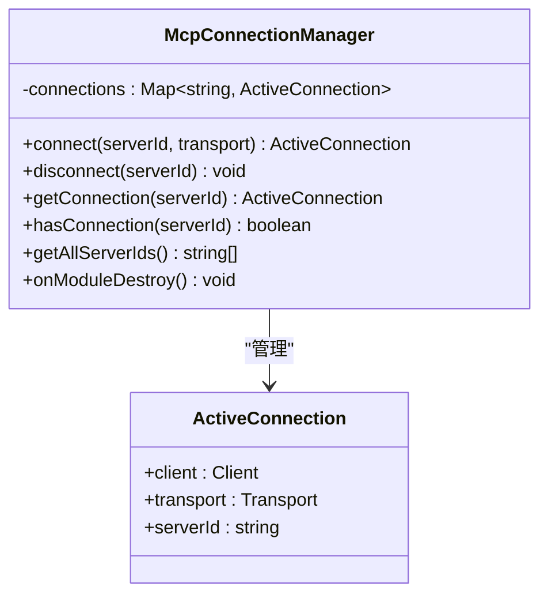
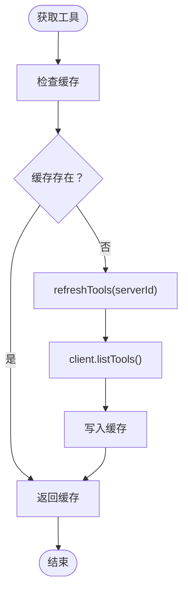
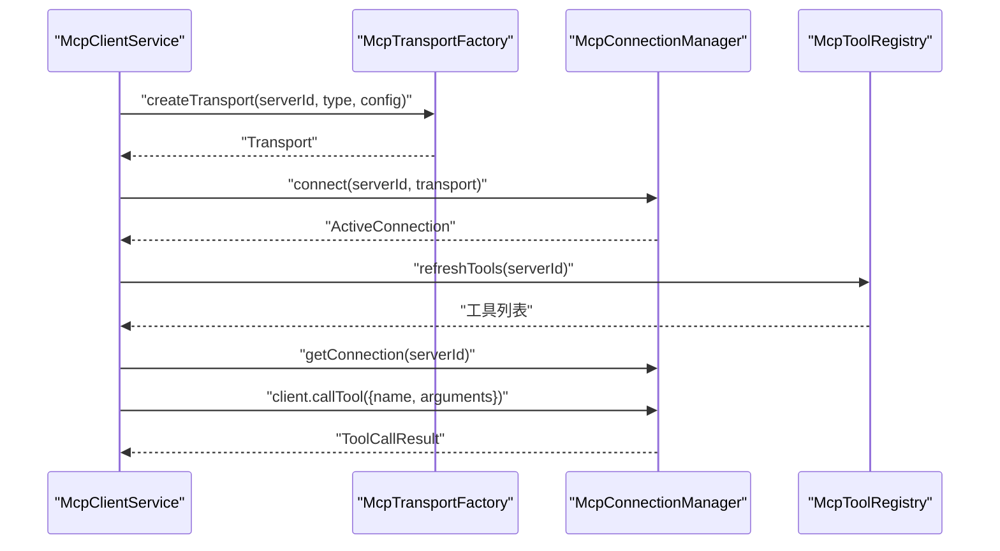
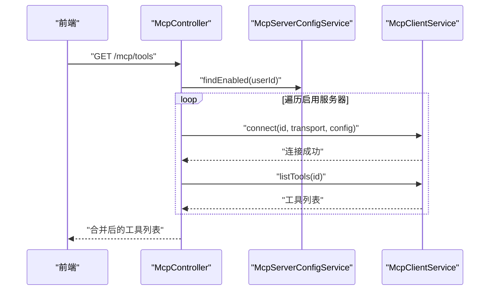
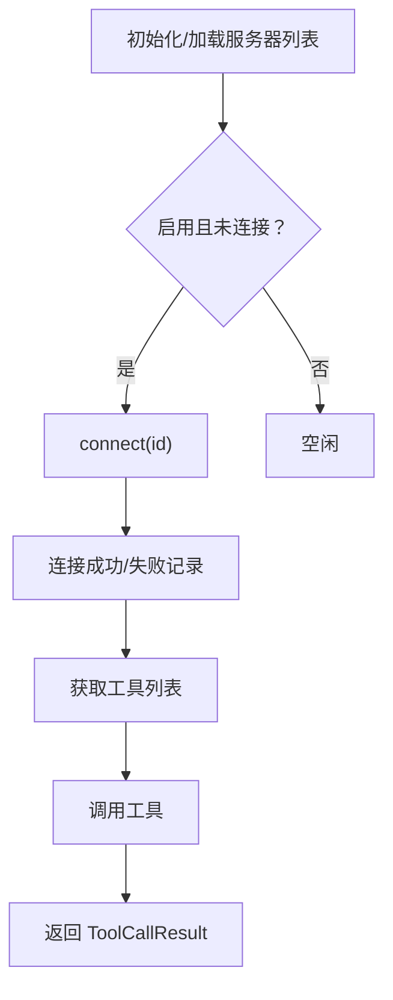
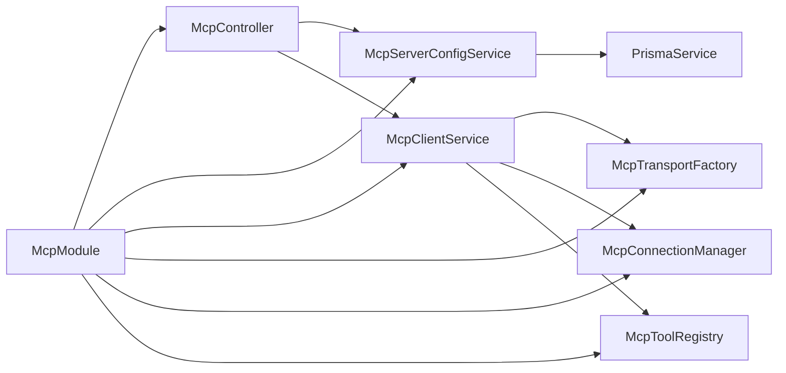

# MCP 协议模块

<cite>
**本文引用的文件**
- [apps/backend/src/mcp/mcp.module.ts](file://apps/backend/src/mcp/mcp.module.ts)
- [apps/backend/src/mcp/mcp.controller.ts](file://apps/backend/src/mcp/mcp.controller.ts)
- [apps/backend/src/mcp/mcp-client.service.ts](file://apps/backend/src/mcp/mcp-client.service.ts)
- [apps/backend/src/mcp/mcp-server-config.service.ts](file://apps/backend/src/mcp/mcp-server-config.service.ts)
- [apps/backend/src/mcp/mcp.dto.ts](file://apps/backend/src/mcp/mcp.dto.ts)
- [apps/backend/src/mcp/core/mcp-transport.factory.ts](file://apps/backend/src/mcp/core/mcp-transport.factory.ts)
- [apps/backend/src/mcp/core/mcp-connection.manager.ts](file://apps/backend/src/mcp/core/mcp-connection.manager.ts)
- [apps/backend/src/mcp/core/mcp-tool.registry.ts](file://apps/backend/src/mcp/core/mcp-tool.registry.ts)
- [packages/shared/src/schemas/mcp.schema.ts](file://packages/shared/src/schemas/mcp.schema.ts)
- [apps/backend/prisma/schema/mcp.prisma](file://apps/backend/prisma/schema/mcp.prisma)
- [apps/backend/tests/mcp/mcp-client.service.spec.ts](file://apps/backend/tests/mcp/mcp-client.service.spec.ts)
- [apps/backend/tests/mcp/mcp-server-config.service.spec.ts](file://apps/backend/tests/mcp/mcp-server-config.service.spec.ts)
- [apps/frontend/src/features/mcp/api/mcp.ts](file://apps/frontend/src/features/mcp/api/mcp.ts)
- [apps/frontend/src/features/mcp/stores/mcp.ts](file://apps/frontend/src/features/mcp/stores/mcp.ts)
- [apps/frontend/src/features/mcp/components/McpServerForm.vue](file://apps/frontend/src/features/mcp/components/McpServerForm.vue)
</cite>

## 目录
1. [简介](#简介)
2. [项目结构](#项目结构)
3. [核心组件](#核心组件)
4. [架构总览](#架构总览)
5. [详细组件分析](#详细组件分析)
6. [依赖关系分析](#依赖关系分析)
7. [性能考量](#性能考量)
8. [故障排查指南](#故障排查指南)
9. [结论](#结论)
10. [附录](#附录)

## 简介
本文件面向后端与前端工程师，系统性阐述 MCP（Model Context Protocol）协议模块的设计与实现，覆盖协议工作原理、服务器配置与连接池管理、工具调用与响应处理、协议适配器与消息序列化、错误处理与超时重连策略、配置示例与最佳实践、与外部 AI 服务的集成模式以及性能监控与日志记录方案。目标是帮助读者快速理解并安全高效地集成 MCP 服务器，支撑 AI 助手的工具能力。

## 项目结构
MCP 模块采用分层设计：
- 控制器层：暴露 REST 接口，负责鉴权、参数校验与业务编排
- 服务层：封装配置管理、客户端门面、传输工厂、连接管理与工具注册表
- 数据模型：共享 Schema 定义与 Prisma 数据库模型
- 前端集成：API 封装、Pinia Store、表单组件与工具发现流程

图表来源
- [apps/backend/src/mcp/mcp.controller.ts:34-197](file://apps/backend/src/mcp/mcp.controller.ts#L34-L197)
- [apps/backend/src/mcp/mcp-client.service.ts:18-123](file://apps/backend/src/mcp/mcp-client.service.ts#L18-L123)
- [apps/backend/src/mcp/mcp-server-config.service.ts:10-155](file://apps/backend/src/mcp/mcp-server-config.service.ts#L10-L155)
- [apps/backend/src/mcp/core/mcp-transport.factory.ts:10-219](file://apps/backend/src/mcp/core/mcp-transport.factory.ts#L10-L219)
- [apps/backend/src/mcp/core/mcp-connection.manager.ts:13-100](file://apps/backend/src/mcp/core/mcp-connection.manager.ts#L13-L100)
- [apps/backend/src/mcp/core/mcp-tool.registry.ts:6-47](file://apps/backend/src/mcp/core/mcp-tool.registry.ts#L6-L47)
- [apps/backend/prisma/schema/mcp.prisma:1-16](file://apps/backend/prisma/schema/mcp.prisma#L1-L16)
- [apps/frontend/src/features/mcp/api/mcp.ts:16-107](file://apps/frontend/src/features/mcp/api/mcp.ts#L16-L107)
- [apps/frontend/src/features/mcp/stores/mcp.ts:15-245](file://apps/frontend/src/features/mcp/stores/mcp.ts#L15-L245)
- [apps/frontend/src/features/mcp/components/McpServerForm.vue:1-188](file://apps/frontend/src/features/mcp/components/McpServerForm.vue#L1-L188)

章节来源
- [apps/backend/src/mcp/mcp.module.ts:1-24](file://apps/backend/src/mcp/mcp.module.ts#L1-L24)

## 核心组件
- 控制器：提供 JWT 鉴权保护的 REST API，支持创建/查询/更新/删除 MCP 服务器配置；支持连接/断开、列举工具、调用工具等操作。
- 配置服务：基于 Prisma 对 mcp_servers 表进行增删改查，确保用户数据隔离与权限校验。
- 客户端门面：统一管理连接、工具发现与工具调用，封装错误日志与连接状态。
- 传输工厂：根据传输类型（STDIO/HTTP）创建安全可控的传输通道，内置主机与地址白名单、命令白名单、环境变量过滤等安全策略。
- 连接管理器：维护 serverId -> Client 的连接映射，处理连接生命周期、关闭与异常事件。
- 工具注册表：缓存工具清单，按需刷新，避免频繁请求远端服务器。
- 共享 Schema：前后端一致的传输类型、配置结构、工具调用参数与响应结构定义。
- 前端 API/Store/表单：封装 HTTP 请求、状态管理与用户交互。

章节来源
- [apps/backend/src/mcp/mcp.controller.ts:34-197](file://apps/backend/src/mcp/mcp.controller.ts#L34-L197)
- [apps/backend/src/mcp/mcp-server-config.service.ts:10-155](file://apps/backend/src/mcp/mcp-server-config.service.ts#L10-L155)
- [apps/backend/src/mcp/mcp-client.service.ts:18-123](file://apps/backend/src/mcp/mcp-client.service.ts#L18-L123)
- [apps/backend/src/mcp/core/mcp-transport.factory.ts:10-219](file://apps/backend/src/mcp/core/mcp-transport.factory.ts#L10-L219)
- [apps/backend/src/mcp/core/mcp-connection.manager.ts:13-100](file://apps/backend/src/mcp/core/mcp-connection.manager.ts#L13-L100)
- [apps/backend/src/mcp/core/mcp-tool.registry.ts:6-47](file://apps/backend/src/mcp/core/mcp-tool.registry.ts#L6-L47)
- [packages/shared/src/schemas/mcp.schema.ts:1-220](file://packages/shared/src/schemas/mcp.schema.ts#L1-L220)
- [apps/frontend/src/features/mcp/api/mcp.ts:16-107](file://apps/frontend/src/features/mcp/api/mcp.ts#L16-L107)
- [apps/frontend/src/features/mcp/stores/mcp.ts:15-245](file://apps/frontend/src/features/mcp/stores/mcp.ts#L15-L245)
- [apps/frontend/src/features/mcp/components/McpServerForm.vue:1-188](file://apps/frontend/src/features/mcp/components/McpServerForm.vue#L1-L188)

## 架构总览
下图展示从前端发起工具调用到后端连接 MCP 服务器并返回结果的完整链路。

图表来源
- [apps/frontend/src/features/mcp/api/mcp.ts:68-84](file://apps/frontend/src/features/mcp/api/mcp.ts#L68-L84)
- [apps/backend/src/mcp/mcp.controller.ts:177-196](file://apps/backend/src/mcp/mcp.controller.ts#L177-L196)
- [apps/backend/src/mcp/mcp-client.service.ts:70-108](file://apps/backend/src/mcp/mcp-client.service.ts#L70-L108)
- [apps/backend/src/mcp/core/mcp-connection.manager.ts:23-73](file://apps/backend/src/mcp/core/mcp-connection.manager.ts#L23-L73)
- [apps/backend/src/mcp/core/mcp-tool.registry.ts:20-41](file://apps/backend/src/mcp/core/mcp-tool.registry.ts#L20-L41)
- [apps/backend/src/mcp/core/mcp-transport.factory.ts:112-126](file://apps/backend/src/mcp/core/mcp-transport.factory.ts#L112-L126)

## 详细组件分析

### 传输工厂（McpTransportFactory）
职责
- 根据传输类型创建 Transport 实例
- 安全校验：HTTP 主机白名单、私有/回环地址阻断、URL 协议限制
- STDIO 安全：命令白名单、允许的环境变量、包名纠错、工作目录与 stderr 日志
- HTTP 安全：动态导入可流式的 HTTP 传输，支持 Bearer/OAuth/API Key 认证头注入

关键点
- 环境变量控制：生产环境需显式配置允许的 STDIO 命令列表
- 地址与主机名校验：阻断 localhost、.local、私网与回环地址
- 认证头注入：Bearer/OAuth 使用 Authorization: Bearer ...，API Key 支持自定义头部名

章节来源
- [apps/backend/src/mcp/core/mcp-transport.factory.ts:10-219](file://apps/backend/src/mcp/core/mcp-transport.factory.ts#L10-L219)
- [packages/shared/src/schemas/mcp.schema.ts:63-118](file://packages/shared/src/schemas/mcp.schema.ts#L63-L118)

### 连接管理器（McpConnectionManager）
职责
- 维护 serverId -> ActiveConnection 映射
- 生命周期：connect/destroy/close
- 异常处理：stderr 日志、onclose 回收、onerror 记录
- 超时：SDK 选项 requestTimeout 默认约 5 分钟

图表来源
- [apps/backend/src/mcp/core/mcp-connection.manager.ts:6-100](file://apps/backend/src/mcp/core/mcp-connection.manager.ts#L6-L100)

章节来源
- [apps/backend/src/mcp/core/mcp-connection.manager.ts:13-100](file://apps/backend/src/mcp/core/mcp-connection.manager.ts#L13-L100)

### 工具注册表（McpToolRegistry）
职责
- 缓存每个 serverId 的工具清单
- 首次访问或缓存缺失时拉取并写入缓存
- 断开连接时清理缓存

图表来源
- [apps/backend/src/mcp/core/mcp-tool.registry.ts:12-41](file://apps/backend/src/mcp/core/mcp-tool.registry.ts#L12-L41)

章节来源
- [apps/backend/src/mcp/core/mcp-tool.registry.ts:6-47](file://apps/backend/src/mcp/core/mcp-tool.registry.ts#L6-L47)

### 客户端门面（McpClientService）
职责
- 连接/断开：创建 Transport -> 连接 -> 预热工具注册表
- 工具发现：懒加载连接并获取工具列表
- 工具调用：校验工具存在性，调用并标准化返回
- 连接状态：查询活跃连接、断开时清理缓存

图表来源
- [apps/backend/src/mcp/mcp-client.service.ts:30-108](file://apps/backend/src/mcp/mcp-client.service.ts#L30-L108)
- [apps/backend/src/mcp/core/mcp-transport.factory.ts:112-126](file://apps/backend/src/mcp/core/mcp-transport.factory.ts#L112-L126)
- [apps/backend/src/mcp/core/mcp-connection.manager.ts:23-73](file://apps/backend/src/mcp/core/mcp-connection.manager.ts#L23-L73)
- [apps/backend/src/mcp/core/mcp-tool.registry.ts:20-41](file://apps/backend/src/mcp/core/mcp-tool.registry.ts#L20-L41)

章节来源
- [apps/backend/src/mcp/mcp-client.service.ts:18-123](file://apps/backend/src/mcp/mcp-client.service.ts#L18-L123)

### 控制器与配置服务（McpController / McpServerConfigService）
职责
- 控制器：鉴权、参数解析、调用服务层；支持批量工具发现、连接/断开、工具调用
- 配置服务：Prisma 持久化，权限校验（所有权），启用状态筛选，响应体扩展日期字段

图表来源
- [apps/backend/src/mcp/mcp.controller.ts:103-129](file://apps/backend/src/mcp/mcp.controller.ts#L103-L129)
- [apps/backend/src/mcp/mcp-server-config.service.ts:102-109](file://apps/backend/src/mcp/mcp-server-config.service.ts#L102-L109)
- [apps/backend/src/mcp/mcp-client.service.ts:30-65](file://apps/backend/src/mcp/mcp-client.service.ts#L30-L65)

章节来源
- [apps/backend/src/mcp/mcp.controller.ts:34-197](file://apps/backend/src/mcp/mcp.controller.ts#L34-L197)
- [apps/backend/src/mcp/mcp-server-config.service.ts:10-155](file://apps/backend/src/mcp/mcp-server-config.service.ts#L10-L155)

### 前端集成（API/Store/表单）
职责
- API 封装：统一路径、超时设置、响应解包
- Store：状态管理、自动连接、运行时变更检测与重连
- 表单：基础信息、传输类型选择、STDIO/HTTP 配置与认证

图表来源
- [apps/frontend/src/features/mcp/stores/mcp.ts:43-84](file://apps/frontend/src/features/mcp/stores/mcp.ts#L43-L84)
- [apps/frontend/src/features/mcp/api/mcp.ts:88-98](file://apps/frontend/src/features/mcp/api/mcp.ts#L88-L98)
- [apps/frontend/src/features/mcp/components/McpServerForm.vue:100-135](file://apps/frontend/src/features/mcp/components/McpServerForm.vue#L100-L135)

章节来源
- [apps/frontend/src/features/mcp/api/mcp.ts:16-107](file://apps/frontend/src/features/mcp/api/mcp.ts#L16-L107)
- [apps/frontend/src/features/mcp/stores/mcp.ts:15-245](file://apps/frontend/src/features/mcp/stores/mcp.ts#L15-L245)
- [apps/frontend/src/features/mcp/components/McpServerForm.vue:1-188](file://apps/frontend/src/features/mcp/components/McpServerForm.vue#L1-L188)

## 依赖关系分析
- 模块装配：McpModule 导出配置服务与客户端门面，供其他模块使用
- 控制器依赖：JWT 守卫、配置服务、客户端门面
- 客户端门面依赖：传输工厂、连接管理器、工具注册表
- 配置服务依赖：PrismaService 与 mcp_servers 表
- 前端依赖：共享 Schema 与后端 API

图表来源
- [apps/backend/src/mcp/mcp.module.ts:13-22](file://apps/backend/src/mcp/mcp.module.ts#L13-L22)
- [apps/backend/src/mcp/mcp.controller.ts:37-40](file://apps/backend/src/mcp/mcp.controller.ts#L37-L40)
- [apps/backend/src/mcp/mcp-client.service.ts:21-28](file://apps/backend/src/mcp/mcp-client.service.ts#L21-L28)
- [apps/backend/src/mcp/mcp-server-config.service.ts:13-13](file://apps/backend/src/mcp/mcp-server-config.service.ts#L13-L13)

章节来源
- [apps/backend/src/mcp/mcp.module.ts:1-24](file://apps/backend/src/mcp/mcp.module.ts#L1-L24)

## 性能考量
- 连接复用：连接管理器以 serverId 为键复用连接，避免重复握手
- 工具缓存：工具注册表缓存工具清单，减少远端查询
- 懒加载：工具发现与连接在首次需要时触发，降低初始开销
- 超时设置：前端 API 对不同场景设置合理超时（连接 5 分钟、工具 60 秒、工具发现 30 秒）
- 传输优化：HTTP 使用可流式传输，STDIO 仅传递必要环境变量

章节来源
- [apps/backend/src/mcp/core/mcp-connection.manager.ts:35-38](file://apps/backend/src/mcp/core/mcp-connection.manager.ts#L35-L38)
- [apps/backend/src/mcp/core/mcp-tool.registry.ts:12-18](file://apps/backend/src/mcp/core/mcp-tool.registry.ts#L12-L18)
- [apps/frontend/src/features/mcp/api/mcp.ts:62-90](file://apps/frontend/src/features/mcp/api/mcp.ts#L62-L90)

## 故障排查指南
常见问题与定位
- 无法连接 MCP 服务器
  - 检查传输类型与配置是否匹配（STDIO/HTTP）
  - 查看传输工厂的安全校验日志（主机/地址/协议/命令白名单）
  - 关注连接管理器的 stderr/onclose/onerror 日志
- 工具不存在或调用失败
  - 确认已连接并成功刷新工具缓存
  - 核对工具名称大小写与输入参数结构
- 权限与数据隔离
  - 配置服务会校验资源所有权，403/404 场景需检查用户上下文与资源 ID
- 前端状态不一致
  - Store 中的连接状态与错误信息可用于诊断；关注自动连接与运行时配置变更导致的重连

章节来源
- [apps/backend/src/mcp/core/mcp-transport.factory.ts:91-110](file://apps/backend/src/mcp/core/mcp-transport.factory.ts#L91-L110)
- [apps/backend/src/mcp/core/mcp-connection.manager.ts:44-58](file://apps/backend/src/mcp/core/mcp-connection.manager.ts#L44-L58)
- [apps/backend/src/mcp/mcp-client.service.ts:74-108](file://apps/backend/src/mcp/mcp-client.service.ts#L74-L108)
- [apps/backend/src/mcp/mcp-server-config.service.ts:114-127](file://apps/backend/src/mcp/mcp-server-config.service.ts#L114-L127)
- [apps/frontend/src/features/mcp/stores/mcp.ts:174-202](file://apps/frontend/src/features/mcp/stores/mcp.ts#L174-L202)

## 结论
该 MCP 协议模块通过清晰的分层与强约束的安全策略，提供了稳定可靠的外部工具集成能力。传输工厂与连接管理器保证了连接的可控与可观测，工具注册表提升了性能与可用性。配合前端 Store 的自动连接与状态管理，整体体验流畅且易于维护。建议在生产环境中严格配置 STDIO 命令白名单与 HTTP 主机白名单，并结合日志与监控持续优化连接与工具调用性能。

## 附录

### 协议适配器与消息序列化
- 传输适配器
  - STDIO：进程级通信，支持命令、参数、工作目录与受限环境变量
  - HTTP：可流式 HTTP，支持 Bearer/OAuth/API Key 认证
- 消息序列化
  - 基于 SDK 的标准 MCP 协议消息格式，前后端共享 Schema 确保一致性

章节来源
- [apps/backend/src/mcp/core/mcp-transport.factory.ts:181-218](file://apps/backend/src/mcp/core/mcp-transport.factory.ts#L181-L218)
- [packages/shared/src/schemas/mcp.schema.ts:1-220](file://packages/shared/src/schemas/mcp.schema.ts#L1-L220)

### 错误处理、超时与重连策略
- 错误处理
  - 控制器/服务层捕获异常并记录日志，向客户端返回可读错误
  - 连接管理器在 stderr/onerror/onclose 时记录并回收连接
- 超时
  - 前端 API 对连接设置较长超时，工具调用与工具发现分别设置中长超时
- 重连策略
  - Store 在服务器启用且未连接时自动尝试连接；运行时配置变更导致断开后重新连接

章节来源
- [apps/backend/src/mcp/mcp-client.service.ts:43-46](file://apps/backend/src/mcp/mcp-client.service.ts#L43-L46)
- [apps/backend/src/mcp/core/mcp-connection.manager.ts:44-58](file://apps/backend/src/mcp/core/mcp-connection.manager.ts#L44-L58)
- [apps/frontend/src/features/mcp/api/mcp.ts:62-90](file://apps/frontend/src/features/mcp/api/mcp.ts#L62-L90)
- [apps/frontend/src/features/mcp/stores/mcp.ts:61-72](file://apps/frontend/src/features/mcp/stores/mcp.ts#L61-L72)

### MCP 服务器配置示例与最佳实践
- 配置项
  - 名称、描述、传输类型（STDIO/HTTP）、启用状态、用户归属
  - STDIO：命令、参数、工作目录、环境变量（受控）
  - HTTP：URL、请求头、认证（Bearer/OAuth/API Key）
- 最佳实践
  - 生产环境必须配置 STDIO 命令白名单
  - HTTP 仅使用公网 HTTPS 地址，避免本地/私网地址
  - 启用服务器时自动连接，禁用时断开，减少资源占用
  - 工具调用前先刷新工具缓存，确保工具清单最新

章节来源
- [apps/backend/src/mcp/mcp-server-config.service.ts:18-33](file://apps/backend/src/mcp/mcp-server-config.service.ts#L18-L33)
- [apps/backend/prisma/schema/mcp.prisma:1-16](file://apps/backend/prisma/schema/mcp.prisma#L1-L16)
- [packages/shared/src/schemas/mcp.schema.ts:123-173](file://packages/shared/src/schemas/mcp.schema.ts#L123-L173)
- [apps/frontend/src/features/mcp/components/McpServerForm.vue:27-46](file://apps/frontend/src/features/mcp/components/McpServerForm.vue#L27-L46)

### 与外部 AI 服务的集成模式与调试技巧
- 集成模式
  - 通过“获取所有启用服务器的工具”接口聚合工具，供 AI 助手选择
  - 按需连接与断开，避免常驻连接带来的资源压力
- 调试技巧
  - 启用详细日志：关注传输工厂与连接管理器的日志输出
  - 使用前端 Store 的错误状态定位具体服务器问题
  - 对工具调用设置合理超时，避免长时间阻塞

章节来源
- [apps/backend/src/mcp/mcp.controller.ts:103-129](file://apps/backend/src/mcp/mcp.controller.ts#L103-L129)
- [apps/frontend/src/features/mcp/stores/mcp.ts:174-202](file://apps/frontend/src/features/mcp/stores/mcp.ts#L174-L202)

### 性能监控与日志记录方案
- 连接与工具缓存命中率：统计工具刷新频率与缓存命中情况
- 传输层指标：STDIO 进程启动耗时、HTTP 请求延迟与错误率
- 工具调用指标：成功率、平均耗时、超时次数
- 日志策略：连接建立/断开、工具刷新、工具调用、传输错误、安全拦截

章节来源
- [apps/backend/src/mcp/core/mcp-connection.manager.ts:44-58](file://apps/backend/src/mcp/core/mcp-connection.manager.ts#L44-L58)
- [apps/backend/src/mcp/core/mcp-tool.registry.ts:27-41](file://apps/backend/src/mcp/core/mcp-tool.registry.ts#L27-L41)
- [apps/backend/src/mcp/core/mcp-transport.factory.ts:177-187](file://apps/backend/src/mcp/core/mcp-transport.factory.ts#L177-L187)