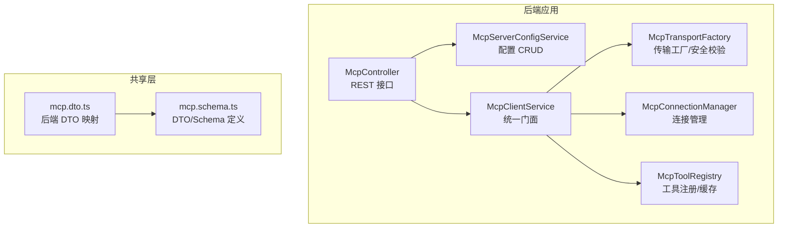
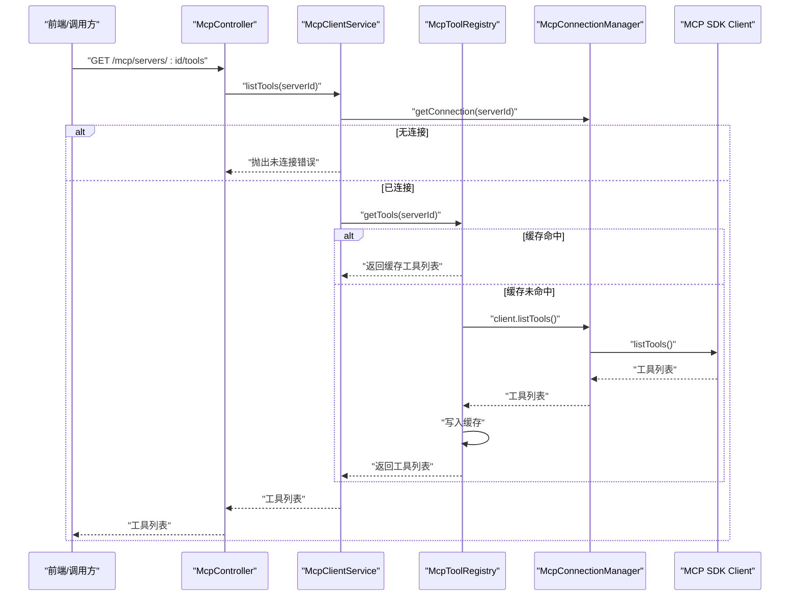
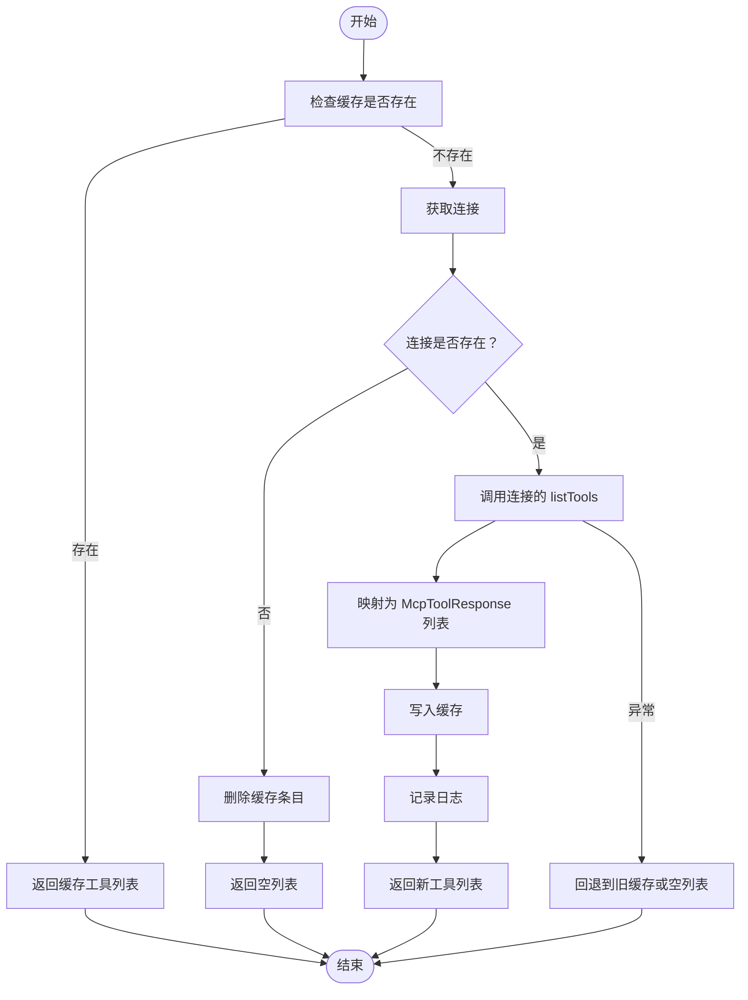
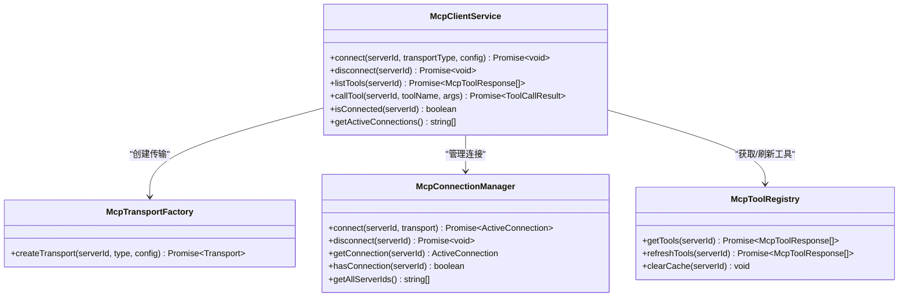
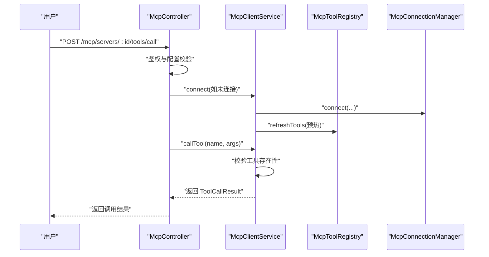
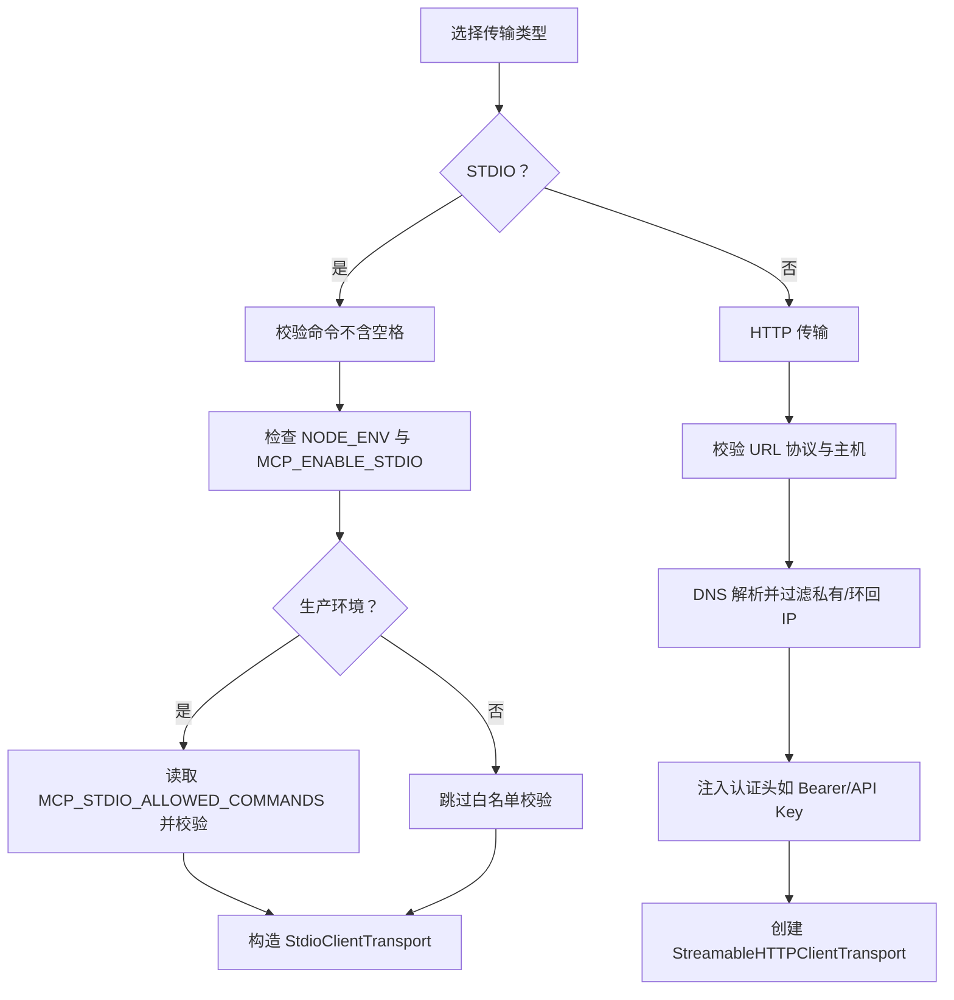
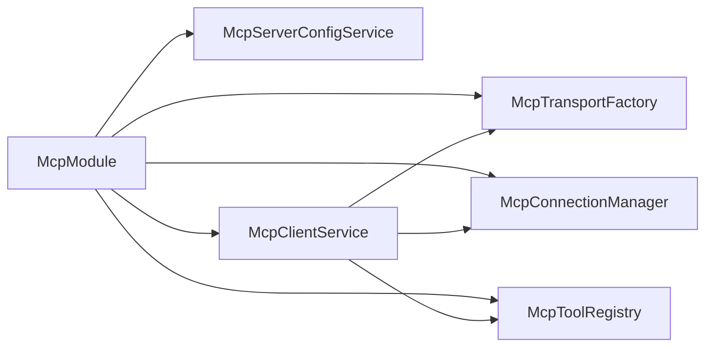

# MCP 工具系统

<cite>
**本文引用的文件**
- [apps/backend/src/mcp/core/mcp-tool.registry.ts](file://apps/backend/src/mcp/core/mcp-tool.registry.ts)
- [apps/backend/src/mcp/core/mcp-connection.manager.ts](file://apps/backend/src/mcp/core/mcp-connection.manager.ts)
- [apps/backend/src/mcp/core/mcp-transport.factory.ts](file://apps/backend/src/mcp/core/mcp-transport.factory.ts)
- [apps/backend/src/mcp/mcp.dto.ts](file://apps/backend/src/mcp/mcp.dto.ts)
- [apps/backend/src/mcp/mcp.controller.ts](file://apps/backend/src/mcp/mcp.controller.ts)
- [apps/backend/src/mcp/mcp-client.service.ts](file://apps/backend/src/mcp/mcp-client.service.ts)
- [apps/backend/src/mcp/mcp-server-config.service.ts](file://apps/backend/src/mcp/mcp-server-config.service.ts)
- [apps/backend/src/mcp/mcp.module.ts](file://apps/backend/src/mcp/mcp.module.ts)
- [packages/shared/src/schemas/mcp.schema.ts](file://packages/shared/src/schemas/mcp.schema.ts)
- [apps/backend/tests/mcp/mcp-client.service.spec.ts](file://apps/backend/tests/mcp/mcp-client.service.spec.ts)
- [apps/frontend/src/features/ai/composables/useChatActions.mcpTools.ts](file://apps/frontend/src/features/ai/composables/useChatActions.mcpTools.ts)
</cite>

## 目录
1. [简介](#简介)
2. [项目结构](#项目结构)
3. [核心组件](#核心组件)
4. [架构总览](#架构总览)
5. [详细组件分析](#详细组件分析)
6. [依赖关系分析](#依赖关系分析)
7. [性能考量](#性能考量)
8. [故障排查指南](#故障排查指南)
9. [结论](#结论)
10. [附录](#附录)

## 简介
本文件面向 MCP（Model Context Protocol）工具系统的使用者与维护者，系统性阐述工具注册与发现机制、工具接口规范、参数与返回值格式、调用执行流程与结果处理、权限控制与安全验证、性能监控与统计、自定义工具开发与集成、版本管理与向后兼容策略，以及错误处理与异常传播机制。重点围绕 McpToolRegistry 的工具注册与缓存、McpClientService 的统一门面、McpController 的 API 控制器、McpConnectionManager 的连接管理、McpTransportFactory 的传输层安全与配置校验，以及共享模式下的工具响应与调用结果结构。

## 项目结构
MCP 模块位于后端应用的 mcp 子目录中，采用分层与职责分离的设计：
- 控制器层：McpController 提供 REST API，负责权限校验、工具发现、工具调用等入口。
- 服务层：McpServerConfigService 管理用户配置；McpClientService 统一门面，协调传输工厂与连接管理；McpToolRegistry 负责工具注册与缓存。
- 核心层：McpConnectionManager 管理连接生命周期；McpTransportFactory 负责安全校验与传输实例化。
- 数据传输对象与共享模式：mcp.dto.ts 与 shared 包中的 mcp.schema.ts 定义了传输与校验规则。

图表来源
- [apps/backend/src/mcp/mcp.controller.ts:34-197](file://apps/backend/src/mcp/mcp.controller.ts#L34-L197)
- [apps/backend/src/mcp/mcp-client.service.ts:17-123](file://apps/backend/src/mcp/mcp-client.service.ts#L17-L123)
- [apps/backend/src/mcp/core/mcp-tool.registry.ts:6-47](file://apps/backend/src/mcp/core/mcp-tool.registry.ts#L6-L47)
- [apps/backend/src/mcp/core/mcp-connection.manager.ts:12-100](file://apps/backend/src/mcp/core/mcp-connection.manager.ts#L12-L100)
- [apps/backend/src/mcp/core/mcp-transport.factory.ts:10-219](file://apps/backend/src/mcp/core/mcp-transport.factory.ts#L10-L219)
- [apps/backend/src/mcp/mcp.dto.ts:1-59](file://apps/backend/src/mcp/mcp.dto.ts#L1-L59)
- [packages/shared/src/schemas/mcp.schema.ts:1-220](file://packages/shared/src/schemas/mcp.schema.ts#L1-L220)

章节来源
- [apps/backend/src/mcp/mcp.module.ts:9-24](file://apps/backend/src/mcp/mcp.module.ts#L9-L24)

## 核心组件
- McpToolRegistry：维护每个 MCP 服务器的工具清单缓存，支持按服务器 ID 查询与刷新，并在连接断开时清理缓存。
- McpClientService：统一门面，封装连接、断开、工具列表获取、工具调用、连接状态查询等能力。
- McpController：提供创建/更新/删除 MCP 服务器配置、连接/断开、列出全部工具、列出单服务器工具、调用工具等 API。
- McpConnectionManager：管理客户端与远端 MCP 服务器的连接生命周期，支持标准输入输出与 HTTP 流式传输。
- McpTransportFactory：根据配置创建传输实例，执行安全检查（协议、主机、IP、命令白名单），并注入认证头。
- DTO 与 Schema：后端 DTO 映射与共享 Schema 规范工具名称、参数、返回内容结构与传输配置。

章节来源
- [apps/backend/src/mcp/core/mcp-tool.registry.ts:6-47](file://apps/backend/src/mcp/core/mcp-tool.registry.ts#L6-L47)
- [apps/backend/src/mcp/mcp-client.service.ts:17-123](file://apps/backend/src/mcp/mcp-client.service.ts#L17-L123)
- [apps/backend/src/mcp/mcp.controller.ts:34-197](file://apps/backend/src/mcp/mcp.controller.ts#L34-L197)
- [apps/backend/src/mcp/core/mcp-connection.manager.ts:12-100](file://apps/backend/src/mcp/core/mcp-connection.manager.ts#L12-L100)
- [apps/backend/src/mcp/core/mcp-transport.factory.ts:10-219](file://apps/backend/src/mcp/core/mcp-transport.factory.ts#L10-L219)
- [apps/backend/src/mcp/mcp.dto.ts:1-59](file://apps/backend/src/mcp/mcp.dto.ts#L1-L59)
- [packages/shared/src/schemas/mcp.schema.ts:175-220](file://packages/shared/src/schemas/mcp.schema.ts#L175-L220)

## 架构总览
MCP 工具系统遵循“控制器-服务-传输-连接”的分层架构。控制器负责鉴权与路由，服务层负责业务编排，传输工厂负责安全与实例化，连接管理器负责生命周期与日志。工具注册与发现通过工具注册表进行缓存，避免重复拉取。

图表来源
- [apps/backend/src/mcp/mcp.controller.ts:158-175](file://apps/backend/src/mcp/mcp.controller.ts#L158-L175)
- [apps/backend/src/mcp/mcp-client.service.ts:57-65](file://apps/backend/src/mcp/mcp-client.service.ts#L57-L65)
- [apps/backend/src/mcp/core/mcp-tool.registry.ts:12-42](file://apps/backend/src/mcp/core/mcp-tool.registry.ts#L12-L42)
- [apps/backend/src/mcp/core/mcp-connection.manager.ts:89-95](file://apps/backend/src/mcp/core/mcp-connection.manager.ts#L89-L95)

## 详细组件分析

### McpToolRegistry：工具注册与缓存
- 缓存策略：以服务器 ID 为键，缓存工具清单；首次访问或缓存失效时通过连接管理器获取最新列表。
- 刷新逻辑：若连接不存在则清理缓存并返回空集；成功获取后写入缓存并记录日志；失败时回退到旧缓存。
- 清理策略：断开连接时主动清理对应服务器的缓存条目。

图表来源
- [apps/backend/src/mcp/core/mcp-tool.registry.ts:12-42](file://apps/backend/src/mcp/core/mcp-tool.registry.ts#L12-L42)

章节来源
- [apps/backend/src/mcp/core/mcp-tool.registry.ts:6-47](file://apps/backend/src/mcp/core/mcp-tool.registry.ts#L6-L47)

### McpClientService：统一门面与调用编排
- 连接管理：创建传输、建立连接、连接成功后预热工具注册表。
- 工具发现：在已连接状态下从注册表获取工具列表；未连接时抛出明确错误。
- 工具调用：先校验工具是否存在，再通过连接客户端发起调用，封装结果为统一结构并记录日志；异常时记录错误并上抛。
- 连接状态：提供 isConnected 与 getActiveConnections 辅助查询。

图表来源
- [apps/backend/src/mcp/mcp-client.service.ts:17-123](file://apps/backend/src/mcp/mcp-client.service.ts#L17-L123)
- [apps/backend/src/mcp/core/mcp-transport.factory.ts:112-126](file://apps/backend/src/mcp/core/mcp-transport.factory.ts#L112-L126)
- [apps/backend/src/mcp/core/mcp-connection.manager.ts:23-95](file://apps/backend/src/mcp/core/mcp-connection.manager.ts#L23-L95)
- [apps/backend/src/mcp/core/mcp-tool.registry.ts:12-42](file://apps/backend/src/mcp/core/mcp-tool.registry.ts#L12-L42)

章节来源
- [apps/backend/src/mcp/mcp-client.service.ts:17-123](file://apps/backend/src/mcp/mcp-client.service.ts#L17-L123)

### McpController：权限控制与 API 流程
- 权限控制：所有路由均使用 JWT 守卫，确保仅认证用户可操作；删除与断开连接前会验证配置所有权。
- 工具发现：支持按用户聚合所有已启用服务器的工具，并在需要时延迟连接；支持按服务器 ID 获取工具列表。
- 工具调用：先验证权限与连接状态，再委托客户端服务执行工具调用。
- 连接管理：提供连接与断开接口，断开时同步清理工具注册表缓存。

图表来源
- [apps/backend/src/mcp/mcp.controller.ts:177-196](file://apps/backend/src/mcp/mcp.controller.ts#L177-L196)
- [apps/backend/src/mcp/mcp-client.service.ts:70-108](file://apps/backend/src/mcp/mcp-client.service.ts#L70-L108)
- [apps/backend/src/mcp/core/mcp-tool.registry.ts:20-42](file://apps/backend/src/mcp/core/mcp-tool.registry.ts#L20-L42)

章节来源
- [apps/backend/src/mcp/mcp.controller.ts:34-197](file://apps/backend/src/mcp/mcp.controller.ts#L34-L197)

### 传输与安全：McpTransportFactory
- 协议与主机限制：仅允许 http/https；禁止 localhost、.localhost、.local 及私有/环回地址解析。
- 命令白名单：STDIO 在生产环境必须配置允许命令列表，否则拒绝；命令中不得包含空格（需拆分为 args）。
- 环境变量与工作目录：STDIO 传输仅注入受控环境变量；支持自定义 cwd。
- 认证头注入：HTTP 传输支持 Bearer/OAuth/API Key，自动注入 Authorization 或自定义头部。

图表来源
- [apps/backend/src/mcp/core/mcp-transport.factory.ts:112-218](file://apps/backend/src/mcp/core/mcp-transport.factory.ts#L112-L218)
- [packages/shared/src/schemas/mcp.schema.ts:63-116](file://packages/shared/src/schemas/mcp.schema.ts#L63-L116)

章节来源
- [apps/backend/src/mcp/core/mcp-transport.factory.ts:10-219](file://apps/backend/src/mcp/core/mcp-transport.factory.ts#L10-L219)
- [packages/shared/src/schemas/mcp.schema.ts:63-116](file://packages/shared/src/schemas/mcp.schema.ts#L63-L116)

### 工具接口规范、参数与返回值
- 工具调用请求参数：name（必填）、arguments（可选，默认空对象）。
- 工具响应结构：content（数组，元素含 type、text、data、mimeType 等字段）、isError（布尔）。
- 工具注册表项：name、description、inputSchema（JSON Schema 形式的参数定义）。

章节来源
- [packages/shared/src/schemas/mcp.schema.ts:175-220](file://packages/shared/src/schemas/mcp.schema.ts#L175-L220)
- [apps/backend/src/mcp/mcp.dto.ts:29-53](file://apps/backend/src/mcp/mcp.dto.ts#L29-L53)
- [apps/backend/src/mcp/core/mcp-tool.registry.ts:27-35](file://apps/backend/src/mcp/core/mcp-tool.registry.ts#L27-L35)

### 前端工具命名与映射
- 将服务器 ID 与工具名组合生成稳定的 AI 工具名称，长度超过 64 字符时使用哈希截断，保证唯一性与长度约束。
- 构建工具函数参数 schema 时直接复用 inputSchema。

章节来源
- [apps/frontend/src/features/ai/composables/useChatActions.mcpTools.ts:13-49](file://apps/frontend/src/features/ai/composables/useChatActions.mcpTools.ts#L13-L49)

## 依赖关系分析
- 模块装配：McpModule 导出 McpServerConfigService 与 McpClientService，供其他模块使用。
- 组件耦合：McpClientService 同时依赖传输工厂、连接管理器与工具注册表，形成清晰的门面职责。
- 外部依赖：MCP SDK Client/Transport，Node 内置 dns/net/path 模块，运行时环境变量。

图表来源
- [apps/backend/src/mcp/mcp.module.ts:13-22](file://apps/backend/src/mcp/mcp.module.ts#L13-L22)

章节来源
- [apps/backend/src/mcp/mcp.module.ts:9-24](file://apps/backend/src/mcp/mcp.module.ts#L9-L24)

## 性能考量
- 工具缓存：通过 McpToolRegistry 对工具列表进行缓存，减少重复拉取与网络往返。
- 延迟连接：在工具发现或调用前才建立连接，降低资源占用。
- 连接池与复用：连接管理器对同一 serverId 重连时先断开再连接，避免悬挂连接。
- 日志与可观测性：关键路径记录日志，便于定位性能瓶颈与异常。

章节来源
- [apps/backend/src/mcp/core/mcp-tool.registry.ts:12-42](file://apps/backend/src/mcp/core/mcp-tool.registry.ts#L12-L42)
- [apps/backend/src/mcp/mcp.controller.ts:113-126](file://apps/backend/src/mcp/mcp.controller.ts#L113-L126)
- [apps/backend/src/mcp/core/mcp-connection.manager.ts:23-73](file://apps/backend/src/mcp/core/mcp-connection.manager.ts#L23-L73)

## 故障排查指南
- 未连接错误：当连接不存在时，listTools 与 callTool 会抛出明确错误；请先调用连接接口或由控制器自动连接。
- 工具不存在：调用前会校验工具名，若不在注册表中会抛错；请先刷新工具列表或确认工具名正确。
- 传输安全拦截：STDIO 命令未在白名单或生产环境未配置允许列表时会被拒绝；HTTP 主机为私有/环回或解析到私有 IP 时被拒绝。
- 连接关闭与错误：连接关闭或传输错误会记录日志并清理缓存；检查远端 MCP 服务器状态与网络可达性。

章节来源
- [apps/backend/src/mcp/mcp-client.service.ts:60-108](file://apps/backend/src/mcp/mcp-client.service.ts#L60-L108)
- [apps/backend/src/mcp/core/mcp-transport.factory.ts:67-110](file://apps/backend/src/mcp/core/mcp-transport.factory.ts#L67-L110)
- [apps/backend/src/mcp/core/mcp-connection.manager.ts:44-58](file://apps/backend/src/mcp/core/mcp-connection.manager.ts#L44-L58)

## 结论
MCP 工具系统通过清晰的分层与职责划分，实现了安全可控的外部工具集成：控制器负责权限与路由，服务层统一编排，传输工厂执行安全校验，连接管理器保障生命周期，工具注册表优化性能。该设计兼顾易用性与安全性，适合在多用户场景下扩展与演进。

## 附录

### 自定义工具开发指南与集成示例
- 开发步骤
  - 实现 MCP 服务器：提供 listTools 与 callTool 能力，返回符合规范的工具清单与调用结果。
  - 配置传输：STDIO 或 HTTP，确保满足安全策略（URL 与主机限制、命令白名单、认证头）。
  - 注册配置：通过后端 API 创建 MCP 服务器配置，设置 transport 与 config。
  - 发现与调用：调用“获取工具”接口发现工具，随后通过“调用工具”接口执行。
- 集成要点
  - 工具参数：inputSchema 应严格定义，便于前端与模型正确填充。
  - 结果格式：content 数组元素需包含 type 字段，必要时携带 text/data/mimeType。
  - 错误处理：isError 标记用于区分正常与异常结果，便于上层处理。

章节来源
- [apps/backend/src/mcp/mcp.controller.ts:103-196](file://apps/backend/src/mcp/mcp.controller.ts#L103-L196)
- [apps/backend/src/mcp/mcp-client.service.ts:30-108](file://apps/backend/src/mcp/mcp-client.service.ts#L30-L108)
- [packages/shared/src/schemas/mcp.schema.ts:175-220](file://packages/shared/src/schemas/mcp.schema.ts#L175-L220)

### 版本管理与向后兼容策略
- DTO 与 Schema：共享层的 mcp.schema.ts 定义了稳定的数据契约，后端 mcp.dto.ts 作为映射层，便于在不破坏接口的前提下调整内部实现。
- 迁移建议
  - 新增字段：保持向后兼容，旧客户端可忽略新增字段。
  - 修改字段：优先添加校验而非强制变更，逐步引导客户端升级。
  - 删除字段：标记弃用并在后续版本移除，同时提供迁移指引。
- 测试覆盖：单元测试与集成测试应覆盖工具发现、调用、错误分支与安全拦截场景。

章节来源
- [apps/backend/src/mcp/mcp.dto.ts:1-59](file://apps/backend/src/mcp/mcp.dto.ts#L1-L59)
- [packages/shared/src/schemas/mcp.schema.ts:1-220](file://packages/shared/src/schemas/mcp.schema.ts#L1-L220)
- [apps/backend/tests/mcp/mcp-client.service.spec.ts:10-144](file://apps/backend/tests/mcp/mcp-client.service.spec.ts#L10-L144)