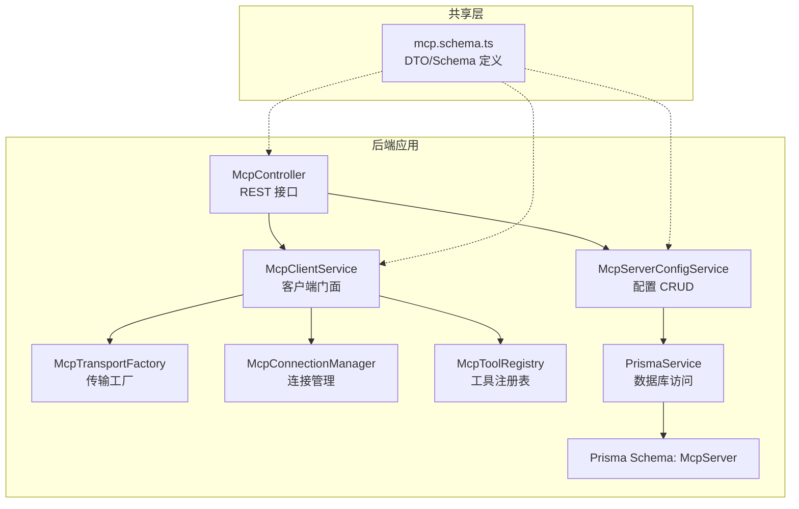
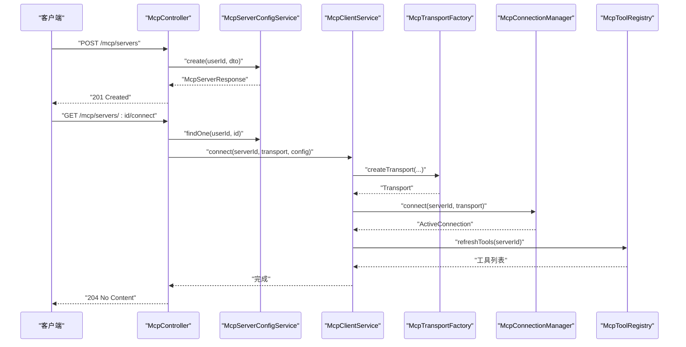
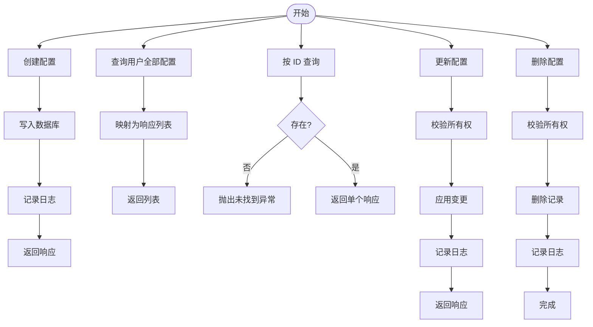
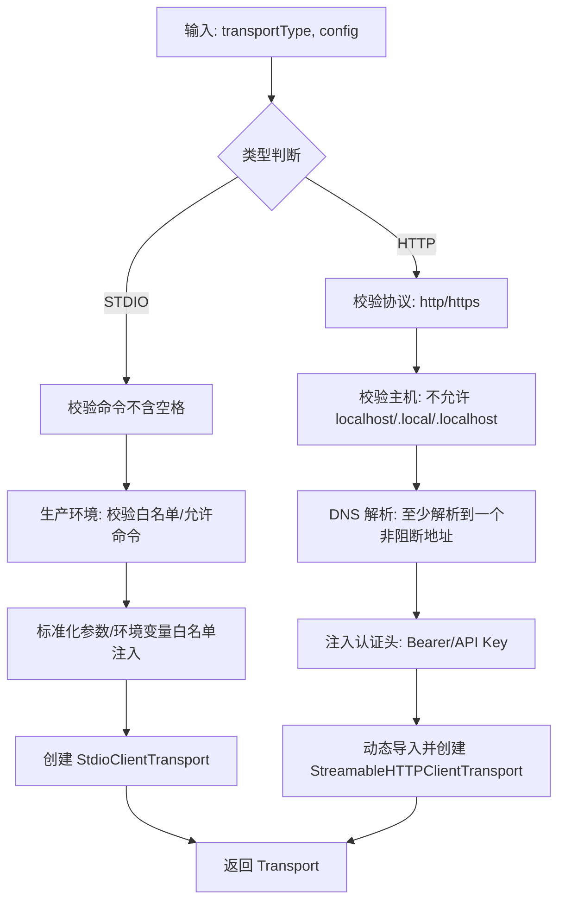
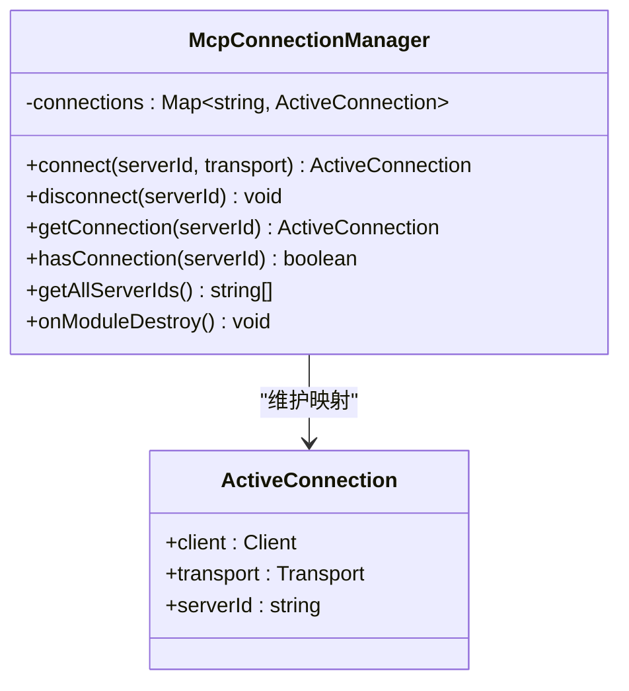
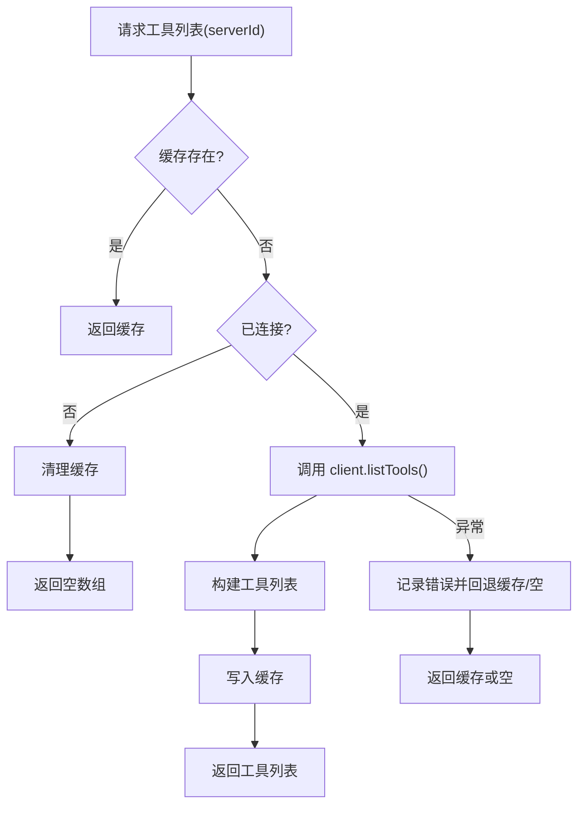
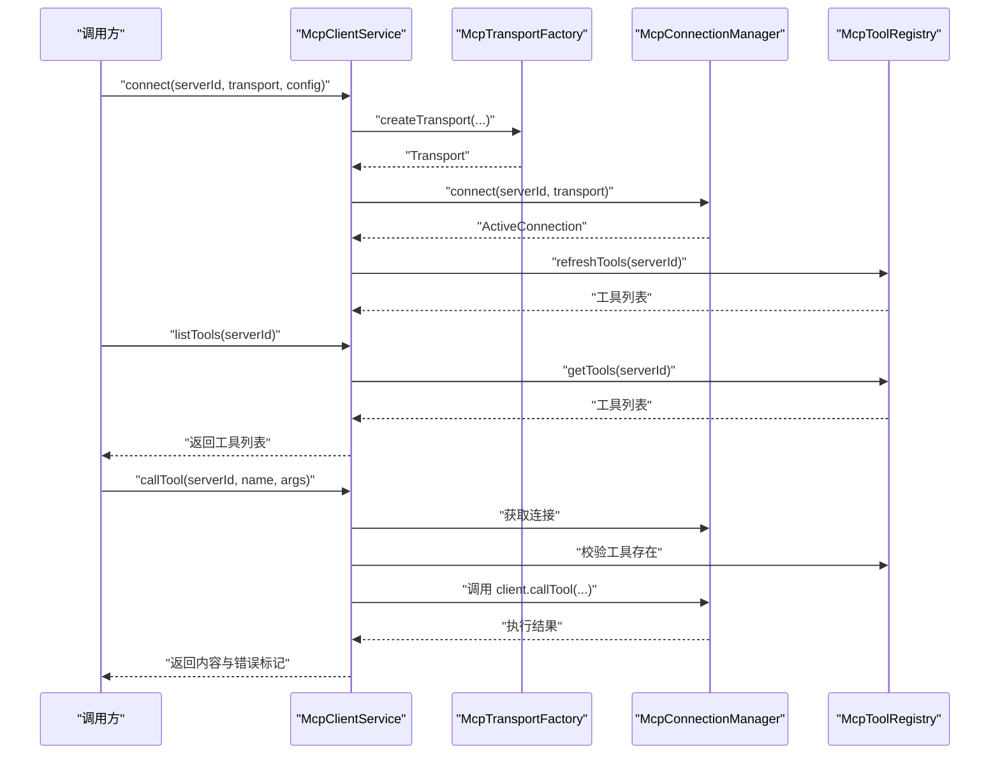
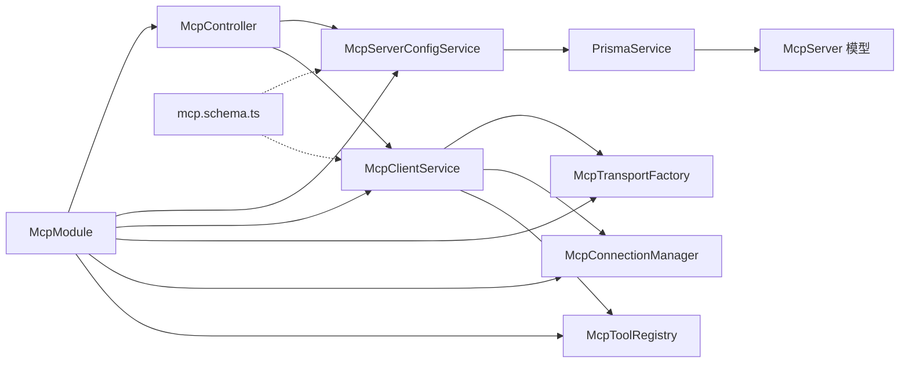

# MCP 服务器管理

<cite>
**本文引用的文件**
- [apps/backend/src/mcp/mcp-server-config.service.ts](file://apps/backend/src/mcp/mcp-server-config.service.ts)
- [apps/backend/src/mcp/mcp.dto.ts](file://apps/backend/src/mcp/mcp.dto.ts)
- [apps/backend/src/mcp/core/mcp-transport.factory.ts](file://apps/backend/src/mcp/core/mcp-transport.factory.ts)
- [apps/backend/src/mcp/core/mcp-connection.manager.ts](file://apps/backend/src/mcp/core/mcp-connection.manager.ts)
- [apps/backend/src/mcp/core/mcp-tool.registry.ts](file://apps/backend/src/mcp/core/mcp-tool.registry.ts)
- [apps/backend/src/mcp/mcp.controller.ts](file://apps/backend/src/mcp/mcp.controller.ts)
- [apps/backend/src/mcp/mcp.module.ts](file://apps/backend/src/mcp/mcp.module.ts)
- [apps/backend/src/mcp/mcp-client.service.ts](file://apps/backend/src/mcp/mcp-client.service.ts)
- [packages/shared/src/schemas/mcp.schema.ts](file://packages/shared/src/schemas/mcp.schema.ts)
- [apps/backend/prisma/schema/mcp.prisma](file://apps/backend/prisma/schema/mcp.prisma)
</cite>

## 目录
1. [简介](#简介)
2. [项目结构](#项目结构)
3. [核心组件](#核心组件)
4. [架构总览](#架构总览)
5. [详细组件分析](#详细组件分析)
6. [依赖关系分析](#依赖关系分析)
7. [性能考量](#性能考量)
8. [故障排除指南](#故障排除指南)
9. [结论](#结论)
10. [附录](#附录)

## 简介
本文件系统性阐述 MCP（Model Context Protocol）服务器管理系统的设计与实现，重点围绕以下目标展开：
- 深入解析 McpServerConfigService 的配置管理机制与数据持久化策略
- 描述 MCP 服务器的注册、发现与生命周期管理流程
- 详解两种传输协议（HTTP、STDIO）的配置方法与适用场景
- 解释连接状态监控与健康检查机制
- 总结配置验证规则与错误处理策略
- 提供故障排除与性能调优建议
- 说明多服务器配置与负载均衡策略

## 项目结构
MCP 模块采用按职责分层的组织方式，控制器负责接口编排，服务层负责业务逻辑，核心模块负责传输、连接与工具注册，共享层提供跨包的数据验证与类型定义。

图表来源
- [apps/backend/src/mcp/mcp.controller.ts:34-198](file://apps/backend/src/mcp/mcp.controller.ts#L34-L198)
- [apps/backend/src/mcp/mcp-server-config.service.ts:10-156](file://apps/backend/src/mcp/mcp-server-config.service.ts#L10-L156)
- [apps/backend/src/mcp/mcp-client.service.ts:17-124](file://apps/backend/src/mcp/mcp-client.service.ts#L17-L124)
- [apps/backend/src/mcp/core/mcp-transport.factory.ts:10-220](file://apps/backend/src/mcp/core/mcp-transport.factory.ts#L10-L220)
- [apps/backend/src/mcp/core/mcp-connection.manager.ts:12-101](file://apps/backend/src/mcp/core/mcp-connection.manager.ts#L12-L101)
- [apps/backend/src/mcp/core/mcp-tool.registry.ts:5-48](file://apps/backend/src/mcp/core/mcp-tool.registry.ts#L5-L48)
- [apps/backend/prisma/schema/mcp.prisma:1-16](file://apps/backend/prisma/schema/mcp.prisma#L1-L16)
- [packages/shared/src/schemas/mcp.schema.ts:1-220](file://packages/shared/src/schemas/mcp.schema.ts#L1-L220)

章节来源
- [apps/backend/src/mcp/mcp.module.ts:9-25](file://apps/backend/src/mcp/mcp.module.ts#L9-L25)

## 核心组件
- 配置服务（McpServerConfigService）
  - 负责用户维度的 MCP 服务器配置的增删改查、启用筛选与所有权校验
  - 使用 Prisma 访问数据库，返回带时间戳的响应结构
- 客户端服务（McpClientService）
  - 统一门面：封装传输创建、连接管理、工具拉取与工具调用
  - 通过传输工厂与连接管理器协作
- 传输工厂（McpTransportFactory）
  - 根据传输类型创建对应传输实例（STDIO 或 HTTP）
  - 实施安全限制与环境变量白名单
- 连接管理器（McpConnectionManager）
  - 维护活跃连接映射，支持重连、断开与关闭钩子
- 工具注册表（McpToolRegistry）
  - 缓存服务器工具清单，支持刷新与清理
- 控制器（McpController）
  - 对外暴露 REST 接口：创建/查询/更新/删除配置；连接/断开；列出工具；调用工具
- 数据模型（Prisma Schema: McpServer）
  - 存储服务器名称、描述、传输类型、配置 JSON、启用状态与用户关联
- 共享 Schema（mcp.schema.ts）
  - 定义传输类型、STDIO/HTTP 配置结构、创建/更新校验规则与工具响应结构

章节来源
- [apps/backend/src/mcp/mcp-server-config.service.ts:10-156](file://apps/backend/src/mcp/mcp-server-config.service.ts#L10-L156)
- [apps/backend/src/mcp/mcp-client.service.ts:17-124](file://apps/backend/src/mcp/mcp-client.service.ts#L17-L124)
- [apps/backend/src/mcp/core/mcp-transport.factory.ts:10-220](file://apps/backend/src/mcp/core/mcp-transport.factory.ts#L10-L220)
- [apps/backend/src/mcp/core/mcp-connection.manager.ts:12-101](file://apps/backend/src/mcp/core/mcp-connection.manager.ts#L12-L101)
- [apps/backend/src/mcp/core/mcp-tool.registry.ts:5-48](file://apps/backend/src/mcp/core/mcp-tool.registry.ts#L5-L48)
- [apps/backend/src/mcp/mcp.controller.ts:34-198](file://apps/backend/src/mcp/mcp.controller.ts#L34-L198)
- [apps/backend/prisma/schema/mcp.prisma:1-16](file://apps/backend/prisma/schema/mcp.prisma#L1-L16)
- [packages/shared/src/schemas/mcp.schema.ts:1-220](file://packages/shared/src/schemas/mcp.schema.ts#L1-L220)

## 架构总览
下图展示从控制器到配置与客户端服务，再到传输工厂、连接管理器与工具注册表的整体交互。

图表来源
- [apps/backend/src/mcp/mcp.controller.ts:45-140](file://apps/backend/src/mcp/mcp.controller.ts#L45-L140)
- [apps/backend/src/mcp/mcp-server-config.service.ts:18-33](file://apps/backend/src/mcp/mcp-server-config.service.ts#L18-L33)
- [apps/backend/src/mcp/mcp-client.service.ts:33-47](file://apps/backend/src/mcp/mcp-client.service.ts#L33-L47)
- [apps/backend/src/mcp/core/mcp-transport.factory.ts:112-126](file://apps/backend/src/mcp/core/mcp-transport.factory.ts#L112-L126)
- [apps/backend/src/mcp/core/mcp-connection.manager.ts:23-73](file://apps/backend/src/mcp/core/mcp-connection.manager.ts#L23-L73)
- [apps/backend/src/mcp/core/mcp-tool.registry.ts:20-42](file://apps/backend/src/mcp/core/mcp-tool.registry.ts#L20-L42)

## 详细组件分析

### 配置服务：McpServerConfigService
- 职责
  - 创建：写入名称、描述、传输类型、配置 JSON、启用状态与用户 ID
  - 查询：按用户列出全部、按 ID 查询、查询启用集合（用于工具自动发现）
  - 更新：部分字段可更新，含传输与配置联动校验
  - 删除：先校验所有权再删除
- 关键点
  - 所有权校验：通过查询用户 ID 并比对抛出未授权异常
  - 响应转换：将数据库记录转为包含日期时间戳的响应对象
  - 启用筛选：findEnabled 返回按创建时间升序排列的启用服务器，便于稳定发现顺序

图表来源
- [apps/backend/src/mcp/mcp-server-config.service.ts:18-96](file://apps/backend/src/mcp/mcp-server-config.service.ts#L18-L96)

章节来源
- [apps/backend/src/mcp/mcp-server-config.service.ts:10-156](file://apps/backend/src/mcp/mcp-server-config.service.ts#L10-L156)

### 传输工厂：McpTransportFactory
- 职责
  - 根据传输类型创建传输实例
  - 实施安全策略：阻止私有/回环地址与特定主机名，校验 HTTP 协议与解析结果
  - STDIO 安全校验：生产环境需显式允许命令白名单，开发环境默认允许
  - 环境变量注入：仅允许白名单键进入子进程
- 关键点
  - HTTP 安全：仅允许 http/https，禁止 localhost、.local、.localhost 及私网 IP
  - STDIO 安全：禁止命令含空格（必须拆分为 args），支持包名纠错与 CWD 设置
  - 认证头：支持 Bearer/OAuth 与 API Key，自动注入 Authorization 或自定义头部

图表来源
- [apps/backend/src/mcp/core/mcp-transport.factory.ts:112-218](file://apps/backend/src/mcp/core/mcp-transport.factory.ts#L112-L218)
- [packages/shared/src/schemas/mcp.schema.ts:63-118](file://packages/shared/src/schemas/mcp.schema.ts#L63-L118)

章节来源
- [apps/backend/src/mcp/core/mcp-transport.factory.ts:10-220](file://apps/backend/src/mcp/core/mcp-transport.factory.ts#L10-L220)
- [packages/shared/src/schemas/mcp.schema.ts:1-220](file://packages/shared/src/schemas/mcp.schema.ts#L1-L220)

### 连接管理器：McpConnectionManager
- 职责
  - 维护 serverId 到 ActiveConnection 的映射
  - 连接/断开/重连，捕获 STDIO stderr 错误与关闭事件
  - 应用关闭时自动断开所有连接
- 关键点
  - 懒连接：在需要时才建立连接
  - 错误处理：记录 stderr、错误与关闭事件
  - 超时设置：客户端选项中包含请求超时配置

图表来源
- [apps/backend/src/mcp/core/mcp-connection.manager.ts:6-101](file://apps/backend/src/mcp/core/mcp-connection.manager.ts#L6-L101)

章节来源
- [apps/backend/src/mcp/core/mcp-connection.manager.ts:12-101](file://apps/backend/src/mcp/core/mcp-connection.manager.ts#L12-L101)

### 工具注册表：McpToolRegistry
- 职责
  - 缓存每个服务器的工具清单
  - 首次或刷新时通过连接客户端调用远端 listTools
  - 出错时回退到缓存或清空缓存
- 关键点
  - 与连接管理器耦合，无连接则清理缓存并返回空集
  - 成功后记录工具数量，便于可观测性

图表来源
- [apps/backend/src/mcp/core/mcp-tool.registry.ts:12-46](file://apps/backend/src/mcp/core/mcp-tool.registry.ts#L12-L46)

章节来源
- [apps/backend/src/mcp/core/mcp-tool.registry.ts:5-48](file://apps/backend/src/mcp/core/mcp-tool.registry.ts#L5-L48)

### 客户端服务：McpClientService
- 职责
  - 门面：协调传输工厂、连接管理器与工具注册表
  - 提供 connect、disconnect、listTools、callTool、连接状态查询等能力
- 关键点
  - 连接成功后预热工具注册表
  - 调用前校验工具是否存在，避免无效调用
  - 统一错误日志与异常抛出

图表来源
- [apps/backend/src/mcp/mcp-client.service.ts:33-108](file://apps/backend/src/mcp/mcp-client.service.ts#L33-L108)
- [apps/backend/src/mcp/core/mcp-transport.factory.ts:112-218](file://apps/backend/src/mcp/core/mcp-transport.factory.ts#L112-L218)
- [apps/backend/src/mcp/core/mcp-connection.manager.ts:23-73](file://apps/backend/src/mcp/core/mcp-connection.manager.ts#L23-L73)
- [apps/backend/src/mcp/core/mcp-tool.registry.ts:20-42](file://apps/backend/src/mcp/core/mcp-tool.registry.ts#L20-L42)

章节来源
- [apps/backend/src/mcp/mcp-client.service.ts:17-124](file://apps/backend/src/mcp/mcp-client.service.ts#L17-L124)

### 控制器：McpController
- 职责
  - 提供 REST 接口：创建/查询/更新/删除配置；连接/断开；列出工具；调用工具
  - 在工具发现时对启用服务器进行懒连接与工具拉取
- 关键点
  - 权限控制：基于 JWT 与当前用户上下文
  - 删除前断开连接：防止残留连接影响后续操作
  - 工具聚合：遍历启用服务器，注入 serverId 便于前端识别归属

章节来源
- [apps/backend/src/mcp/mcp.controller.ts:34-198](file://apps/backend/src/mcp/mcp.controller.ts#L34-L198)

### 数据模型与配置验证
- 数据模型（Prisma）
  - McpServer：存储 id、name、description、transport、config（JSON）、enabled、userId、时间戳
  - 用户外键级联删除，索引优化
- 配置验证（共享 Schema）
  - 传输类型枚举：STDIO、HTTP
  - STDIO 配置：command 必填、args 可选、env 可选、cwd 可选
  - HTTP 配置：url 必填且为合法 URL，仅允许公共 http/https，支持 headers 与多种认证方式
  - 创建/更新校验：transport 与 config 必须匹配；更新时若提供任一字段需同时提供另一字段

章节来源
- [apps/backend/prisma/schema/mcp.prisma:1-16](file://apps/backend/prisma/schema/mcp.prisma#L1-L16)
- [packages/shared/src/schemas/mcp.schema.ts:6-118](file://packages/shared/src/schemas/mcp.schema.ts#L6-L118)
- [apps/backend/src/mcp/mcp.dto.ts:1-59](file://apps/backend/src/mcp/mcp.dto.ts#L1-L59)

## 依赖关系分析
- 模块导出
  - McpModule 导出配置服务与客户端服务，供其他模块使用
- 组件耦合
  - 控制器依赖配置服务与客户端服务
  - 客户端服务依赖传输工厂、连接管理器与工具注册表
  - 配置服务依赖 Prisma 与共享 Schema 的 DTO
- 外部依赖
  - 传输层依赖 @modelcontextprotocol/sdk 的客户端与传输实现
  - 共享层依赖 zod 进行配置校验

图表来源
- [apps/backend/src/mcp/mcp.module.ts:13-22](file://apps/backend/src/mcp/mcp.module.ts#L13-L22)
- [apps/backend/src/mcp/mcp.controller.ts:37-40](file://apps/backend/src/mcp/mcp.controller.ts#L37-L40)
- [apps/backend/src/mcp/mcp-server-config.service.ts:13-13](file://apps/backend/src/mcp/mcp-server-config.service.ts#L13-L13)
- [apps/backend/src/mcp/mcp-client.service.ts:21-28](file://apps/backend/src/mcp/mcp-client.service.ts#L21-L28)
- [apps/backend/prisma/schema/mcp.prisma:1-16](file://apps/backend/prisma/schema/mcp.prisma#L1-L16)
- [packages/shared/src/schemas/mcp.schema.ts:1-220](file://packages/shared/src/schemas/mcp.schema.ts#L1-L220)

章节来源
- [apps/backend/src/mcp/mcp.module.ts:9-25](file://apps/backend/src/mcp/mcp.module.ts#L9-L25)

## 性能考量
- 连接复用
  - 连接管理器维护活跃连接映射，避免重复创建连接
- 懒连接与预热
  - 工具注册表在首次或刷新时拉取工具清单，减少不必要的网络往返
- 缓存策略
  - 工具注册表缓存工具列表，失败时回退缓存或清空，保证稳定性
- 请求超时
  - 客户端选项中包含请求超时配置，避免长时间阻塞
- I/O 优化
  - STDIO 传输仅注入白名单环境变量，减少不必要开销
  - HTTP 传输使用流式传输实现，降低内存占用

[本节为通用指导，无需具体文件引用]

## 故障排除指南
- 无法连接 MCP 服务器
  - 检查传输类型与配置是否匹配（创建/更新校验会强制要求一致）
  - 若为 HTTP：确认 URL 协议为 http/https，且主机不在阻断列表内；确保 DNS 解析成功且未解析到私网/回环地址
  - 若为 STDIO：确认命令不含空格（应拆分为 args）；生产环境需配置允许命令白名单；检查工作目录与环境变量
- 工具不可见或调用失败
  - 确认已连接且工具注册表已刷新
  - 调用前检查工具名称是否存在
  - 查看连接管理器日志中的 stderr 输出与错误事件
- 权限与安全
  - 删除配置前会断开连接，避免残留连接
  - 生产环境禁用 STDIO 或未配置白名单会导致连接失败
- 健康检查与监控
  - 连接管理器在连接建立后记录日志；STDIO 传输监听 stderr 与关闭事件
  - 工具注册表在刷新失败时记录错误并回退缓存

章节来源
- [apps/backend/src/mcp/mcp.controller.ts:94-101](file://apps/backend/src/mcp/mcp.controller.ts#L94-L101)
- [apps/backend/src/mcp/core/mcp-transport.factory.ts:91-110](file://apps/backend/src/mcp/core/mcp-transport.factory.ts#L91-L110)
- [apps/backend/src/mcp/core/mcp-connection.manager.ts:44-58](file://apps/backend/src/mcp/core/mcp-connection.manager.ts#L44-L58)
- [apps/backend/src/mcp/core/mcp-tool.registry.ts:38-41](file://apps/backend/src/mcp/core/mcp-tool.registry.ts#L38-L41)

## 结论
该 MCP 服务器管理系统通过清晰的分层设计实现了配置管理、传输抽象、连接生命周期与工具注册的完整闭环。共享 Schema 提供强一致的配置验证，传输工厂与连接管理器保障了安全性与稳定性，客户端服务作为门面简化了上层调用。结合懒连接、缓存与错误回退策略，系统在可用性与性能之间取得平衡，并为后续扩展（如多服务器与负载均衡）提供了良好基础。

[本节为总结性内容，无需具体文件引用]

## 附录

### 传输协议配置与使用场景
- HTTP
  - 适用：远程 MCP 服务器、云服务集成、需要认证与代理支持的场景
  - 配置要点：URL 合法性与公共可达性校验、认证头注入（Bearer/OAuth/API Key）
- STDIO
  - 适用：本地可执行程序、脚本工具、开发调试
  - 配置要点：命令不含空格、args 明确分离、生产环境白名单与受限环境变量

章节来源
- [packages/shared/src/schemas/mcp.schema.ts:79-118](file://packages/shared/src/schemas/mcp.schema.ts#L79-L118)
- [apps/backend/src/mcp/core/mcp-transport.factory.ts:128-188](file://apps/backend/src/mcp/core/mcp-transport.factory.ts#L128-L188)

### 多服务器配置与负载均衡策略
- 多服务器配置
  - 通过控制器接口为同一用户注册多个 MCP 服务器，分别配置传输与认证
  - 工具发现时遍历启用服务器并注入 serverId，便于前端识别归属
- 负载均衡策略
  - 当前实现未内置多实例负载均衡；可在外部网关或反向代理层实现
  - 建议：基于连接数、延迟或健康状态选择后端实例，并结合连接池与重试策略

章节来源
- [apps/backend/src/mcp/mcp.controller.ts:108-129](file://apps/backend/src/mcp/mcp.controller.ts#L108-L129)