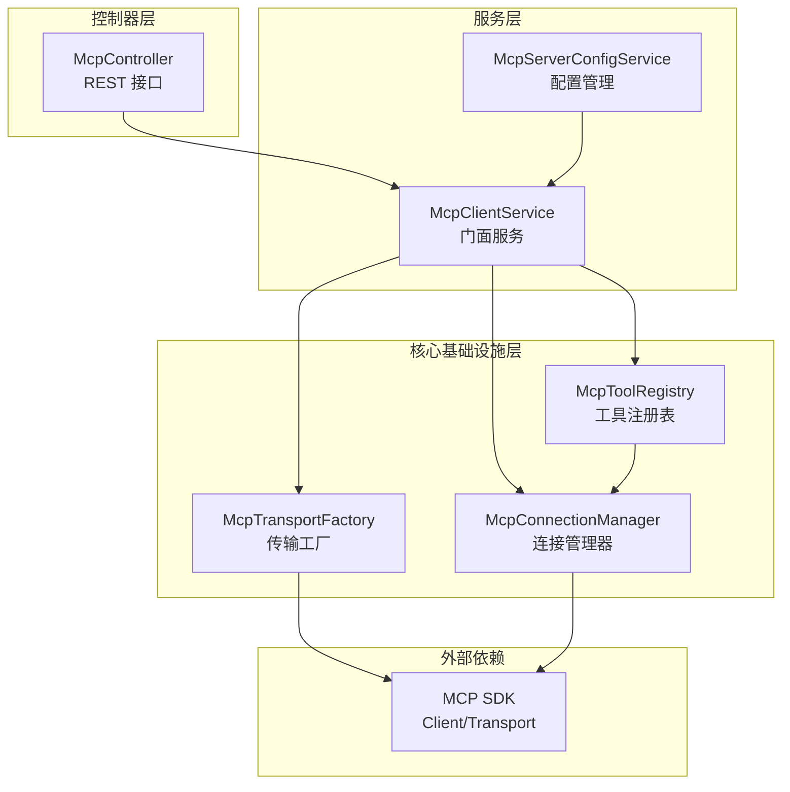
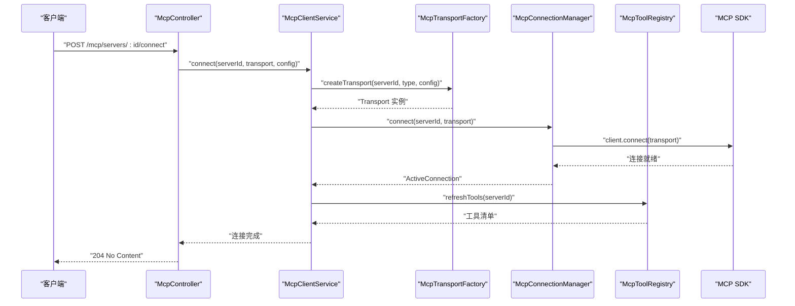
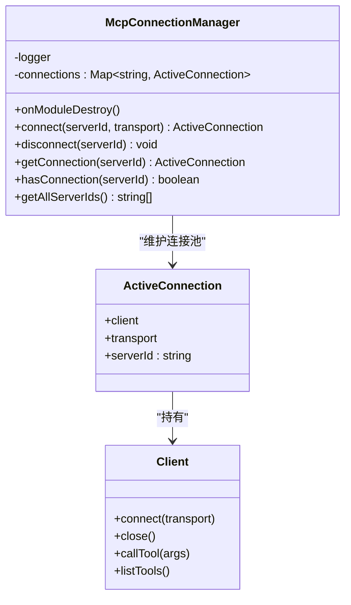
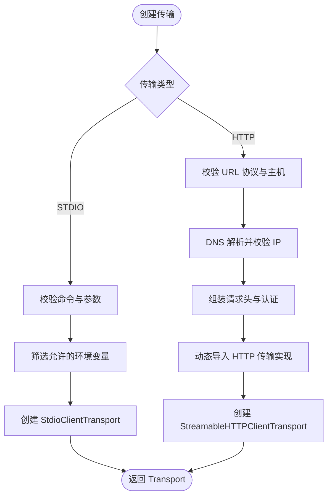
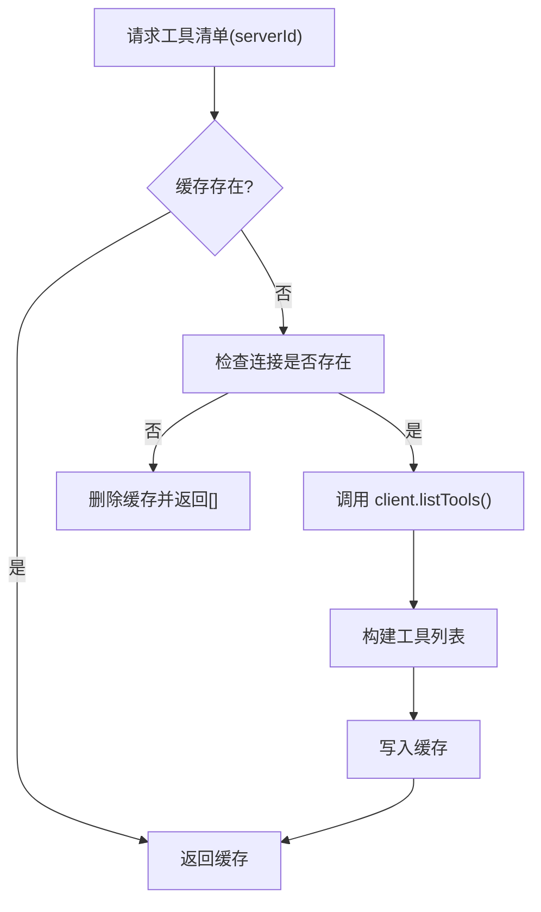
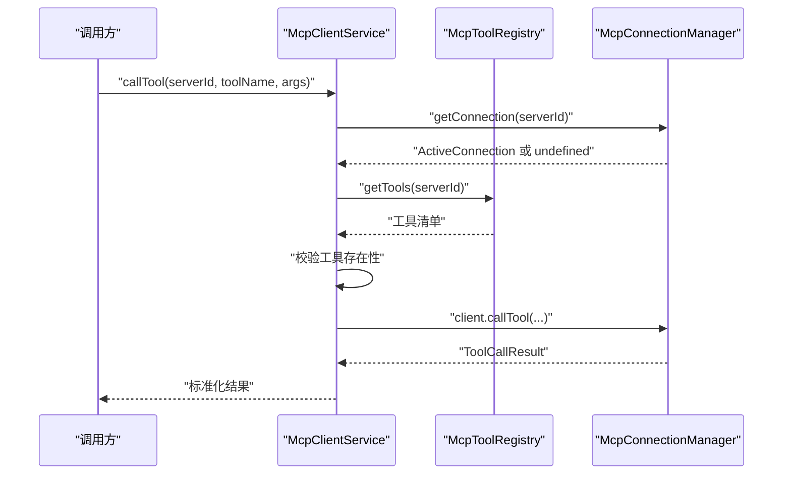
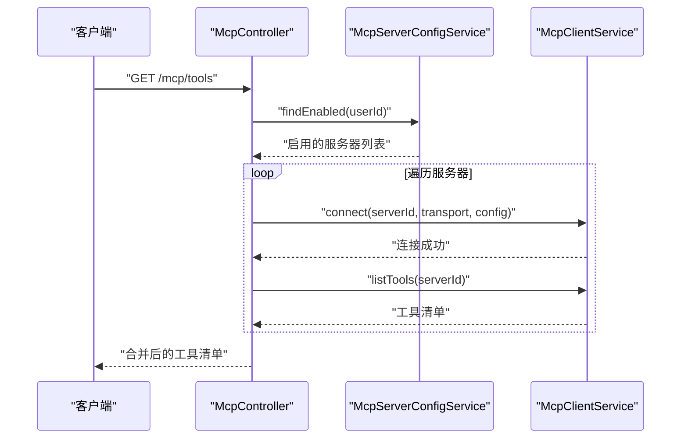
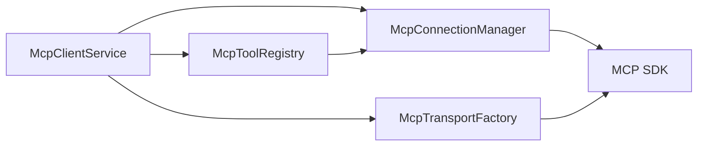
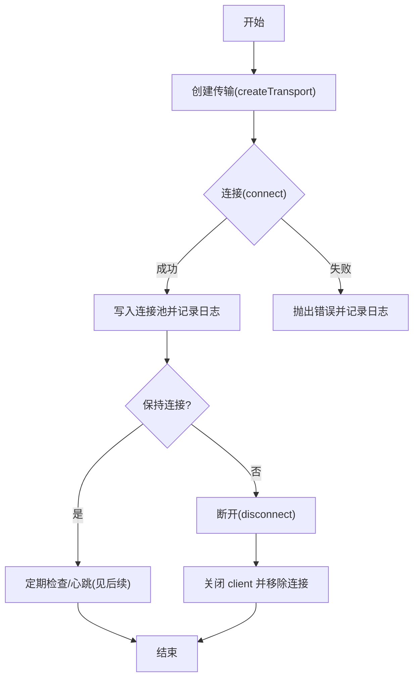

# MCP 连接管理

<cite>
**本文引用的文件**
- [apps/backend/src/mcp/core/mcp-connection.manager.ts](file://apps/backend/src/mcp/core/mcp-connection.manager.ts)
- [apps/backend/src/mcp/core/mcp-transport.factory.ts](file://apps/backend/src/mcp/core/mcp-transport.factory.ts)
- [apps/backend/src/mcp/core/mcp-tool.registry.ts](file://apps/backend/src/mcp/core/mcp-tool.registry.ts)
- [apps/backend/src/mcp/mcp-client.service.ts](file://apps/backend/src/mcp/mcp-client.service.ts)
- [apps/backend/src/mcp/mcp.dto.ts](file://apps/backend/src/mcp/mcp.dto.ts)
- [apps/backend/src/mcp/mcp.module.ts](file://apps/backend/src/mcp/mcp.module.ts)
- [apps/backend/src/mcp/mcp.controller.ts](file://apps/backend/src/mcp/mcp.controller.ts)
- [apps/backend/src/mcp/mcp-server-config.service.ts](file://apps/backend/src/mcp/mcp-server-config.service.ts)
- [packages/shared/src/schemas/mcp.schema.ts](file://packages/shared/src/schemas/mcp.schema.ts)
- [apps/backend/tests/mcp/mcp-client.service.spec.ts](file://apps/backend/tests/mcp/mcp-client.service.spec.ts)
- [apps/backend/tests/mcp/mcp-transport.factory.spec.ts](file://apps/backend/tests/mcp/mcp-transport.factory.spec.ts)
</cite>

## 目录
1. [简介](#简介)
2. [项目结构](#项目结构)
3. [核心组件](#核心组件)
4. [架构总览](#架构总览)
5. [详细组件分析](#详细组件分析)
6. [依赖关系分析](#依赖关系分析)
7. [性能考量](#性能考量)
8. [故障排查指南](#故障排查指南)
9. [结论](#结论)
10. [附录](#附录)

## 简介
本文件面向 MCP（Model Context Protocol）连接管理系统的专业技术文档，聚焦以下目标：
- 解释 McpConnectionManager 的连接池管理与会话维护机制
- 描述传输工厂（McpTransportFactory）的设计模式与多传输协议支持（STDIO、HTTP）
- 说明连接建立、保持与断开的完整流程
- 解释连接超时、重连与故障转移策略
- 包含连接状态监控、心跳检测与异常恢复机制
- 提供连接性能优化与资源管理最佳实践
- 描述并发连接处理与线程安全保证

## 项目结构
MCP 子系统由“控制器层”“服务层”“核心基础设施层”三部分组成，围绕 McpClientService 提供统一门面，内部委托 McpTransportFactory 与 McpConnectionManager 完成传输创建与连接生命周期管理，并通过 McpToolRegistry 维护工具清单缓存。

图表来源
- [apps/backend/src/mcp/mcp.controller.ts:1-198](file://apps/backend/src/mcp/mcp.controller.ts#L1-198)
- [apps/backend/src/mcp/mcp-client.service.ts:1-124](file://apps/backend/src/mcp/mcp-client.service.ts#L1-124)
- [apps/backend/src/mcp/mcp-server-config.service.ts:1-156](file://apps/backend/src/mcp/mcp-server-config.service.ts#L1-156)
- [apps/backend/src/mcp/core/mcp-transport.factory.ts:1-220](file://apps/backend/src/mcp/core/mcp-transport.factory.ts#L1-220)
- [apps/backend/src/mcp/core/mcp-connection.manager.ts:1-101](file://apps/backend/src/mcp/core/mcp-connection.manager.ts#L1-101)
- [apps/backend/src/mcp/core/mcp-tool.registry.ts:1-48](file://apps/backend/src/mcp/core/mcp-tool.registry.ts#L1-48)

章节来源
- [apps/backend/src/mcp/mcp.module.ts:1-25](file://apps/backend/src/mcp/mcp.module.ts#L1-25)
- [apps/backend/src/mcp/mcp.controller.ts:1-198](file://apps/backend/src/mcp/mcp.controller.ts#L1-198)
- [apps/backend/src/mcp/mcp-client.service.ts:1-124](file://apps/backend/src/mcp/mcp-client.service.ts#L1-124)

## 核心组件
- McpConnectionManager：负责连接的创建、复用、关闭与状态查询；维护 serverId 到 ActiveConnection 的映射；在模块销毁时清理所有连接。
- McpTransportFactory：根据配置创建不同传输实例（STDIO/HTTP），执行安全检查与环境变量过滤，动态加载 HTTP 传输实现。
- McpToolRegistry：缓存每个服务器的工具清单，基于连接状态进行刷新或回退。
- McpClientService：门面服务，协调传输创建、连接管理与工具调用。
- DTO 与 Schema：定义传输类型、配置结构与校验规则，确保前后端一致。

章节来源
- [apps/backend/src/mcp/core/mcp-connection.manager.ts:1-101](file://apps/backend/src/mcp/core/mcp-connection.manager.ts#L1-101)
- [apps/backend/src/mcp/core/mcp-transport.factory.ts:1-220](file://apps/backend/src/mcp/core/mcp-transport.factory.ts#L1-220)
- [apps/backend/src/mcp/core/mcp-tool.registry.ts:1-48](file://apps/backend/src/mcp/core/mcp-tool.registry.ts#L1-48)
- [apps/backend/src/mcp/mcp-client.service.ts:1-124](file://apps/backend/src/mcp/mcp-client.service.ts#L1-124)
- [apps/backend/src/mcp/mcp.dto.ts:1-59](file://apps/backend/src/mcp/mcp.dto.ts#L1-59)
- [packages/shared/src/schemas/mcp.schema.ts:1-220](file://packages/shared/src/schemas/mcp.schema.ts#L1-220)

## 架构总览
下图展示从控制器到客户端服务、再到传输工厂与连接管理器的整体调用链路与职责边界。

图表来源
- [apps/backend/src/mcp/mcp.controller.ts:133-140](file://apps/backend/src/mcp/mcp.controller.ts#L133-L140)
- [apps/backend/src/mcp/mcp-client.service.ts:33-47](file://apps/backend/src/mcp/mcp-client.service.ts#L33-L47)
- [apps/backend/src/mcp/core/mcp-transport.factory.ts:112-126](file://apps/backend/src/mcp/core/mcp-transport.factory.ts#L112-L126)
- [apps/backend/src/mcp/core/mcp-connection.manager.ts:23-73](file://apps/backend/src/mcp/core/mcp-connection.manager.ts#L23-L73)
- [apps/backend/src/mcp/core/mcp-tool.registry.ts:20-42](file://apps/backend/src/mcp/core/mcp-tool.registry.ts#L20-L42)

## 详细组件分析

### McpConnectionManager：连接池与会话维护
- 数据结构
  - 使用 Map<serverId, ActiveConnection> 维护连接池，键为 serverId，值包含已连接的 Client 与 Transport。
- 生命周期
  - connect：若同 serverId 已存在则先断开再重建；创建 Client 并发起连接；对 STDIO 传输绑定 stderr/onclose/onerror 回调；连接成功后写入连接池。
  - disconnect：关闭 client 并移除连接；模块销毁时遍历清理。
  - 查询接口：getConnection、hasConnection、getAllServerIds。
- 异常与日志
  - 对连接错误进行捕获并记录；对 STDIO 的 stderr 错误流与 onclose/onerror 进行日志输出。
- 线程安全
  - 当前实现为单进程内存 Map，无并发锁；在 NestJS 默认单实例场景下可满足需求。若需多实例或多线程，建议引入分布式锁或进程间同步机制。

图表来源
- [apps/backend/src/mcp/core/mcp-connection.manager.ts:6-101](file://apps/backend/src/mcp/core/mcp-connection.manager.ts#L6-L101)

章节来源
- [apps/backend/src/mcp/core/mcp-connection.manager.ts:13-101](file://apps/backend/src/mcp/core/mcp-connection.manager.ts#L13-L101)

### McpTransportFactory：传输工厂与安全策略
- 设计模式
  - 工厂方法：根据传入的传输类型返回对应 Transport 实例。
- 支持的传输
  - STDIO：通过 StdioClientTransport 启动外部进程，支持命令白名单、允许的环境变量注入、工作目录与标准错误管道。
  - HTTP：通过 StreamableHTTPClientTransport 建立可流式的 HTTP 连接，支持请求头与认证（Bearer/OAuth/API Key）。
- 安全策略
  - 主机名与 IP 地址黑名单：阻止 localhost、.localhost、.local 及私有/环回地址；对 HTTP 目标进行 DNS 解析并再次校验解析结果。
  - STDIO 环境控制：仅传递受控环境变量集合，避免泄露敏感信息；生产环境默认禁用 STDIO 或要求显式白名单命令。
- 动态加载
  - HTTP 传输按需动态导入，降低启动时依赖体积。

图表来源
- [apps/backend/src/mcp/core/mcp-transport.factory.ts:112-218](file://apps/backend/src/mcp/core/mcp-transport.factory.ts#L112-L218)
- [packages/shared/src/schemas/mcp.schema.ts:63-118](file://packages/shared/src/schemas/mcp.schema.ts#L63-L118)

章节来源
- [apps/backend/src/mcp/core/mcp-transport.factory.ts:11-220](file://apps/backend/src/mcp/core/mcp-transport.factory.ts#L11-L220)
- [packages/shared/src/schemas/mcp.schema.ts:1-220](file://packages/shared/src/schemas/mcp.schema.ts#L1-L220)

### McpToolRegistry：工具清单缓存与刷新
- 缓存策略
  - 以 serverId 为键缓存工具清单；首次访问时从连接的 Client 列表工具，随后读取缓存。
- 刷新与回退
  - 若连接不存在则清空缓存并返回空集；刷新失败时回退到已有缓存。
- 与连接管理器耦合
  - 通过 getConnection 判断连接有效性，确保工具查询的原子性。

图表来源
- [apps/backend/src/mcp/core/mcp-tool.registry.ts:12-47](file://apps/backend/src/mcp/core/mcp-tool.registry.ts#L12-L47)

章节来源
- [apps/backend/src/mcp/core/mcp-tool.registry.ts:1-48](file://apps/backend/src/mcp/core/mcp-tool.registry.ts#L1-L48)

### McpClientService：门面与调用编排
- 连接管理
  - connect：创建传输 → 建立连接 → 预热工具缓存。
  - disconnect：清理工具缓存 → 断开连接。
- 工具调用
  - listTools：若未连接则抛错；否则返回工具清单。
  - callTool：校验工具存在性 → 发起工具调用 → 返回标准化结果。
- 状态查询
  - isConnected、getActiveConnections。

图表来源
- [apps/backend/src/mcp/mcp-client.service.ts:70-108](file://apps/backend/src/mcp/mcp-client.service.ts#L70-L108)
- [apps/backend/src/mcp/core/mcp-tool.registry.ts:20-42](file://apps/backend/src/mcp/core/mcp-tool.registry.ts#L20-L42)
- [apps/backend/src/mcp/core/mcp-connection.manager.ts:89-95](file://apps/backend/src/mcp/core/mcp-connection.manager.ts#L89-L95)

章节来源
- [apps/backend/src/mcp/mcp-client.service.ts:1-124](file://apps/backend/src/mcp/mcp-client.service.ts#L1-L124)

### 控制器与配置服务：端到端流程
- 控制器
  - 提供连接/断开、工具发现与调用等 REST 接口；在工具发现时采用“懒连接”策略，按需连接并聚合工具。
- 配置服务
  - 负责用户维度的 MCP 服务器配置的增删改查与启用状态管理。

图表来源
- [apps/backend/src/mcp/mcp.controller.ts:108-129](file://apps/backend/src/mcp/mcp.controller.ts#L108-L129)
- [apps/backend/src/mcp/mcp-server-config.service.ts:102-109](file://apps/backend/src/mcp/mcp-server-config.service.ts#L102-L109)
- [apps/backend/src/mcp/mcp-client.service.ts:60-65](file://apps/backend/src/mcp/mcp-client.service.ts#L60-L65)

章节来源
- [apps/backend/src/mcp/mcp.controller.ts:1-198](file://apps/backend/src/mcp/mcp.controller.ts#L1-198)
- [apps/backend/src/mcp/mcp-server-config.service.ts:1-156](file://apps/backend/src/mcp/mcp-server-config.service.ts#L1-L156)

## 依赖关系分析
- 组件内聚与耦合
  - McpClientService 作为门面，低耦合地依赖三个核心组件；McpToolRegistry 与 McpConnectionManager 弱耦合（仅通过 getConnection）。
- 外部依赖
  - 依赖 MCP SDK 的 Client 与 Transport；HTTP 传输按需动态导入。
- 环境与配置
  - 通过环境变量控制 STDIO 启用与命令白名单；HTTP 传输使用 Zod Schema 校验输入。

图表来源
- [apps/backend/src/mcp/mcp-client.service.ts:21-28](file://apps/backend/src/mcp/mcp-client.service.ts#L21-L28)
- [apps/backend/src/mcp/core/mcp-connection.manager.ts:29-39](file://apps/backend/src/mcp/core/mcp-connection.manager.ts#L29-L39)
- [apps/backend/src/mcp/core/mcp-transport.factory.ts:210-217](file://apps/backend/src/mcp/core/mcp-transport.factory.ts#L210-L217)

章节来源
- [apps/backend/src/mcp/mcp-client.service.ts:1-124](file://apps/backend/src/mcp/mcp-client.service.ts#L1-L124)
- [apps/backend/src/mcp/core/mcp-connection.manager.ts:1-101](file://apps/backend/src/mcp/core/mcp-connection.manager.ts#L1-L101)
- [apps/backend/src/mcp/core/mcp-transport.factory.ts:1-220](file://apps/backend/src/mcp/core/mcp-transport.factory.ts#L1-L220)

## 性能考量
- 连接池与复用
  - 通过 Map 以 serverId 为键复用连接，避免重复创建；断开时释放资源。
- 工具缓存
  - McpToolRegistry 缓存工具清单，减少频繁查询；刷新失败时回退，保障稳定性。
- 传输选择
  - HTTP 传输采用可流式实现，适合长连接与高吞吐；STDIO 适合本地开发与受限环境。
- 动态导入
  - HTTP 传输按需加载，降低启动时依赖体积与冷启动时间。
- 资源管理
  - 在模块销毁时统一断开所有连接，防止资源泄漏。
- 并发与线程安全
  - 当前实现为单进程内存 Map，NestJS 默认单实例场景可用；多实例/多进程需引入分布式锁或进程间同步。

章节来源
- [apps/backend/src/mcp/core/mcp-connection.manager.ts:17-21](file://apps/backend/src/mcp/core/mcp-connection.manager.ts#L17-L21)
- [apps/backend/src/mcp/core/mcp-tool.registry.ts:12-42](file://apps/backend/src/mcp/core/mcp-tool.registry.ts#L12-L42)
- [apps/backend/src/mcp/core/mcp-transport.factory.ts:210-217](file://apps/backend/src/mcp/core/mcp-transport.factory.ts#L210-L217)

## 故障排查指南
- 连接失败
  - 检查传输工厂的安全策略与环境变量设置；确认 STDIO 命令白名单与 NODE_ENV 配置；核对 HTTP URL 协议与 DNS 解析。
- 工具调用失败
  - 确认已连接且工具名称正确；查看工具缓存是否过期；检查 MCP 服务器端能力与工具定义。
- 日志定位
  - 关注 McpConnectionManager 与 McpTransportFactory 的日志输出，定位 stderr、onclose、onerror 事件。
- 测试参考
  - 参考单元测试对传输工厂与客户端服务的行为进行对照验证。

章节来源
- [apps/backend/src/mcp/core/mcp-connection.manager.ts:44-58](file://apps/backend/src/mcp/core/mcp-connection.manager.ts#L44-L58)
- [apps/backend/tests/mcp/mcp-transport.factory.spec.ts:1-128](file://apps/backend/tests/mcp/mcp-transport.factory.spec.ts#L1-L128)
- [apps/backend/tests/mcp/mcp-client.service.spec.ts:1-144](file://apps/backend/tests/mcp/mcp-client.service.spec.ts#L1-L144)

## 结论
该 MCP 连接管理系统通过清晰的分层设计与职责分离，实现了对多种传输协议的支持与安全约束，提供了稳定的连接生命周期管理与工具缓存机制。结合懒连接与动态导入等策略，在保证安全性的同时兼顾了性能与可维护性。未来可在多实例/多进程场景下增强线程安全与分布式一致性保障。

## 附录

### 连接建立、保持与断开流程

图表来源
- [apps/backend/src/mcp/core/mcp-transport.factory.ts:112-126](file://apps/backend/src/mcp/core/mcp-transport.factory.ts#L112-L126)
- [apps/backend/src/mcp/core/mcp-connection.manager.ts:23-73](file://apps/backend/src/mcp/core/mcp-connection.manager.ts#L23-L73)
- [apps/backend/src/mcp/core/mcp-connection.manager.ts:75-87](file://apps/backend/src/mcp/core/mcp-connection.manager.ts#L75-L87)

### 心跳检测与异常恢复
- 心跳检测
  - 当前实现未内置心跳定时器；可通过在应用层定时触发工具调用或轮询接口模拟心跳。
- 异常恢复
  - 连接断开时记录 onclose 与 stderr 错误；上层可基于断开事件触发重连策略（建议在业务层实现）。

章节来源
- [apps/backend/src/mcp/core/mcp-connection.manager.ts:44-58](file://apps/backend/src/mcp/core/mcp-connection.manager.ts#L44-L58)

### 连接超时、重连与故障转移策略
- 超时
  - Client 初始化时设置了请求超时选项；可根据需要调整。
- 重连
  - 当前未实现自动重连；可在业务层监听断开事件后进行指数退避重连。
- 故障转移
  - 可通过配置多个服务器并按优先级顺序尝试连接，失败时切换至下一个。

章节来源
- [apps/backend/src/mcp/core/mcp-connection.manager.ts:29-39](file://apps/backend/src/mcp/core/mcp-connection.manager.ts#L29-L39)