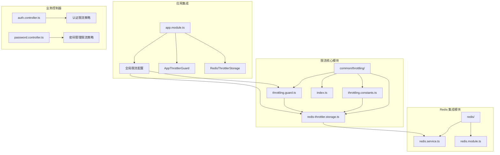
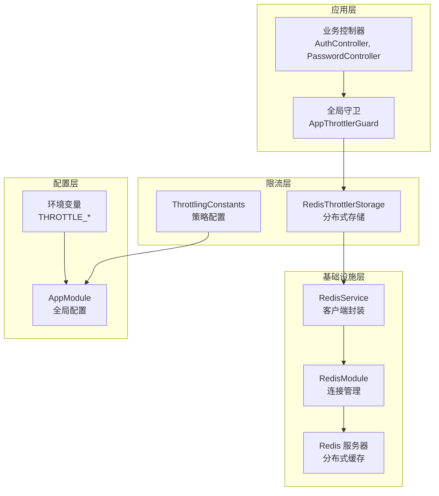
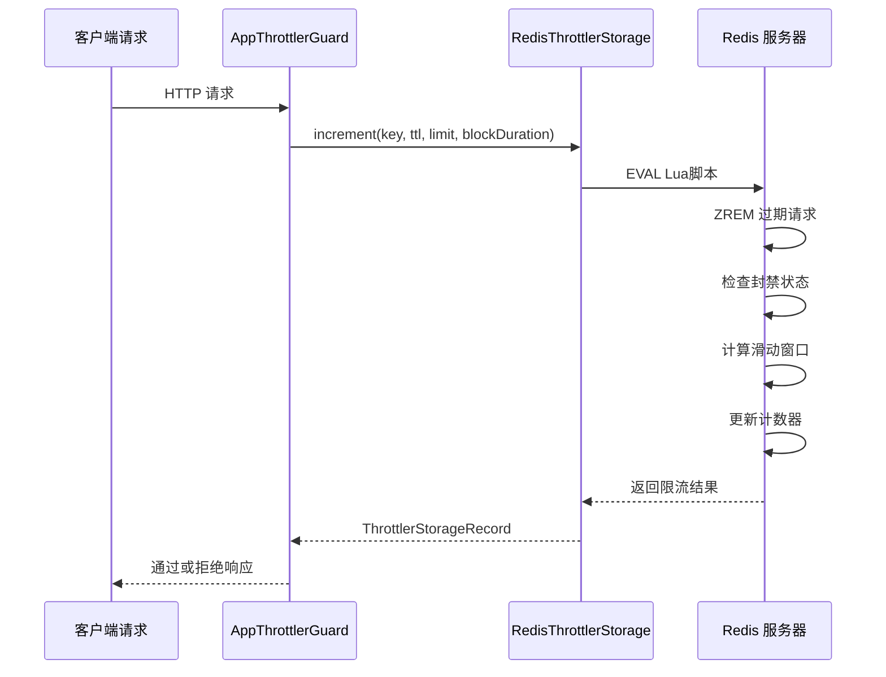
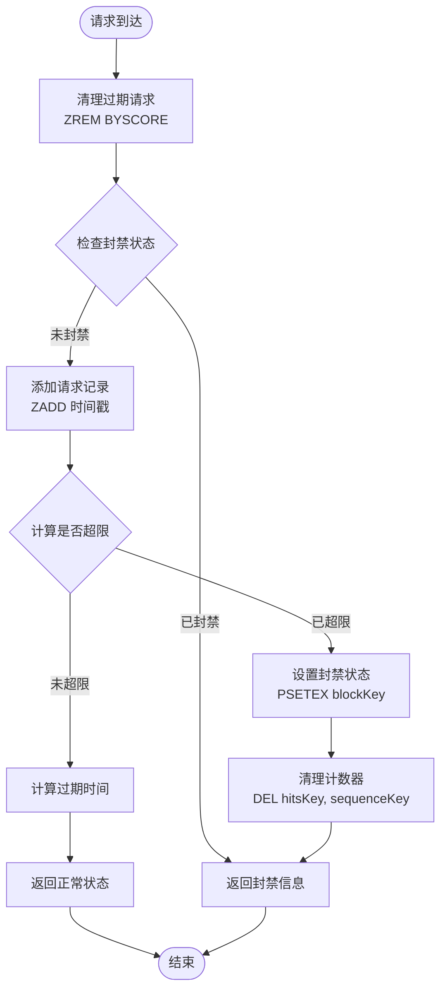
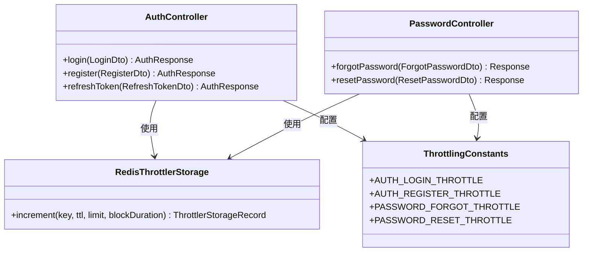

# Redis 分布式限流系统

<cite>
**本文档引用的文件**
- [apps/backend/src/common/throttling/index.ts](file://apps/backend/src/common/throttling/index.ts)
- [apps/backend/src/common/throttling/redis-throttler.storage.ts](file://apps/backend/src/common/throttling/redis-throttler.storage.ts)
- [apps/backend/src/common/throttling/throttling.constants.ts](file://apps/backend/src/common/throttling/throttling.constants.ts)
- [apps/backend/src/common/throttling/throttling.guard.ts](file://apps/backend/src/common/throttling/throttling.guard.ts)
- [apps/backend/src/redis/redis.service.ts](file://apps/backend/src/redis/redis.service.ts)
- [apps/backend/src/redis/redis.module.ts](file://apps/backend/src/redis/redis.module.ts)
- [apps/backend/src/app.module.ts](file://apps/backend/src/app.module.ts)
- [apps/backend/src/auth/auth.controller.ts](file://apps/backend/src/auth/auth.controller.ts)
- [apps/backend/src/auth/password.controller.ts](file://apps/backend/src/auth/password.controller.ts)
- [apps/backend/tests/common/throttling.guard.spec.ts](file://apps/backend/tests/common/throttling.guard.spec.ts)
- [apps/backend/tests/common/throttling.constants.spec.ts](file://apps/backend/tests/common/throttling.constants.spec.ts)
- [apps/backend/tests/common/redis-throttler.storage.spec.ts](file://apps/backend/tests/common/redis-throttler.storage.spec.ts)
</cite>

## 目录
1. [简介](#简介)
2. [项目结构](#项目结构)
3. [核心组件](#核心组件)
4. [架构概览](#架构概览)
5. [详细组件分析](#详细组件分析)
6. [依赖关系分析](#依赖关系分析)
7. [性能考虑](#性能考虑)
8. [故障排除指南](#故障排除指南)
9. [结论](#结论)

## 简介

本项目实现了一个基于 Redis 的分布式限流系统，采用滑动窗口算法确保在高并发场景下的精确限流控制。系统通过 NestJS 的 Throttler 模块与 Redis 集成，提供了全局和细粒度的请求频率控制机制。

该限流系统的核心特性包括：
- 分布式一致性：使用 Redis 作为共享存储，确保多实例部署时的一致性
- 滑动窗口算法：提供更精确的限流控制，避免固定窗口边界问题
- 多级限流策略：支持短、中、长三个时间窗口的组合限流
- 优雅降级：当 Redis 不可用时自动回退到内存存储
- 代理支持：正确处理反向代理场景下的客户端 IP 识别

## 项目结构

Redis 分布式限流系统主要分布在以下目录结构中：



**图表来源**
- [apps/backend/src/common/throttling/index.ts:1-4](file://apps/backend/src/common/throttling/index.ts#L1-L4)
- [apps/backend/src/redis/redis.service.ts:1-255](file://apps/backend/src/redis/redis.service.ts#L1-L255)
- [apps/backend/src/app.module.ts:1-160](file://apps/backend/src/app.module.ts#L1-L160)

**章节来源**
- [apps/backend/src/common/throttling/index.ts:1-4](file://apps/backend/src/common/throttling/index.ts#L1-L4)
- [apps/backend/src/redis/redis.service.ts:1-255](file://apps/backend/src/redis/redis.service.ts#L1-L255)
- [apps/backend/src/app.module.ts:1-160](file://apps/backend/src/app.module.ts#L1-L160)

## 核心组件

### RedisThrottlerStorage 分布式存储

RedisThrottlerStorage 是限流系统的核心存储组件，负责将请求计数和限流状态持久化到 Redis 中。

**主要功能特性：**
- 使用 Lua 脚本确保原子性操作
- 实现滑动窗口算法，避免边界问题
- 支持分级限流策略（短/中/长期窗口）
- 提供阻塞机制，超过限制时进行临时封禁

**关键数据结构：**
- `ThrottlerStorageRecord`: 存储限流结果的记录对象
- Redis 键结构：`rate_limit:{throttlerName}:{key}`
- 使用有序集合存储时间戳，支持范围查询

**章节来源**
- [apps/backend/src/common/throttling/redis-throttler.storage.ts:106-173](file://apps/backend/src/common/throttling/redis-throttler.storage.ts#L106-L173)

### ThrottlingConstants 限流策略配置

ThrottlingConstants 定义了各种业务场景的限流策略和默认配置。

**预定义策略：**
- `AUTH_LOGIN_THROTTLE`: 登录接口限流（3次/短窗口，5次/中窗口，5次/长窗口）
- `AUTH_REGISTER_THROTTLE`: 注册接口限流（2次/短窗口，3次/中窗口，3次/长窗口）
- `PASSWORD_FORGOT_THROTTLE`: 忘记密码限流（2次/短窗口，3次/中窗口，3次/长窗口）
- `FILE_UPLOAD_THROTTLE`: 文件上传限流（2次/短窗口，8次/中窗口，20次/长窗口）

**配置机制：**
- 支持环境变量覆盖默认配置
- 提供滑动窗口时间窗定义
- 支持阻塞持续时间配置

**章节来源**
- [apps/backend/src/common/throttling/throttling.constants.ts:67-198](file://apps/backend/src/common/throttling/throttling.constants.ts#L67-L198)

### AppThrottlerGuard 请求跟踪

AppThrottlerGuard 继承自 NestJS 的 ThrottlerGuard，专门处理代理环境下的客户端 IP 识别。

**IP 识别逻辑：**
1. 优先使用 `request.ip`（当信任代理时）
2. 回退到 `request.ips` 数组的最后一个有效 IP
3. 如果都不可用，使用 'unknown' 标识

**章节来源**
- [apps/backend/src/common/throttling/throttling.guard.ts:28-34](file://apps/backend/src/common/throttling/throttling.guard.ts#L28-L34)

## 架构概览

系统采用分层架构设计，确保限流逻辑与业务逻辑的分离：



**图表来源**
- [apps/backend/src/app.module.ts:118-123](file://apps/backend/src/app.module.ts#L118-L123)
- [apps/backend/src/common/throttling/redis-throttler.storage.ts:106-112](file://apps/backend/src/common/throttling/redis-throttler.storage.ts#L106-L112)
- [apps/backend/src/redis/redis.module.ts:26-84](file://apps/backend/src/redis/redis.module.ts#L26-L84)

## 详细组件分析

### Redis 分布式存储实现

RedisThrottlerStorage 使用 Lua 脚本实现原子性的限流计算：



**图表来源**
- [apps/backend/src/common/throttling/redis-throttler.storage.ts:114-156](file://apps/backend/src/common/throttling/redis-throttler.storage.ts#L114-L156)

**Lua 脚本核心逻辑：**

1. **初始化阶段**：设置键名和参数
2. **清理过期数据**：移除超出 TTL 的请求记录
3. **检查封禁状态**：如果处于封禁期，直接返回封禁信息
4. **更新计数**：增加序列号和时间戳
5. **计算限流**：检查是否超过限制
6. **封禁处理**：超过限制时设置封禁状态

**章节来源**
- [apps/backend/src/common/throttling/redis-throttler.storage.ts:18-87](file://apps/backend/src/common/throttling/redis-throttler.storage.ts#L18-L87)

### 滑动窗口算法实现

系统采用滑动窗口算法确保限流的精确性：



**图表来源**
- [apps/backend/src/common/throttling/redis-throttler.storage.ts:51-86](file://apps/backend/src/common/throttling/redis-throttler.storage.ts#L51-L86)

**算法特点：**
- 使用有序集合存储时间戳，支持范围查询
- 通过 `ZREMRANGEBYSCORE` 清理过期数据
- 确保跨窗口边界的精确计数
- 原子性操作保证数据一致性

**章节来源**
- [apps/backend/src/common/throttling/redis-throttler.storage.ts:36-71](file://apps/backend/src/common/throttling/redis-throttler.storage.ts#L36-L71)

### 业务控制器集成示例

系统在多个业务控制器中集成了限流策略：



**图表来源**
- [apps/backend/src/auth/auth.controller.ts:23-44](file://apps/backend/src/auth/auth.controller.ts#L23-L44)
- [apps/backend/src/auth/password.controller.ts:19-31](file://apps/backend/src/auth/password.controller.ts#L19-L31)

**章节来源**
- [apps/backend/src/auth/auth.controller.ts:1-81](file://apps/backend/src/auth/auth.controller.ts#L1-L81)
- [apps/backend/src/auth/password.controller.ts:1-38](file://apps/backend/src/auth/password.controller.ts#L1-L38)

## 依赖关系分析

系统各组件之间的依赖关系如下：

```mermaid
graph LR
subgraph "外部依赖"
A[NestJS]
B[@nestjs/throttler]
C[Redis]
D[ioredis]
end
subgraph "内部模块"
E[AppModule]
F[RedisModule]
G[CommonModule]
H[AuthModule]
I[PasswordModule]
end
subgraph "核心类"
J[RedisThrottlerStorage]
K[AppThrottlerGuard]
L[RedisService]
M[ThrottlingConstants]
end
E --> F
E --> G
E --> H
E --> I
F --> L
G --> J
G --> K
G --> M
J --> L
J --> C
L --> D
K --> B
M --> B
```

**图表来源**
- [apps/backend/src/app.module.ts:23-23](file://apps/backend/src/app.module.ts#L23-L23)
- [apps/backend/src/redis/redis.module.ts:1-84](file://apps/backend/src/redis/redis.module.ts#L1-L84)

**依赖特点：**
- 松耦合设计，通过接口抽象实现
- 支持运行时替换存储实现
- 渐进式集成，不影响现有功能

**章节来源**
- [apps/backend/src/app.module.ts:118-123](file://apps/backend/src/app.module.ts#L118-L123)
- [apps/backend/src/redis/redis.module.ts:26-84](file://apps/backend/src/redis/redis.module.ts#L26-L84)

## 性能考虑

### Redis 性能优化

1. **Lua 脚本原子性**：减少网络往返，确保操作原子性
2. **键设计优化**：使用命名空间前缀，便于管理和清理
3. **内存使用控制**：通过 TTL 自动清理过期数据
4. **连接池管理**：复用 Redis 连接，减少连接开销

### 缓存策略

- **默认 TTL 设置**：5分钟，平衡内存占用和准确性
- **键前缀管理**：使用 `CachePrefix.RATE_LIMIT` 统一管理
- **批量操作支持**：提供批量删除和清理功能

### 监控和诊断

- **日志记录**：详细的错误日志和性能指标
- **降级机制**：Redis 不可用时自动切换到内存存储
- **健康检查**：集成 Redis 健康检查功能

## 故障排除指南

### 常见问题及解决方案

**问题1：Redis 连接失败**
- 检查 Redis 服务器状态
- 验证连接配置（主机、端口、密码）
- 查看应用日志中的连接错误信息

**问题2：限流不生效**
- 确认全局守卫已正确配置
- 检查业务控制器上的 `@Throttle` 装饰器
- 验证环境变量配置

**问题3：代理环境下 IP 识别错误**
- 确保 `trustProxy` 配置正确
- 检查 `X-Forwarded-For` 头部
- 验证 `AppThrottlerGuard` 的 IP 识别逻辑

**章节来源**
- [apps/backend/tests/common/throttling.guard.spec.ts:1-43](file://apps/backend/tests/common/throttling.guard.spec.ts#L1-L43)
- [apps/backend/tests/common/throttling.constants.spec.ts:1-57](file://apps/backend/tests/common/throttling.constants.spec.ts#L1-L57)
- [apps/backend/tests/common/redis-throttler.storage.spec.ts:1-136](file://apps/backend/tests/common/redis-throttler.storage.spec.ts#L1-L136)

### 测试验证

系统包含完整的单元测试和集成测试：

- **IP 识别测试**：验证代理环境下的 IP 解析
- **配置加载测试**：验证环境变量覆盖机制
- **降级机制测试**：验证 Redis 不可用时的回退行为
- **滑动窗口测试**：验证跨窗口边界的限流准确性

**章节来源**
- [apps/backend/tests/common/throttling.guard.spec.ts:1-43](file://apps/backend/tests/common/throttling.guard.spec.ts#L1-L43)
- [apps/backend/tests/common/throttling.constants.spec.ts:1-57](file://apps/backend/tests/common/throttling.constants.spec.ts#L1-L57)
- [apps/backend/tests/common/redis-throttler.storage.spec.ts:1-136](file://apps/backend/tests/common/redis-throttler.storage.spec.ts#L1-L136)

## 结论

本 Redis 分布式限流系统通过精心设计的架构和实现，提供了可靠、高效的请求频率控制机制。系统的主要优势包括：

1. **分布式一致性**：通过 Redis 确保多实例部署时的限流一致性
2. **精确控制**：滑动窗口算法提供更准确的限流控制
3. **灵活配置**：支持多种限流策略和环境变量配置
4. **优雅降级**：在 Redis 不可用时自动回退到内存存储
5. **易于集成**：简洁的 API 设计，便于在现有项目中集成

该系统为高并发应用场景提供了坚实的基础设施支持，能够有效防止恶意请求和滥用行为，同时保持系统的稳定性和性能。