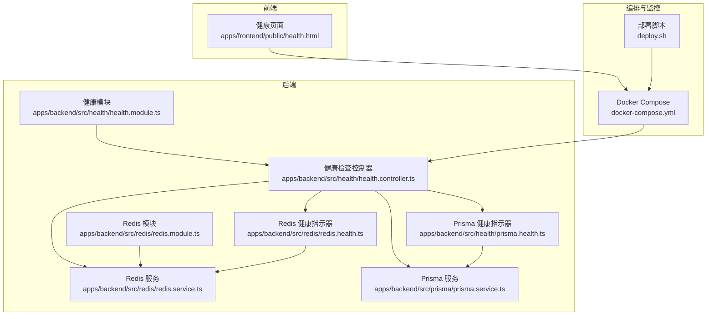
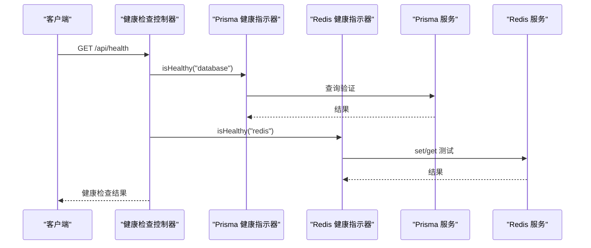
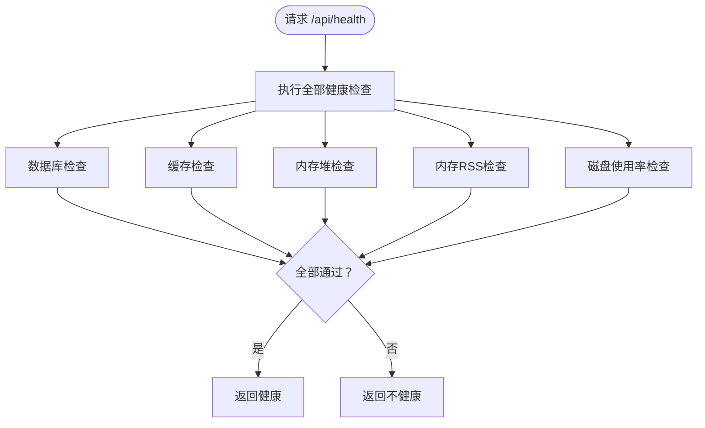
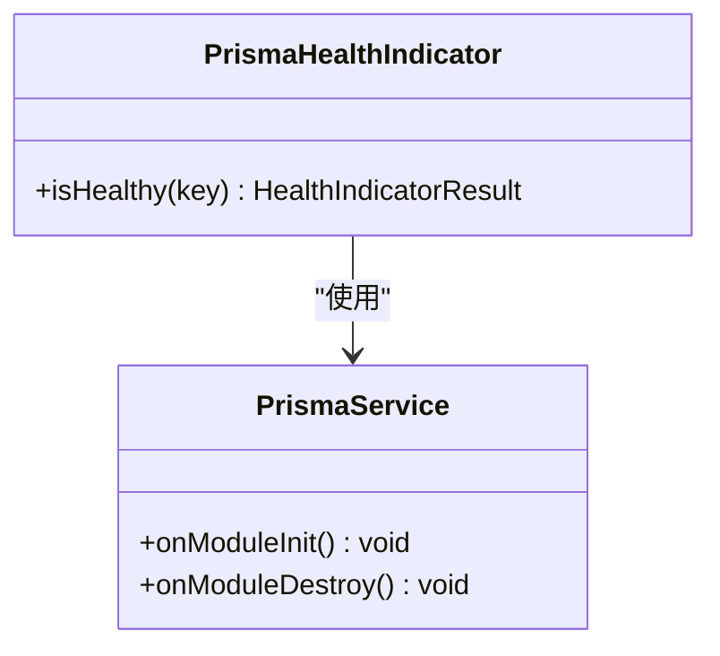
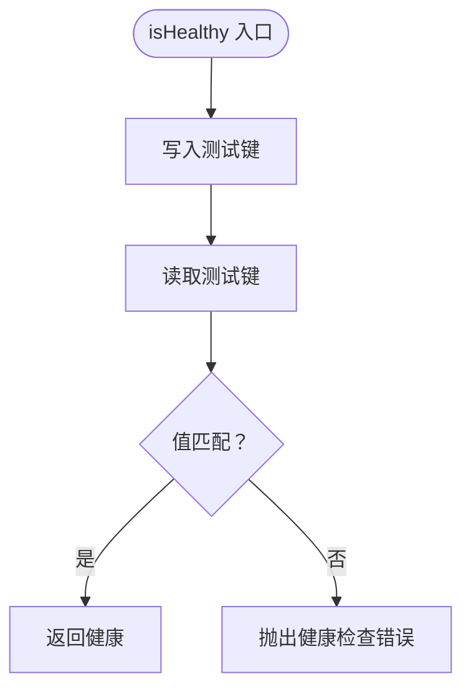
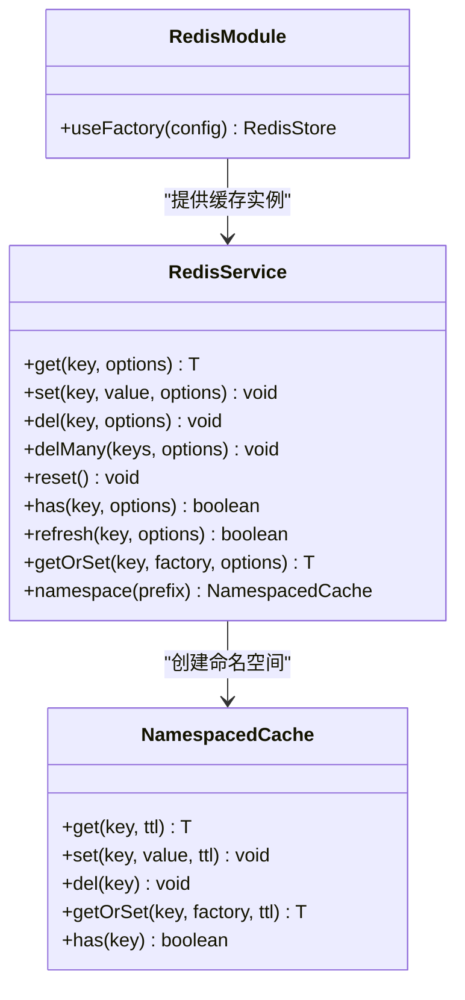
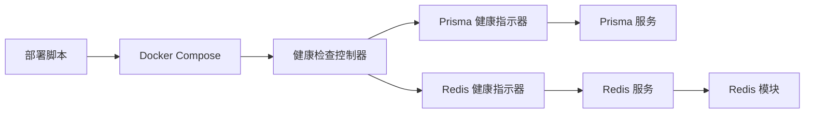

# 健康检查与监控

<cite>
**本文引用的文件**
- [apps/backend/src/health/health.controller.ts](file://apps/backend/src/health/health.controller.ts)
- [apps/backend/src/health/health.module.ts](file://apps/backend/src/health/health.module.ts)
- [apps/backend/src/health/prisma.health.ts](file://apps/backend/src/health/prisma.health.ts)
- [apps/backend/src/redis/redis.health.ts](file://apps/backend/src/redis/redis.health.ts)
- [apps/backend/src/redis/redis.module.ts](file://apps/backend/src/redis/redis.module.ts)
- [apps/backend/src/redis/redis.service.ts](file://apps/backend/src/redis/redis.service.ts)
- [apps/backend/src/prisma/prisma.service.ts](file://apps/backend/src/prisma/prisma.service.ts)
- [apps/frontend/public/health.html](file://apps/frontend/public/health.html)
- [docker-compose.yml](file://docker-compose.yml)
- [deploy.sh](file://deploy.sh)
- [apps/backend/tests/setup.ts](file://apps/backend/tests/setup.ts)
- [package.json](file://package.json)
</cite>

## 目录
1. [简介](#简介)
2. [项目结构](#项目结构)
3. [核心组件](#核心组件)
4. [架构总览](#架构总览)
5. [详细组件分析](#详细组件分析)
6. [依赖关系分析](#依赖关系分析)
7. [性能考量](#性能考量)
8. [故障排查指南](#故障排查指南)
9. [结论](#结论)
10. [附录](#附录)

## 简介
本文件面向健康检查与监控系统，系统性阐述应用的健康状态检测机制与指标采集方式，覆盖数据库连接、Redis 连接与外部服务的健康检查实现；说明如何开发与集成自定义健康检查器；给出监控指标定义与告警规则建议；提供 Prometheus 集成与 Grafana 可视化的落地方案；描述日志聚合与错误追踪思路；并包含性能基准测试与容量规划工具的实践建议。

## 项目结构
后端采用 NestJS + Terminus 的健康检查框架，结合 Prisma 与 Redis 缓存模块，提供数据库与缓存的健康检查能力，并通过 Docker Compose 完成容器级健康检查与日志聚合。

**图表来源**
- [apps/backend/src/health/health.controller.ts:1-77](file://apps/backend/src/health/health.controller.ts#L1-L77)
- [apps/backend/src/health/health.module.ts:1-14](file://apps/backend/src/health/health.module.ts#L1-L14)
- [apps/backend/src/health/prisma.health.ts:1-32](file://apps/backend/src/health/prisma.health.ts#L1-L32)
- [apps/backend/src/redis/redis.health.ts:1-43](file://apps/backend/src/redis/redis.health.ts#L1-L43)
- [apps/backend/src/redis/redis.service.ts:1-233](file://apps/backend/src/redis/redis.service.ts#L1-L233)
- [apps/backend/src/redis/redis.module.ts:1-84](file://apps/backend/src/redis/redis.module.ts#L1-L84)
- [apps/backend/src/prisma/prisma.service.ts:1-34](file://apps/backend/src/prisma/prisma.service.ts#L1-L34)
- [apps/frontend/public/health.html:1-10](file://apps/frontend/public/health.html#L1-L10)
- [docker-compose.yml:1-237](file://docker-compose.yml#L1-L237)
- [deploy.sh:122-150](file://deploy.sh#L122-L150)

**章节来源**
- [apps/backend/src/health/health.controller.ts:1-77](file://apps/backend/src/health/health.controller.ts#L1-L77)
- [apps/backend/src/health/health.module.ts:1-14](file://apps/backend/src/health/health.module.ts#L1-L14)
- [apps/backend/src/redis/redis.module.ts:1-84](file://apps/backend/src/redis/redis.module.ts#L1-L84)
- [apps/backend/src/prisma/prisma.service.ts:1-34](file://apps/backend/src/prisma/prisma.service.ts#L1-L34)
- [docker-compose.yml:1-237](file://docker-compose.yml#L1-L237)

## 核心组件
- 健康检查控制器：提供综合健康检查、存活探针与就绪探针三个端点，整合数据库、缓存、内存与磁盘健康检查。
- Prisma 健康指示器：通过一次轻量查询验证数据库连通性与可用性。
- Redis 健康指示器：通过写入/读取测试键验证缓存连通性与基本读写一致性。
- Redis 模块与服务：负责 Redis 连接池配置、TTL、键前缀、命名空间缓存与生命周期关闭。
- Docker Compose：定义容器健康检查策略与日志输出，支撑部署阶段的健康等待与运维可观测性。

**章节来源**
- [apps/backend/src/health/health.controller.ts:18-76](file://apps/backend/src/health/health.controller.ts#L18-L76)
- [apps/backend/src/health/prisma.health.ts:9-31](file://apps/backend/src/health/prisma.health.ts#L9-L31)
- [apps/backend/src/redis/redis.health.ts:10-42](file://apps/backend/src/redis/redis.health.ts#L10-L42)
- [apps/backend/src/redis/redis.module.ts:26-83](file://apps/backend/src/redis/redis.module.ts#L26-L83)
- [apps/backend/src/redis/redis.service.ts:51-202](file://apps/backend/src/redis/redis.service.ts#L51-L202)
- [docker-compose.yml:44-135](file://docker-compose.yml#L44-L135)

## 架构总览
下图展示健康检查在系统中的调用链路与依赖关系：

**图表来源**
- [apps/backend/src/health/health.controller.ts:34-51](file://apps/backend/src/health/health.controller.ts#L34-L51)
- [apps/backend/src/health/prisma.health.ts:19-30](file://apps/backend/src/health/prisma.health.ts#L19-L30)
- [apps/backend/src/redis/redis.health.ts:20-41](file://apps/backend/src/redis/redis.health.ts#L20-L41)
- [apps/backend/src/prisma/prisma.service.ts:23-32](file://apps/backend/src/prisma/prisma.service.ts#L23-L32)
- [apps/backend/src/redis/redis.service.ts:100-108](file://apps/backend/src/redis/redis.service.ts#L100-L108)

## 详细组件分析

### 健康检查控制器
- 综合健康检查：串联数据库、缓存、内存堆与 RSS、磁盘使用率检查。
- 存活探针：返回简单健康状态，用于容器存活探测。
- 就绪探针：仅检查数据库与缓存，确保业务流量接入前的关键依赖可用。

**图表来源**
- [apps/backend/src/health/health.controller.ts:34-51](file://apps/backend/src/health/health.controller.ts#L34-L51)

**章节来源**
- [apps/backend/src/health/health.controller.ts:18-76](file://apps/backend/src/health/health.controller.ts#L18-L76)

### Prisma 健康指示器
- 通过一次轻量 SQL 查询验证数据库连通性。
- 异常时抛出健康检查错误，包含可诊断的消息。

**图表来源**
- [apps/backend/src/health/prisma.health.ts:9-31](file://apps/backend/src/health/prisma.health.ts#L9-L31)
- [apps/backend/src/prisma/prisma.service.ts:6-34](file://apps/backend/src/prisma/prisma.service.ts#L6-L34)

**章节来源**
- [apps/backend/src/health/prisma.health.ts:9-31](file://apps/backend/src/health/prisma.health.ts#L9-L31)
- [apps/backend/src/prisma/prisma.service.ts:10-21](file://apps/backend/src/prisma/prisma.service.ts#L10-L21)

### Redis 健康指示器
- 通过写入/读取测试键并校验一致性验证缓存可用性。
- 异常时记录错误消息并标记不健康。

**图表来源**
- [apps/backend/src/redis/redis.health.ts:20-41](file://apps/backend/src/redis/redis.health.ts#L20-L41)

**章节来源**
- [apps/backend/src/redis/redis.health.ts:10-42](file://apps/backend/src/redis/redis.health.ts#L10-L42)

### Redis 模块与服务
- 模块：异步注册 Redis 连接，支持密码、DB、键前缀、默认 TTL、重试策略与 ready 检查。
- 服务：提供 get/set/del/delMany/reset/has/refresh/getOrSet 等统一缓存接口，内置日志与错误处理，支持命名空间缓存。

**图表来源**
- [apps/backend/src/redis/redis.module.ts:26-83](file://apps/backend/src/redis/redis.module.ts#L26-L83)
- [apps/backend/src/redis/redis.service.ts:51-233](file://apps/backend/src/redis/redis.service.ts#L51-L233)

**章节来源**
- [apps/backend/src/redis/redis.module.ts:26-83](file://apps/backend/src/redis/redis.module.ts#L26-L83)
- [apps/backend/src/redis/redis.service.ts:51-202](file://apps/backend/src/redis/redis.service.ts#L51-L202)

### 健康检查模块装配
- 注册 Terminus、Prisma 模块与健康控制器。
- 提供 Prisma 与 Redis 健康指示器。

**章节来源**
- [apps/backend/src/health/health.module.ts:8-13](file://apps/backend/src/health/health.module.ts#L8-L13)

### 前端健康页面
- 提供静态健康页面，便于反向代理或外部探针访问。

**章节来源**
- [apps/frontend/public/health.html:1-10](file://apps/frontend/public/health.html#L1-L10)

## 依赖关系分析
- 控制器依赖健康检查服务与多个健康指示器。
- 健康指示器分别依赖 Prisma 与 Redis 服务。
- Redis 模块通过配置服务动态生成连接参数，注入缓存实例。
- Docker Compose 在容器层面定义健康检查与日志策略，部署脚本在启动后轮询等待后端就绪。

**图表来源**
- [apps/backend/src/health/health.controller.ts:19-25](file://apps/backend/src/health/health.controller.ts#L19-L25)
- [apps/backend/src/health/prisma.health.ts:11-12](file://apps/backend/src/health/prisma.health.ts#L11-L12)
- [apps/backend/src/redis/redis.health.ts:12-12](file://apps/backend/src/redis/redis.health.ts#L12-L12)
- [apps/backend/src/redis/redis.module.ts:29-78](file://apps/backend/src/redis/redis.module.ts#L29-L78)
- [docker-compose.yml:126-135](file://docker-compose.yml#L126-L135)
- [deploy.sh:440-446](file://deploy.sh#L440-L446)

**章节来源**
- [apps/backend/src/health/health.controller.ts:19-25](file://apps/backend/src/health/health.controller.ts#L19-L25)
- [apps/backend/src/redis/redis.module.ts:29-78](file://apps/backend/src/redis/redis.module.ts#L29-L78)
- [docker-compose.yml:126-135](file://docker-compose.yml#L126-L135)
- [deploy.sh:440-446](file://deploy.sh#L440-L446)

## 性能考量
- 健康检查应保持“轻量”原则：数据库与缓存检查使用最小代价操作；内存与磁盘检查设定合理阈值。
- Redis 连接池与重试策略：模块已内置重试与 ready 检查，建议结合实际并发与延迟调优。
- 日志与资源：容器日志限制单文件大小与保留数量，避免磁盘压力影响健康检查。

**章节来源**
- [apps/backend/src/redis/redis.module.ts:56-64](file://apps/backend/src/redis/redis.module.ts#L56-L64)
- [docker-compose.yml:13-17](file://docker-compose.yml#L13-L17)

## 故障排查指南
- 健康检查失败定位
  - 数据库：确认连接字符串与网络可达；查看 Prisma 初始化与断开逻辑。
  - 缓存：确认 Redis 密码、端口、DB 选择与键前缀；检查写入/读取测试流程。
- 容器健康等待
  - 部署脚本会轮询后端健康状态，若超时则打印容器状态与最后日志，便于快速定位。
- 日志抑制与测试稳定性
  - 测试环境对部分日志进行抑制以提升可读性，避免噪音干扰。

**章节来源**
- [apps/backend/src/prisma/prisma.service.ts:10-21](file://apps/backend/src/prisma/prisma.service.ts#L10-L21)
- [apps/backend/src/redis/redis.health.ts:24-41](file://apps/backend/src/redis/redis.health.ts#L24-L41)
- [deploy.sh:133-150](file://deploy.sh#L133-L150)
- [apps/backend/tests/setup.ts:3-64](file://apps/backend/tests/setup.ts#L3-L64)

## 结论
本系统通过 NestJS + Terminus 提供标准化的健康检查能力，结合 Prisma 与 Redis 的专用健康指示器，覆盖核心依赖链路。Docker Compose 与部署脚本进一步强化了容器级健康与部署可观测性。建议在此基础上扩展自定义健康检查器与监控指标，完善 Prometheus/Grafana 监控与告警体系。

## 附录

### 自定义健康检查器开发与集成
- 开发步骤
  - 新建类继承健康指示器基类，实现 isHealthy 方法，返回状态与可选上下文。
  - 在模块中注册该指示器并注入所需依赖（如第三方 SDK、HTTP 客户端等）。
  - 在控制器中通过 HealthCheckService 的 check 回调数组集成新指示器。
- 集成示例路径
  - 健康控制器集成点：[apps/backend/src/health/health.controller.ts:34-51](file://apps/backend/src/health/health.controller.ts#L34-L51)
  - 健康模块注册点：[apps/backend/src/health/health.module.ts:8-13](file://apps/backend/src/health/health.module.ts#L8-L13)
  - 参考现有实现：[apps/backend/src/health/prisma.health.ts:9-31](file://apps/backend/src/health/prisma.health.ts#L9-L31)、[apps/backend/src/redis/redis.health.ts:10-42](file://apps/backend/src/redis/redis.health.ts#L10-L42)

**章节来源**
- [apps/backend/src/health/health.controller.ts:34-51](file://apps/backend/src/health/health.controller.ts#L34-L51)
- [apps/backend/src/health/health.module.ts:8-13](file://apps/backend/src/health/health.module.ts#L8-L13)
- [apps/backend/src/health/prisma.health.ts:9-31](file://apps/backend/src/health/prisma.health.ts#L9-L31)
- [apps/backend/src/redis/redis.health.ts:10-42](file://apps/backend/src/redis/redis.health.ts#L10-L42)

### 监控指标定义与告警规则（建议）
- 指标建议
  - 健康检查状态：up{component=~"database|redis|backend"}（Prometheus 抓取后端健康端点）
  - 请求时延与错误率：基于网关/反向代理日志统计
  - 资源使用：内存、CPU、磁盘、连接数（容器指标）
  - 缓存命中率：基于缓存命令统计
- 告警规则示例（表达式片段）
  - 后端不可用：up{job="backend"} == 0 或健康端点返回非 200
  - 数据库不可用：up{component="database"} == 0
  - 缓存不可用：up{component="redis"} == 0
  - 内存/磁盘阈值：node_memory_MemAvailable_bytes < X 或 filesystem_space_used_percent > Y%
  - 请求错误率突增：increase(http_requests_total{status=~"5.."}[5m]) / increase(http_requests_total[5m]) > Z%

[本节为通用监控建议，不直接分析具体文件，故无“章节来源”]

### Prometheus 集成与 Grafana 可视化（建议）
- Prometheus 抓取
  - 配置 job 抓取后端健康端点与容器指标
- Grafana 仪表板
  - 组件健康状态面板、资源使用趋势、错误率与 P95/P99 时延
- 日志聚合
  - 使用容器日志驱动（json-file）并持久化，结合 GoAccess 实时访问统计

[本节为通用集成建议，不直接分析具体文件，故无“章节来源”]

### 日志聚合与错误追踪（建议）
- 日志
  - 容器日志限制与轮转，前端 Nginx 访问日志持久化，GoAccess 实时报表
- 错误追踪
  - 建议引入错误上报 SDK（如 Sentry），在服务层捕获异常并上报

**章节来源**
- [docker-compose.yml:177-204](file://docker-compose.yml#L177-L204)

### 性能基准测试与容量规划（建议）
- 基准测试
  - 使用压测工具对健康端点与关键业务接口施压，记录响应时间与错误率
- 容量规划
  - 基于 CPU/内存/磁盘/连接数与缓存命中率，评估最大并发与资源配额
- 部署与运维
  - 使用部署脚本的健康等待与日志抓取能力，结合容器健康检查保障上线质量

**章节来源**
- [deploy.sh:440-446](file://deploy.sh#L440-L446)
- [docker-compose.yml:126-135](file://docker-compose.yml#L126-L135)